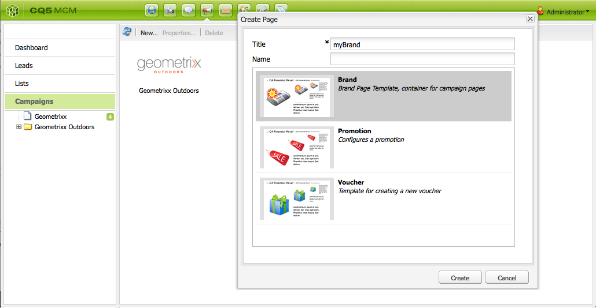
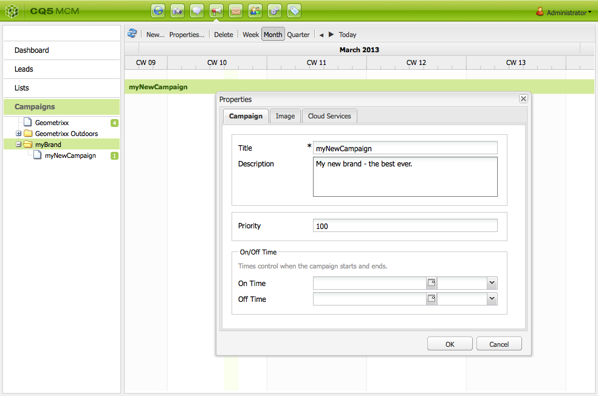
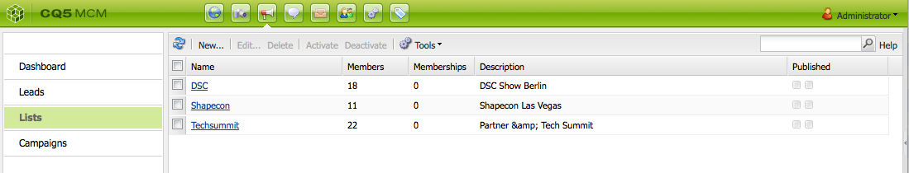

# Configuración de la campaña{#setting-up-your-campaign}

En la configuración de una nueva campaña intervienen los siguientes pasos (genéricos):

1. [Cree una marca](#creating-a-new-brand) para incluir sus campañas.
1. Si es necesario, puede [definir las propiedades de la nueva marca](#defining-the-properties-for-your-new-brand).
1. [Cree una campaña](#creating-a-new-campaign) para incluir experiencias; por ejemplo, páginas de teaser o un boletín.
1. Si es necesario, puede [definir las propiedades de la nueva campaña](#defining-the-properties-for-your-new-campaign).

A continuación, según el tipo de experiencias que esté creando, deberá [crear una experiencia](#creating-a-new-experience). Los detalles de la experiencia y las acciones tras su creación dependerán del tipo de experiencia que desee crear:

* Si se crea un teaser:

   1. [Cree una experiencia de teaser](/help/sites-classic-ui-authoring/classic-personalization-campaigns.md#creatingateaserexperience).
   1. [Añada contenido al teaser](/help/sites-classic-ui-authoring/classic-personalization-campaigns.md#addingcontenttoyourteaser).
   1. [Cree un Touchpoint para el teaser](/help/sites-classic-ui-authoring/classic-personalization-campaigns.md#creatingatouchpointforyourteaser) (añada el teaser a una página de contenido).

* Si se crea un boletín:

   1. [Cree una experiencia de boletín](/help/sites-classic-ui-authoring/classic-personalization-campaigns.md#creatinganewsletterexperience).
   1. [Añada contenido al boletín.](/help/sites-classic-ui-authoring/classic-personalization-campaigns.md#addingcontenttonewsletters)
   1. [Personalice el boletín.](/help/sites-classic-ui-authoring/classic-personalization-campaigns.md#personalizingnewsletters)
   1. [Cree una página de aterrizaje atractiva para el boletín](/help/sites-classic-ui-authoring/classic-personalization-campaigns.md#settingupanewsletterlandingpage).
   1. [Envíe el boletín](/help/sites-classic-ui-authoring/classic-personalization-campaigns.md#sendingnewsletters) a los suscriptores o posibles clientes.

* Si se crea una oferta de Adobe Target (antes Test&amp;Target):

   1. [Cree una experiencia de oferta de Adobe Target](/help/sites-classic-ui-authoring/classic-personalization-campaigns.md#creatingatesttargetofferexperience).
   1. [Integración con Adobe Target](/help/sites-classic-ui-authoring/classic-personalization-campaigns.md#integratewithadobetesttarget)

>[!NOTE]
>
>Consulte [Segmentación](/help/sites-administering/campaign-segmentation.md) para obtener instrucciones detalladas sobre la definición de los segmentos.

## Creación de una nueva marca {#creating-a-new-brand}

Para crear una nueva marca:

1. Abra **MCM** y seleccione **Campañas** en el panel izquierdo.

1. Seleccione **Nuevo...** para introducir el **Título** y **Nombre** y la plantilla que se utilizará para la nueva marca:

   

1. Haga clic en **Crear**. La nueva marca se mostrará en MCM (con un icono predeterminado).

### Definición de las propiedades de la nueva marca  {#defining-the-properties-for-your-new-brand}

1. Desde **Campañas** en el panel izquierdo, seleccione el icono de la nueva marca en el panel derecho y haga clic en **Propiedades...**

   Puede especificar un **Título**, una **Descripción** y una imagen que se utilizará como icono.

   

1. Haga clic en **Aceptar** para guardar.

### Creación de una nueva campaña   {#creating-a-new-campaign}

Para crear una nueva campaña:

1. Desde **Campañas**, seleccione la nueva marca en el panel izquierdo o haga doble clic en el icono del panel derecho.

   Se mostrará la información general (estará vacía si la marca es nueva).

1. Haga clic en **Nuevo...** y especifique el **Título**, **Nombre** y la plantilla que se utilizarán para la nueva campaña.

   

1. Haga clic en **Crear**. La nueva campaña se mostrará en el MCM.

### Definición de propiedades para la nueva campaña  {#defining-the-properties-for-your-new-campaign}

Configure las propiedades de campaña que controlan el comportamiento:

* **Prioridad:** la prioridad de la campaña en relación a otras campañas. Cuando varias campañas están activadas de forma simultánea, la campaña que tenga mayor prioridad será la que controle la experiencia de los visitantes.
* **Tiempo activo e inactivo:** estas propiedades controlan el período de tiempo en que la campaña controla la experiencia del visitante. La propiedad Tiempo activo controla el momento en que la campaña comienza a controlar la experiencia. La propiedad Tiempo inactivo controla el momento en que la campaña deja de controlar la experiencia.
* **Imagen:** la imagen que representa la campaña en AEM.
* **Servicios de nube:** la configuración del servicio de nube con que se integra la campaña. (Consulte [Integración con Adobe Marketing Cloud](/help/sites-administering/marketing-cloud.md)).

* **Adobe Target:** propiedades para la configuración de las campañas que se integran con Adobe Target. (Consulte [Integración con Adobe Target](/help/sites-administering/target.md)).

1. En **Campañas**, seleccione la marca. En el panel derecho, seleccione la campaña y haga clic en **Propiedades**.

   Puede especificar varias propiedades, incluir un **Título**, una **Descripción** y los **Cloud Services** que desee.

   

1. Haga clic en **Aceptar** para guardar.

### Creación de una nueva experiencia  {#creating-a-new-experience}

El procedimiento de creación de una nueva experiencia dependerá del tipo de experiencia:

* [Creación de un teaser](/help/sites-classic-ui-authoring/classic-personalization-campaigns.md#creatingateaser)
* [Creación de un boletín](/help/sites-classic-ui-authoring/classic-personalization-campaigns.md#creatinganewsletter)
* [Creación de una oferta de Adobe Target](/help/sites-classic-ui-authoring/classic-personalization-campaigns.md#creatingatesttargetoffer)

>[!NOTE]
>
>Como en versiones anteriores, podrá crear la experiencia como una página en la consola **Sitios web** (y las páginas de este tipo creadas en versiones anteriores son totalmente compatibles).
>
>Se recomienda utilizar MCM para crear experiencias.

### Configuración de la nueva experiencia  {#configuring-your-new-experience}

Ahora que ha creado la estructura básica de la experiencia, deberá continuar con las acciones siguientes, según el tipo de experiencia:

* [Teaser](/help/sites-classic-ui-authoring/classic-personalization-campaigns.md#teasers):

   * [Conecte la página de teaser con los segmentos de visitantes.](/help/sites-classic-ui-authoring/classic-personalization-campaigns.md#applyingasegmenttoyourteaser)
   * [Cree un Touchpoint para el teaser](/help/sites-classic-ui-authoring/classic-personalization-campaigns.md#creatingatouchpointforyourteaser) (añada el teaser a una página de contenido).

* [Boletín](/help/sites-classic-ui-authoring/classic-personalization-campaigns.md#newsletters):

   * [Añada contenido al boletín.](/help/sites-classic-ui-authoring/classic-personalization-campaigns.md#addingcontenttonewsletters)
   * [Personalice el boletín.](/help/sites-classic-ui-authoring/classic-personalization-campaigns.md#personalizingnewsletters)
   * [Envíe el boletín](/help/sites-classic-ui-authoring/classic-personalization-campaigns.md#sendingnewsletters) a los suscriptores o posibles clientes.
   * [Cree una página de aterrizaje atractiva para el boletín](/help/sites-classic-ui-authoring/classic-personalization-campaigns.md#settingupanewsletterlandingpage).

* [Oferta de Adobe Target](/help/sites-classic-ui-authoring/classic-personalization-campaigns.md#testtargetoffers):

   * [Integración con Adobe Target](/help/sites-administering/target.md)

### Adición de un nuevo touchpoint {#adding-a-new-touchpoint}

Si ya dispone de experiencias, puede añadir un touchpoint directamente desde la vista de calendario de MCM:

1. Seleccione la vista de calendario de la campaña.

1. Haga clic en **Añadir Touchpoint...** para abrir el cuadro de diálogo. Especifique la experiencia que desee añadir:

   

1. Haga clic en **Aceptar** para guardar.

## Uso de los posibles clientes {#working-with-leads}

>[!NOTE]
>
>Adobe no tiene previsto mejorar aún más esta capacidad (Gestión de posibles clientes).
>La recomendación es [ aprovechar Adobe Campaign y la integración a AEM](/help/sites-administering/campaign.md).

En AEM MCM, es posible organizar y añadir posibles clientes introduciéndolos manualmente o importando una lista separada por comas; por ejemplo, una lista de correo. Las formas adicionales de generar posibles clientes consisten en los registros a newsletters y comunidades (si se configuran, pueden generar un flujo de trabajo que rellene los posibles clientes).

Los leads se suelen categorizar y situar en una lista para que más adelante se puedan realizar operaciones en toda la lista como, por ejemplo, enviar un correo electrónico personalizado a una lista concreta.

En el panel, puede acceder a todos los leads haciendo clic en **Leads** en el panel izquierdo. También puede acceder a los posibles clientes desde el panel **Listas**.

>[!NOTE]
>
>Para agregar o modificar avatares de usuarios, abra la nube de secuencias de clic (clickstream cloud) (Ctrl+Alt+c), cargue el perfil y haga clic en **Editar**.

### Creación de nuevos posibles clientes  {#creating-new-leads}

Una vez que haya creado los nuevos posibles clientes, asegúrese de [activarlos](#activating-or-deactivating-leads) para que pueda hacer el seguimiento de su actividad en caso de que se publique la instancia y personalicen su experiencia.

Para crear un nuevo lead de forma manual:

1. En AEM, vaya a MCM. En el panel, haga clic en **Posibles clientes**.
1. Haga clic en **Nuevo**. Se abrirá la ventana **Crear nuevo**.

   

1. Introduzca información en los campos, según sea necesario. Haga clic en la ficha **Dirección**.

   

1. Especifique la dirección, si es necesario. Haga clic en **Guardar** para guardar el posible cliente. Si necesita añadir posibles clientes adicionales, haga clic en **Guardar y nuevo**.

   El nuevo posible cliente aparece en el panel Posibles clientes. Cuando haga clic en la entrada, toda la información introducida aparecerá en el panel derecho. Tras crear un posible cliente, puede añadirlo a una lista.

   

### Activación o desactivación de posibles clientes {#activating-or-deactivating-leads}

La activación de posibles clientes ayuda a realizar un seguimiento de su actividad en caso de publicación y permite personalizar su experiencia. Cuando ya no necesite realizar un seguimiento de la actividad, puede desactivarlos.

Para activar o desactivar leads:

1. En AEM, vaya a MCM y haga clic en **Posibles clientes**.

1. Seleccione los leads que desee activar o desactivar y haga clic en **Activar** o **Desactivar**.

   

   Tal y como sucede con las páginas de AEM, el estado de publicación se indica en la columna **Publicado**.

   

### Importación de nuevos posibles clientes {#importing-new-leads}

Cuando se importan nuevos posibles clientes, se pueden añadir automáticamente a una lista existente o crearse una nueva lista que incluya estos posibles clientes.

Para importar posibles clientes desde una lista separada por comas:

1. En AEM, vaya a MCM y haga clic en **Posibles clientes**.

   >[!NOTE]
   >
   >Si lo prefiere, puede importar posibles clientes realizando lo siguiente:
   >
   >
   >
   >    * En el panel, haga clic en **Importar leads** en el panel **Listas**.
      >
      >    
   * Haga clic en **Listas** y en el menú **Herramientas**, seleccione **Importar leads**.

1. En el menú **Herramientas**, seleccione **Importar** **Leads**.

1. Introduzca la información tal y como se describe en los Datos de ejemplo. Se pueden importar los campos siguientes: email,familyName,givenName,gender,aboutMe,city,country,phoneNumber,postalCode,region,streetAddress

   >[!NOTE]
   >
   >Las primera fila de la lista CSV consiste en etiquetas predefinidas que deben escribirse exactamente como en el ejemplo:
   >
   >
   >`email,givenName,familyName` - si se escribe como  `givenname`por ejemplo, el sistema no lo reconocerá.

   

1. Haga clic en **Siguiente**. Aquí se previsualizan los posibles clientes para garantizar que sean precisos.

   

1. Haga clic en **Siguiente**. Seleccione la lista a la que desee que pertenezcan los posibles clientes. Si no desea que pertenezcan a ninguna lista, elimine la información en el campo. De forma predeterminada, AEM crea un nombre de lista que incluye la fecha y la hora. Haga clic en **Importar**.

   

   El nuevo posible cliente aparece en el panel Posibles clientes. Cuando hace clic en la entrada, toda la información introducida aparece en el panel derecho. Tras crear un posible cliente, puede añadirlo a una lista.

### Añadir posibles clientes a listas  {#adding-leads-to-lists}

Para añadir leads a listas preexistentes:

1. En MCM, haga clic en **Leads** para ver todos los leads disponibles.

1. Seleccione los leads que desee añadir a una lista, activando la casilla de verificación situada junto al lead. Se pueden añadir tantos posibles clientes como se desee.

   

1. En el menú **Herramientas**, seleccione **Añadir a lista...** Se abrirá la ventana **Añadir a lista**.

   

1. Seleccione a qué lista desea añadir los posibles clientes y haga clic en **Aceptar**. Los leads se añadirán a las listas adecuadas.

### Visualización de información de leads  {#viewing-lead-information}

Para ver la información del posible cliente en MCM, active la casilla situada junto al mismo y se abrirá un panel derecho con toda la información, incluyendo a la afiliación de la lista.

### Modificar posibles clientes existentes {#modifying-existing-leads}

Para modificar la información del lead existente:

1. En MCM, haga clic en **Leads**. En la lista de posibles clientes, active la casilla de verificación situada junto al posible cliente que desee editar. Toda la información del posible cliente aparece en el panel derecho.

   

   >[!NOTE]
   >
   >Solo puede editar un solo posible cliente cada vez. Si necesita modificar los leads que formen parte de la misma lista, puede modificar la lista en su lugar.

1. Haga clic en **Editar**. Se abrirá la ventana **Editar posible cliente**.

   

1. Realice las ediciones necesarias y haga clic en **Guardar** para guardar los cambios.

   >[!NOTE]
   >
   >Para cambiar el avatar del lead, vaya al perfil de usuario. Puede cargar el perfil en clickstream cloud, presionando CTRL+ALT+c, haciendo clic en **Cargar** y, a continuación, seleccionado el perfil.

### Eliminación de leads existentes  {#deleting-existing-leads}

Para eliminar posibles clientes existentes en MCM, active la casilla situada junto al posible cliente y haga clic en **Eliminar**. El posible cliente se eliminará de la lista de posibles clientes y de todas las listas asociadas.

>[!NOTE]
>
>Antes de proceder a la eliminación, AEM confirma que desea eliminar el posible cliente existente. Una vez eliminadas, no se pueden recuperar.

## Uso de listas  {#working-with-lists}

>[!NOTE]
>
>Adobe no tiene previsto mejorar aún más esta capacidad (Gestión de listas).
>La recomendación es [ aprovechar Adobe Campaign y la integración a AEM](/help/sites-administering/campaign.md).

Las listas permiten organizar los posibles clientes en grupos. Con las listas, puede dirigir sus campañas de marketing a un grupo determinado de usuarios; por ejemplo, puede enviar un boletín dirigido a una lista. Las vistas pueden verse en MCM, en el panel, o bien, al hacer clic en **Listas**. En ambos lugares se proporciona el nombre de lista y su número de miembros.

Si hace clic en **Listas**, también puede ver si la lista es miembro de otra lista y ver una descripción.

### Crear nuevas listas {#creating-new-lists}

Para crear una nueva lista (grupo):

1. En el panel de MCM, haga clic en **New List...** (Nueva lista) o en **Lists**, haga clic en **New** (Nueva) ... Se abrirá la ventana Create List (Crear lista).

   

1. Especifique un nombre (obligatorio) y, si lo desea, una descripción y haga clic en **Guardar**. La lista aparece en el panel **Listas**.

   

### Modificar listas existentes {#modifying-existing-lists}

Para modificar una lista existente:

1. En MCM, haga clic en **Listas**.

1. En la lista, active la casilla de verificación situada junto a la lista que desee editar y haga clic en **Edit** (Editar). Se abrirá la ventana **Editar lista**.

   

   >[!NOTE]
   >
   >Sólo se puede editar una lista a la vez.

1. Realice ediciones, según sea necesario, y haga clic en **Save** (Guardar) para guardar los cambios.

### Eliminación de listas existentes  {#deleting-existing-lists}

Para eliminar listas existentes en MCM, active la casilla situada junto a la lista y haga clic en **Eliminar**. La lista se eliminará. Los posibles clientes que estaban afiliados a la lista no se eliminarán; sólo se eliminará la afiliación con la lista.

>[!NOTE]
>
>Antes de proceder a la eliminación, AEM confirma que desea eliminar las listas existentes. Una vez eliminadas, no se pueden recuperar.

### Combinación de listas  {#merging-lists}

Es posible combinar una lista existente con otra lista. Cuando se hace esto, la lista que se combina pasa a ser miembro de la otra lista. Aún existe como entidad independiente y no se debe eliminar.

Las listas se pueden combinar si se dispone de la misma conferencia en dos ubicaciones distintas y se desea combinarlas en una lista de asistentes de todas las conferencias.

Para combinar listas existentes:

1. En MCM, haga clic en **Listas**.

1. Seleccione la lista que desee combinar en otra lista, activando la casilla de verificación situada junto a la lista.

1. En el menú **Tools** (Herramientas), seleccione **Merge List** (Combinar lista).

   >[!NOTE]
   >
   >Sólo se puede combinar una lista cada vez.

1. En la ventana **Merge List** (Combinar lista), seleccione la lista que desee combinar y haga clic en **OK** (Aceptar).

   

   La lista combinada debe aumentar en un miembro. Para ver que la lista se ha combinado, seleccione la lista combinada y en el menú **Tools** (Herramientas), elija **Show Leads** (Mostrar leads).

1. Repita el paso hasta que haya combinado todas las listas que desee.

   

>[!NOTE]
>
>La eliminación de una lista combinada de su pertenencia resulta idéntico a eliminar un posible cliente de una lista. Abra la ficha **Listas**, seleccione la lista que incluya la lista combinada y elimine la pertenencia haciendo clic en el círculo rojo situado junto a la lista.

### Visualizar posibles clientes en listas  {#viewing-leads-in-lists}

En cualquier momento, puede ver qué leads pertenecen a una lista concreta buscando o desplazándose entre sus miembros.

Para ver los leads que pertenecen a una lista:

1. En MCM, haga clic en **Listas**.

1. Active la casilla de verificación situada junto a la lista en la que desea ver sus miembros.

1. En el menú **Herramientas**, seleccione **Mostrar posibles clientes**. AEM muestra los posibles clientes que forman parte de esa lista. Puede desplazarse por la lista o buscar miembros concretos.

   >[!NOTE]
   >
   >Asimismo, puede eliminar leads de una lista seleccionándolos y posteriormente haciendo clic en **Remove Membership** (Eliminar pertenencia).

   

1. Haga clic en **Cerrar** para volver a MCM.
