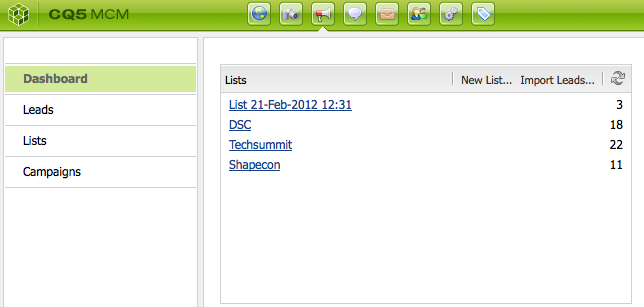

# Configuración de la campaña{#setting-up-your-campaign}

La configuración de una nueva campaña incluye los siguientes pasos (genéricos):

1. [Crear una marca](#creating-a-new-brand) para mantener sus campañas.
1. Si es necesario, puede [defina las propiedades de la nueva marca](#defining-the-properties-for-your-new-brand).
1. [Creación de una campaña](#creating-a-new-campaign) para albergar experiencias; por ejemplo, páginas de teaser o un boletín informativo.
1. Si es necesario, puede [defina las propiedades de la nueva campaña](#defining-the-properties-for-your-new-campaign).

A continuación, según el tipo de experiencias que cree, debe [crear una experiencia](#creating-a-new-experience). Los detalles de la experiencia y las acciones que siguen a su creación dependen del tipo de experiencia que desee crear:

* Si crea un teaser:

   1. [Crear una experiencia de teaser](/help/sites-classic-ui-authoring/classic-personalization-campaigns.md#creatingateaserexperience).
   1. [Añadir contenido al teaser](/help/sites-classic-ui-authoring/classic-personalization-campaigns.md#addingcontenttoyourteaser).
   1. [Creación de un punto de contacto para el teaser](/help/sites-classic-ui-authoring/classic-personalization-campaigns.md#creatingatouchpointforyourteaser) (añada el teaser a una página de contenido).

* Si crea una newsletter:

   1. [Crear una experiencia de newsletter](/help/sites-classic-ui-authoring/classic-personalization-campaigns.md#creatinganewsletterexperience).
   1. [Añadir contenido al boletín informativo.](/help/sites-classic-ui-authoring/classic-personalization-campaigns.md#addingcontenttonewsletters)
   1. [Personalice la newsletter.](/help/sites-classic-ui-authoring/classic-personalization-campaigns.md#personalizingnewsletters)
   1. [Crear una página de aterrizaje de newsletter atractiva](/help/sites-classic-ui-authoring/classic-personalization-campaigns.md#settingupanewsletterlandingpage).
   1. [Enviar la newsletter](/help/sites-classic-ui-authoring/classic-personalization-campaigns.md#sendingnewsletters) a suscriptores o posibles clientes.

* Si crea una oferta de Adobe Target (anteriormente Test&amp;Target):

   1. [Crear una experiencia de oferta de Adobe Target](/help/sites-classic-ui-authoring/classic-personalization-campaigns.md#creatingatesttargetofferexperience).
   1. [Integración con Adobe Target](/help/sites-classic-ui-authoring/classic-personalization-campaigns.md#integratewithadobetesttarget)

>[!NOTE]
>
>Consulte [Segmentación](/help/sites-administering/campaign-segmentation.md) para obtener instrucciones detalladas sobre cómo definir los segmentos.

## Crear una nueva marca {#creating-a-new-brand}

1. Abra el **MCM** y seleccione **Campañas** en el panel izquierdo.

1. Seleccionar **Nuevo...** para introducir el **Título** y **Nombre** y plantilla para su nueva marca:

   

1. Haga clic en **Crear**. La nueva marca se muestra en el MCM (con un icono predeterminado).

### Definición de las propiedades de la nueva marca {#defining-the-properties-for-your-new-brand}

1. Desde **Campañas** en el panel izquierdo, seleccione el icono nueva marca en el panel derecho y haga clic en **Propiedades...**

   Puede introducir un **Título**, **Descripción** y una imagen que se utilizará como icono.

   

1. Clic **OK** para guardar.

### Creación de una nueva campaña {#creating-a-new-campaign}

1. Desde **Campañas**, seleccione la nueva marca en el panel izquierdo o haga doble clic en el icono del panel derecho.

   Se muestra la descripción general (vacío si la marca es nueva).

1. Clic **Nuevo...** y especifique el **Título**, **Nombre** y plantilla para su nueva campaña.

   

1. Haga clic en **Crear**. La nueva campaña se muestra en el MCM.

### Definición de las propiedades de la nueva campaña {#defining-the-properties-for-your-new-campaign}

Configure las propiedades de la campaña que controlan el comportamiento:

* **Prioridad:** La prioridad de esta campaña en relación con otras campañas. Cuando se activan varias campañas simultáneamente, la campaña que tiene la prioridad más alta controla la experiencia del visitante.
* **Tiempo de activación y desactivación:** Estas propiedades controlan el periodo de tiempo en el que la campaña controla la experiencia del visitante. La propiedad On Time controla el momento en el que la campaña empieza a controlar la experiencia. La propiedad Tiempo de inactividad controla cuándo las campañas dejan de controlar la experiencia.
* **Imagen:** AEM La imagen que representa la campaña en la que se ha realizado la.
* **Cloud Service:** Las configuraciones de Cloud Service con las que se integra la campaña. (Consulte [Integración con Adobe Marketing Cloud](/help/sites-administering/marketing-cloud.md).)

* **Adobe Target:** Propiedades que configuran campañas integradas con Adobe Target. (Consulte [Integración con Adobe Target](/help/sites-administering/target.md).)

1. Desde **Campañas**, seleccione su marca. En el panel derecho, seleccione la campaña y haga clic en **Propiedades**.

   Puede introducir varias propiedades, incluida una **Título**, **Descripción** y cualquiera **Cloud Service** lo quieres.

   

1. Clic **OK** para guardar.

### Creación de una nueva experiencia {#creating-a-new-experience}

El procedimiento para crear una experiencia depende del tipo de experiencia:

* [Creación de un teaser](/help/sites-classic-ui-authoring/classic-personalization-campaigns.md#creatingateaser)
* [Creación de una newsletter](/help/sites-classic-ui-authoring/classic-personalization-campaigns.md#creatinganewsletter)
* [Creación de una oferta de Adobe Target](/help/sites-classic-ui-authoring/classic-personalization-campaigns.md#creatingatesttargetoffer)

>[!NOTE]
>
>Al igual que con versiones anteriores, sigue siendo posible crear la experiencia como una página en la **Sitios web** (y cualquier página de este tipo creada en versiones anteriores sigue siendo totalmente compatible).
>
>Ahora se recomienda utilizar el MCM para crear experiencias.

### Configuración de la nueva experiencia {#configuring-your-new-experience}

Ahora que ha creado el esqueleto básico para la experiencia, debe continuar con las siguientes acciones, según el tipo de experiencia:

* [Teaser](/help/sites-classic-ui-authoring/classic-personalization-campaigns.md#teasers):

   * [Conecte la página de teaser a segmentos del visitante.](/help/sites-classic-ui-authoring/classic-personalization-campaigns.md#applyingasegmenttoyourteaser)
   * [Creación de un punto de contacto para el teaser](/help/sites-classic-ui-authoring/classic-personalization-campaigns.md#creatingatouchpointforyourteaser) (añada el teaser a una página de contenido).

* [Newsletter](/help/sites-classic-ui-authoring/classic-personalization-campaigns.md#newsletters):

   * [Añadir contenido al boletín informativo.](/help/sites-classic-ui-authoring/classic-personalization-campaigns.md#addingcontenttonewsletters)
   * [Personalice la newsletter.](/help/sites-classic-ui-authoring/classic-personalization-campaigns.md#personalizingnewsletters)
   * [Enviar la newsletter](/help/sites-classic-ui-authoring/classic-personalization-campaigns.md#sendingnewsletters) a suscriptores o posibles clientes.
   * [Crear una página de aterrizaje de newsletter atractiva](/help/sites-classic-ui-authoring/classic-personalization-campaigns.md#settingupanewsletterlandingpage).

* [Oferta de Adobe Target](/help/sites-classic-ui-authoring/classic-personalization-campaigns.md#testtargetoffers):

   * [Integración con Adobe Target](/help/sites-administering/target.md)

### Adición de un nuevo punto de contacto {#adding-a-new-touchpoint}

Si tiene experiencias existentes, puede agregar un punto de contacto directamente desde la vista Calendario de MCM:

1. Seleccione la vista de calendario de la campaña.

1. Clic **Agregar Touchpoint...** para abrir el cuadro de diálogo. Especifique la experiencia que desea agregar:

   

1. Clic **OK** para guardar.

## Uso de posibles clientes {#working-with-leads}

>[!NOTE]
>
>El Adobe no tiene previsto seguir mejorando esta capacidad (gestión de posibles clientes).
>La recomendación es utilizar [Adobe Campaign AEM y la integración para la integración de los recursos](/help/sites-administering/campaign.md).

AEM En MCM, puede organizar y agregar posibles clientes introduciéndolos manualmente o importando una lista separada por comas, por ejemplo, una lista de correo. Otras formas de generar posibles clientes son las suscripciones a boletines informativos o las suscripciones a la comunidad (si se configuran, pueden almacenar en déclencheur un flujo de trabajo que rellene los posibles clientes).

Los posibles clientes generalmente se clasifican y se colocan en una lista para que más tarde pueda realizar acciones en toda la lista, por ejemplo, enviar un correo electrónico personalizado a una lista determinada.

En el panel, puede acceder a todos los posibles clientes haciendo clic en **Posibles clientes** en el panel izquierdo. También puede acceder a los posibles clientes desde el **Listas** panel.

>[!NOTE]
>
>Para añadir o modificar los avatares de los usuarios, abra la nube del flujo de navegación (Ctrl+Alt+c), cargue el perfil y haga clic en **Editar**.

### Creación de nuevos posibles clientes {#creating-new-leads}

Después de crear nuevos posibles clientes, asegúrese de lo siguiente [activarlos](#activating-or-deactivating-leads) para que pueda rastrear su actividad en la instancia de publicación y personalizar su experiencia.

Para crear un posible cliente manualmente:

1. AEM En la barra de herramientas, navegue hasta el MCM. En el panel, haga clic en **Posibles clientes**.
1. Clic **Nuevo**. El **Crear nuevo** se abre.

   

1. Introduzca información en los campos, según corresponda. Haga clic en **Dirección** pestaña.

   

1. Introduzca la información de la dirección, según corresponda. Clic **Guardar** para guardar el posible cliente. Si necesita agregar posibles clientes adicionales, haga clic en **Guardar y nuevo**.

   El nuevo posible cliente aparecerá en el panel Posibles clientes. Al hacer clic en la entrada, toda la información introducida aparece en el panel derecho. Después de crear un posible cliente, puede agregarlo a una lista.

   

### Activar o desactivar posibles clientes {#activating-or-deactivating-leads}

La activación de posibles clientes le ayuda a realizar un seguimiento de su actividad en la instancia de publicación y le permite personalizar su experiencia. Cuando ya no desee rastrear su actividad, puede desactivarlos.

Para posibles clientes activos o desactivados:

1. AEM En la barra de herramientas, vaya al MCM y haga clic en **Posibles clientes**.

1. Seleccione los posibles clientes que desee activar o desactivar y haga clic en **Activar** o **Desactivar**.

   

   AEM Al igual que con las páginas de, el estado de publicación se indica en la variable **Publicado** columna.

   

### Importación de nuevos posibles clientes {#importing-new-leads}

Al importar nuevos posibles clientes, puede agregarlos automáticamente a una lista existente o crear una lista para incluirlos.

Para importar posibles clientes de una lista separada por comas:

1. AEM En la barra de herramientas, vaya al MCM y haga clic en **Posibles clientes**.

   >[!NOTE]
   >
   >Como alternativa, puede importar posibles clientes mediante uno de los procedimientos siguientes:
   >
   >* En el panel, haga clic en **Importar posibles clientes** en el **Listas** cristal
   >* Clic **Listas** y en el **Herramientas** menú, seleccione **Importar posibles clientes**.

1. En el **Herramientas** menú, seleccione **Importar** **Posibles clientes**.

1. Introduzca la información tal como se describe en Datos de ejemplo. Se pueden importar los campos siguientes: email,familyName,givenName,gender,aboutMe,city,country,phoneNumber,postalCode,region,streetAddress

   >[!NOTE]
   >
   >La primera fila de la lista CSV son etiquetas predefinidas que deben escribirse exactamente como en el ejemplo:
   >
   >
   >`email,givenName,familyName` - si se escribe como `givenname`, por ejemplo, el sistema no lo reconocerá.
   >
   >

   

1. Haga clic en **Siguiente**. Aquí puede previsualizar los posibles clientes para asegurarse de que son precisos.

   

1. Haga clic en **Siguiente**. Seleccione la lista a la que desea que pertenezcan los posibles clientes. Si no desea que pertenezcan a una lista, elimine la información del campo. AEM De forma predeterminada, crea un nombre de lista que incluye la fecha y la hora. Haga clic en **Importar**.

   

   El nuevo posible cliente aparecerá en el panel Posibles clientes. Si hace clic en la entrada, toda la información introducida aparecerá en el panel derecho. Después de crear un posible cliente, puede agregarlo a una lista.

### Adición de posibles clientes a listas {#adding-leads-to-lists}

Para agregar posibles clientes a listas preexistentes:

1. En el MCM, haga clic en **Posibles clientes** para ver todos los posibles clientes disponibles.

1. Seleccione los posibles clientes que desee agregar a una lista seleccionando la casilla de verificación situada junto al posible cliente. Puede agregar todos los posibles clientes que desee.

   

1. En el **Herramientas** menú, seleccione **Añadir a lista....** El **Añadir a lista** se abre.

   

1. Seleccione a qué lista desea agregar los posibles clientes y haga clic en **OK**. Los posibles clientes se agregan a las listas correspondientes.

### Visualización de información de posibles clientes {#viewing-lead-information}

Para ver la información del posible cliente, en el MCM, haga clic en la casilla de verificación situada junto al posible cliente y se abrirá un panel derecho con toda la información del posible cliente, incluida la afiliación a la lista.

### Modificación de posibles clientes existentes {#modifying-existing-leads}

Para modificar la información de posibles clientes existente:

1. En el MCM, haga clic en **Posibles clientes**. En la lista de posibles clientes, active la casilla de verificación situada junto al posible cliente que desea editar. Toda la información del posible cliente aparece en el panel derecho.

   

   >[!NOTE]
   >
   >Solo puede editar un posible cliente a la vez. Si necesita modificar los posibles clientes que forman parte de la misma lista, puede modificarla en su lugar.

1. Clic **Editar**. El **Editar posible cliente** se abre.

   

1. Realice las ediciones necesarias y haga clic en **Guardar** para guardar los cambios.

   >[!NOTE]
   >
   >Para cambiar el avatar del posible cliente, vaya al perfil de los usuarios. Puede cargar el perfil en la nube del flujo de navegación si presiona CTRL+ALT+c y hace clic en **Cargar** y, a continuación, seleccione el perfil.

### Eliminar posibles clientes existentes {#deleting-existing-leads}

Para eliminar los posibles clientes existentes en el MCM, seleccione la casilla de verificación situada junto al posible cliente y haga clic en **Eliminar**. El posible cliente se elimina de la lista de posibles clientes y de todas las listas asociadas.

>[!NOTE]
>
>AEM Antes de eliminar, el usuario confirma que desea eliminar el posible cliente existente. Una vez eliminado, no se puede recuperar.

## Uso de listas {#working-with-lists}

>[!NOTE]
>
>El Adobe no tiene previsto seguir mejorando esta capacidad (gestión de listas).
>La recomendación es utilizar [Adobe Campaign AEM y la integración para la integración de los recursos](/help/sites-administering/campaign.md).

Las listas permiten organizar los posibles clientes en grupos. Con las listas, puede dirigir sus campañas de marketing a un grupo selecto de personas; por ejemplo, puede enviar una newsletter segmentada a una lista. Las listas son visibles en el MCM, ya sea en el panel o haciendo clic en **Listas**. Ambos le proporcionan el nombre de la lista y el número de miembros.

Si hace clic **Listas**, también puede ver si la lista es miembro de otra lista y ver una descripción.

### Creación de nuevas listas {#creating-new-lists}

1. En el panel del MCM, haga clic en **Nueva lista...** o en **Listas**, haga clic en **Nuevo** ... Se abrirá la ventana Crear lista.

   

1. Introduzca un nombre (obligatorio) y, si lo desea, una descripción y haga clic en **Guardar**. La lista aparece en el **Listas** panel.

   

### Modificación de listas existentes {#modifying-existing-lists}

1. En el MCM, haga clic en **Listas**.

1. En la lista, active la casilla de verificación situada junto a la lista que desea editar y haga clic en **Editar**. El **Editar lista** se abre.

   

   >[!NOTE]
   >
   >Solo se puede editar una lista a la vez.

1. Realice los cambios necesarios y haga clic en **Guardar** para guardar los cambios.

### Eliminación de listas existentes {#deleting-existing-lists}

Para eliminar listas existentes, en el MCM, seleccione la casilla de verificación situada junto a la lista y haga clic en **Eliminar**. Se eliminará la lista. Los posibles clientes que estaban afiliados a la lista no se eliminan, solo se elimina la afiliación con la lista.

>[!NOTE]
>
>AEM Antes de eliminarlas, el usuario confirma que desea eliminar las listas existentes. Una vez eliminado, no se puede recuperar.

### Combinación de listas {#merging-lists}

Puede combinar una lista existente con otra lista. Al hacerlo, la lista que está combinando se convierte en miembro de la otra lista. Sigue existiendo como una entidad independiente y no debe eliminarse.

Puede combinar listas si tiene la misma conferencia en dos ubicaciones diferentes y desea combinarlas en una lista de asistentes de todas las conferencias.

Para combinar listas existentes:

1. En el MCM, haga clic en **Listas**.

1. Seleccione la lista con la que desea combinar otra lista activando la casilla de verificación situada junto a ella.

1. En el **Herramientas** menú, seleccione **Lista de combinación**.

   >[!NOTE]
   >
   >Solo se puede combinar una lista a la vez.

1. En el **Lista de combinación** , seleccione la lista con la que desee combinar y haga clic en **OK**.

   

   La lista que ha combinado debe aumentar en un miembro. Para ver que la lista se ha combinado, seleccione la lista que ha combinado y en la **Herramientas** menú, seleccione **Mostrar posibles clientes**.

1. Repita el paso hasta que haya combinado todas las listas que desee.

   

>[!NOTE]
>
>Quitar una lista combinada de sus miembros es idéntico a quitar un posible cliente de una lista. Abra el **Listas** , seleccione la lista que incluye la lista combinada y quite la pertenencia haciendo clic en el círculo rojo situado junto a la lista.

### Visualización de posibles clientes en listas {#viewing-leads-in-lists}

En cualquier momento, puede ver qué posibles clientes pertenecen a una lista específica explorando o buscando miembros.

Para ver los posibles clientes en las listas:

1. En el MCM, haga clic en **Listas**.

1. Active la casilla de verificación situada junto a la lista cuyos miembros desea ver.

1. En el **Herramientas** menú, seleccione **Mostrar posibles clientes**. AEM Muestra los posibles clientes que son miembros de esa lista. Puede examinar la lista o buscar miembros.

   >[!NOTE]
   >
   >Además, puede eliminar posibles clientes de una lista seleccionándolos y haciendo clic en **Quitar pertenencia**.

   

1. Clic **Cerrar** para volver al MCM.
