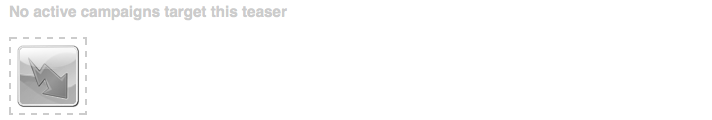
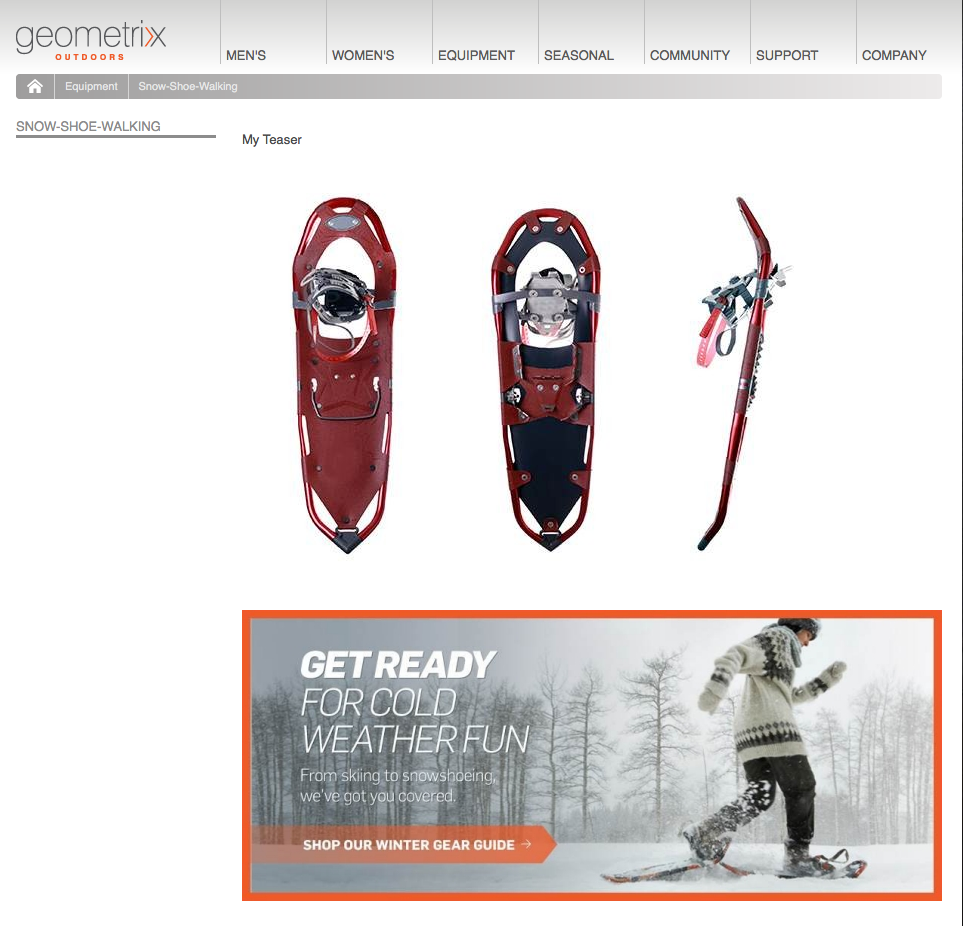
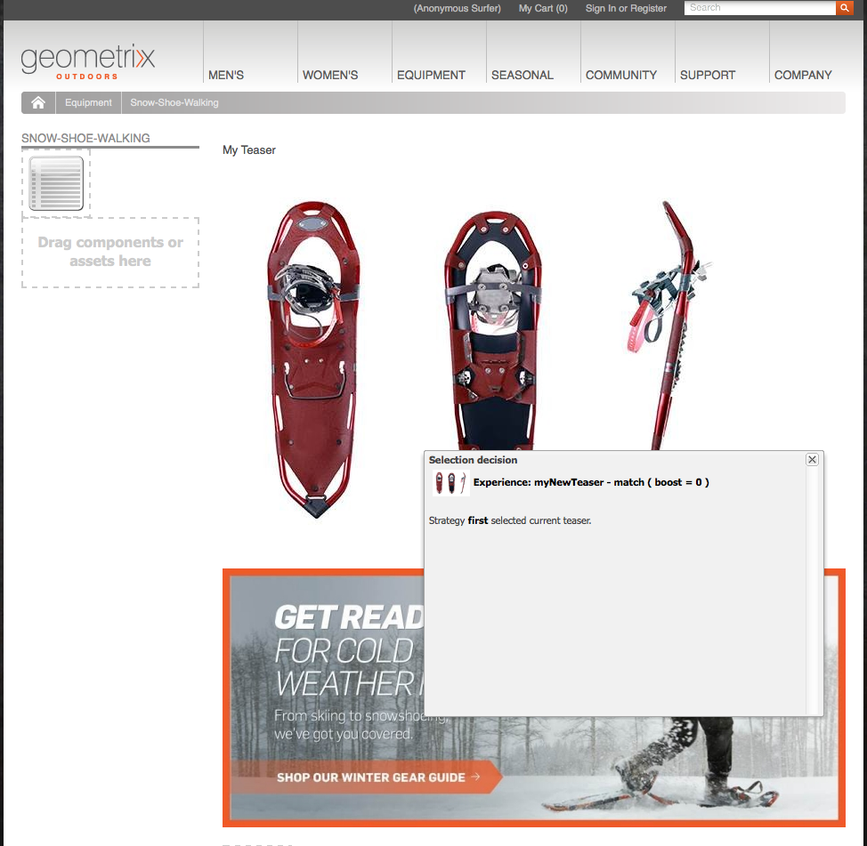

# Teasers y estrategias{#teasers-and-strategies}

Las campañas suelen utilizar teasers como mecanismo para atraer un segmento concreto de la población visitante hacia información centrada en sus intereses. Para una campaña específica se definen uno o varios teasers.

>[!NOTE]
>
>El componente Teaser se ha declarado en desuso en AEM 6.2. En su lugar, utilice el [componente Target](/help/sites-authoring/content-targeting-touch.md).

* **Las** páginas de marcas se almacenan en la sección Campañas del sitio web. Una marca contiene campañas individuales.
* **Las** páginas de campaña se almacenan en la sección Campañas del sitio web. Cada campaña dispone de una página independiente, en la que se incluyen las definiciones del teaser. La página contenedora, o de descripción general, también incluye determinada información y estadísticas relacionadas con las páginas de teaser individuales.

Los teasers de AEM constan de distintas partes:

* **Las** páginas de teaser se almacenan en la página de campaña adecuada y contienen las definiciones de los párrafos de teaser disponibles para cada campaña específica. Estas definiciones se utilizan al mostrar los párrafos de teaser, incluyendo la variación de contenido, el segmento que se utilizará para seleccionar una variación y el factor de realce.
* El **componente Teaser** está disponible en la versión básica y permite crear una instancia de un párrafo de teaser específico en una página de contenido. El componente Teaser se puede arrastrar desde la barra de tareas y, a continuación, se puede especificar la definición del teaser para crear un párrafo de teaser propio. **Nota:** El componente Teaser se ha desaprobado en AEM 6.2. Utilice el  [componente ](/help/sites-authoring/content-targeting-touch.md) Destinatario en su lugar.
* Los **párrafos de teaser** son instancias reales del teaser en una página de contenido. Estos párrafos animan a un segmento de visitantes a acceder a contenido centrado en sus intereses.
* Las páginas que incluyen contenido de campaña se centran en un segmento de visitantes concreto. Los párrafos de teaser suelen dirigir a los visitantes a estas páginas

## asignación de nombres de página {#strategies}

Al agregar un párrafo de teaser a una página, debe definir la **estrategia**.

Esto es así en el caso de que varios teasers estén disponibles para selección conforme sus segmentos asignados se resuelvan correctamente en su totalidad. La **estrategia** especifica criterios adicionales utilizados para seleccionar el teaser mostrado:

* La **Puntuación de secuencias de clic** se basa en las etiquetas y en las visitas de etiquetas relacionadas que se incluyen en el ClientContext del visitante (muestran con qué frecuencia ha hecho clic el visitante en las páginas que incluyen la etiqueta respectiva). Se comparan los porcentajes de visitas para las etiquetas definidas en la página de teaser.
* **Aleatorio**, para selección &quot;aleatoria&quot;; utiliza el factor aleatorio generado para una página, que se puede ver con el contexto [ del ](/help/sites-administering/client-context.md)cliente.
* **** Primero la lista de segmentos resueltos. El orden es el de los teasers en la página que contiene la campaña.

El [Factor de ampliación](/help/sites-administering/campaign-segmentation.md#boost-factor) del segmento también tiene un impacto en la selección. Se trata de un factor adicional que se agrega a una definición del segmento para aumentar/disminuir la probabilidad relativa de ser seleccionado.

El proceso y las interelaciones de los distintos criterios de selección se ilustran mejor con un ejemplo (método que también se puede emplear para garantizar que los teasers llegarán al público objetivo).

Si los siguientes segmentos ya se han creado y asignado a su factor de ampliación correspondiente:

| Segmento | Factor de ampliación |
|---|---|
| S1 | 0 |
| S2 | 0 |
| S3 | 10 |
| S4 | 30 |
| S5 | 0 |
| S6 | 100 |

Se utilizan las siguientes definiciones de teaser:

<table>
 <tbody>
  <tr>
   <td>Campaña</td>
   <td>Teaser</td>
   <td>Segmento(s) asignado(s)</td>
   <td>Etiquetas asignadas </td>
  </tr>
  <tr>
   <td>C1</td>
   <td>T1</td>
   <td>S1, S2</td>
   <td>Negocios, Marketing</td>
  </tr>
  <tr>
   <td>C1</td>
   <td>T2 </td>
   <td>S1</td>
   <td>  </td>
  </tr>
  <tr>
   <td>C3 </td>
   <td>T3</td>
   <td>S3, S4</td>
   <td>  </td>
  </tr>
  <tr>
   <td>C1 </td>
   <td>T4</td>
   <td>, S2, S5</td>
   <td>  </td>
  </tr>
  <tr>
   <td>C3 </td>
   <td>T5</td>
   <td>S1, S2, S6</td>
   <td>Marketing</td>
  </tr>
  <tr>
   <td>C1 </td>
   <td>T6</td>
   <td>S6</td>
   <td>Negocios  </td>
  </tr>
 </tbody>
</table>

Si aplicamos esto a un visitante, donde:

* **S1**,  **S2** y  **S6** se resuelven correctamente

* La etiqueta **marketing** tiene 3 visitas.
* La etiqueta **business** tiene 6 visitas.

Podemos ver los elementos resultantes:

* Éxito de coincidencia - ¿Se ha resuelto correctamente algún segmento asignado al teaser para el visitante actual?
* Factor de ampliación: el factor de ampliación más elevado de todos los segmentos aplicables
* Puntuación de secuencias de clic- Total acumulativo para todas las visitas de tags aplicables

que se calculan antes de aplicar la estrategia apropiada:

<table>
 <tbody>
  <tr>
   <td>Campaña</td>
   <td>Teaser</td>
   <td>Segmento(s) asignado(s)</td>
   <td>Etiquetas </td>
   <td>¿Coincidencia correcta?</td>
   <td>Factor de ampliación resultante</td>
   <td>Puntuación del flujo de navegación resultante </td>
  </tr>
  <tr>
   <td>C1</td>
   <td>T1</td>
   <td>S1, S2</td>
   <td>Negocios, Marketing</td>
   <td>Sí</td>
   <td>0</td>
   <td>9</td>
  </tr>
  <tr>
   <td>C1</td>
   <td>T2 </td>
   <td>S1</td>
   <td>  </td>
   <td>Sí</td>
   <td>0</td>
   <td>  </td>
  </tr>
  <tr>
   <td>C1 </td>
   <td>T3</td>
   <td>S3, S4</td>
   <td>  </td>
   <td>No</td>
   <td>  </td>
   <td>  </td>
  </tr>
  <tr>
   <td>C3 </td>
   <td>T4</td>
   <td>, S2, S5</td>
   <td>  </td>
   <td>Sí  </td>
   <td>0  </td>
   <td>  </td>
  </tr>
  <tr>
   <td>C3 </td>
   <td>T5</td>
   <td>S1, S2, S6</td>
   <td>Mercadotecnia</td>
   <td>Sí</td>
   <td>100</td>
   <td>3</td>
  </tr>
  <tr>
   <td>C1 </td>
   <td>T6</td>
   <td>S6</td>
   <td>Negocios</td>
   <td>Sí</td>
   <td>100</td>
   <td>6 </td>
  </tr>
 </tbody>
</table>

Estos valores se utilizan para determinar los teasers que verá el visitante, dependiendo de la **estrategia** aplicada al párrafo de teaser:

<table>
 <tbody>
  <tr>
   <td>Estrategia</td>
   <td>Teaser resultante</td>
   <td>Comentarios</td>
  </tr>
  <tr>
   <td>Primero</td>
   <td>T5</td>
   <td>Únicamente T5 y T6 se consideran como sus segmentos resueltos <i>y</i> cuentan con el factor de ampliación más elevado. La lista se devuelve en el orden T5, T6; por lo que T5 se selecciona y se muestra.</td>
  </tr>
  <tr>
   <td>Aleatorio</td>
   <td>T5 o T6</td>
   <td>Ambos teasers tienen segmentos que se resuelven en su totalidad y el mismo factor de ampliación. Por lo tanto, los dos teasers se muestran en la misma proporción.</td>
  </tr>
  <tr>
   <td>Puntuación de secuencias de clic</td>
   <td>T6</td>
   <td>
Los segmentos para T1, T4, T5 y T6 se resuelven en su totalidad para el visitante. Los factores de ampliación más elevados de T5 y T6; después se excluyen T1 y T4. Finalmente la puntuación de secuencias de clic más elevada de T6 hace que éste valor se seleccione.
 </td>
  </tr>
 </tbody>
</table>

>[!NOTE]
>
>Si, tras las técnicas de resolución anteriores, varios teasers están disponibles para selección, una selección interna (aleatoria) seleccionará un solo teaser para mostrar.
>
>Por ejemplo, si la estrategia era Puntuación de secuencias de clic y T5 tuvo la misma Puntuación de secuencias de clic que T6 (es decir, 6 en lugar de 3), la selección interna (aleatoria) podría utilizarse para seleccionar una de estas dos.

Las páginas o párrafos de teaser se utilizan para dirigir a segmentos concretos de visitantes a contenido centrado en sus intereses. Pueden presentar una gama de opciones que pueden elegir los visitantes o mostrar únicamente un párrafo de teaser, basado en un segmento específico de visitantes; por ejemplo, el párrafo de teaser mostrado puede depender de la edad de los visitantes.

Generalmente una página de teaser es una acción temporal que durará un período específico de tiempo, hasta que se sustituya por la siguiente página.

Tras crear su marca y campaña, puede crear y configurar la experiencia de teaser.

### Creación de un touchpoint para el teaser {#creating-a-touchpoint-for-your-teaser}

>[!NOTE]
>
>El componente Teaser se ha declarado en desuso en AEM 6.2. En su lugar, utilice el[componente Target](/help/sites-authoring/content-targeting-touch.md).

1. Desplácese a la página de contenido donde desee colocar el párrafo de teaser que dirigirá a la página de campaña.
1. Añada un componente **Teaser** (disponible en la sección **Personalización** de la barra de tareas) en la posición necesaria. Al crearla, mostrará que la ruta de campaña no se ha configurado:

   

1. Edite el componente teaser para añadir lo siguiente:

   * **Ruta de campaña**
Ruta a la página de campaña que aloja la página de teaser independiente; los segmentos determinan exactamente qué teaser se muestra.

   * **[Estrategia](/help/sites-classic-ui-authoring/classic-personalization-campaigns.md#strategies)** Método utilizado para la selección cuando varios segmentos se resuelven correctamente.
   

1. Haga clic en **Aceptar** para guardar. Según los segmentos configurados en el teaser y el perfil del usuario con el que haya iniciado sesión, se mostrará el contenido adecuado:

   

1. Pase el ratón por el párrafo de teaser para mostrar el icono de signo de interrogación (esquina inferior derecha del componente). Haga clic en el icono para ver los segmentos aplicados y cómo se resuelven en estos momentos.

   

### Información general de teaser {#teaser-overview}

Además de la vista de campaña en MCM, la página de campaña también le proporciona información sobre los teasers a los que está conectada:

1. Desde la consola **Sitios web**, abra la página de campaña, por ejemplo:

   `https://localhost:4502/content/campaigns/geometrixx-outdoors/storefront/summer.html`

   Se mostrará información general sobre las estadísticas de visualización y las definiciones del teaser:

   
