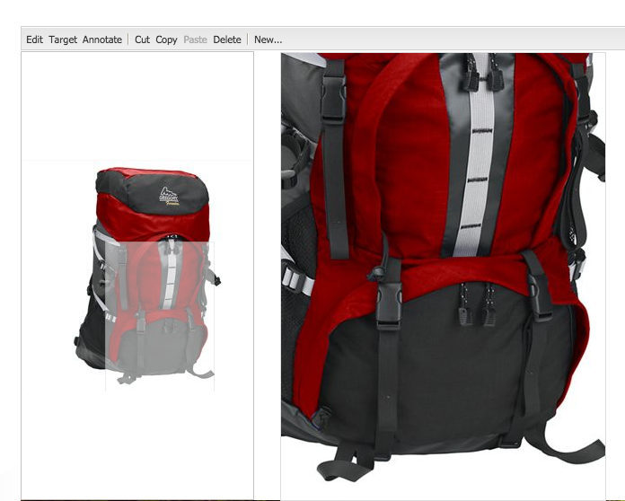

# Adición de recursos de Dynamic Media a las páginas{#adding-dynamic-media-assets-to-pages}

Para añadir la funcionalidad Dynamic Media a los recursos que utiliza en sus sitios web, puede añadir la variable **[!UICONTROL Dynamic Media]** o **[!UICONTROL Medios interactivos]** directamente en la página. Entrar **[!UICONTROL Diseño]** y activar los componentes de Dynamic Media. A continuación, puede añadir estos componentes a la página y añadir recursos al componente. Los componentes de Dynamic Media y medios interactivos son inteligentes: saben si va a añadir una imagen o un vídeo y las opciones disponibles cambian en consecuencia.

Los recursos de Dynamic Media se agregan directamente a la página si utiliza Adobe Experience Manager como WCM.

>[!NOTE]
>
>Los mapas de imágenes están disponibles de forma predeterminada para los titulares de carrusel.

## Añadir un componente de Dynamic Media a una página {#adding-a-dynamic-media-component-to-a-page}

Añadir el [!UICONTROL Dynamic Media] o [!UICONTROL Medios interactivos] a una página es lo mismo que añadir un componente a una página. El [!UICONTROL Dynamic Media] y [!UICONTROL Medios interactivos] Los componentes de se describen en detalle en las secciones siguientes.

Para agregar un componente o visualizador de Dynamic Media a una página:

1. En Experience Manager, abra la página donde desee agregar el componente Dynamic Media.
1. Si no hay ningún componente de Dynamic Media disponible, seleccione la regla en la [!UICONTROL Sidekick] para entrar **[!UICONTROL Diseño]** modo.
1. Seleccionar **[!UICONTROL Editar]** parsys.
1. Seleccionar **[!UICONTROL Dynamic Media]** para que pueda hacer que los componentes de Dynamic Media estén disponibles.

   >[!NOTE]
   >
   >Consulte [Configuración de componentes en el modo Diseño](/help/sites-authoring/default-components-designmode.md) para obtener más información.

1. Volver a **[!UICONTROL Editar]** haciendo clic en el icono de lápiz en la [!UICONTROL Sidekick].
1. Arrastre el **[!UICONTROL Dynamic Media]** o **[!UICONTROL Medios interactivos]** del componente de **[!UICONTROL Otros]** grupo en la barra de tareas a la página en la ubicación deseada.
1. Seleccionar **[!UICONTROL Editar]** por lo tanto, el componente se abre.
1. [Editar el componente](#dynamic-media-component) según sea necesario.
1. Seleccionar **[!UICONTROL OK]** por lo tanto, los cambios se guardarán.

## Componentes de Dynamic Media {#dynamic-media-components}

[!UICONTROL Dynamic Media] y [!UICONTROL Medios interactivos] están disponibles en la [!UICONTROL Sidekick] bajo **[!UICONTROL Dynamic Media]**. Utilice el **[!UICONTROL Medios interactivos]** para cualquier recurso interactivo, como vídeo interactivo, imágenes interactivas o conjuntos de carrusel. Para el resto de componentes de Dynamic Media, utilice el **[!UICONTROL Dynamic Media]** componente.

>[!NOTE]
>
>Estos componentes no están disponibles de forma predeterminada y deben seleccionarse en el modo Diseño antes de utilizar. [Una vez que estén disponibles en el modo Diseño](/help/sites-authoring/default-components-designmode.md)Además, puede agregar los componentes a la página como lo haría con cualquier otro componente del Experience Manager.

### componente de Dynamic Media {#dynamic-media-component}

El componente Dynamic Media es inteligente: según si agrega una imagen o un vídeo, tiene varias opciones. El componente admite ajustes preestablecidos de imagen, visores basados en imágenes como conjuntos de imágenes, conjuntos de giros, conjuntos de medios mixtos y vídeo. Además, el visualizador es adaptable. Es decir, el tamaño de la pantalla cambia automáticamente según el tamaño de la pantalla. Todos los visualizadores son visualizadores basados en HTML5.

>[!NOTE]
>
>Cuando agregue el [!UICONTROL Dynamic Media] componente, y **[!UICONTROL Configuración de Dynamic Media]** está en blanco o no puede agregar un recurso correctamente, compruebe lo siguiente:
>
>* Tiene [Dynamic Media habilitado](/help/assets/config-dynamic.md). Dynamic Media está deshabilitado de forma predeterminada.
>* La imagen tiene un archivo tiff piramidal. Las imágenes importadas antes de que Dynamic Media esté habilitado no tienen un archivo tiff piramidal.
>

#### Al trabajar con imágenes {#when-working-with-images}

El [!UICONTROL Dynamic Media] Este componente permite agregar imágenes dinámicas, incluidos conjuntos de imágenes, conjuntos de giros y conjuntos de medios mixtos. Puede acercar y alejar la imagen y, si procede, girar una imagen dentro de un conjunto de giros o seleccionar una imagen de otro tipo de conjunto.

También puede configurar el ajuste preestablecido de visualizador, el ajuste preestablecido de imagen o el formato de imagen directamente en el componente. Para que una imagen sea adaptable, puede establecer los puntos de interrupción o aplicar un ajuste preestablecido de imagen adaptable.

Puede editar la siguiente configuración de Dynamic Media haciendo clic en **[!UICONTROL Editar]** en el componente y, a continuación, haga clic en **[!UICONTROL Configuración de Dynamic Media]** pestaña.

>[!NOTE]
>
>De forma predeterminada, el componente de imagen Dynamic Media es adaptable. Si desea que tenga un tamaño fijo, configúrelo en el componente de **[!UICONTROL Avanzadas]** pestaña con el **[!UICONTROL Ancho]** y **[!UICONTROL Altura]** propiedades.

**[!UICONTROL Ajuste preestablecido de visor]** - Seleccione un ajuste preestablecido de visualizador existente en el menú desplegable. Si el ajuste preestablecido de visualizador que busca no está visible, debe hacerlo visible. Consulte [Administrar ajustes preestablecidos del visor](/help/assets/managing-viewer-presets.md). No puede seleccionar un ajuste preestablecido de visualizador si utiliza un ajuste preestablecido de imagen y a la inversa.

Esta opción solo está disponible si ve conjuntos de imágenes, conjuntos de giros o conjuntos de medios mixtos. Los ajustes preestablecidos del visualizador mostrados son inteligentes. Es decir, solo aparecen los ajustes preestablecidos de visualizador relevantes.

**[!UICONTROL Ajuste preestablecido de imagen]** - Seleccione un ajuste preestablecido de imagen existente en el menú desplegable. Si el ajuste preestablecido de imagen que está buscando no está visible, debe hacerlo visible. Consulte [Administrar ajustes preestablecidos de imagen](/help/assets/managing-image-presets.md). No puede seleccionar un ajuste preestablecido de visualizador si utiliza un ajuste preestablecido de imagen y a la inversa.

Esta opción no está disponible si está viendo conjuntos de imágenes, conjuntos de giros o conjuntos de medios mixtos.

**[!UICONTROL Modificadores de imagen]** - Puede cambiar los efectos de imagen suministrando comandos de imagen adicionales. Estos comandos se describen en [Administrar ajustes preestablecidos de imagen](/help/assets/managing-viewer-presets.md) y el [Referencia de comando](https://experienceleague.adobe.com/docs/dynamic-media-developer-resources/image-serving-api/image-serving-api/http-protocol-reference/command-reference/c-command-reference.html).

Esta opción no está disponible si está viendo conjuntos de imágenes, conjuntos de giros o conjuntos de medios mixtos.

**[!UICONTROL Puntos de interrupción]** : Si utiliza este recurso en un sitio adaptable, debe añadir los puntos de interrupción de página. Los puntos de interrupción de imagen están separados por comas (,). Esta opción funciona cuando no hay altura o anchura definida en un ajuste preestablecido de imagen.

Esta opción no está disponible si está viendo conjuntos de imágenes, conjuntos de giros o conjuntos de medios mixtos.

Puede editar las siguientes opciones [!UICONTROL Configuración avanzada] haciendo clic en **[!UICONTROL Editar]** en el componente.

**[!UICONTROL Título]** - Cambiar el título de la imagen.

**[!UICONTROL Texto alternativo]** : Añada un título a la imagen para los usuarios que tengan los gráficos desactivados.

Esta opción no está disponible si está viendo conjuntos de imágenes, conjuntos de giros o conjuntos de medios mixtos.

**[!UICONTROL URL, Abrir en]** : puede configurar un recurso desde para abrir un vínculo. Configure las variables **[!UICONTROL URL]** y **[!UICONTROL Abrir en]** para indicar si desea que se abra en la misma ventana o en una nueva.

Esta opción no está disponible si está viendo conjuntos de imágenes, conjuntos de giros o conjuntos de medios mixtos.

**[!UICONTROL Anchura y altura]** : introduzca un valor en píxeles si desea que la imagen tenga un tamaño fijo. Si deja estos valores en blanco, el recurso se adaptará.

#### Al trabajar con vídeo {#when-working-with-video}

Utilice el **[!UICONTROL Dynamic Media]** para agregar vídeo dinámico a las páginas web. Al editar el componente, puede elegir utilizar un ajuste preestablecido de visualizador de vídeo para reproducir el vídeo en la página.

Puede editar las siguientes opciones [!UICONTROL Configuración de Dynamic Media] haciendo clic en **[!UICONTROL Editar]** en el componente.

>[!NOTE]
>
>De forma predeterminada, el componente de vídeo de Dynamic Media es adaptable. Si desea que tenga un tamaño fijo, configúrelo en el componente con el **[!UICONTROL Ancho]** y **[!UICONTROL Altura]** en el **[!UICONTROL Avanzadas]** pestaña.

**[!UICONTROL Ajuste preestablecido de visor]** - Seleccione un ajuste preestablecido de visualizador de vídeo existente en el menú desplegable. Si el ajuste preestablecido de visualizador que busca no está visible, debe hacerlo visible. Consulte [Administrar ajustes preestablecidos del visor](/help/assets/managing-viewer-presets.md).

Puede editar las siguientes opciones [!UICONTROL Avanzadas] haciendo clic en **[!UICONTROL Editar]** en el componente.

**[!UICONTROL Título]** - Cambiar el título del vídeo.

**[!UICONTROL Anchura y altura]** : introduzca un valor en píxeles si desea que el vídeo tenga un tamaño fijo. Si se dejan estos valores en blanco, se vuelve adaptable.

#### Proporcionar vídeo seguro {#how-to-delivery-secure-video}

En Experience Manager 6.2, al instalar [FP-13480](https://experience.adobe.com/#/downloads/content/software-distribution/en/aem.html?package=/content/software-distribution/en/details.html/content/dam/aem/public/adobe/packages/cq620/featurepack/cq-6.2.0-featurepack-13480), puede controlar si un vídeo se envía a través de una conexión SSL segura (HTTPS) o una conexión no segura (HTTP). De forma predeterminada, el protocolo de entrega de vídeo se hereda automáticamente del protocolo de la página web en la que se incorpora. Si la página web se carga a través de HTTPS, el vídeo también se envía a través de HTTPS. Y a la inversa, si la página web está en HTTP, el vídeo se envía a través de HTTP. Normalmente, este comportamiento predeterminado funciona correctamente y no es necesario realizar ningún cambio en la configuración. Sin embargo, puede anular este comportamiento predeterminado. Añadir `VideoPlayer.ssl=on` al final de una ruta de URL o a la lista de otros parámetros de configuración del visor en un fragmento de código incrustado. Cualquiera de las acciones fuerza la entrega de vídeo segura.

Para obtener más información sobre la entrega de vídeo seguro y el uso de `VideoPlayer.ssl` atributo de configuración en la ruta URL, consulte [Entrega segura de vídeos](https://experienceleague.adobe.com/docs/dynamic-media-developer-resources/library/viewers-aem-assets-dmc/video/c-html5-video-viewer-20-securevideodelivery.html) en la Guía de referencia de visores. Además del visualizador de vídeo, hay una entrega de vídeo segura disponible para el visualizador de medios mixtos y el visualizador de vídeo interactivo.

### Componente de medios interactivo {#interactive-media-component}

El componente de medios interactivos es para aquellos recursos que tienen interactividad en ellos, como zonas interactivas o mapas de imagen. Si tiene una imagen interactiva, un vídeo interactivo o un titular de carrusel, utilice el **[!UICONTROL Medios interactivos]** componente.

El [!UICONTROL Medios interactivos] El componente es inteligente: según si añade una imagen o un vídeo, tiene varias opciones. Además, el visualizador es adaptable. Es decir, el tamaño de la pantalla cambia automáticamente según el tamaño de la pantalla. Todos los visualizadores son visualizadores basados en HTML5.

Puede editar las siguientes opciones **[!UICONTROL General]** haciendo clic en **[!UICONTROL Editar]** en el componente.

**[!UICONTROL Ajuste preestablecido de visor]** - Seleccione un ajuste preestablecido de visualizador existente en el menú desplegable. Si el ajuste preestablecido de visualizador que busca no está visible, debe hacerlo visible. Los ajustes preestablecidos del visor deben publicarse para poder utilizarse. Consulte [Administrar ajustes preestablecidos de visor](/help/assets/managing-viewer-presets.md).

**[!UICONTROL Título]** - Cambiar el título del vídeo.

**[!UICONTROL Anchura y altura]** : introduzca un valor en píxeles si desea que el vídeo tenga un tamaño fijo. Si se dejan estos valores en blanco, se vuelve adaptable.

Puede editar las siguientes opciones **[!UICONTROL Añadir al carro]** haciendo clic en **[!UICONTROL Editar]** en el componente.

**[!UICONTROL Mostrar recurso del producto]** : De forma predeterminada, este valor está seleccionado. El recurso de producto muestra una imagen del producto tal como se define en el módulo de Commerce. Desactive la marca de verificación para no mostrar el recurso del producto.

**[!UICONTROL Mostrar precio del producto]** : De forma predeterminada, este valor está seleccionado. El precio del producto muestra el precio del artículo tal como se define en el módulo Commerce. Desactive la marca de verificación para no mostrar el precio del producto.

**[!UICONTROL Mostrar formulario del producto]** - De forma predeterminada, este valor no está seleccionado. El formulario de producto incluye cualquier variante de producto, como tamaño y color. Desactive la marca de verificación para no mostrar las variantes del producto.
