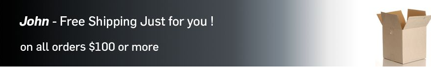

# Adición de funciones de Scene7 a la página{#adding-scene-features-to-your-page}

[Adobe Scene7](https://help.adobe.com/en_US/scene7/using/WS26AB0D9A-F51C-464e-88C8-580A5A82F810.html) es una solución alojada para administrar, mejorar, publicar y distribuir recursos de medios enriquecidos en la Web, dispositivos móviles, correo electrónico y pantallas e impresiones conectadas a Internet.

Puede ver los recursos de AEM publicados en Scene7 en distintos visores:

* Zoom
* Flotante
* Vídeo
* Plantilla de imagen
* Imagen

Puede publicar recursos digitales directamente de AEM a Scene7 y de Scene7 a AEM.

En este documento se describe cómo publicar recursos digitales de AEM a Scene7 y viceversa. Los visores también se describen en detalle. For information on configuring AEM for Scene7, see [Integrating Scene7 with AEM](/help/sites-administering/scene7.md).

Consulte también [Adición de mapas de imagen](/help/assets/image-maps.md).

Para obtener más información sobre el uso de componentes de vídeo con AEM, consulte lo siguiente:

* [Vídeo](/help/sites-classic-ui-authoring/manage-assets-classic-s7-video.md)

>[!NOTE]
>
>If Scene7 assets do not display properly, please make sure that Dynamic media is [disabled](/help/assets/config-dynamic.md#disabling-dynamic-media) and then refresh the page.

## Publicación manual en Scene7 desde Recursos {#manually-publishing-to-scene-from-assets}

Puede publicar recursos digitales en Scene7 desde la consola Recursos en la interfaz de usuario clásica o directamente desde el recurso en cuestión.

>[!NOTE]
>
>AEM publica en Scene7 de forma asíncrona. Después de hacer clic en **Publicar**, puede que deba esperar unos segundos hasta que el recurso se publique en Scene7.

### Publicación desde la consola Recursos {#publishing-from-the-assets-console}

Para publicar en Scene7 desde la consola Recursos si los recursos se encuentran en una carpeta de destino de Scene7: 

1. In the AEM classic UI, click **Digital Assets** to access the digital asset manager.

1. Seleccione el recurso (o los recursos) o la carpeta de la carpeta de destino que desea publicar en Scene7, haga clic con el botón derecho y seleccione **Publicar en Scene7**. Alternatively, you can select **Publish to Scene7** from the **Tools menu**.

   

1. Vaya a Scene7 y confirme que los recursos se encuentran disponibles.

   >[!NOTE]
   >
   >Si los recursos no están en una carpeta sincronizada de Scene7, la opción **Publicar en Scene7** está visible, pero desactivada, en ambos menús.

### Publicación desde un recurso {#publishing-from-an-asset}

Puede publicar manualmente un recurso siempre que este se encuentre en la carpeta sincronizada de Scene7.

>[!NOTE]
>
>If the asset is not located in the Scene7 synchronized folder, the link to **Publish to Scene7** will not appear.

Para publicar en Scene7 directamente desde un recurso digital:

1. En AEM, haga clic en **Recursos digitales** para acceder al administrador de recursos digitales.

1. Haga doble clic en dicha opción para abrir un recurso.

1. En el panel de detalles del recurso, seleccione **Publicar en Scene7**.

   

1. El vínculo cambia a **Publicando...** y, a continuación, a **Publicado**. Vaya a Scene7 y confirme que el recurso se encuentra disponible.

   >[!NOTE]
   >
   >Si el recurso no se publica correctamente en Scene7, el vínculo cambia a **Error de publicación**. Si el recurso ya se ha publicado en Scene7, el nombre del vínculo es **Volver a publicar en Scene7**. La función de volver a publicar permite realizar cambios en un recurso en AEM y volver a publicarlo.

### Publicación de recursos desde fuera de la carpeta de destino de CQ {#publishing-assets-from-outside-the-cq-target-folder}

Adobe recomienda publicar recursos en Scene7 solo desde recursos de la carpeta de destino de Scene7. However, if you need to upload assets from a folder outside of the target folder, you can still do that by uploading them to an **ad-hoc** folder on Scene7.

En primer lugar, debe ajustar la configuración de nube de la página en la que aparecerá el recurso. A continuación, añada un componente de Scene7 a la página y arrastre y suelte un recurso en el componente. After the page properties are set for that page, a **Publish to Scene7** link appears that when selected triggers uploading to Scene7.

>[!NOTE]
>
>Los recursos que se encuentran en la carpeta ad hoc no aparecen en el navegador de contenido de Scene7.

Para publicar los recursos que residen fuera de la carpeta de destino de CQ:

1. En la interfaz de usuario clásica de AEM, haga clic en **Sitios web** y navegue a la página web a la que quiera añadir un recurso digital que aún no se haya publicado en Scene7. (Se aplican las reglas de herencia de página habituales).

1. En la barra de tareas, haga clic en el icono **Página** y, después, en **Propiedades de página**.

1. Haga clic en **Servicios de nube** y, después, en **Añadir servicios**. Por último, seleccione **Scene7**.
1. In the **Adobe Scene7** drop-down list, select the desired configuration and click **OK**.

   

1. En la página web, añada un componente de Scene7 en la ubicación deseada de la página.
1. En el buscador de contenido, arrastre un recurso digital hasta el componente. You see a link to **Check Scene7 Publication Status**.

   >[!NOTE]
   >
   >If the digital asset is in the CQ target folder, then no link to **Check Scene7 Publication Status** appears. Los recursos simplemente se colocan en el componente.

   

1. Haga clic en **Comprobar estado de publicación de Scene7**. Si los recursos no se han publicado, AEM los publica en Scene7. Una vez cargado, el recurso se encuentra en la carpeta ad hoc. De forma predeterminada, la carpeta personalizada está ubicada en **nombre_de_la_empresa/CQ5_adhoc**. Puede [configurarla, si es necesario](#configuringtheadhocfolder).

   >[!NOTE]
   >
   >Si el recurso no está en una carpeta sincronizada de Scene7 y no hay ninguna configuración de nube de Scene7 asociada a la página actual, la carga no se completará.

## Componentes de Scene7 {#scene-components}

Los siguientes componentes de Scene7 están disponibles en AEM:

* Zoom
* Flotante (zoom)
* Plantilla de imagen
* Imagen
* Vídeo

>[!NOTE]
>
>Estos componentes no están disponibles de forma predeterminada y se deben seleccionar en el modo Diseño para que se puedan usar.

Una vez que los haya activado en el modo Diseño, puede añadir los componentes a la página como cualquier otro componente de AEM. Los recursos que aún no se hayan publicado en Scene7 se publican finalmente en Scene7 si se encuentran en una carpeta sincronizada o en una página, o bien si tienen una configuración de nube de Scene7.

>[!NOTE]
>
>If you are creating and developing custom S7 viewers and using the Content Finder, you need to explicity add the **allowfullscreen** parameter.

### Aviso de final de asistencia para el visor Flash {#flash-viewers-end-of-life-notice}

A partir del 31 de enero de 2017, Adobe Scene7 dejará de ofrecer asistencia para la plataforma del visor Flash.

Para obtener más información sobre este cambio importante, consulte las [Preguntas frecuentes sobre el final de asistencia para el visor Flash](https://docs.adobe.com/content/docs/en/aem/6-1/administer/integration/marketing-cloud/scene7/flash-eol.html).

### Adición de un componente de Scene7 a una página {#adding-a-scene-component-to-a-page}

Un componente de Scene7 se añade a una página de la misma manera que se añade un componente a cualquier página. Los componentes de Scene7 se describen detalladamente en las secciones siguientes.

Para añadir un componente o visor de Scene7 a una página en la interfaz de usuario clásica:

1. En AEM, abra la página a la que quiera añadir el componente de Scene7.

1. Si no hay componentes de Scene7 disponibles, haga clic en la regla de la barra de tareas para acceder al modo **Diseño** y, después, en el parsys (sistema de párrafos) **Editar**. Entonces, seleccione todos los componentes de **Scene7** para que estén disponibles.

1. Return to **Edit** mode by clicking the pencil in the sidekick.

1. Arrastre un componente desde el grupo **Scene7** de la barra de tareas hasta la página y colóquelo en la ubicación deseada.

1. Haga clic en **Editar** para abrir el componente.

1. Edite el componente según sea necesario y haga clic en **Aceptar** para guardar los cambios.

### Adición de experiencias de visualización interactiva a un sitio web con capacidad de respuesta {#adding-interactive-viewing-experiences-to-a-responsive-website}

El diseño interactivo para sus recursos implica que estos se ajustan según el lugar en que se muestren. Con un diseño interactivo, los mismos recursos se pueden mostrar de forma eficaz en varios dispositivos.

Para añadir una experiencia de visualización interactiva a un sitio interactivo en la interfaz de usuario clásica:

1. Log in to AEM, and ensure that you have [configured Adobe Scene7 Cloud Services](/help/sites-administering/scene7.md#configuring-scene-integration) and that Scene7 components are available.

   >[!NOTE]
   >
   >Si los componentes WCM de Scene7 no están disponibles, asegúrese de activarlos mediante el modo Diseño.

1. En una página web en que los componentes de Scene7 estén activados, arrastre un visor de **imagen** a la página.
1. Edite el componente y ajuste los puntos de interrupción en la pestaña **Configuración de Scene7**.

   

1. Confirme que los visores cambian de tamaño de manera interactiva y que las interacciones están optimizadas para dispositivos de escritorio, tabletas y móviles.

### Configuración común a todos los componentes de Scene7 {#settings-common-to-all-scene-components}

A pesar de que las opciones de configuración varían, las siguientes son comunes a todos los componentes de Scene7:

* **Referencia del archivo**: navegue a un archivo al que quiera hacer referencia. La referencia del archivo muestra la dirección URL del recurso y no necesariamente la dirección URL completa de Scene7, incluidos los comandos y los parámetros URL. No es posible añadir comandos ni parámetros URL de Scene7 a este campo. Deben añadirse mediante la funcionalidad correspondiente del componente.
* **Anchura**: le permite definir la anchura.
* **Altura**: le permite definir la altura.

Para establecer estas opciones de configuración, abra (haga doble clic en) un componente de Scene7, por ejemplo, cuando abre un componente **Zoom**:

### Zoom {#zoom}

El componente Zoom HTML5 muestra una imagen más grande al pulsar el botón +.

El recurso dispone de herramientas de zoom en la parte inferior. Haga clic en **+** para ampliar. Haga clic en **-** para reducir. Clicking the **x** or the reset zoom arrow brings the image back to the original size it was imported as. Haga clic en las flechas diagonales para pasar a pantalla completa. Haga clic en **Editar** para configurar el componente. With this component, you can configure [settings common to all Scene7 components](#settings-common-to-all-scene-components).

### Flotante {#flyout}

En el componente Flotante HTML5, el recurso se muestra como una pantalla dividida: a la izquierda aparece con el tamaño especificado y a la derecha aparece la porción modificada con el zoom. Haga clic en **Editar** para configurar el componente. With this component, you can configure [settings common to all Scene7 components](/help/sites-administering/scene7.md#settingscommontoallscene7components).

>[!NOTE]
>
>Si el componente Flotante utiliza un tamaño personalizado, se utiliza dicho tamaño y se desactiva la configuración interactiva del componente.
>
>Si el componente Flotante utiliza el tamaño predeterminado, tal como se define en la vista Diseño, se utiliza el tamaño predeterminado y el componente se expande para adaptarse al tamaño de presentación de página con la configuración interactiva del componente activada. Sin embargo, tenga en cuenta que existe una limitación en la configuración interactiva del componente. Al utilizar el componente Flotante con la configuración interactiva, no debe usarlo con la ampliación de página completa. De lo contrario, el menú flotante puede extenderse más allá del borde derecho de la página.

### Imagen {#image}

El componente Imagen de Scene7 le permite añadir la funcionalidad de Scene7 a sus imágenes, como los modificadores de imagen de Scene7, los ajustes preestablecidos de visor o imagen, y el enfoque. El componente Imagen de Scene7 es similar a otros componentes de imagen de AEM, con la funcionalidad especial de Scene7. In this example, the image has the Scene7 URL modifier, **&amp;op_invert=1** applied.

**Título, Texto** alternativo En la ficha Avanzado, agregue un título a la imagen y texto alternativo para los usuarios que tienen gráficos desactivados.

**URL, Abrir en** Puede definir un recurso desde para abrir un vínculo. Defina la dirección URL y, en Abrir en, indique si quiere que se abra en la misma ventana o en una nueva.

**Ajuste preestablecido** de visor Seleccione un ajuste preestablecido de visor existente en el menú desplegable. Si el ajuste preestablecido de visor que busca no está visible, es posible que tenga que hacerlo visible. Consulte Administración de ajustes preestablecidos de visor. No es posible seleccionar un ajuste preestablecido de visor si utiliza un ajuste preestablecido de imagen, y viceversa.

**Configuración** de Scene7 Seleccione la configuración de Scene7 que desee utilizar para recuperar los ajustes preestablecidos de imagen activos de SPS.

**Ajuste preestablecido** de imagen Seleccione un ajuste preestablecido de imagen existente en el menú desplegable. Si el ajuste preestablecido de imagen que busca no está visible, es posible que tenga que hacerlo visible. Consulte Administración de ajustes preestablecidos de imagen. No es posible seleccionar un ajuste preestablecido de visor si utiliza un ajuste preestablecido de imagen, y viceversa.

**Formato** de salida Seleccione el formato de salida de la imagen, por ejemplo jpeg. En función del formato de salida que seleccione, puede tener opciones de configuración adicionales. Consulte Prácticas recomendadas para ajustes preestablecidos de imagen.

**Enfoque** Seleccione cómo desea enfocar la imagen. El enfoque se explica en detalle en Prácticas recomendadas para ajustes preestablecidos de imagen y en Prácticas recomendadas para el enfoque.

**Modificadores** de URL Puede cambiar los efectos de imagen proporcionando comandos de imagen S7 adicionales. Estos se describen en Ajustes preestablecidos de imagen y Referencia del comando.

**Puntos de interrupción** Si el sitio web responde, desea ajustar los puntos de interrupción. Los puntos de interrupción deben separarse con comas (,).

### Plantilla de imagen {#image-template}

Las [plantillas de imagen de Scene7](https://help.adobe.com/en_US/scene7/using/WS60B68844-9054-4099-BF69-3DC998A04D3C.html) son contenido de Photoshop con capas importado a Scene7, en que el contenido y las propiedades se han parametrizado para disponer de variabilidad. El componente **Plantilla de imagen** le permite importar imágenes y cambiar el texto de forma dinámica en AEM. Además, puede configurar el componente **Plantilla de imágenes** para utilizar valores de ClientContext, de modo que cada usuario experimenta la imagen de una forma personalizada.

Haga clic en **Editar** para configurar el componente. You can configure [settings common to all Scene7 components](/help/sites-administering/scene7.md#settingscommontoallscene7components) as well as other settings described in this section.

**Referencia de archivo, Anchura y Altura** Consulte los ajustes comunes a todos los componentes de Scene7.

>[!NOTE]
>
>Los comandos y los parámetros de URL de Scene7 no se pueden añadir directamente a la dirección URL de Referencia de archivo. Solo se pueden definir en la interfaz de usuario del componente en el panel **Parámetro**.

**Título, Texto** alternativo En la ficha Plantilla de imagen de Scene7, añada un título a la imagen y texto alternativo para los usuarios que tienen gráficos desactivados.

**URL, Abrir en** Puede definir un recurso desde para abrir un vínculo. Defina la dirección URL y, en Abrir en, indique si quiere que se abra en la misma ventana o en una nueva.

**Panel** de parámetros Al importar una imagen, los parámetros se rellenan previamente con información de la imagen. Si no existe contenido que se pueda cambiar de forma dinámica, esta ventana está vacía.

#### Cambio del texto de forma dinámica {#changing-text-dynamically}

Para cambiar el texto de forma dinámica, escriba el nuevo texto en los campos y haga clic en **Aceptar**. En este ejemplo, el **Precio** es ahora $50 y el envío cuesta 99 centavos.

El texto de la imagen cambia. Para restablecer el texto al valor original, haga clic en **Restablecer** junto al campo.

#### Cambio del texto para reflejar un valor de ClientContext {#changing-text-to-reflect-the-value-of-a-client-context-value}

To link a field to a client context value, click **Select** to open the client-context menu, select the client context, and click **OK**. En este ejemplo, el nombre cambia en función de la vinculación de valor de Nombre con el nombre con formato que consta en el perfil.

El texto refleja el nombre del usuario de la sesión actual. Puede restaurar el texto al valor original haciendo clic en **Restablecer **junto al campo.

#### Conversión de la plantilla de imagen de Scene7 en un vínculo {#making-the-scene-image-template-a-link}

Para convertir el componente de la plantilla de imagen de Scene7 en un vínculo en el que se puede hacer clic:

1. En la página con el componente de la plantilla de imagen de Scene7, haga clic en **Editar**.
1. En el campo **URL**, introduzca la dirección URL a la que los usuarios se dirigen al hacer clic en la imagen. In the **Open in** field, select whether you want the target to open (a new window or same window).

   

1. Haga clic en **OK**.

### Componente de vídeo {#video-component}

The Scene7 **Video** component (available from the Scene7 section of the sidekick) uses device and bandwidth detection to serve the right video to each screen. Este componente es un reproductor de vídeo HTML5; se trata de un visor único que se puede utilizar en múltiples canales.

Se puede usar para conjuntos de vídeos adaptables, un solo vídeo MP4 o un solo vídeo F4V.

Consulte [Vídeo](/help/sites-classic-ui-authoring/manage-assets-classic-s7-video.md) para obtener más información sobre cómo funcionan los vídeos con la integración de Scene7. In addition, see how [the **Scene7 video** component compares to the foundation **video** component](/help/sites-classic-ui-authoring/manage-assets-classic-s7-video.md).

### Limitaciones conocidas del componente de vídeo {#known-limitations-for-the-video-component}

Adobe DAM y WCM muestran si se ha cargado un vídeo maestro. No muestran estos recursos de proxy:

* Representaciones codificadas de Scene7
* Conjuntos de vídeos adaptables de Scene7

Cuando se utiliza un conjunto de vídeos adaptables con el componente de vídeo de Scene7, tendrá que cambiar de tamaño el componente para ajustarlo a las dimensiones del vídeo.

## Navegador de contenido de Scene7 {#scene-content-browser}

El navegador de contenido de Scene7 le permite ver el contenido de Scene7 directamente en AEM. To access the content browser, in the Content Finder, select **Scene7** in the touch-optimized user interface or the **S7** icon in the classic user interface. La funcionalidad es idéntica en ambas interfaces de usuario.

Si tiene varias configuraciones, AEM muestra de forma predeterminada la [configuración predeterminada](/help/sites-administering/scene7.md#configuring-a-default-configuration). Puede seleccionar diferentes configuraciones directamente en el navegador de contenido de Scene7 en el menú desplegable.

>[!NOTE]
>
>* Los recursos que se encuentran en la carpeta personalizada no aparecerán en el navegador de contenido de Scene7.
>* Cuando [se habilita la vista previa segura](/help/sites-administering/scene7.md#configuring-the-state-published-unpublished-of-assets-pushed-to-scene), los recursos publicados y no publicados de Scene7 aparecen en el navegador de contenido de Scene7.
>* If you do not see **Scene7** or the **S7** icon as an option in the content browser, you need to [configure Scene7 to work with AEM](/help/sites-administering/scene7.md).
   >
   >
* Por lo que respecta a vídeo, el navegador de contenido de Scene7 admite las opciones siguientes: >
   >    * Conjuntos de vídeos adaptables: contenedor de todas las representaciones de vídeo necesarias para la reproducción sin errores en varias pantallas.
   >    * Vídeo MP4 sencillo
   >    * Vídeo F4V sencillo
>

### Exploración del contenido {#browsing-content-in-the-classic-ui}

Para navegar por el contenido de Scene7, haga clic en la pestaña **S7**.

Para cambiar la configuración a la que está accediendo, selecciónela. Las carpetas cambian en función de la configuración seleccionada.

Al igual que ocurre con el buscador de contenido para los recursos, puede buscar recursos y filtrar los resultados. Sin embargo, a diferencia del buscador de recursos, al introducir una palabra clave en la pestaña **S7**, el nombre del archivo **comienza por** la cadena introducida, en lugar de **contener** la palabra clave en el nombre de archivo.

De forma predeterminada, los recursos se muestran por el nombre de archivo. También puede filtrar los resultados por el tipo de recurso.

>[!NOTE]
>
>En lo que respecta a los vídeos, el navegador de contenido de Scene7 de WCM admite las opciones siguientes:
>
>* Conjuntos de vídeos adaptables: contenedor de todas las representaciones de vídeo necesarias para la reproducción sin errores en varias pantallas.
>* Vídeo MP4 sencillo
>* Vídeo F4V sencillo
>

### Búsqueda de recursos de Scene7 con el navegador de contenido {#searching-for-scene-assets-with-the-content-browser}

La búsqueda de recursos de Scene7 es similar a la búsqueda de recursos de AEM, excepto que, al realizar una búsqueda, está viendo en realidad una vista remota de los recursos del sistema de Scene7, en lugar de importarlos directamente a AEM.

Puede utilizar la interfaz de usuario clásica o la optimizada para el uso táctil para ver y buscar recursos. Según la interfaz, la búsqueda es ligeramente diferente.

Al buscar en cualquier interfaz de usuario, puede filtrar según los criterios siguientes (aquí se muestra la IU optimizada para el uso táctil):

**Escriba las palabras clave** . Puede buscar recursos por nombre. Al buscar, las palabras clave que introduce es por lo que comienza el nombre de archivo. Por ejemplo, al escribir la palabra “natación”, el sistema buscaría cualquier nombre de archivo de recurso que comience por esas letras en ese orden. Asegúrese de hacer clic en Entrar después de escribir el término para buscar el recurso.

**Carpeta/ruta** El nombre de la carpeta que aparece se basa en la configuración seleccionada. Para ver los niveles inferiores, haga clic en el icono de carpeta, seleccione una subcarpeta y, a continuación, haga clic en la marca de verificación para seleccionarla.

Si introduce una palabra clave y selecciona una carpeta, AEM realiza la búsqueda en esa carpeta y todas las subcarpetas. Sin embargo, si no introduce ninguna palabra clave cuando realice la búsqueda, al seleccionar la carpeta solo se mostrarán los recursos de esa carpeta y no se incluirá ninguna de las subcarpetas.

De forma predeterminada, AEM realiza la búsqueda en la carpeta seleccionada y todas las subcarpetas.

**Tipo de recurso** Seleccione Scene7 para examinar el contenido de Scene7. Esta opción solo está disponible si se ha configurado Scene7.

**Configuración** Si tiene más de una configuración de Scene7 definida en Cloud Services, puede seleccionarla aquí. Como resultado, la carpeta cambiará según la configuración que haya elegido.

**Tipo** de recurso En el navegador de Scene7, puede filtrar los resultados para incluir cualquiera de los siguientes elementos: imágenes, plantillas, vídeos y conjuntos de vídeos adaptables. Si no selecciona ningún tipo de recurso, AEM busca de manera predeterminada todos los tipos de recursos.

>[!NOTE]
>
>* En la interfaz de usuario clásica; también puede buscar **Flash** y **FXG**. Actualmente, no se pueden filtrar estos valores en la interfaz de usuario optimizada para dispositivos táctiles.
   >
   >
* Al buscar vídeos, se busca una sola representación. Los resultados devuelven la representación original (solo *.mp4) y la representación codificada.
* Al buscar un conjunto de vídeos adaptables, busca en la carpeta y en todas las subcarpetas, pero solo si ha agregado una palabra clave a la búsqueda. Si no ha añadido ninguna palabra clave, AEM no busca en las subcarpetas.

**Estado** de publicación Puede filtrar los recursos en función del estado de publicación: No publicado o publicado. Si no selecciona ningún estado de publicación, AEM busca de manera predeterminada todos los estados de publicación.

