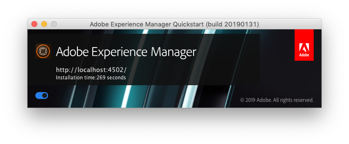

# Inicio y parada de la línea de comandos{#command-line-start-and-stop}

## Iniciar Adobe Experience Manager desde la línea de comandos {#starting-adobe-experience-manager-from-the-command-line}

El `start` El script está disponible en *el &lt;cq-installation>/bin* directorio. Se proporcionan las versiones UNIX® y Windows. La secuencia de comandos inicia la instancia instalada en *&lt;cq-installation>* directorio.

Estas dos versiones admiten una lista de variables de entorno que pueden utilizarse para iniciar y ajustar la instancia de Adobe Experience Manager AEM ().

<table>
 <tbody>
  <tr>
   <td><strong>Variable de entorno </strong></td>
   <td><strong>Descripción </strong></td>
  </tr>
  <tr>
   <td>CQ_PORT</td>
   <td>Puerto TCP utilizado para secuencias de comandos de estado y detención<br /> </td>
  </tr>
  <tr>
   <td>CQ_HOST</td>
   <td>Nombre de host<br /> </td>
  </tr>
  <tr>
   <td>CQ_INTERFACE</td>
   <td>Interfaz que este servidor debe escuchar<br /> </td>
  </tr>
  <tr>
   <td>CQ_RUNMODE</td>
   <td>Modos de ejecución separados por comas<br /> </td>
  </tr>
  <tr>
   <td>CQ_JARFILE</td>
   <td>Nombre del archivo jar<br /> </td>
  </tr>
  <tr>
   <td>CQ_USE_JAS</td>
   <td>Uso de JAAS (si es verdadero)<br /> </td>
  </tr>
  <tr>
   <td>CQ_JAS_CONFIG</td>
   <td>Ruta de la configuración de JAAS<br /> </td>
  </tr>
  <tr>
   <td>CQ_JVM_OPTS</td>
   <td>Opciones de JVM predeterminadas<br /> </td>
  </tr>
 </tbody>
</table>

>[!CAUTION]
>
>AEM Algunos modos de ejecución, entre ellos autor y publicación, deben configurarse antes de empezar a trabajar por primera vez y no se pueden cambiar posteriormente. AEM Antes de configurar una instancia de que se utilice en la producción, consulte [documentación sobre los modos de ejecución](/help/sites-deploying/configure-runmodes.md) para obtener más información.

### Ejemplo de script start.bat de la plataforma Windows {#windows-platform-start-bat-script-example}

```shell
SET CQ_PORT=1234 & ./start.bat
```

### Ejemplo de script de inicio de la plataforma UNIX® {#unix-platform-start-script-example}

```shell
CQ_PORT=1234 ./start
```

>[!NOTE]
>
>AEM La secuencia de comandos de inicio inicia el inicio rápido de la aplicación instalado en *el &lt;cq-installation>/app* carpeta.

## Detención de Adobe Experience Manager {#stopping-adobe-experience-manager}

AEM Para detener la, siga uno de estos procedimientos:

* Según la plataforma que utilice:

   * AEM Si ha empezado a utilizar el comando desde una secuencia de comandos o desde la línea de comandos, pulse **Ctrl + C** para apagar el servidor.
   * AEM Si ha utilizado la secuencia de comandos de inicio en UNIX®, debe utilizar la secuencia de comandos de detención para detener la ejecución de los programas de la aplicación de la.

* AEM Si ha empezado a hacer clic en el archivo jar, haga clic en el botón de la barra de herramientas. **Activado** en la ventana de inicio (el botón cambia a **Desactivado**) para apagar el servidor.

  

## Detención de Adobe Experience Manager desde la línea de comandos {#stopping-adobe-experience-manager-from-the-command-line}

El `stop` El script está disponible en *el &lt;cq-installation>/bin* directorio. Se proporcionan las versiones UNIX® y Windows. El script detiene la instancia en ejecución instalada en *&lt;cq-installation>* directorio.

### Ejemplo de script de detención de plataforma UNIX® {#unix-platform-stop-script-example}

```shell
./stop
```

### Ejemplo de script stop.bat de la plataforma Windows {#windows-platform-stop-bat-script-example}

```shell
./stop.bat
```

Si solo desea preconfigurar el repositorio (sin reubicarlo), solo tiene que:

* Extract `repository.xml` a la ubicación requerida

* actualizar `repository.xml` según sea necesario

* crear `bootstrap.properties` y definir `repository.config`

De nuevo, antes de iniciar la instalación real.
