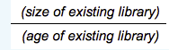

# Optimización del rendimiento {#performance-optimization}

>[!NOTE]
>
>Para obtener directrices generales sobre rendimiento, lea la página [Directrices de rendimiento](/help/sites-deploying/performance-guidelines.md).
>
>Para obtener más información sobre la resolución de problemas y la corrección de problemas de rendimiento, consulte también el [Árbol de rendimiento](/help/sites-deploying/performance-tree.md).
>
>Además, puede revisar un artículo de la Base de conocimiento sobre [Consejos de ajuste del rendimiento.](https://helpx.adobe.com/experience-manager/kb/performance-tuning-tips.html)

Un problema clave es el tiempo que tarda el sitio web en responder a las solicitudes de los visitantes. Aunque este valor variará para cada solicitud, se puede definir un valor de objetivo promedio. Una vez comprobado que este valor es alcanzable y mantenible, puede utilizarse para monitorear el rendimiento del sitio web e indicar el desarrollo de posibles problemas.

Los tiempos de respuesta que va a buscar serán diferentes en los entornos de autor y publicación, lo que refleja las diferentes características de la audiencia de destino:

## Entorno de creación {#author-environment}

Este entorno lo utilizan los autores que introducen y actualizan contenido. Debe satisfacer a un pequeño número de usuarios, cada uno de los cuales genera un número elevado de solicitudes de rendimiento intensivo al actualizar páginas de contenido y los elementos individuales de esas páginas.

## Entorno de publicación {#publish-environment}

Este entorno contiene contenido que puede poner a disposición de los usuarios. En este caso, el número de solicitudes es incluso bueno y la velocidad es igualmente vital, pero dado que la naturaleza de las solicitudes es menos dinámica, se pueden aplicar mecanismos adicionales de mejora del rendimiento; como almacenar en caché el contenido o el equilibrio de carga.

>[!NOTE]
>
>* Después de configurar para la optimización del rendimiento, siga los procedimientos de [Tough Day](/help/sites-developing/tough-day.md) para probar el entorno bajo una carga pesada.
>* Consulte también [Consejos de ajuste del rendimiento.](https://helpx.adobe.com/experience-manager/kb/performance-tuning-tips.html)


## Metodología de optimización del rendimiento {#performance-optimization-methodology}

Una metodología de optimización del rendimiento para AEM proyectos se puede resumir en cinco reglas muy sencillas que se pueden seguir para evitar problemas de rendimiento desde el principio:

1. [Planificación para la optimización](#planning-for-optimization)
1. [Simular realidad](#simulate-reality)
1. [Establecer objetivos sólidos](#establish-solid-goals)
1. [Mantener relevancia](#stay-relevant)
1. [Ciclos de iteración ágiles](#agile-iteration-cycles)

Estas reglas, en gran medida, se aplican a los proyectos web en general y son relevantes para los administradores de proyectos y sistemas a fin de garantizar que sus proyectos no enfrenten desafíos de rendimiento cuando llegue el momento de lanzamiento.

### Planificación para la optimización {#planning-for-optimization}


Alrededor del 10% del esfuerzo del proyecto debe planificarse para la fase de optimización del rendimiento. Por supuesto, los requisitos reales de optimización del rendimiento dependerán del nivel de complejidad de un proyecto y de la experiencia del equipo de desarrollo. Aunque el proyecto puede (en última instancia) no requerir todo el tiempo asignado, es recomendable planificar siempre la optimización del rendimiento en la región sugerida.

Siempre que sea posible, un proyecto debe iniciarse de forma flexible para una audiencia limitada con el fin de obtener experiencia en la vida real y realizar más optimizaciones, sin la presión adicional que sigue a un anuncio completo.

Una vez que esté &quot;activo&quot;, la optimización del rendimiento no ha finalizado. Este es el momento en el que experimenta la carga &quot;real&quot; en su sistema. Es importante planificar ajustes adicionales después del lanzamiento.

Dado que la carga del sistema cambia y los perfiles de rendimiento del sistema cambian con el tiempo, se debe programar una &quot;configuración&quot; o &quot;comprobación de estado&quot; de rendimiento a intervalos de 6 a 12 meses.

### Simular realidad {#simulate-reality}


Si se activa con un sitio web y después del lanzamiento descubre que se encuentra con problemas de rendimiento, solo hay una razón para ello: Las pruebas de carga y rendimiento no simulaban la realidad lo suficientemente de cerca.

Simular la realidad es difícil y el esfuerzo que usted querrá razonablemente invertir en ser &quot;real&quot; depende de la naturaleza de su proyecto. &quot;Real&quot; significa no solo &quot;código real&quot; y &quot;tráfico real&quot;, sino también &quot;contenido real&quot;, especialmente con respecto al tamaño y la estructura del contenido. Tenga en cuenta que las plantillas pueden comportarse de forma completamente diferente según el tamaño y la estructura del repositorio.

### Establecer objetivos sólidos {#establish-solid-goals}


No debe subestimarse la importancia de establecer adecuadamente los objetivos de ejecución. A menudo, una vez que las personas se centran en objetivos de rendimiento específicos, es muy difícil cambiar estos objetivos después, incluso si se basan en suposiciones salvajes.

El establecimiento de objetivos de rendimiento sólidos y buenos es en realidad una de las áreas más complicadas. A menudo es mejor recopilar &quot;logs&quot; de la vida real y puntos de referencia de un sitio web comparable (por ejemplo, el predecesor del nuevo sitio web).

### Mantener relevante {#stay-relevant}


Es importante optimizar un cuello de botella a la vez. Si intenta hacer cosas en paralelo sin validar el impacto de una optimización, perderá el seguimiento de qué medida de optimización ayudó en realidad.

### Ciclos de iteración ágiles {#agile-iteration-cycles}


El ajuste del rendimiento es un proceso iterativo que implica, mide, analiza, optimiza y valida hasta que se alcanza el objetivo. Para tener en cuenta este aspecto adecuadamente, implemente un proceso de validación ágil en la fase de optimización en lugar de un proceso de prueba de mayor peso después de cada iteración.

Esto significa en gran medida que el desarrollador que implementa la optimización debería tener una forma rápida de saber si la optimización ya ha alcanzado el objetivo. Esta información es valiosa, ya que cuando se alcanza el objetivo, la optimización finaliza.

## Directrices de rendimiento básicas {#basic-performance-guidelines}

En términos generales, mantenga sus solicitudes html sin almacenar en caché a menos de 100 ms. Más concretamente, puede servir de guía:

* El 70 % de las solicitudes de páginas deben responderse en menos de 100 ms.
* El 25 % de las solicitudes de páginas deben obtener una respuesta entre 100 y 300 ms.
* El 4 % de las solicitudes de páginas deben obtener una respuesta entre 300 y 500 ms.
* El 1 % de las solicitudes de páginas deben obtener una respuesta entre 500 ms y 1000 ms.
* Ninguna página debe responder más lentamente que 1 segundo.

Los números anteriores asumen las siguientes condiciones:

* Se mide en la publicación (no hay sobrecargas relacionadas con un entorno de creación)
* Medido en el servidor (sin sobrecarga de red)
* No almacenado en caché (sin caché de salida AEM, sin caché de Dispatcher)
* Solo para elementos complejos con muchas dependencias (HTML, JS, PDF, ...)
* No hay otra carga en el sistema

Hay una serie de problemas que con frecuencia contribuyen a los problemas de rendimiento. Estas giran principalmente en torno a:

* Ineficiencia en el almacenamiento en caché de Dispatcher
* El uso de consultas en plantillas de visualización normales.

El ajuste a nivel de JVM y OS no suele dar lugar a grandes avances en el rendimiento y, por lo tanto, debe realizarse al final del ciclo de optimización.

La forma en que se estructura un repositorio de contenido también puede afectar al rendimiento. Para obtener el mejor rendimiento, el número de nodos secundarios conectados a nodos individuales en un repositorio de contenido no debe superar los 1000 (como regla general).

Sus mejores amigos durante un ejercicio de optimización de rendimiento habitual son:

* El `request.log`
* Temporización basada en componentes
* Por último, pero no menos importante, un perfilador java.

### Rendimiento al cargar y editar recursos digitales {#performance-when-loading-and-editing-digital-assets}

Debido al gran volumen de datos implicados al cargar y editar recursos digitales, el rendimiento puede convertirse en un problema.

Dos cosas afectan al rendimiento aquí:

* CPU: varios núcleos permiten un trabajo más fluido al transcodificar
* Disco duro: los discos RAID paralelos logran lo mismo

Para mejorar el rendimiento, puede considerar lo siguiente:

* ¿Cuántos recursos se van a cargar al día? Una buena estimación puede basarse en:



* Plazo en el que se realizarán las modificaciones (normalmente la duración de la jornada laboral, más para las operaciones internacionales).
* El tamaño medio de las imágenes cargadas (y el tamaño de las representaciones generadas por imagen) en megabytes.
* Determine la tasa de datos promedio:


* El 80 % de todas las ediciones se realizarán en el 20 % de las veces, por lo que en las horas de mayor actividad tendrá 4 veces la tasa de datos promedio. Este es su objetivo de rendimiento.

## Monitorización del rendimiento {#performance-monitoring}

El rendimiento (o la falta de él) es una de las primeras cosas que los usuarios notan, por lo que, al igual que con cualquier aplicación con una interfaz de usuario, el rendimiento es fundamental. Para optimizar el rendimiento de la instalación de AEM, debe monitorizar varios atributos de la instancia y su comportamiento.

Para obtener información sobre cómo realizar la supervisión del rendimiento, consulte [Monitorización del rendimiento](/help/sites-deploying/monitoring-and-maintaining.md#monitoring-performance).

Los problemas que causan problemas de rendimiento a menudo son difíciles de rastrear, incluso cuando sus efectos son fáciles de ver.

Un punto de partida básico es un buen conocimiento de su sistema cuando está funcionando con normalidad. A menos que sepa cómo se &quot;ve&quot; y &quot;se comporta&quot; su entorno cuando está funcionando correctamente, puede ser difícil localizar el problema cuando el rendimiento se deteriora. Esto significa que debería pasar algún tiempo investigando su sistema cuando se está ejecutando sin problemas y asegurarse de que recopilar información de rendimiento es una tarea constante. Esto le proporcionará una base para la comparación en caso de que sufra el rendimiento.

El diagrama siguiente ilustra la ruta que puede tomar una solicitud de contenido AEM y, por lo tanto, el número de elementos diferentes que pueden afectar al rendimiento.


El rendimiento también es un equilibrio entre volumen y capacidad:

* **Volumen** : cantidad de salida que procesa y entrega el sistema.
* **Capacidad** : la capacidad del sistema para entregar el volumen.

Esto se puede ilustrar en varias ubicaciones de la cadena web.


Hay varias áreas funcionales que a menudo son responsables de afectar el rendimiento:

* Almacenamiento en caché
* Código de aplicación (proyecto)
* Funcionalidad de búsqueda

### Reglas básicas sobre rendimiento {#basic-rules-regarding-performance}

Algunas reglas deben tenerse en cuenta al optimizar el rendimiento:

* El ajuste de rendimiento *debe* formar parte de cada proyecto.
* No optimice al inicio del ciclo de desarrollo.
* El rendimiento es tan bueno como el vínculo más débil.
* Piense siempre en la capacidad frente al volumen.
* Primero, optimice las cosas importantes.
* Nunca optimice sin *objetivos* realistas.

>[!NOTE]
>
>Tenga en cuenta que el mecanismo que utilice para medir el rendimiento a menudo afectará exactamente a lo que está intentando medir. Siempre debe tratar de tener en cuenta estas discrepancias y eliminar el mayor efecto posible; en particular, los complementos del explorador deben desactivarse siempre que sea posible.

## Configuración para el rendimiento {#configuring-for-performance}

Ciertos aspectos de AEM (y/o el repositorio subyacente) se pueden configurar para optimizar el rendimiento. Las siguientes son posibilidades y sugerencias, debe asegurarse de si utiliza la funcionalidad en cuestión antes de realizar cambios o cómo hacerlo.

>[!NOTE]
>
>Para obtener más información, consulte el [artículo de la KB](https://helpx.adobe.com/experience-manager/kb/performance-tuning-tips.html).

### Indexación de búsqueda {#search-indexing}

A partir de AEM 6.0, Adobe Experience Manager utiliza una arquitectura de repositorios basada en Oak.

Puede encontrar la información de indexación actualizada aquí:

* [Prácticas recomendadas para consultas e indexación](/help/sites-deploying/best-practices-for-queries-and-indexing.md)
* [Consultas e indexación](/help/sites-deploying/queries-and-indexing.md)

### Procesamiento de flujo de trabajo simultáneo {#concurrent-workflow-processing}

Limite el número de procesos de flujo de trabajo que se ejecutan simultáneamente para mejorar el rendimiento. De forma predeterminada, el motor de flujo de trabajo procesa tantos flujos de trabajo en paralelo como procesadores disponibles para la VM de Java. Cuando los pasos del flujo de trabajo requieren grandes cantidades de recursos de procesamiento (RAM o CPU), la ejecución de varios de estos flujos de trabajo en paralelo puede suponer una gran demanda para los recursos de servidor disponibles.

Por ejemplo, cuando se cargan imágenes (o recursos DAM en general), los flujos de trabajo importan automáticamente las imágenes a DAM. Las imágenes suelen ser de alta resolución y pueden consumir fácilmente cientos de MB de memoria para su procesamiento. El manejo de estas imágenes en paralelo coloca una carga alta en el subsistema de memoria y en el recolector de basura.

El motor de flujo de trabajo utiliza colas de trabajos de Apache Sling para gestionar y programar el procesamiento de elementos de trabajo. Los siguientes servicios de cola de trabajos se han creado de forma predeterminada desde la fábrica del servicio Apache Sling Job Queue Configuration para procesar los trabajos de flujo de trabajo:

* Cola de flujo de trabajo de Granite: La mayoría de los pasos del flujo de trabajo, como los que procesan recursos DAM, utilizan el servicio Cola de flujo de trabajo de Granite.
* Cola de trabajos de proceso externo de Granite Workflow: Este servicio se utiliza para pasos especiales de flujo de trabajo externo que normalmente se utilizan para ponerse en contacto con un sistema externo y para sondear los resultados. Por ejemplo, el paso Proceso de extracción de medios de InDesign se implementa como un proceso externo. El motor de flujo de trabajo utiliza la cola externa para procesar el sondeo. (Consulte [com.day.cq.workflow.exec.WorkflowExternalProcess](https://helpx.adobe.com/experience-manager/6-5/sites/developing/using/reference-materials/javadoc/com/day/cq/workflow/exec/WorkflowExternalProcess.html)).

Configure estos servicios para limitar el número máximo de procesos de flujo de trabajo que se ejecuten simultáneamente.

>[!NOTE]
>
>La configuración de estas colas de trabajos afecta a todos los flujos de trabajo a menos que haya creado una cola de trabajos para un modelo de flujo de trabajo específico (consulte [Configure the Queue for a Specific Workflow Model](/help/sites-deploying/configuring-performance.md#configure-the-queue-for-a-specific-workflow) más abajo).

#### Configuración en el repositorio {#configuration-in-the-repo}

Si está configurando los servicios [utilizando un nodo sling:OsgiConfig](/help/sites-deploying/configuring-osgi.md#adding-a-new-configuration-to-the-repository), debe encontrar el PID de los servicios existentes, por ejemplo: org.apache.sling.event.jobs.QueueConfiguration.370aad73-d01b-4a0b-abe4-20198d85f705. Puede descubrir el PID mediante la consola web.

Debe configurar la propiedad denominada `queue.maxparallel`.

#### Configuración en la consola web {#configuration-in-the-web-console}

Para configurar estos servicios [mediante la Consola Web](/help/sites-deploying/configuring-osgi.md#osgi-configuration-with-the-web-console), localice los elementos de configuración existentes debajo de la fábrica del servicio Apache Sling Job Queue Configuration.

Debe configurar la propiedad denominada Maximum Parallel Jobs (Máximo de trabajos paralelos).

### Configurar la cola para un flujo de trabajo específico {#configure-the-queue-for-a-specific-workflow}

Cree una cola de trabajos para un modelo de flujo de trabajo específico para que pueda configurar la gestión de trabajos para ese modelo de flujo de trabajo. De este modo, las configuraciones afectan al procesamiento de un flujo de trabajo específico, mientras que la configuración de la cola de flujo de trabajo predeterminada de Granite controla el procesamiento de otros flujos de trabajo.

Cuando se ejecutan los modelos de flujo de trabajo, crean trabajos de Sling para un tema específico. De forma predeterminada, el tema coincide con los temas configurados para la cola general de flujo de trabajo de Granite o la cola de trabajos de proceso externo de Granite Workflow:

* `com/adobe/granite/workflow/job*`
* `com/adobe/granite/workflow/external/job*`

Los temas de trabajo reales que generan los modelos de flujo de trabajo incluyen el sufijo específico del modelo. Por ejemplo, el modelo de flujo de trabajo **Activo de actualización de DAM** genera trabajos con el siguiente tema:

`com/adobe/granite/workflow/job/etc/workflow/models/dam/update_asset/jcr_content/model`

Por lo tanto, puede crear una cola de trabajos para el tema que coincida con los temas del trabajo del modelo de flujo de trabajo. La configuración de las propiedades de la cola relacionadas con el rendimiento afecta únicamente al modelo de flujo de trabajo que genera los trabajos que coinciden con el tema de la cola.

El siguiente procedimiento crea una cola de trabajos para un flujo de trabajo, utilizando el flujo de trabajo **DAM Update Asset** como ejemplo.

1. Ejecute el modelo de flujo de trabajo para el que desea crear la cola de trabajos, de modo que se generen las estadísticas de temas. Por ejemplo, agregue una imagen a Assets para ejecutar el flujo de trabajo **Activo de actualización de DAM**.
1. Abra la consola Trabajos de Sling (`https://<host>:<port>/system/console/slingevent`).
1. Descubra los temas relacionados con el flujo de trabajo en la consola. Para DAM Update Asset, se encuentran los siguientes temas:

   * `com/adobe/granite/workflow/external/job/etc/workflow/models/dam/update_asset/jcr_content/model`
   * `com/adobe/granite/workflow/job/etc/workflow/models/dam/update_asset/jcr_content/model`
   * `com/adobe/granite/workflow/job/etc/workflow/models/dam-xmp-writeback/jcr_content/model`

1. Cree una cola de trabajos para cada uno de estos temas. Para crear una cola de trabajos, cree una configuración de fábrica para el servicio de fábrica Apache Sling Job Queue .

   Las configuraciones de fábrica son similares a la cola de flujo de trabajo de Granite descrita en [Procesamiento de flujo de trabajo simultáneo](/help/sites-deploying/configuring-performance.md#concurrent-workflow-processing), excepto que la propiedad Temas coincide con el tema de los trabajos de flujo de trabajo.

### Servicio de sincronización de recursos DAM de AEM {#cq-dam-asset-synchronization-service}

El `AssetSynchronizationService` se utiliza para sincronizar activos de repositorios montados (incluidos LiveLink, Documentum, entre otros). De forma predeterminada, esto hace una comprobación regular cada 300 segundos (5 minutos), por lo que si no utiliza repositorios montados, puede desactivar este servicio.

Esto se hace [configurando el servicio OSGi](/help/sites-deploying/configuring-osgi.md) **Servicio de sincronización de recursos CQ DAM** para establecer el **periodo de sincronización** ( `scheduler.period`) en (un mínimo de) 1 año (definido en segundos).

### Varias instancias de DAM {#multiple-dam-instances}

La implementación de varias instancias de DAM puede ayudar al rendimiento cuando, por ejemplo:

* Tiene una carga alta debido a la carga regular de un gran número de recursos para el entorno de creación; aquí se puede dedicar una instancia de DAM independiente a la prestación de servicios al autor.
* Tiene varios equipos en ubicaciones de todo el mundo (por ejemplo, EE. UU., Europa, Asia).

Otras consideraciones son:

* Separación del &quot;trabajo en curso&quot; en el autor de &quot;final&quot; en la publicación
* Separar los usuarios internos del autor de los visitantes/usuarios externos en la publicación (por ejemplo, agentes, representantes de prensa, clientes, estudiantes, etc.).

## Prácticas recomendadas para el control de calidad {#best-practices-for-quality-assurance}

El rendimiento es de gran importancia para su entorno de publicación. Por lo tanto, debe planificar y analizar cuidadosamente las pruebas de rendimiento que realizará para el entorno de publicación al implementar el proyecto.

Esta sección tiene como objetivo proporcionar una visión general estandarizada de los problemas relacionados con la definición de un concepto de prueba específicamente para las pruebas de rendimiento en el entorno *publish*. Esto es de interés principalmente para los ingenieros de control de calidad, los directores de proyectos y los administradores de sistemas.

A continuación se describe un enfoque estandarizado de las pruebas de rendimiento para una aplicación AEM en el entorno *Publish*. Esto incluye las siguientes 5 fases:

* [Verificación del conocimiento](#verification-of-knowledge)
* [Definición del ámbito](#scope-definition)
* [Metodologías de prueba](#test-methodologies)
* [Definición de objetivos de rendimiento](#defining-the-performance-goals)
* [Optimización](#optimization)

El control es un proceso adicional y completo, necesario pero no limitado a las pruebas.

### Verificación del conocimiento {#verification-of-knowledge}

Un primer paso es documentar la información de base que necesita conocer antes de comenzar a probar:

* La arquitectura del entorno de prueba
* Un mapa de aplicación que detalla los elementos internos que deberán probarse (tanto aislados como combinados).

#### Arquitectura de prueba {#test-architecture}

Debe documentar claramente la arquitectura del entorno de prueba que se utiliza para las pruebas de rendimiento.

Necesitará una reproducción del entorno de publicación de producción planificado, junto con Dispatcher y Load Balancer.

#### Mapa de aplicaciones {#application-map}

Para obtener una descripción general clara, puede crear un mapa de toda la aplicación (puede que lo tenga de las pruebas en el entorno Autor).

Una representación de diagrama de los elementos internos de la aplicación puede ofrecer una visión general de los requisitos de prueba; con la codificación por colores, también puede servir de base para la creación de informes.

### Definición de ámbito {#scope-definition}

Una aplicación suele tener una selección de casos de uso. Algunos serán muy importantes, otros menos.

Para centrar el ámbito de las pruebas de rendimiento en la publicación, se recomienda definir lo siguiente:

* Casos de uso empresarial más importantes
* Casos de uso técnico más importantes

El número de casos de uso depende de usted, pero debe limitarse a un número fácilmente manejable (por ejemplo, entre 5 y 10).

Una vez seleccionados los casos de uso clave, los indicadores de rendimiento clave (KPI) y las herramientas utilizadas para medirlos se pueden definir para cada caso. Algunos ejemplos de KPI comunes son:

* Tiempo de respuesta de extremo a extremo
* Tiempo de respuesta del servlet
* Tiempo de respuesta para un solo componente
* Tiempo de respuesta para los servicios
* Número de subprocesos inactivos en el grupo de subprocesos
* Número de conexiones libres
* Recursos del sistema como CPU y acceso a E/S

### Metodologías de prueba {#test-methodologies}

Este concepto tiene 4 escenarios utilizados para definir y probar los objetivos de rendimiento:

* Pruebas de un solo componente
* Pruebas de componentes combinadas
* *El* escenario en curso
* Situaciones de error

Se basa en los principios siguientes:

#### Puntos de interrupción de componentes {#component-breakpoints}

* Cada componente tiene un punto de interrupción específico cuando está relacionado con el rendimiento. Esto significa que un componente puede mostrar un buen rendimiento hasta que se alcanza un punto específico, después del cual el rendimiento se degradará rápidamente.
* Para obtener una descripción general completa de la aplicación, primero debe verificar los componentes para determinar cuándo se alcanza el punto de interrupción de cada uno.
* Para encontrar el punto de interrupción, puede realizar una prueba de carga en la que, durante un periodo de tiempo, aumente el número de usuarios que crean una carga creciente. Al controlar esta carga y la respuesta de los componentes, se encontrará con un comportamiento de rendimiento específico al alcanzar el punto de interrupción del componente. El punto se puede clasificar por el número de transacciones simultáneas por segundo, junto con el número de usuarios simultáneos (si el componente es sensible a este KPI).
* A continuación, esta información puede servir de referencia para las mejoras, indicar la eficacia de las medidas utilizadas y ayudar a definir los escenarios de prueba.

#### Transacciones {#transactions}

* El término transacción se utiliza para representar la solicitud de una página web completa, incluida la propia página y todas las llamadas subsiguientes; es decir, la solicitud de página, cualquier llamada de AJAX, imágenes y otros objetos.**Desglose de solicitud**
* Para analizar completamente cada solicitud, puede representar cada elemento de la pila de llamadas y luego totales del tiempo de procesamiento promedio para cada uno.

### Definición de los objetivos de rendimiento {#defining-the-performance-goals}

Una vez definido el ámbito y los KPI relacionados, se pueden establecer los objetivos de rendimiento específicos. Esto implica diseñar escenarios de prueba, junto con valores de destino.

Tendrá que probar el rendimiento tanto en condiciones de media como de pico. Además, necesitará probar el escenario de Activación para asegurarse de que puede aumentar el interés en su sitio web cuando esté disponible por primera vez.

Cualquier experiencia o estadística que haya recopilado de un sitio web existente también puede ser útil para determinar objetivos futuros; por ejemplo, el tráfico principal del sitio web activo.

#### Pruebas de un solo componente {#single-component-tests}

Será necesario probar los componentes críticos, tanto en condiciones medias como de pico.

En ambos casos, se puede definir el número esperado de transacciones por segundo cuando un número predefinido de usuarios utiliza el sistema.

| Componente | Tipo de prueba | No. de usuarios | Tx/s (esperado) | Tx/seg (probado) | Descripción |
|---|---|---|---|---|---|
| Página principal de usuario único | Promedio | 1 | 1 |  |  |
|  | Pico | 1 | 3 |  |  |
| Página principal 100 usuarios | Promedio | 100 | 1 |  |  |
|  | Pico | 100 | 1 |  |

#### Pruebas de componentes combinadas {#combined-component-tests}

La prueba de los componentes en combinación ofrece un reflejo más profundo del comportamiento de las aplicaciones. Una vez más, deben probarse las condiciones medias y máximas.

| Situación | Componente | No. de usuarios | Tx/s (esperado) | Tx/seg (probado) | Descripción |
|---|---|---|---|---|---|
| Media mixta | Página principal | 10 | 1 |  |  |
|  | Búsqueda   | 10 | 3 |  |  |
|  | Noticias | 10 | 2 |  |  |
|  | Sucesos | 10 | 1 |  |  |
|  | Activaciones | 10 | 3 |  | Simulación del comportamiento del autor. |
| Pico mixto | Página principal | 100 | 5 |  |  |
|  | Búsqueda   | 50 | 5 |  |  |
|  | Noticias | 100 | 10 |  |  |
|  | Sucesos | 100 | 10 |  |  |
|  | Activaciones | 20 | 20 |  | Simulación del comportamiento del autor. |

#### Pruebas en directo {#going-live-tests}

Durante los primeros días después de que su sitio web esté disponible, puede esperar un mayor nivel de interés. Probablemente esto será incluso bueno respecto a los valores pico que ha estado probando. Se recomienda probar los escenarios en directo para asegurarse de que el sistema pueda solucionar esta situación.

| Situación | Tipo de prueba | No. de usuarios | Tx/s (esperado) | Tx/seg (probado) | Descripción |
|---|---|---|---|---|---|
| Volver al pico activo | Página principal | 200 | 20 |  |  |
|  | Búsqueda   | 100 | 10 |  |  |
|  | Noticias | 200 | 20 |  |  |
|  | Sucesos | 200 | 20 |  |  |
|  | Activaciones | 20 | 20 |  | Simulación del comportamiento del autor. |

#### Pruebas de escenario de error {#error-scenario-tests}

Los escenarios de error también deben probarse para garantizar que el sistema reaccione correcta y adecuadamente. No solo en la forma en que se gestiona el error en sí, sino también en el impacto que puede tener en el rendimiento. Por ejemplo:

* Qué sucede cuando el usuario intenta introducir un término de búsqueda no válido en el cuadro de búsqueda
* Qué sucede cuando el término de búsqueda es tan general que devuelve un número excesivo de resultados

Al diseñar estas pruebas, debe recordarse que no todos los escenarios se producirán con regularidad. Sin embargo, su impacto en todo el sistema es importante.

| Escenario de error | Tipo de error | No. de usuarios | Tx/s (esperado) | Tx/seg (probado) | Descripción |
|---|---|---|---|---|---|
| Sobrecarga del componente de búsqueda | Buscar en comodín global (asterisco) | 10 | 3 |  | Solo &amp;ast;&amp;ast;&amp;ast;&amp;ast; se buscan. |
|  | Palabra Parada | 20 | 2 |  | Buscando una palabra clave. |
|  | Cadena vacía | 10 | 3 |  | Buscando una cadena vacía. |
|  | Caracteres especiales | 10 | 3 |  | Buscando caracteres especiales. |

#### Pruebas de resistencia {#endurance-tests}

Algunos problemas solo se encontrarán una vez que el sistema se haya ejecutado durante un período de tiempo continuo; sea en horas o incluso días. Se utiliza una prueba de resistencia para probar una carga promedio constante durante un período de tiempo requerido. A continuación, se puede analizar cualquier degradación del rendimiento.

| Situación | Tipo de prueba | No. de usuarios | Tx/s (esperado) | Tx/seg (probado) | Descripción |
|---|---|---|---|---|---|
| Ensayo de resistencia (72 horas) | Página principal | 10 | 3 |  |  |
|  | Búsqueda   | 10 | 3 |  |  |
|  | Noticias | 20 | 2 |  |  |
|  | Sucesos | 10 | 3 |  |  |
|  | Activaciones | 1 | 3 |  | Simulación del comportamiento del autor. |

### Optimización {#optimization}

En las etapas posteriores de la implementación, deberá optimizar la aplicación para cumplir/maximizar los objetivos de rendimiento.

Las optimizaciones realizadas deberán probarse para garantizar que:

* No afecta a la funcionalidad
* Se ha verificado con las pruebas de carga antes de liberarse

Hay una selección de herramientas disponibles para ayudarle con la generación de carga, la monitorización del rendimiento y/o el análisis de resultados:

* [JMeter](https://jakarta.apache.org/jmeter/)
* [Cargar ejecución](https://www.microfocus.com/en-us/products/loadrunner-load-testing/overview)
* [](https://www.determyne.com/) DetermyneInsideApps
* [InfraRED](https://www.infraredsoftware.com/)
* [Perfil interactivo de Java](https://jiprof.sourceforge.net/)
* Muchas más...

Después de la optimización, tendrá que volver a realizar pruebas para confirmar el impacto.

### Informes {#reporting}

Los informes en curso serán necesarios para mantener a todos informados del estado, como se mencionó anteriormente con la codificación por colores, el mapa de arquitectura se puede usar para esto.

Una vez completadas todas las pruebas, debe informar sobre:

* Cualquier error crítico encontrado
* Cuestiones no críticas que seguirán siendo objeto de investigación
* Cualquier suposición efectuada durante las pruebas
* Cualquier recomendación que surja de la prueba

## Optimización del rendimiento al utilizar Dispatcher {#optimizing-performance-when-using-the-dispatcher}

El [Dispatcher](https://helpx.adobe.com/experience-manager/dispatcher/using/dispatcher.html) es la herramienta de almacenamiento en caché o equilibrio de carga del Adobe. Al utilizar Dispatcher, debe considerar la posibilidad de optimizar el rendimiento de la caché del sitio web.

>[!NOTE]
>
>Las versiones de Dispatcher son independientes de AEM, pero la documentación de Dispatcher está incrustada en la documentación de AEM. Utilice siempre la documentación de Dispatcher incrustada en la documentación para la versión más reciente de AEM.
>
>Es posible que se le haya redirigido a esta página si ha seguido un vínculo a la documentación de Dispatcher insertado en la documentación de una versión anterior de AEM.

Dispatcher ofrece una serie de mecanismos integrados que puede utilizar para optimizar el rendimiento si el sitio web los aprovecha. Esta sección le explica cómo diseñar su sitio web para maximizar los beneficios del almacenamiento en caché.

>[!NOTE]
>
>Puede ayudarle a recordar que Dispatcher almacena la caché en un servidor web estándar. Esto significa que:
>
>* Puede almacenar en caché todo lo que pueda almacenar como página y solicitar mediante una URL
>* No se pueden almacenar otras cosas, como cookies, datos de sesión y datos de formulario.

>
>
En general, muchas estrategias de almacenamiento en caché implican la selección de buenas direcciones URL y no depender de estos datos adicionales.
>
>Con la versión 4.1.11 de Dispatcher también puede almacenar en caché los encabezados de respuesta; consulte [Almacenamiento en caché de encabezados de respuesta HTTP](https://helpx.adobe.com/experience-manager/dispatcher/using/dispatcher-configuration.html#configuring-the-dispatcher-cache-cache).


### Cálculo de la proporción de caché de Dispatcher {#calculating-the-dispatcher-cache-ratio}

La fórmula de proporción de caché calcula el porcentaje de solicitudes gestionadas por la caché a partir del número total de solicitudes que llegan al sistema. Para calcular la proporción de caché necesita lo siguiente:

* Número total de solicitudes. Esta información está disponible en Apache `access.log`. Para obtener más información, consulte la [documentación oficial de Apache](https://httpd.apache.org/docs/2.4/logs.html#accesslog).

* Número de solicitudes servidas a la instancia de publicación. Esta información está disponible en el `request.log` de la instancia. Para obtener más información, consulte [Interpretación del archivo request.log](/help/sites-deploying/monitoring-and-maintaining.md#interpreting-the-request-log) y [Búsqueda de los archivos de registro](/help/sites-deploying/monitoring-and-maintaining.md#finding-the-log-files).

La fórmula para calcular la proporción de caché es:

* (El número total de solicitudes **menos** el número de solicitudes en Publicar) **dividido** por el número total de solicitudes.

Por ejemplo, si el número total de solicitudes es 129491 y el número de solicitudes atendidas por la instancia de publicación es 58959, la proporción de caché es: **(129491 - 58959)/129491= 54,5%**.

Si no tiene un emparejamiento de uno a uno de los publicadores/dispatcher, deberá agregar solicitudes de todos los distribuidores y editores juntos para obtener una medición precisa. Consulte también [Implementaciones recomendadas](/help/sites-deploying/recommended-deploys.md).

>[!NOTE]
>
>Para obtener el mejor rendimiento, Adobe recomienda una proporción de caché del 90 % al 95 %.

#### Uso de la codificación de página coherente {#using-consistent-page-encoding}

Con la versión 4.1.11 de Dispatcher puede almacenar en caché los encabezados de respuesta. Si no está almacenando encabezados de respuesta en caché en Dispatcher, se pueden producir problemas si almacena información de codificación de página en el encabezado. En este caso, cuando Dispatcher sirve una página desde la caché, se utiliza la codificación predeterminada del servidor web para la página. Existen dos formas de evitar este problema:

* Si solo utiliza una codificación, asegúrese de que la codificación utilizada en el servidor web sea la misma que la codificación predeterminada del sitio web AEM.
* Utilice una etiqueta `<META>` en la sección HTML `head` para configurar la codificación, como en el siguiente ejemplo:

```xml
        <META http-equiv="Content-Type" content="text/html; charset=EUC-JP">
```

#### Evitar parámetros de URL {#avoid-url-parameters}

Si es posible, evite los parámetros de URL para las páginas que desee almacenar en caché. Por ejemplo, si tiene una galería de imágenes, la siguiente URL nunca se almacena en caché (a menos que Dispatcher esté [configurado en consecuencia](https://helpx.adobe.com/experience-manager/dispatcher/using/dispatcher-configuration.html#configuring-the-dispatcher-cache-cache)):

```xml
www.myCompany.com/pictures/gallery.html?event=christmas&amp;page=1
```

Sin embargo, puede colocar estos parámetros en la dirección URL de la página de la siguiente manera:

```xml
www.myCompany.com/pictures/gallery.christmas.1.html
```

>[!NOTE]
>
>Esta dirección URL llama a la misma página y a la misma plantilla que `gallery.html`. En la definición de la plantilla, puede especificar qué secuencia de comandos procesa la página o puede utilizar la misma secuencia de comandos para todas las páginas.

#### Personalizar por dirección URL {#customize-by-url}

Si permite a los usuarios cambiar el tamaño de fuente (o cualquier otra personalización del diseño), asegúrese de que las diferentes personalizaciones se reflejen en la dirección URL.

Por ejemplo, las cookies no se almacenan en caché, por lo que si almacena el tamaño de fuente en una cookie (o mecanismo similar), el tamaño de fuente no se conservará para la página en caché. Como resultado, Dispatcher devuelve aleatoriamente documentos de cualquier tamaño de fuente.

Incluir el tamaño de fuente en la URL como selector evita este problema:

```xml
www.myCompany.com/news/main.large.html
```

>[!NOTE]
>
>Para la mayoría de los aspectos de diseño, también es posible utilizar hojas de estilo o secuencias de comandos del lado del cliente. Normalmente funcionan muy bien con el almacenamiento en caché.
>
>Esto también es útil en una versión impresa, donde puede usar una URL como:
>
>`www.myCompany.com/news/main.print.html`
>
>Mediante la globalización de secuencias de comandos de la definición de la plantilla, puede especificar una secuencia de comandos independiente que procese las páginas de impresión.

#### Invalidación de archivos de imagen utilizados como títulos {#invalidating-image-files-used-as-titles}

Si procesa títulos de páginas u otro texto como imágenes, se recomienda almacenar los archivos para que se eliminen tras actualizar el contenido en la página:

1. Coloque el archivo de imagen en la misma carpeta que la página.
1. Utilice el siguiente formato de nomenclatura para el archivo de imagen:

   `<page file name>.<image file name>`

Por ejemplo, puede almacenar el título de la página `myPage.html` en `file myPage.title.gif`. Este archivo se elimina automáticamente si se actualiza la página, por lo que cualquier cambio en el título de la página se refleja automáticamente en la caché.

>[!NOTE]
>
>El archivo de imagen no existe necesariamente físicamente en la instancia de AEM. Puede utilizar una secuencia de comandos que cree dinámicamente el archivo de imagen. A continuación, Dispatcher almacena el archivo en el servidor web.

#### Invalidación de archivos de imagen utilizados para la navegación {#invalidating-image-files-used-for-navigation}

Si utiliza imágenes para las entradas de navegación, el método es básicamente el mismo que con títulos, un poco más complejo. Almacene todas las imágenes de navegación con las páginas de destino. Si utiliza dos imágenes para normal y activo, puede utilizar las siguientes secuencias de comandos:

* Secuencia de comandos que muestra la página como de costumbre.
* Secuencia de comandos que procesa las solicitudes &quot;.normal&quot; y devuelve la imagen normal.
* Secuencia de comandos que procesa las solicitudes &quot;.active&quot; y devuelve la imagen activada.

Es importante crear estas imágenes con el mismo nombre que la página, para garantizar que una actualización de contenido elimine estas imágenes, así como la página.

En las páginas que no se modifican, las imágenes permanecen en la caché, aunque las páginas en sí suelen invalidarse automáticamente.

#### Personalización {#personalization}

Se recomienda limitar la personalización a donde sea necesario. Para ilustrar por qué:

* Si utiliza una página de inicio personalizable libremente, esa página debe estar compuesta cada vez que un usuario la solicite.
* Si, por el contrario, ofrece una opción de 10 páginas de inicio diferentes, puede almacenar en caché cada una de ellas, lo que mejora el rendimiento.

>[!TIP]
>Para obtener más información sobre la configuración de la caché de Dispatcher, consulte el [AEM Tutorial de caché de Dispatcher](https://experienceleague.adobe.com/docs/experience-manager-learn/dispatcher-tutorial/overview.html) y su sección sobre [Contenido protegido en caché.](https://experienceleague.adobe.com/docs/experience-manager-learn/dispatcher-tutorial/chapter-1.html#dispatcher-tips-and-tricks)

Si personaliza cada página (por ejemplo, colocando el nombre del usuario en la barra de título), puede tener un impacto en el rendimiento.

>[!TIP]
>Para almacenar en caché contenido seguro, consulte [Almacenamiento en caché de contenido seguro](https://experienceleague.adobe.com/docs/experience-manager-dispatcher/using/configuring/permissions-cache.html) en la guía de Dispatcher.

Con respecto a la mezcla de contenido restringido y público en una página, es posible que desee considerar una estrategia que aproveche las inclusiones del lado del servidor en Dispatcher, o las inclusiones del lado del cliente a través de Ajax en el explorador.

>[!TIP]
>
>Para gestionar contenido mixto público y restringido, consulte [Configuración de Sling Dynamic Include.](https://experienceleague.adobe.com/docs/experience-manager-learn/foundation/development/set-up-sling-dynamic-include.html)

#### Conexiones adhesivas {#sticky-connections}

[Conexión ](https://helpx.adobe.com/experience-manager/dispatcher/using/dispatcher.html#the-benefits-of-load-balancing) adhesiva, asegúrese de que los documentos de un usuario están todos compuestos en el mismo servidor. Si un usuario abandona esta carpeta y más tarde vuelve a ella, la conexión se mantiene. Defina una carpeta para guardar todos los documentos que requieran conexiones duraderas para el sitio web. Intente no tener otros documentos en él. Esto afecta al equilibrio de carga si utiliza páginas personalizadas y datos de sesión.

#### Tipos MIME {#mime-types}

Existen dos maneras en que un explorador puede determinar el tipo de archivo:

1. Por su extensión (p. ej. `.html`, `.gif`, `.jpg`, etc.)
1. Por el tipo MIME que el servidor envía con el archivo .

Para la mayoría de los archivos, el tipo MIME está implícito en la extensión de archivo. i.e.:

1. Por su extensión (p. ej. `.html`, `.gif`, `.jpg`, etc.)
1. Por el tipo MIME que el servidor envía con el archivo .

Si el nombre del archivo no tiene extensión, se muestra como texto sin formato.

Con la versión 4.1.11 de Dispatcher puede almacenar en caché los encabezados de respuesta. Si no almacena en caché los encabezados de respuesta en Dispatcher, tenga en cuenta que el tipo MIME forma parte del encabezado HTTP. Por lo tanto, si la aplicación AEM devuelve archivos que no tienen un final de archivo reconocido y dependen del tipo MIME en su lugar, estos archivos pueden mostrarse incorrectamente.

Para asegurarse de que los archivos se almacenan en caché correctamente, siga estas directrices:

* Asegúrese de que los archivos siempre tengan la extensión adecuada.
* Evite las secuencias de comandos genéricas del servidor de archivos, que tienen direcciones URL como `download.jsp?file=2214`. Vuelva a escribir la secuencia de comandos para utilizar las direcciones URL que contengan la especificación del archivo. Para el ejemplo anterior, sería `download.2214.pdf`.

## Rendimiento de Backup {#backup-performance}

Esta sección presenta una serie de puntos de referencia utilizados para evaluar el performance de los backups AEM y los efectos de la actividad de backup en el performance de las aplicaciones. AEM copias de seguridad presentan una carga significativa en el sistema mientras se ejecuta, y lo medimos, así como los efectos de la configuración de demora de copia de seguridad que intenta modular estos efectos. El objetivo es ofrecer algunos datos de referencia sobre el rendimiento esperado de los backups en configuraciones realistas y cantidades de datos de producción, y proporcionar orientación sobre cómo estimar los tiempos de backup para sistemas planificados.

### Entorno de referencia {#reference-environment}

#### Sistema físico {#physical-system}

Los resultados recogidos en este documento se obtuvieron a partir de puntos de referencia ejecutados en un entorno de referencia con la siguiente configuración. Esta configuración está diseñada para ser similar a un entorno de producción típico en un centro de datos:

* H-P ProLiant DL380 G6, 8 CPUs x 2,533 GHz
* Unidades SCSI serial de 300 GB a 10.000 RPM
* Controlador RAID de hardware; 8 unidades en una matriz RAID0+5
* CPU de imagen de VMware x 2 Intel Xeon E5540 a 2,53 GHz
* RedHat Linux 2.6.18-194.el5; Java 1.6.0_29
* Instancia de autor único

El subsistema de disco de este servidor es bastante rápido, representativo de una configuración RAID de alto rendimiento que podría usarse en un servidor de producción. El performance del backup puede ser sensible al performance del disco, y los resultados en este entorno reflejan el performance en una configuración RAID muy rápida. La imagen VMWare está configurada para tener un solo volumen de disco grande que reside físicamente en el almacenamiento de disco local, en el arreglo RAID.

La configuración AEM coloca el repositorio y el almacén de datos en el mismo volumen lógico, junto con todo el sistema operativo y el software AEM. El directorio de destino para copias de seguridad también reside en este sistema de archivos lógico.

#### Volúmenes de datos {#data-volumes}

La siguiente tabla ilustra el tamaño de los volúmenes de datos que se utilizan en los puntos de referencia de backup. El contenido de la línea de base inicial se instala por primera vez y, a continuación, se añaden cantidades conocidas adicionales de datos para aumentar el tamaño del contenido del que se realiza una copia de seguridad. Las copias de seguridad se crearán en incrementos específicos para representar un gran aumento del contenido y lo que se puede producir en un día. La distribución de contenido (páginas, imágenes, etiquetas) se basará, aproximadamente, en una composición de recursos de producción realista. Las páginas, imágenes y etiquetas se limitarán a un máximo de 800 páginas secundarias. Cada página incluirá los componentes de título, Flash, texto/imagen, vídeo, presentación de diapositivas, formulario, tabla, nube y carrusel. Las imágenes se cargarán desde un grupo de 400 archivos únicos de un tamaño que oscila entre 37 kB y 594 kB.

| Contenido | Nodos | Páginas | Imágenes | Etiquetas |
|---|---|---|---|---|
| Instalación base | 69 610 | 562 | 256 | 237 |
| Contenido pequeño para copia de seguridad incremental |  | +100 | +2 | +2 |
| Contenido grande para copia de seguridad completa |  | +10 000 | +100 | +100 |

La referencia de copia de seguridad se repite con los conjuntos de contenido adicionales agregados en cada repetición.

#### Escenarios de referencia {#benchmark-scenarios}

Los puntos de referencia de copia de seguridad cubren dos escenarios principales: cuando el sistema está bajo carga de aplicación significativa, y realiza backups cuando el sistema está inactivo. Aunque la recomendación general es que las copias de seguridad deben realizarse cuando AEM esté lo más inactivo posible, hay situaciones en las que es necesario que la copia de seguridad se ejecute cuando el sistema está en carga.

* **Estado inactivo** : las copias de seguridad se realizan sin ninguna otra actividad en AEM.
* **En Cargar** : las copias de seguridad se realizan mientras el sistema tiene una carga inferior al 80 % de los procesos en línea. El retraso de la copia de seguridad varió para ver el impacto en la carga.

Los tiempos de copia de seguridad y el tamaño de la copia de seguridad resultante se obtienen de los registros del servidor AEM. Normalmente, se recomienda que los backups se programen para tiempos de inactividad cuando el AEM esté inactivo, por ejemplo, a mitad de la noche. Este escenario es representativo del enfoque recomendado.

La carga consistirá en creaciones/eliminaciones de páginas, recorridos y consultas con la mayoría de la carga proveniente de recorridos y consultas de páginas. Agregar y quitar demasiadas páginas aumenta continuamente el tamaño del espacio de trabajo e impide que se completen las copias de seguridad. La distribución de la carga que utilizará la secuencia de comandos es un 75% de travesías de página, un 24% de consultas y un 1% de creaciones de páginas (un nivel sin subpáginas anidadas). El promedio de transacciones por segundo máximo en un sistema inactivo se logra con 4 subprocesos simultáneos, que es lo que se utilizará al probar copias de seguridad en carga.

El impacto de la carga en el performance del backup puede estimarse por la diferencia entre el performance con y sin esta carga de aplicación. El impacto del backup en el rendimiento de las aplicaciones se encuentra comparando el rendimiento del escenario en transacciones por hora con y sin un backup simultáneo en curso, y con backups que operan con diferentes configuraciones de &quot;retraso de backup&quot;.

* **Configuración de retraso** : para varias situaciones, también variamos la configuración de demora de la copia de seguridad, utilizando valores de 10 ms (predeterminado), 1 ms y 0 ms, para explorar cómo esta configuración afectó el rendimiento de las copias de seguridad.
* **Tipo de copia de seguridad** : todas las copias de seguridad eran copias de seguridad externas del repositorio realizadas en un directorio de copia de seguridad sin crear un zip, excepto en un caso para comparación en el que el comando tar se utilizaba directamente. Dado que las copias de seguridad incrementales no se pueden crear en un archivo zip, o cuando la copia de seguridad completa previa es un archivo zip, el método de directorio de copia de seguridad es el más utilizado en situaciones de producción.

### Resumen de resultados {#summary-of-results}

#### Tiempo y Rendimiento de Backup {#backup-time-and-throughput}

El resultado principal de estos análisis de rendimiento es mostrar cómo varían los tiempos de backup en función del tipo de backup y la cantidad total de datos. El siguiente gráfico muestra el tiempo de copia de seguridad obtenido mediante la configuración de copia de seguridad predeterminada, en función del número total de páginas.


Los tiempos de backup en una instancia inactiva son bastante consistentes, con un promedio de 0,608 MB/s independientemente de los backups completos o incrementales (ver gráfico a continuación). El tiempo de backup es simplemente una función de la cantidad de datos de los que se está haciendo backup. El tiempo para completar una copia de seguridad completa aumenta claramente con la cantidad total de páginas. El tiempo para completar una copia de seguridad incremental también aumenta con el número total de páginas, pero a una tasa mucho más baja. El tiempo que se tarda en completar la copia de seguridad incremental es mucho menor debido a la cantidad relativamente pequeña de datos de los que se hace backup.

El tamaño de la copia de seguridad producida es el principal determinante del tiempo que se tarda en completar una copia de seguridad. El siguiente gráfico muestra el tiempo que se tarda como una función del tamaño final de la copia de seguridad.


Este gráfico ilustra que tanto los backups incrementales como los completos siguen un patrón de tamaño y tiempo simple que podemos medir como rendimiento. Los tiempos de backup en una instancia inactiva son bastante consistentes, con un promedio de 0,61 MB/s independientemente de los backups completos o incrementales en el entorno de referencia.

#### Retraso de copia de seguridad {#backup-delay}

El parámetro de demora de copia de seguridad se proporciona para limitar la medida en que los backups pueden interferir con las cargas de trabajo de producción. El parámetro especifica un tiempo de espera en milisegundos, que se intercala en la operación de copia de seguridad archivo por archivo. El efecto general depende en parte del tamaño de los archivos afectados. La medición del performance de backup en MB/seg ofrece una manera razonable de comparar los efectos del retraso en el backup.

* La ejecución de una copia de seguridad al mismo tiempo que la carga regular de las aplicaciones tendrá un impacto negativo en el rendimiento de la carga regular.
* El impacto puede ser leve (hasta un 5%) o muy significativo, causando una caída de hasta un 75% en el rendimiento, y esto probablemente depende más de la aplicación que de nada.
* El backup no es una carga pesada en la CPU, por lo que las cargas de trabajo de producción intensivas en CPU se verían menos afectadas por el backup que las que requieren gran cantidad de E/S.


Para comparar el rendimiento obtenido usando una copia de seguridad del sistema de archivos (usando &#39;tar&#39;) para hacer backup de los mismos archivos del repositorio. El rendimiento del tar es comparable, pero ligeramente superior al de la copia de seguridad con retraso establecido en cero. La configuración de incluso un pequeño retraso reduce considerablemente el rendimiento del backup y el retraso predeterminado de 10 ms da como resultado un rendimiento mucho menor. En situaciones en las que las copias de seguridad se pueden programar cuando el uso general de las aplicaciones es muy bajo o la aplicación puede estar completamente inactiva, probablemente sea conveniente reducir el retraso por debajo del valor predeterminado para permitir que la copia de seguridad se realice más rápidamente.

El impacto real del rendimiento de las aplicaciones de un backup en curso depende de los detalles de la infraestructura y las aplicaciones. La elección del valor de retraso debe hacerse mediante un análisis empírico de la aplicación, pero debe elegirse lo más pequeño posible, de modo que las copias de seguridad puedan completarse lo más rápido posible. Dado que sólo hay una correlación débil entre la elección del valor de demora y el impacto en el rendimiento de las aplicaciones, la elección del retraso debería favorecer tiempos de backup generales más cortos, a fin de minimizar el impacto general de los backups. Una copia de seguridad que tarda 8 horas en completarse, pero que afecta al rendimiento en un -20%, probablemente tendrá un bueno impacto general que una que tarde 2 horas en completarse pero afecta al rendimiento en un -30%.

### Referencias {#references}

* [Administración: copia de seguridad y restauración](/help/sites-administering/backup-and-restore.md)
* [Administración: capacidad y volumen](/help/managing/best-practices-further-reference.md#capacity-and-volume)
