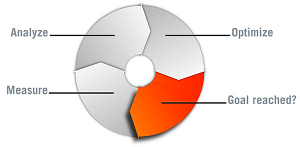

# Optimización del rendimiento {#performance-optimization}

>[!NOTE]
>
>Para obtener instrucciones generales sobre el rendimiento, lea la [Directrices de rendimiento](/help/sites-deploying/performance-guidelines.md) página.
>
>Para obtener más información sobre la solución de problemas y problemas de rendimiento, consulte también la [Árbol de rendimiento](/help/sites-deploying/performance-tree.md).
>
>Además, puede consultar un artículo de la Base de conocimiento sobre [Consejos de ajuste de rendimiento](https://experienceleague.adobe.com/docs/experience-manager-65/deploying/configuring/configuring-performance.html?lang=es).

Un problema clave es el tiempo que tarda el sitio web en responder a las solicitudes de los visitantes. Aunque este valor varía según la solicitud, se puede definir un valor de objetivo promedio. Una vez demostrado que este valor es alcanzable y mantenible, puede utilizarse para monitorizar el rendimiento del sitio web e indicar el desarrollo de posibles problemas.

Los tiempos de respuesta que busca son diferentes en los entornos de creación y publicación, y reflejan las diferentes características de la audiencia de destino:

## Entorno de creación {#author-environment}

Los autores que introducen y actualizan contenido utilizan este entorno. Debe atender a unos pocos usuarios, cada uno de los cuales genera un gran número de solicitudes que requieren un alto rendimiento, al actualizar las páginas de contenido y los elementos individuales de esas páginas.

## Entorno de publicación {#publish-environment}

Este entorno incluye contenido que usted pone a disposición de sus usuarios. En este caso, el número de solicitudes es aún mayor y la velocidad es igualmente vital. Sin embargo, como la naturaleza de las solicitudes es menos dinámica, se pueden aplicar mecanismos adicionales de mejora del rendimiento, como almacenar en caché el contenido o equilibrar la carga.

>[!NOTE]
>
>* Después de configurar para la optimización del rendimiento, siga los procedimientos que se describen en [Día difícil](/help/sites-developing/tough-day.md) para probar el entorno con una carga pesada.
>* Consulte también [Consejos de rendimiento.](https://experienceleague.adobe.com/docs/experience-manager-65/deploying/configuring/configuring-performance.html?lang=es)

## Metodología de optimización del rendimiento {#performance-optimization-methodology}

AEM Una metodología de optimización del rendimiento para proyectos de se puede resumir en cinco reglas sencillas que se pueden seguir para evitar problemas de rendimiento desde el principio:

1. [Planificación para la optimización](#planning-for-optimization)
1. [Simular realidad](#simulate-reality)
1. [Establezca metas sólidas](#establish-solid-goals)
1. [Sigue siendo relevante](#stay-relevant)
1. [Ciclos de iteración de Agile](#agile-iteration-cycles)

Estas reglas se aplican a los proyectos web en general y son relevantes para los administradores de sistemas y gestores de proyectos para garantizar que sus proyectos no se enfrenten a desafíos de rendimiento en el momento del lanzamiento.

### Planificación para la optimización {#planning-for-optimization}


Planifique aproximadamente el 10% del esfuerzo del proyecto para la fase de optimización del rendimiento. Los requisitos reales de optimización del rendimiento dependen del nivel de complejidad de un proyecto y de la experiencia del equipo de desarrollo. Aunque es posible que el proyecto (en última instancia) no requiera el tiempo asignado, se recomienda planificar siempre la optimización del rendimiento en la región sugerida.

Siempre que sea posible, un proyecto debe iniciarse primero a una audiencia limitada para recopilar experiencias en la vida real y realizar más optimizaciones, sin la presión adicional que sigue a un anuncio completo.

Una vez que esté &quot;activo&quot;, la optimización del rendimiento no habrá terminado. Es ahora cuando experimenta la carga &quot;real&quot; en su sistema. Es importante planificar los ajustes adicionales después del lanzamiento.

Dado que la carga del sistema cambia y los perfiles de rendimiento del sistema cambian con el tiempo, se debe programar una &quot;puesta a punto&quot; o una &quot;comprobación de estado&quot; de rendimiento con intervalos de 6 a 12 meses.

### Simular realidad {#simulate-reality}


Si publica un sitio web y luego descubre después del lanzamiento que tiene problemas de rendimiento, es probable que las pruebas de carga y rendimiento no simulen la realidad lo suficientemente de cerca.

Simular la realidad es difícil y cuánto esfuerzo desea invertir para llegar a ser &quot;real&quot; depende de la naturaleza de su proyecto. &quot;Real&quot; significa no solo &quot;código real&quot; y &quot;tráfico real&quot;, sino también &quot;contenido real&quot;, especialmente en relación con el tamaño y la estructura del contenido. Las plantillas pueden comportarse de forma diferente según el tamaño y la estructura del repositorio.

### Establezca metas sólidas {#establish-solid-goals}


No debe subestimarse la importancia de establecer adecuadamente los objetivos de rendimiento. A menudo, después de que las personas se centran en objetivos de rendimiento específicos, es difícil cambiar estos objetivos posteriormente, incluso si se basan en suposiciones.

Establecer objetivos de rendimiento sólidos es realmente una de las áreas más complicadas. A menudo, es mejor recopilar registros y puntos de referencia de la vida real de un sitio web comparable (por ejemplo, el predecesor del nuevo sitio web).

### Sigue siendo relevante {#stay-relevant}


Es importante optimizar un cuello de botella a la vez. Si intenta hacer las cosas en paralelo sin validar el impacto de la optimización, puede perder el control de qué medida de optimización ayudó.

### Ciclos de iteración de Agile {#agile-iteration-cycles}



El ajuste del rendimiento es un proceso iterativo que implica medición, análisis, optimización y validación hasta que se alcanza el objetivo. Para tener en cuenta este aspecto, implemente un proceso de validación ágil en la fase de optimización en lugar de un proceso de prueba más pesado después de cada iteración.

Este enfoque significa que el desarrollador que implementa la optimización debe tener una forma rápida de saber si la optimización ya ha alcanzado el objetivo. Esta información es valiosa, ya que cuando se alcanza el objetivo, la optimización termina.

## Directrices básicas de rendimiento {#basic-performance-guidelines}

En términos generales, mantenga sus solicitudes html sin caché a menos de 100 milisegundos. Más específicamente, lo siguiente puede servir de guía:

* El 70 % de las solicitudes de páginas deben responderse en menos de 100 milisegundos.
* El 25 % de las solicitudes de páginas deben recibir una respuesta en un plazo de 100 milisegundos a 300 milisegundos.
* El 4 % de las solicitudes de páginas deben recibir una respuesta en un plazo de 300 milisegundos a 500 milisegundos.
* El 1 % de las solicitudes de páginas deben recibir una respuesta entre 500 milisegundos y 1000 milisegundos.
* Ninguna página debe responder a más de 1 segundo.

Los números anteriores suponen las siguientes condiciones:

* Se mide en la publicación (sin gastos generales relacionados con el entorno de creación)
* Medido en el servidor (sin sobrecarga de red)
* AEM No almacenado en caché (sin caché de salida de, sin caché de Dispatcher)
* Solo para elementos complejos con muchas dependencias (HTML, JS, PDF, etc.)
* No hay otra carga en el sistema

Hay algunos problemas que a menudo contribuyen a los problemas de rendimiento, incluidos los siguientes:

* Ineficacia del almacenamiento en caché de Dispatcher
* El uso de consultas en plantillas de visualización normales.

El ajuste del nivel de JVM y OS no suele dar lugar a saltos significativos en el rendimiento y, por lo tanto, debe realizarse al final del ciclo de optimización.

La forma en que se estructura un repositorio de contenido también puede afectar al rendimiento. Para obtener el mejor rendimiento, el número de nodos secundarios adjuntos a nodos individuales en un repositorio de contenido no debe superar los 1000 (como regla general).

Sus mejores amigos durante un ejercicio habitual de optimización del rendimiento son:

* El `request.log`
* Sincronización basada en componentes
* Un analizador de Java™.

### Rendimiento al cargar y editar recursos digitales {#performance-when-loading-and-editing-digital-assets}

Debido al gran volumen de datos que implica cargar y editar recursos digitales, el rendimiento puede convertirse en un problema.

Hay dos cosas que afectan al rendimiento:

* CPU: varios núcleos permiten un trabajo más fluido al transcodificar
* Disco duro: los discos RAID paralelos logran lo mismo

Para mejorar el rendimiento, tenga en cuenta lo siguiente:

* ¿Cuántos recursos se van a cargar al día? Una buena estimación puede basarse en:


* El lapso de tiempo en el que se realizan las ediciones (normalmente la duración de la jornada laboral, más para las operaciones internacionales).
* El tamaño promedio de las imágenes cargadas (y el tamaño de las representaciones generadas por imagen) en megabytes.
* Determine la velocidad de datos promedio:


* El 80% de todas las ediciones se realizan en el 20% de las veces, por lo que en las horas de mayor actividad la velocidad de datos es cuatro veces superior a la media. Este rendimiento es su objetivo.

## Monitorización del rendimiento {#performance-monitoring}

El rendimiento (o la falta de él) es una de las primeras cosas de las que se dan cuenta los usuarios, por lo que, al igual que con cualquier aplicación con interfaz de usuario, el rendimiento es fundamental. AEM Para optimizar el rendimiento de la instalación de la, monitorice varios atributos de la instancia y su comportamiento.

Para obtener información acerca de cómo realizar la supervisión del rendimiento, consulte [Monitorización del rendimiento](/help/sites-deploying/monitoring-and-maintaining.md#monitoring-performance).

Los problemas que causan problemas de rendimiento suelen ser difíciles de rastrear, incluso cuando sus efectos son fáciles de ver.

Un punto de partida básico es un buen conocimiento del sistema cuando funciona con normalidad. A menos que sepa cómo &quot;se ve&quot; y &quot;se comporta&quot; su entorno cuando funciona correctamente, es difícil localizar el problema cuando el rendimiento se deteriora. Dedique tiempo a investigar el sistema cuando se esté ejecutando sin problemas y asegúrese de que la recopilación de información de rendimiento sea una tarea continua. Al hacerlo, dispone de una base para realizar comparaciones en caso de que el rendimiento se vea afectado.

AEM El diagrama siguiente ilustra la ruta que puede seguir una solicitud de contenido y, por lo tanto, el número de elementos diferentes que pueden afectar al rendimiento.


El rendimiento también es un equilibrio entre volumen y capacidad:

* **Volumen** - La cantidad de salida procesada y entregada por el sistema.
* **Capacidad** - La capacidad del sistema para entregar el volumen.

El rendimiento se puede ilustrar en varias ubicaciones de la cadena web.


Existen varias áreas funcionales que a menudo son responsables de afectar el rendimiento:

* Almacenamiento en caché
* Código de la aplicación (su proyecto)
* Funcionalidad de búsqueda

### Reglas básicas sobre rendimiento {#basic-rules-regarding-performance}

Al optimizar el rendimiento, deben tenerse en cuenta determinadas reglas:

* Ajuste del rendimiento *debe* ser parte de cada proyecto.
* No optimizar al principio del ciclo de desarrollo.
* El rendimiento es tan bueno como el eslabón más débil.
* Piense siempre en la capacidad frente al volumen.
* Optimizar primero las cosas importantes.
* Nunca optimizar sin *realista* metas.

>[!NOTE]
>
>Tenga en cuenta que el mecanismo que utiliza para medir el rendimiento a menudo afecta exactamente a lo que intenta medir. Intente tener en cuenta estas discrepancias y eliminar el mayor efecto posible; en particular, los complementos del explorador deben desactivarse siempre que sea posible.

## Configurar para el rendimiento {#configuring-for-performance}

AEM Se pueden configurar ciertos aspectos de la (o del repositorio subyacente) para optimizar el rendimiento. A continuación se indican posibilidades y sugerencias. Debe estar seguro de si utiliza la funcionalidad en cuestión antes de realizar cambios, o de cómo hacerlo.

>[!NOTE]
>
>Consulte [Optimización del rendimiento](https://experienceleague.adobe.com/docs/experience-manager-65/deploying/configuring/configuring-performance.html?lang=es).

### Indexación de búsqueda {#search-indexing}

AEM A partir de 6.0, Adobe Experience Manager utiliza una arquitectura de repositorio basada en Oak.

Puede encontrar la información de indexación actualizada aquí:

* [Prácticas recomendadas para consultas e indexación](/help/sites-deploying/best-practices-for-queries-and-indexing.md)
* [Consultas e indexación](/help/sites-deploying/queries-and-indexing.md)

### Procesamiento de flujo de trabajo simultáneo {#concurrent-workflow-processing}

Para mejorar el rendimiento, limite el número de procesos de flujo de trabajo que se ejecutan simultáneamente. De forma predeterminada, el motor de flujo de trabajo procesa tantos flujos de trabajo en paralelo como procesadores disponibles para la VM de Java™. Cuando los pasos del flujo de trabajo requieren grandes cantidades de recursos de procesamiento (RAM o CPU), la ejecución de varios de estos flujos de trabajo en paralelo puede exigir mucho de los recursos de servidor disponibles.

Por ejemplo, cuando se cargan imágenes (o recursos DAM en general), los flujos de trabajo importan automáticamente las imágenes en DAM. Las imágenes suelen ser de alta resolución y pueden consumir fácilmente cientos de MB de montón para procesarlas. El manejo de estas imágenes en paralelo coloca una carga alta en el subsistema de memoria y en el recolector de elementos no utilizados.

El motor de flujo de trabajo utiliza las colas de trabajos de Apache Sling para administrar y programar el procesamiento de elementos de trabajo. Los siguientes servicios de cola de trabajos se han creado de forma predeterminada desde la fábrica del servicio de configuración de colas de trabajos de Apache Sling para procesar trabajos de flujo de trabajo:

* Cola de flujo de trabajo de Granite: la mayoría de los pasos del flujo de trabajo, como los que procesan recursos DAM, utilizan el servicio Cola de flujo de trabajo de Granite.
* Cola de trabajos de proceso externo de Granite Workflow: este servicio se utiliza para pasos especiales de flujo de trabajo externo que normalmente se utilizan para ponerse en contacto con un sistema externo y sondear resultados. Por ejemplo, el paso Proceso de Extracción de Medios de InDesign se implementa como un proceso externo. El motor de flujo de trabajo utiliza la cola externa para procesar el sondeo. (Consulte [com.day.cq.workflow.exec.WorkflowExternalProcess](https://developer.adobe.com/experience-manager/reference-materials/6-5/javadoc/com/day/cq/workflow/exec/WorkflowExternalProcess.html).)

Configure estos servicios para limitar el número máximo de procesos de flujo de trabajo que se ejecutan simultáneamente.

>[!NOTE]
>
>La configuración de estas colas de trabajos afecta a todos los flujos de trabajo a menos que haya creado una cola de trabajos para un modelo de flujo de trabajo específico (consulte [Configurar la cola para un modelo de flujo de trabajo específico](/help/sites-deploying/configuring-performance.md#configure-the-queue-for-a-specific-workflow) abajo).

#### Configuración en el repositorio {#configuration-in-the-repo}

Si configura los servicios [uso de un nodo sling:OsgiConfig](/help/sites-deploying/configuring-osgi.md#adding-a-new-configuration-to-the-repository), debe encontrar el PID de los servicios existentes, por ejemplo: org.apache.sling.event.jobs.QueueConfiguration.370aad73-d01b-4a0b-abe4-20198d85f705. Puede descubrir el PID mediante la consola web.

Configure la propiedad denominada `queue.maxparallel`.

#### Configuración en la consola web {#configuration-in-the-web-console}

Para configurar estos servicios [uso de la consola web](/help/sites-deploying/configuring-osgi.md#osgi-configuration-with-the-web-console), busque los elementos de configuración existentes debajo de la fábrica del servicio de configuración de Apache Sling Job Queue.

Configure la propiedad denominada Maximum Parallel Jobs.

### Configurar la cola para un flujo de trabajo específico {#configure-the-queue-for-a-specific-workflow}

Cree una cola de trabajos para un modelo de flujo de trabajo específico, de modo que pueda configurar la administración de trabajos para ese modelo de flujo de trabajo. De este modo, las configuraciones afectan al procesamiento de un flujo de trabajo específico, mientras que la configuración de la cola de flujo de trabajo de Granite predeterminada controla el procesamiento de otros flujos de trabajo.

Cuando se ejecutan los modelos de flujo de trabajo, crean trabajos de Sling para un tema específico. De forma predeterminada, el tema coincide con los temas configurados para la cola de flujo de trabajo de Granite general o la cola de trabajos del proceso externo de Granite Workflow:

* `com/adobe/granite/workflow/job*`
* `com/adobe/granite/workflow/external/job*`

Los temas de trabajo reales que generan los modelos de flujo de trabajo incluyen un sufijo específico del modelo. Por ejemplo, la variable **Recurso de actualización DAM** el modelo de flujo de trabajo genera trabajos con el siguiente tema:

`com/adobe/granite/workflow/job/etc/workflow/models/dam/update_asset/jcr_content/model`

Por lo tanto, puede crear una cola de trabajos para el tema que coincida con los temas de trabajo del modelo de flujo de trabajo. La configuración de las propiedades relacionadas con el rendimiento de la cola afecta únicamente al modelo de flujo de trabajo que genera los trabajos que coinciden con el tema de la cola.

El siguiente procedimiento crea una cola de trabajos para un flujo de trabajo, utilizando **Recurso de actualización DAM** flujo de trabajo como ejemplo.

1. Ejecute el modelo de flujo de trabajo para el que desea crear la cola de trabajos, de modo que se generen las estadísticas del tema. Por ejemplo, añada una imagen a Assets para ejecutar el **Recurso de actualización DAM** flujo de trabajo.
1. Abra la consola Trabajos de Sling (`https://<host>:<port>/system/console/slingevent`).
1. Descubra los temas relacionados con el flujo de trabajo en la consola. Para el recurso de actualización DAM, se encuentran los siguientes temas:

   * `com/adobe/granite/workflow/external/job/etc/workflow/models/dam/update_asset/jcr_content/model`
   * `com/adobe/granite/workflow/job/etc/workflow/models/dam/update_asset/jcr_content/model`
   * `com/adobe/granite/workflow/job/etc/workflow/models/dam-xmp-writeback/jcr_content/model`

1. Cree una cola de trabajos para cada uno de estos temas. Para crear una cola de trabajos, cree una configuración de fábrica para el servicio de fábrica de la cola de trabajos de Apache Sling.

   Las configuraciones de fábrica son similares a la cola de flujo de trabajo de Granite descrita en [Procesamiento de flujo de trabajo simultáneo](/help/sites-deploying/configuring-performance.md#concurrent-workflow-processing), excepto que la propiedad Topics coincide con el tema de los trabajos del flujo de trabajo.

### AEM Servicio de sincronización de recursos DAM {#cq-dam-asset-synchronization-service}

El `AssetSynchronizationService` se utiliza para sincronizar recursos de repositorios montados (incluidos LiveLink, Documentum®, entre otros). De forma predeterminada, esta sincronización realiza una comprobación regular cada 300 segundos (5 minutos), por lo que si no utiliza repositorios montados, puede deshabilitar este servicio.

La desactivación del servicio se realiza mediante [configuración del servicio OSGi](/help/sites-deploying/configuring-osgi.md) **Servicio de sincronización de recursos CQ DAM** para establecer la variable **Período de sincronización** ( `scheduler.period`) a (como mínimo) un año (definido en segundos).

### Varias instancias de DAM {#multiple-dam-instances}

La implementación de varias instancias de DAM puede ayudar al rendimiento cuando, por ejemplo:

* Tiene una carga alta debido a la carga regular de muchos recursos para el entorno de creación; aquí se puede dedicar una instancia de DAM independiente al autor del servicio.
* Tiene varios equipos en ubicaciones de todo el mundo (por ejemplo, EE. UU., Europa o Asia).

Consideraciones adicionales:

* Separación entre &quot;trabajo en curso&quot; de autor y &quot;final&quot; al publicar
* Separar los usuarios internos de Author de los visitantes/usuarios externos de Publish (por ejemplo, agentes, representantes de prensa, clientes y estudiantes).

## Prácticas recomendadas para el control de calidad {#best-practices-for-quality-assurance}

El rendimiento es fundamental para el entorno de publicación. Por lo tanto, debe planificar y analizar cuidadosamente las pruebas de rendimiento que realice para el entorno de publicación al implementar el proyecto.

Esta sección tiene como objetivo ofrecer una visión general estandarizada de los problemas relacionados con la definición de un concepto de prueba específicamente para pruebas de rendimiento en su *publicar* entorno. Esta información es de interés principalmente para los ingenieros de control de calidad, gestores de proyectos y administradores de sistemas.

AEM A continuación se describe un enfoque estandarizado de las pruebas de rendimiento para una aplicación en la que se ha realizado una prueba de rendimiento para una aplicación en la que se ha aplicado un método de la manera más eficaz. *Publish* entorno. Esta prueba de rendimiento consta de las cinco fases siguientes:

* [Verificación del conocimiento](#verification-of-knowledge)
* [Definición del ámbito](#scope-definition)
* [Metodologías de prueba](#test-methodologies)
* [Definición de metas de rendimiento](#defining-the-performance-goals)
* [Optimización](#optimization)

El control es un proceso adicional y completo, necesario pero sin limitarse a las pruebas.

### Verificación del conocimiento {#verification-of-knowledge}

Un primer paso es documentar la información básica que debe conocer antes de iniciar la prueba:

* Arquitectura del entorno de prueba
* Mapa de la aplicación que detalla los elementos internos que deben probarse (tanto de forma aislada como combinada).

#### Arquitectura de prueba {#test-architecture}

Documente la arquitectura del entorno de prueba que se utiliza para las pruebas de rendimiento.

Necesita una reproducción del entorno de publicación de producción planificado, junto con Dispatcher y el equilibrador de carga.

#### Mapa de aplicación {#application-map}

Obtenga una descripción general clara desde la que puede crear un mapa de toda la aplicación (es posible que ya tenga este mapa de pruebas en el entorno de creación).

Una representación de diagrama de los elementos internos de la aplicación puede ofrecer una visión general de los requisitos de prueba; con codificación de color también puede actuar como base para la creación de informes.

### Definición del ámbito {#scope-definition}

Una aplicación suele tener una selección de casos de uso. Algunos casos de uso son importantes, otros no tanto.

Para enfocar el ámbito de las pruebas de rendimiento en la publicación, Adobe recomienda definir lo siguiente:

* Casos de uso empresariales más importantes
* Casos de uso técnicos más críticos

El número de casos de uso depende de usted, pero debe limitarse a un número fácilmente manejable (por ejemplo, entre 5 y 10).

Una vez seleccionados los casos de uso clave, se pueden definir para cada caso los indicadores clave de rendimiento (KPI) y las herramientas utilizadas para medirlos. Algunos ejemplos de KPI comunes son:

* Tiempo de respuesta de extremo a extremo
* Tiempo de respuesta del servlet
* Tiempo de respuesta para un solo componente
* Tiempo de respuesta para los servicios
* Número de hilos inactivos en el grupo de hilos
* Número de conexiones gratuitas
* Recursos del sistema, como acceso a CPU y E/S

### Metodologías de prueba {#test-methodologies}

Este concepto se utiliza en cuatro escenarios para definir y probar los objetivos de rendimiento:

* Pruebas de un solo componente
* Pruebas de componentes combinadas
* *Puesta en marcha* escenario
* Escenarios de error

Basado en los siguientes principios.

#### Puntos de interrupción de componente {#component-breakpoints}

* Cada componente tiene un punto de interrupción específico cuando se relaciona con el rendimiento. Es decir, un componente puede mostrar ese buen rendimiento hasta que se alcanza un punto específico, después del cual el rendimiento se degrada rápidamente.
* Para obtener una descripción general completa de la aplicación, primero debe comprobar los componentes para determinar cuándo se alcanza el punto de interrupción de cada uno.
* Para encontrar el punto de interrupción en el que puede realizar una prueba de carga en la que, a lo largo de un período de tiempo, aumenta el número de usuarios para crear una carga creciente. Al monitorizar esta carga y la respuesta de los componentes, se encuentra con un comportamiento de rendimiento específico cuando se alcanza el punto de interrupción del componente. El punto puede calificarse por el número de transacciones simultáneas por segundo, junto con el número de usuarios simultáneos (si el componente es sensible a este KPI).
* Esta información puede servir de referencia para realizar mejoras, indicar la eficacia de las medidas que se están utilizando y ayudar a definir escenarios de prueba.

#### Transacciones {#transactions}

* El término transacción se utiliza para representar la solicitud de una página web completa, incluida la propia página y todas las llamadas posteriores. AJAX Es decir, la solicitud de página, cualquier llamada de, imágenes y otros objetos **Solicitar exploración en profundidad**.
* Para analizar completamente cada solicitud, puede representar cada elemento de la pila de llamadas y, a continuación, calcular el tiempo de procesamiento promedio de cada uno.

### Definición de los objetivos de rendimiento {#defining-the-performance-goals}

Una vez definidos el ámbito y los KPI relacionados, se establecen los objetivos de rendimiento específicos. Este proceso implica diseñar escenarios de prueba, junto con valores objetivo.

Rendimiento de las pruebas tanto en condiciones medias como de pico. Además, es necesario realizar pruebas de escenario de lanzamiento para garantizar que puede satisfacer el mayor interés en su sitio web cuando este esté disponible por primera vez.

Cualquier experiencia o estadística que haya recopilado de un sitio web existente también puede ser útil para determinar objetivos futuros. Por ejemplo, tráfico superior del sitio web activo.

#### Pruebas de un solo componente {#single-component-tests}

Los componentes críticos deben ser probados, tanto en condiciones medias como de pico.

En ambos casos, puede definir el número esperado de transacciones por segundo cuando un número predefinido de usuarios está utilizando el sistema.

| Componente | Tipo de prueba | No. de usuarios | Tx/s (esperado) | Tx/s (probado) | Descripción |
|---|---|---|---|---|---|
| Página principal de un solo usuario | Promedio | 1 | 1 |  |  |
|   | Pico | 1 | 3 |  |  |
| Página principal 100 usuarios | Promedio | 100 | 3 |  |  |
|   | Pico | 100 | 3 |  |

#### Pruebas de componentes combinadas {#combined-component-tests}

La prueba de los componentes en combinación ofrece una reflexión más detallada del comportamiento de las aplicaciones. Una vez más, deben comprobarse las condiciones medias y máximas.

| Escenario | Componente | No. de usuarios | Tx/s (esperado) | Tx/s (probado) | Descripción |
|---|---|---|---|---|---|
| Media mixta | Página principal | 10 | 1 |  |  |
|   | Búsqueda | 10 | 1 |  |  |
|   | Noticias | 10 | 2 |  |  |
|   | Eventos | 10 | 1 |  |  |
|   | Activaciones | 10 | 3 |  | Simulación del comportamiento del autor. |
| Pico mixto | Página principal | 100 | 5 |  |  |
|   | Búsqueda | 50 | 5 |  |  |
|   | Noticias | 100 | 10 |  |  |
|   | Eventos | 100 | 10 |  |  |
|   | Activaciones | 20 | 20 |  | Simulación del comportamiento del autor. |

#### Pruebas de puesta en marcha {#going-live-tests}

Durante los primeros días después de que su sitio web esté disponible, puede esperar un mayor nivel de interés. Este escenario es incluso mayor que los valores máximos que está probando. El Adobe recomienda probar los escenarios de lanzamiento para garantizar que el sistema pueda hacer frente a esta situación.

| Escenario | Tipo de prueba | No. de usuarios | Tx/s (esperado) | Tx/s (probado) | Descripción |
|---|---|---|---|---|---|
| Pico de puesta en marcha | Página principal | 200 | 20 |  |  |
|   | Búsqueda | 100 | 10 |  |  |
|   | Noticias | 200 | 20 |  |  |
|   | Eventos | 200 | 20 |  |  |
|   | Activaciones | 20 | 20 |  | Simulación del comportamiento del autor. |

#### Pruebas de escenarios de error {#error-scenario-tests}

Pruebe los escenarios de error para asegurarse de que el sistema reacciona correctamente y de forma adecuada. No solo en la forma en que se gestiona el error en sí, sino también en el impacto que puede tener en el rendimiento. Por ejemplo:

* Qué sucede cuando el usuario intenta introducir un término de búsqueda no válido en el cuadro de búsqueda
* Qué sucede cuando el término de búsqueda es tan general que devuelve un número excesivo de resultados

Al diseñar estas pruebas, debe tenerse en cuenta que no todos los escenarios se producen de forma regular. Sin embargo, su impacto en todo el sistema es importante.

| Escenario de error | Tipo de error | No. de usuarios | Tx/s (esperado) | Tx/s (probado) | Descripción |
|---|---|---|---|---|---|
| Sobrecarga del componente de búsqueda | Buscar en comodín global (asterisco) | 10 | 1 |  | Solo se busca &amp;ast;&amp;ast;&amp;ast;. |
|   | Detener palabra | 20 | 2 |  | Buscando una palabra de detención. |
|   | Cadena vacía | 10 | 1 |  | Buscando una cadena vacía. |
|   | Caracteres especiales | 10 | 1 |  | Buscando caracteres especiales. |

#### Pruebas de resistencia {#endurance-tests}

Algunos problemas solo se encuentran después de que el sistema se haya estado ejecutando durante un período de tiempo continuo, ya sean horas o días. Se utiliza una prueba de resistencia para probar una carga media constante durante un período de tiempo requerido. A continuación, se puede analizar cualquier degradación del rendimiento.

| Escenario | Tipo de prueba | No. de usuarios | Tx/s (esperado) | Tx/s (probado) | Descripción |
|---|---|---|---|---|---|
| Prueba de resistencia (72 horas) | Página principal | 10 | 1 |  |  |
|   | Búsqueda | 10 | 1 |  |  |
|   | Noticias | 20 | 2 |  |  |
|   | Eventos | 10 | 1 |  |  |
|   | Activaciones | 1 | 3 |  | Simulación del comportamiento del autor. |

### Optimización {#optimization}

En las últimas etapas de la implementación, optimice la aplicación para cumplir y maximizar los objetivos de rendimiento.

Todas las optimizaciones realizadas deben probarse para garantizar que tengan lo siguiente:

* No se ve afectada la funcionalidad
* Se ha verificado con las pruebas de carga antes de lanzarse

Hay una selección de herramientas disponibles para ayudarle con la generación de carga, la monitorización del rendimiento y el análisis de resultados. Algunas de estas herramientas son las siguientes:

* [JMeter](https://jmeter.apache.org/)
* [Cargar ejecutor](https://www.microfocus.com/en-us/portfolio/performance-engineering/overview)
* [InfraRED](https://www.infraredsoftware.com/)
* [Perfil interactivo de Java™](https://jiprof.sourceforge.net/)

Tras la optimización, vuelva a realizar pruebas para confirmar el impacto.

### Informes {#reporting}

Los informes en curso mantienen a todos informados del estado. Como se mencionó anteriormente con la codificación de colores, el mapa de arquitectura se puede utilizar para este estado.

Una vez completadas todas las pruebas, informe de lo siguiente:

* Se encontraron errores críticos
* Problemas no críticos que aún necesitan más investigación
* Suposiciones realizadas durante la prueba
* Cualquier recomendación que surja de la prueba

## Optimizar el rendimiento al utilizar Dispatcher {#optimizing-performance-when-using-the-dispatcher}

El [Dispatcher](https://experienceleague.adobe.com/docs/experience-manager-dispatcher/using/dispatcher.html?lang=es) es la herramienta de almacenamiento en caché o de equilibrio de carga de Adobe. Al utilizar Dispatcher, considere la posibilidad de optimizar el sitio web para el rendimiento de la caché.

>[!NOTE]
>
>Las versiones de Dispatcher son independientes de AEM, pero la documentación de Dispatcher está incrustada en la de AEM. Utilice siempre la documentación de Dispatcher incrustada en la documentación para la versión más reciente de AEM.
>
>Es posible que se le haya redirigido a esta página si ha seguido un vínculo a la documentación de Dispatcher insertado en la documentación de una versión anterior de AEM.

Dispatcher ofrece varios mecanismos integrados que puede utilizar para optimizar el rendimiento si el sitio web los aprovecha. Esta sección le explica cómo diseñar su sitio web para maximizar los beneficios del almacenamiento en caché.

>[!NOTE]
>
>Puede ayudarle a recordar que Dispatcher almacena la caché en un servidor web estándar. Conocer esta información significa que puede almacenar en caché todo lo que se puede almacenar como página y solicitar mediante una dirección URL. Además, no puede almacenar otros elementos, como cookies, datos de sesión y datos de formularios.
>
>En general, varias estrategias de almacenamiento en caché implican la selección de buenas direcciones URL y no depender de estos datos adicionales.
>
>Con la versión de Dispatcher 4.1.11 también puede almacenar en caché los encabezados de respuesta, consulte [Almacenamiento en caché de encabezados de respuesta HTTP](https://experienceleague.adobe.com/docs/experience-manager-dispatcher/using/configuring/dispatcher-configuration.html#configuring-the-dispatcher-cache-cache).
>

### Calcular la proporción de caché de Dispatcher {#calculating-the-dispatcher-cache-ratio}

La fórmula de proporción de caché calcula el porcentaje de solicitudes administradas por la caché sobre el número total de solicitudes que llegan al sistema. Para calcular la proporción de caché, necesita lo siguiente:

* Número total de solicitudes. Esta información está disponible en Apache `access.log`. Para obtener más información, consulte la [documentación oficial de Apache](https://httpd.apache.org/docs/2.4/logs.html#accesslog).

* Número de solicitudes que ha servido la instancia de publicación. Esta información está disponible en el `request.log` de la instancia. Para obtener más información, consulte [Interpretación de request.log](/help/sites-deploying/monitoring-and-maintaining.md#interpreting-the-request-log) y [Búsqueda de los archivos de registro](/help/sites-deploying/monitoring-and-maintaining.md#finding-the-log-files).

La fórmula para calcular la proporción de caché es la siguiente:

* (El número total de solicitudes **minus** el número de solicitudes en (Publish) **dividido** por el número total de solicitudes.

Por ejemplo, si el número total de solicitudes es 129491 y el número de solicitudes atendidas por la instancia de publicación es 58959, la proporción de caché es: **(129491 - 58959)/129491= 54,5 %**.

Si no tiene un emparejamiento de publicador/Dispatcher individual, agregue solicitudes de todos los distribuidores y editores para obtener una medición precisa. Consulte también [Implementaciones recomendadas](/help/sites-deploying/recommended-deploys.md).

>[!NOTE]
>
>Para obtener el mejor rendimiento, Adobe recomienda una proporción de caché del 90 % al 95 %.

#### Utilizar una codificación de página coherente {#using-consistent-page-encoding}

Con la versión de Dispatcher 4.1.11, puede almacenar en caché los encabezados de respuesta. Si no almacena en caché los encabezados de respuesta en Dispatcher, pueden producirse problemas si almacena información de codificación de páginas en el encabezado. En este caso, cuando Dispatcher sirve una página desde la caché, se utiliza la codificación predeterminada del servidor web para esa página. Existen dos formas de evitar este problema:

* Si solo utiliza una codificación, asegúrese de que la utilizada en el servidor web sea la misma que la predeterminada del sitio web de AEM.
* Para establecer la codificación, utilice un `<META>` etiqueta en el HTML `head` , como en el ejemplo siguiente:

```xml
        <META http-equiv="Content-Type" content="text/html; charset=EUC-JP">
```

#### Evitar parámetros de URL {#avoid-url-parameters}

Si es posible, evite los parámetros de URL para las páginas que desee almacenar en caché. Por ejemplo, si tiene una galería de imágenes, la siguiente URL nunca se almacenará en caché (a menos que Dispatcher esté [configurado así](https://experienceleague.adobe.com/docs/experience-manager-dispatcher/using/configuring/dispatcher-configuration.html#configuring-the-dispatcher-cache-cache)):

```xml
www.myCompany.com/pictures/gallery.html?event=christmas&amp;page=1
```

Sin embargo, puede colocar estos parámetros en la dirección URL de la página de la siguiente manera:

```xml
www.myCompany.com/pictures/gallery.christmas.1.html
```

>[!NOTE]
>
>Esta URL llama a la misma página y a la misma plantilla que `gallery.html`. En la definición de la plantilla, puede especificar qué secuencia de comandos procesa la página o puede utilizar la misma secuencia de comandos para todas las páginas.

#### Personalizar por dirección URL {#customize-by-url}

Si permite a los usuarios cambiar el tamaño de la fuente (o cualquier otra personalización del diseño), asegúrese de que las diferentes personalizaciones se reflejen en la dirección URL.

Por ejemplo, las cookies no se almacenan en caché, por lo que si almacena el tamaño de la fuente en una cookie (o mecanismo similar), no se conservará para la página en caché. Como resultado, Dispatcher devuelve aleatoriamente documentos con cualquier tamaño de la fuente.

Incluir el tamaño de la fuente en la URL como selector evita este problema:

```xml
www.myCompany.com/news/main.large.html
```

>[!NOTE]
>
>Para la mayoría de los aspectos del diseño, también es posible utilizar hojas de estilo, secuencias de comandos del lado del cliente o ambas. Estos instrumentos funcionan bien con el almacenamiento en caché.
>
>Esta estrategia también es útil para una versión impresa, donde puede utilizar una dirección URL como:
>
>`www.myCompany.com/news/main.print.html`
>
>Utilizando el script globbing de la definición de la plantilla, puede especificar un script separado que procese las páginas imprimidas.

#### Invalidar archivos de imagen utilizados como títulos {#invalidating-image-files-used-as-titles}

Si procesa títulos de páginas u otros textos como imágenes, se recomienda almacenar los archivos para que se eliminen tras actualizar el contenido de la página:

1. Coloque el archivo de imagen en la misma carpeta que la página.
1. Utilice el siguiente formato de nomenclatura para el archivo de imagen:

   `<page file name>.<image file name>`

Por ejemplo, puede almacenar el título de la página `myPage.html` en el `file myPage.title.gif`. Este archivo se eliminará automáticamente si se actualiza la página, por lo que cualquier cambio en el título de la página se reflejará automáticamente en la caché.

>[!NOTE]
>
>El archivo de imagen no existe necesariamente físicamente en la instancia de AEM. Puede utilizar un script que cree dinámicamente el archivo de imagen. A continuación, Dispatcher almacenará el archivo en el servidor web.

#### Invalidar archivos de imagen utilizados para la navegación {#invalidating-image-files-used-for-navigation}

Si utiliza imágenes para las entradas de navegación, el método es básicamente el mismo que con los títulos, pero un poco más complejo. Almacene todas las imágenes de navegación con las páginas de destino. Si utiliza dos imágenes para la normal y la activa, puede utilizar los siguientes scripts:

* Scripts que muestra la página normal.
* Scripts que procesa las solicitudes &quot;.normal&quot; y devuelve la imagen normal.
* Scripts que procesa las solicitudes &quot;.active&quot; y devuelve la imagen activa.

Es importante crear estas imágenes con el mismo nombre que la página, para garantizar que una actualización de contenido elimine estas imágenes y la página.

En las páginas que no se modifiquen, las imágenes permanecerán en la caché, aunque las páginas en sí se invalidarán automáticamente.

#### Personalización {#personalization}

Se recomienda limitar la personalización a donde sea necesario. Para explicar por qué:

* Si utiliza una página de inicio personalizable libremente, esa página deberá estar compuesta cada vez que un usuario la solicite.
* Si, por el contrario, ofrece una opción de diez páginas de inicio diferentes, puede almacenar en caché cada una de ellas, mejorando el rendimiento.

>[!TIP]
>Para obtener más información sobre la configuración de la caché de Dispatcher, consulte la [AEM Tutorial de caché de Dispatcher](https://experienceleague.adobe.com/docs/experience-manager-learn/dispatcher-tutorial/overview.html) y su sección sobre [Almacenar contenido protegido en caché.](https://experienceleague.adobe.com/docs/experience-manager-learn/dispatcher-tutorial/chapter-1.html#dispatcher-tips-and-tricks)

Si personaliza cada página colocando el nombre del usuario en la barra de título (por ejemplo), tendrá un impacto en el rendimiento.

>[!TIP]
>Para almacenar en caché el contenido protegido, consulte [Almacenar contenido seguro en caché](https://experienceleague.adobe.com/docs/experience-manager-dispatcher/using/configuring/permissions-cache.html?lang=es) en la guía de Dispatcher.

Con respecto a la mezcla de contenido restringido y público en una página, considere una estrategia que utilice inclusiones del lado del servidor en Dispatcher o inclusiones del lado del cliente mediante Ajax en el explorador.

>[!TIP]
>
>Para gestionar contenido público mixto y contenido restringido, consulte [Configure Sling Dynamic Include.](https://experienceleague.adobe.com/docs/experience-manager-learn/foundation/development/set-up-sling-dynamic-include.html)

#### Conexiones fijas {#sticky-connections}

[Las conexiones fijas](https://experienceleague.adobe.com/docs/experience-manager-dispatcher/using/dispatcher.html#the-benefits-of-load-balancing) garantizan que todos los documentos de un usuario se compongan en el mismo servidor. Si un usuario abandona esta carpeta y más tarde vuelve a ella, la conexión se mantiene. Para guardar todos los documentos que requieran conexiones fijas para el sitio web, defina una carpeta. Intente no meter otros documentos en ella. Este escenario afecta al equilibrio de carga si utiliza páginas personalizadas y datos de sesión.

#### Tipos MIME {#mime-types}

Existen dos maneras en las que un explorador puede determinar el tipo de archivo:

1. Por su extensión (por ejemplo, `.html`, `.gif`, y `.jpg`).
1. Por el tipo MIME que el servidor envía con el archivo.

Para la mayoría de los archivos, el tipo MIME está implícito en la extensión del archivo. Es decir,

1. Por su extensión (por ejemplo, `.html`, `.gif`, y `.jpg`).
1. Por el tipo MIME que el servidor envía con el archivo.

Si el nombre del archivo no tiene extensión, se mostrará como texto sin formato.

Con la versión de Dispatcher 4.1.11, puede almacenar en caché los encabezados de respuesta. Si no almacena en caché los encabezados de respuesta en Dispatcher, el tipo MIME forma parte del encabezado HTTP. AEM De este modo, si la aplicación de la aplicación de la devuelve archivos que no tienen un final de archivo reconocido y dependen del tipo MIME, es posible que estos archivos se muestren incorrectamente.

Para asegurarse de que los archivos se almacenan en caché correctamente, siga estas directrices:

* Asegúrese de que los archivos siempre tengan la extensión adecuada.
* Evite los scripts genéricos del servidor de archivos, que tienen direcciones URL como `download.jsp?file=2214`. Para utilizar direcciones URL que contengan la especificación del archivo, vuelva a escribir el script. Para el ejemplo anterior, esta reescritura es `download.2214.pdf`.

## Rendimiento de backup {#backup-performance}

AEM En esta sección se presenta una serie de análisis de rendimiento utilizados para evaluar el rendimiento de los backups de los datos y los efectos de la actividad de backup en el rendimiento de las aplicaciones. AEM Las copias de seguridad de la copia de seguridad presentan una carga significativa en el sistema mientras se ejecuta, y el Adobe mide este impacto, así como los efectos de la configuración de demora de la copia de seguridad que intenta modular estos efectos. El objetivo es ofrecer algunos datos de referencia sobre el rendimiento esperado de las copias de seguridad en configuraciones realistas y cantidades de datos de producción, y proporcionar orientación sobre cómo estimar los tiempos de copia de seguridad para los sistemas planificados.

### Entorno de referencia {#reference-environment}

#### Sistema físico {#physical-system}

Los resultados comunicados en este documento se obtuvieron de los análisis de rendimiento ejecutados en un entorno de referencia con la siguiente configuración. Esta configuración es similar a un entorno de producción típico en un centro de datos:

* HP ProLiant DL380 G6, 8 CPU x 2,533 GHz
* Unidades SCSI conectadas en serie de 300 GB a 10.000 rpm
* Controladora RAID de hardware; ocho unidades en una cabina RAID0+5
* CPU de imagen VMware x 2 Intel Xeon® E5540 a 2,53 GHz
* Red Hat® Linux® 2.6.18-194.el5; Java™ 1.6.0_29
* Instancia de autor única

El subsistema de disco de este servidor es rápido, representativo de una configuración RAID de alto rendimiento que podría utilizarse en un servidor de producción. El rendimiento de las copias de seguridad puede ser sensible al rendimiento del disco y los resultados de este entorno reflejan el rendimiento de una configuración RAID rápida. La imagen VMWare está configurada para tener un único volumen de disco grande que reside físicamente en el almacenamiento de disco local, en la matriz RAID.

AEM AEM La configuración de la coloca el repositorio y el almacén de datos en el mismo volumen lógico, junto con el sistema operativo y el software de la aplicación de la. El directorio de destino para las copias de seguridad también reside en este sistema de archivos lógico.

#### Volúmenes de datos {#data-volumes}

La siguiente tabla ilustra el tamaño de los volúmenes de datos que se utilizan en los análisis de rendimiento de copia de seguridad. El contenido de línea de base inicial se instala primero y, a continuación, se agregan cantidades de datos conocidos adicionales para aumentar el tamaño del contenido del que se realiza una copia de seguridad. Las copias de seguridad se crean en incrementos específicos para representar un gran aumento del contenido y de lo que se puede producir en un día. La distribución del contenido (páginas, imágenes, etiquetas) se basa aproximadamente en la composición realista de los recursos de producción. Las páginas, las imágenes y las etiquetas están limitadas a un máximo de 800 páginas secundarias. Cada página incluye componentes de título, Flash, texto/imagen, vídeo, presentación de diapositivas, formulario, tabla, nube y carrusel. Las imágenes se cargan desde un grupo de 400 archivos únicos con un tamaño de 37 KB a 594 KB.

| Contenido | Nodos | Páginas | Imágenes | Etiquetas |
|---|---|---|---|---|
| Instalación base | 69 610 | 562 | 256 | 237 |
| Contenido pequeño para copia de seguridad incremental |  | +100 | +2 | +2 |
| Contenido grande para copia de seguridad completa |  | +10 000 | +100 | +100 |

La referencia de copia de seguridad se repite con los conjuntos de contenido adicionales añadidos en cada repetición.

#### Escenarios de referencia {#benchmark-scenarios}

Los análisis de rendimiento de copia de seguridad cubren dos situaciones principales: copias de seguridad cuando el sistema está bajo una carga de aplicación significativa y copias de seguridad cuando el sistema está inactivo. AEM Aunque la recomendación general es que las copias de seguridad se realicen cuando estén lo más inactivas posible, hay situaciones en las que es necesario que la copia de seguridad se ejecute cuando el sistema está bajo carga.

* **Estado inactivo** AEM - Las copias de seguridad se realizan sin ninguna otra actividad en la.
* **En carga** - Las copias de seguridad se realizan mientras el sistema está por debajo del 80% de carga de los procesos en línea. El retraso de la copia de seguridad varió para ver el impacto en la carga.

AEM Los tiempos de copia de seguridad y el tamaño de la copia de seguridad resultante se obtienen de los registros del servidor de la. AEM Normalmente, se recomienda que las copias de seguridad se programen para horas de inactividad cuando el tiempo de inactividad es de duración inactiva, como en medio de la noche. Este escenario es representativo del enfoque recomendado.

La carga consiste en páginas creadas, páginas eliminadas, recorridos y consultas. La mayor parte de la carga proviene de los recorridos y las consultas de la página. Añadir y eliminar demasiadas páginas aumenta continuamente el tamaño del espacio de trabajo e impide que se completen las copias de seguridad. La distribución de la carga que utiliza el script es un 75 % de recorridos de página, un 24 % de consultas y un 1 % de creaciones de página (un solo nivel sin subpáginas anidadas). El promedio máximo de transacciones por segundo en un sistema inactivo se logra con cuatro subprocesos simultáneos, que se utilizan al probar copias de seguridad con carga.

El impacto de la carga en el rendimiento del backup puede estimarse por la diferencia entre el rendimiento con y sin esta carga de aplicación. El impacto de la copia de seguridad en el rendimiento de la aplicación se encuentra comparando el rendimiento del escenario en transacciones por hora con y sin una copia de seguridad simultánea en curso, y con copias de seguridad que funcionan con diferentes configuraciones de &quot;retraso de copia de seguridad&quot;.

* **Configuración de demora** - En varios de los casos, la configuración de retraso de la copia de seguridad también varió, utilizando valores de 10 milisegundos (predeterminado), 1 milisegundos y 0 milisegundos, para explorar cómo esta configuración afectó el rendimiento de las copias de seguridad.
* **Tipo de copia** - Todas las copias de seguridad eran copias de seguridad externas del repositorio realizadas en un directorio de copia de seguridad sin crear un zip, excepto en un caso para la comparación donde el comando tar se utilizó directamente. Dado que las copias de seguridad incrementales no se pueden crear en un archivo zip, o cuando la copia de seguridad completa anterior es un archivo zip, el método de directorio de copia de seguridad es el más utilizado en situaciones de producción.

### Resumen de resultados {#summary-of-results}

#### Tiempo y rendimiento de backup {#backup-time-and-throughput}

El principal resultado de estos análisis de rendimiento es mostrar cómo varían los tiempos de backup en función del tipo de backup y la cantidad total de datos. El siguiente gráfico muestra el tiempo de copia de seguridad obtenido utilizando la configuración de copia de seguridad predeterminada, como una función del número total de páginas.


Los tiempos de copia de seguridad en una instancia inactiva son bastante coherentes, con un promedio de 0,608 MB por segundo, independientemente de las copias de seguridad completas o incrementales (consulte el gráfico a continuación). El tiempo de copia de seguridad es simplemente una función de la cantidad de datos de los que se está realizando una copia de seguridad. El tiempo para completar una copia de seguridad completa aumenta claramente con la cantidad total de páginas. El tiempo para completar una copia de seguridad incremental también aumenta con la cantidad total de páginas, pero a una tasa mucho menor. El tiempo necesario para completar el backup incremental es mucho menor debido a la cantidad relativamente pequeña de datos de los que se realiza el backup.

El tamaño de la copia de seguridad producida es el principal factor determinante del tiempo necesario para completar una copia de seguridad. El siguiente gráfico muestra el tiempo empleado como función del tamaño final de la copia de seguridad.


Este gráfico ilustra que los backups incrementales y completos siguen un patrón de tamaño y tiempo sencillo que el Adobe puede medir como rendimiento. Los tiempos de copia de seguridad en una instancia inactiva son bastante coherentes, con un promedio de 0,61 MB por segundo, independientemente de los backups completos o incrementales en el entorno de referencia.

#### Retraso de copia {#backup-delay}

El parámetro de retraso de copia de seguridad se proporciona para limitar el grado en que las copias de seguridad pueden interferir con las cargas de trabajo de producción. El parámetro especifica un tiempo de espera en milisegundos, que se intercala en la operación de copia de seguridad archivo por archivo. El efecto global depende en parte del tamaño de los archivos afectados. La medición del rendimiento de la copia de seguridad en MB/s ofrece una forma razonable de comparar los efectos de la demora en la copia de seguridad.

* La ejecución simultánea de una copia de seguridad con la carga normal de la aplicación tiene un impacto negativo en el rendimiento de la carga normal.
* El impacto puede ser leve (tan solo un 5 %) o significativo, lo que provoca una caída de hasta el 75 % en el rendimiento. Es probable que dependa más de la aplicación.
* El backup no es una carga pesada en la CPU, por lo que las cargas de trabajo de producción intensivas en CPU se verían menos afectadas por el backup que las de E/S intensivas.


Para comparar, el rendimiento obtenido mediante una copia de seguridad del sistema de archivos (&quot;tar&quot;) para realizar una copia de seguridad de los mismos archivos del repositorio. El rendimiento del tar es comparable, pero ligeramente superior al de la copia de seguridad con retraso establecido en cero. La configuración de incluso un pequeño retraso reduce en gran medida el rendimiento del backup y el retraso predeterminado de 10 milisegundos reduce en gran medida el rendimiento. En situaciones en las que se pueden programar copias de seguridad cuando el uso general de la aplicación es bajo o la aplicación puede estar inactiva, reduzca el retraso por debajo del valor predeterminado para permitir que la copia de seguridad se realice más rápidamente.

El impacto real del rendimiento de la aplicación de un backup continuo depende de la aplicación y de los detalles de la infraestructura. La elección del valor de retardo debe hacerse mediante un análisis empírico de la aplicación, pero debe elegirse lo más pequeño posible, de modo que las copias de seguridad puedan completarse lo más rápido posible. Debido a que existe una correlación débil entre el valor de retardo elegido y el impacto en el rendimiento de la aplicación, la elección del retardo debería favorecer tiempos de backup generales más cortos para minimizar el impacto general de los backups. Una copia de seguridad que tarda ocho horas en completarse, pero que afecta al rendimiento en un -20 % probablemente tenga un impacto general mayor que una que tarda dos horas en completarse, pero afecta al rendimiento en un -30 %.

### Referencias {#references}

* [Administración: copia de seguridad y restauración](/help/sites-administering/backup-and-restore.md)
* [Administración: capacidad y volumen](/help/managing/best-practices-further-reference.md#capacity-and-volume)
