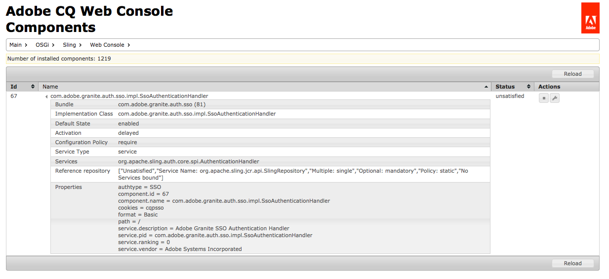

# Consola web{#web-console}

AEM La consola web en la que está basado el es la siguiente [Consola de administración web Apache Felix](https://felix.apache.org/documentation/subprojects/apache-felix-web-console.html). Apache Felix es un esfuerzo de la comunidad para implementar la plataforma de servicio OSGi R4, que incluye el marco OSGi y los servicios estándar.

>[!NOTE]
>
>En la consola web, cualquier descripción que mencione la configuración predeterminada está relacionada con los valores predeterminados de Sling.
>
>AEM tiene sus propios valores predeterminados y, por lo tanto, los valores predeterminados establecidos pueden diferir de los documentados en la consola.

La consola web ofrece una selección de pestañas para mantener los paquetes OSGi, que incluyen:

* [Configuración](#configuration)AEM : se utiliza para configurar los paquetes OSGi y, por lo tanto, es el mecanismo subyacente para configurar los parámetros del sistema de
* [Paquetes](#bundles): se utiliza para instalar paquetes
* [Componentes](#components)AEM : se utiliza para controlar el estado de los componentes necesarios para la

Los cambios realizados se aplican inmediatamente al sistema en ejecución. No es necesario reiniciar.

Se puede acceder a la consola desde `../system/console`; por ejemplo:

`http://localhost:4502/system/console/components`

## Configuración {#configuration}

El **Configuración** AEM se utiliza para configurar los paquetes OSGi y, por lo tanto, es el mecanismo subyacente para configurar los parámetros del sistema de la.

>[!NOTE]
>
>Consulte [Configuración de OSGi con la consola web](/help/sites-deploying/configuring-osgi.md#osgi-configuration-with-the-web-console) para obtener más información.

El **Configuración** se puede acceder a la pestaña mediante:

* El menú desplegable:

   **los paquetes >**

* La dirección URL; por ejemplo:

   `http://localhost:4502/system/console/configMgr`

Se mostrará una lista de configuraciones:

Hay dos tipos de configuraciones disponibles en las listas desplegables de esta pantalla:

* **Configuraciones**

   Permite actualizar las configuraciones existentes. Tienen una identidad persistente (PID) y pueden ser las siguientes:

   * AEM estándar e integral para la; estos son obligatorios; si se eliminan, los valores vuelven a la configuración predeterminada.
   * instancias creadas a partir de Configuraciones de fábrica; estas instancias las crea el usuario, la eliminación elimina la instancia.

* **Configuraciones de fábrica**

   Permite crear una instancia del objeto de funcionalidad requerido.

   Se le asignará una identidad persistente y, a continuación, se enumerará en la lista desplegable Configuraciones.

Al seleccionar cualquier entrada de las listas, se muestran los parámetros relacionados con esa configuración:

A continuación, puede actualizar los parámetros según sea necesario y:

* **Guardar**

   Guarde los cambios realizados.

   Para una configuración de fábrica, se creará una nueva instancia con una identidad persistente. La nueva instancia se enumerará en Configuraciones.

* **Restablecer**

   Restablezca los parámetros mostrados en pantalla a los guardados en último lugar.

* **Eliminar**

   Eliminar la configuración actual. Si son estándar, los parámetros se devuelven a la configuración predeterminada. Si se crea a partir de una configuración de fábrica, se elimina la instancia específica.

* **Desenlazar**

   Desenlace la configuración actual del paquete.

* **Cancelar**

   Cancelar los cambios actuales.

## Paquetes {#bundles}

El **Paquetes** AEM es el mecanismo para instalar los paquetes OSGi necesarios para la instalación de los paquetes OSGi que se requieren para la instalación de la. Se puede acceder a la pestaña mediante cualquiera de los siguientes métodos:

* El menú desplegable:

   **los paquetes >**

* La dirección URL; por ejemplo:

   `http://localhost:4502/system/console/bundles`

Se mostrará una lista de paquetes:

Con esta pestaña puede:

* **Instalar o actualizar**

   Puede **Examinar** para buscar el archivo que contiene el paquete y especificar si debe **Inicio** inmediatamente y en el cual **Nivel de inicio**.

* **Volver a cargar**

   Actualiza la lista mostrada.

* **Actualizar paquetes**

   Esto comprobará las referencias de todos los paquetes y se actualizará según sea necesario.

   Por ejemplo, después de una actualización, es posible que tanto la versión antigua como la nueva se sigan ejecutando debido a referencias anteriores. Esta opción comprobará y moverá todas las referencias a la nueva versión, permitiendo que se detenga la versión antigua.

* **Inicial**

   Inicia un paquete según el nivel de inicio especificado.

* **Detener**

   Detiene el paquete.

* **Desinstalar**

   Desinstala el paquete del sistema.

* **ver el estado**

   La lista especifica el estado actual del paquete; al hacer clic en el nombre de un paquete específico se muestra más información.

>[!NOTE]
>
>Después **Actualizar** se recomienda realizar una **Actualizar paquetes**.

## Componentes {#components}

El **Componentes** permite activar o desactivar los distintos componentes de. Se puede acceder a ella mediante:

* El menú desplegable:

   **Principal >**

* La dirección URL; por ejemplo:

   `http://localhost:4502/system/console/components`

Se mostrará una lista de componentes. Hay varios iconos disponibles para permitirle habilitar, deshabilitar o (cuando corresponda) abrir los detalles de configuración de un componente específico.

Al hacer clic en el nombre de un componente en particular, se mostrará más información sobre su estado. Aquí también puede habilitar, deshabilitar o volver a cargar el componente.

>[!NOTE]
>
>AEM Al habilitar o deshabilitar un componente, solo se aplicará hasta que se reinicie CRX/.
>
>El estado de inicio se define dentro del descriptor del componente, que se genera durante el desarrollo y se almacena en el paquete en el momento de la creación del paquete.
