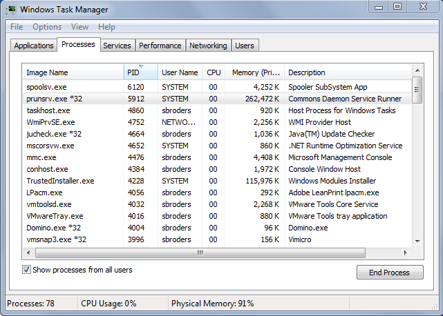

# Instalación independiente personalizada{#custom-standalone-install}

AEM En esta sección se describen las opciones disponibles al instalar una instancia de independiente. También puede leer [Elementos de almacenamiento](/help/sites-deploying/storage-elements-in-aem-6.md) AEM para obtener más información sobre cómo elegir el tipo de almacenamiento back-end después de instalar recientemente la versión 6 de la aplicación

## Cambio del número de puerto al cambiar el nombre del archivo {#changing-the-port-number-by-renaming-the-file}

AEM El puerto predeterminado para la es 4502. Si ese puerto no está disponible o ya está en uso, Quickstart se configura automáticamente para utilizar el primer número de puerto disponible de la siguiente manera: 4502, 8080, 8081, 8082, 8083, 8084, 8085, 8888, 9362, `<*random*>`.

También puede establecer el número de puerto cambiando el nombre del archivo jar de inicio rápido, de modo que el nombre del archivo incluya el número de puerto; por ejemplo, `cq5-publish-p4503.jar` o `cq5-author-p6754.jar`.

Hay varias reglas que se deben seguir al cambiar el nombre del archivo jar de inicio rápido:

* Al cambiar el nombre del archivo, debe comenzar por `cq;` como en `cq5-publish-p4503.jar`.

* Se recomienda que *siempre* agregue al número de puerto el prefijo -p; como en cq5-publish-p4503.jar o cq5-author-p6754.jar.

>[!NOTE]
>
>Esto sirve para asegurarse de que no tiene que preocuparse por cumplir las reglas utilizadas para extraer el número de puerto:
>
>* el número de puerto debe tener 4 o 5 dígitos
>* estos dígitos deben aparecer después de una raya
>* si hay otros dígitos en el nombre del archivo, el número de puerto debe ir precedido de `-p`
>* se ignora el prefijo &quot;cq5&quot; al principio del nombre de archivo
>

>[!NOTE]
>
>También puede cambiar el número de puerto mediante el `-port` en el comando start.

### Consideraciones sobre Java 11 {#java-considerations}

Si está ejecutando Java 11 de Oracle AEM (o, por lo general, versiones de Java más recientes que la 8), se deben agregar modificadores adicionales a la línea de comandos al iniciar la ejecución de un comando de.

* Lo siguiente: `-add-opens` es necesario añadir modificadores para evitar la reflexión relacionada con los mensajes de ADVERTENCIA de acceso en la `stdout.log`

```shell
--add-opens=java.desktop/com.sun.imageio.plugins.jpeg=ALL-UNNAMED --add-opens=java.base/sun.net.www.protocol.jrt=ALL-UNNAMED --add-opens=java.naming/javax.naming.spi=ALL-UNNAMED --add-opens=java.xml/com.sun.org.apache.xerces.internal.dom=ALL-UNNAMED --add-opens=java.base/java.lang=ALL-UNNAMED --add-opens=java.base/jdk.internal.loader=ALL-UNNAMED --add-opens=java.base/java.net=ALL-UNNAMED -Dnashorn.args=--no-deprecation-warning
```

* Además, debe utilizar el `-XX:+UseParallelGC` para mitigar cualquier problema de rendimiento potencial.

AEM A continuación se muestra un ejemplo del aspecto que deberían tener los parámetros de JVM adicionales al iniciar la administración de la aplicación en Java 1100000000000000000000000000000000000000000. A continuación se muestra un ejemplo del aspecto que deben tener los parámetros de JVM adicionales al iniciar la administración de la aplicación de la aplicación de la aplicación de Java 111111000000000000000000000000000000000000000000000000000000000000000000000000

```shell
-XX:+UseParallelGC --add-opens=java.desktop/com.sun.imageio.plugins.jpeg=ALL-UNNAMED --add-opens=java.base/sun.net.www.protocol.jrt=ALL-UNNAMED --add-opens=java.naming/javax.naming.spi=ALL-UNNAMED --add-opens=java.xml/com.sun.org.apache.xerces.internal.dom=ALL-UNNAMED --add-opens=java.base/java.lang=ALL-UNNAMED --add-opens=java.base/jdk.internal.loader=ALL-UNNAMED --add-opens=java.base/java.net=ALL-UNNAMED -Dnashorn.args=--no-deprecation-warning
```

AEM Por último, si está ejecutando una instancia actualizada desde la versión 6.3, asegúrese de que la siguiente propiedad esté configurada como **true** bajo `sling.properties`:

* `felix.bootdelegation.implicit`

## Ejecutar modos {#run-modes}

**Modos de ejecución** AEM permite ajustar la instancia de la aplicación para un propósito específico; por ejemplo, crear o publicar, probar, desarrollar, intranet, etc. Estos modos también permiten controlar el uso del contenido de muestra. Este contenido de muestra se define antes de que se genere el inicio rápido y puede incluir paquetes, configuraciones, etc. Esto puede resultar especialmente útil para instalaciones listas para la producción cuando desea mantener la instalación limpia y sin contenido de muestra. Para obtener más información, consulte:

* [Ejecutar modos](/help/sites-deploying/configure-runmodes.md)

## Agregar un proveedor de instalación de archivos {#adding-a-file-install-provider}

De forma predeterminada, la carpeta `crx-quickstart/install` está vigilado para buscar archivos.
Esta carpeta no existe, pero simplemente se puede crear durante la ejecución.

Si se coloca un paquete, configuración o paquete de contenido en este directorio, se recoge e instala automáticamente. Si se quita, se desinstala.
Es otra forma de colocar paquetes, paquetes de contenido o configuraciones en el repositorio.

Esto resulta especialmente interesante para varios casos de uso:

* Durante el desarrollo, podría ser más fácil colocar algo en el sistema de archivos.
* Si algo sale mal, la consola web y el repositorio no están accesibles. Con esto puede colocar paquetes adicionales en este directorio y deberían instalarse.
* El `crx-quickstart/install` se puede crear una carpeta antes de iniciar quickstart y se pueden colocar paquetes adicionales allí.

>[!NOTE]
>
>Consulte también [Cómo instalar paquetes CRX automáticamente al iniciar el servidor](https://helpx.adobe.com/experience-manager/kb/HowToInstallPackagesUsingRepositoryInstall.html) para ver ejemplos.

## Instalación e inicio de Adobe Experience Manager as a Windows Service {#installing-and-starting-adobe-experience-manager-as-a-windows-service}

>[!NOTE]
>
>Asegúrese de realizar el siguiente procedimiento mientras está conectado como administrador o inicie o ejecute estos pasos utilizando **Ejecutar como administrador** selección de menú contextual.
>
>Iniciar sesión como usuario con privilegios de administrador es **insuficiente**. Si no ha iniciado sesión como administrador al completar estos pasos, recibirá **Acceso denegado** errores.

AEM Para instalar e iniciar el servicio de Windows, haga lo siguiente:

1. Abra el archivo crx-quickstart\opt\helpers\instsrv.bat en un editor de texto.
1. Si está configurando un servidor Windows de 64 bits, reemplace todas las instancias de prunsrv por uno de los siguientes comandos, según el sistema operativo:

   * prunsrv_amd64
   * prunsrv_ia64

   Este comando invoca el script adecuado que inicia el daemon de servicio de Windows en Java de 64 bits en lugar de Java de 32 bits.

1. Para evitar que el proceso se ramifique en más de un proceso, aumente el parámetro JVM de PermGen. Busque el `set jvm_options` y establezca el valor como se indica a continuación:

   `set jvm_options=-Xmx1792m`

1. AEM Abra el Símbolo del sistema, cambie el directorio actual a la carpeta crx-quickstart/opt/helpers de la instalación de la instalación de la aplicación e introduzca el siguiente comando para crear el servicio:

   `instsrv.bat cq5`

   Para comprobar que el servicio se ha creado, abra Servicios en el panel de control de Herramientas administrativas o escriba `start services.msc` en Símbolo del sistema. El servicio cq5 aparece en la lista.

1. Inicie el servicio realizando una de las siguientes acciones:

   * En el panel de control Servicios, haga clic en cq5 y en Iniciar.

   

   * En la línea de comandos, escriba net start cq5.

   

1. Windows indica que el servicio se está ejecutando. AEM Se inicia el archivo ejecutable prunsrv y aparece en el Administrador de tareas. AEM En el explorador web, vaya a la página de, por ejemplo `https://localhost:4502` AEM para empezar a usar la.

   

>[!NOTE]
>
>Los valores de propiedad del archivo instsrv.bat se utilizan al crear el servicio de Windows. Si edita los valores de las propiedades en instsrv.bat, debe desinstalar y volver a instalar el servicio.

>[!NOTE]
>
>AEM Al instalar el servicio de, debe proporcionar la ruta absoluta para el directorio de registros en `com.adobe.xmp.worker.files.ncomm.XMPFilesNComm` en el Administrador de configuración.

Para desinstalar el servicio, haga clic en **Detener** en el **Servicios** panel de control de Campaign o, en la línea de comandos, vaya a la carpeta y escriba `instsrv.bat -uninstall cq5`. El servicio se eliminará de la lista de **Servicios** panel de control o desde la lista de la línea de comandos al escribir `net start`.

## Redefinición de la ubicación del directorio de trabajo temporal {#redefining-the-location-of-the-temporary-work-directory}

La ubicación predeterminada de la carpeta temporal del equipo java es `/tmp`. AEM También utiliza esta carpeta, por ejemplo, al crear paquetes.

Si desea cambiar la ubicación de la carpeta temporal (por ejemplo, si necesita un directorio con más espacio libre), defina un * `<new-tmp-path>`* añadiendo el parámetro JVM:

`-Djava.io.tmpdir="/<*new-tmp-path*>"`

para:

* la línea de comandos de inicio del servidor
* el parámetro de entorno CQ_JVM_OPTS en el script de inicio o serverctl

## Más opciones disponibles en el archivo de inicio rápido {#further-options-available-from-the-quickstart-file}

En el archivo de ayuda de inicio rápido, disponible a través de la opción -help, se describen más opciones y convenciones de cambio de nombre. Para acceder a la ayuda de, escriba:

* `java -jar cq-quickstart-6.5.0.jar -help`

>[!CAUTION]
>
>AEM Estas opciones son válidas a partir de la versión original de 6.5 (6.5.0.0). Es posible realizar cambios en versiones posteriores de SP.

```shell
Loading quickstart properties: default
Loading quickstart properties: instance
Setting properties from filename '/Users/Desktop/AEM/cq-quickstart-6.5.0.jar'
--------------------------------------------------------------------------------
Adobe Experience Manager Quickstart (build 20190328)                            
--------------------------------------------------------------------------------
Usage:                                                                          
 Use these options on the Quickstart command line.                              
--------------------------------------------------------------------------------

-help (--help,-h)
         Show this help message                                                 
-quickstart.server.port (-p,-port) <port>
         Set server port number                                                 
-contextpath (-c,-org.apache.felix.http.context_path) <contextpath>
         Set context path                                                       
-debug <port>
         Enable Java Debugging on port number; forces forking                   
-gui 
         Show GUI if running on a terminal                                      
-nobrowser (-quickstart.nobrowser)
         Do not open browser at startup                                         
-unpack
         Unpack installation files only, do not start the server (implies       
         -verbose)                                                              
-v (-verbose)
         Do not redirect stdout/stderr to files and do not close stdin          
-nofork
         Do not fork the JVM, even if not running on a console                  
-fork
         Force forking the JVM if running on a console, using recommended       
         default memory settings for the forked JVM.                            
-forkargs <args> [<args> ...]
         Additional arguments for the forked JVM, defaults to '-Xmx1024m        
         -XX:MaxPermSize=256m '.  Use -- to specify values starting with -,     
         example: '-forkargs -- -server'                                        
-a (--interface) <interface>
         Optional IP address (interface) to bind to                             
-pt <string>
         Process type (main/fork) - do not use directly, used when forking a    
         process                                                                
-r <string> [<string> [<string> [<string> [<string> [<string> [<string> [<string> [<string> [<string>]]]]]]]]]
         Runmode(s) - Use this to define the run mode(s)                        
-b <string>
         Base folder - defines the path under which the quickstart work folder  
         is created                                                             
-low-mem-action <string>
         Low memory action - what to do if memory is insufficient at startup    
-use-control-port
         Start a control port                                                   
-nointeractive
         Start with no interactivity                                            
-ll <level>
         Define launchpad log level (1 = error...4 = debug)                     
-n   
         Do not install shutdown hook                                           
-D<property>=<value>
         Additional framework properties.                                       
-listener-port <listener-port>
         Set listener port number                                               
-x <string>
         Run a Quickstart extension.                                            
  Options for executing Quickstart extensions:
                                                                                
    -xargs <arg> [<arg> ...]
         Construct an arguments list for a Quickstart extension (for example, -xargs -- 
         -arg1 val1 -arg2 val2).                                                
--------------------------------------------------------------------------------
Quickstart filename options                                                     
--------------------------------------------------------------------------------
Usage:                                                                          
 Rename the jar file, including one of the patterns shown below, to set the     
corresponding option. Command-line options have priority on these filename      
patterns.                                                                       
--------------------------------------------------------------------------------

-NNNN
         Include -NNNN.jar or -pNNNN in the renamed jar filename to run on port 
         NNNN, for example: quickstart-8085.jar                                 
-nobrowser
         Include -nobrowser in the renamed jar filename to avoid opening the    
         browser at startup, example: quickstart-nobrowser-8085.jar             
-publish
         Include -publish in the renamed jar filename to run in "publish" mode, 
         example: cq-publish-7502.jar                                           
-dynamicmedia
         Include -dynamicmedia in the renamed jar filename to run in            
         "dynamicmedia" mode, example: quickstart-dynamicmedia-4502.jar         
-dynamicmedia_scene7
         Include -dynamicmedia_scene7 in the renamed jar filename to run in     
         "dynamicmedia_scene7" mode, example:                                   
         quickstart-dynamicmedia_scene7-p4502.jar                               
--------------------------------------------------------------------------------
The license.properties file
--------------------------------------------------------------------------------
  The license.properties file stores licensing information, created from the    
  licensing form displayed on first startup and stored in the folder from where 
  Quickstart is run.                                                            
--------------------------------------------------------------------------------
Log files
--------------------------------------------------------------------------------
  Once Quickstart has been unpacked and started, log files can be found under   
  /Users/aemdocs/CQInstallationKits/AEM-65150-L8/crx-quickstart/logs.           
--------------------------------------------------------------------------------
```

## AEM Instalación de en el entorno de Amazon EC2 {#installing-aem-in-the-amazon-ec-environment}

AEM Al realizar la instalación en una instancia de Amazon Elastic Compute Cloud (EC2), si instala la instancia de autor y la de publicación en la instancia de EC2, la instancia de autor se instala correctamente siguiendo el procedimiento de [AEM Instalación de instancias de Administrador de](#installinginstancesofaemmanager); sin embargo, la instancia Publicación se convierte en Autor.

Antes de instalar la instancia de publicación en el entorno EC2, haga lo siguiente:

1. Desempaquete el archivo jar para la instancia de publicación antes de iniciar la instancia por primera vez. Para desempaquetar el archivo, utilice el siguiente comando:

   ```xml
   java -jar quickstart.jar -unpack
   ```

   >[!NOTE]
   >
   >Si cambia el modo **después** al iniciar la instancia por primera vez, no se puede cambiar el modo de ejecución.

1. Inicie la instancia ejecutando:

   ```xml
   java -jar quickstart.jar -r publish
   ```

   >[!CAUTION]
   >
   >Asegúrese de ejecutar primero la instancia después de desempaquetarla ejecutando el comando anterior. De lo contrario, no se generará el relleno quickstart.properties. AEM Sin este archivo, cualquier actualización futura de la fallará.

1. En el **cubo** , abra la carpeta **start** y compruebe la siguiente sección:

   ```xml
   # runmode(s)
   if [ -z "$CQ_RUNMODE" ]; then
    CQ_RUNMODE='author'
   fi
   ```

1. Cambie el modo de ejecución a **publicar** y guarde el archivo.

   ```xml
   # runmode(s)
   if [ -z "$CQ_RUNMODE" ]; then
    CQ_RUNMODE='publish'
   fi
   ```

1. Detenga la instancia y reiníciela ejecutando el **start** script.

## Verificación de la instalación {#verifying-the-installation}

Los siguientes vínculos se pueden utilizar para comprobar que la instalación está operativa (todos los ejemplos se basan en que la instancia se está ejecutando en el puerto 8080 del localhost, que CRX está instalado en /crx y Launchpad en /):

* `https://localhost:8080/crx/de`
La consola del CRXDE Lite.

* `https://localhost:8080/system/console`
La consola web.

## Acciones después de la instalación {#actions-after-installation}

AEM Aunque existen muchas posibilidades para configurar WCM, se deben realizar determinadas acciones o, al menos, revisar inmediatamente después de la instalación:

* Consulte la [Lista de comprobación de seguridad](/help/sites-administering/security-checklist.md) para las tareas necesarias para garantizar que el sistema sigue siendo seguro.
* AEM Revise la lista de usuarios y grupos predeterminados que se instalan con WCM de forma. Compruebe si desea realizar alguna acción con cualquier otra cuenta (consulte ) [Seguridad y administración de usuarios](/help/sites-administering/security.md) para obtener más información.

## Acceso al CRXDE Lite y a la consola web {#accessing-crxde-lite-and-the-web-console}

AEM Una vez que se haya iniciado WCM, también puede acceder a:

* [CRXDE Lite](#accessing-crxde-lite) : se utiliza para acceder y administrar el repositorio.
* [Consola web](#accessing-the-web-console) : se utiliza para administrar o configurar los paquetes OSGi (también conocida como consola OSGi)

### Acceder al CRXDE Lite {#accessing-crxde-lite}

Para abrir el CRXDE Lite, puede seleccionar **CRXDE Lite** desde la pantalla de bienvenida o utilice su explorador para navegar a

```
 https://<<i>host</i>>:<<i>port</i>>/crx/de/index.jsp
```

Por ejemplo:
`https://localhost:4502/crx/de/index.jsp`


#### Acceso a la consola web {#accessing-the-web-console}

Para acceder a la consola web de Adobe CQ, puede seleccionar **Consola OSGi** desde la pantalla de bienvenida o utilice su explorador para navegar a

```
 https://<host>:<port>/system/console
```

Por ejemplo:
`https://localhost:4502/system/console`
o para la página Paquetes
`https://localhost:4502/system/console/bundles`


Consulte [Configuración de OSGi con la consola web](/help/sites-deploying/configuring-osgi.md#osgi-configuration-with-the-web-console) para obtener más información.

## Solución de problemas {#troubleshooting}

Para obtener información acerca de cómo solucionar los problemas que pueden producirse durante la instalación, consulte:

* [Solución de problemas](/help/sites-deploying/troubleshooting.md)

## Desinstalación de Adobe Experience Manager {#uninstalling-adobe-experience-manager}

AEM Debido a que se instala en un único directorio, no es necesario instalar ninguna utilidad de desinstalación. AEM La desinstalación puede ser tan sencilla como eliminar todo el directorio de instalación, aunque la forma de desinstalar depende de lo que desee conseguir y del almacenamiento persistente que utilice.

Si el almacenamiento persistente está incrustado en el directorio de instalación, por ejemplo, en la instalación predeterminada de TarPM, al eliminar carpetas también se eliminan datos.

>[!NOTE]
>
>El Adobe AEM recomienda encarecidamente que realice una copia de seguridad del repositorio antes de eliminar los recursos de la. Si elimina todo el &lt;cq-installation-directory>, eliminará el repositorio. Para conservar los datos del repositorio antes de eliminarlos, mueva o copie el &lt;cq-installation-directory>La carpeta /crx-quickstart/repository se encuentra en otro lugar antes de eliminar las demás carpetas.

AEM Si la instalación de la utiliza almacenamiento externo, por ejemplo, un servidor de base de datos, al eliminar la carpeta no se eliminan los datos automáticamente, pero sí la configuración de almacenamiento, lo que dificulta la restauración del contenido JCR.
