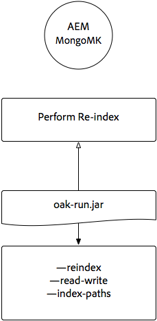
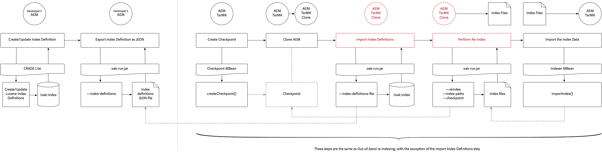

# Indexación a través de Oak-run Jar {#indexing-via-the-oak-run-jar}

Oak-run admite todos los casos de uso de indexación en la línea de comandos sin tener que operar desde el nivel JMX. Las ventajas del enfoque de oak-run son:

1. Es un nuevo conjunto de herramientas de indexación para AEM 6.4
1. Reduce el tiempo de reindexación, lo que beneficia a los tiempos de reindexación en repositorios más grandes
1. Reduce el consumo de recursos durante la reindexación en AEM, lo que mejora el rendimiento del sistema para otras actividades AEM
1. Oak-run proporciona soporte fuera de banda: Si las condiciones de producción no permiten ejecutar el reindexado en instancias de producción, se puede utilizar un entorno clonado para la reindexación a fin de evitar un impacto crítico en el rendimiento.

A continuación encontrará una lista de casos de uso que se pueden aprovechar al realizar operaciones de indexación mediante la herramienta `oak-run`.

## Comprobaciones de coherencia de índice {#indexconsistencychecks}

>[!NOTE]
>
>Para obtener información más detallada sobre este escenario, consulte [Caso de uso 1 - Comprobación de coherencia del índice](/help/sites-deploying/oak-run-indexing-usecases.md#usercase1indexconsistencycheck).

* `oak-run.jar`determina rápidamente si los índices de Lucene oak están corruptos.
* Es seguro ejecutar en una instancia de AEM en uso para comprobar la coherencia en los niveles 1 y 2.

## Estadísticas de índice {#indexstatistics}

>[!NOTE]
>
>Para obtener información más detallada sobre este escenario, consulte [Caso de uso 2 - Estadísticas de índice](/help/sites-deploying/oak-run-indexing-usecases.md#usecase2indexstatistics)

* `oak-run.jar` genera todas las definiciones de índice, estadísticas de índice importantes y contenido de índice para análisis sin conexión.
* Segura para ejecutarse en una instancia de AEM en uso.

## Árbol de decisiones de enfoque de reindexación {#reindexingapproachdecisiontree}

Este diagrama es un árbol de decisión sobre cuándo utilizar los distintos enfoques de reindexación.

## Reindexación de MongoMK / RDMBMK {#reindexingmongomk}

>[!NOTE]
>
>Para obtener información más detallada sobre este escenario, consulte [Caso de uso 3 - Reindexación](/help/sites-deploying/oak-run-indexing-usecases.md#usecase3reindexing).

### Extracción previa de texto para SegmentNodeStore y DocumentNodeStore {#textpre-extraction}

[La preextracción de texto](/help/sites-deploying/best-practices-for-queries-and-indexing.md#how-to-perform-text-pre-extraction)  (una función que existe con AEM 6.3) se puede utilizar para reducir el tiempo de reindexación. La preextracción de texto se puede utilizar junto con todos los enfoques de reindexación.

Según el enfoque de indexación `oak-run.jar`, habrá varios pasos a ambos lados del paso Realizar reindexación en el diagrama siguiente.

>[!NOTE]
>
>Naranja indica las actividades en las que AEM debe estar en una ventana de mantenimiento.

### Reindexación en línea para MongoMK o RDBMK usando oak-run.jar {#onlinere-indexingformongomk}

>[!NOTE]
>
>Para obtener información más detallada sobre este escenario, consulte [Reindex - DocumentNodeStore](/help/sites-deploying/oak-run-indexing-usecases.md#reindexdocumentnodestore).

Este es el método recomendado para volver a indexar las instalaciones AEM MongoMK (y RDBMK). No debe utilizarse ningún otro método.

Este proceso debe ejecutarse únicamente contra una única instancia de AEM en el clúster.

## Reindexación de TarMK {#re-indexingtarmk}

>[!NOTE]
>
>Para obtener información más detallada sobre este escenario, consulte [Reindex - SegmentNodeStore](/help/sites-deploying/oak-run-indexing-usecases.md#reindexsegmentnodestore).

* **Consideraciones sobre el modo de espera en frío (TarMK)**

   * No hay ninguna consideración especial para el modo de espera pasiva; las instancias de espera pasiva sincronizarán los cambios como de costumbre.

* **AEM Publish Farms (AEM Publish Farms siempre debe ser TarMK)**

   * Para el conjunto de servidores de publicación, es necesario hacerlo para todos O ejecutar los pasos en una sola publicación y luego clonar la configuración para otros (tomando todas las precauciones habituales al clonar AEM instancias; sling.id: debería vincular con algo aquí)

### Reindexación en línea para TarMK {#onlinere-indexingfortarmk}

>[!NOTE]
>
>Para obtener información más detallada sobre este escenario, consulte [Reindex en línea - SegmentNodeStore](/help/sites-deploying/oak-run-indexing-usecases.md#onlinereindexsegmentnodestore).

Este es el método utilizado antes de la introducción de las nuevas capacidades de indexación de oak-run.jar. Puede hacerlo estableciendo la propiedad `reindex=true` en el índice Oak.

Este método se puede utilizar si el cliente acepta los efectos de tiempo y rendimiento del índice. Este suele ser el caso de las instalaciones de AEM pequeñas y medianas.

### Reindexación en línea de TarMK usando oak-run.jar {#onlinere-indexingtarmkusingoak-run-jar}

>[!NOTE]
>
>Para obtener información más detallada sobre este escenario, consulte [Reindex en línea - SegmentNodeStore - The AEM Instance is Running](/help/sites-deploying/oak-run-indexing-usecases.md#onlinereindexsegmentnodestoretheaeminstanceisrunning).

La reindexación en línea de TarMK usando oak-run.jar es más rápida que la [reindexación en línea para TarMK](#onlinere-indexingfortarmk) descrita anteriormente. Sin embargo, también requiere ejecución durante una ventana de mantenimiento; con la mención que la ventana será más corta y se necesitarán más pasos para realizar la reindexación.

>[!NOTE]
>
>Naranja indica las operaciones en las que AEM debe realizarse en un período de mantenimiento.

### Reindexación sin conexión de TarMK usando oak-run.jar {#offlinere-indexingtarmkusingoak-run-jar}

>[!NOTE]
>
>Para obtener información más detallada sobre este escenario, consulte [Reindex en línea - SegmentNodeStore - The AEM Instance is Apagar](/help/sites-deploying/oak-run-indexing-usecases.md#onlinereindexsegmentnodestoreaeminstanceisdown).

La reindexación sin conexión de TarMK es el enfoque de reindexación basado en `oak-run.jar` más sencillo para TarMK, ya que requiere un solo comentario `oak-run.jar`. Sin embargo, requiere que se cierre la instancia de AEM.

>[!NOTE]
>
>Rojo denota operaciones en las que se debe cerrar AEM.

### Reindexación fuera de banda TarMK usando oak-run.jar  {#out-of-bandre-indexingtarmkusingoak-run-jar}

>[!NOTE]
>
>Para obtener información más detallada sobre este escenario, consulte [Reindex de fuera de banda - SegmentNodeStore](/help/sites-deploying/oak-run-indexing-usecases.md#outofbandreindexsegmentnodestore).

La reindexación fuera de banda minimiza el impacto de la reindexación en las instancias de AEM en uso.

>[!NOTE]
>
>Rojo denota operaciones en las que se puede cerrar AEM.

## Actualización de definiciones de indexación {#updatingindexingdefinitions}

>[!NOTE]
>
>Para obtener información más detallada sobre este escenario, consulte [Caso de uso 4 - Actualización de definiciones de índice](/help/sites-deploying/oak-run-indexing-usecases.md#usecase4updatingindexdefinitions).

### Creación y actualización de definiciones de índice en TarMK usando ACS Asegúrese de índice {#creatingandupdatingindexdefinitionsontarmkusingacsensureindex}

>[!NOTE]
>
>ACS Asegúrese de que Index es un proyecto compatible con la comunidad y no es compatible con el Soporte técnico de Adobe.

Esto permite enviar la definición del índice a través del paquete de contenido, lo que posteriormente resulta en una reindexación estableciendo el indicador de reindexación en `true`. Esto funciona para configuraciones más pequeñas en las que la reindexación no tarda mucho tiempo.

Para obtener más información, consulte la [Documentación del índice de seguridad ACS](https://adobe-consulting-services.github.io/acs-aem-commons/features/ensure-oak-index/index.html) para obtener más información.

### Creación y actualización de definiciones de índice en TarMK usando oak-run.jar {#creatingandupdatingindexdefinitionsontarmkusingoak-run-jar}

Si el impacto en el tiempo o el rendimiento de la reindexación mediante métodos que no sean `oak-run.jar` es demasiado alto, se puede usar el siguiente enfoque basado en `oak-run.jar` para importar y volver a indexar las definiciones del índice Lucene en una instalación AEM basada en TarMK.

### Creación y actualización de definiciones de índice en MonogMK usando oak-run.jar {#creatingandupdatingindexdefinitionsonmonogmkusingoak-run-jar}

Si el impacto en el tiempo o el rendimiento de la reindexación mediante métodos que no sean `oak-run.jar` es demasiado alto, se puede usar el siguiente enfoque basado en `oak-run.jar` para importar y volver a indexar las definiciones del índice Lucene en instalaciones de AEM basadas en MongoMK.

