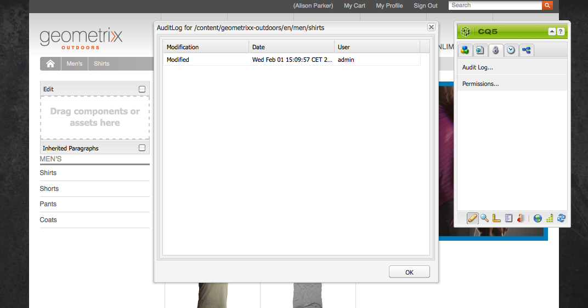

# Monitoreo y mantenimiento de la instancia de AEM{#monitoring-and-maintaining-your-aem-instance}

Una vez implementadas las instancias de AEM, se necesitarán ciertas tareas para supervisar y mantener su funcionamiento, rendimiento e integridad.

Un factor clave aquí es que para reconocer los problemas potenciales necesita saber cómo se ven y comportan sus sistemas en condiciones normales. Para ello, es mejor supervisar el sistema y recopilar información durante un período de tiempo.

| Comprobar | Consideraciones | Comentario / Acciones |
|---|---|---|
| Plan de copia de seguridad. |  | Consulte cómo [Realizar una copia de seguridad de la instancia](/help/sites-deploying/monitoring-and-maintaining.md#backups). |
| Plan de recuperación ante desastres. | Directrices de recuperación ante desastres de su compañía. |  |
| Hay disponible un sistema de seguimiento de errores para problemas de sistema de informes. | Por ejemplo, [bugzilla](https://www.bugzilla.org/), [jira](https://www.atlassian.com/software/jira/) o uno de muchos otros. |  |
| Se están supervisando los sistemas de archivos. | El repositorio de CRX se &quot;bloqueará&quot; si no hay suficiente espacio libre en el disco. Se reanudará cuando haya espacio disponible. | Los mensajes &quot; `*ERROR* LowDiskSpaceBlocker`&quot; se pueden ver en el archivo de registro cuando el espacio libre es bajo. |
| [Se está supervisando ](/help/sites-deploying/monitoring-and-maintaining.md#working-with-audit-records-and-log-files) los archivos de registro. |  |  |
| La supervisión del sistema se está ejecutando (constantemente) en segundo plano. | Incluido el uso de CPU, memoria, disco y red. Usando, por ejemplo, iostat / vmstat / permon. | Los datos registrados se visualizan y pueden utilizarse para rastrear problemas de rendimiento. También se puede acceder a los datos sin procesar. |
| [AEM rendimiento se está supervisando](/help/sites-deploying/monitoring-and-maintaining.md#monitoring-performance). | Incluyendo [Contadores de solicitudes](/help/sites-deploying/monitoring-and-maintaining.md#request-counters) para monitorear los niveles de tráfico. | Si se observa una pérdida significativa, o a largo plazo, de rendimiento, debe realizarse una investigación detallada. |
| Está monitoreando sus [agentes de replicación](/help/sites-deploying/monitoring-and-maintaining.md#monitoring-your-replication-agents). |  |  |
| Purgue regularmente instancias de flujo de trabajo. | Tamaño del repositorio y rendimiento del flujo de trabajo. | Consulte [Depuración regular de instancias de flujo de trabajo](/help/sites-administering/workflows-administering.md#regular-purging-of-workflow-instances). |

## Copias de seguridad {#backups}

Se recomienda realizar copias de seguridad de:

* Instalación del software: antes/después de cambios significativos en la configuración
* El contenido que se conserva en el repositorio de forma periódica

Es probable que su compañía tenga una política de backup que deberá seguir, consideraciones adicionales sobre qué hacer backup y cuándo incluir:

* la importancia crítica del sistema y los datos.
* la frecuencia con la que se realizan cambios en el software o en los datos.
* volumen de datos; ocasionalmente, la capacidad puede ser un problema, al igual que el tiempo necesario para realizar el backup.
* si la copia de seguridad se puede realizar mientras los usuarios están en línea; y, si es posible, cuál es el impacto en el rendimiento.
* la distribución geográfica de los usuarios; es decir, ¿cuándo es el mejor momento para realizar el backup (para minimizar el impacto)?
* su política de recuperación ante desastres; Existen pautas sobre dónde se deben almacenar los datos de backup (por ejemplo, fuera del sitio, medio específico, etc.).

A menudo, se realiza una copia de seguridad completa a intervalos regulares (por ejemplo, diaria, semanal o mensual), con copias de seguridad incrementales entre horas (por ejemplo, por hora, por día o por semana).

>[!CAUTION]
>
>Al implementar las copias de seguridad de las instancias de producción, se deben realizar pruebas *a1/> para garantizar que el backup se pueda restaurar correctamente.*
>
>Sin esto, el backup es potencialmente inútil (el peor de los casos).

>[!NOTE]
>
>Para obtener más información sobre el rendimiento de backup, lea la sección [Rendimiento de backup](/help/sites-deploying/configuring-performance.md#backup-performance).

### Copia de seguridad de la instalación de software {#backing-up-your-software-installation}

Después de la instalación, o de cambios significativos en la configuración, realice una copia de seguridad de la instalación del software.

Para ello, debe [hacer una copia de seguridad de todo el repositorio](#backing-up-your-repository) y luego:

1. Detén AEM.
1. Realice una copia de seguridad de todo el `<cq-installation-dir>` desde el sistema de archivos.

>[!CAUTION]
>
>Si está utilizando un servidor de aplicaciones de terceros, es posible que haya carpetas adicionales en una ubicación diferente y que también sea necesario realizar una copia de seguridad. Consulte [Cómo instalar AEM con un servidor de aplicaciones](/help/sites-deploying/application-server-install.md) para obtener información sobre la instalación de servidores de aplicaciones. [](/content/docs/en/aem/6-3/deploy/installing.md#installing adobe experience manager with an application server)

>[!CAUTION]
>
>Se admite el backup incremental del almacén de datos de archivos; cuando utilice una copia de seguridad incremental para otros componentes (como el índice Lucene), asegúrese de que los archivos eliminados también se marquen como eliminados en la copia de seguridad.

>[!NOTE]
>
>El espejado de discos también puede utilizarse como mecanismo de backup.

### Copia de seguridad del repositorio {#backing-up-your-repository}

La sección [Backup y Restore](/help/sites-administering/backup-and-restore.md) de la documentación de CRX cubre todos los problemas relacionados con los backups del repositorio de CRX.

Para obtener información detallada sobre cómo realizar una copia de seguridad en línea &quot;en caliente&quot;, consulte [Creación de una copia de seguridad en línea](/help/sites-administering/backup-and-restore.md#online-backup).

## Depuración de versiones {#version-purging}

La herramienta **Purgar versiones** está diseñada para purgar las versiones de un nodo o una jerarquía de nodos en el repositorio. Su principal propósito es ayudarle a reducir el tamaño del repositorio eliminando versiones antiguas de los nodos.

Esta sección trata las operaciones de mantenimiento relacionadas con la función de versiones de AEM. La herramienta **Purgar versión** está diseñada para purgar las versiones de un nodo o una jerarquía de nodos en el repositorio. Su principal propósito es ayudarle a reducir el tamaño del repositorio eliminando versiones antiguas de los nodos.

### Información general {#overview}

La herramienta **Purgar versiones** está disponible en la consola **[Herramientas](/help/sites-administering/tools-consoles.md)** en **Versiones** o directamente en:

`https://<server>:<port>/etc/versioning/purge.html`


**Ruta del** inicioRuta absoluta en la que se debe realizar la purga. Puede seleccionar la Ruta de Inicio haciendo clic en el navegador de árbol del repositorio.

**** RecursivoAl depurar datos, puede elegir entre realizar la operación en un nodo o en una jerarquía completa seleccionando Recursivo. En el último caso, la ruta dada define el nodo raíz de la jerarquía.

**Número máximo de versiones para** mantenerEl número máximo de versiones que se van a conservar para un nodo. Cuando este número supera este valor, se purgan las versiones más antiguas.

**Edad máxima** de la versiónEdad máxima de la versión de un nodo. Cuando la antigüedad de una versión supera este valor, se purga.

**Ensayo de** ejecuciónPuesto que la eliminación de versiones del contenido es definitiva y no se puede revertir sin restaurar una copia de seguridad, la herramienta Purgar versiones proporciona un modo de ejecución en seco que permite la previsualización de las versiones purgadas. Para iniciar una ejecución seca del proceso de purga, haga clic en Ensayo.

**** PurgarInicie la purga de las versiones en el nodo definido por la Ruta de Inicio.

### Purgar versiones de un sitio Web {#purging-versions-of-a-web-site}

Para depurar versiones de un sitio web, siga estos pasos:

1. Vaya a la **[consola](/help/sites-administering/tools-consoles.md)** **Herramientas**, seleccione **Versiones** y haga clic con el doble **Purgar versiones.**
1. Configure la ruta de inicio del contenido que se va a purgar (p. ej. `/content/geometrixx-outdoors`).

   * Si solo desea purgar el nodo definido por la ruta, deseleccione **Recursive**.
   * Si desea purgar el nodo definido por la ruta y sus descendientes, seleccione **Recursive**.

1. Establezca el número máximo de versiones (para cada nodo) que desee conservar. Deje vacío para no utilizar esta configuración.

1. Establezca la página de versión máxima en días (para cada nodo) que desee mantener. Deje vacío para no utilizar esta configuración.

1. Haga clic en **Ejecución seca** para previsualización lo que haría el proceso de purga.
1. Haga clic en **Purgar** para iniciar el proceso.

>[!CAUTION]
>
>Los nodos purgados no se pueden revertir sin restaurar el repositorio. Debe cuidar su configuración, por lo que le recomendamos que realice siempre una prueba antes de purgar.

### Análisis de la consola {#analyzing-the-console}

La **ejecución seca** y **depuración** procesan la lista de todos los nodos procesados. Durante el proceso, un nodo puede tener uno de los siguientes estados:

* `ignore (not versionnable)`:: el nodo no admite el control de versiones y se omite durante el proceso.

* `ignore (no version)`:: el nodo no tiene ninguna versión y se ignora durante el proceso.

* `retained`:: el nodo no se depura.
* `purged`:: el nodo se purga.

Además, la consola proporciona información útil sobre las versiones:

* `V 1.0`:: el número de versión.
* `V 1.0.1`*: la estrella indica que la versión es la actual.

* `Thu Mar 15 2012 08:37:32 GMT+0100`:: la fecha de la versión.

En el siguiente ejemplo:

* Las versiones **[!DNL Shirts]** se purgan porque su edad de versión es buena en 2 días.
* Las versiones **[!DNL Tonga Fashions!]** se purgan porque su número de versiones es bueno a 5.


## Uso de registros de auditoría y archivos de registro {#working-with-audit-records-and-log-files}

Los registros de auditoría y los archivos de registro relacionados con Adobe Experience Manager (AEM) se pueden encontrar en varias ubicaciones. Se proporciona lo siguiente para ofrecerle una visión general de lo que puede encontrar.

### Uso de registros {#working-with-logs}

AEM WCM registra registros detallados. Después de desempaquetar y inicio QuickStart, puede encontrar los registros en:

* `<cq-installation-dir>/crx-quickstart/logs/`

* `<cq-installation-dir>/crx-quickstart/repository/`

#### Rotación de archivos de registro {#log-file-rotation}

La rotación del archivo de registro se refiere al proceso que limita el crecimiento del archivo mediante la creación periódica de un nuevo archivo. En AEM, un archivo de registro llamado `error.log` se rotará una vez al día según las reglas dadas:

* Se cambia el nombre del archivo `error.log` según el patrón {original_filename} `.yyyy-MM-dd`. Por ejemplo: el 11 de julio de 2010, el nombre del archivo de registro actual cambia a `error.log-2010-07-10` y se crea un nuevo `error.og`.

* Los archivos de registro anteriores no se eliminan, por lo que es responsabilidad suya limpiar los archivos de registro antiguos periódicamente para limitar el uso del disco.

>[!NOTE]
>
>Si actualiza la instalación de AEM, tenga en cuenta que cualquier archivo de registro existente que AEM ya no utilice permanecerá en el disco. Puede eliminarlos sin riesgo. Todas las nuevas entradas de registro se escribirán en los nuevos archivos de registro.

### Búsqueda de los archivos de registro {#finding-the-log-files}

En el servidor de archivos donde instaló AEM se guardan varios archivos de registro:

* `<cq-installation-dir>/crx-quickstart/logs`

   * `access.log`
Todas las solicitudes de acceso a AEM WCM y al repositorio están registradas aquí.

   * `audit.log`
Las acciones de moderación se registran aquí.

   * `error.log`
Aquí se registran los mensajes de error (de distintos niveles de gravedad).

   * [ `ImageServer-<PortId>-yyyy>-<mm>-<dd>.log`](https://docs.adobe.com/content/help/en/dynamic-media-developer-resources/image-serving-api/image-serving-api/config-admin/server-logging/c-image-server-log.html)
Este registro solo se utiliza si  [!DNL Dynamic Media] está habilitado. Proporciona estadísticas e información analítica utilizada para analizar el comportamiento del proceso interno de ImageServer.

   * `request.log`
Cada solicitud de acceso se registra aquí junto con la respuesta.

   * [ `s7access-<yyyy>-<mm>-<dd>.log`](https://docs.adobe.com/content/help/en/dynamic-media-developer-resources/image-serving-api/image-serving-api/config-admin/server-logging/c-access-log.html)
Este registro solo se utiliza si  [!DNL Dynamic Media] está habilitado. El registro de acceso s7registra cada solicitud realizada a [!DNL Dynamic Media] a `/is/image` y `/is/content`.

   * `stderr.log`
Contiene mensajes de error, también de distintos niveles de gravedad, generados durante el inicio. De forma predeterminada, el nivel de registro está establecido en 
`Warning` ( `WARN`)

   * `stdout.log`
Contiene mensajes de registro que indican eventos durante el inicio.

   * `upgrade.log`
Proporciona un registro de todas las operaciones de actualización que se ejecutan desde el 
`com.day.compat.codeupgrade` y  `com.adobe.cq.upgradesexecutor` paquetes.

* `<cq-installation-dir>/crx-quickstart/repository`

   * `revision.log`
Revisión de la información del diario.

>[!NOTE]
>
>Los registros de ImageServer y s7access no se incluyen en el **paquete de descarga completa **que se genera a partir del **sistema/consola/status-Bundlelist **página. Para fines de soporte, si tiene [!DNL Dynamic Media] problemas, anexe también los registros de ImageServer y s7access cuando se ponga en contacto con el servicio de asistencia al cliente.

### Activación del nivel de registro DEBUG {#activating-the-debug-log-level}

El nivel de registro predeterminado ([Configuración de registro de Apache Sling](/help/sites-deploying/osgi-configuration-settings.md#apacheslingloggingconfiguration)) es Información, por lo que los mensajes de depuración no se registran.

Para activar el nivel de registro de depuración para un registrador, establezca la propiedad `org.apache.sling.commons.log.level` para depurar en el repositorio. Por ejemplo, en `/libs/sling/config/org.apache.sling.commons.log.LogManager` para configurar el [registro de Sling de Apache global](/help/sites-deploying/osgi-configuration-settings.md#apacheslingloggingconfiguration).

>[!CAUTION]
>
>No deje el registro en el nivel de registro de depuración más tiempo del necesario, ya que genera muchas entradas de registro, lo que consume recursos.

Una línea en el archivo de depuración normalmente inicio con DEBUG y, a continuación, proporciona el nivel de registro, la acción del instalador y el mensaje de registro. Por ejemplo:

```shell
DEBUG 3 WebApp Panel: WebApp successfully deployed
```

Los niveles de registro son los siguientes:

| 0 | Error fatal | Error en la acción y el instalador no puede continuar. |
|---|---|---|
| 1 | Error | Error en la acción. La instalación continúa, pero una parte de AEM WCM no se instaló correctamente y no funcionará. |
| 2 | Advertencia | La acción se ha realizado correctamente, pero se han encontrado problemas. AEM WCM puede funcionar correctamente o no. |
| 3 | Información | La acción se ha realizado correctamente. |

### Crear un archivo de registro personalizado {#create-a-custom-log-file}

>[!NOTE]
>
>Al trabajar con Adobe Experience Manager existen varios métodos para gestionar los parámetros de configuración de dichos servicios; consulte [Configuración de OSGi](/help/sites-deploying/configuring-osgi.md) para obtener más detalles y las prácticas recomendadas.

En determinadas circunstancias, es posible que desee crear un archivo de registro personalizado con un nivel de registro diferente. Puede hacerlo en el repositorio:

1. Si aún no existe, cree una nueva carpeta de configuración ( `sling:Folder`) para su proyecto `/apps/<project-name>/config`.
1. En `/apps/<project-name>/config`, cree un nodo para la nueva [Configuración del registrador de registros de Apache Sling](/help/sites-deploying/osgi-configuration-settings.md#apacheslingloggingloggerconfigurationfactoryconfiguration):

   * Nombre: `org.apache.sling.commons.log.LogManager.factory.config-<identifier>` (ya que es un Logger)

      Donde `<identifier>` se reemplaza por texto libre que debe introducir para identificar la instancia (no puede omitir esta información).

      Por ejemplo, `org.apache.sling.commons.log.LogManager.factory.config-MINE`

   * Tipo: `sling:OsgiConfig`
   >[!NOTE]
   >
   >Aunque no es un requisito técnico, es aconsejable hacer `<identifier>` único.

1. Establezca las siguientes propiedades en este nodo:

   * Nombre: `org.apache.sling.commons.log.file`

      Tipo: Cadena

      Valor: especifique el archivo de registro; por ejemplo, `logs/myLogFile.log`

   * Nombre: `org.apache.sling.commons.log.names`

      Tipo: String[] (String + Multi)

      Valor: especifique los servicios OSGi para los que el registrador debe registrar los mensajes; por ejemplo, todo lo siguiente:

      * `org.apache.sling`
      * `org.apache.felix`
      * `com.day`
   * Nombre: `org.apache.sling.commons.log.level`

      Tipo: Cadena

      Valor: especifique el nivel de registro requerido ( `debug`, `info`, `warn` o `error`); por ejemplo `debug`

   * Configure los demás parámetros según sea necesario:

      * Nombre: `org.apache.sling.commons.log.pattern`

         Tipo: `String`

         Valor: especifique el patrón del mensaje de registro según sea necesario; por ejemplo,

         `{0,date,dd.MM.yyyy HH:mm:ss.SSS} *{4}* [{2}] {3} {5}`
   >[!NOTE]
   >
   >`org.apache.sling.commons.log.pattern` admite hasta seis argumentos.
   >
   >{0} La marca de tiempo del tipo `java.util.Date`
   >
   >{1} el marcador de registro
   >
   >{2} nombre del subproceso actual
   >
   >{3} nombre del registrador
   >
   >{4} nivel de registro
   >
   >{5} el mensaje de registro
   >
   >Si la llamada de registro incluye un `Throwable`, se anexa el seguimiento de pila al mensaje.

   >[!CAUTION]
   >
   >org.apache.sling.commons.log.names debe tener un valor.

   >[!NOTE]
   >
   >Las rutas de escritura de registros son relativas a la ubicación `crx-quickstart`.
   >
   >Por lo tanto, un archivo de registro especificado como:
   >
   >`logs/thelog.log`
   >
   >escribe a:
   >
   >`<cq-installation-dir>/crx-quickstart/logs/thelog.log`.
   >
   >Y un archivo de registro especificado como:
   >
   >`../logs/thelog.log`
   >
   >escribe en un directorio:
   >
   >`<cq-installation-dir>/logs/`\
   >(es decir, junto a `<cq-installation-dir>/crx-quickstart/`)

1. Este paso solo es necesario cuando se requiere un nuevo Writer (es decir, con una configuración diferente a la predeterminada Writer).

   >[!CAUTION]
   >
   >Solo se requiere una nueva configuración del grabador de registros cuando el valor predeterminado existente no es adecuado.
   >
   >Si no se configura ningún Writer explícito, el sistema generará automáticamente un Writer implícito basado en el valor predeterminado.

   En `/apps/<project-name>/config`, cree un nodo para la nueva [Configuración del escritor de registro de Apache Sling](/help/sites-deploying/osgi-configuration-settings.md#apacheslingloggingwriterconfigurationfactoryconfiguration):

   * Nombre: `org.apache.sling.commons.log.LogManager.factory.writer-<identifier>` (ya que es un escritor)

      Al igual que con el Registrador, `<identifier>` se reemplaza por texto libre que usted (debe) introducir para identificar la instancia (no puede omitir esta información). Por ejemplo, `org.apache.sling.commons.log.LogManager.factory.writer-MINE`

   * Tipo: `sling:OsgiConfig`
   >[!NOTE]
   >
   >Aunque no es un requisito técnico, es aconsejable hacer `<identifier>` único.

   Establezca las siguientes propiedades en este nodo:

   * Nombre: `org.apache.sling.commons.log.file`

      Tipo: `String`

      Valor: especifique el archivo de registro para que coincida con el archivo especificado en el registrador;

      para este ejemplo, `../logs/myLogFile.log`.

   * Configure los demás parámetros según sea necesario:

      * Nombre: `org.apache.sling.commons.log.file.number`

         Tipo: `Long`

         Valor: especifique el número de archivos de registro que desea conservar; por ejemplo, `5`

      * Nombre: `org.apache.sling.commons.log.file.size`

         Tipo: `String`

         Valor: especificar según sea necesario para controlar la rotación de archivos por tamaño/fecha; por ejemplo, `'.'yyyy-MM-dd`
   >[!NOTE]
   >
   >`org.apache.sling.commons.log.file.size` controla la rotación del archivo de registro configurando:
   >
   >* un tamaño máximo de archivo
   >* una programación de fecha y hora

   >
   >para indicar cuándo se creará un nuevo archivo (y se cambiará el nombre del archivo existente según el patrón de nombre).
   >
   >* Se puede especificar un límite de tamaño con un número. Si no se proporciona ningún indicador de tamaño, se toma como el número de bytes o puede agregar uno de los indicadores de tamaño: `KB`, `MB` o `GB` (se omiten las mayúsculas y minúsculas).
   >* Se puede especificar una programación de fecha y hora como un patrón `java.util.SimpleDateFormat`. Esto define el período de tiempo después del cual se rotará el archivo; también el sufijo anexado al archivo rotado (para identificación).

   >
   >El valor predeterminado es &#39;.&#39;aaaa-MM-dd (para rotación diaria del registro).
   >
   >Por ejemplo, a la medianoche del 20 de enero de 2010 (o cuando el primer mensaje de registro después de esto sea preciso), ../logs/error.log cambiará su nombre a ../logs/error.log.2010-01-20. El registro para el 21 de enero se enviará a (nuevo y vacío) ../logs/error.log hasta que se pase a la siguiente modificación del día.
   >
   >| `'.'yyyy-MM` | Rotación al comienzo de cada mes |
   >|---|---|
   >| `'.'yyyy-ww` | Rotación en el primer día de cada semana (depende de la configuración regional). |
   >| `'.'yyyy-MM-dd` | Rotación a medianoche cada día. |
   >| `'.'yyyy-MM-dd-a` | Rotación a medianoche y mediodía de cada día. |
   >| `'.'yyyy-MM-dd-HH` | Rotación en la parte superior de cada hora. |
   >| `'.'yyyy-MM-dd-HH-mm` | Rotación al principio de cada minuto. |
   >
   >Nota: Al especificar una fecha/hora:
   > 1. Debe &quot;escapar&quot; el texto literal dentro de un par de comillas simples (&#39; &#39;);
      >
      >     
      esto sirve para evitar que ciertos caracteres se interpreten como letras de patrón.
      >
      >  
   1. Utilice únicamente caracteres permitidos para un nombre de archivo válido en cualquier lugar de la opción.


1. Lea el nuevo archivo de registro con la herramienta elegida.

   El archivo de registro creado por este ejemplo será `../crx-quickstart/logs/myLogFile.log`.

La consola de Felix también proporciona información sobre la compatibilidad con el registro de Sling en `../system/console/slinglog`; por ejemplo `https://localhost:4502/system/console/slinglog`.

### Búsqueda de los registros de auditoría {#finding-the-audit-records}

Los registros de auditoría se conservan para proporcionar un registro de quién hizo qué y cuándo. Se generan diferentes registros de auditoría para los eventos AEM WCM y OSGi.

#### AEM registros de auditoría de WCM que se muestran al crear la página {#aem-wcm-audit-records-shown-when-page-authoring}

1. Abra una página.
1. Desde la barra de tareas puede seleccionar la ficha con el icono de candado y luego hacer clic con el doble en **Registro de auditoría...**
1. Se abrirá una nueva ventana que muestra la lista de los registros de auditoría de la página actual.

   

1. Haga clic en **Aceptar** cuando desee cerrar la ventana.

#### AEM registros de auditoría de WCM dentro del repositorio {#aem-wcm-auditing-records-within-the-repository}

Dentro de la carpeta `/var/audit`, los registros de auditoría se mantienen según el recurso. Puede explorar en profundidad hasta que vea los registros individuales y la información que contienen.

Estas entradas contienen la misma información que se muestra al editar una página.

#### Registros de auditoría de OSGi desde la Consola Web {#osgi-audit-records-from-the-web-console}

Los eventos OSGi también generan registros de auditoría que se pueden ver en la ficha **Estado de configuración** -> **Archivos de registro** de la consola web de AEM:


## Monitoreo de los agentes de replicación {#monitoring-your-replication-agents}

Puede monitorear las [colas de replicación](/help/sites-deploying/replication.md) para detectar cuándo una cola está bloqueada o desactivada, lo que a su vez podría indicar un problema con una instancia de publicación o un sistema externo:

* ¿Todas las colas necesarias están habilitadas?
* ¿Todavía se requiere alguna cola deshabilitada?
* todas las colas `enabled` deben tener el estado `idle` o `active`, que indica el funcionamiento normal; ninguna cola debe ser `blocked`, lo que a menudo es un signo de problemas en el lado de los receptores.

* si el tamaño de la cola crece con el tiempo, esto puede indicar una cola bloqueada.

Para monitorear un agente de replicación:

1. Acceda a la ficha **Herramientas** en AEM.
1. Haga clic en **Replicación**.
1. Haga clic con el botón doble en el vínculo a los agentes para el entorno correspondiente (a la izquierda o al panel derecho); por ejemplo **Agentes en el autor**.

   La ventana resultante muestra una visión general de todos los agentes de replicación para el entorno de creación, incluidos su destinatario y estado.

1. Haga clic en el nombre del agente correspondiente (que es un vínculo) para mostrar información detallada sobre ese agente:

   

   Aquí puede hacer lo siguiente:

   * Ver si el agente está habilitado.
   * Consulte el destinatario de las replicaciones.
   * Ver si la cola de replicación está activa actualmente (habilitada).
   * Ver si hay elementos en la cola.
   * **** Actualizar o  **** Borrar para actualizar la visualización de las entradas de cola; esto le ayuda a ver los elementos entrar y salir de la cola.

   * **Vista** Logs para acceder al registro de cualquier acción realizada por el agente de replicación.
   * **Probar** conexión con la instancia de destinatario.
   * **Forzar** Reintentar en cualquier elemento de la cola si es necesario.

   >[!CAUTION]
   >
   >No utilice el vínculo &quot;Probar conexión&quot; para la bandeja de salida de replicación inversa en una instancia de publicación.
   >
   >Si se realiza una prueba de replicación para una cola de Outbox, todos los elementos que sean más antiguos que la replicación de prueba se volverán a procesar con cada replicación inversa.
   >
   >Si estos elementos ya existen en una cola, se pueden encontrar con la siguiente consulta de JCR XPath y deben eliminarse.
   >
   >`/jcr:root/var/replication/outbox//*[@cq:repActionType='TEST']`

Nuevamente, puede desarrollar una solución para detectar todos los agentes de replicación (ubicados en `/etc/replication/author` o `/etc/replication/publish`), luego comprobar el estado del agente ( `enabled`, `disabled`) y la cola subyacente ( `active`, `idle`, `blocked`).

## Rendimiento de monitoreo {#monitoring-performance}

[La ](/help/sites-deploying/configuring-performance.md) optimización del rendimiento es un proceso interactivo que se centra durante el desarrollo. Después de la implementación, generalmente se revisa después de intervalos o eventos específicos.

Los métodos utilizados para recopilar información para la optimización también se pueden utilizar para la supervisión continua.

>[!NOTE]
>
>También se pueden comprobar configuraciones específicas [disponibles para mejorar el rendimiento](/help/sites-deploying/configuring-performance.md#configuring-for-performance).

Las siguientes listas plantean problemas comunes de rendimiento, junto con propuestas sobre cómo detectarlos y contrarrestarlos.

| Área | Síntomas | Para aumentar la capacidad... | Para reducir el volumen... |
|---|---|---|---|
| Cliente | Uso elevado de CPU cliente. | Instale una CPU cliente con mayor rendimiento. | Simplificar el diseño (HTML). |
|  | Uso bajo de la CPU del servidor. | Actualice a un explorador más rápido. | Mejore la caché del cliente. |
|  | Algunos clientes son rápidos, algunos lentos. |  |  |
| Servidor |  |  |  |
| Red | Uso bajo de CPU tanto en servidores como en clientes. | Elimine los cuellos de botella de red. | Mejore/optimice la configuración de la caché del cliente. |
|  | La navegación local en el servidor es (comparativamente) rápida. | Aumente el ancho de banda de la red. | Reduzca el &quot;peso&quot; de las páginas web (p. ej., menos imágenes, HTML optimizado). |
| Servidor web | El uso de CPU en el servidor web es alto. | Clasificar los servidores Web. | Reduzca las visitas individuales por página (visita). |
|  |  | Utilice un equilibrador de carga de hardware. |  |
| Aplicación | El uso de CPU del servidor es alto. | Clasifique las instancias AEM. | Busque y elimine los cartuchos de CPU y memoria (utilice revisión de código, salida de temporización, etc.). |
|  | Alto consumo de memoria. |  | Mejore el almacenamiento en caché en todos los niveles. |
|  | Tiempos de respuesta bajos. |  | Optimizar plantillas y componentes (por ejemplo, estructura, lógica). |
| Repositorio |  |  |  |
| Caché |  |  |  |

Los problemas de rendimiento pueden deberse a una serie de causas que no tienen nada que ver con el sitio web, como las desaceleraciones temporales en la velocidad de conexión, la carga de CPU y muchas más.

También puede afectar a todos sus visitantes o sólo a un subconjunto de ellos.

Toda esta información debe obtenerse, clasificarse y analizarse antes de poder optimizar el rendimiento general o resolver problemas específicos.

* Antes de experimentar un problema de rendimiento:

   * reunir la mayor cantidad de información posible para desarrollar un buen conocimiento del sistema en circunstancias normales

* Cuando experimenta un problema de rendimiento:

   * intente replicarlo con uno (o preferiblemente más) exploradores web estándar, en un cliente diferente que sepa que tiene un buen rendimiento general y/o en el propio servidor (si es posible)
   * comprobar si algo (relacionado con el sistema) ha cambiado dentro de un espacio de tiempo adecuado y si alguno de estos cambios podría haber afectado al rendimiento
   * formular preguntas como:

      * ¿El problema solo se produce en momentos específicos?
      * ¿El problema solo se produce en páginas específicas?
      * ¿Se ven afectadas otras solicitudes?
   * recopile la mayor cantidad de información posible para comparar con su conocimiento del sistema en circunstancias normales:


### Herramientas para monitorear y analizar el rendimiento {#tools-for-monitoring-and-analyzing-performance}

A continuación se ofrece una breve descripción general de algunas de las herramientas disponibles para monitorear y analizar el rendimiento.

Algunos de ellos dependerán del sistema operativo.

<table>
 <tbody>
  <tr>
   <td>Herramienta</td>
   <td>Se utiliza para analizar...</td>
   <td>Uso / Más información...</td>
  </tr>
  <tr>
   <td>request.log</td>
   <td>Tiempos de respuesta y concurrencia.</td>
   <td><a href="#interpreting-the-request-log">Interpretando el archivo request.log</a>.</td>
  </tr>
  <tr>
   <td>truss/strace</td>
   <td>Cargas de página</td>
   <td><p>Unix/Linux para rastrear las llamadas y señales del sistema. Aumente el nivel de registro a <code>INFO</code>.</p> <p>Analizar el número de cargas de página por solicitud, qué páginas, etc.</p> </td>
  </tr>
  <tr>
   <td>Vertederos de rosca</td>
   <td>Observe los subprocesos JVM. Identificar contenciones, bloqueos y corredores de largo plazo.</td>
   <td><p>Depende del sistema operativo:<br /> - Unix/Linux: <code>kill -QUIT &lt;<em>pid</em>&gt;</code><br /> - Windows (modo de consola): Ctrl-Salto<br /> </p> <p>También hay herramientas de análisis disponibles, como <a href="https://java.net/projects/tda/">TDA</a>.<br /> </p> </td>
  </tr>
  <tr>
   <td>Voladizos de montón</td>
   <td>Problemas de memoria insuficiente que causan un rendimiento lento.</td>
   <td><p>Añada la opción:<br /> <code>-XX:+HeapDumpOnOutOfMemoryError</code><br /> en la llamada de java a AEM.</p> <p>Consulte la <a href="https://java.sun.com/javase/6/webnotes/trouble/TSG-VM/html/clopts.html#gbzrr">Guía de solución de problemas para Java SE 6 con HotSpot VM</a>.</p> </td>
  </tr>
  <tr>
   <td>Llamadas del sistema</td>
   <td>Identifique los problemas de tiempo.</td>
   <td><p>Las llamadas a <code>System.currentTimeMillis()</code> o <code>com.day.util</code>.La temporización se utilizan para generar marcas de hora a partir del código o a través de <a href="#html-comments">HTML-comments</a>.</p> <p><strong>Nota:</strong> Deben implementarse para que puedan activarse o desactivarse según sea necesario; cuando un sistema se esté ejecutando sin problemas, no será necesario el coste de recopilar estadísticas.</p> </td>
  </tr>
  <tr>
   <td>Apache Bench</td>
   <td>Identifique las fugas de memoria, analice selectivamente el tiempo de respuesta.</td>
   <td><p>el uso básico es:</p> <p><code>ab -k -n &lt;<em>requests</em>&gt; -c &lt;<em>concurrency</em>&gt; &lt;<em>url</em>&gt;</code></p> <p>Consulte <a href="#apache-bench">Apache Bench</a> y la <a href="https://httpd.apache.org/docs/2.2/programs/ab.html">página de comando man ab</a> para obtener más detalles.</p> </td>
  </tr>
  <tr>
   <td>Análisis de búsqueda</td>
   <td> </td>
   <td>Ejecute consultas de búsqueda sin conexión, identifique el tiempo de respuesta de la consulta, pruebe y confirme el conjunto de resultados.<br /> </td>
  </tr>
  <tr>
   <td>JMeter</td>
   <td>Pruebas funcionales y de carga.</td>
   <td><a href="https://jakarta.apache.org/jmeter/">https://jakarta.apache.org/jmeter/</a></td>
  </tr>
  <tr>
   <td>JProfiler</td>
   <td>Perfiles de memoria y CPU detallados.</td>
   <td><a href="https://www.ej-technologies.com/">https://www.ej-technologies.com/</a></td>
  </tr>
  <tr>
   <td>JConsole</td>
   <td>Observe las métricas y los subprocesos de JVM.</td>
   <td><p>Uso: jconsole</p> <p>Consulte <a href="https://java.sun.com/developer/technicalArticles/J2SE/jconsole.html">jconsole</a> y <a href="#monitoring-performance-using-jconsole">Monitoreo del rendimiento con JConsole</a>.</p> <p><strong>Nota:</strong> Con JDK 1.6, JConsole se puede ampliar con complementos; por ejemplo, Top o TDA (Analizador de volcado de subprocesos).</p> </td>
  </tr>
  <tr>
   <td>Java VisualVM</td>
   <td>Observar métricas, subprocesos, memoria y generación de perfiles de JVM.</td>
   <td><p>Uso: jvisualvm o visualvm<br /> </p> <p>Consulte <a href="https://java.sun.com/javase/6/docs/technotes/tools/share/jvisualvm.html">jvisualvm</a>, <a href="https://visualvm.dev.java.net/">visualvm</a> y <a href="#monitoring-performance-using-j-visualvm">Monitoreo del rendimiento mediante (J)VisualVM</a>.</p> <p><strong>Nota:</strong> Con JDK 1.6, VisualVM se puede ampliar con complementos.</p> </td>
  </tr>
  <tr>
   <td>trazo/trazo, lsof</td>
   <td>Análisis de procesos y llamadas al núcleo (Unix).</td>
   <td>Comandos Unix/Linux.</td>
  </tr>
  <tr>
   <td>Estadísticas de temporización</td>
   <td>Consulte las estadísticas de temporización para el procesamiento de páginas.</td>
   <td><p>Para ver las estadísticas de temporización para el procesamiento de páginas, puede utilizar <strong>Ctrl-Mayús-U</strong> junto con <code>?debugClientLibs=true</code> configurado en la dirección URL.</p> </td>
  </tr>
  <tr>
   <td>Herramienta de generación de perfiles de memoria y CPU<br /> </td>
   <td><a href="#interpreting-the-request-log">Se utiliza al analizar solicitudes lentas durante el desarrollo</a>.</td>
   <td>Por ejemplo, <a href="https://www.yourkit.com/">YourKit</a>.</td>
  </tr>
  <tr>
   <td><a href="#information-collection">Recopilación de información</a></td>
   <td>El estado en curso de la instalación.</td>
   <td>El saber tanto como sea posible sobre la instalación también puede ayudarle a rastrear qué puede haber causado un cambio en el rendimiento y si estos cambios están justificados. Estas métricas deben recopilarse a intervalos regulares para poder ver fácilmente cambios significativos.</td>
  </tr>
 </tbody>
</table>

### Interpretación de request.log {#interpreting-the-request-log}

Este archivo registra información básica sobre cada solicitud realizada a AEM. De estas valiosas conclusiones se pueden extraer.

La `request.log` oferta una manera integrada de obtener una visión del tiempo que tardan las solicitudes. Para fines de desarrollo, es útil `tail -f` el `request.log` y observar los tiempos de respuesta lentos. Para analizar un `request.log` más grande, recomendamos el [uso de `rlog.jar` que permite ordenar y filtrar por tiempos de respuesta](#using-rlog-jar-to-find-requests-with-long-duration-times).

Recomendamos aislar las páginas &quot;lentas&quot; del `request.log` y luego ajustarlas individualmente para lograr un mejor rendimiento. Esto generalmente se realiza incluyendo métricas de rendimiento por componente o utilizando una herramienta de generación de perfiles de rendimiento como ` [yourkit](https://www.yourkit.com/)`.

#### Monitoreo del tráfico en su sitio Web {#monitoring-traffic-on-your-website}

El registro de solicitudes registra cada solicitud realizada, junto con la respuesta realizada:

```xml
09:43:41 [66] -> GET /author/y.html HTTP/1.1
09:43:41 [66] <- 200 text/html 797ms
```

Al calcular el total de todas las entradas de GET dentro de un período específico (por ejemplo, en varios períodos de 24 horas), puede hacer declaraciones sobre el tráfico promedio en su sitio web.

#### Monitoreo de los tiempos de respuesta con request.log {#monitoring-response-times-with-the-request-log}

Un buen punto de partida para la análisis del rendimiento es el registro de solicitudes:

`<cq-installation-dir>/crx-quickstart/logs/request.log`

El registro tiene el siguiente aspecto (las líneas se abrevian por simplicidad):

```xml
31/Mar/2009:11:32:57 +0200 [379] -> GET /path/x HTTP/1.1
31/Mar/2009:11:32:57 +0200 [379] <- 200 text/html 33ms
31/Mar/2009:11:33:17 +0200 [380] -> GET /path/y HTTP/1.1
31/Mar/2009:11:33:17 +0200 [380] <- 200 application/json 39ms
```

Este registro tiene una línea por solicitud o respuesta:

* Fecha en la que se realizó cada solicitud o respuesta.
* Número de la solicitud, entre corchetes. Este número coincide con la solicitud y la respuesta.
* Una flecha que indica si se trata de una solicitud (flecha que apunta a la derecha) o una respuesta (flecha a la izquierda).
* Para solicitudes, la línea contiene:

   * el método (normalmente, GET, HEAD o POST)
   * la página solicitada
   * el protocolo

* Para las respuestas, la línea contiene:

   * el código de estado (200 significa &quot;éxito&quot;, 404 significa &quot;página no encontrada&quot;
   * el tipo MIME
   * el tiempo de respuesta

Mediante secuencias de comandos pequeñas, puede extraer la información necesaria del archivo de registro y compilar las estadísticas que desee. A partir de ellos, puede ver qué páginas o tipos de páginas son lentas y si el rendimiento general es satisfactorio.

#### Monitoreo de los tiempos de respuesta de búsqueda con request.log {#monitoring-search-response-times-with-the-request-log}

Las solicitudes de búsqueda también se registran en el archivo de registro:

```xml
31/Mar/2009:11:35:34 +0200 [338] -> GET /author/playground/en/tools/search.html?query=dilbert&size=5&dispenc=utf-8 HTTP/1.1
31/Mar/2009:11:35:34 +0200 [338] <- 200 text/html 1562ms
```

Por lo tanto, como se ha indicado anteriormente, puede utilizar secuencias de comandos para extraer la información relevante y crear estadísticas.

Sin embargo, una vez que haya determinado el tiempo de respuesta, es posible que tenga que analizar por qué la solicitud está tardando en hacerlo y qué se puede hacer para mejorar la respuesta.

#### Monitoreo del número y el impacto de usuarios concurrentes {#monitoring-the-number-and-impact-of-concurrent-users}

Nuevamente, el `request.log` puede utilizarse para monitorear la concurrencia y la reacción del sistema ante ella.

Se deben realizar pruebas para determinar cuántos usuarios simultáneos puede gestionar el sistema antes de que se vea un impacto negativo. De nuevo, se pueden utilizar secuencias de comandos para extraer resultados del archivo de registro:

* supervisar cuántas solicitudes se realizan dentro de un intervalo de tiempo específico, por ejemplo, un minuto
* probar los efectos de un número específico de usuarios que realizan todas las mismas solicitudes al mismo tiempo (lo más cerca posible); Por ejemplo: 30 usuarios que hacen clic en **Guardar** al mismo tiempo.

```xml
31/Mar/2009:11:45:29 +0200 [333] -> GET /author/libs/Personalize/content/statics.close.gif HTTP/1.1
31/Mar/2009:11:45:29 +0200 [334] -> GET /author/libs/Personalize/content/statics.detach.gif HTTP/1.1
31/Mar/2009:11:45:30 +0200 [335] -> GET /author/libs/CFC/content/imgs/logo.rZMNURccynWcTpCxyuBNiTCoiBMmw000.default.gif HTTP/1.1
31/Mar/2009:11:45:32 +0200 [335] <- 304 text/html 0ms
31/Mar/2009:11:45:33 +0200 [334] <- 200 image/gif 31ms
31/Mar/2009:11:45:38 +0200 [333] <- 200 image/gif 31ms
31/Mar/2009:11:45:42 +0200 [336] -> GET /author/libs/CFC/content/imgs/logo.rZMNURccynWcTZRXunQbbQtvuuCMbRRBuWXz0000.default.gif HTTP/1.1
31/Mar/2009:11:45:43 +0200 [337] -> GET /author/titlebar_bg.gif HTTP/1.1
31/Mar/2009:11:45:43 +0200 [336] <- 304 text/html 0ms
31/Mar/2009:11:45:44 +0200 [337] <- 304 text/html 0ms
```

### Uso de rlog.jar para encontrar solicitudes con tiempos de larga duración {#using-rlog-jar-to-find-requests-with-long-duration-times}

AEM incluye varias herramientas de ayuda ubicadas en:
`<cq-installation-dir>/crx-quickstart/opt/helpers`

Uno de ellos, `rlog.jar`, se puede utilizar para ordenar `request.log` rápidamente de modo que las solicitudes se muestren por duración, desde el tiempo más largo hasta el más corto.

El siguiente comando muestra los posibles argumentos:

```shell
$java -jar rlog.jar
Request Log Analyzer Version 21584 Copyright 2005 Day Management AG
Usage:
  java -jar rlog.jar [options] <filename>
Options:
  -h               Prints this usage.
  -n <maxResults>  Limits output to <maxResults> lines.
  -m <maxRequests> Limits input to <maxRequest> requests.
  -xdev            Exclude POST request to CRXDE.
```

Por ejemplo, puede ejecutarlo especificando el archivo `request.log` como parámetro y mostrar las 10 primeras solicitudes que tienen la duración más larga:

```shell
$ java -jar ../opt/helpers/rlog.jar -n 10 request.log
*Info * Parsed 464 requests.
*Info * Time for parsing: 22ms
*Info * Time for sorting: 2ms
*Info * Total Memory: 1mb
*Info * Free Memory: 1mb
*Info * Used Memory: 0mb
------------------------------------------------------
     18051ms 31/Mar/2009:11:15:34 +0200 200 GET /content/geometrixx/en/company.html text/ html
      2198ms 31/Mar/2009:11:15:20 +0200 200 GET /libs/cq/widgets.js application/x-javascript
      1981ms 31/Mar/2009:11:15:11 +0200 200 GET /libs/wcm/content/welcome.html text/html
      1973ms 31/Mar/2009:11:15:52 +0200 200 GET /content/campaigns/geometrixx.teasers..html text/html
      1883ms 31/Mar/2009:11:15:20 +0200 200 GET /libs/security/cq-security.js application/x-javascript
      1876ms 31/Mar/2009:11:15:20 +0200 200 GET /libs/tagging/widgets.js application/x-javascript
      1869ms 31/Mar/2009:11:15:20 +0200 200 GET /libs/tagging/widgets/themes/default.js application/x-javascript
      1729ms 30/Mar/2009:16:45:56 +0200 200 GET /libs/wcm/content/welcome.html text/html; charset=utf-8
      1510ms 31/Mar/2009:11:15:34 +0200 200 GET /bin/wcm/contentfinder/asset/view.json/ content/dam?_dc=1238490934657&query=&mimeType=image&_charset_=utf-8 application/json
      1462ms 30/Mar/2009:17:23:08 +0200 200 GET /libs/wcm/content/welcome.html text/html; charset=utf-8
```

Es posible que deba concatenar los archivos `request.log` individuales si necesita realizar esta operación en una muestra de datos de gran tamaño.

### Apache Bench {#apache-bench}

Para minimizar el impacto de casos especiales (como la recolección de elementos no utilizados, etc.), se recomienda utilizar una herramienta como `apachebench` (consulte, por ejemplo, [ab](https://httpd.apache.org/docs/2.2/programs/ab.html) para obtener más documentación) para identificar las fugas de memoria y analizar selectivamente el tiempo de respuesta.

Apache Bench puede utilizarse de la siguiente manera:

```shell
$ ab -c 5 -k -n 1000 "https://localhost:4503/content/geometrixx/en/company.html"
This is ApacheBench, Version 2.3 <$Revision: 655654 $>
Copyright 1996 Adam Twiss, Zeus Technology Ltd, https://www.zeustech.net/
Licensed to The Apache Software Foundation, https://www.apache.org/

Benchmarking localhost (be patient)
Completed 100 requests
Completed 200 requests
Completed 300 requests
Completed 400 requests
Completed 500 requests
Completed 600 requests
Completed 700 requests
Completed 800 requests
Completed 900 requests
Completed 1000 requests
Finished 1000 requests

Server Software: Day-Servlet-Engine/4.1.52
Server Hostname: localhost
Server Port: 4503

Document Path: /content/geometrixx/en/company.html
Document Length: 24127 bytes

Concurrency Level: 5
Time taken for tests: 69.766 seconds
Complete requests: 1000
Failed requests: 998
(Connect: 0, Receive: 0, Length: 998, Exceptions: 0)
Write errors: 0
Keep-Alive requests: 0
Total transferred: 24160923 bytes
HTML transferred: 24010923 bytes
Requests per second: 14.33 /sec (mean)
Time per request: 348.828 [ms] (mean)
Time per request: 69.766 [ms] (mean, across all concurrent requests)
Transfer rate: 338.20 [Kbytes/sec] received

Connection Times (ms)
min mean[+/-sd] median max
Connect: 0 1 3.9 0 58
Processing: 138 347 568.5 282 8106
Waiting: 137 344 568.1 281 8106
Total: 139 348 568.4 283 8106

Percentage of the requests served within a certain time (ms)
50% 283
66% 323
75% 356
80% 374
90% 439
95% 512
98% 1047
99% 1132
100% 8106 (longest request)
```

Los números anteriores se toman de un portátil MAcBook Pro estándar (mediados de 2010) que accede a la página de compañía de geometrixx, tal como se incluye en una instalación AEM predeterminada. La página es muy sencilla, pero no optimizada para el rendimiento.

`apachebench` también muestra el tiempo por solicitud como la media en todas las solicitudes simultáneas; consulte  `Time per request: 54.595 [ms]` (media, en todas las solicitudes simultáneas). Puede cambiar el valor del parámetro de concurrencia `-c` (número de solicitudes múltiples que se van a realizar a la vez) para ver cualquier efecto.

### Contadores de solicitudes {#request-counters}

La información sobre el tráfico de solicitudes (número de solicitudes durante un período de tiempo específico) le proporciona una indicación de la carga de la instancia. Esta información se puede extraer de [request.log](#interpreting-the-request-log), aunque el uso de contadores automatizará la recopilación de datos para que pueda ver:

* diferencias significativas en la actividad (es decir, diferenciar entre &quot;muchas solicitudes&quot; y &quot;baja actividad&quot;)
* cuando no se está utilizando una instancia
* cualquier reinicio (los contadores se restablecen en 0)

Para automatizar la recopilación de información, también puede instalar un RequestFilter para incrementar un contador en cada solicitud. Se pueden utilizar varios contadores para diferentes períodos de tiempo.

La información recopilada puede utilizarse para indicar:

* cambios significativos en la actividad
* una instancia redundante
* cualquier reinicio (contador restablecido a 0)

### Comentarios HTML {#html-comments}

Se recomienda que cada proyecto incluya `html comments` para el rendimiento del servidor. Se pueden encontrar muchos buenos ejemplos públicos; seleccione una página, abra el origen de la página para visualizarla y desplácese hasta la parte inferior. Se puede ver código como el siguiente:

```xml
</body>
 </html>
        <!--
        Page took 58 milliseconds to be rendered by server
         -->
```

### Monitoreo del rendimiento con JConsole {#monitoring-performance-using-jconsole}

El comando de herramienta `jconsole` está disponible con el JDK.

1. Inicio la instancia de AEM.
1. Ejecutar `jconsole.`
1. Seleccione la instancia de AEM y **Connect**.

1. Desde la aplicación `Local`, haga clic en el doble `com.day.crx.quickstart.Main`; la Información general se mostrará de forma predeterminada:

   

   Después de esto puede seleccionar otras opciones.

### Monitoreo del rendimiento mediante (J)VisualVM {#monitoring-performance-using-j-visualvm}

Desde JDK 1.6, el comando de herramienta `jvisualvm` está disponible. Después de instalar JDK 1.6, puede:

1. Inicio la instancia de AEM.

   >[!NOTE]
   >
   >Si utiliza Java 5, puede agregar el argumento `-Dcom.sun.management.jmxremote` a la línea de comandos de java que inicio su JVM. JMX está habilitado de forma predeterminada con Java 6.

1. Ejecute una de las opciones siguientes:

   * `jvisualvm`:: en la carpeta bin de JDK 1.6 (versión probada)
   * `visualvm`:: se puede descargar desde  [VisualVM](https://visualvm.dev.java.net/)  (versión de borde de sangrado)

1. Desde la aplicación `Local`, haga clic en el doble `com.day.crx.quickstart.Main`; la Información general se mostrará de forma predeterminada:

   

   Después de esto, puede seleccionar otras opciones, incluido Monitor:

   

Puede utilizar esta herramienta para generar volcados de subprocesos y volcados de cabezales de memoria. El equipo de apoyo técnico suele solicitar esta información.

### Recopilación de información {#information-collection}

Conocer en la mayor medida posible la instalación puede ayudarle a rastrear qué puede haber causado un cambio en el rendimiento y si estos cambios están justificados. Estas métricas deben recopilarse a intervalos regulares para poder ver fácilmente cambios significativos.

La siguiente información puede resultar útil:

* [¿Cuántos autores están trabajando con el sistema?](#how-many-authors-are-working-with-the-system)
* [¿Cuál es el número promedio de activaciones de página por día?](#what-is-the-average-number-of-page-activations-per-day)
* [¿Cuántas páginas mantiene actualmente en este sistema?](#how-many-pages-do-you-currently-maintain-on-this-system)
* [Si utiliza MSM, ¿cuál es el número promedio de implementaciones por mes?](#if-you-use-msm-what-is-the-average-number-of-rollouts-per-month)
* [¿Cuál es el número promedio de Live Copies por mes?](#what-is-the-average-number-of-live-copies-per-month)
* [Si utiliza AEM Assets, ¿cuántos recursos mantiene actualmente en Recursos?](#ifyouusecqdamhowmanyassetsdoyoucurrentlymaintainincqdam)
* [¿Cuál es el tamaño promedio de los recursos?](#what-is-the-average-size-of-the-assets)
* [¿Cuántas plantillas se utilizan actualmente?](#how-many-templates-are-currently-used)
* [¿Cuántos componentes se utilizan actualmente?](#how-many-components-are-currently-used)
* [¿Cuántas solicitudes por hora tiene en el sistema de creación en tiempo de mayor actividad?](#how-many-requests-per-hour-do-you-have-on-the-author-system-at-peak-time)
* [¿Cuántas solicitudes por hora tiene en el sistema de publicación en tiempo de máxima actividad?](#how-many-requests-per-hour-do-you-have-on-the-publish-system-at-peak-time)

#### ¿Cuántos autores están trabajando con el sistema? {#how-many-authors-are-working-with-the-system}

Para ver el número de autores que han utilizado el sistema desde la instalación, utilice la línea de comandos:

```shell
cd <cq-installation-dir>/crx-quickstart/logs
cut -d " " -f 3 access.log | sort -u | wc -l
```

Para ver el número de autores que trabajan en una fecha determinada:

```shell
grep "<date>" access.log | cut -d " " -f 3 | sort -u | wc -l
```

#### ¿Cuál es el número promedio de activaciones de página por día? {#what-is-the-average-number-of-page-activations-per-day}

Para ver el número total de activaciones de página desde la instalación del servidor, utilice una consulta de repositorio; mediante CRXDE - Herramientas - Consulta:

* **Tipo** `XPath`

* **Ruta** `/`

* **Consulta** `//element(*, cq:AuditEvent)[@cq:type='Activate']`

A continuación, calcule el número de días transcurridos desde la instalación para calcular el promedio.

#### ¿Cuántas páginas mantiene actualmente en este sistema? {#how-many-pages-do-you-currently-maintain-on-this-system}

Para ver el número de páginas que hay actualmente en el servidor, utilice una consulta de repositorio; mediante CRXDE - Herramientas - Consulta:

* **Tipo** `XPath`

* **Ruta** `/`

* **Consulta** `//element(*, cq:Page)`

#### Si utiliza MSM, ¿cuál es el número promedio de implementaciones por mes? {#if-you-use-msm-what-is-the-average-number-of-rollouts-per-month}

Para determinar el número total de implementaciones desde la instalación, utilice una consulta de repositorio; mediante CRXDE - Herramientas - Consulta:

* **Tipo** `XPath`

* **Ruta** `/`

* **Consulta** `//element(*, cq:AuditEvent)[@cq:type='PageRolledOut']`

Calcule el número de meses transcurridos desde la instalación para calcular el promedio.

#### ¿Cuál es el número promedio de Live Copies por mes? {#what-is-the-average-number-of-live-copies-per-month}

Para determinar el número total de Live Copies realizadas desde la instalación, utilice una consulta de repositorio; mediante CRXDE - Herramientas - Consulta:

* **Tipo** `XPath`

* **Ruta** `/`

* **Consulta** `//element(*, cq:LiveSyncConfig)`

Vuelva a utilizar el número de meses transcurridos desde la instalación para calcular el promedio.

#### Si utiliza AEM Assets, ¿cuántos recursos mantiene actualmente en Recursos? {#if-you-use-aem-assets-how-many-assets-do-you-currently-maintain-in-assets}

Para ver cuántos recursos DAM mantiene actualmente, utilice una consulta de repositorio; mediante CRXDE - Herramientas - Consulta:

* **Tipo** `XPath`
* **Ruta** `/`
* **Consulta** `/jcr:root/content/dam//element(*, dam:Asset)`

#### ¿Cuál es el tamaño promedio de los recursos? {#what-is-the-average-size-of-the-assets}

Para determinar el tamaño total de la carpeta `/var/dam`:

1. Utilice WebDAV para asignar el repositorio al sistema de archivos local.

1. Utilice la línea de comandos:

   ```shell
   cd /Volumes/localhost/var
   du -sh dam/
   ```

   Para obtener el tamaño promedio, divida el tamaño global por el número total de recursos en `/var/dam` (obtenido anteriormente).

#### ¿Cuántas plantillas se utilizan actualmente? {#how-many-templates-are-currently-used}

Para ver el número de plantillas que hay actualmente en el servidor, utilice una consulta de repositorio; mediante CRXDE - Herramientas - Consulta:

* **Tipo** `XPath`
* **Ruta** `/`
* **Consulta** `//element(*, cq:Template)`

#### ¿Cuántos componentes se utilizan actualmente? {#how-many-components-are-currently-used}

Para ver el número de componentes que hay actualmente en el servidor, utilice una consulta de repositorio; mediante CRXDE - Herramientas - Consulta:

* **Tipo** `XPath`
* **Ruta** `/`
* **Consulta** `//element(*, cq:Component)`

#### ¿Cuántas solicitudes por hora tiene en el sistema de creación en tiempo de mayor actividad? {#how-many-requests-per-hour-do-you-have-on-the-author-system-at-peak-time}

Para determinar las solicitudes por hora que tiene en el sistema de creación en el momento de mayor actividad:

1. Para determinar el número total de solicitudes desde la instalación, utilice la línea de comandos:

   ```shell
   cd <cq-installation-dir>/crx-quickstart/logs
   grep -R "\->" request.log | wc -l
   ```

1. Para determinar las fechas de inicio y finalización:

   ```shell
   vim request.log
   G / 1G: for the last/first lines
   ```

   Utilice estos valores para calcular el número de horas transcurridas desde la instalación y, a continuación, el número medio de solicitudes por hora.

#### ¿Cuántas solicitudes por hora tiene en el sistema de publicación en tiempo de máxima actividad? {#how-many-requests-per-hour-do-you-have-on-the-publish-system-at-peak-time}

Repita el procedimiento anterior en la instancia de publicación.

## Análisis de escenarios específicos {#analyzing-specific-scenarios}

A continuación se ofrece una lista de sugerencias sobre qué comprobar si inicio de experimentar determinados problemas de rendimiento. La lista no es (lamentablemente) plenamente amplia.

>[!NOTE]
>
>Consulte también los siguientes artículos para obtener más información:
>
>* [Vertederos de rosca](https://helpx.adobe.com/experience-manager/kb/TakeThreadDump.html)
>* [Analizar problemas de memoria](https://helpx.adobe.com/experience-manager/kb/AnalyzeMemoryProblems.html)
>* [Analizar con el generador de perfiles integrado](https://helpx.adobe.com/experience-manager/kb/AnalyzeUsingBuiltInProfiler.html)
>* [Analizar procesos lentos y bloqueados](https://helpx.adobe.com/experience-manager/kb/AnalyzeSlowAndBlockedProcesses.html)

>


### CPU al 100% {#cpu-at}

Si la CPU de su sistema se está ejecutando constantemente al 100%, consulte:

* Base de conocimiento:

   * [Analizar procesos lentos y bloqueados](https://helpx.adobe.com/experience-manager/kb/AnalyzeSlowAndBlockedProcesses.html)

### Memoria insuficiente {#out-of-memory}

Aunque estos errores deben detectarse durante el desarrollo y la prueba, ciertos escenarios pueden filtrarse.

Si el sistema se está quedando sin memoria, esto se puede ver de varias maneras, incluyendo la degradación del rendimiento y los mensajes de error, incluido el subtexto:

`java.lang.OutOfMemoryError`

En estos casos, compruebe:

* La configuración de JVM utilizada para [inicio AEM](/help/sites-deploying/deploy.md#getting-started)
* Base de conocimiento:

   * [Analizar problemas de memoria](https://helpx.adobe.com/experience-manager/kb/AnalyzeMemoryProblems.html)

### E/S de disco {#disk-i-o}

Si el sistema se está quedando sin espacio en disco, o si nota que se está bloqueando el disco, consulte:

* Si ha desactivado la recopilación de información de depuración; esto puede configurarse en varias ubicaciones, entre las que se incluyen:

   * [Controlador de secuencias de comandos Apache Sling JSP](/help/sites-deploying/osgi-configuration-settings.md#apacheslingjspscripthandler)
   * [Controlador de Java Script Apache Sling](/help/sites-deploying/osgi-configuration-settings.md#apacheslingjavascripthandler)
   * [Configuración del registro de Apache Sling](/help/sites-deploying/osgi-configuration-settings.md#apacheslingloggingconfiguration)
   * [CQ HTML Library Manager](/help/sites-deploying/osgi-configuration-settings.md#daycqhtmllibrarymanager)
   * [Filtro de depuración de CQ WCM](/help/sites-deploying/osgi-configuration-settings.md#daycqwcmdebugfilter)
   * [Registros](/help/sites-deploying/monitoring-and-maintaining.md#activating-the-debug-log-level) [](/help/sites-deploying/configuring.md#loggersandwritersforindividualservices)

* Si ha configurado [Depuración de versiones](/help/sites-deploying/version-purging.md) y cómo lo ha hecho
* Base de conocimiento:

   * [Demasiados archivos abiertos](https://helpx.adobe.com/experience-manager/kb/TooManyOpenFiles.html)
   * [El historial consume demasiado espacio en disco](https://helpx.adobe.com/experience-manager/kb/JournalTooMuchDiskSpace.html)

### Degradación de rendimiento regular {#regular-performance-degradation}

Si observa que el rendimiento de la instancia se deteriora después de cada reinicio (a veces una semana o más después), se puede comprobar lo siguiente:

* [Memoria insuficiente](#outofmemory)
* Base de conocimiento:

   * [Sesiones sin cerrar](https://helpx.adobe.com/experience-manager/kb/AnalyzeUnclosedSessions.html)

### Ajuste JVM {#jvm-tuning}

La Máquina Virtual Java (JVM) ha mejorado significativamente con respecto al ajuste (especialmente desde Java 7). Debido a esto, especificar un tamaño JVM fijo razonable y usar los valores predeterminados a menudo será adecuado.

Si la configuración predeterminada no es adecuada, es importante establecer un método para supervisar y evaluar el rendimiento de GC antes de intentar ajustar la JVM; esto puede implicar factores de supervisión como, por ejemplo, el tamaño del montón, el algoritmo y otros aspectos.

Algunas opciones comunes son:

* VerboseGC:

   ```
   -verbose:gc \
    -Xloggc:$LOGS/verbosegc.log \
    -XX:+PrintGCDetails \
    -XX:+PrintGCDateStamps
   ```

El registro resultante puede ser ingerido por un visualizador de GC como:

` [https://www.ibm.com/developerworks/library/j-ibmtools2/](https://www.ibm.com/developerworks/library/j-ibmtools2/)`

O JConsole:

* Estas opciones de configuración son para una conexión JMX &quot;abierta y amplia&quot;:

   ```
   -Dcom.sun.management.jmxremote \
    -Dcom.sun.management.jmxremote.port=8889 \
    -Dcom.sun.management.jmxremote.authenticate=false \
    -Dcom.sun.management.jmxremote.ssl=false
   ```

* A continuación, conecte con el JVM con el JConsole; consulte:
   ` [https://docs.oracle.com/javase/6/docs/technotes/guides/management/jconsole.html](https://docs.oracle.com/javase/6/docs/technotes/guides/management/jconsole.html)`

Esto le ayudará a ver la cantidad de memoria que se utiliza, los algoritmos GC que se utilizan, el tiempo que tardan en ejecutarse y el efecto que esto tiene en el rendimiento de la aplicación. Sin esto, sintonizar es sólo &quot;botones de anchura aleatoriamente&quot;.

>[!NOTE]
>
>Para la VM de Oracle, también hay información en:
>
>[https://docs.oracle.com/javase/7/docs/technotes/guides/vm/server-class.html](https://docs.oracle.com/javase/7/docs/technotes/guides/vm/server-class.html)
