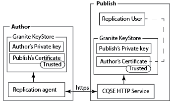
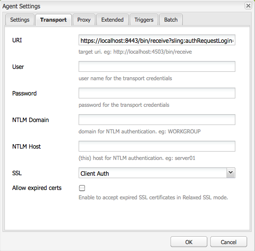

# Replicar usando SSL mutuo{#replicating-using-mutual-ssl}

Configure AEM para que un agente de replicación en la instancia de autor utilice SSL mutuo (MSSL) para conectarse con la instancia de publicación. Con MSSL, el agente de replicación y el servicio HTTP de la instancia de publicación utilizan certificados para autenticarse entre sí.

La configuración de MSSL para la replicación implica realizar los siguientes pasos:

1. Cree u obtenga claves y certificados privados para las instancias de autor y publicación.
1. Instale las claves y los certificados en las instancias de autor y publicación:

   * Autor: Clave privada del autor y certificado de publicación.
   * Publicación: Clave privada de Publish y certificado de Autor. El certificado está asociado a la cuenta de usuario autenticada con el agente de replicación.

1. Configure el servicio HTTP basado en Jetty en la instancia de publicación.
1. Configure las propiedades de transporte y SSL del agente de replicación.



Debe determinar qué cuenta de usuario está realizando la replicación. Al instalar el certificado de autor de confianza en la instancia de publicación, el certificado se asocia a esta cuenta de usuario.

## Obtención o creación de credenciales para MSSL {#obtaining-or-creating-credentials-for-mssl}

Se requiere una clave privada y un certificado público para las instancias de autor y publicación:

* Las claves privadas deben estar contenidas en formato pkcs#12 o JKS.
* Los certificados deben estar contenidos en formato pkcs#12 o JKS. Además, el certificado contenido en formato &quot;CER&quot; también se puede añadir a Granite Truststore.
* Los certificados pueden ser autofirmados o firmados por una entidad emisora de certificados reconocida.

### Formato JKS {#jks-format}

Genere una clave privada y un certificado en formato JKS. La clave privada se almacena en un archivo KeyStore y el certificado se almacena en un archivo TrustStore. Utilice [Java `keytool`](https://docs.oracle.com/javase/7/docs/technotes/tools/solaris/keytool.html) para crear ambos.

Realice los siguientes pasos utilizando Java `keytool` para crear la clave privada y la credencial:

1. Genere un par de clave pública-privada en un KeyStore.
1. Cree u obtenga el certificado:

   * Autofirmado: Exporte el certificado desde KeyStore.
   * Firmado por CA: Genere una solicitud de certificado y envíela a la CA.

1. Importe el certificado en TrustStore.

Utilice el siguiente procedimiento para crear una clave privada y un certificado autofirmado para las instancias de autor y publicación. Utilice valores diferentes para las opciones de comando según corresponda.

1. Abra una ventana o terminal de línea de comandos. Para crear el par de clave pública-privada, introduzca el siguiente comando, utilizando los valores de opción de la siguiente tabla:

   ```shell
   keytool -genkeypair -keyalg RSA -validity 3650 -alias alias -keystore keystorename.keystore  -keypass key_password -storepass  store_password -dname "CN=Host Name, OU=Group Name, O=Company Name,L=City Name, S=State, C=Country_ Code"
   ```

   | Opción | Autor | Publicación |
   |---|---|---|
   | -alias | author | instancias de publicación |
   | -keystore | author.keystore | publish.keystore |

1. Para exportar el certificado, introduzca el siguiente comando utilizando valores de opción de la siguiente tabla:

   ```shell
   keytool -exportcert -alias alias -file cert_file -storetype jks -keystore keystore -storepass store_password
   ```

   | Opción | Autor | Publicación |
   |---|---|---|
   | -alias | author | instancias de publicación |
   | -file | author.cer | publish.cer |
   | -keystore | author.keystore | publish.keystore |

### pkcs#12 Formato {#pkcs-format}

Genere una clave privada y un certificado en formato pkcs#12. Utilice [openSSL](https://www.openssl.org/) para generarlos. Utilice el siguiente procedimiento para generar una clave privada y una solicitud de certificado. Para obtener el certificado, firme la solicitud con la clave privada (certificado autofirmado) o envíe la solicitud a una entidad emisora de certificados. A continuación, genere el archivo pkcs#12 que contiene la clave privada y el certificado.

1. Abra una ventana o terminal de línea de comandos. Para crear la clave privada, introduzca el siguiente comando, utilizando los valores de opción de la siguiente tabla:

   ```shell
   openssl genrsa -out keyname.key 2048
   ```

   | Opción | Autor | Publicación |
   |---|---|---|
   | -out | author.key | publish.key |

1. Para generar una solicitud de certificado, introduzca el siguiente comando, utilizando los valores de opción de la siguiente tabla:

   ```shell
   openssl req -new -key keyname.key -out key_request.csr
   ```

   | Opción | Autor | Publicación |
   |---|---|---|
   | -key | author.key | publish.key |
   | -out | author_request.csr | publish_request.csr |

   Firme la solicitud de certificado o envíe la solicitud a una entidad emisora de certificados.

1. Para firmar la solicitud de certificado, introduzca el siguiente comando, utilizando los valores de opción de la siguiente tabla:

   ```shell
   openssl x509 -req -days 3650 -in key_request.csr -signkey keyname.key -out certificate.cer
   ```

   | Opción | Autor | Publicación |
   |---|---|---|
   | -signkey | author.key | publish.key |
   | -en | author_request.csr | publish_request.csr |
   | -out | author.cer | publish.cer |

1. Para añadir la clave privada y el certificado firmado a un archivo pkcs#12, introduzca el siguiente comando, utilizando los valores de opción de la siguiente tabla:

   ```shell
   openssl pkcs12 -keypbe PBE-SHA1-3DES -certpbe PBE-SHA1-3DES -export -in certificate.cer -inkey keyname.key -out pkcs12_archive.pfx -name "alias"
   ```

   | Opción | Autor | Publicación |
   |---|---|---|
   | -inkey | author.key | publish.key |
   | -out | author.pfx | publish.pfx |
   | -en | author.cer | publish.cer |
   | -name | author | instancias de publicación |

## Instale la clave privada y TrustStore en Author {#install-the-private-key-and-truststore-on-author}

Instale los siguientes elementos en la instancia de autor:

* La clave privada de la instancia de autor.
* Certificado de la instancia de publicación.

Para realizar el siguiente procedimiento, debe iniciar sesión como administrador de la instancia de autor.

### Instale la clave privada del autor {#install-the-author-private-key}

1. Abra la página Administración de usuarios para la instancia de autor. ([http://localhost:4502/libs/granite/security/content/useradmin.html](http://localhost:4502/libs/granite/security/content/useradmin.html))
1. Para abrir las propiedades de su cuenta de usuario, toque o haga clic en su nombre de usuario.
1. Si el vínculo Crear almacén de claves aparece en el área Configuración de la cuenta , haga clic en el vínculo . Configure una contraseña y haga clic en Aceptar.
1. En el área Configuración de la cuenta , haga clic en Administrar almacén de claves.

   

1. Haga Clic En Agregar Clave Privada Del Archivo Almacén De Claves.

   

1. Haga clic en Seleccionar archivo de almacén de claves y, a continuación, busque y seleccione el archivo author.keystore o el archivo author.pfx si utiliza pkcs#12 y, a continuación, haga clic en Abrir.
1. Introduzca un alias y la contraseña para el almacén de claves. Introduzca el alias y la contraseña de la clave privada y haga clic en Enviar.
1. Cierre el cuadro de diálogo Administración de KeyStore.

   

### Instalación del certificado de publicación {#install-the-publish-certificate}

1. Abra la página Administración de usuarios para la instancia de autor. ([http://localhost:4502/libs/granite/security/content/useradmin.html](http://localhost:4502/libs/granite/security/content/useradmin.html))
1. Para abrir las propiedades de su cuenta de usuario, toque o haga clic en su nombre de usuario.
1. Si el vínculo Crear TrustStore aparece en el área Configuración de la cuenta, haga clic en el vínculo, cree una contraseña para TrustStore y haga clic en Aceptar.
1. En el área Configuración de la cuenta, haga clic en Administrar TrustStore.
1. Haga clic en Agregar certificado desde el archivo CER.

   

1. Desactive la opción Asignar certificado a usuario . Haga clic en Seleccionar archivo de certificado, seleccione publish.cer y haga clic en Abrir.
1. Cierre el cuadro de diálogo Administración de TrustStore.

   

## Instalar Clave privada y TrustStore en Publish {#install-private-key-and-truststore-on-publish}

Instale los siguientes elementos en la instancia de publicación:

* La clave privada de la instancia de publicación.
* Certificado de la instancia de autor. Asocie el certificado al usuario que se utiliza para ejecutar solicitudes de replicación.

Para realizar el siguiente procedimiento, debe iniciar sesión como administrador de la instancia de publicación.

### Instalar la clave privada de publicación {#install-the-publish-private-key}

1. Abra la página Administración de usuarios para la instancia de publicación. ([http://localhost:4503/libs/granite/security/content/useradmin.html](http://localhost:4503/libs/granite/security/content/useradmin.html))
1. Para abrir las propiedades de su cuenta de usuario, toque o haga clic en su nombre de usuario.
1. Si el vínculo Crear almacén de claves aparece en el área Configuración de la cuenta , haga clic en el vínculo . Configure una contraseña y haga clic en Aceptar.
1. En el área Configuración de la cuenta , haga clic en Administrar almacén de claves.
1. Haga Clic En Agregar Clave Privada Del Archivo Almacén De Claves.
1. Haga clic en Seleccionar archivo de almacén de claves y, a continuación, busque y seleccione el archivo publish.keystore o el archivo publish.pfx si utiliza pkcs#12 y, a continuación, haga clic en Abrir.
1. Introduzca un alias y la contraseña para el almacén de claves. Introduzca el alias y la contraseña de la clave privada y haga clic en Enviar.
1. Cierre el cuadro de diálogo Administración de KeyStore.

### Instale el certificado de autor {#install-the-author-certificate}

1. Abra la página Administración de usuarios para la instancia de publicación. ([http://localhost:4503/libs/granite/security/content/useradmin.html](http://localhost:4503/libs/granite/security/content/useradmin.html))
1. Busque la cuenta de usuario que utiliza para ejecutar solicitudes de replicación y toque o haga clic en el nombre de usuario.
1. Si el vínculo Crear TrustStore aparece en el área Configuración de la cuenta, haga clic en el vínculo, cree una contraseña para TrustStore y haga clic en Aceptar.
1. En el área Configuración de la cuenta, haga clic en Administrar TrustStore.
1. Haga clic en Agregar certificado desde el archivo CER.
1. Asegúrese de que la opción Asignar certificado a usuario está seleccionada. Haga clic en Seleccionar archivo de certificado, seleccione author.cer y haga clic en Abrir.
1. Haga clic en Enviar y cierre el cuadro de diálogo Administración de TrustStore.

## Configuración del servicio HTTP en Publish {#configure-the-http-service-on-publish}

Configure las propiedades del servicio HTTP basado en Apache Felix Jetty en la instancia de publicación para que utilice HTTPS al acceder a Granite Keystore. El PID del servicio es `org.apache.felix.http`.

En la tabla siguiente se enumeran las propiedades de OSGi que debe configurar si utiliza la consola web.

| Nombre de propiedad en la consola web | Nombre de propiedad OSGi | Value |
|---|---|---|
| Habilitar HTTPS | org.apache.felix.https.enable | verdadero |
| Habilitar HTTPS para utilizar Granite KeyStore | org.apache.felix.https.use.granite.keystore | verdadero |
| Puerto HTTPS | org.osgi.service.http.port.secure | 8443 (u otro puerto deseado) |
| Certificado de cliente | org.apache.felix.https.clientcertificate | &quot;Certificado de cliente deseado&quot; |

## Configurar el agente de replicación en el autor {#configure-the-replication-agent-on-author}

Configure el agente de replicación en la instancia de autor para que utilice el protocolo HTTPS al conectarse a la instancia de publicación. Para obtener información completa sobre la configuración de agentes de replicación, consulte [Configuración de agentes de replicación](/help/sites-deploying/replication.md#configuring-your-replication-agents).

Para habilitar MSSL, configure las propiedades en la ficha Transporte según la siguiente tabla:

<table>
 <tbody>
  <tr>
   <th>Propiedad</th>
   <th>Valor</th>
  </tr>
  <tr>
   <td>URI</td>
   <td><p>https://server_name:SSL_port/bin/receive?sling:authRequestLogin=1</p> <p>Por ejemplo:</p> <p>http://localhost:8443/bin/receive?sling:authRequestLogin=1</p> </td>
  </tr>
  <tr>
   <td>Usuario</td>
   <td>Sin valor</td>
  </tr>
  <tr>
   <td>Contraseña</td>
   <td>Sin valor</td>
  </tr>
  <tr>
   <td>SSL</td>
   <td>Autenticación de cliente</td>
  </tr>
 </tbody>
</table>



Después de configurar el agente de replicación, pruebe la conexión para determinar si MSSL está configurado correctamente.

```xml
29.08.2014 14:02:46 - Create new HttpClient for Default Agent
29.08.2014 14:02:46 - * HTTP Version: 1.1
29.08.2014 14:02:46 - * Using Client Auth SSL configuration *
29.08.2014 14:02:46 - adding header: Action:Test
29.08.2014 14:02:46 - adding header: Path:/content
29.08.2014 14:02:46 - adding header: Handle:/content
29.08.2014 14:02:46 - deserialize content for delivery
29.08.2014 14:02:46 - No message body: Content ReplicationContent.VOID is empty
29.08.2014 14:02:46 - Sending POST request to http://localhost:8443/bin/receive?sling:authRequestLogin=1
29.08.2014 14:02:46 - sent. Response: 200 OK
29.08.2014 14:02:46 - ------------------------------------------------
29.08.2014 14:02:46 - Sending message to localhost:8443
29.08.2014 14:02:46 - >> POST /bin/receive HTTP/1.0
29.08.2014 14:02:46 - >> Action: Test
29.08.2014 14:02:46 - >> Path: /content
29.08.2014 14:02:46 - >> Handle: /content
29.08.2014 14:02:46 - >> Referer: about:blank
29.08.2014 14:02:46 - >> Content-Length: 0
29.08.2014 14:02:46 - >> Content-Type: application/octet-stream
29.08.2014 14:02:46 - --
29.08.2014 14:02:46 - << HTTP/1.1 200 OK
29.08.2014 14:02:46 - << Connection: Keep-Alive
29.08.2014 14:02:46 - << Server: Day-Servlet-Engine/4.1.64
29.08.2014 14:02:46 - << Content-Type: text/plain;charset=utf-8
29.08.2014 14:02:46 - << Content-Length: 26
29.08.2014 14:02:46 - << Date: Fri, 29 Aug 2014 18:02:46 GMT
29.08.2014 14:02:46 - << Set-Cookie: login-token=3529326c-1500-4888-a4a3-93d299726f28%3ac8be86c6-04bb-4d18-80d6-91278e08d720_98797d969258a669%3acrx.default; Path=/; HttpOnly; Secure
29.08.2014 14:02:46 - << Set-Cookie: cq-authoring-mode=CLASSIC; Path=/; Secure
29.08.2014 14:02:46 - <<
29.08.2014 14:02:46 - << R
29.08.2014 14:02:46 - << eplicationAction TEST ok.
29.08.2014 14:02:46 - Message sent.
29.08.2014 14:02:46 - ------------------------------------------------
29.08.2014 14:02:46 - Replication (TEST) of /content successful.
Replication test succeeded
```

