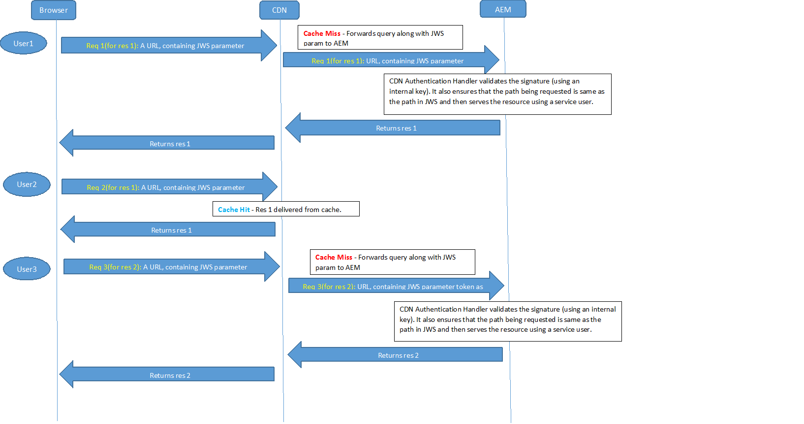

# Configuración de OSGi{#osgi-configuration-settings}

[](https://www.osgi.org/) OSGi es un elemento fundamental en la pila de AEM de tecnología. Se utiliza para controlar los paquetes compuestos de AEM y su configuración.

OSGi &quot;*proporciona los primitivos estandarizados que permiten que las aplicaciones se construyan a partir de componentes pequeños, reutilizables y de colaboración. Estos componentes se pueden componer en una aplicación e implementar*&quot;.

Esto permite administrar fácilmente los paquetes, ya que se pueden detener, instalar e iniciar individualmente. Las interdependencias se gestionan automáticamente. Cada componente OSGi (consulte la [Especificación OSGi](https://www.osgi.org/Specifications/HomePage)) está contenido en uno de los distintos paquetes. Al trabajar con AEM existen varios métodos para administrar los parámetros de configuración de dichos paquetes; consulte [Configuración de OSGi](/help/sites-deploying/configuring-osgi.md) para obtener más detalles y las prácticas recomendadas.

Los siguientes ajustes de configuración OSGi (enumerados según el paquete) son relevantes para la implementación del proyecto. No es necesario realizar ajustes en todos los ajustes de la lista; algunos se mencionan para ayudarle a comprender el funcionamiento de AEM.

>[!CAUTION]
>
>La lista tiene por objeto servir de guía y no es exhaustiva. No todos los paquetes están enumerados, ni todos los parámetros de algunos de los paquetes que están.
>
>La configuración necesaria variará de un proyecto a otro.
>
>Consulte la consola Web para ver los valores utilizados e información detallada sobre los parámetros.

>[!NOTE]
>
>La herramienta Dif de configuración OSGi, que forma parte de las [Herramientas de AEM](https://helpx.adobe.com/experience-manager/kb/tools/aem-tools.html), se puede utilizar para lista de las configuraciones de OSGi predeterminadas.

>[!NOTE]
>
>Es posible que se requieran más paquetes para áreas específicas de funcionalidad dentro de AEM. En estos casos, se pueden encontrar detalles de configuración en la página relacionados con la funcionalidad adecuada.

**AEM** Listener de Eventos de replicaciónConfigure:

* Los **Modos de ejecución**, en los que los eventos de replicación se distribuirán a los oyentes. Por ejemplo, si se define como autor, entonces este es el sistema que &quot;iniciará&quot; la replicación.

* El modo de ejecución **publish** debe agregarse si el código del proyecto procesa eventos de replicación (replicación inversa) en un entorno de publicación. Por ejemplo, cuando el despachante se utiliza para vaciar desde el entorno de publicación o cuando se produce una replicación estándar a otras instancias de publicación.

**AEM** listener de cambio de repositorioConfigure:

* Las **Rutas** ubicaciones para escuchar los eventos del repositorio listos para la distribución.

**Repositorio de cliente Sling de CRX** Configure el acceso al repositorio de contenido subyacente.

* La **Contraseña de administración** debe cambiarse después de la instalación para garantizar la [seguridad](/help/sites-administering/security-checklist.md) de su instancia.
* No deben ser necesarios otros cambios y hay que tener cuidado ya que pueden afectar al acceso al repositorio.

**Wiki Mail** ServiceConfigure los ajustes de correo electrónico para los correos electrónicos enviados por una wiki.

**Apache Felix OSGi Management** ConsoleConfigurar:

* **Complementos**, los elementos de navegación principales (complementos de consola) que estarán disponibles en los elementos de menú de nivel superior  **Apache Felix Web Management** Consoleas. Deshabilite los que no necesite, ya que cada uno requiere espacio y recursos.

>[!CAUTION]
>
>Asegúrese de configurar lo siguiente:
>
>**Nombre de** usuario y  **contraseña**, las credenciales para acceder a la consola de gestión web Apache Felix.
>La contraseña debe cambiarse después de la instalación inicial para garantizar la [seguridad](/help/sites-administering/security-checklist.md) de la instancia.

>[!NOTE]
>
>Esta configuración debe realizarse con la Consola Félix como se necesita al inicio, antes de que el repositorio esté disponible.

**Apache Sling Customizable Request Data** LoggerConfigurar:

* **Nombre del** registrador y  **Formato del** registro para configurar la ubicación y el formato de registro de solicitud y acceso (predeterminado:  `request.log`). Este archivo de registro es esencial para analizar el rendimiento o la funcionalidad de depuración relacionados con la cadena web.
Esto se asocia con el [registrador de solicitudes Sling de Apache](#apacheslingrequestlogger).

Para obtener más información, consulte [AEM Logging](/help/sites-deploying/configure-logging.md) y [Sling Logging](https://sling.apache.org/site/logging.html).

**Apache Sling Eventing Thread** PoolConfigurar:

* **Tamaño mínimo** del grupo y Tamaño  **máximo del grupo**, el tamaño del grupo utilizado para mantener los hilos de evento.

* **Tamaño** de cola, el tamaño máximo de la cola de subprocesos si se agota el grupo.
El valor recomendado es `-1`, ya que esto establece la cola en ilimitada; si se establece un límite, pueden producirse pérdidas cuando se supera.

* El cambio de esta configuración puede ayudar al rendimiento en situaciones con un número elevado de eventos; por ejemplo, uso intensivo AEM DAM o Flujo de trabajo.
* Los valores específicos de su escenario deben establecerse mediante pruebas.
* Esta configuración puede afectar al rendimiento de la instancia, por lo que no debe cambiarla sin motivo ni consideración.

**Apache Sling** ServletConfigure algunos aspectos del procesamiento:

* **Auto** Indexate para habilitar/deshabilitar el procesamiento de directorios para la exploración.
* **Habilite**  (o deshabilite) las representaciones predeterminadas, como  **HTML**,  **texto** sin formato,  **** JSON o  **XML**.
No debe deshabilitar JSON.

>[!NOTE]
>
>Esta configuración se configura automáticamente para instancias de producción si ejecuta AEM en [Modo listo para producción](/help/sites-administering/production-ready.md).

**Apache Sling Java Script** HandlerConfigure las opciones para la compilación de archivos .java como secuencias de comandos (servlets).

Ciertos ajustes pueden afectar al rendimiento, por lo que deben deshabilitarse siempre que sea posible, en particular para una instancia de producción.

* S **VM de origen** y **VM de Destinatario**, definen la versión de JDK como la que se usa como JVM de tiempo de ejecución

* para instancias de producción:

   * deshabilitar **Generar información de depuración**

**Apache Sling JCR** InstallerEs probable que estos parámetros no requieran configuración, pero pueden ser útiles para saber al desarrollar o depurar. Por ejemplo, las carpetas de instalación pueden ser útiles para desproteger o crear un paquete.

* **Nombre de las carpetas de instalación** regexpandir  **Máxima profundidad de jerarquía de las carpetas**  de instalación: especifique dónde y a qué profundidad se buscan los recursos para instalar. Cuando se utiliza un comodín (como en .*/install) se buscarán todas las coincidencias apropiadas, por ejemplo, `/libs/sling/install` y `/libs/cq/core/install`.

* **Ruta** de búsqueda, lista de rutas que jcrinstall busca recursos que instalar, junto con un número que indica el factor de ponderación de esa ruta.

**Apache Sling Job** HandlerConfigurar parámetros que gestionen la programación de trabajos:

* **Intervalo** de reintento,  **Reintentos** máximos,  **Número máximo de trabajos** paralelos, Tiempo **de espera de** reconocimiento, entre otros.

* Cambiar esta configuración puede mejorar el rendimiento en situaciones con un número elevado de trabajos; por ejemplo, uso intensivo de AEM DAM y Flujos de trabajo.
* Los valores específicos de su escenario deben establecerse mediante pruebas.
* No cambie esta configuración sin motivo, solo la tendrá debidamente en cuenta.

**Apache Sling JSP Script** HandlerConfigure los ajustes relevantes del rendimiento para el controlador de secuencias de comandos JSP. Para mejorar el rendimiento, debe deshabilitar tanto como sea posible.

En particular para los casos de producción:

* deshabilitar **Generar información de depuración**
* deshabilitar **Mantener Java generado**
* deshabilitar **Contenido asignado**
* deshabilitar **Mostrar fragmentos de origen**

>[!NOTE]
>
>Esta configuración se configura automáticamente para instancias de producción si ejecuta AEM en [Modo listo para producción](/help/sites-administering/production-ready.md).

**Configuración** de registro de Apache SlingConfigure:

* **Log** Leveland  **Log File**, para definir la ubicación y el nivel de registro de la configuración de registro central (error.log). El nivel se puede establecer en uno de `DEBUG`, `INFO`, `WARN`, `ERROR` y `FATAL`.

* **Número de** archivos de registro y  **de** umbrales de archivo de registro para definir el tamaño y la rotación de versión del archivo de registro.

* **El** patrón de mensajes define el formato de los mensajes de registro.

Para obtener más información, consulte [AEM Logging](/help/sites-deploying/configure-logging.md#global-logging) y [Sling Logging](https://sling.apache.org/site/logging.html).

**Configuración del registrador de registros de Apache Sling (Configuración de fábrica)** Configurar:

* **Nivel** de registro,  **Archivo** de registro y  **Formato de** mensaje para definir detalles del archivo de registro y los mensajes.

* **** Loggto define la categoría; por ejemplo: solo inicie sesión para com.day.cq.

* Al utilizar **Configuraciones de fábrica**, se puede agregar cualquier cantidad de configuraciones adicionales para satisfacer los diversos niveles de registro y categorías necesarias.
* Estas configuraciones son útiles durante el desarrollo; por ejemplo, para registrar mensajes de TRACE para un servicio específico en un archivo de registro específico.
* Estas configuraciones son útiles en un entorno de producción; por ejemplo, para que los mensajes sobre un servicio específico se registren en un archivo de registro individual para facilitar la supervisión.

Para obtener más información, consulte [AEM Logging](/help/sites-deploying/configure-logging.md) y [Sling Logging](https://sling.apache.org/site/logging.html).

**Configuración del grabador de registros de Apache Sling (Configuración de fábrica)** Configurar:

* **Archivo de registro** para definir la existencia de un archivo de registro.
* **Número de** archivos de registro para definir la rotación de la versión.

* El escritor puede ser utilizado por una configuración **Apache Sling Logging Logger Configuration**.

* Estas configuraciones son útiles durante el desarrollo; por ejemplo, para registrar mensajes de TRACE para un servicio específico en un archivo de registro específico.
* Estas configuraciones son útiles en un entorno de producción; por ejemplo, para que los mensajes sobre un servicio específico se registren en un archivo de registro individual para facilitar la supervisión.

Para obtener más información, consulte [AEM Logging](/help/sites-deploying/configure-logging.md) y [Sling Logging](https://sling.apache.org/site/logging.html).

**Apache Sling Main** ServletConfigurar:

* **Número de llamadas por** solicitud y  **profundidad de** recursión para proteger el sistema contra recursiones infinitas y llamadas de secuencia de comandos excesivas.

**Apache Sling MIME Type** ServiceConfigurar:

* **Los** tipos MIME para agregar al sistema los requeridos por el proyecto. Esto permite que una solicitud `GET` de un archivo establezca el encabezado de tipo de contenido correcto para vincular el tipo de archivo y la aplicación.

**Apache Sling** Filter (Filtro de Remitente del reenvío Sling de Apache) Para abordar problemas de seguridad conocidos con la falsificación de solicitudes entre sitios (CSRF) en CRX WebDAV y Apache Sling, debe configurar el filtro de Remitente del reenvío.

El servicio de filtro de remitente del reenvío es un servicio OSGi que le permite configurar:

* qué métodos http deben filtrarse
* si se permite un encabezado de remitente del reenvío vacío
* y una lista de servidores que se permitirá además del host del servidor.

Consulte la [Lista de comprobación de seguridad: problemas con la falsificación de solicitudes entre sitios](/help/sites-administering/security-checklist.md#protect-against-cross-site-request-forgery) para obtener más detalles.

>[!NOTE]
>
>El filtro de Remitente del reenvío Apache Sling depende de la instalación de un paquete de correcciones rápidas.

**Apache Sling Request** LoggerConfigurar:

* varios parámetros para definir cómo se registran las solicitudes.
* **Habilite Registro** de solicitudes para habilitar o deshabilitar.

* **Habilite el registro** de acceso para habilitar o deshabilitar.

Esto se asocia con el [Registrador de datos de solicitud personalizable de Apache Sling](#apacheslingcustomizablerequestdatalogger).

Para obtener más información, consulte [AEM Logging](/help/sites-deploying/configure-logging.md) y [Sling Logging](https://sling.apache.org/site/logging.html).

**Apache Sling Resource Resolver** FactoryConfigure los aspectos centrales de la resolución de recursos Sling:

* **Ruta**(s) de búsqueda de recursos, agregue cualquier ruta específica del proyecto (pero no elimine  `/libs` ni  `/apps`).

* **Direcciones** URL virtuales para definir las asignaciones de URL personales.

* **Asignaciones** de URL para definir cualquier alias; por ejemplo de  `/content` a  `/`.

* **Ubicación** de asignación, la configuración del asignador se externaliza en  `/etc/map`.

* Utilice la instalación local (por ejemplo, utilice `https://localhost:4502/system/console/jcrresolver`) para determinar qué Resolver recursos está activo.

Para obtener más información, consulte: [https://cwiki.apache.org/confluence/display/SLING/Flexible+Resource+Resolution](https://cwiki.apache.org/confluence/display/SLING/Flexible+Resource+Resolution).

>[!CAUTION]
>
>En particular, estas opciones deben configurarse en el repositorio.
>
>De lo contrario, los cambios realizados en **URL Mappings** mediante la consola Felix podrían ser sobrescritos por AEM al siguiente inicio.

**Servidor Apache Sling/Script Resolver y** controlador de erroresEl servlet Sling y la resolución de secuencias de comandos tienen varias tareas:

1. Se utiliza como `ServletResolver` para seleccionar el Servlet o la secuencia de comandos que llamar para gestionar la solicitud.

1. Actúa como `SlingScriptResolver`.

1. Administra la gestión de errores implementando la interfaz `ErrorHandler` utilizando el mismo algoritmo para seleccionar servlets y secuencias de comandos de gestión de errores que se utiliza para resolver servlets y secuencias de comandos de procesamiento de solicitudes.

Se pueden definir varios parámetros, entre ellos:

* **Execution** Pathslifica las rutas para buscar scripts ejecutables; al configurar rutas específicas, puede limitar qué secuencias de comandos se pueden ejecutar. Si no hay ninguna ruta configurada, se utiliza la ruta predeterminada ( `/` = raíz), esto permite la ejecución de todas las secuencias de comandos.
Si un valor de ruta configurado termina con una barra diagonal, se buscará en todo el subárbol. Sin esta barra final, la secuencia de comandos solo se ejecutará si es una coincidencia exacta.

* **Usuario**  de secuencia de comandos: esta propiedad opcional puede especificar la cuenta de usuario del repositorio utilizada para leer las secuencias de comandos. Si no se especifica ninguna cuenta, el usuario `admin` se utiliza de forma predeterminada.

* **Extensiones predeterminadas** La lista de extensiones para las que se utilizará el comportamiento predeterminado. Esto significa que el último segmento de ruta del tipo de recurso se puede utilizar como nombre de secuencia de comandos.

**Day Commons GFX Font** HelperAl procesar gráficos puede utilizar DrawText para incrustar texto. Para ello, también puede instalar sus propias fuentes:

* Defina la **Ruta de fuente** que se buscará para las fuentes específicas del proyecto.
Por ejemplo, `/apps/myapp/fonts`.

**Configuración proxy** de componentes HTTP ApacheConfiguración proxy para todo el código que utiliza el cliente HTTP Apache, que se utiliza cuando se realiza un HTTP; por ejemplo, al realizar la replicación.

Al crear una nueva configuración, no realice cambios en la configuración de fábrica sino que cree una nueva configuración de fábrica para este componente mediante el administrador de configuración disponible aquí: **https://localhost:4502/system/console/configMgr/**. La configuración proxy está disponible en **org.apache.http.proxyconfigurator.**

>[!NOTE]
>
>En AEM 6.0 y versiones anteriores proxy se configuró en Day Commons HTTP Client. A partir de las versiones AEM 6.1 y posteriores, la configuración proxy se ha trasladado a la configuración &quot;Apache HTTP Components Proxy Configuration&quot; en lugar de la configuración &#39;Day Commons HTTP Client&#39;.

**Day CQ** AntispamConfigure el servicio antispam (Akismet) utilizado. Esto requiere que registre:

* **Proveedor**
* **Clave de API**
* **URL registrada**

**Adobe Granite HTML Library** ManagerConfigure esto para controlar el manejo de las bibliotecas de cliente (css o js); incluyendo, por ejemplo, cómo se ve la estructura subyacente.

* Para instancias de producción:

   * habilite **Minificar** (para eliminar caracteres de CRLF y de espacio en blanco).
   * habilite **Gzip** (para permitir que se comprueben los archivos y se acceda a ellos con una solicitud).
   * deshabilitar **Depurar**
   * deshabilitar **Temporización**

* Para el desarrollo de JS (especialmente al depurar/depurar):

   * deshabilitar **Minify**
   * habilite **Depurar** para separar los archivos para depurarlos y usarlos con firebug.
   * habilite **Temporización** en caso de interés en temporización.
   * habilite la consola **Depurar** para ver los mensajes de registro de la consola JS.

>[!CAUTION]
>
>Al cambiar la configuración para **Minify** o **Gzip** también deberá eliminar el contenido de `/var/clientlibs`. Esta es una versión en caché de clientlibs y se volverá a crear cuando se solicite la próxima vez.

>[!NOTE]
>
>Esta configuración se configura automáticamente para instancias de producción si ejecuta AEM en [Modo listo para producción](/help/sites-administering/production-ready.md).

**Controlador de autenticación de encabezado HTTP CQ de díaConfiguración general del** sistema para el método de autenticación básico de la solicitud HTTP.

Al utilizar [grupos de usuarios cerrados](/help/sites-administering/cug.md) puede configurar (entre otros):

* **Dominio HTTP**
* La **Página de inicio de sesión predeterminada**

**Day CQ Link Checker** ServiceCheck y, si es necesario, configure:

* **Planificador** Periodo para definir el intervalo en el que se comprobarán automáticamente los vínculos externos.

* Marque **Intervalo de tolerancia de vínculo incorrecto** para el período después del cual un vínculo externo no exitoso se considera malo.
* **Patrones** de anulación de comprobación de vínculos para definir las rutas que se excluirán de la comprobación de vínculos.

**Day CQ Link Checker** TaskConfiguración de una sola tarea de comprobación de vínculos (una tarea que comprueba un vínculo externo):

* Compruebe los intervalos definidos en **Intervalo de prueba de vínculo bueno** y **Intervalo de prueba de vínculo incorrecto**

* Los distintos parámetros relacionados con los proxies para el acceso a Internet y NTLM necesarios para el acceso externo al comprobar un vínculo.

**Day CQ Mail** ServiceConfigure el nombre de host y los detalles de acceso para el servidor de correo. Consulte la sección Configuración del servicio de correo.

**Newsletter de CQ MCM** de díaConfigure los distintos ajustes utilizados con la newsletter.

**Asignación** de raíz de CQ de díaConfigurar:

* **Ruta de destinatario** para definir a dónde se redirigirá una solicitud a &quot;  `/`&quot;.

Hay dos IU disponibles en AEM:

* la IU táctil es la IU estándar
* y la IU clásica depredada sigue funcionando completamente

Con AEM asignación de raíz puede configurar la IU que desea tener como predeterminada para la instancia:

* Para que la IU táctil sea la IU predeterminada, la **Ruta de Destinatario** debe señalar a:

   ```
      /projects.html
   ```

* Para que la IU clásica sea la IU predeterminada, la **Ruta de Destinatario** debe señalar:

   ```
      /welcome.html
   ```

>[!NOTE]
>
>Tras una instalación estándar, la IU táctil es la IU predeterminada.

**Adobe Granite SSO Authentication** HandlerConfigurar el inicio de sesión único (SSO) detalles; estos ajustes suelen ser necesarios en la configuración de creación empresarial, a menudo junto con LDAP.

Hay varias propiedades de configuración disponibles:

* ****
PathPath para el que está activo este controlador de autenticación. Si este parámetro se deja vacío, el controlador de autenticación se desactiva. Por ejemplo, la ruta / hace que el controlador de autenticación se utilice para todo el repositorio.

* **Service**
RankingOSGi El valor de clasificación de servicios de Framework se utiliza para indicar el orden utilizado para llamar a este servicio. Esto es un 
`int` donde los valores más altos designan mayor prioridad.
El valor predeterminado es `0`.

* **Nombres de**
encabezadosLos nombres de los encabezados que pueden contener un ID de usuario.

* **Nombres de**
cookiesLos nombres de las cookies que pueden contener un ID de usuario.

* **Parámetros**
NombresNombre de los parámetros de solicitud que pueden proporcionar el ID de usuario.

* **Mapa del usuarioPara los usuarios seleccionados, el nombre de usuario extraído de la solicitud HTTP se puede reemplazar por otro en el objeto de credenciales.**
La asignación se define aquí. Si el nombre de usuario 
`admin` aparece a ambos lados del mapa, la asignación se ignorará. Tenga en cuenta que el carácter &quot;=&quot; debe tener un carácter de escape con un &quot;\&quot; inicial.

* ****
FormatoIndica el formato en el que se proporciona el ID de usuario. Uso:

   * `Basic` si el ID de usuario está codificado en el formato de autenticación básica HTTP
   * `AsIs` si el ID de usuario se proporciona en texto sin formato o cualquier valor aplicado de expresión normal debe utilizarse tal cual o cualquier expresión normal

**Filtro de depuración de CQ WCM de díaResulta útil cuando se desarrolla, ya que permite el uso de sufijos como ?debug=layout al acceder a una página.** Por ejemplo, https://localhost:4502/cf#/content/geometrixx/en/support.html?debug=layout proporcionará información de diseño que puede ser de interés para el desarrollador.

* Desactívelo en las instancias de producción para garantizar el rendimiento y la seguridad.

**Day CQ WCM** FilterConfigurar:

* **Modo WCM **para definir el modo predeterminado.
* En una instancia de autor, puede ser `edit`, `disable,preview` o `analytics`.
Se puede acceder a los otros modos desde la barra de tareas o se puede usar el sufijo `?wcmmode=disabled` para emular un entorno de producción.

* En una instancia de publicación, esto debe establecerse en `disabled` para garantizar que no se pueda acceder a ningún otro modo.

>[!NOTE]
>
>Esta configuración se configura automáticamente para instancias de producción si ejecuta AEM en [Modo listo para producción](/help/sites-administering/production-ready.md).

**Configurador del comprobador de vínculos de CQ WCM de díaConfigurar:** 

* **Lista de** las configuraciones de reescritura para especificar una lista de ubicaciones para las configuraciones del comprobador de vínculos basado en contenido. Las configuraciones pueden basarse en el modo de ejecución; esto es importante para distinguir entre los entornos de autor y publicación, ya que la configuración del comprobador de vínculos puede diferir.

**Day CQ WCM Page** ProcessorConfigurar:

* **Rutas**, una lista de ubicaciones en las que el sistema escucha las modificaciones de página antes de activar un  `jcr:Event`.

**Adobe** Rastreador de impresiones de páginaPara una instancia de autor, configure:

* **sling.auth.requirements**: establezca el valor de esta propiedad en  `-/libs/wcm/stats/tracker`

>[!CAUTION]
>
>Esta configuración permitirá solicitudes anónimas al servicio de seguimiento.

>[!NOTE]
>
>Consulte [Impresiones de página](/help/sites-deploying/configuring.md#enabling-page-impressions) para obtener más información.

**Estadísticas de página de CQ WCM de díaConfigure una instancia de publicación:** 

* **URL para enviar** datos para configurar la dirección URL utilizada para rastrear las estadísticas de la página (es vital si una solicitud de rastreador pasa por el despachante); por ejemplo, el valor predeterminado es  `https://localhost:4502/libs/wcm/stats/tracker`.

* **La secuencia de comandos de seguimiento** está habilitada para habilitar (  `true`) o deshabilitar (  `false`) la inclusión de la secuencia de comandos de seguimiento en las páginas. El valor predeterminado es `false`.

>[!NOTE]
>
>Consulte [Impresiones de página](/help/sites-deploying/configuring.md#enabling-page-impressions) para obtener más información.

**Day CQ WCM Version** ManagerControle si las versiones se administran en el sistema y cómo se administran:

* **Crear versión en Activación**, habilitada en una instalación estándar
* **Habilitar depuración**

* **Purgar rutas**, las rutas que buscará una acción de búsqueda
* **Rutas** de versiones implícitas, las rutas en las que el control de versiones implícito está activo.

* **Edad** máxima de la versión, la edad máxima (en días) de una versión

* **Número máximo de versiones**, el número máximo de versiones que se deben conservar

Consulte [Depuración de versiones](/help/sites-deploying/version-purging.md) para obtener más información.

**Servicio de notificación por correo electrónico de flujo de trabajo de CQ por díaConfigure la configuración de correo electrónico de las notificaciones enviadas por un flujo de trabajo.** 

**Day CQSE HTTP** ServiceControlar el motor de servlet CQ:

* **NIO para HTTP, **Si se utiliza o no NIO para HTTP. La opción predeterminada es true. Solo se usa si HTTP está habilitado.
* **Tiempo de espera de conexión, **Tiempo de espera de conexión en milisegundos. Esta propiedad se aplica a conexiones HTTP y HTTPS. El valor predeterminado es de 60 segundos.

* **Habilite HTTPS,** esté o no habilitado HTTPS. El valor predeterminado es false.
* **Tiempo de espera** de sesión, duración predeterminada de una sesión HTTP especificada en minutos. Si el tiempo de espera es 0 o menos, las sesiones nunca se agotarán. El valor predeterminado es de 10 minutos.
* **Registro** de depuración, Escribir o no mensajes a nivel DEBUG. El valor predeterminado es false.
* **Tamaño** del búfer de solicitud, Tamaño del búfer para solicitudes en bytes. El valor predeterminado es 8 KB.
* **Número máximo de subprocesos**, número máximo de subprocesos que se utilizarán para gestionar solicitudes. El valor predeterminado es 200.

Las siguientes propiedades solo se aplican si HTTPS está habilitado.

* **Puerto** HTTPS, puerto en el que escuchar la solicitud HTTPS. El valor predeterminado es 433.
* **NIO para HTTPS**, si se debe o no utilizar NIO para HTTP. Valores predeterminados del valor de la propiedad NIO para HTTP.
* **Keystore**, ruta absoluta al almacén de claves para usar con HTTPS. Necesario si HTTPS está habilitado.
* **Contraseña** de Keystore, Contraseña para acceder a Keystore.
* **Alias** de clave, Alias de la clave secreta en Keystore.
* **Contraseña** de clave, Contraseña para desbloquear la clave secreta en Keystore.
* **Certificado** de cliente, requisito para que el cliente proporcione un certificado válido. El valor predeterminado es ninguno.

Consulte también [Activación de HTTP sobre SSL](/help/sites-administering/ssl-by-default.md) para obtener más información sobre las opciones relacionadas con SSL y una descripción completa sobre cómo habilitar HTTPS para CQSE.

**CQ Rewriter HTML Parser Factory**

Controla el analizador de HTML para el reescritor de CQ.

* **Etiquetas adicionales para procesar** : puede agregar o quitar etiquetas HTML para que el analizador las procese. De forma predeterminada, se procesan las etiquetas siguientes: A,IMG,ÁREA,FORMULARIO,BASE,VÍNCULO,SECUENCIA DE COMANDOS,CUERPO,HEAD.
* **Conservar mayúsculas y minúsculas** : de forma predeterminada, el analizador HTML convierte atributos en mayúsculas y minúsculas (por ejemplo, eBay) en minúsculas (por ejemplo, ebay). Puede desactivarlo para conservar los atributos de mayúsculas y minúsculas del camello. Esto resulta útil cuando se utilizan marcos de front-end como Angular 2.

**Day Commons JDBC Connections** PoolConfigure el acceso a una base de datos externa que se utiliza como fuente de contenido.

Se trata de una configuración de fábrica, por lo que se pueden configurar varias instancias.

**Adobe CQ Media DPS Sessions** ServiceGestionar sesiones de DPS para su uso con publicaciones.

En particular, puede definir el `dps.session.service.url.name`: el valor predeterminado es [https://dpsapi2.digitalpublishing.acrobat.com/webservices/sessions](https://dpsapi2.digitalpublishing.acrobat.com/webservices/sessions)

**CDN** RewriterLa comunicación entre AEM y CDN debe garantizarse para que los recursos/binarios se entreguen al usuario final de forma segura. Esto incluye dos tareas:

* Acceso al recurso desde AEM mediante la CDN la primera vez (o después de que caduque en la caché).
* El acceso seguro al recurso almacenado en caché en CDN, ya que una vez que el recurso se haya almacenado en la caché en CDN, la solicitud no se dirigirá a AEM y todos los usuarios que tengan acceso a ese recurso deben ser atendidos desde CDN.

AEM proporciona un reescritor para reescribir las direcciones URL de recursos internos en direcciones URL de CDN externas. Vuelve a escribir los vínculos que se pasarán a la CDN, incluida una firma JWS y un tiempo de caducidad para permitir el acceso seguro al recurso. Esta función se utiliza en instancias de autor.

El flujo total es el siguiente:

1. El usuario se autentica con AEM y solicita una página con recursos.
1. La página solicitada contiene un recurso similar a `/content/dam/geometrixx-media/articles/paladin_trailer.jpg/jcr:content/renditions/cq5dam.thumbnail.319.319.png`
1. Rewriter transforma el vínculo a una URL de CDN que contiene una firma de JWS:
   `CDN_domain/content/dam/geometrixx-media/articles/paladin_trailer.jpg/_jcr_content/renditions/cq5dam.thumbnail.319.319.png?cdn_sign=JWS_SIGNATURE`

1. El navegador del usuario reenvía la solicitud de recurso al servidor CDN
1. CDN debe configurarse para reenviar la solicitud a AEM junto con el parámetro `cdn_sign`.
1. Un controlador de autenticación valida el parámetro `cdn_sign` y devuelve el recurso a CDN, que luego se entrega al usuario

El flujo entre el explorador del usuario, la CDN y la AEM se puede visualizar de la siguiente manera.



>[!NOTE]
>
>Esta función solo está habilitada actualmente para AEM instancias de autor.

**** CDNConfigServiceImplProporciona configuraciones de CDN

La función de reescritura CDN se puede habilitar proporcionando **nombre de dominio de distribución CDN** en la configuración de com.adobe.cq.cdn.rewriter.impl.CDNConfigServiceImpl.

El servicio también contiene otras opciones de configuración como habilitar/deshabilitar la reescritura de CDN, prefijos de ruta para los que se realiza la reescritura de CDN, valores TTL y protocolo (HTTP o HTTPS).

**** CDNRewriterUn reescritor para reescribir direcciones URL de imágenes internas en direcciones URL de CDN

El valor **Atributos de etiqueta** en com.adobe.cq.cdn.rewriter.impl.CDNRewriter se puede definir de modo que solo se vuelvan a escribir los vínculos de imagen selectivos.
