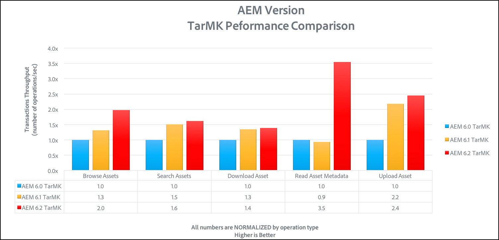
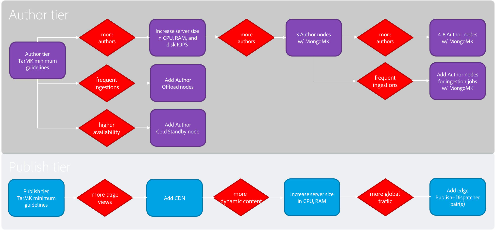

# Directrices de rendimiento{#performance-guidelines}

Esta página proporciona directrices generales sobre cómo optimizar el rendimiento de la implementación de AEM. Si es nuevo en AEM, vaya a las siguientes páginas antes de empezar a leer las directrices de rendimiento:

* [AEM Conceptos básicos](/help/sites-deploying/deploy.md#basic-concepts)
* [Visión General del Almacenamiento de Información en AEM](/help/sites-deploying/storage-elements-in-aem-6.md#overview-of-storage-in-aem)
* [Implementaciones recomendadas](/help/sites-deploying/recommended-deploys.md)
* [Requisitos técnicos](/help/sites-deploying/technical-requirements.md)

A continuación se muestran las opciones de implementación disponibles para AEM (desplácese hasta ver todas las opciones):

<table>
 <tbody>
  <tr>
   <td>
<strong>AEM</strong>
 
<strong>Producto</strong>
 </td>
   <td>
<strong>Topología</strong>
 </td>
   <td>
<strong>Sistema operativo</strong>
 </td>
   <td>
<strong>Servidor de aplicaciones</strong>
 </td>
   <td>
<strong>JRE</strong>
 </td>
   <td>
<strong>Seguridad</strong>
 </td>
   <td>
<strong>Micro Kernel</strong>
 </td>
   <td>
<strong>Almacén de datos</strong>
 </td>
   <td>
<strong>Indexación</strong>
 </td>
   <td>
<strong>Servidor web</strong>
 </td>
   <td>
<strong>Explorador</strong>
 </td>
   <td>
<strong>Marketing Cloud</strong>
 </td>
  </tr>
  <tr>
   <td>
Sites
 </td>
   <td>
No HA
 </td>
   <td>
Windows
 </td>
   <td>
CQSE
 </td>
   <td>
Oracle
 </td>
   <td>
LDAP
 </td>
   <td>
Tar
 </td>
   <td>
Segmento
 </td>
   <td>
Propiedad
 </td>
   <td>
Apache
 </td>
   <td>
Edge
 </td>
   <td>
Destino
 </td>
  </tr>
  <tr>
   <td>
Assets
 </td>
   <td>
Publish-HA
 </td>
   <td>
Solaris
 </td>
   <td>
WebLogic
 </td>
   <td>
IBM
 </td>
   <td>
SAML
 </td>
   <td>
MongoDB
 </td>
   <td>
Archivo
 </td>
   <td>
Lucene
 </td>
   <td>
IIS
 </td>
   <td>
IE
 </td>
   <td>
Análisis
 </td>
  </tr>
  <tr>
   <td>
Communities
 </td>
   <td>
Author-CS
 </td>
   <td>
Red Hat
 </td>
   <td>
WebSphere
 </td>
   <td>
HP
 </td>
   <td>
Oauth
 </td>
   <td>
RDB/Oracle
 </td>
   <td>
S3/Azure
 </td>
   <td>
Solr
 </td>
   <td>
iPlanet
 </td>
   <td>
FireFox
 </td>
   <td>
Campaign
 </td>
  </tr>
  <tr>
   <td>
Forms
 </td>
   <td>
Descarga de autor
 </td>
   <td>
HP-UX
 </td>
   <td>
Tomcat
 </td>
   <td>
 
 </td>
   <td>
 
 </td>
   <td>
RDB/DB2
 </td>
   <td>
MongoDB
 </td>
   <td>
 
 </td>
   <td>
 
 </td>
   <td>
Chrome
 </td>
   <td>
Social
 </td>
  </tr>
  <tr>
   <td>
Móvil
 </td>
   <td>
Author-Cluster
 </td>
   <td>
IBM AIX
 </td>
   <td>
JBoss
 </td>
   <td>
 
 </td>
   <td>
 
 </td>
   <td>
RDB/MySQL
 </td>
   <td>
RDBMS
 </td>
   <td>
 
 </td>
   <td>
 
 </td>
   <td>
Safari
 </td>
   <td>
Audience
 </td>
  </tr>
  <tr>
   <td>
Varios sitios
 </td>
   <td>
ASRP
 </td>
   <td>
SUSE
 </td>
   <td>
 
 </td>
   <td>
 
 </td>
   <td>
 
 </td>
   <td>
RDB/SQLServer
 </td>
   <td>
 
 </td>
   <td>
 
 </td>
   <td>
 
 </td>
   <td>
 
 </td>
   <td>
Recursos
 </td>
  </tr>
  <tr>
   <td>
Comercio
 </td>
   <td>
MSRP
 </td>
   <td>
Apple OS
 </td>
   <td>
 
 </td>
   <td>
 
 </td>
   <td>
 
 </td>
   <td>
 
 </td>
   <td>
 
 </td>
   <td>
 
 </td>
   <td>
 
 </td>
   <td>
 
 </td>
   <td>
Activación
 </td>
  </tr>
  <tr>
   <td>
Dynamic Media
 </td>
   <td>
JSRP
 </td>
   <td>
 
 </td>
   <td>
 
 </td>
   <td>
 
 </td>
   <td>
 
 </td>
   <td>
 
 </td>
   <td>
 
 </td>
   <td>
 
 </td>
   <td>
 
 </td>
   <td>
 
 </td>
   <td>
Móvil
 </td>
  </tr>
  <tr>
   <td>
Brand Portal
 </td>
   <td>
J2E
 </td>
   <td>
 
 </td>
   <td>
 
 </td>
   <td>
 
 </td>
   <td>
 
 </td>
   <td>
 
 </td>
   <td>
 
 </td>
   <td>
 
 </td>
   <td>
 
 </td>
   <td>
 
 </td>
   <td>
 
 </td>
  </tr>
  <tr>
   <td>
AoD
 </td>
   <td>
 
 </td>
   <td>
 
 </td>
   <td>
 
 </td>
   <td>
 
 </td>
   <td>
 
 </td>
   <td>
 
 </td>
   <td>
 
 </td>
   <td>
 
 </td>
   <td>
 
 </td>
   <td>
 
 </td>
   <td>
 
 </td>
  </tr>
  <tr>
   <td>
LiveFile
 </td>
   <td>
 
 </td>
   <td>
 
 </td>
   <td>
 
 </td>
   <td>
 
 </td>
   <td>
 
 </td>
   <td>
 
 </td>
   <td>
 
 </td>
   <td>
 
 </td>
   <td>
 
 </td>
   <td>
 
 </td>
   <td>
 
 </td>
  </tr>
  <tr>
   <td>
Pantallas
 </td>
   <td>
 
 </td>
   <td>
 
 </td>
   <td>
 
 </td>
   <td>
 
 </td>
   <td>
 
 </td>
   <td>
 
 </td>
   <td>
 
 </td>
   <td>
 
 </td>
   <td>
 
 </td>
   <td>
 
 </td>
   <td>
 
 </td>
  </tr>
  <tr>
   <td>
Seguridad del documento
 </td>
   <td>
 
 </td>
   <td>
 
 </td>
   <td>
 
 </td>
   <td>
 
 </td>
   <td>
 
 </td>
   <td>
 
 </td>
   <td>
 
 </td>
   <td>
 
 </td>
   <td>
 
 </td>
   <td>
 
 </td>
   <td>
 
 </td>
  </tr>
  <tr>
   <td>
Mgt de proceso
 </td>
   <td>
 
 </td>
   <td>
 
 </td>
   <td>
 
 </td>
   <td>
 
 </td>
   <td>
 
 </td>
   <td>
 
 </td>
   <td>
 
 </td>
   <td>
 
 </td>
   <td>
 
 </td>
   <td>
 
 </td>
   <td>
 
 </td>
  </tr>
  <tr>
   <td>
Aplicación de escritorio de  
 </td>
   <td>
 
 </td>
   <td>
 
 </td>
   <td>
 
 </td>
   <td>
 
 </td>
   <td>
 
 </td>
   <td>
 
 </td>
   <td>
 
 </td>
   <td>
 
 </td>
   <td>
 
 </td>
   <td>
 
 </td>
   <td>
 
 </td>
  </tr>
 </tbody>
</table>

>[!NOTE]
>
>Las directrices de rendimiento se aplican principalmente a AEM Sites.

## Cuándo utilizar las directrices de rendimiento {#when-to-use-the-performance-guidelines}

Debe utilizar las directrices de rendimiento en las situaciones siguientes:

* **Primera implementación**: Al planificar la implementación de AEM Sites o Assets por primera vez, es importante comprender las opciones disponibles al configurar el micronúcleo, el almacén de nodos y el almacén de datos (en comparación con la configuración predeterminada). Por ejemplo, cambiar la configuración predeterminada del almacén de datos para TarMK al almacén de datos de archivos.
* **Actualización a una nueva versión**: Al actualizar a una nueva versión, es importante comprender las diferencias de rendimiento en comparación con el entorno en ejecución. Por ejemplo, actualizar de AEM 6.1 a 6.2, o de AEM 6.0 CRX2 a 6.2 OAK.
* **El tiempo de respuesta es lento**: Cuando la arquitectura seleccionada de Nodestore no cumple con sus requisitos, es importante comprender las diferencias de rendimiento en comparación con otras opciones de topología. Por ejemplo, implementar TarMK en lugar de MongoMK, o usar un almacén de datos de archivos en lugar de un almacén de datos de Amazon S3 o Microsoft Azure.
* **Adición de más autores**: Cuando la topología TarMK recomendada no cumple los requisitos de rendimiento y el tamaño del nodo Autor ha alcanzado la capacidad máxima disponible, es importante comprender las diferencias de rendimiento en comparación con el uso de MongoMK con tres o más nodos Autor. Por ejemplo, implementar MongoMK en lugar de TarMK.
* **Adición de más contenido**: Cuando la arquitectura del almacén de datos recomendada no cumpla con sus requisitos, es importante comprender las diferencias de rendimiento en comparación con otras opciones del almacén de datos. Ejemplo: uso de Amazon S3 o Microsoft Azure Data Store en lugar de un File Data Store.

## Introducción {#introduction}

Este capítulo ofrece información general sobre la arquitectura de AEM y sus componentes más importantes. También proporciona directrices de desarrollo y describe los escenarios de prueba utilizados en las pruebas de referencia TarMK y MongoMK.

### La plataforma de AEM {#the-aem-platform}

La plataforma AEM consta de los siguientes componentes:

Para obtener más información sobre la plataforma AEM, consulte [Qué es AEM](/help/sites-deploying/deploy.md#what-is-aem).

### La arquitectura de AEM {#the-aem-architecture}

Hay tres componentes básicos importantes para una implementación AEM. La **Instancia de autor** que utilizan los autores, editores y aprobadores de contenido para crear y revisar contenido. Cuando se aprueba el contenido, se publica en un segundo tipo de instancia denominado **Publish Instance** desde donde los usuarios finales acceden a él. El tercer bloque de creación es el **Dispatcher**, que es un módulo que gestiona el almacenamiento en caché y el filtrado de URL y que está instalado en el servidor web. Para obtener más información sobre la arquitectura de AEM, consulte [Escenarios de implementación típicos](/help/sites-deploying/deploy.md#typical-deployment-scenarios).

### Micro kernels {#micro-kernels}

Los microkernels actúan como gestores de persistencia en AEM. Existen tres tipos de microkernels utilizados con AEM: TarMK, MongoDB y Base de Datos Relacional (bajo soporte restringido). Elegir uno que se adapte a sus necesidades depende de la finalidad de la instancia y del tipo de implementación que se esté planteando. Para obtener información adicional sobre Micro Kernels, consulte la página [Implementaciones recomendadas](/help/sites-deploying/recommended-deploys.md).

### Nodestore {#nodestore}

En AEM, los datos binarios se pueden almacenar de forma independiente de los nodos de contenido. La ubicación en la que se almacenan los datos binarios se denomina **Data Store**, mientras que la ubicación de los nodos y propiedades de contenido se denomina **Node Store**.

>[!NOTE]
>
>Adobe recomienda que TarMK sea la tecnología de persistencia predeterminada que utilizan los clientes para las instancias de AEM Author y Publish.

>[!CAUTION]
>
>El Micro Kernel de la Base de Datos Relacional está bajo soporte restringido. Póngase en contacto con [Adobe Customer Care](https://helpx.adobe.com/es/marketing-cloud/contact-support.html) antes de utilizar este tipo de micronúcleo.

### Almacén de datos {#data-store}

Cuando se trata de un gran número de binarios, se recomienda utilizar un almacén de datos externo en lugar de los almacenes de nodos predeterminados para maximizar el rendimiento. Por ejemplo, si el proyecto requiere un gran número de recursos multimedia, almacenarlos en el Archivo o el Almacén de datos de Azure/S3 hará que el acceso a ellos sea más rápido que almacenarlos directamente en un MongoDB.

Para obtener más información sobre las opciones de configuración disponibles, consulte [Configuración de nodos y almacenes de datos](/help/sites-deploying/data-store-config.md).

>[!NOTE]
>
>Adobe recomienda elegir la opción de implementar AEM en Azure o Amazon Web Services (AWS) mediante Adobe Managed Services, donde los clientes se beneficiarán de un equipo que tenga la experiencia y las habilidades de implementar y operar AEM en estos entornos de computación en la nube. Consulte nuestra [documentación adicional sobre Adobe Managed Services](https://www.adobe.com/marketing-cloud/enterprise-content-management/managed-services-cloud-platform.html?aemClk=t).
>
>Para obtener recomendaciones sobre cómo implementar AEM en Azure o AWS, fuera de Adobe Managed Services, le recomendamos encarecidamente que trabaje directamente con el proveedor de la nube o con uno de nuestros socios para admitir la implementación de AEM en el entorno de la nube que elija. El proveedor o socio de nube seleccionado es responsable de las especificaciones de tamaño, el diseño y la implementación de la arquitectura que admitan para satisfacer sus requisitos específicos de rendimiento, carga, escalabilidad y seguridad.
>
>Para obtener más información, consulte también la página [requisitos técnicos](/help/sites-deploying/technical-requirements.md#supported-platforms).

### Búsqueda {#search-features}

En esta sección se enumeran los proveedores de índice personalizados que se utilizan con AEM. Para obtener más información sobre la indexación, consulte [Consultas e indexación de Oak](/help/sites-deploying/queries-and-indexing.md).

>[!NOTE]
>
>Para la mayoría de las implementaciones, Adobe recomienda utilizar el índice de Lucene. Solo debe utilizar Solr para la escalabilidad en implementaciones especializadas y complejas.

### Directrices de desarrollo {#development-guidelines}

Debe desarrollarse para AEM objetivo de **rendimiento y escalabilidad**. A continuación se presentan varias prácticas recomendadas que puede seguir:

**DO**

* Aplicar separación de presentación, lógica y contenido
* Usar API de AEM existentes (por ejemplo: Sling) y herramientas (por ejemplo: Replicación)
* Desarrollo en el contexto del contenido real
* Desarrollo para una capacidad de caché óptima
* Minimizar el número de guardos (por ejemplo: mediante flujos de trabajo transitorios)
* Asegúrese de que todos los puntos finales HTTP sean RESTful.
* Restringir el alcance de la observación JCR
* Tenga en cuenta el subproceso asincrónico

**NO**

* No utilice las API de JCR directamente, si puede
* No cambie /libs, sino que utilice superposiciones
* No utilice consultas siempre que sea posible
* No utilice Sling Bindings para obtener servicios OSGi en el código Java, sino que utilice:

   * @Reference en un componente DS
   * @Inject in a Sling Model
   * sling.getService() en una clase Sightly Use
   * sling.getService() en un JSP
   * a ServiceTracker
   * acceso directo al registro de servicios OSGi

Para obtener más información sobre el desarrollo en AEM, lea [Desarrollo: conceptos básicos](/help/sites-developing/the-basics.md). Para conocer las prácticas recomendadas adicionales, consulte [Prácticas recomendadas de desarrollo](/help/sites-developing/best-practices.md).

### Escenarios de referencia {#benchmark-scenarios}

>[!NOTE]
>
>Todas las pruebas de referencia mostradas en esta página se han realizado en una configuración de laboratorio.

Los escenarios de prueba detallados a continuación se utilizan para las secciones de referencia de los capítulos TarMK, MongoMk y TarMK frente a MongoMk. Para ver qué escenario se utilizó para una prueba de referencia determinada, lea el campo Escenario de la tabla [Especificaciones técnicas](/help/sites-deploying/performance-guidelines.md#tarmk-performance-benchmark).

**Escenario de un solo producto**

AEM Assets:

* Interacciones del usuario: Examinar recursos / Buscar recursos / Descargar recurso / Leer metadatos de recursos / Actualizar metadatos de recursos / Cargar recursos / Ejecutar flujo de trabajo de recursos de carga
* Modo de ejecución: usuarios simultáneos, interacción única por usuario

**Escenario de mezcla de productos**

AEM Sites + Recursos:

* Interacciones de usuario del sitio: Leer página de artículo / Leer página / Crear párrafo / Editar párrafo / Crear página de contenido / Activar página de contenido / Buscar autor
* Interacciones de usuario de recursos: Examinar recursos / Buscar recursos / Descargar recurso / Leer metadatos de recursos / Actualizar metadatos de recursos / Cargar recursos / Ejecutar flujo de trabajo de recursos de carga
* Modo de ejecución: usuarios simultáneos, interacciones mixtas por usuario

**Caso de uso vertical**

Medios:

* Lea Página de artículos (27,4%), Página de lectura (10,9%), Crear sesión (2,6%), Activar página de contenido (1,7%), Crear página de contenido (0,4%), Crear párrafo (4,3%), Editar párrafo (0,9%), Componente de imagen (0,9%), Examinar recursos (20%), Leer metadatos de recursos (8,5%), Descargar recurso (4,2%), Recurso de búsqueda (0,2%), Actualizar metadatos de recursos (2,4%), Cargar recursos (1,2%), Examinar proyectos (4,9%), Leer proyectos (6,6%), Agregar recursos de proyectos (1,2%), Agregar sitios de proyectos (1,2%), Crear proyectos (0,1%), Buscar autores (0,4%)
* Modo de ejecución: usuarios simultáneos, interacciones mixtas por usuario

## TarMK {#tarmk}

Este capítulo ofrece directrices generales de rendimiento para TarMK que especifican los requisitos mínimos de arquitectura y la configuración de configuración. También se proporcionan pruebas de referencia para obtener más aclaraciones.

Adobe recomienda que TarMK sea la tecnología de persistencia predeterminada que utilizan los clientes en todos los casos de implementación, tanto para las instancias de AEM Author como para las de publicación.

Para obtener más información sobre TarMK, consulte [Escenarios de implementación](/help/sites-deploying/recommended-deploys.md#deployment-scenarios) y [Almacenamiento Tar](/help/sites-deploying/storage-elements-in-aem-6.md#tar-storage).

### Directrices de arquitectura mínima de TarMK {#tarmk-minimum-architecture-guidelines}

>[!NOTE]
>
>Las directrices de arquitectura mínimas que se presentan a continuación son para entornos de producción y sitios de alto tráfico. Son **no** las [especificaciones mínimas](/help/sites-deploying/technical-requirements.md#prerequisites) necesarias para ejecutar AEM.

Para establecer un buen rendimiento al utilizar TarMK, debe comenzar desde la siguiente arquitectura:

* Una instancia de autor
* Dos instancias de publicación
* Dos distribuidores

A continuación se ilustran las directrices de arquitectura para AEM sitios y AEM Assets.

>[!NOTE]
>
>La replicación sin binario debe activarse **ON** si se comparte el almacén de datos del archivo.

**Directrices de arquitectura Tar para AEM Sites**

**Directrices de arquitectura Tar para AEM Assets**

### Directrices de configuración de TarMK {#tarmk-settings-guideline}

Para obtener un buen rendimiento, debe seguir las directrices de configuración que se presentan a continuación. Para obtener instrucciones sobre cómo cambiar la configuración, [consulte esta página](https://helpx.adobe.com/experience-manager/kb/performance-tuning-tips.html).

<table>
 <tbody>
  <tr>
   <td><strong>Configuración</strong></td>
   <td><strong>Parámetro</strong></td>
   <td><strong>Value</strong></td>
   <td><strong>Descripción</strong></td>
  </tr>
  <tr>
   <td>Colas de trabajo de Sling</td>
   <td><code>queue.maxparallel</code></td>
   <td>Establezca el valor en la mitad del número de núcleos de CPU. </td>
   <td>De forma predeterminada, el número de subprocesos simultáneos por cola de trabajos es igual al número de núcleos de CPU.</td>
  </tr>
  <tr>
   <td>Cola de flujo de trabajo transitorio de Granite</td>
   <td><code>Max Parallel</code></td>
   <td>Establezca el valor en la mitad del número de núcleos de CPU</td>
   <td> </td>
  </tr>
  <tr>
   <td>Parámetros de JVM</td>
   <td>
<code>Doak.queryLimitInMemory</code>
 
<code>Doak.queryLimitReads</code>
 
<code>Dupdate.limit</code>
 
<code>Doak.fastQuerySize</code>
 </td>
   <td>
500000
 
100 000
 
250000
 
Verdadero
 </td>
   <td>Añada estos parámetros de JVM en el script de inicio de AEM para evitar que las consultas expansivas sobrecarguen los sistemas.</td>
  </tr>
  <tr>
   <td>Configuración del índice Lucene</td>
   <td>
<code>CopyOnRead</code>
 
<code>CopyOnWrite</code>
 
<code>Prefetch Index Files</code>
 </td>
   <td>
Activado
 
Activado
 
Activado
 </td>
   <td>Para obtener más información sobre los parámetros disponibles, consulte <a href="https://jackrabbit.apache.org/oak/docs/query/lucene.html">esta página</a>.</td>
  </tr>
  <tr>
   <td>Almacén de datos = S3 Datastore</td>
   <td>
<code>maxCachedBinarySize</code>
 
<code>cacheSizeInMB</code>
 </td>
   <td>
1048576 (1MB) o menor
 
2-10 % del tamaño máximo de pila
 </td>
   <td>Consulte también <a href="/help/sites-deploying/data-store-config.md#data-store-configurations">Configuraciones del almacén de datos</a>.</td>
  </tr>
  <tr>
   <td>Flujo de trabajo de recursos de actualización de DAM</td>
   <td><code>Transient Workflow</code></td>
   <td>comprobado</td>
   <td>Este flujo de trabajo administra la actualización de recursos.</td>
  </tr>
  <tr>
   <td>Reescritura de metadatos DAM</td>
   <td><code>Transient Workflow</code></td>
   <td>comprobado</td>
   <td>Este flujo de trabajo administra XMP reescritura al binario original y establece la última fecha de modificación en JCR.</td>
  </tr>
 </tbody>
</table>

### Referencia de rendimiento de TarMK {#tarmk-performance-benchmark}

#### Especificaciones técnicas {#technical-specifications}

Los ensayos de referencia se realizaron con las siguientes especificaciones:

|  | **Nodo de autor** |
|---|---|
| Servidor | Hardware de metal desnudo (HP) |
| Sistema operativo | RedHat Linux |
| CPU / núcleos | CPU Intel(R) Xeon(R) E5-2407 @2,40GHz, 8 núcleos |
| RAM | 32 GB |
| Disco | Magnético |
| Java | Oracle JRE versión 8 |
| JVM Heap | 16 GB |
| Producto | AEM 6.2 |
| Nodestore | TarMK |
| Almacén de datos | Archivo DS |
| Situación | Un solo producto: Recursos / 30 subprocesos simultáneos |

#### Resultados de referencia de rendimiento {#performance-benchmark-results}

>[!NOTE]
>
>Los números presentados a continuación se han normalizado a 1 como referencia y no son los números de rendimiento reales.

 

## MongoMK {#mongomk}

La razón principal para elegir el backend de persistencia MongoMK sobre TarMK es escalar las instancias horizontalmente. Esto significa tener dos o más instancias de autor activas ejecutándose en todo momento y utilizando MongoDB como sistema de almacenamiento de persistencia. La necesidad de ejecutar más de una instancia de autor se debe en general al hecho de que la capacidad de CPU y memoria de un solo servidor, que admite todas las actividades de creación concurrentes, ya no es sostenible.

Para obtener más información sobre TarMK, consulte [Situaciones de implementación](/help/sites-deploying/recommended-deploys.md#deployment-scenarios) y [Almacenamiento de Mongo](/help/sites-deploying/storage-elements-in-aem-6.md#mongo-storage).

### Directrices de arquitectura mínima de MongoMK {#mongomk-minimum-architecture-guidelines}

Para establecer un buen rendimiento al utilizar MongoMK, debe comenzar desde la siguiente arquitectura:

* Tres instancias de autor
* Dos instancias de publicación
* Tres instancias de MongoDB
* Dos distribuidores

>[!NOTE]
>
>En entornos de producción, MongoDB siempre se utilizará como conjunto de réplicas con un primario y dos secundarios. Las lecturas y escrituras van a la primaria y las lecturas pueden ir a las secundarias. Si el almacenamiento no está disponible, una de las secundarias puede reemplazarse por un árbitro, pero los conjuntos de réplicas de MongoDB siempre deben estar compuestos por un número impar de instancias.

>[!NOTE]
>
>La replicación sin binario debe activarse **ON** si se comparte el almacén de datos del archivo.

### Directrices de configuración de MongoMK {#mongomk-settings-guidelines}

Para obtener un buen rendimiento, debe seguir las directrices de configuración que se presentan a continuación. Para obtener instrucciones sobre cómo cambiar la configuración, [consulte esta página](https://helpx.adobe.com/experience-manager/kb/performance-tuning-tips.html).

<table>
 <tbody>
  <tr>
   <td><strong>Configuración</strong></td>
   <td><strong>Parámetro</strong></td>
   <td><strong>Value (predeterminado)</strong></td>
   <td><strong>Descripción</strong></td>
  </tr>
  <tr>
   <td>Colas de trabajo de Sling</td>
   <td><code>queue.maxparallel</code></td>
   <td>Establezca el valor en la mitad del número de núcleos de CPU. </td>
   <td>De forma predeterminada, el número de subprocesos simultáneos por cola de trabajos es igual al número de núcleos de CPU.</td>
  </tr>
  <tr>
   <td>Cola de flujo de trabajo transitorio de Granite</td>
   <td><code>Max Parallel</code></td>
   <td>Establezca el valor en la mitad del número de núcleos de CPU.</td>
   <td> </td>
  </tr>
  <tr>
   <td>Parámetros de JVM</td>
   <td>
<code>Doak.queryLimitInMemory</code>
 
<code>Doak.queryLimitReads</code>
 
<code>Dupdate.limit</code>
 
<code>Doak.fastQuerySize</code>
 
<code>Doak.mongo.maxQueryTimeMS</code>
 </td>
   <td>
500000
 
100 000
 
250000
 
Verdadero
 
60000
 </td>
   <td>Añada estos parámetros de JVM en el script de inicio de AEM para evitar que las consultas expansivas sobrecarguen los sistemas.</td>
  </tr>
  <tr>
   <td>Configuración del índice Lucene</td>
   <td>
<code>CopyOnRead</code>
 
<code>CopyOnWrite</code>
 
<code>Prefetch Index Files</code>
 </td>
   <td>
Activado
 
Activado
 
Activado
 </td>
   <td>Para obtener más información sobre los parámetros disponibles, consulte <a href="https://jackrabbit.apache.org/oak/docs/query/lucene.html">esta página</a>.</td>
  </tr>
  <tr>
   <td>Almacén de datos = S3 Datastore</td>
   <td>
<code>maxCachedBinarySize</code>
 
<code>cacheSizeInMB</code>
 </td>
   <td>
1048576 (1MB) o menor
 
2-10 % del tamaño máximo de pila
 </td>
   <td>Consulte también <a href="/help/sites-deploying/data-store-config.md#data-store-configurations">Configuraciones del almacén de datos</a>.</td>
  </tr>
  <tr>
   <td>DocumentNodeStoreService</td>
   <td>
<code>cache</code>
 
<code>nodeCachePercentage</code>
 
<code>childrenCachePercentage</code>
 
<code>diffCachePercentage</code>
 
<code>docChildrenCachePercentage</code>
 
<code>prevDocCachePercentage</code>
 
<code>persistentCache</code>
 </td>
   <td>
2048
 
35 (25)
 
20 (10)
 
30 5)
 
10 3)
 
4 (4)
 
./cache,size=2048,binario=0,-compacto,-compress
 </td>
   <td>
El tamaño predeterminado de la caché se establece en 256 MB.
 
Tiene impacto en el tiempo que se tarda en realizar la invalidación de caché.
 </td>
  </tr>
  <tr>
   <td>oak-observation</td>
   <td>
<code>thread pool</code>
 
<code>length</code>
 </td>
   <td>
min &amp; max = 20
 
50000
 </td>
   <td> </td>
  </tr>
 </tbody>
</table>

### Referencia de rendimiento de MongoMK {#mongomk-performance-benchmark}

### Especificaciones técnicas {#technical-specifications-1}

Los ensayos de referencia se realizaron con las siguientes especificaciones:

|  | **Nodo de creación** | **Nodo MongoDB** |
|---|---|---|
| Servidor | Hardware de metal desnudo (HP) | Hardware de metal desnudo (HP) |
| Sistema operativo | RedHat Linux | RedHat Linux |
| CPU / núcleos | CPU Intel(R) Xeon(R) E5-2407 @2,40GHz, 8 núcleos | CPU Intel(R) Xeon(R) E5-2407 @2,40GHz, 8 núcleos |
| RAM | 32 GB | 32 GB |
| Disco | Magnetic - >1k IOPS | Magnetic - >1k IOPS |
| Java | Oracle JRE versión 8 | N/D |
| JVM Heap | 16 GB | N/D |
| Producto | AEM 6.2 | MongoDB 3.2 WiredTiger |
| Nodestore | MongoMK | N/D |
| Almacén de datos | Archivo DS | N/D |
| Situación | Un solo producto: Recursos / 30 subprocesos simultáneos | Un solo producto: Recursos / 30 subprocesos simultáneos |

### Resultados de referencia de rendimiento {#performance-benchmark-results-1}

>[!NOTE]
>
>Los números presentados a continuación se han normalizado a 1 como referencia y no son los números de rendimiento reales.

 

## TarMK frente a MongoMK {#tarmk-vs-mongomk}

La regla básica que debe tenerse en cuenta al elegir entre los dos es que TarMK está diseñado para el rendimiento, mientras que MongoMK se utiliza para la escalabilidad. Adobe recomienda que TarMK sea la tecnología de persistencia predeterminada que utilizan los clientes en todos los casos de implementación, tanto para las instancias de AEM Author como para las de publicación.

La razón principal para elegir el backend de persistencia MongoMK sobre TarMK es escalar las instancias horizontalmente. Esto significa tener dos o más instancias de autor activas ejecutándose en todo momento y utilizando MongoDB como sistema de almacenamiento de persistencia. La necesidad de ejecutar más de una instancia de autor suele deberse a que la CPU y la capacidad de memoria de un solo servidor, que admite todas las actividades de creación concurrentes, ya no son sostenibles.

Para obtener más información sobre TarMK frente a MongoMK, consulte [Implementaciones recomendadas](/help/sites-deploying/recommended-deploys.md#microkernels-which-one-to-use).

### Directrices TarMK frente a MongoMk {#tarmk-vs-mongomk-guidelines}

**Ventajas de TarMK**

* Compilado con fines específicos para aplicaciones de administración de contenido
* Los archivos son siempre coherentes y se puede realizar una copia de seguridad con cualquier herramienta de copia de seguridad basada en archivos
* Proporciona un mecanismo de conmutación por error: consulte [Modo de espera pasiva](/help/sites-deploying/tarmk-cold-standby.md) para obtener más información
* Proporciona un almacenamiento de datos confiable y de alto performance con una sobrecarga operacional mínima
* Menor TCO (costo total de propiedad)

**Criterios para elegir MongoMK**

* Número de usuarios con nombre conectados en un día: en miles o más
* Número de usuarios simultáneos: en cientos o más
* Volumen de ingesta de recursos por día: en cientos de miles o más
* Volumen de ediciones de página por día: en cientos de miles o más
* Volumen de búsquedas por día: en decenas de miles o más

### Prueba comparativa de TarMK frente a MongoMK {#tarmk-vs-mongomk-benchmarks}

>[!NOTE]
>
>Los números presentados a continuación se han normalizado a 1 como referencia y no son números de rendimiento reales.

### Escenario 1 Especificaciones técnicas {#scenario-technical-specifications}

<table>
 <tbody>
  <tr>
   <td><strong> </strong></td>
   <td><strong>Nodo OAK de autor</strong></td>
   <td><strong>Nodo MongoDB</strong></td>
   <td> </td>
  </tr>
  <tr>
   <td>Servidor</td>
   <td>Hardware de metal desnudo (HP)</td>
   <td>Hardware de metal desnudo (HP)</td>
   <td> </td>
  </tr>
  <tr>
   <td>Sistema operativo</td>
   <td>RedHat Linux</td>
   <td>RedHat Linux</td>
   <td> </td>
  </tr>
  <tr>
   <td>CPU / núcleos</td>
   <td>CPU Intel(R) Xeon(R) E5-2407 @2,40GHz, 8 núcleos</td>
   <td>CPU Intel(R) Xeon(R) E5-2407 @2,40GHz, 8 núcleos</td>
   <td> </td>
  </tr>
  <tr>
   <td>RAM</td>
   <td>32 GB</td>
   <td>32 GB</td>
   <td> </td>
  </tr>
  <tr>
   <td>Disco</td>
   <td>Magnetic - &gt;1k IOPS</td>
   <td>Magnetic - &gt;1k IOPS</td>
   <td> </td>
  </tr>
  <tr>
   <td>Java</td>
   <td>Oracle JRE versión 8</td>
   <td>N/D</td>
   <td> </td>
  </tr>
  <tr>
   <td>JVM Heap16 GB</td>
   <td>16 GB</td>
   <td>N/D</td>
   <td> </td>
  </tr>
  <tr>
   <td>Producto </td>
   <td>AEM 6.2</td>
   <td>MongoDB 3.2 WiredTiger</td>
   <td> </td>
  </tr>
  <tr>
   <td>Nodestore</td>
   <td>TarMK o MongoMK</td>
   <td>N/D</td>
   <td> </td>
  </tr>
  <tr>
   <td>Almacén de datos</td>
   <td>Archivo DS </td>
   <td>N/D</td>
   <td> </td>
  </tr>
  <tr>
   <td>Situación</td>
   <td>
  Un solo producto: Recursos / 30 subprocesos simultáneos por ejecución
 </td>
   <td> </td>
   <td> </td>
  </tr>
 </tbody>
</table>

### Resultados de referencia de rendimiento del escenario 1 {#scenario-performance-benchmark-results}

### Escenario 2 Especificaciones técnicas {#scenario-technical-specifications-1}

>[!NOTE]
>
>Para habilitar el mismo número de Autores con MongoDB que con un sistema TarMK, necesita un clúster con dos nodos AEM. Un clúster MongoDB de cuatro nodos puede gestionar 1,8 veces el número de autores que una instancia TarMK. Un clúster MongoDB de ocho nodos puede gestionar 2,3 veces el número de autores que una instancia TarMK.

<table>
 <tbody>
  <tr>
   <td><strong> </strong></td>
   <td><strong>Nodo TarMK de autor</strong></td>
   <td><strong>Nodo MongoMK de autor</strong></td>
   <td><strong>Nodo MongoDB</strong></td>
  </tr>
  <tr>
   <td>Servidor</td>
   <td>AWS c3.8xlarge</td>
   <td>AWS c3.8xlarge</td>
   <td>AWS c3.8xlarge</td>
  </tr>
  <tr>
   <td>Sistema operativo</td>
   <td>RedHat Linux</td>
   <td>RedHat Linux</td>
   <td>RedHat Linux</td>
  </tr>
  <tr>
   <td>CPU / núcleos</td>
   <td>32</td>
   <td>32</td>
   <td>32</td>
  </tr>
  <tr>
   <td>RAM</td>
   <td>60 GB</td>
   <td>60 GB</td>
   <td>60 GB</td>
  </tr>
  <tr>
   <td>Disco</td>
   <td>SSD: IOPS de 10.000</td>
   <td>SSD: IOPS de 10.000</td>
   <td>SSD: IOPS de 10.000</td>
  </tr>
  <tr>
   <td>Java</td>
   <td>Oracle JRE versión 8</td>
   <td>  Oracle JRE versión 8</td>
   <td>N/D</td>
  </tr>
  <tr>
   <td>JVM Heap16 GB</td>
   <td>30 GB</td>
   <td>30 GB</td>
   <td>N/D</td>
  </tr>
  <tr>
   <td>Producto </td>
   <td>AEM 6.2</td>
   <td>AEM 6.2</td>
   <td>  MongoDB 3.2 WiredTiger</td>
  </tr>
  <tr>
   <td>Nodestore</td>
   <td>TarMK </td>
   <td>MongoMK</td>
   <td>  N/D</td>
  </tr>
  <tr>
   <td>Almacén de datos</td>
   <td>Archivo DS </td>
   <td>  Archivo DS</td>
   <td>  N/D</td>
  </tr>
  <tr>
   <td>Situación</td>
   <td>
    Caso de uso vertical: Medios / 2000 subprocesos simultáneos
 </td>
   <td></td>
   <td></td>
  </tr>
 </tbody>
</table>

### Resultados de referencia de rendimiento del escenario 2 {#scenario-performance-benchmark-results-1}

### Directrices de escalabilidad de la arquitectura para AEM Sites y recursos {#architecture-scalability-guidelines-for-aem-sites-and-assets}

## Resumen de las directrices de rendimiento {#summary-of-performance-guidelines}

Las directrices presentadas en esta página se pueden resumir de la siguiente manera:

* **TarMK con File** Datastorees la arquitectura recomendada para la mayoría de los clientes:

   * Topología mínima: una instancia de autor, dos instancias de publicación, dos instancias de Dispatcher
   * Replicación sin binarios activada si el almacén de datos del archivo es compartido

* **MongoMK con File** Datastorees la arquitectura recomendada para la escalabilidad horizontal del nivel Author:

   * Topología mínima: tres instancias de autor, tres instancias de MongoDB, dos instancias de publicación, dos instancias de Dispatcher
   * Replicación sin binarios activada si el almacén de datos del archivo es compartido

* **** No debe almacenarse en el disco local, no en un almacenamiento conectado a la red (NAS)
* Al utilizar **Amazon S3**:

   * El almacén de datos de Amazon S3 se comparte entre el nivel Author y Publish
   * La replicación sin binario debe estar activada
   * La colección de residuos del almacén de datos requiere una primera ejecución en todos los nodos Autor y Publicación y una segunda ejecución en Autor

* **El índice personalizado debe crearse además del** índice predeterminado basado en las búsquedas más comunes

   * Los índices Lucene deben usarse para los índices personalizados

* **La personalización del flujo de trabajo puede mejorar sustancialmente el rendimiento**, por ejemplo, eliminando el paso de vídeo del flujo de trabajo &quot;Actualizar recurso&quot;, desactivando los oyentes que no se utilizan, etc.

Para obtener más información, lea también la página [Implementaciones recomendadas](/help/sites-deploying/recommended-deploys.md) .
