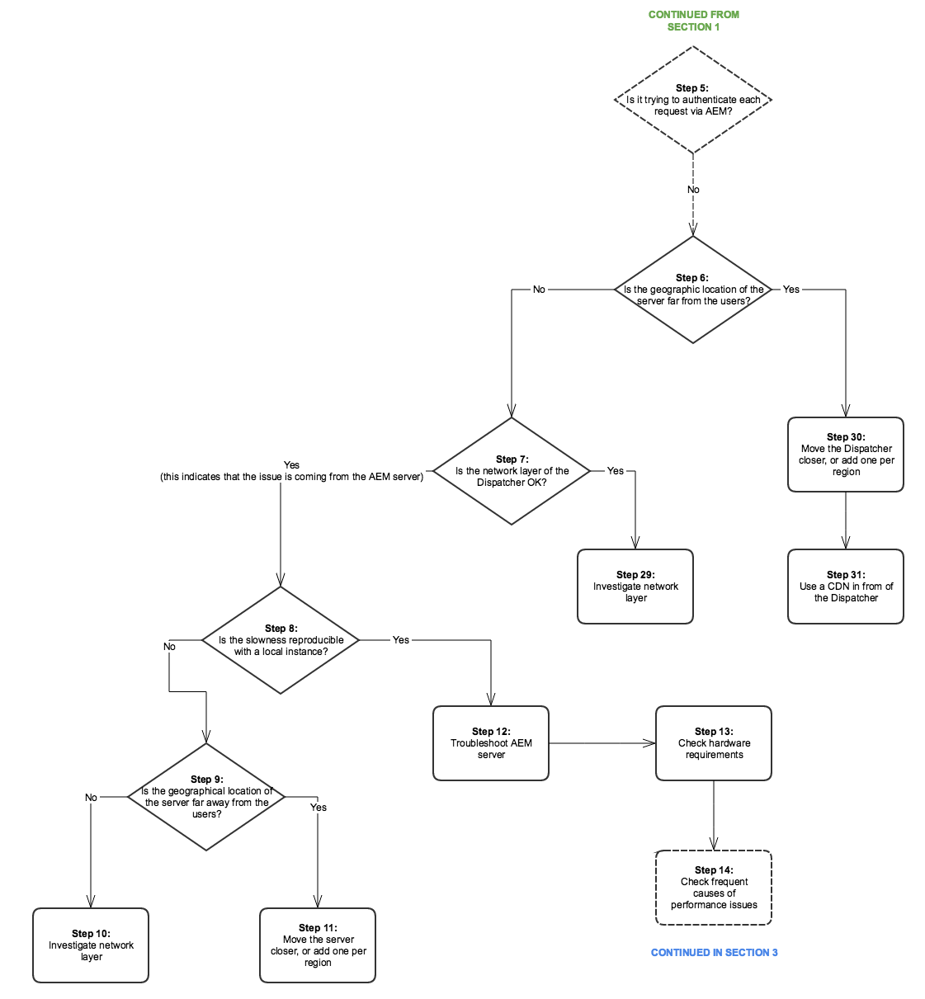

# Árbol de rendimiento{#performance-tree}

## Ámbito {#scope}

El siguiente diagrama tiene por objeto proporcionar orientación sobre los pasos que deben seguirse para solucionar problemas de rendimiento. Se divide en 5 secciones para facilitar la lectura.

Cada paso del diagrama está vinculado a un recurso de documentación o a una recomendación.

## Requisitos previos y supuestos {#prerequisites-and-assumptions}

Se supone que se observa un problema de rendimiento en una página determinada (una consola de AEM o una página web) y se puede reproducir de forma coherente. Antes de iniciar la investigación, es necesario disponer de una forma de probar o supervisar el rendimiento.

El análisis comienza en el paso 0. El objetivo es determinar qué entidad (distribuidor, host externo o AEM) es responsable del problema de rendimiento y luego determinar qué área (servidor o red) debe investigarse.

### Sección 1 {#section}

### Sección 2 {#section-1}

### Sección 3 {#section-2}

### Sección 4 {#section-3}

### Section 5 {#section-4}

## Vínculos de referencia {#reference-links}

<table>
 <tbody>
  <tr>
   <td><strong>Etapa</strong></td>
   <td><strong>Título</strong></td>
   <td><strong>Medios</strong></td>
  </tr>
  <tr>
   <td><strong>Etapa 0</strong></td>
   <td>Analizar el flujo de solicitudes</td>
   <td>
Puede utilizar el análisis de solicitud HTTP estándar en el explorador para analizar el flujo de solicitudes. Para obtener más información sobre cómo hacerlo en Chrome, consulte:  
 
<a href="https://developers.google.com/web/tools/chrome-devtools/profile/network-performance/resource-loading">https://developers.google.com/web/tools/chrome-devtools/profile/network-performance/resource-loading</a><a href="https://developers.google.com/web/tools/chrome-devtools/profile/network-performance/understanding-resource-timing">  https://developers.google.com/web/tools/chrome-devtools/profile/network-performance/understanding-resource-timing</a>  
 </td>
  </tr>
  <tr>
   <td><strong>Etapa 2</strong></td>
   <td>¿Las solicitudes provienen de hosts externos?</td>
   <td>Puede utilizar el análisis de solicitud HTTP estándar en el explorador para analizar el flujo de solicitudes. Consulte los vínculos anteriores sobre cómo hacerlo en Chrome.  </td>
  </tr>
  <tr>
   <td><strong>Etapa 3</strong></td>
   <td>¿Se pueden almacenar en caché las solicitudes?</td>
   <td>Para obtener más información sobre las solicitudes procesables y los consejos generales de optimización del rendimiento de Dispatcher, consulte Optimización del rendimiento de <a href="/help/sites-deploying/configuring-performance.md#optimizing-performance-when-using-the-dispatcher">Dispatcher</a>.</td>
  </tr>
  <tr>
   <td><strong>Etapa 4</strong></td>
   <td>¿Las solicitudes provienen del despachante?</td>
   <td>
Consulte la documentación <a href="https://helpx.adobe.com/experience-manager/dispatcher/using/dispatcher-configuration.html#debugging">de depuración de</a> Dispatcher para ver si las solicitudes se almacenan correctamente en la caché.  
 </td>
  </tr>
  <tr>
   <td><strong>Etapa 5</strong></td>
   <td>¿El despachante intenta autenticar cada solicitud a través de AEM?</td>
   <td>Compruebe si el despachante envía <code>HEAD</code> solicitudes de autenticación a AEM antes de enviar el recurso en caché. Puede hacerlo buscando <code>HEAD</code> solicitudes en AEM <code>access.log</code>. For more information, see <a href="/help/sites-deploying/configure-logging.md">Logging</a>.  </td>
  </tr>
  <tr>
   <td><strong>Etapa 6</strong></td>
   <td>¿Está la ubicación geográfica del despachante lejos de los usuarios?</td>
   <td>Acerque el despachante a los usuarios.</td>
  </tr>
  <tr>
   <td><strong>Etapa 7</strong></td>
   <td>¿Funciona correctamente la capa de red del despachante?</td>
   <td>  Investigue la capa de red para detectar problemas de saturación y latencia.
 
 </td>
  </tr>
  <tr>
   <td><strong>Etapa 8</strong></td>
   <td>¿Es reproducible la lentitud con una instancia local?</td>
   <td>  
Utilice <a href="/help/sites-developing/tough-day.md">Días</a> difíciles para replicar las condiciones del "mundo real" de las instancias de producción. Si esto no es realista para la división de su desarrollo, asegúrese de probar la instancia de producción (o una instancia de ensayo idéntica) en un contexto de red diferente.  
 </td>
  </tr>
  <tr>
   <td><strong>Etapa 9</strong></td>
   <td>¿Está la ubicación geográfica del servidor lejos de los usuarios?</td>
   <td>Acerque el servidor a los usuarios.</td>
  </tr>
  <tr>
   <td><strong>Pasos 10 y 29</strong></td>
   <td>Investigar la capa de red</td>
   <td>
Investigue la capa de red para detectar problemas de saturación y latencia.
 
Para la capa de creación, se recomienda que la latencia no supere los 100 milisegundos.
 
Para obtener más información sobre sugerencias de optimización del rendimiento, consulte <a href="https://helpx.adobe.com/experience-manager/kb/performance-tuning-tips.html">esta página</a>.
 </td>
  </tr>
  <tr>
   <td><strong>Etapa 11</strong></td>
   <td>Acercar el servidor o agregar uno por región</td>
   <td> </td>
  </tr>
  <tr>
   <td><strong>Etapa 12</strong></td>
   <td>Solución de problemas del servidor AEM</td>
   <td>Consulte los siguientes pasos secundarios en el diagrama para obtener más información.</td>
  </tr>
  <tr>
   <td><strong>Etapa 13</strong></td>
   <td>Comprobar los requisitos de hardware</td>
   <td>Consulte la documentación sobre las directrices <a href="/help/managing/hardware-sizing-guidelines.md">de cambio de tamaño de hardware</a>.  </td>
  </tr>
  <tr>
   <td><strong>Etapa 14</strong></td>
   <td>Buscar causas frecuentes de problemas de rendimiento</td>
   <td> </td>
  </tr>
  <tr>
   <td><strong>Etapa 15</strong></td>
   <td>Buscar solicitudes lentas</td>
   <td>
Puede comprobar la existencia de solicitudes lentas analizando el <code>request.log</code> o utilizando <code>rlog.jar</code>.
 
Para obtener más información sobre el uso de rlog.jar, consulte esta página.
 
Consulte <a href="/help/sites-deploying/monitoring-and-maintaining.md#using-rlog-jar-to-find-requests-with-long-duration-times">Uso de rlog.jar para buscar solicitudes con largos tiempos</a>de duración.  
 
 
 </td>
  </tr>
  <tr>
   <td><strong>Etapa 16</strong></td>
   <td>Servidor de perfiles</td>
   <td>
Para obtener información sobre las herramientas de creación de perfiles que puede utilizar con AEM, consulte <a href="/help/sites-deploying/monitoring-and-maintaining.md#tools-for-monitoring-and-analyzing-performance">Herramientas para supervisar y analizar el rendimiento</a>.  
 </td>
  </tr>
  <tr>
   <td><strong>Etapa 17</strong></td>
   <td>Buscar métodos lentos en la generación de perfiles</td>
   <td> </td>
  </tr>
  <tr>
   <td><strong>Etapa 18</strong></td>
   <td>Situaciones hipotéticas comunes de elaboración de perfiles</td>
   <td>Consulte <a href="/help/sites-deploying/monitoring-and-maintaining.md#analyzing-specific-scenarios">Análisis de escenarios</a> específicos en la sección Optimización del rendimiento.  </td>
  </tr>
  <tr>
   <td><strong>Etapa 19</strong></td>
   <td>CPU del 100%</td>
   <td><a href="/help/sites-deploying/monitoring-and-maintaining.md#monitoring-performance">https://helpx.adobe.com/experience-manager/6-3/sites-deploying/monitoring-and-maintaining.html#MonitoringPerformance</a></td>
  </tr>
  <tr>
   <td><strong>Etapa 20</strong></td>
   <td>Memoria insuficiente</td>
   <td> 
    <ol>
     <li><a href="/help/sites-deploying/monitoring-and-maintaining.md#out-of-memory">Memoria insuficiente</a></li>
     <li><a href="/help/sites-deploying/troubleshooting.md">Mi aplicación genera errores de memoria insuficiente</a></li>
     <li><a href="https://helpx.adobe.com/experience-manager/kb/AnalyzeMemoryProblems.html">Analizar problemas de memoria en la ayuda.</a>  </li>
    </ol> </td>
  </tr>
  <tr>
   <td><strong>Etapa 21</strong></td>
   <td>E/S de disco</td>
   <td>
Consulte la sección de E/S <a href="/help/sites-deploying/monitoring-and-maintaining.md#disk-i-o">de</a> disco en la documentación de Monitoreo y Mantenimiento.
 </td>
  </tr>
  <tr>
   <td><strong>Pasos 22 y 22.1</strong></td>
   <td>Proporción de caché</td>
   <td><a href="/help/sites-deploying/configuring-performance.md#calculating-the-dispatcher-cache-ratio"> Consulte </a>Cálculo de la proporción de caché del despachante.   </td>
  </tr>
  <tr>
   <td><strong>Etapa 23</strong></td>
   <td>Consultas lentas</td>
   <td><a href="/help/sites-deploying/best-practices-for-queries-and-indexing.md">Prácticas recomendadas para consultas e indexación</a></td>
  </tr>
  <tr>
   <td><strong>Etapa 24</strong></td>
   <td>Ajuste del repositorio</td>
   <td>
    <ul>
     <li><a href="https://helpx.adobe.com/experience-manager/kb/performance-tuning-tips.html">Consejos de ajuste de rendimiento</a></li>
     <li><a href="/help/sites-deploying/configuring-performance.md#configuring-for-performance">Configuración del rendimiento</a></li>
     <li><a href="https://www.slideshare.net/jukka/repository-performance-tuning">Ajuste del rendimiento del repositorio</a></li>
    </ul> </td>
  </tr>
  <tr>
   <td><strong>Etapa 25</strong></td>
   <td>Flujos de trabajo en ejecución</td>
   <td>
    <ul>
     <li><a href="/help/sites-deploying/configuring-performance.md#concurrent-workflow-processing">Procesamiento de flujo de trabajo simultáneo</a></li>
     <li><a href="/help/sites-deploying/configuring-performance.md#configure-the-queue-for-a-specific-workflow">Configurar la cola para un flujo de trabajo específico</a></li>
     <li><a href="/help/sites-administering/workflows-administering.md#regular-purging-of-workflow-instances">Depuración regular de instancias de flujo de trabajo</a></li>
     <li><a href="/help/sites-developing/workflows.md#transient-workflows">Flujos de trabajo transitorios</a>  </li>
    </ul> 
 
 </td>
  </tr>
  <tr>
   <td><strong>Etapa 26</strong></td>
   <td>Infraestructura de MSM</td>
   <td>
<a href="/help/sites-administering/msm-best-practices.md">Optimizaciones para el Administrador de varios sitios</a>  
 </td>
  </tr>
  <tr>
   <td><strong>Etapa 27</strong></td>
   <td>Optimización de recursos</td>
   <td>
    <ol>
     <li><a href="/help/sites-deploying/configuring-performance.md#cq-dam-asset-synchronization-service">Servicio de sincronización de recursos</a></li>
     <li><a href="/help/sites-deploying/configuring-performance.md#multiple-dam-instances">Varias instancias de DAM</a></li>
     <li>Artículos de consejos de optimización del rendimiento <a href="https://helpx.adobe.com/experience-manager/kb/performance-tuning-tips.html">aquí</a> y <a href="https://helpx.adobe.com/experience-manager/kb/performance-tuning-tips.html">aquí</a>.  </li>
    </ol> </td>
  </tr>
  <tr>
   <td><strong>Etapa 28</strong></td>
   <td>Sesiones privadas</td>
   <td>
 
 
<a href="/help/sites-administering/troubleshoot.md#checking-for-unclosed-jcr-sessions">Comprobación de sesiones JCR no cerradas</a>
 
 
 </td>
  </tr>
  <tr>
   <td><strong>Etapa 30</strong></td>
   <td>Acercar el distribuidor (¿agregar uno por "región"?)</td>
   <td> </td>
  </tr>
  <tr>
   <td><strong>Etapa 31</strong></td>
   <td>Usar CDN delante del despachante</td>
   <td><a href="https://helpx.adobe.com/experience-manager/dispatcher/using/dispatcher.html#using-dispatcher-with-a-cdn">Uso de Dispatcher con una CDN</a>  </td>
  </tr>
  <tr>
   <td><strong>Etapa 32</strong></td>
   <td>Utilice la administración de sesiones en el nivel de distribuidor para descargar el servidor AEM</td>
   <td>
<a href="https://helpx.adobe.com/experience-manager/dispatcher/using/dispatcher-configuration.html#enabling-secure-sessions-sessionmanagement">Activación de sesiones seguras</a>
 </td>
  </tr>
  <tr>
   <td><strong>Etapa 33</strong></td>
   <td>Hacer que las solicitudes sean accesibles</td>
   <td>
    <ol>
     <li><a href="https://helpx.adobe.com/experience-manager/dispatcher/using/dispatcher.html">Configuración general de Dispatcher</a></li>
     <li><a href="https://helpx.adobe.com/experience-manager/dispatcher/using/dispatcher-configuration.html#configuring-the-dispatcher-cache-cache">Configuración de la memoria caché de Dispatcher</a></li>
    </ol> 
Cómo mejorar la proporción de caché; convertir solicitudes en caché (prácticas recomendadas de Dispatcher)
 
Además, tenga en cuenta los siguientes ajustes para optimizar las configuraciones de almacenamiento en caché  

    <ol>
     <li>Establecer una regla de no caché para las solicitudes HTTP que no son GET</li>
     <li>Configurar cadenas de consulta para que no se puedan almacenar en caché</li>
     <li>No almacenar en caché las direcciones URL con extensiones que faltan</li>
     <li>Encabezados de autenticación de caché (posible desde Dispatcher versión 4.1.10)</li>
    </ol> </td>
  </tr>
  <tr>
   <td><strong>Etapa 34</strong></td>
   <td>Actualizar la versión del distribuidor</td>
   <td>
Puede descargar la última versión de Dispatcher en esta ubicación:
 
<a href="https://helpx.adobe.com/experience-manager/dispatcher/release-notes.html">Seguir vínculo</a>
 </td>
  </tr>
  <tr>
   <td><strong>Etapa 35</strong></td>
   <td>Configurar distribuidor</td>
   <td><a href="https://helpx.adobe.com/experience-manager/dispatcher/using/dispatcher-configuration.html">Configuración del despachante</a>  </td>
  </tr>
  <tr>
   <td><strong>Etapa 36</strong></td>
   <td>Comprobar invalidación de caché</td>
   <td> 
    <ul>
     <li><a href="https://helpx.adobe.com/experience-manager/dispatcher/using/page-invalidate.html#invalidating-dispatcher-cache-from-the-authoring-environment">Invalidación de caché para el nivel Autor;</a></li>
     <li><a href="https://helpx.adobe.com/experience-manager/dispatcher/using/page-invalidate.html#invalidating-dispatcher-cache-from-a-publishing-instance">Invalidación de caché para el nivel Publicar.</a></li>
    </ul> </td>
  </tr>
  <tr>
   <td><strong>Pasos 37 y 38</strong></td>
   <td>Carga diferida</td>
   <td><a href="https://docs.adobe.com/ddc/en/gems/aem-web-performance.html">Consulte la sesión de Gem sobre el rendimiento web de AEM.</a>  </td>
  </tr>
  <tr>
   <td><strong>Etapa 39</strong></td>
   <td>Usar preconexión para reducir la sobrecarga de conexión</td>
   <td>Consulte la sesión de Gem indicada anteriormente. <a href="https://www.w3.org/TR/resource-hints/#dfn-preconnect"> Además, la preconexión de documentación adicional en W3c: https://www.w3.org/TR/resource-hints/#dfn-preconnect</a></td>
  </tr>
  <tr>
   <td><strong>Pasos 40 y 41</strong>  </td>
   <td>Tiempo de respuesta y latencia de los hosts externos</td>
   <td>Investigue la latencia y el tiempo de respuesta de los hosts externos.</td>
  </tr>
  <tr>
   <td><strong>Pasos 45  y 47</strong>  </td>
   <td>Uso de HTTP/2</td>
   <td>Consulte los pasos 37, 38 y 39 en la sesión de Gem. También puede consultar <a href="https://help-forums.adobe.com/content/adobeforums/en/experience-manager-forum/adobe-experience-manager.topic.html/forum__kdzc-does_anyoneknowwhe.html">esta</a> publicación del foro sobre la compatibilidad con HTTP/2.  </td>
  </tr>
  <tr>
   <td><strong>Etapa 49</strong></td>
   <td>Reducir tamaño de carga útil</td>
   <td><a href="/help/sites-deploying/osgi-configuration-settings.md">Active Gzip</a> y <a href="https://docs.adobe.com/ddc/en/gems/aem-web-performance.html">reduzca el tamaño</a>de la imagen.  </td>
  </tr>
  <tr>
   <td><strong>Pasos 42 y 43</strong></td>
   <td>Mantener viva</td>
   <td>
¿Está presente el <code>Keep-Alive</code> encabezado en las distintas solicitudes para reutilizar conexiones? De lo contrario, significaría que cada solicitud conduce a otro establecimiento de conexiones, lo que supone una sobrecarga innecesaria. (Análisis de solicitudes HTTP estándar en el explorador)
 
Puede comprobar la herramienta <a href="/help/sites-administering/proxy-jar.md">Servidor</a> proxy para comprobar la existencia de conexiones "Keep-Alive".  
 </td>
  </tr>
  <tr>
   <td><strong>Etapa 44</strong></td>
   <td>¿Cuántas solicitudes se hacen?</td>
   <td>Realice un análisis de solicitud HTTP estándar en el explorador.</td>
  </tr>
  <tr>
   <td><strong>Etapa 46</strong></td>
   <td>Reducir el número de solicitudes</td>
   <td>
    <ol>
     <li>Concatenar recursos (imágenes, sprites CSS, JSON, etc.)  </li>
     <li>Incrustación de Clientlibs:
      <ol>
       <li><a href="/help/sites-developing/clientlibs.md#creating-client-library-folders">Creación de carpetas</a> de la biblioteca de clientes: consulte Encabezamiento Uso de la incrustación para minimizar solicitudes</li>
      </ol> </li>
    </ol> </td>
  </tr>
  <tr>
   <td><strong>Etapa 48</strong></td>
   <td>¿Cuál es el tamaño de la carga útil?</td>
   <td>Análisis de solicitudes HTTP estándar en el explorador</td>
  </tr>
  <tr>
   <td><strong>Pasos 50 y 51</strong></td>
   <td>Bloqueo de código JS</td>
   <td><a href="https://docs.adobe.com/ddc/en/gems/aem-web-performance.html">https://docs.adobe.com/ddc/en/gems/aem-web-performance.html</a></td>
  </tr>
 </tbody>
</table>

