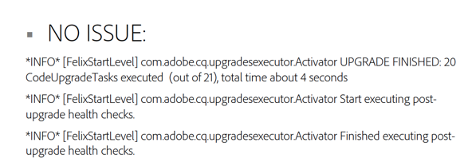

# Comprobaciones posteriores a la actualización y resolución de problemas{#post-upgrade-checks-and-troubleshooting}

## Comprobaciones posteriores a la actualización {#post-upgrade-checks}

Después de la [actualización in-situ](/help/sites-deploying/in-place-upgrade.md) se deben ejecutar las siguientes actividades para finalizar la actualización. Se supone AEM se ha iniciado con el jar 6.5 y que se ha implementado la base de código actualizada.

* [Verificar registros para que la actualización se realice correctamente](#main-pars-header-290365562)

* [Verificar paquetes OSGi](#main-pars-header-1637350649)

* [Verificar versión de Oak](#main-pars-header-1293049773)

* [Inspect la carpeta PreUpgradeBackup](#main-pars-header-988995987)

* [Validación inicial de páginas](#main-pars-header-20827371)
* [Aplicar Service Packs AEM](#main-pars-header-215142387)

* [Migración de AEM características](#main-pars-header-1434457709)

* [Verificar configuraciones de mantenimiento programadas](#main-pars-header-1552730183)

* [Habilitar agentes de replicación](#main-pars-header-823243751)

* [Habilitar trabajos programados personalizados](#main-pars-header-244535083)

* [Ejecutar plan de prueba](#main-pars-header-1167972233)

### Verificar registros para el éxito de la actualización {#verify-logs-for-upgrade-success}

**upgrade.log**

En el pasado, la inspección del estado posterior a la actualización de la instancia requería una cuidadosa inspección de varios archivos de registro, partes del repositorio y el panel de lanzamiento. La generación de un informe posterior a la actualización puede ayudar a detectar actualizaciones defectuosas antes de publicarlas.

El objetivo principal de esta función es reducir la necesidad de interpretación manual o lógica de análisis compleja en múltiples puntos de conexión necesarios para calificar el éxito de una actualización. La solución pretende proporcionar información inequívoca para que los sistemas de automatización externos reaccionen ante el éxito o el fallo identificado de una actualización.

Más concretamente, garantiza que:

* Los errores de actualización detectados por el marco de actualización se pueden centralizar en un solo informe de actualización;
* El informe de actualización incluye indicadores sobre la intervención manual necesaria.

Para adaptarse a esto, se han realizado cambios en la forma en que se generan los registros en el archivo `upgrade.log`.

Este es un informe de ejemplo que no muestra errores durante la actualización:



Este es un informe de ejemplo que muestra un paquete que no se instaló durante el proceso de actualización:


**error.log**

El archivo error.log debe revisarse cuidadosamente durante y después del inicio de AEM usando el jar de la versión de destino. Cualquier advertencia o error debe revisarse. En general, es mejor buscar problemas al principio del registro. Los errores que se producen más adelante en el registro pueden ser en realidad efectos secundarios de una causa raíz que se llama antes en el archivo. Si se producen errores y advertencias repetidos, consulte a continuación [Análisis de problemas con la actualización](/help/sites-deploying/post-upgrade-checks-and-troubleshooting.md#analyzing-issues-with-the-upgrade).

### Verificar paquetes OSGi {#verify-osgi-bundles}

Vaya a la consola OSGi `/system/console/bundles` y compruebe si no se ha iniciado ningún paquete. Si alguno de los paquetes está en estado instalado, consulte `error.log` para determinar el problema de raíz.

### Verificar versión de Oak {#verify-oak-version}

Después de la actualización, debería ver que la versión de Oak se ha actualizado a **1.10.2**. Para verificar la versión de Oak, vaya a la consola OSGi y observe la versión asociada con los paquetes Oak: Oak Core, Oak Commons, Oak Segment Tar.

### Carpeta Inspect PreUpgradeBackup {#inspect-preupgradebackup-folder}

Durante la actualización, AEM intentará hacer una copia de seguridad de las personalizaciones y almacenarlas debajo de `/var/upgrade/PreUpgradeBackup/<time-stamp-of-upgrade>`. Para ver esta carpeta en el CRXDE Lite, es posible que deba [habilitar temporalmente al CRXDE Lite](/help/sites-administering/enabling-crxde-lite.md).

La carpeta con la marca de tiempo debe tener una propiedad denominada `mergeStatus` con un valor de `COMPLETED`. La carpeta **to-process** debe estar vacía y el nodo **sobrescrito** indica qué nodos se sobrescribieron durante la actualización. El contenido debajo del nodo **izquierdistas** indica contenido que no se pudo combinar de forma segura durante la actualización. Si la implementación depende de cualquiera de los nodos secundarios (y no está instalado por el paquete de código actualizado), deberá combinarlos manualmente.

Desactive el CRXDE Lite que sigue este ejercicio si se encuentra en un entorno de fase o producción.

### Validación inicial de páginas {#initial-validation-of-pages}

Realice una validación inicial con varias páginas en AEM. Si actualiza un entorno de Author, abra la página de inicio y la página de bienvenida ( `/aem/start.html`, `/libs/cq/core/content/welcome.html`). Tanto en los entornos Autor como Publicado, se abren algunas páginas de aplicación y se prueba el humo que se representan correctamente. Si se produce algún problema, consulte `error.log` para solucionar el problema.

### Aplicar Service Packs de AEM {#apply-aem-service-packs}

Aplique los Service Packs AEM 6.5 relevantes si se han liberado.

### Migrar características de AEM {#migrate-aem-features}

Varias funciones de AEM requieren pasos adicionales después de la actualización. Puede encontrar una lista completa de estas funciones y los pasos para migrarlas en AEM 6.5 en la página [Actualización de código y personalizaciones](/help/sites-deploying/upgrading-code-and-customizations.md).

### Verificar configuraciones de mantenimiento programadas {#verify-scheduled-maintenance-configurations}

#### Habilitar la colección de residuos del almacén de datos {#enable-data-store-garbage-collection}

Si utiliza un almacén de datos de archivos, asegúrese de que la tarea de colección de residuos del almacén de datos esté habilitada y agregada a la lista de mantenimiento semanal. Las instrucciones se describen [aquí](/help/sites-administering/data-store-garbage-collection.md).

>[!NOTE]
>
>Esto no se recomienda para instalaciones de almacén de datos personalizadas S3 o cuando se utiliza un almacén de datos compartido.

#### Habilitar limpieza de revisión en línea {#enable-online-revision-cleanup}

Si utiliza MongoMK o el nuevo formato de segmento TarMK, asegúrese de que la tarea de limpieza de revisión esté habilitada y añadida a la lista de mantenimiento diario. Instrucciones descritas [aquí](/help/sites-deploying/revision-cleanup.md).

### Ejecutar plan de prueba {#execute-test-plan}

Ejecute un plan de prueba detallado con la definición [Actualización de código y personalizaciones](/help/sites-deploying/upgrading-code-and-customizations.md) en la sección **Procedimiento de prueba**.

### Habilitar agentes de replicación {#enable-replication-agents}

Una vez que el entorno de publicación se haya actualizado y validado completamente, habilite los agentes de replicación en el entorno de creación. Compruebe que los agentes puedan conectarse a las instancias de publicación correspondientes. Consulte U [Actualización del procedimiento](/help/sites-deploying/upgrade-procedure.md) para obtener más información sobre el orden de los eventos.

### Habilitar trabajos programados personalizados {#enable-custom-scheduled-jobs}

Cualquier trabajo programado como parte de la base de código puede habilitarse en este momento.

## Análisis De Problemas Con La Actualización {#analyzing-issues-with-upgrade}

Esta sección contiene algunos casos de problemas a los que podría enfrentarse durante el procedimiento de actualización a AEM 6.3.

Estos escenarios deberían ayudar a rastrear la causa principal de los problemas relacionados con la actualización y deberían ayudar a identificar los problemas específicos del proyecto o del producto.

### Error en la migración del repositorio {#repository-migration-failing-}

La migración de datos de CRX2 a Oak debería ser factible para cualquier escenario que comience con instancias de origen basadas en CQ5.4. Asegúrese de seguir exactamente las instrucciones de actualización de este documento que incluyen la preparación de `repository.xml`, asegurándose de que no se inicie ningún autenticador personalizado mediante JAAS y que la instancia se haya comprobado para detectar incoherencias antes de iniciar la migración.

Si la migración sigue fallando, puede averiguar cuál es la causa principal inspeccionando el `upgrade.log`. Si el problema aún no se conoce, comuníqueselo al Servicio de atención al cliente.

### La Actualización No Se Ejecutó {#the-upgrade-did-not-run}

Antes de iniciar los pasos de preparación, asegúrese de ejecutar primero la instancia **source** ejecutándola con el comando java -jar aem-quickstart.jar. Esto es necesario para asegurarse de que el archivo quickstart.properties se genera correctamente. Si falta, la actualización no funcionará. Como alternativa, puede comprobar si el archivo está presente buscando en `crx-quickstart/conf` en la carpeta de instalación de la instancia de origen. Además, al iniciar AEM para iniciar la actualización, debe ejecutarse con el comando java -jar aem-quickstart.jar. El inicio desde un script de inicio no se iniciará AEM en modo de actualización.

### Los paquetes y paquetes no se actualizan {#packages-and-bundles-fail-to-update-}

En caso de que los paquetes no se instalen durante la actualización, los paquetes que contienen tampoco se actualizarán. Esta categoría de problemas suele deberse a una mala configuración del almacén de datos. También aparecerán como mensajes **ERROR** y **WARN** en el archivo error.log. Dado que en la mayoría de estos casos el inicio de sesión predeterminado puede no funcionar, puede utilizar CRXDE directamente para inspeccionar y encontrar los problemas de configuración.

### Algunos paquetes AEM no cambian al estado activo {#some-aem-bundles-are-not-switching-to-the-active-state}

En caso de que los paquetes no se inicien, debe comprobar si hay dependencias insatisfechas.

En caso de que este problema esté presente, pero se basa en una instalación de paquete fallida que provocó que los paquetes no se actualizaran, se considerarán incompatibles con la nueva versión. Para obtener más información sobre cómo solucionar este problema, consulte **Paquetes y paquetes que no se actualizan** más arriba.

También se recomienda comparar la lista de paquetes de una nueva instancia AEM 6.5 con la actualizada para detectar los paquetes que no se actualizaron. Esto proporcionará un alcance más cercano de lo que se debe buscar en `error.log`.

### Paquetes personalizados que no cambian al estado activo {#custom-bundles-not-switching-to-the-active-state}

Si los paquetes personalizados no cambian al estado activo, lo más probable es que haya código que no importe la API de cambio. Esto a menudo dará lugar a dependencias insatisfechas.

La API eliminada debe marcarse como obsoleta en una de las versiones anteriores. Puede encontrar instrucciones sobre una migración directa de su código en este aviso de desaprobación. El Adobe tiene como objetivo crear versiones semánticas siempre que sea posible para que las versiones puedan indicar cambios de ruptura.

También es mejor comprobar si el cambio que ha causado el problema era absolutamente necesario y revertirlo si no lo es. Compruebe también si el aumento de la versión de la exportación del paquete ha aumentado más de lo necesario, tras un estricto control semántico de versiones.

### Interfaz de usuario de Platform con fallo {#malfunctioning-platform-ui}

En el caso de ciertas funciones de la interfaz de usuario que no funcionen correctamente después de la actualización, primero debe comprobar si hay superposiciones personalizadas de la interfaz. Es posible que algunas estructuras hayan cambiado y que la superposición necesite una actualización o esté obsoleta.

A continuación, compruebe si hay errores de JavaScript que se puedan rastrear hasta las extensiones agregadas personalizadas vinculadas a bibliotecas de cliente. Lo mismo puede aplicarse para CSS personalizada que podría estar causando problemas en el diseño de AEM.

Finalmente, compruebe si hay una configuración incorrecta con la que Javascript podría no poder lidiar. Este suele ser el caso de las extensiones incorrectamente desactivadas.

### Fallo en los componentes personalizados, las plantillas o las extensiones de interfaz de usuario {#malfunctioning-custom-components-templates-or-ui-extensions}

En la mayoría de los casos, las causas principales de estos problemas son las mismas que para los paquetes que no se inician o que los paquetes no se instalan con la única diferencia de que los problemas empiezan a ocurrir al usar los componentes por primera vez.

La manera de lidiar con un código personalizado erróneo es primero realizar pruebas de humo para identificar la causa. Una vez que lo encuentre, consulte las recomendaciones de esta sección [link] del artículo para saber cómo corregirlas.

### Personalizaciones que faltan en /etc {#missing-customizations-under-etc}

`/apps` y  `/libs` se gestionan correctamente mediante la actualización, pero es posible que los cambios en  `/etc` deban restaurarse manualmente desde  `/var/upgrade/PreUpgradeBackup` después de la actualización. Asegúrese de comprobar esta ubicación para cualquier contenido que deba combinarse manualmente.

### Análisis de error.log y upgrade.log {#analyzing-the-error.log-and-upgrade.log}

En la mayoría de los casos, es necesario consultar los registros en busca de errores para encontrar la causa de un problema. Sin embargo, en caso de actualizaciones, también es necesario supervisar los problemas de dependencia, ya que es posible que los paquetes antiguos no se actualicen correctamente.

La mejor manera de hacerlo es eliminar el archivo error.log eliminando todos los mensajes que se espera que no estén relacionados con el problema que está enfrentando. Puede hacerlo mediante una herramienta como grep, utilizando:

```shell
grep -v UnrelatedErrorString
```

Es posible que algunos mensajes de error no sean explicativos inmediatamente. En este caso, observar el contexto en el que se producen también puede ayudar a comprender dónde se creó el error. Puede separar el error utilizando:

* `grep -B` para añadir líneas antes del error;

o

* `grep -A` para añadir líneas después de.

En algunos casos, también se pueden encontrar errores en los mensajes WARN , ya que puede haber casos válidos que lleven a este estado y la aplicación no siempre puede decidir si se trata de un error real. Asegúrese de consultar también estos mensajes.

### Contactar con el soporte de Adobe {#contacting-adobe-support}

Si ha seguido los consejos de esta página y sigue teniendo problemas, póngase en contacto con el servicio de asistencia al Adobe. Para proporcionar la mayor información posible al ingeniero de soporte técnico que trabaja en su caso, asegúrese de incluir el archivo upgrade.log de su actualización.
