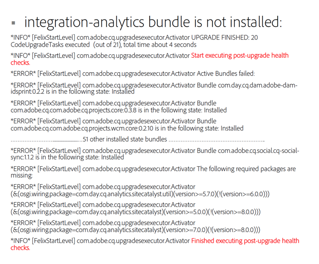

# Comprobaciones posteriores a la actualización y solución de problemas{#post-upgrade-checks-and-troubleshooting}

## Comprobaciones posteriores a la actualización {#post-upgrade-checks}

Después de la [actualización in situ](/help/sites-deploying/in-place-upgrade.md), se deben ejecutar las siguientes actividades para finalizar la actualización. AEM Se supone que se ha iniciado con el JAR 6.5 y que se ha implementado la base de código actualizada.

* [Verificar registros para que la actualización se realice correctamente](#main-pars-header-290365562)

* [Verificar paquetes OSGi](#main-pars-header-1637350649)

* [Verificar la versión de Oak](#main-pars-header-1293049773)

* [Inspect la carpeta PreUpgradeBackup](#main-pars-header-988995987)

* [Validación inicial de páginas](#main-pars-header-20827371)
* [AEM Aplicar paquetes de servicio](#main-pars-header-215142387)

* [AEM Migración de características de](#main-pars-header-1434457709)

* [Verificar las configuraciones de mantenimiento programadas](#main-pars-header-1552730183)

* [Habilitar agentes de replicación](#main-pars-header-823243751)

* [Habilitar trabajos programados personalizados](#main-pars-header-244535083)

* [Ejecutar plan de prueba](#main-pars-header-1167972233)

### Verificación de registros para actualización correcta {#verify-logs-for-upgrade-success}

**actualización.log**

En el pasado, la inspección del estado posterior a la actualización de la instancia requería una inspección cuidadosa de varios archivos de registro, partes del repositorio y el Launchpad. La generación de un informe posterior a la actualización puede ayudar a detectar actualizaciones defectuosas antes de activarse.

El propósito principal de esta función es reducir la necesidad de interpretación manual o de lógica de análisis compleja en varios extremos necesarios para calificar el éxito de una actualización. La solución tiene como objetivo proporcionar información inequívoca para que los sistemas de automatización externos reaccionen ante el éxito o el fracaso identificado de una actualización.

Más concretamente, garantiza que:

* Los errores de actualización detectados por el marco de actualización están centralizados en un único informe de actualización;
* El informe de actualización incluye indicadores sobre la intervención manual necesaria.

Para dar cabida a esto, se han realizado cambios en la forma en que se generan los registros en el archivo `upgrade.log`.

Este es un informe de ejemplo que muestra que no hay errores durante la actualización:


Este es un informe de ejemplo que muestra un paquete que no se instaló durante el proceso de actualización:



**error.log**

AEM El error.log debe revisarse cuidadosamente durante y después del inicio de la ejecución de la ejecución de la aplicación utilizando el JAR de la versión de destino. Deben revisarse todas las advertencias o errores. En general, es mejor buscar problemas al principio del registro. Los errores que se producen más adelante en el registro pueden ser en realidad efectos secundarios de una causa raíz que se llama al principio del archivo. Si se producen errores y advertencias repetidos, consulte a continuación [Análisis de problemas con la actualización](/help/sites-deploying/post-upgrade-checks-and-troubleshooting.md#analyzing-issues-with-the-upgrade).

### Verificar paquetes OSGi {#verify-osgi-bundles}

Vaya a la consola OSGi `/system/console/bundles` y compruebe si no se han iniciado los paquetes. Si algún paquete está en estado instalado, consulte `error.log` para determinar el problema de raíz.

### Verificar la versión de Oak {#verify-oak-version}

Después de la actualización, debería ver que la versión de Oak se ha actualizado a **1.10.2**. Para comprobar la versión de Oak, vaya a la consola OSGi y observe la versión asociada a los paquetes de Oak: Oak Core, Oak Commons, Segment TAR de Oak.

### Carpeta PreUpgradeBackup de Inspect {#inspect-preupgradebackup-folder}

AEM Durante la actualización, el usuario intenta realizar una copia de seguridad de las personalizaciones y almacenarlas debajo de `/var/upgrade/PreUpgradeBackup/<time-stamp-of-upgrade>`. Para ver esta carpeta en CRXDE Lite, es posible que tengas que [habilitar temporalmente el CRXDE Lite](/help/sites-administering/enabling-crxde-lite.md).

La carpeta con la marca de tiempo debe tener una propiedad denominada `mergeStatus` con un valor de `COMPLETED`. La carpeta **to-process** debe estar vacía y el nodo **overwrite** indica qué nodos se sobrescribieron durante la actualización. El contenido debajo del nodo de sobras indica contenido que no se pudo combinar de forma segura durante la actualización. Si la implementación depende de cualquiera de los nodos secundarios (y no están ya instalados en el paquete de código actualizado), deben combinarse manualmente.

Deshabilite el CRXDE Lite después de este ejercicio si se encuentra en un entorno de ensayo o producción.

### Validación inicial de páginas {#initial-validation-of-pages}

AEM Realice una validación inicial en varias páginas de la lista de distribución de recursos Si actualiza un entorno de creación, abra la página de inicio y la página de bienvenida ( `/aem/start.html`, `/libs/cq/core/content/welcome.html`). En los entornos de autor y de Publish, abra algunas páginas de aplicación y pruebe a fumar para que se representen correctamente. Si ocurre algún problema, consulte `error.log` para solucionar los problemas.

### AEM Aplicar paquetes de servicio {#apply-aem-service-packs}

AEM Aplique cualquier paquete de servicio pertinente de 6.5 de si se ha publicado.

### AEM Migración de funciones de {#migrate-aem-features}

AEM Varias funciones de requieren pasos adicionales después de la actualización. AEM Encontrará una lista completa de estas características y los pasos para migrarlas en la versión 6.5 de la aplicación en la página [Actualización del código y las personalizaciones](/help/sites-deploying/upgrading-code-and-customizations.md).

### Verificar las configuraciones de mantenimiento programadas {#verify-scheduled-maintenance-configurations}

#### Activar recolección de basura del almacén de datos {#enable-data-store-garbage-collection}

Si utiliza un almacén de datos de archivos, asegúrese de que la tarea de recolección de elementos no utilizados del almacén de datos esté habilitada y agregada a la lista de mantenimiento semanal. Las instrucciones se describen en [Limpieza de revisión](/help/sites-administering/data-store-garbage-collection.md).

>[!NOTE]
>
>Esto no se recomienda para instalaciones de almacenes de datos personalizados S3 o cuando se utiliza un almacén de datos compartido.

#### Activar Limpieza de revisión en línea {#enable-online-revision-cleanup}

Si utiliza MongoMK o el nuevo formato de segmento TarMK, asegúrese de que la tarea Revision Clean Up esté activada y se añada a la lista de mantenimiento diario. Las instrucciones se describen en [Limpieza de revisión](/help/sites-deploying/revision-cleanup.md).

### Ejecutar plan de prueba {#execute-test-plan}

Ejecute un plan de prueba detallado con según se define en [Actualización del código y las personalizaciones](/help/sites-deploying/upgrading-code-and-customizations.md) en la sección **Procedimiento de prueba**.

### Habilitar agentes de replicación {#enable-replication-agents}

Una vez que el entorno de publicación se haya actualizado y validado completamente, habilite los agentes de replicación en el entorno de creación. Compruebe que los agentes pueden conectarse a las instancias de Publish correspondientes. Consulte U [Procedimiento de actualización](/help/sites-deploying/upgrade-procedure.md) para obtener más información sobre el orden de los eventos.

### Habilitar trabajos programados personalizados {#enable-custom-scheduled-jobs}

Cualquier trabajo programado como parte de la base de código puede habilitarse en este momento.

## Análisis De Problemas Con La Actualización {#analyzing-issues-with-upgrade}

AEM Esta sección contiene algunos escenarios de problemas que se pueden presentar a lo largo del procedimiento de actualización a la versión 6.3 de la.

Estos escenarios deberían ayudar a rastrear la causa raíz de los problemas relacionados con la actualización y deberían ayudar a identificar los problemas específicos del proyecto o del producto.

### Error de migración de repositorio  {#repository-migration-failing-}

La migración de datos de CRX2 a Oak debe ser factible para cualquier escenario que comience con Instancias de Source basadas en CQ 5.4. Asegúrese de seguir exactamente las instrucciones de actualización de este documento, que incluyen la preparación de `repository.xml`, asegurándose de que no se inicie ningún autenticador personalizado a través de JAAS y de que se haya comprobado la existencia de incoherencias en la instancia antes de iniciar la migración.

Si la migración sigue fallando, puede averiguar cuál es la causa principal inspeccionando `upgrade.log`. Si el problema aún no se conoce, notifíquelo al Servicio de atención al cliente.

### La Actualización No Se Ha Ejecutado {#the-upgrade-did-not-run}

Antes de iniciar los pasos de preparación, asegúrese de ejecutar primero la instancia de **source** ejecutándola con el comando Java™ -jar aem-quickstart.jar. Esto es necesario para asegurarse de que el archivo quickstart.properties se genera correctamente. Si falta, la actualización no funcionará. También puede comprobar si el archivo está presente mirando en `crx-quickstart/conf` en la carpeta de instalación de la instancia de origen. AEM Además, al iniciar la actualización, se debe ejecutar con el comando Java™ -jar aem-quickstart.jar. AEM El inicio desde una secuencia de comandos de inicio no se iniciará en modo de actualización de la aplicación

### Los paquetes no se pueden actualizar  {#packages-and-bundles-fail-to-update-}

Si los paquetes no se instalan durante la actualización, los paquetes que contienen tampoco se actualizarán. Esta categoría de problemas se debe a una configuración incorrecta del almacén de datos. También aparecerán como mensajes de **ERROR** y **ADVERTENCIA** en el error.log. Dado que en la mayoría de estos casos el inicio de sesión predeterminado puede no funcionar, puede utilizar CRXDE directamente para inspeccionar y encontrar los problemas de configuración.

### AEM Algunos paquetes de Bundle no están cambiando al estado activo. {#some-aem-bundles-are-not-switching-to-the-active-state}

Si hay paquetes que no se inician, compruebe si hay dependencias no satisfechas.

En caso de que este problema esté presente, pero se basa en una instalación fallida del paquete que provocó que los paquetes no se actualizaran, se considerarán incompatibles para la nueva versión. Para obtener más información sobre cómo solucionar este problema, consulte **Error al actualizar paquetes y paquetes** más arriba.

AEM También se recomienda comparar la lista de paquetes de una instancia nueva de 6.5 con la actualizada para detectar los paquetes que no se actualizaron. Esto proporcionará un ámbito más cercano de lo que se debe buscar en `error.log`.

### Los paquetes personalizados no cambian al estado activo {#custom-bundles-not-switching-to-the-active-state}

En caso de que los paquetes personalizados no cambien al estado activo, lo más probable es que haya código que no importe la API de cambio. Esto suele dar lugar a dependencias no satisfechas.

La API que se eliminó debe marcarse como obsoleta en una de las versiones anteriores. Puede encontrar instrucciones acerca de una migración directa de su código en este aviso de desuso. El Adobe busca el control de versiones semánticas siempre que sea posible, de modo que las versiones puedan indicar cambios importantes.

También es mejor comprobar si el cambio que ha causado el problema era necesario y revertirlo si no lo es. Compruebe también si el aumento de versión del paquete de exportación se ha aumentado más de lo necesario, siguiendo un control de versiones semántico estricto.

### IU de Platform con funcionamiento incorrecto {#malfunctioning-platform-ui}

Si hay alguna funcionalidad de la interfaz de usuario que no funciona correctamente después de la actualización, primero debe comprobar las superposiciones personalizadas de la interfaz. Es posible que algunas estructuras hayan cambiado y que la superposición necesite una actualización o esté obsoleta.

A continuación, compruebe si hay algún error de JavaScript del que se pueda hacer un seguimiento en las extensiones agregadas personalizadas vinculadas a las bibliotecas de cliente. AEM Lo mismo puede aplicarse a los CSS personalizados que pueden estar causando problemas al diseño de la.

Finalmente, compruebe si hay alguna configuración incorrecta con la que JavaScript podría no ser capaz de lidiar. Este suele ser el caso de las extensiones desactivadas incorrectamente.

### Componentes personalizados, plantillas o extensiones de IU que no funcionan correctamente {#malfunctioning-custom-components-templates-or-ui-extensions}

Normalmente, las causas raíz de estos problemas son las mismas que para los paquetes que no se inician o los paquetes que no se instalan, con la única diferencia de que los problemas empiezan a producirse al utilizar los componentes por primera vez.

La manera de lidiar con el código personalizado erróneo es realizar primero pruebas de humo para identificar la causa. Cuando lo encuentre, consulte las recomendaciones de esta sección de [vínculo] del artículo para ver formas de solucionarlas.

### Faltan personalizaciones en /etc {#missing-customizations-under-etc}

`/apps` y `/libs` se gestionan bien mediante la actualización, pero es posible que sea necesario restaurar manualmente los cambios en `/etc` desde `/var/upgrade/PreUpgradeBackup` después de la actualización. Asegúrese de comprobar esta ubicación para cualquier contenido que deba combinarse manualmente.

### Analizando error.log y upgrade.log {#analyzing-the-error.log-and-upgrade.log}

En la mayoría de los casos, es necesario consultar los registros para detectar errores y encontrar la causa del problema. Sin embargo, con las actualizaciones, también es necesario monitorizar los problemas de dependencia, ya que es posible que los paquetes antiguos no se actualicen correctamente.

La mejor manera de hacerlo es eliminar el error.log eliminando todos los mensajes que se espera que no estén relacionados con el problema que está enfrentando. Puede hacerlo mediante una herramienta como grep, usando:

```shell
grep -v UnrelatedErrorString
```

Algunos mensajes de error pueden no ser inmediatamente explicativos. En este caso, observar el contexto en el que se producen también puede ayudar a comprender dónde se creó el error. Puede separar el error mediante lo siguiente:

* `grep -B` por agregar líneas antes del error;

o

* `grep -A` para agregar líneas después de.

En algunos casos, también se pueden encontrar mensajes WARN, ya que puede haber casos válidos que conduzcan a este estado y la aplicación no siempre puede decidir si se trata de un error real. Asegúrese de consultar también estos mensajes.

### Contactar con el servicio de soporte técnico de Adobe {#contacting-adobe-support}

Si ha seguido los consejos de esta página y sigue teniendo problemas, póngase en contacto con el servicio de asistencia al Adobe. Para proporcionar la mayor cantidad de información posible al ingeniero de soporte técnico que trabaja en su caso, asegúrese de incluir el archivo upgrade.log de su actualización.
