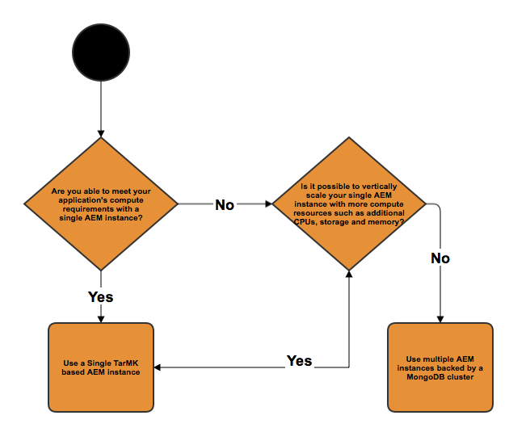

# Implementaciones recomendadas{#recommended-deployments}

>[!NOTE]
>
>Esta página se refiere a las topologías recomendadas para AEM. Para obtener más información sobre las capacidades de agrupación en clúster y cómo configurarlas, consulte la [Documentación de la API de Apache Sling Discovery](https://sling.apache.org/documentation/bundles/discovery-api-and-impl.html).

Los microkernels actúan como gestores de persistencia a partir de AEM 6.2. La elección de uno que se adapte a sus necesidades depende del propósito de su instancia y del tipo de implementación que esté considerando.

Los siguientes ejemplos pretenden indicar cuáles son sus usos recomendados en las configuraciones de AEM más comunes.

## Situaciones de implementación {#deployment-scenarios}

### Instancia única de TarMK {#single-tarmk-instance}

En esta situación, se ejecuta una sola instancia de TarMK en un solo servidor.

**Esta es la implementación predeterminada para instancias de autor.**

Las ventajas:

* Simples
* Mantenimiento sencillo
* Buen rendimiento

Las desventajas:

* No escalable más allá de los límites de la capacidad del servidor
* Sin capacidad de failover

### Modo de espera pasiva TarMK {#tarmk-cold-standby}

Una instancia de TarMK actúa como instancia principal. El repositorio del primario se replica en un sistema de failover en espera.

El mecanismo de espera en frío también puede utilizarse como una copia de seguridad porque el repositorio completo se replica constantemente en el servidor de failover. El servidor de conmutación por error se está ejecutando en modo de espera en frío, lo que significa que solo se está ejecutando el HttpReceiver de la instancia.

Las ventajas:

* Simplicidad
* Mantenimiento
* Actuación
* Failover

Las desventajas:

* No escalable más allá de los límites de la capacidad del servidor
* Un servidor está inactivo la mayor parte del tiempo
* La conmutación por error no es automática. Debe detectarse externamente antes de que el sistema de failover pueda comenzar a servir solicitudes.

>[!NOTE]
>
>Para obtener más información sobre cómo configurar AEM con el modo de espera pasiva TarMK, consulte [this](/help/sites-deploying/tarmk-cold-standby.md) artículo.

>[!NOTE]
>
>La implementación en espera pasiva en este ejemplo de TarMK requiere que tanto la instancia principal como la de espera tengan licencia por separado, ya que hay replicación constante en el servidor de conmutación por error. Para obtener más información sobre las licencias, consulte la [Condiciones generales de licencia del Adobe](https://www.adobe.com/legal/terms/enterprise-licensing.html).

### Granja TarMK {#tarmk-farm}

Varias instancias de Oak se ejecutan cada una con una instancia de TarMK. Los repositorios TarMK son independientes y deben mantenerse sincronizados.

Mantener los repositorios sincronizados se proporciona con el hecho de que el servidor de creación está publicando el mismo contenido para cada miembro de granja. Para obtener más información, consulte [Replicación](/help/sites-deploying/replication.md).

En AEM Communities, el contenido generado por el usuario (UGC) nunca se replica. Para obtener soporte para UGC en una granja TarMK, consulte [consideraciones para AEM Communities](#considerations-for-aem-communities).

**Esta es la implementación predeterminada para los entornos de publicación.**

Las ventajas:

* Actuación
* Escalabilidad para acceso de lectura
* Failover

### Clúster Oak con conmutación por error MongoMK para alta disponibilidad en un solo centro de datos {#oak-cluster-with-mongomk-failover-for-high-availability-in-a-single-datacenter}

Este enfoque implica que varias instancias de Oak accedan a un conjunto de réplicas de MongoDB dentro de un solo centro de datos, creando de hecho un clúster activo-activo para el entorno de creación de AEM. Los conjuntos de réplicas en MongoDB se utilizan para proporcionar alta disponibilidad y redundancia en caso de que falle el hardware o la red.

Las ventajas:

* Capacidad de escalar horizontalmente con nuevas instancias de autor de AEM
* Alta disponibilidad, redundancia y failover automatizado de la capa de datos

Las desventajas:

* El rendimiento puede ser menor que con TarMK en algunos escenarios

### Clúster Oak con conmutación por error MongoMK en varios centros de datos {#oak-cluster-with-mongomk-failover-across-multiple-datacenters}

Este enfoque implica que varias instancias de Oak acceden a un conjunto de réplicas de MongoDB en varios centros de datos, lo que crea un clúster activo-activo para el entorno de creación de AEM. Con múltiples centros de datos, la replicación de MongoDB proporciona la misma alta disponibilidad y redundancia, pero ahora incluye la capacidad de manejar una interrupción en el centro de datos.

Las ventajas:

* Capacidad de escalar horizontalmente con nuevas instancias de autor de AEM
* Alta disponibilidad, redundancia y failover automatizado de la capa de datos (incluidas interrupciones en el centro de datos)

>[!NOTE]
>
>En el diagrama anterior, AEM servidor 3 y AEM servidor 4 se presentan con un estado de inactividad suponiendo una latencia de red entre los servidores de AEM en el centro de datos 2 y el nodo principal MongoDB en el centro de datos 1 que es superior al requisito documentado [here](/help/sites-deploying/aem-with-mongodb.md#checklists). Si la latencia máxima es compatible con los requisitos, por ejemplo mediante el uso de zonas de disponibilidad, los servidores de AEM en el Centro de datos 2 también pueden estar activos, lo que crea un clúster de AEM activo-activo en varios centros de datos.

>[!NOTE]
>
>Para obtener más información sobre los conceptos arquitectónicos de MongoDB descritos en esta sección, consulte [Replicación de MongoDB](https://docs.mongodb.org/manual/replication/).

## Microkernels: cuál utilizar {#microkernels-which-one-to-use}

La regla básica que debe tenerse en cuenta al elegir entre los dos microneles disponibles es que TarMK está diseñado para el rendimiento, mientras que MongoMK se utiliza para la escalabilidad.

Puede utilizar estas matrices de decisión para establecer cuál es el mejor tipo de implementación según sus necesidades.

Adobe recomienda encarecidamente que TarMK sea la tecnología de persistencia predeterminada que utilizan los clientes en todos los casos de implementación, tanto para las instancias de AEM Author como para Publish, excepto en los casos de uso descritos a continuación.

### Excepciones para elegir AEM MongoMK sobre TarMK en instancias de autor {#exceptions-for-choosing-aem-mongomk-over-tarmk-on-author-instances}

La razón principal para elegir el backend de persistencia MongoMK sobre TarMK es escalar las instancias horizontalmente. Esto significa tener dos o más instancias de autor activas ejecutándose en todo momento y utilizando MongoDB como sistema de almacenamiento de persistencia. La necesidad de ejecutar más de una instancia de autor se debe en general al hecho de que la capacidad de CPU y memoria de un solo servidor, que admite todas las actividades de creación concurrentes, ya no es sostenible.

Es casi imposible predecir cuál será exactamente el modelo de concurrencia después de que un nuevo sitio se ponga en marcha. Por lo tanto, Adobe recomienda tener en cuenta los siguientes criterios al evaluar si usar MongoMK y dos o más nodos activos Author:

1. Número de usuarios con nombre conectados en un día: en miles o más.
1. Número de usuarios simultáneos: en los cientos o más.
1. Volumen de ingesta de recursos por día: en cientos de miles o más.
1. Volumen de ediciones de página por día: en cientos de miles o más (incluidas las actualizaciones automatizadas a través de Multi Site Manager o las ingestas de fuentes de noticias, por ejemplo).
1. Volumen de búsquedas por día: en decenas de miles o más.

>[!NOTE]
>
>Se puede utilizar Tough Day para evaluar el rendimiento de la aplicación del cliente en el contexto de la configuración de hardware implementada. Encontrará más información sobre esta herramienta [here](/help/sites-developing/tough-day.md).

Una implementación mínima con MongoDB generalmente involucrará la siguiente topología:

* Un conjunto de réplicas de MongoDB que consta de un nodo principal, dos nodos secundarios con cada una de las instancias de MongoDB que se ejecutan en una zona de disponibilidad con una latencia inferior a 15 milisegundos en cada nodo;
* Un clúster de instancias de autor con un nodo de encabezado, un nodo no líder y ambos activos en todo momento, con cada una de las instancias de autor ejecutándose en cada centro de datos, donde se ejecutan las instancias principal y secundaria de MongoDB.

Además, se recomienda configurar el almacén de datos en un sistema de archivos compartido o Amazon S3, de modo que los recursos o binarios no se almacenen dentro de MongoDB. Esto garantizará un rendimiento óptimo dentro de la implementación.

Una de las ventajas adicionales de implementar un conjunto de réplicas de MongoDB con un clúster de dos o más instancias de autor es tener un escenario de recuperación automatizada con un tiempo de inactividad mínimo en caso de instancias de autor, réplica de MongoDB o una falla completa del centro de datos. Sin embargo, la elección de MongoMK sobre TarMK no debería ser impulsada únicamente por el requerimiento de recuperación, ya que TarMK también puede proporcionar una solución de downtime mínima con un mecanismo de failover controlado.

Si no se espera que se cumplan los criterios anteriores durante los primeros dieciocho meses de implementación, se recomienda implementar primero AEM utilizando TarMK, luego volver a evaluar la configuración en una fecha posterior, cuando se apliquen los criterios anteriores, y finalmente determinar si debe permanecer en TarMK o migrar a MongoMK.

### Excepciones para elegir AEM MongoMK sobre TarMK en instancias de publicación {#exceptions-for-choosing-aem-mongomk-over-tarmk-on-publish-instances}

No se recomienda implementar MongoMK para instancias de publicación. El nivel de publicación de la implementación casi siempre se implementa como una granja de instancias de publicación completamente independientes que ejecutan TarMK, que se mantienen sincronizadas replicando contenido de las instancias de autor. Esta arquitectura de &quot;nada compartido&quot;, adecuada para las instancias de publicación, permite la implementación del nivel de publicación para escalar horizontalmente de forma lineal. La topología de granja también proporciona la ventaja de aplicar cualquier actualización o actualización para publicar instancias de forma gradual, de modo que cualquier cambio en el nivel de publicación no requerirá ningún tiempo de inactividad.

Esto no se aplica a AEM Communities que utiliza clústeres MongoMK en el nivel de publicación siempre que haya más de un editor. Si elige JSRP (consulte [Almacenamiento de contenido de la comunidad](/help/communities/working-with-srp.md)), entonces un clúster MongoMK sería apropiado, como cualquier clúster del lado de publicación independientemente del MK elegido, como MongoDB o RDB.

### Requisitos previos y Recommendations al implementar AEM con MongoMK {#prerequisites-and-recommendations-when-deploying-aem-with-mongomk}

Hay disponible un conjunto de requisitos previos y recomendaciones si está considerando una implementación de MongoMK para AEM:

**Requisitos previos obligatorios para las implementaciones de MongoDB:**

1. La arquitectura de implementación y el tamaño de MongoDB deben formar parte de la implementación del proyecto con la ayuda de los arquitectos de Adobe o MongoDB que estén familiarizados con AEM;
1. La experiencia de MongoDB debe estar presente en el equipo del socio o del cliente para tener confianza en poder mantener y mantener un entorno de MongoDB existente o nuevo;
1. Puede elegir implementar la versión comercial o de código abierto de MongoDB (AEM admite ambos), pero debe adquirir un contrato de mantenimiento y soporte de MongoDB directamente de MongoDB Inc;
1. Las arquitecturas y las infraestructuras generales de AEM y MongoDB deben estar bien definidas y validadas por un arquitecto AEM Adobe;
1. Debe revisar el modelo de asistencia para AEM implementaciones que incluyen MongoDB.

**Recomendaciones sólidas para implementaciones de MongoDB:**

* Consultar MongoDB para Adobe Experience Manager [article](https://www.mongodb.com/lp/contact/mongodb-adobe-experience-manager);
* Revisar la producción de MongoDB [lista de comprobación](https://docs.mongodb.org/manual/administration/production-checklist/);
* Asista a una clase de certificación en MongoDB disponible en línea [here](https://university.mongodb.com/).

>[!NOTE]
>
>Para todas las preguntas adicionales sobre estas directrices, requisitos previos y recomendaciones, póngase en contacto con [Servicio de atención al cliente de Adobe](https://helpx.adobe.com/es/marketing-cloud/contact-support.html).

### Consideraciones para AEM Communities {#considerations-for-aem-communities}

Para sitios que planean implementar [AEM Communities](/help/communities/overview.md), se recomienda [elegir una implementación](/help/communities/working-with-srp.md#characteristicsofstorageoptions) optimizado para gestionar UGC publicado por miembros de la comunidad desde el entorno de publicación.

Mediante una [tienda común](/help/communities/working-with-srp.md), no es necesario replicar UGC entre el autor y otras instancias de publicación para obtener una vista coherente del UGC.

A continuación se muestra un conjunto de matrices decisorias que pueden ayudarle a elegir el mejor tipo de persistencia para la implementación:

#### Selección del tipo de implementación para instancias de autor {#choosing-the-deployment-type-for-author-instances}

#### Selección del tipo de implementación para instancias de publicación {#choosing-the-deployment-type-for-publish-instances}

>[!NOTE]
>
>MongoDB es software de terceros y no está incluido en el paquete de licencias de AEM. Para obtener más información, consulte [Política de licencias de MongoDB](https://www.mongodb.org/about/licensing/) página.
>
>Para aprovechar al máximo su implementación de AEM, Adobe recomienda licenciar la versión de MongoDB Enterprise para beneficiarse del soporte profesional.
>
>La licencia incluye un conjunto de réplicas estándar, que consta de una instancia principal y dos instancias secundarias que pueden utilizarse para el autor o para las implementaciones de publicación.
>
>En caso de que desee ejecutar el autor y publicar en MongoDB, se deben adquirir dos licencias independientes.
>
>Para obtener más información, consulte la [Página MongoDB para Adobe Experience Manager](https://www.mongodb.com/lp/contact/mongodb-adobe-experience-manager).
