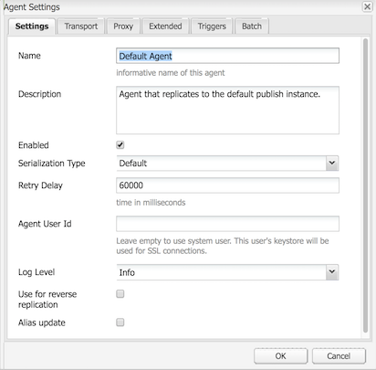

# Replicación{#replication}

Los agentes de replicación son fundamentales para Adobe Experience Manager (AEM) como mecanismo utilizado para:

* [Publique (active)](/help/sites-authoring/publishing-pages.md#activatingcontent)  contenido de un autor en un entorno de publicación.
* Vacíe explícitamente el contenido de la caché de Dispatcher.
* Devolver los datos introducidos por el usuario (por ejemplo, los datos introducidos en el formulario) desde el entorno de publicación al entorno de creación (bajo el control del entorno de creación).

Las solicitudes están [en cola](/help/sites-deploying/osgi-configuration-settings.md#apacheslingjobeventhandler) al agente apropiado para su procesamiento.

>[!NOTE]
>
>Los datos de usuario (usuarios, grupos de usuarios y perfiles de usuario) no se replican entre instancias de autor y publicación.
>
>Para varias instancias de publicación, los datos de usuario se distribuyen en Sling cuando [Sincronización de usuarios](/help/sites-administering/sync.md) está habilitada.

## Replicar desde autor para publicar {#replicating-from-author-to-publish}

La replicación, para una instancia de publicación o Dispatcher, se realiza en varios pasos:

* el autor solicita la publicación (activación) de cierto contenido; esto se puede iniciar mediante una solicitud manual o mediante déclencheur automáticos que se hayan preconfigurado.
* la solicitud se pasa al agente de replicación predeterminado apropiado; un entorno puede tener varios agentes predeterminados que siempre se seleccionan para estas acciones.
* el agente de replicación &quot;empaqueta&quot; el contenido y lo coloca en la cola de replicación.
* en la ficha Sitios web , se establece el [indicador de estado de color](/help/sites-authoring/publishing-pages.md#determiningpagepublicationstatus) para las páginas individuales.
* el contenido se levanta de la cola y se transporta al entorno de publicación mediante el protocolo configurado; normalmente es HTTP.
* un servlet en el entorno de publicación recibe la solicitud y publica el contenido recibido; el servlet predeterminado es `https://localhost:4503/bin/receive`.

* se pueden configurar varios entornos de autor y publicación.

### Duplicación de Publicar en Autor {#replicating-from-publish-to-author}

Algunas funciones permiten a los usuarios introducir datos en una instancia de publicación.

En algunos casos, se necesita un tipo de replicación conocido como replicación inversa, para devolver estos datos al entorno de creación desde donde se redistribuyen a otros entornos de publicación. Debido a consideraciones de seguridad, cualquier tráfico desde la publicación al entorno de creación debe estar estrictamente controlado.

La replicación inversa utiliza un agente en el entorno de publicación que hace referencia al entorno de creación. Este agente coloca los datos en una bandeja de salida. Esta bandeja de salida se compara con los oyentes de replicación en el entorno de creación. Los oyentes sondean las bandejas de salida para recopilar los datos introducidos y luego distribuirlos según sea necesario. Esto garantiza que el entorno de creación controle todo el tráfico.

En otros casos, como en el caso de las funciones de Communities (por ejemplo, foros, blogs, comentarios y revisiones), la cantidad de contenido generado por el usuario (UGC) que se introduce en el entorno de publicación es difícil de sincronizar de forma eficaz en todas las instancias de AEM mediante la replicación.

AEM [Communities](/help/communities/overview.md) nunca utiliza la replicación para UGC. En su lugar, la implementación para Communities requiere un almacén común para UGC (consulte [Almacenamiento de contenido de la comunidad](/help/communities/working-with-srp.md)).

### Replicación: lista para usar {#replication-out-of-the-box}

El sitio web de venta minorista que se incluye en una instalación estándar de AEM puede utilizarse para ilustrar la replicación.

Para seguir este ejemplo y utilizar los agentes de replicación predeterminados debe [Instalar AEM](/help/sites-deploying/deploy.md) con:

* el entorno de creación en el puerto `4502`
* el entorno de publicación en el puerto `4503`

>[!NOTE]
>
>Habilitado de manera predeterminada :
>
>* Agentes en el autor : Agente predeterminado (publicar)
>
>
Efectivamente desactivado de forma predeterminada (a partir de AEM 6.1) :
>
>* Agentes en el autor : Agente de replicación inversa (publish_reverse)
>* Agentes en la publicación : Replicación inversa (buzón de salida)

>
>
Para comprobar el estado del agente o de la cola, utilice la consola **Tools**.
>Consulte [Monitorización de los agentes de replicación](#monitoring-your-replication-agents).

#### Replicación (autor para publicación) {#replication-author-to-publish}

1. Vaya a la página de asistencia técnica del entorno de creación.
   **https://localhost:4502/content/we-retail/us/en/experience.html** `<pi>`
1. Edite la página para agregar texto nuevo.
1. **Active** Página para publicar los cambios.
1. Abra la página de asistencia en el entorno de publicación:
   **https://localhost:4503/content/we-retail/us/en/experience.html**
1. Ahora puede ver los cambios introducidos en el autor.

Esta replicación se procesa desde el entorno de creación mediante:

* **Agente predeterminado (publicación)**
Este agente replica el contenido en la instancia de publicación predeterminada.
Se puede acceder a los detalles de esto (configuración y registros) desde la consola Herramientas del entorno de creación. o:

   `https://localhost:4502/etc/replication/agents.author/publish.html`.

#### Agentes de replicación: lista para usar {#replication-agents-out-of-the-box}

Los siguientes agentes están disponibles en una instalación AEM estándar:

* [Agente ](#replication-author-to-publish)
predeterminadoSe utiliza para replicar de autor a publicación.

* Vaciado de Dispatcher
Se utiliza para administrar la caché de Dispatcher. Consulte [Invalidación de la caché de Dispatcher desde el entorno de creación](https://helpx.adobe.com/experience-manager/dispatcher/using/page-invalidate.html#invalidating-dispatcher-cache-from-the-authoring-environment) y [Invalidación de la caché de Dispatcher desde una instancia de publicación](https://helpx.adobe.com/experience-manager/dispatcher/using/page-invalidate.html#invalidating-dispatcher-cache-from-a-publishing-instance) para obtener más información.

* [Replicación ](#reverse-replication-publish-to-author)
inversaSe utiliza para replicar desde la publicación hasta el autor. La replicación inversa no se utiliza para características de Communities, como foros, blogs y comentarios. Está deshabilitada de forma efectiva, ya que la bandeja de salida no está habilitada. El uso de la replicación inversa requeriría una configuración personalizada.

* Agente estático
Este es un &quot;Agente que almacena una representación estática de un nodo en el sistema de archivos&quot;.
Por ejemplo, con la configuración predeterminada, las páginas de contenido y los recursos DAM se almacenan en `/tmp` como HTML o con el formato de recurso adecuado. Consulte las pestañas `Settings` y `Rules` para ver la configuración.
Esto se solicitó para que cuando la página se solicite directamente desde el servidor de aplicaciones, se pueda ver el contenido. Se trata de un agente especializado y (probablemente) no será necesario en la mayoría de los casos.

## Agentes de replicación: Parámetros de configuración {#replication-agents-configuration-parameters}

Al configurar un agente de replicación desde la consola Herramientas , hay cuatro pestañas disponibles en el cuadro de diálogo:

### Configuración {#settings}

* **Nombre**

   Un nombre único para el agente de replicación.

* **Descripción**

   Descripción del propósito que servirá este agente de replicación.

* **Activado**

   Indica si el agente de replicación está habilitado actualmente.

   Cuando el agente esté **habilitado**, la cola se mostrará de la siguiente manera:

   * **** Se activa cuando se procesan elementos.
   * **** Indica si la cola está vacía.
   * **** Bloqueado cuando los elementos están en cola, pero no se pueden procesar; por ejemplo, cuando la cola de recepción está desactivada.

* **Tipo de serialización**

   Tipo de serialización:

   * **Predeterminado**: Se establece si el agente se va a seleccionar automáticamente.
   * **Vaciado de Dispatcher**: Seleccione esta opción si el agente se va a usar para vaciar la caché del despachante.

* **Intervalo entre reintentos**

   El retraso (tiempo de espera en milisegundos) entre dos reintentos, en caso de que se encuentre un problema.

   Valor predeterminado: `60000`

* **ID de usuario agente**

   Según el entorno, el agente utilizará esta cuenta de usuario para:

   * recopilar y empaquetar el contenido del entorno de creación
   * crear y escribir el contenido en el entorno de publicación

   Deje este campo vacío para utilizar la cuenta de usuario del sistema (la cuenta definida en sling como usuario administrador; de forma predeterminada, es `admin`).

   >[!CAUTION]
   >
   >Para un agente en el entorno de creación, esta cuenta *debe* tener acceso de lectura a todas las rutas que desee duplicar.

   >[!CAUTION]
   >
   >Para un agente en el entorno de publicación, esta cuenta *debe* tener el acceso de creación y escritura necesario para replicar el contenido.

   >[!NOTE]
   >
   >Se puede utilizar como mecanismo para seleccionar contenido específico para la replicación.

* **Nivel de registro**

   Especifica el nivel de detalle que se utilizará para los mensajes de registro.

   * `Error`: solo se registrarán errores
   * `Info`: se registrarán errores, advertencias y otros mensajes informativos
   * `Debug`: se utilizará un alto nivel de detalle en los mensajes, principalmente con fines de depuración

   Valor predeterminado: `Info`

* **Utilizar para replicación inversa**

   Indica si este agente se utilizará para la replicación inversa; devuelve los datos introducidos por el usuario desde la publicación al entorno de creación.

* **Actualización de alias**

   Al seleccionar esta opción, se habilitarán las solicitudes de invalidación de alias o de ruta de vanidad en Dispatcher. Consulte también [Configuración de un agente de vaciado de Dispatcher](/help/sites-deploying/replication.md#configuring-a-dispatcher-flush-agent).

#### Transporte {#transport}

* **URI**

   Esto especifica el servlet receptor en la ubicación de destino. En concreto, puede especificar aquí el nombre de host (o alias) y la ruta de contexto a la instancia de destino.

   Por ejemplo:

   * Un agente predeterminado puede replicarse en `https://localhost:4503/bin/receive`
   * Un agente de vaciado de Dispatcher puede replicarse en `https://localhost:8000/dispatcher/invalidate.cache`

   El protocolo especificado aquí (HTTP o HTTPS) determinará el método de transporte.

   Para los agentes de vaciado de Dispatcher, la propiedad URI solo se utiliza si utiliza entradas de host virtual basadas en rutas para diferenciar entre granjas, utilice este campo para dirigirse a la granja para invalidar. Por ejemplo, la granja n.º 1 tiene un host virtual de `www.mysite.com/path1/*` y la granja n.º 2 tiene un host virtual de `www.mysite.com/path2/*`. Puede utilizar una URL de `/path1/invalidate.cache` para dirigirse al primer conjunto de servidores y `/path2/invalidate.cache` para dirigirse al segundo conjunto de servidores.

* **Usuario**

   Nombre de usuario de la cuenta que se usará para acceder al objetivo.

* **Contraseña**

   Contraseña de la cuenta que se utilizará para acceder al objetivo.

* **Dominio NTLM**

   Dominio para autenticación NTML.

* **Host NTLM**

   Host para autenticación NTML.

* **Habilitar SSL relajado**

   Active esta opción si desea que se acepten certificados SSL autocertificados.

* **Permitir certificados caducados**

   Habilitar si desea que se acepten certificados SSL caducados.

#### Proxy {#proxy}

Los siguientes ajustes solo son necesarios si se necesita un proxy:

* **Host de proxy**

   Nombre del host del proxy utilizado para el transporte.

* **Puerto de proxy**

   Puerto del proxy.

* **Usuario de proxy**

   Nombre de usuario de la cuenta que se va a utilizar.

* **Contraseña de proxy**

   Contraseña de la cuenta que se va a utilizar.

* **Dominio NTLM de proxy**

   El dominio NTLM de proxy.

* **Host NTLM de proxy**

   El dominio NTLM de proxy.

#### Ampliado {#extended}

* **Interfaz**

   Aquí puede definir la interfaz de socket a la que se va a enlazar.

   Esto establece la dirección local que se utilizará al crear conexiones. Si no se configura, se utilizará la dirección predeterminada. Esto resulta útil para especificar la interfaz que se utilizará en los sistemas agrupados o de múltiples hogares.

* **Método HTTP**

   El método HTTP que se va a utilizar.

   Para un agente de vaciado de Dispatcher, esto es casi siempre GET y no debe cambiarse (el POST sería otro valor posible).

* **Encabezados HTTP**

   Se utilizan para los agentes de vaciado de Dispatcher y especifican los elementos que deben vaciarse.

   Para un agente de vaciado de Dispatcher, las tres entradas estándar no deben tener que cambiar:

   * `CQ-Action:{action}`
   * `CQ-Handle:{path}`
   * `CQ-Path:{path}`

   Se utilizan, según proceda, para indicar la acción que debe utilizarse al vaciar el controlador o la ruta. Los subparámetros son dinámicos:

   * `{action}` indica una acción de replicación

   * `{path}` indica una ruta

   Se sustituyen por la ruta/acción relevante a la solicitud y, por lo tanto, no necesitan estar &quot;codificados&quot;:

   >[!NOTE]
   >
   >Si ha instalado AEM en un contexto que no sea el predeterminado recomendado, deberá registrar el contexto en los encabezados HTTP. Por ejemplo:
   >`CQ-Handle:/<*yourContext*>{path}`

* **Cerrar conexión**

   Active esta opción para cerrar la conexión después de cada solicitud.

* **Tiempo de espera de conexión**

   Tiempo de espera (en milisegundos) que se debe aplicar al intentar establecer una conexión.

* **Tiempo de espera de socket**

   Tiempo de espera (en milisegundos) que se debe aplicar al esperar tráfico después de establecer una conexión.

* **Versión del protocolo**

   Versión del protocolo; por ejemplo, `1.0` para HTTP/1.0.

#### Desencadenadores {#triggers}

Estos ajustes se utilizan para definir déclencheur para la replicación automatizada:

* **Omitir predeterminado**

   Si se selecciona, el agente se excluye de la replicación predeterminada; esto significa que no se utilizará si un autor de contenido emite una acción de replicación.

* **En la modificación**

   En este caso, la replicación de este agente se activará automáticamente cuando se modifique una página. Esto se utiliza principalmente para los agentes de vaciado de Dispatcher, pero también para la replicación inversa.

* **En distribución**

   Si se selecciona, el agente replicará automáticamente cualquier contenido que esté marcado para su distribución cuando se modifique.

* **Tiempo de activación/desactivación alcanzado**

   Esto déclencheur la replicación automática (para activar o desactivar una página según corresponda) cuando se produzcan las veces u horas de inactividad definidas para una página. Se utiliza principalmente para agentes de vaciado de Dispatcher.

* **En estado de recepción**

   Si se selecciona, el agente replicará en cadena cada vez que reciba eventos de replicación.

* **No hay actualización de estado**

   Cuando se selecciona, el agente no fuerza una actualización del estado de replicación.

* **No hay asignación de versiones**

   Cuando se selecciona, el agente no fuerza el control de versiones de páginas activadas.

## Configuración de los agentes de replicación {#configuring-your-replication-agents}

Para obtener información sobre la conexión de agentes de replicación a la instancia de publicación mediante MSSL, consulte [Replicating Using Mutual SSL](/help/sites-deploying/mssl-replication.md).

### Configuración de los agentes de replicación desde el entorno de creación {#configuring-your-replication-agents-from-the-author-environment}

Desde la pestaña Herramientas del entorno de creación puede configurar los agentes de replicación que residen en el entorno de creación (**Agents on author**) o en el entorno de publicación (**Agents on publish**). Los siguientes procedimientos ilustran la configuración de un agente para el entorno de creación, pero se puede utilizar para ambos.

>[!NOTE]
>
>Cuando un despachante gestiona solicitudes HTTP para instancias de autor o publicación, la solicitud HTTP del agente de replicación debe incluir el encabezado PATH. Además del siguiente procedimiento, debe añadir el encabezado PATH a la lista de dispatcher de encabezados de cliente. (Consulte [/encabezados de cliente (encabezados de cliente)](https://helpx.adobe.com/experience-manager/dispatcher/using/dispatcher-configuration.html#specifying-the-http-headers-to-pass-through-clientheaders). 

1. Acceda a la pestaña **Tools** en AEM.
1. Haga clic en **Replicación** (panel izquierdo para abrir la carpeta).
1. Haga doble clic en **Agentes del autor** (a la izquierda o al panel derecho).
1. Haga clic en el nombre del agente correspondiente (que es un vínculo) para mostrar información detallada sobre ese agente.
1. Haga clic en **Editar** para abrir el cuadro de diálogo de configuración:

   

1. Los valores proporcionados deben ser suficientes para una instalación predeterminada. Si realiza cambios, haga clic en **OK** para guardarlos (consulte [Agentes de replicación - Parámetros de configuración](#replication-agents-configuration-parameters) para obtener más información sobre los parámetros individuales).

>[!NOTE]
>
>Una instalación estándar de AEM especifica `admin` como usuario para las credenciales de transporte dentro de los agentes de replicación predeterminados.
>
>Esto debe cambiarse a una cuenta de usuario de replicación específica del sitio con privilegios para replicar las rutas requeridas.

### Configuración de la replicación inversa {#configuring-reverse-replication}

La duplicación inversa se utiliza para devolver el contenido del usuario generado en una instancia de publicación a una instancia de autor. Esto suele utilizarse para funciones como encuestas y formularios de registro.

Por motivos de seguridad, la mayoría de las topologías de red no permiten conexiones *desde* la &quot;Zona desmilitarizada&quot; (una subred que expone los servicios externos a una red de confianza como Internet).

Como el entorno de publicación suele estar en la DMZ, para recuperar contenido del entorno de creación, la conexión debe iniciarse desde la instancia de autor. Esto se hace con:

* una *bandeja de salida* en el entorno de publicación donde se coloca el contenido.
* un agente (publicar) en el entorno de creación que sondea periódicamente la bandeja de salida para buscar contenido nuevo.

>[!NOTE]
>
>Para AEM [Communities](/help/communities/overview.md), la replicación no se utiliza para el contenido generado por el usuario en una instancia de publicación. Consulte [Almacenamiento de contenido de la comunidad](/help/communities/working-with-srp.md).

Para ello, necesita:

**Un agente de replicación inversa en el** entorno de creaciónActúa como el componente activo para recopilar información de la bandeja de salida en el entorno de publicación:

Si desea utilizar la replicación inversa, asegúrese de que este agente esté activado.

**Un agente de replicación inversa en el entorno de publicación (una bandeja de salida)** Este es el elemento pasivo, ya que actúa como una &quot;bandeja de salida&quot;. La entrada del usuario se coloca aquí, desde donde el agente la recopila en el entorno de creación.

### Configuración de la replicación para varias instancias de publicación {#configuring-replication-for-multiple-publish-instances}

>[!NOTE]
>
>Solo se replica el contenido: los datos de usuario no (usuarios, grupos de usuarios y perfiles de usuario).
>
>Para sincronizar los datos de usuario en varias instancias de publicación, habilite [Sincronización de usuarios](/help/sites-administering/sync.md).

Tras la instalación, ya se ha configurado un agente predeterminado para la replicación de contenido en una instancia de publicación que se ejecuta en el puerto 4503 del host local.

Para configurar la replicación del contenido para una instancia de publicación adicional, debe crear y configurar un nuevo agente de replicación:

1. Abra la pestaña **Tools** en AEM.
1. Seleccione **Replicación** y, a continuación, **Agentes del autor** en el panel izquierdo.
1. Seleccione **Nuevo...**.
1. Establezca los **Title** y **Name** y, a continuación, seleccione **Replication Agent**.
1. Haga clic en **Crear** para crear el nuevo agente.
1. Haga doble clic en el nuevo elemento del agente para abrir el panel de configuración.
1. Haga clic en **Editar**: se abrirá el cuadro de diálogo **Configuración del agente**: el **Tipo de serialización** ya está definido como Predeterminado, debe permanecer así.

   * En la pestaña **Settings**:

      * Activar **Habilitado**.
      * Especificar una **Descripción**.
      * Establezca el **Retraso de reintento** en `60000`.

      * Deje **Serialization Type** como `Default`.
   * En la pestaña **Transport**:

      * Introduzca el URI necesario para la nueva instancia de publicación; por ejemplo,
         `https://localhost:4504/bin/receive`.

      * Introduzca la cuenta de usuario específica del sitio que se utiliza para la replicación.
      * Puede configurar otros parámetros según sea necesario.

1. Haga clic en **OK** para guardar la configuración.

A continuación, puede probar la operación actualizando y publicando una página en el entorno de creación.

Las actualizaciones aparecerán en todas las instancias de publicación que se hayan configurado como se ha indicado anteriormente.

Si tiene algún problema, puede comprobar los registros de la instancia de autor. Según el nivel de detalle requerido, también puede establecer el **Nivel de registro** en `Debug` mediante el cuadro de diálogo **Configuración del agente** como se ha indicado anteriormente.

>[!NOTE]
>
>Esto se puede combinar con el uso del [ID de usuario del agente](#agentuserid) para seleccionar contenido diferente para replicarlo en los entornos de publicación individuales. Para cada entorno de publicación:
>
>1. Configure un agente de replicación para replicarlo en ese entorno de publicación.
>1. Configurar una cuenta de usuario; con los derechos de acceso requeridos para leer el contenido que se replicará en ese entorno de publicación específico.
>1. Asigne la cuenta de usuario como **Agent User Id** para el agente de replicación.

>

### Configuración de un agente de vaciado de Dispatcher {#configuring-a-dispatcher-flush-agent}

Los agentes predeterminados se incluyen en la instalación. Sin embargo, sigue siendo necesaria cierta configuración y lo mismo se aplica si está definiendo un nuevo agente:

1. Abra la pestaña **Tools** en AEM.
1. Haga clic en **Deployment**.
1. Seleccione **Replication** y luego **Agents on publish**.
1. Haga doble clic en el elemento **Dispatcher Flush** para abrir la descripción general.
1. Haga clic en **Editar**: se abrirá el cuadro de diálogo **Configuración del agente**:

   * En la pestaña **Settings**:

      * Activar **Habilitado**.
      * Especificar una **Descripción**.
      * Deje **Serialization Type** como `Dispatcher Flush` o configúrelo como tal si crea un nuevo agente.

      * (opcional) Seleccione **Alias update** para habilitar las solicitudes de invalidación de alias o ruta de vanidad en Dispatcher.
   * En la pestaña **Transport**:

      * Introduzca el URI necesario para la nueva instancia de publicación; por ejemplo,
         `https://localhost:80/dispatcher/invalidate.cache`.

      * Introduzca la cuenta de usuario específica del sitio que se utiliza para la replicación.
      * Puede configurar otros parámetros según sea necesario.

   Para los agentes de vaciado de Dispatcher, la propiedad URI solo se utiliza si utiliza entradas de host virtual basadas en rutas para diferenciar entre granjas, utilice este campo para dirigirse a la granja para invalidar. Por ejemplo, la granja n.º 1 tiene un host virtual de `www.mysite.com/path1/*` y la granja n.º 2 tiene un host virtual de `www.mysite.com/path2/*`. Puede utilizar una URL de `/path1/invalidate.cache` para dirigirse al primer conjunto de servidores y `/path2/invalidate.cache` para dirigirse al segundo conjunto de servidores.

   >[!NOTE]
   >
   >Si ha instalado AEM en un contexto distinto al predeterminado recomendado, debe configurar los [encabezados HTTP](#extended) en la pestaña **Extended**.

1. Haga clic en **Aceptar** para guardar los cambios.
1. Vuelva a la pestaña **Tools**, desde aquí puede **Activate** el agente **Dispatcher Flush** (**Agents on publish**).

El agente de replicación **Dispatcher Flush** no está activo en el autor. Puede acceder a la misma página en el entorno de publicación utilizando el URI equivalente; por ejemplo, `https://localhost:4503/etc/replication/agents.publish/flush.html`.

### Control del acceso a los agentes de replicación {#controlling-access-to-replication-agents}

El acceso a las páginas utilizadas para configurar los agentes de replicación se puede controlar mediante el uso de permisos de página de usuario o grupo en el nodo `etc/replication`.

>[!NOTE]
>
>La configuración de estos permisos no afectará a los usuarios que replicen contenido (por ejemplo, desde la consola Sitios web o la opción de la barra de tareas). El marco de replicación no utiliza la &quot;sesión de usuario&quot; del usuario actual para acceder a los agentes de replicación al replicar páginas.

### Configuración de los agentes de replicación del CRXDE Lite {#configuring-your-replication-agents-from-crxde-lite}

>[!NOTE]
>
>La creación de agentes de replicación solo se admite en la ubicación del repositorio `/etc/replication`. Esto es necesario para que las ACL asociadas se gestionen correctamente. La creación de un agente de replicación en otra ubicación del árbol puede dar lugar a un acceso no autorizado.

Se pueden configurar varios parámetros de los agentes de replicación mediante CRXDE Lite.

Si se desplaza a `/etc/replication` puede ver los tres nodos siguientes:

* `agents.author`
* `agents.publish`
* `treeactivation`

Los dos `agents` contienen información de configuración sobre el entorno apropiado y solo están activos cuando ese entorno se está ejecutando. Por ejemplo, `agents.publish` solo se utilizará en el entorno de publicación. La siguiente captura de pantalla muestra el agente de publicación en el entorno de creación, tal como se incluye con AEM WCM:

## Monitorización de los agentes de replicación {#monitoring-your-replication-agents}

Para monitorizar un agente de replicación:

1. Acceda a la pestaña **Tools** en AEM.
1. Haga clic en **Replicación**.
1. Haga doble clic en el vínculo a los agentes para el entorno adecuado (panel izquierdo o derecho); por ejemplo **Agentes en author**.

   La ventana resultante muestra una visión general de todos sus agentes de replicación para el entorno de creación, incluidos su destino y estado.

1. Haga clic en el nombre de agente apropiado (que es un vínculo) para mostrar información detallada sobre ese agente:

   

   Aquí puede hacer lo siguiente:

   * Compruebe si el agente está habilitado.
   * Consulte el destino de cualquier replicación.
   * Compruebe si la cola de replicación está activa (habilitada) actualmente.
   * Compruebe si hay algún elemento en la cola.
   * **** Actualizar o  **** Borrar para actualizar la visualización de las entradas de la cola; esto le ayuda a ver los elementos que entran y salen de la cola.

   * **Consulte** Logs para acceder al registro de cualquier acción del agente de replicación.
   * **Probar** conexión con la instancia de destino.
   * **Forzar** Reintento en cualquier elemento de cola si es necesario.

   >[!CAUTION]
   >
   >No utilice el vínculo &quot;Probar conexión&quot; para el buzón de salida de replicación inversa en una instancia de publicación.
   >
   >
   >Si se realiza una prueba de replicación para una cola de Outbox, todos los elementos que sean más antiguos que la replicación de prueba se reprocesarán con cada replicación inversa.
   >
   >
   >Si estos elementos ya existen en una cola, se pueden encontrar con la siguiente consulta XPath JCR y se deben eliminar.
   >
   >
   >`/jcr:root/var/replication/outbox//*[@cq:repActionType='TEST']`

## Replicación por lotes {#batch-replication}

La replicación por lotes no replica páginas o recursos individuales, pero espera el primer umbral de los dos, en función del tiempo o el tamaño, que se activará.

Luego empaqueta todos los elementos de replicación en un paquete, que luego se replica como un solo archivo al editor.

El editor descomprimirá todos los elementos, los guardará y devolverá un informe al autor.

### Configuración de la replicación por lotes {#configuring-batch-replication}

1. Ir a `http://serveraddress:serverport/siteadmin`
1. Presione el icono **[!UICONTROL Tools]** en la parte superior de la pantalla
1. Desde el carril de navegación del lado izquierdo, vaya a **[!UICONTROL Replicación - Agentes en Autor]** y haga doble clic en **[!UICONTROL Agente predeterminado]**.
   * También puede llegar al agente de replicación de publicación predeterminado accediendo directamente a `http://serveraddress:serverport/etc/replication/agents.author/publish.html`
1. Presione el botón **[!UICONTROL Edit]** sobre la cola de replicación.
1. En la siguiente ventana, vaya a la pestaña **[!UICONTROL Batch]**:
   
1. Configure el agente.

### Parámetros {#parameters}

* `[!UICONTROL Enable Batch Mode]` - activa o desactiva el modo de replicación por lotes
* `[!UICONTROL Max Wait Time]` - Tiempo de espera máximo hasta que se inicia una solicitud por lotes, en segundos. El valor predeterminado es de 2 segundos.
* `[!UICONTROL Trigger Size]` - Inicia la replicación por lotes cuando este límite de tamaño

## Recursos adicionales {#additional-resources}

Para obtener más información sobre la solución de problemas, puede leer la página [Resolución de problemas de replicación](/help/sites-deploying/troubleshoot-rep.md).