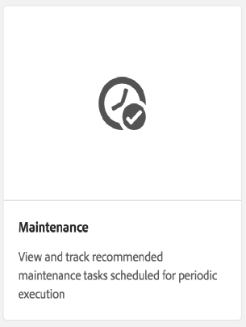

# Limpieza de revisión{#revision-cleanup}

## Introducción {#introduction}

Cada actualización al repositorio crea una nueva revisión de contenido. Como resultado, con cada actualización crece el tamaño del repositorio. Para evitar el crecimiento incontrolado del repositorio, es necesario limpiar las antiguas revisiones para liberar recursos de disco. Esta funcionalidad de mantenimiento se denomina Limpieza de revisión. Ha estado disponible como rutina sin conexión desde AEM 6.0.

Con AEM 6.3 se introdujo una versión en línea de esta funcionalidad denominada Limpieza de revisión en línea. En comparación con la limpieza de revisión sin conexión, donde la instancia de AEM debe cerrarse, la limpieza de revisión en línea puede ejecutarse mientras la instancia de AEM esté en línea. La limpieza de revisión en línea está activada de forma predeterminada y es la forma recomendada de realizar una limpieza de revisión.

**Nota**: [Consulte el vídeo](https://helpx.adobe.com/experience-manager/kt/platform-repository/using/revision-cleanup-technical-video-use.html) para obtener una introducción y cómo utilizar la limpieza de revisión en línea.

El proceso de limpieza de revisión consta de tres fases: **estimación**, **compactación** y **limpieza**. La estimación determina si se ejecutará la siguiente fase (compactación) o no en función de la cantidad de elementos no utilizados que se pueda recopilar. Durante la fase de compactación, los segmentos y los archivos tar se reescriben dejando fuera el contenido no utilizado. La fase de limpieza elimina posteriormente los segmentos antiguos, incluyendo cualquier elemento que pueda contener. El modo sin conexión generalmente puede recuperar más espacio, ya que el modo en línea debe tener en cuenta el conjunto de trabajo de AEM, que evita que se recopilen segmentos adicionales.

Para obtener más información sobre la limpieza de revisión, consulte los siguientes vínculos:

* [Cómo ejecutar la limpieza de revisión en línea](/help/sites-deploying/revision-cleanup.md#how-to-run-online-revision-cleanup)
* [Preguntas más frecuentes sobre la limpieza de revisiones en línea](/help/sites-deploying/revision-cleanup.md#online-revision-cleanup-frequently-asked-questions)
* [Cómo ejecutar la limpieza de revisiones sin conexión](/help/sites-deploying/revision-cleanup.md#how-to-run-offline-revision-cleanup)

Además, también puede leer la documentación [oficial de Oak.](https://jackrabbit.apache.org/oak/docs/nodestore/segment/overview.html)

### ¿Cuándo utilizar la limpieza de revisión en línea en lugar de la limpieza de revisión sin conexión? {#when-to-use-online-revision-cleanup-as-opposed-to-offline-revision-cleanup}

**Limpieza de revisión en línea es la manera recomendada de realizar una limpieza de revisión.** La limpieza de revisión sin conexión solo debe utilizarse con carácter excepcional, por ejemplo, antes de migrar al nuevo formato de almacenamiento o si el Servicio de atención al cliente de Adobe le solicita que lo haga.

## Cómo ejecutar la limpieza de revisión en línea {#how-to-run-online-revision-cleanup}

La limpieza de revisión en línea está configurada de forma predeterminada para ejecutarse automáticamente una vez al día en las instancias de AEM Author y Publish. Todo lo que necesita hacer es definir la ventana de mantenimiento durante un período con la menor actividad del usuario. Puede configurar la tarea Limpieza de revisión en línea de la siguiente manera:

1. En la ventana principal de AEM, vaya a **Herramientas - Operaciones - Tablero - Mantenimiento** o diríjase al navegador para: `https://serveraddress:serverport/libs/granite/operations/content/maintenance.html`

   

1. Pase el ratón sobre la ventana **de mantenimiento** diario y haga clic en el icono **Configuración** .

   

1. Introduzca los valores deseados (periodicidad, hora de inicio y hora de finalización) y haga clic en **Guardar**.

   

También puede:

1. Vaya a **Herramientas - Operaciones - Tablero - Mantenimiento** o navegue directamente a `https://serveraddress:serverport/libs/granite/operations/content/maintenance.html`
1. Haga clic en la ventana **Mantenimiento** diario.
1. Pase el ratón sobre el icono **Revision Cleanup** (Limpieza de revisión).
1. Haga clic en **Ejecutar**.

   

### Ejecución de la limpieza de revisión en línea después de la limpieza de revisión sin conexión {#running-online-revision-cleanup-after-offline-revision-cleanup}

El proceso de limpieza de revisión recupera las viejas revisiones por generaciones. Esto significa que cada vez que ejecute la limpieza de revisión, se crea una nueva generación y se mantiene en el disco. Sin embargo, hay una diferencia entre los dos tipos de limpieza de revisión: la limpieza de revisión sin conexión mantiene una generación mientras que la limpieza de revisión en línea mantiene dos generaciones. Por lo tanto, cuando ejecuta la limpieza de revisión en línea **después** de la limpieza de revisión sin conexión, sucede lo siguiente:

1. Después de ejecutar la primera limpieza de revisión en línea, el repositorio tendrá un tamaño doble. Esto sucede porque ahora hay dos generaciones que se mantienen en disco.
1. Durante las ejecuciones posteriores, el repositorio crecerá temporalmente mientras se crea la nueva generación y, a continuación, se estabilizará de nuevo hasta el tamaño que tenía después de la primera ejecución, a medida que el proceso de limpieza de revisión en línea reclame la generación anterior.

Además, tenga en cuenta que, según el tipo y el número de confirmaciones, cada generación puede variar en tamaño en comparación con la anterior, de modo que el tamaño final puede variar de una ejecución a la otra.

Debido a este hecho, se recomienda ajustar el tamaño del disco al menos dos o tres veces más grande que el tamaño del repositorio estimado inicialmente.

## Modos De Compactación Completa Y De Cola {#full-and-tail-compaction-modes}

**AEM 6.5** presenta **dos nuevos modos** para la fase de **compactación** del proceso de limpieza de revisión en línea:

* El modo de compactación **completa** reescribe todos los segmentos y archivos tar en todo el repositorio. La siguiente fase de limpieza puede eliminar la cantidad máxima de elementos no utilizados en el repositorio. Dado que la plena compactación afecta a todo el repositorio, se requiere una considerable cantidad de recursos del sistema y tiempo para completarse. La compactación completa corresponde a la fase de compactación en AEM 6.3.
* El modo de compactación **cola** sólo reescribe los segmentos y archivos tar más recientes del repositorio. Los segmentos y archivos tar más recientes son los que se han agregado desde la última vez, ya sea la compactación completa o la compactación final ejecutada. La fase de limpieza subsiguiente sólo puede eliminar la basura contenida en la parte reciente del repositorio. Dado que la compactación de cola sólo afecta a una parte del repositorio, requiere considerablemente menos tiempo y recursos del sistema para completar que la compactación completa.

Estos modos de compactación constituyen una compensación entre la eficiencia y el consumo de recursos: aunque la compactación de cola es menos efectiva, también tiene menos impacto en el funcionamiento normal del sistema. Por el contrario, la compactación completa es más efectiva pero tiene un mayor impacto en el funcionamiento normal del sistema.

AEM 6.5 también introduce un mecanismo de desduplicación de contenido más eficaz durante la compactación, lo que reduce aún más el espacio en disco del repositorio.

Los dos gráficos que figuran a continuación presentan los resultados de las pruebas internas de laboratorio que ilustran la reducción de los tiempos de ejecución promedio y del espacio medio en disco en AEM 6.5 en comparación con AEM 6.3:

 

### Cómo configurar la compactación completa y de cola {#how-to-configure-full-and-tail-compaction}

La configuración predeterminada ejecuta la compactación de cola en días de semana y la compactación completa los domingos. La configuración predeterminada se puede cambiar usando el nuevo valor `full.gc.days` de configuración de la tarea `RevisionCleanupTask` de [](/help/sites-deploying/revision-cleanup.md#how-to-run-online-revision-cleanup)mantenimiento.

Al configurar el valor, tenga en cuenta que la compactación completa se ejecutará durante los días definidos en el valor y que la compactación final se ejecutará durante los días que no estén definidos en el valor. `full.gc.days` Por ejemplo, si configura la compactación completa para que se ejecute el domingo, la compactación final se ejecutará de lunes a sábado. Si, por ejemplo, configura la compactación completa para que se ejecute todos los días de la semana, la compactación de cola no se ejecutará en absoluto.

Además, tenga en cuenta que:

* **La compactación** de cola es menos eficaz y tiene menos impacto en las operaciones normales del sistema. Por lo tanto, está previsto que se ejecute durante los días laborables.
* **La plena compactación** es más eficaz, pero también tiene un mayor impacto en las operaciones normales del sistema. Por lo tanto, está previsto que se utilice fuera de los días laborables.
* Tanto la compactación de cola como la compactación completa deben programarse para que se ejecuten durante las horas de poca actividad.

### Solución de problemas {#troubleshooting}

Cuando utilice los nuevos modos de compactación, tenga en cuenta lo siguiente:

* Puede supervisar la actividad de entrada/salida (E/S), por ejemplo: Operaciones de E/S, CPU esperando E/S, confirmar tamaño de cola. Esto ayuda a determinar si el sistema se está convirtiendo en una conexión de E/S y requiere un ajuste de tamaño.
* El `RevisionCleanupTaskHealthCheck` indica el estado de salud general de la limpieza de revisión en línea. Funciona del mismo modo que en AEM 6.3 y no distingue entre compactación completa y compacta.
* Los mensajes de registro contienen información relevante sobre los modos de compactación. Por ejemplo, cuando se inicia la limpieza de revisión en línea, los mensajes de registro correspondientes indicarán el modo de compactación. Además, en algunos casos de esquina, el sistema volverá a la compactación completa cuando se programó para ejecutar una compactación de cola y los mensajes de registro indicarán este cambio. Las muestras de registro siguientes indican el modo de compactación y el cambio de cola a compactación completa:

```
TarMK GC: running tail compaction
TarMK GC: no base state available, running full compaction instead
```

### Limitaciones conocidas {#known-limitations}

En algunos casos, la alternancia entre los modos de cola y compactación completa retrasa el proceso de limpieza. Más precisamente, el repositorio crecerá después de una compactación completa (su tamaño se duplicará). El espacio adicional se recuperará en la siguiente compactación de cola, cuando el repositorio se colocará por debajo del tamaño de compactación anterior al completo. También deben evitarse las ejecuciones paralelas de tareas de mantenimiento.

**Se recomienda ajustar el tamaño del disco al menos dos o tres veces más grande que el tamaño del repositorio estimado inicialmente.**

## Preguntas más frecuentes sobre la limpieza de revisiones en línea {#online-revision-cleanup-frequently-asked-questions}

### Consideraciones sobre la actualización a AEM 6.5 {#aem-upgrade-considerations}

<table>
 <tbody>
  <tr>
   <td>Preguntas </td>
   <td>Respuestas</td>
  </tr>
  <tr>
   <td>¿Qué debo saber al actualizar a AEM 6.5?</td>
   <td><p>El formato de persistencia de TarMK cambiará con AEM 6.5. Estos cambios no requieren un paso de migración proactiva. Los repositorios existentes pasarán por una migración continua, que es transparente para el usuario. El proceso de migración se inicia la primera vez que AEM 6.5 (o herramientas relacionadas) accede al repositorio.</p> <p><strong>Una vez iniciada la migración al formato de persistencia de AEM 6.5, el repositorio no puede volver al formato de persistencia anterior de AEM 6.3.</strong></p> </td>
  </tr>
 </tbody>
</table>

### Migración a la barra de segmentos Oak {#migrating-to-oak-segment-tar}

<table>
 <tbody>
  <tr>
   <td><strong>Preguntas</strong></td>
   <td><strong>Respuestas</strong></td>
   <td> </td>
  </tr>
  <tr>
   <td><strong>¿Por qué debo migrar el repositorio?</strong></td>
   <td><p>En AEM 6.3 se necesitaban cambios en el formato de almacenamiento, especialmente para mejorar el rendimiento y la eficacia de la limpieza de revisión en línea. Estos cambios no son compatibles con versiones anteriores y se deben migrar los repositorios creados con el antiguo segmento Oak (AEM 6.2 y anteriores).</p> <p>Ventajas adicionales de cambiar el formato de almacenamiento:</p>
    <ul>
     <li>Mejor escalabilidad (tamaño de segmento optimizado).</li>
     <li>Faster <a href="/help/sites-administering/data-store-garbage-collection.md" target="_blank">Data Store Garbage Collection</a>.<br /> </li>
     <li>Trabajos en tierra para futuras mejoras.</li>
    </ul> </td>
   <td> </td>
  </tr>
  <tr>
   <td><strong>¿Todavía se admite el formato Tar anterior?</strong></td>
   <td>Solo AEM 6.3 admite la nueva barra de segmentos Oak.</td>
   <td> </td>
  </tr>
  <tr>
   <td><strong>¿Es siempre obligatoria la migración de contenido?</strong></td>
   <td>Sí. A menos que comience con una instancia nueva, siempre tendrá que migrar el contenido.</td>
   <td> </td>
  </tr>
  <tr>
   <td><strong>¿Puedo actualizar a 6.3 y realizar la migración más adelante (por ejemplo, con otra ventana de mantenimiento)?</strong></td>
   <td>No, como se ha explicado anteriormente, la migración de contenido es obligatoria.</td>
   <td> </td>
  </tr>
  <tr>
   <td><strong>¿Se puede evitar el downtime al migrar?</strong></td>
   <td>No. Se trata de un esfuerzo único que no se puede realizar en una instancia en ejecución.</td>
   <td> </td>
  </tr>
  <tr>
   <td><strong>¿Qué sucede si accidentalmente me ejecuto con el formato de repositorio incorrecto?</strong></td>
   <td>Si intenta ejecutar el módulo oak-segment en un repositorio oak-segment-tar (o viceversa), el inicio fallará con una excepción <em>IllegalStateException</em> con el mensaje "Formato de segmento no válido". No se dañarán los datos.</td>
   <td> </td>
  </tr>
  <tr>
   <td><strong>¿Será necesario volver a indexar los índices de búsqueda?</strong></td>
   <td>No. La migración de roak-segment a oak-segment-tar introduce cambios en el formato del contenedor. Los datos contenidos no se ven afectados y no se modificarán.</td>
   <td> </td>
  </tr>
  <tr>
   <td><strong>¿Cómo calcular mejor el espacio en disco esperado durante y después de la migración?</strong></td>
   <td>La migración equivale a volver a crear el almacén de segmentos en el nuevo formato. Esto se puede utilizar para calcular el espacio en disco adicional necesario durante la migración. Después de la migración, el almacén de segmentos antiguo se puede eliminar para recuperar espacio.</td>
   <td> </td>
  </tr>
  <tr>
   <td><strong>¿Cuál es la mejor manera de calcular la duración de la migración?</strong></td>
   <td>El rendimiento de la migración se puede mejorar considerablemente si se ejecuta la limpieza <a href="/help/sites-deploying/revision-cleanup.md#how-to-run-offline-revision-cleanup">de revisión</a> sin conexión antes de la migración. Se aconseja a todos los clientes que lo ejecuten como requisito previo del proceso de actualización. En general, la duración de la migración debe ser similar a la duración de la tarea de limpieza de revisión sin conexión, suponiendo que la tarea de limpieza de revisión sin conexión se haya ejecutado antes de la migración.</td>
   <td> </td>
  </tr>
 </tbody>
</table>

### Ejecución de la limpieza de revisión en línea {#running-online-revision-cleanup}

<table>
 <tbody>
  <tr>
   <td><strong>Preguntas</strong></td>
   <td><strong>Respuestas</strong></td>
   <td> </td>
  </tr>
  <tr>
   <td><strong>¿Con qué frecuencia se debe ejecutar Online Revision Cleanup?</strong></td>
   <td>Una vez al día. Ésta es la configuración predeterminada en el Tablero de operaciones.</td>
   <td> </td>
  </tr>
  <tr>
   <td><strong>¿Cómo puedo configurar la hora de inicio de la tarea de mantenimiento Limpieza de revisión en línea?</strong></td>
   <td>Consulte la sección <a href="/help/sites-deploying/revision-cleanup.md#how-to-run-online-revision-cleanup">Cómo ejecutar la limpieza</a> de revisión en línea. </td>
   <td> </td>
  </tr>
  <tr>
   <td><strong>¿Existe una frecuencia máxima que no debe superarse para la limpieza de revisión en línea?</strong></td>
   <td>Se recomienda ejecutar la limpieza de revisión en línea una vez al día, según la configuración predeterminada.<br /> </td>
   <td> </td>
  </tr>
  <tr>
   <td><strong>¿Cuáles son los indicadores clave que determinan la frecuencia con la que debe ejecutarse la limpieza de revisión en línea?</strong></td>
   <td>No es necesario determinar la frecuencia, ya que la limpieza de revisión en línea está configurada como tarea de mantenimiento y se ejecuta automáticamente todos los días.</td>
   <td> </td>
  </tr>
  <tr>
   <td><strong>¿Por qué la limpieza de revisión en línea no recupera ningún espacio cuando se ejecuta por primera vez?</strong></td>
   <td>Online Revision Cleanup reclama viejas revisiones por generaciones. Se genera una generación nueva cada vez que se ejecuta la limpieza de revisión. Sólo se recuperará el contenido que tiene al menos dos generaciones de antigüedad, lo que significa que en una primera carrera no hay nada que recuperar.</td>
   <td> </td>
  </tr>
  <tr>
   <td><strong>¿Por qué la primera limpieza de revisión en línea no recupera ningún espacio cuando se ejecuta después de la limpieza de revisión sin conexión?</strong></td>
   <td><p>Offline Revision Cleanup está reclamando todo menos la última generación comparada con las últimas dos generaciones para Online Revision Cleanup. En el caso de un repositorio nuevo, la limpieza de revisión en línea no recuperará ningún espacio cuando se ejecute por primera vez después de la limpieza de revisión sin conexión, ya que no hay una generación lo suficientemente antigua como para ser recuperada.</p> <p>Además, lea la sección "Ejecución de la limpieza de revisión en línea después de la limpieza de revisión sin conexión" de <a href="/help/sites-deploying/revision-cleanup.md#how-to-run-online-revision-cleanup">este capítulo</a>.</p> </td>
   <td> </td>
  </tr>
  <tr>
   <td><strong>¿Tendrían normalmente las ventanas Limpieza de revisión en línea diferentes Autor y Publicación?</strong></td>
   <td>Esto depende del horario de oficina y de los patrones de tráfico de la presencia en línea del cliente. Las ventanas de mantenimiento deben configurarse fuera de los principales tiempos de producción para permitir la mejor eficacia de limpieza. En el caso de varias instancias de AEM Publish (granja TarMK), las ventanas de mantenimiento para la limpieza de revisión en línea deben escalonarse.</td>
   <td> </td>
  </tr>
  <tr>
   <td><strong>¿Existen requisitos previos antes de ejecutar la limpieza de revisión en línea?</strong></td>
   <td><p>Limpieza de revisión en línea solo está disponible con AEM 6.3 y versiones posteriores. Además, si utiliza una versión anterior de AEM, debe migrar a la nueva barra de segmentos <a href="/help/sites-deploying/revision-cleanup.md#migrating-to-oak-segment-tar">Oak</a>.</p> </td>
   <td> </td>
  </tr>
  <tr>
   <td><strong>¿Cuáles son los factores que determinan la duración de la limpieza de revisión en línea?</strong></td>
   <td>Los factores son:<br />
    <ul>
     <li>Tamaño del repositorio</li>
     <li>Carga en el sistema (solicitudes por minuto, específicamente operaciones de escritura)</li>
     <li>Patrón de actividad (lecturas frente a escrituras)</li>
     <li>Especificaciones de hardware (rendimiento de CPU, memoria, IOPS)</li>
    </ul> </td>
   <td> </td>
  </tr>
  <tr>
   <td><strong>¿Pueden los autores seguir trabajando mientras se ejecuta la limpieza de revisión en línea?</strong></td>
   <td>Sí, la limpieza de revisión en línea puede hacer frente a escrituras simultáneas. Sin embargo, Online Revision Cleanup funciona más rápido y eficientemente sin transacciones de escritura concurrentes. Se recomienda programar la tarea de mantenimiento Limpieza de revisión en línea para un tiempo relativamente tranquilo sin mucho tráfico.</td>
   <td> </td>
  </tr>
  <tr>
   <td><strong>¿Cuáles son los requisitos mínimos de espacio en disco y memoria de pila al ejecutar la limpieza de revisión en línea?</strong></td>
   <td><p>El espacio en disco se monitorea continuamente durante la limpieza de revisión en línea. Si el espacio disponible en disco cae por debajo de un valor crítico, el proceso se cancelará. El valor crítico es el 25% del espacio de disco actual del repositorio y no se puede configurar.</p> <p><strong>Se recomienda ajustar el tamaño del disco al menos dos o tres veces más grande que el tamaño del repositorio estimado inicialmente.</strong></p> <p>Durante el proceso de limpieza, se monitorea continuamente el espacio libre en la pila. Si el espacio libre del montón cae por debajo de un valor crítico, el proceso se cancela. El valor crítico se configura mediante org.apache.jackrabbit.oak.segment.SegmentNodeStoreService#MEMORY_THRESHOLD. El valor predeterminado es 15%.</p> <p>Las recomendaciones para el tamaño mínimo del montón de compactación no están separadas de las recomendaciones de tamaño de la memoria AEM. Como norma general: <strong>Si el tamaño de una instancia de AEM es lo suficientemente grande como para hacer frente a los casos de uso y la carga útil esperada, el proceso de limpieza obtendrá suficiente memoria.</strong></p> </td>
   <td> </td>
  </tr>
  <tr>
   <td><strong>¿Cuál es el impacto esperado en el rendimiento al ejecutar la limpieza de revisión en línea?</strong></td>
   <td>Limpieza de revisión en línea es un proceso en segundo plano que lee y escribe en el repositorio al mismo tiempo que las operaciones normales del sistema. En particular, podría necesitar adquirir acceso exclusivo al repositorio durante un breve período de tiempo, evitando que otros hilos se escriban en el repositorio.</td>
   <td> </td>
  </tr>
  <tr>
   <td><strong>¿Cuánto tiempo se espera que se ejecute la limpieza de revisión en línea?</strong></td>
   <td>No debe tardar más de dos horas en ejecutarse según las últimas pruebas de rendimiento que hemos realizado internamente.</td>
   <td> </td>
  </tr>
  <tr>
   <td><strong>¿Qué debe hacerse si la limpieza de revisión en línea tarda más?</strong></td>
   <td>
    <ul>
     <li>Asegúrese de que se ejecuta diariamente.<br /> </li>
     <li>Asegúrese de que se ejecute durante las actividades mínimas del repositorio configurando las ventanas de mantenimiento en el panel de operaciones en consecuencia.</li>
     <li>Aumente los recursos del sistema (CPU, memoria, E/S).</li>
    </ul> </td>
   <td> </td>
  </tr>
  <tr>
   <td><strong>¿Qué sucede si la limpieza de revisión en línea supera las ventanas de mantenimiento configuradas?</strong></td>
   <td>Asegúrese de que otras tareas de mantenimiento no retrasan su ejecución. Este podría ser el caso si se ejecutan más tareas de mantenimiento que Limpieza de revisión en línea dentro de la misma ventana de mantenimiento. Tenga en cuenta que las tareas de mantenimiento se ejecutan secuencialmente sin un orden configurable.</td>
   <td> </td>
  </tr>
  <tr>
   <td><strong>¿Por qué se omite la recopilación de elementos no utilizados de revisión?</strong></td>
   <td><p>Limpieza de revisión se basa en una fase de estimación para decidir si hay suficiente basura para limpiar. El estimador compara el tamaño actual con el tamaño del repositorio después de la última compactación. Si el tamaño supera el delta configurado, se ejecutará la limpieza. El tamaño delta se establece en 1 GB. Esto significa que si el tamaño del repositorio no creció 1 GB desde la última ejecución de limpieza, se omitirá la nueva iteración de limpieza de revisión. </p> <p>A continuación se indican las entradas de registro pertinentes para la fase de estimación:</p>
    <ul>
     <li>Se ejecutará el GC de revisión: El delta <em>de tamaño es N% o N/N (N/N bytes), por lo que se ejecuta la compactación</em></li>
     <li>El GC de revisión <strong>no se ejecutará</strong> : El delta <em>de tamaño es N% o N/N (N/N bytes), por lo que omitirá la compactación por ahora</em></li>
    </ul> </td>
   <td> </td>
  </tr>
  <tr>
   <td><strong>¿Es posible anular de forma segura la compactación automática si el impacto en el rendimiento es demasiado alto?</strong></td>
   <td>Sí. Desde AEM 6.3 se puede detener sin problemas mediante la ventana Tareas de mantenimiento del panel de operaciones o mediante JMX.</td>
   <td> </td>
  </tr>
  <tr>
   <td><strong>Si la instancia de AEM se apaga durante una tarea de limpieza programada, ¿se cancela el proceso de forma segura o se bloquea el apagado hasta que la compactación haya finalizado?</strong></td>
   <td>La limpieza de revisión se interrumpirá y el repositorio se cerrará de forma segura.</td>
   <td> </td>
  </tr>
  <tr>
   <td><strong>¿Qué sucede cuando el sistema se bloquea durante la limpieza de revisión en línea?</strong></td>
   <td>No hay riesgo de corrupción de datos en estos casos. Las sobras de basura se limpiarán con una ejecución posterior.</td>
   <td> </td>
  </tr>
  <tr>
   <td><strong>¿Cuál es el impacto de no ejecutar la Limpieza de revisión en línea?</strong></td>
   <td>La degradación del rendimiento con el paso del tiempo.</td>
   <td> </td>
  </tr>
  <tr>
   <td><strong>¿Qué revisiones se recopilan?</strong></td>
   <td>De forma predeterminada, la limpieza de revisión en línea solo recopila las revisiones que tienen al menos 24 horas de antigüedad.</td>
   <td> </td>
  </tr>
  <tr>
   <td><strong>¿Qué sucede en caso de demasiada interferencia de escrituras simultáneas en el repositorio?</strong></td>
   <td><p>Si hay concurrencia de escritura en el sistema, la limpieza de revisión en línea puede requerir acceso de escritura exclusivo para poder confirmar los cambios al final de un ciclo de compactación. El sistema entrará en el modo <strong></strong>forceCompact, como se explica con más detalle en la documentación <a href="https://jackrabbit.apache.org/oak/docs/nodestore/segment/overview.html" target="_blank"></a>roble. Durante la fuerza compacta, se adquiere un bloqueo de escritura exclusivo para confirmar finalmente los cambios sin ninguna interferencia de escritura concurrente. Para limitar el impacto en los tiempos de respuesta, se puede definir un valor de tiempo de espera. Este valor se establece en 1 minuto de forma predeterminada, lo que significa que si la fuerza compacta no se completa en 1 minuto, el proceso de compactación se anulará en favor de confirmaciones simultáneas.</p> <p>La duración del pacto de fuerza depende de los siguientes factores:</p>
    <ul>
     <li>hardware: específicamente IOPS. La duración disminuye con más IOPS.</li>
     <li>tamaño del almacén de segmentos: la duración aumenta con el tamaño del almacén de segmentos.</li>
    </ul> </td>
   <td> </td>
  </tr>
  <tr>
   <td><p><strong>¿Cómo se ejecuta Online Revision Cleanup en una instancia de espera?</strong></p> </td>
   <td><p>En una configuración de espera en frío, solo la instancia principal necesita configurarse para ejecutar la limpieza de revisión en línea. En la instancia de espera, la limpieza de revisión en línea no necesita programarse específicamente.</p> <p>La operación correspondiente en una instancia en espera es la limpieza automática, que corresponde a la fase de limpieza de la limpieza de revisión en línea. La limpieza automática se ejecuta en la instancia de espera después de la ejecución de la limpieza de revisión en línea en la instancia principal.</p> <p>Las fases de estimación y compactación no se ejecutarán en una instancia de espera.</p> </td>
   <td> </td>
  </tr>
  <tr>
   <td><strong>¿Es la limpieza de revisiones sin conexión capaz de liberar más espacio en disco que la limpieza de revisiones en línea?</strong></td>
   <td><p>La limpieza de revisión sin conexión puede eliminar inmediatamente las revisiones antiguas, mientras que la limpieza de revisión en línea debe tener en cuenta las revisiones antiguas a las que todavía hace referencia la pila de aplicaciones. Por lo tanto, el primero puede eliminar la basura de manera más agresiva que el segundo, donde el efecto se amortiza en el curso de algunos ciclos de recogida de basura.</p> <p>Además, lea la sección "Ejecución de la limpieza de revisión en línea después de la limpieza de revisión sin conexión" de <a href="/help/sites-deploying/revision-cleanup.md#how-to-run-online-revision-cleanup">este capítulo</a>.</p> </td>
   <td> </td>
  </tr>
  <tr>
   <td>¿Alguna consideración sobre las operaciones de archivos asignados a memoria?</td>
   <td>
    <ul>
     <li><strong>En entornos</strong>Windows, el acceso a archivos regular siempre se aplica, por lo que no se utiliza el acceso asignado a la memoria. Como recomendación general, toda la RAM disponible debe asignarse al montón y se debe aumentar el tamaño de segmentCache. Para aumentar segmentCache, agregue la opción segmentCache.size a org.apache.jackrabbit.oak.segment.SegmentNodeStoreService.config (por ejemplo, segmentCache.size=20480). Recuerde dejar fuera parte de la RAM para el sistema operativo y otros procesos.</li>
     <li><strong>En entornos</strong>que no son de Windows, aumente el tamaño de la memoria física para mejorar la asignación de memoria del repositorio.</li>
    </ul> </td>
   <td>
    <ul>
     <li> </li>
    </ul> </td>
  </tr>
 </tbody>
</table>

### Supervisión de la limpieza de revisión en línea {#monitoring-online-revision-cleanup}

<table>
 <tbody>
  <tr>
   <td><strong>¿Qué debe monitorearse durante la limpieza de revisión en línea?</strong></td>
   <td>
    <ul>
     <li>El espacio en disco debe monitorearse cuando el Liberador de revisión en línea está habilitado. La limpieza no se ejecutará o finalizará de forma preventiva cuando no haya suficiente espacio en disco.</li>
     <li>Compruebe los registros para ver el tiempo de finalización de la limpieza de revisión en línea. No debe tardar más de 2 horas.</li>
     <li>Número de puntos de comprobación. Si hay más de 3 puntos de comprobación cuando se ejecuta la compactación, se recomienda limpiar los puntos de comprobación.</li>
    </ul> </td>
   <td> </td>
  </tr>
  <tr>
   <td><strong>¿Cómo comprobar si la limpieza de revisión en línea se ha completado correctamente?</strong></td>
   <td><p>Puede comprobar si la limpieza de revisión en línea se ha completado correctamente comprobando los registros.</p> <p>Por ejemplo, "<code>TarMK GC #{}: compaction completed in {} ({} ms), after {} cycles</code>" significa que el paso de compactación se completó correctamente a menos que esté precedido por el mensaje "<code>TarMK GC #{}: compaction gave up compacting concurrent commits after {} cycles</code>", lo que significa que hubo demasiada carga simultánea.</p> <p>Por lo tanto, hay un mensaje "<code>TarMK GC #{}: cleanup completed in {} ({} ms</code>" para la finalización exitosa del paso de limpieza.</p> </td>
   <td><p> </p> </td>
  </tr>
  <tr>
   <td><strong>¿Dónde podemos encontrar las estadísticas de las últimas ejecuciones de limpieza de revisión en línea?</strong></td>
   <td><p>El estado, el progreso y las estadísticas se exponen a través de JMX (<code>SegmentRevisionGarbageCollection</code> MBean). Para obtener más información sobre el <code>SegmentRevisionGarbageCollection</code> MBean, lea el <a href="https://jackrabbit.apache.org/oak/docs/nodestore/segment/overview.html#monitoring-via-jmx" target="_blank">siguiente párrafo</a>.</p> <p>El progreso se puede rastrear mediante el <code>EstimatedRevisionGCCompletion</code> atributo de la variable <code>SegmentRevisionGarbageCollection MBean.</code></p> <p>Puede obtener una referencia del MBean mediante el <code>ObjectName org.apache.jackrabbit.oak:name="Segment node store revision garbage collection",type="SegmentRevisionGarbageCollection”</code>.</p> <p>Tenga en cuenta que las estadísticas solo están disponibles desde el último inicio del sistema. Las herramientas de supervisión externa se podrían aprovechar para mantener los datos más allá del tiempo de actividad de AEM. Consulte <a href="/help/sites-administering/operations-dashboard.md#monitoring-with-nagios" target="_blank">la documentación de AEM para adjuntar comprobaciones de estado a Nagios como ejemplo de una herramienta</a>de supervisión externa.</p> </td>
   <td> </td>
  </tr>
  <tr>
   <td><strong>¿Qué son las entradas de registro relevantes?</strong></td>
   <td>
    <ul>
     <li>La limpieza de revisión en línea se ha iniciado o detenido
      <ul>
       <li>Limpieza de revisión en línea se compone de tres fases: estimación, compactación y limpieza. La estimación puede obligar a que se omita la compactación y la limpieza si el repositorio no contiene suficiente basura. En la última versión de AEM, el mensaje "<code>TarMK GC #{}: estimation started</code>" marca el inicio de la estimación, "<code>TarMK GC #{}: compaction started, strategy={}</code>" marca el inicio de la compactación y "T<code>arMK GC #{}: cleanup started. Current repository size is {} ({} bytes</code>" marca el inicio de la limpieza.</li>
      </ul> </li>
     <li>Espacio en disco obtenido por la limpieza de revisión
      <ul>
       <li>El espacio solo se recupera cuando termina la fase de limpieza. La finalización de la fase de limpieza se marca con el mensaje de registro "T<code>arMK GC #{}: cleanup completed in {} ({} ms</code>". El tamaño de la limpieza posterior es {} ({} bytes) y el espacio recuperado es {} ({} bytes). El peso/profundidad del mapa de compactación es {}/{} ({} bytes/{})."</li>
      </ul> </li>
     <li>Se produjo un problema durante la limpieza de revisión
      <ul>
       <li>Existen muchas condiciones de error, todas ellas están marcadas por los mensajes de registro WARN o ERROR que empiezan con "TarMK GC".</li>
      </ul> </li>
    </ul> <p>Consulte también la sección Resolución de <a href="/help/sites-deploying/revision-cleanup.md#troubleshooting-based-on-error-messages">problemas basada en mensajes</a> de error que aparece a continuación.</p> </td>
   <td> </td>
  </tr>
  <tr>
   <td><strong>¿Cómo comprobar cuánto espacio se recuperó después de que se completó la limpieza de revisión en línea?</strong></td>
   <td>Hay un mensaje en el registro al final del ciclo de limpieza: "<code>TarMK GC #3: cleanup completed</code>" que incluye el tamaño del repositorio y la cantidad de basura recuperada.</td>
   <td> </td>
  </tr>
  <tr>
   <td><strong>¿Cómo comprobar la integridad del repositorio una vez finalizado el proceso de limpieza de revisión en línea?</strong></td>
   <td><p>No es necesario comprobar la integridad del repositorio después de la limpieza de revisión en línea. </p> <p>Sin embargo, puede realizar las siguientes acciones para comprobar el estado del repositorio después de la limpieza:</p>
    <ul>
     <li>Una comprobación de <a href="/help/sites-deploying/consistency-check.md" target="_blank">recorrido del repositorio</a></li>
     <li>Utilice la herramienta de ejecución de roble una vez que se haya completado el proceso de limpieza para comprobar si hay incoherencias. Para obtener más información sobre cómo hacerlo, consulte la Documentación de <a href="https://github.com/apache/jackrabbit-oak/blob/trunk/oak-doc/src/site/markdown/nodestore/segment/overview.md#check" target="_blank">Apache.</a> No es necesario apagar AEM para ejecutar la herramienta.</li>
    </ul> </td>
   <td> </td>
  </tr>
  <tr>
   <td><strong>¿Cómo se detecta si la limpieza de revisión en línea ha fallado y cuáles son los pasos a seguir para recuperarse?</strong></td>
   <td>Las condiciones de error están marcadas por los mensajes de registro WARN o ERROR que comienzan con "TarMK GC". Consulte también la sección Resolución de <a href="/help/sites-deploying/revision-cleanup.md#troubleshooting-based-on-error-messages">problemas basada en mensajes</a> de error que aparece a continuación.</td>
   <td> </td>
  </tr>
  <tr>
   <td><strong>¿Qué información se muestra en la Revisión de estado de limpieza de revisión? ¿Cómo y cuándo contribuyen a los niveles de estado con códigos de color? </strong></td>
   <td><p>La comprobación de estado de limpieza de revisión forma parte del panel de <a href="/help/sites-administering/operations-dashboard.md#health-reports" target="_blank">operaciones</a>.<br /> </p> <p>El estado será <strong>VERDE</strong> si la última ejecución de la tarea de mantenimiento Limpieza de revisión en línea se ha completado correctamente.</p> <p>Será <strong>AMARILLO</strong> si la tarea de mantenimiento Limpieza de revisión en línea se canceló una vez.<br /> </p> <p>Será <strong>RED</strong> si la tarea de mantenimiento de limpieza de revisión en línea se canceló tres veces seguidas. <strong>En este caso se requiere</strong> una interacción manual o es probable que la limpieza de revisión en línea vuelva a fallar. Para obtener más información, consulte la sección <a href="/help/sites-deploying/revision-cleanup.md#troubleshooting-online-revision-cleanup">Resolución de problemas</a> que aparece a continuación.<br /> </p> <p>Además, tenga en cuenta que el estado de la comprobación de estado se restablecerá después de reiniciar el sistema. Por lo tanto, una instancia que se haya reiniciado recientemente mostrará un estado verde en la Revisión de estado de limpieza de revisión. Las herramientas de supervisión externa se podrían aprovechar para mantener los datos más allá del tiempo de actividad de AEM. Consulte <a href="/help/sites-administering/operations-dashboard.md#monitoring-with-nagios">la documentación de AEM para adjuntar comprobaciones de estado a Nagios como ejemplo de una herramienta</a>de supervisión externa.</p> </td>
   <td> </td>
  </tr>
  <tr>
   <td><p><strong>¿Cómo supervisar la limpieza automática en una instancia de espera?</strong></p> </td>
   <td><p>El estado, el progreso y las estadísticas se exponen a través de JMX usando el <code>SegmentRevisionGarbageCollection</code> MBean. Consulte también la siguiente documentación <a href="https://jackrabbit.apache.org/oak/docs/nodestore/segment/overview.html#monitoring-via-jmx" target="_blank">de Oak</a>. </p> <p>Puede obtener una referencia del MBean utilizando el <code>ObjectName org.apache.jackrabbit.oak:name="Segment node store revision garbage collection",type="SegmentRevisionGarbageCollection”</code>.</p> <p>Tenga en cuenta que las estadísticas solo están disponibles desde el último inicio del sistema. Las herramientas de supervisión externa se podrían aprovechar para mantener los datos más allá del tiempo de actividad de AEM. Consulte también <a href="/help/sites-administering/operations-dashboard.md#monitoring-with-nagios" target="_blank">la documentación de AEM para adjuntar comprobaciones de estado a Nagios como ejemplo de una herramienta</a>de supervisión externa.</p> <p>Los archivos de registro también se pueden utilizar para comprobar el estado, el progreso y las estadísticas de la limpieza automática.</p> </td>
   <td> </td>
  </tr>
  <tr>
   <td><p><strong>¿Qué debe monitorearse durante la limpieza automática en una instancia de espera?</strong></p> </td>
   <td>
    <ul>
     <li>El espacio en disco debe monitorearse cuando se ejecute el Limpieza automática.</li>
     <li>Tiempo de finalización (mediante los registros) para garantizar que no se excedan las dos horas.</li>
     <li>Tamaño del almacén de segmentos después de ejecutar la limpieza automática. El tamaño del almacén de segmentos en la instancia de espera debe ser aproximadamente el mismo que el de la instancia principal.</li>
    </ul> </td>
   <td> </td>
  </tr>
 </tbody>
</table>

### Solución de problemas de limpieza de revisión en línea {#troubleshooting-online-revision-cleanup}

<table>
 <tbody>
  <tr>
   <td><strong>¿Qué es lo peor que puede ocurrir si no ejecuta la limpieza de revisión en línea?</strong></td>
   <td>La instancia de AEM se quedará sin espacio en disco, lo que provocará interrupciones en la producción.</td>
   <td> </td>
  </tr>
  <tr>
   <td><strong>¿El alto tráfico de usuarios tiene problemas para ejecutar la limpieza de revisión en línea en una instancia de publicación?</strong></td>
   <td>El alto tráfico de usuarios afecta si la fase de compactación puede finalizar correctamente o no.<br /> </td>
   <td> </td>
  </tr>
  <tr>
   <td><strong>Según la comprobación de estado y las entradas de registro, la limpieza de revisión en línea no se ha completado correctamente tres veces seguidas. ¿Qué se necesita para que la limpieza de revisión en línea se complete correctamente?</strong></td>
   <td>Puede realizar varios pasos para buscar y solucionar el problema:<br />
    <ul>
     <li>Primero, compruebe las entradas de registro<br /> </li>
     <li>Según la información de los registros, tome las medidas adecuadas:
      <ul>
       <li>Si los registros muestran cinco ciclos compactos perdidos y un tiempo de espera en el <code>forceCompact</code> ciclo, programe la ventana de mantenimiento en un momento silencioso cuando la cantidad de escrituras del repositorio sea baja. Puede comprobar las escrituras del repositorio en la herramienta de supervisión de métricas del repositorio ubicada en <em>https://serveraddress:serverport/libs/granite/operations/content/monitoring/page.html</em></li>
       <li>Si la limpieza se detuvo al final de la ventana de mantenimiento, asegúrese de que la configuración de la ventana de mantenimiento en la interfaz de usuario Tareas de mantenimiento es lo suficientemente grande</li>
       <li>Si la memoria de pila disponible no es suficiente, asegúrese de que la instancia tiene suficiente memoria.</li>
       <li>En caso de una reacción tardía, el almacén de segmentos podría crecer demasiado para que la limpieza de revisión en línea se completara incluso dentro de un período de mantenimiento más largo. Por ejemplo, si no se completó correctamente la limpieza de revisión en línea en la última semana, se recomienda planificar un mantenimiento sin conexión y ejecutar la limpieza de revisión sin conexión para que el almacén de segmentos vuelva a tener un tamaño manejable.</li>
      </ul> </li>
    </ul> </td>
   <td> </td>
  </tr>
  <tr>
   <td><strong>¿Qué debe hacerse una vez que la alerta de control de salud esté activada?</strong></td>
   <td>Véase el punto anterior.</td>
   <td> </td>
  </tr>
  <tr>
   <td><strong>¿Qué sucede si la limpieza de revisión en línea se agota durante el período de mantenimiento programado?</strong></td>
   <td>Se cancelará la limpieza de revisión en línea y se eliminarán los restos. Se iniciará de nuevo la próxima vez que se programe la ventana de mantenimiento.</td>
   <td> </td>
  </tr>
  <tr>
   <td><strong>¿Qué hace que <code>SegmentNotFoundException</code> las instancias se registren en el <code>error.log</code> y cómo puedo recuperarlas?</strong></td>
   <td><p>TarMK registra una unidad de almacenamiento (un segmento) <code>SegmentNotFoundException</code> que no puede encontrar. Existen tres escenarios que podrían provocar este problema:</p>
    <ol>
     <li>Aplicación que elude los mecanismos de acceso recomendados (como Sling y la API de JCR) y utiliza una API/SPI de nivel inferior para acceder al repositorio y, a continuación, supera el tiempo de retención de un segmento. Es decir, mantiene una referencia a una entidad más tiempo que el tiempo de retención permitido por la limpieza de revisión en línea (24 horas de forma predeterminada). Este caso es transitorio y no provoca daños en los datos. Para la recuperación, la herramienta de ejecución de robles debe utilizarse para confirmar la naturaleza transitoria de la excepción (la comprobación de ejecución de robles no debe informar de ningún error). Para ello, la instancia debe desconectarse y reiniciarse posteriormente.</li>
     <li>Un evento externo provocó la corrupción de los datos en el disco. Puede tratarse de una falla en el disco, una falta de espacio en disco o una modificación accidental de los archivos de datos necesarios. En este caso, la instancia debe desconectarse y repararse mediante la comprobación de funcionamiento de roble. Para obtener más información sobre cómo realizar la comprobación de ejecución de roble, lea la siguiente documentación <a href="https://github.com/apache/jackrabbit-oak/blob/trunk/oak-doc/src/site/markdown/nodestore/segment/overview.md#check" target="_blank">de</a>Apache.</li>
     <li>El resto de ocurrencias se deben tratar a través del Servicio de atención al cliente de <a href="https://helpx.adobe.com/marketing-cloud/contact-support.html" target="_blank">Adobe</a>.</li>
    </ol> </td>
   <td> </td>
  </tr>
 </tbody>
</table>

### Resolución De Problemas Basada En Mensajes De Error {#troubleshooting-based-on-error-messages}

El error.log será detallado si se producen incidentes durante el proceso de limpieza de revisión en línea. La siguiente matriz tiene por objeto explicar los mensajes más comunes y proporcionar posibles soluciones:

| **Fase** | **Mensajes de registro** | **Explicación** | **Próximos pasos** |
|---|---|---|---|
|  |  |  |  |
| Estimación | TarMK GC #2: estimación omitida porque la compactación está en pausa | La fase de estimación se omite cuando la compactación está deshabilitada en el sistema por configuración. | Habilite Limpieza de revisión en línea. |
|  | TarMK GC #2: estimación interrumpida: ${REASON}. Omitiendo la compactación. | La fase de estimación terminó prematuramente. Algunos ejemplos de eventos que podrían interrumpir la fase de estimación: no hay suficiente memoria ni espacio en disco en el sistema host. | Depende del motivo dado. |
| Compactación | TarMK GC #2: compactación pausada | Mientras la fase de compactación esté pausada por la configuración, no se ejecutará ni la fase de estimación ni la fase de compactación. | Habilite la limpieza de revisión en línea. |
|  | TarMK GC #2: compactación cancelada: ${REASON}. | La fase de compactación terminó prematuramente. Algunos ejemplos de eventos que podrían interrumpir la fase de compactación: no hay suficiente memoria ni espacio en disco en el sistema host. Además, la compactación también se puede cancelar si se cierra el sistema o si se cancela explícitamente mediante interfaces administrativas como la ventana de mantenimiento dentro del panel Operaciones. | Depende del motivo dado. |
|  | TarMK GC #2: la compactación falló en 32,902 min (1974140 ms), después de 5 ciclos | Este mensaje no significa que haya un error irrecuperable, pero solo que la compactación se ha terminado después de una cierta cantidad de intentos. Lea también el párrafo [](https://jackrabbit.apache.org/oak/docs/nodestore/segment/overview.html#how-does-compaction-works-with-concurrent-writes)siguiente. | Lea la siguiente documentación [de](https://jackrabbit.apache.org/oak/docs/nodestore/segment/overview.html#how-does-compaction-works-with-concurrent-writes)Oak y la última pregunta de la sección [Ejecución de Limpieza](/help/sites-deploying/revision-cleanup.md#running-online-revision-cleanup) de Revisión en Línea. |
| Limpiar | TarMK GC #2: limpieza interrumpida | La limpieza se ha cancelado al cerrar el repositorio. No se espera que se produzcan efectos en la coherencia. Además, es muy probable que el espacio en disco no se recupere en su totalidad. Se recuperará durante el próximo ciclo de limpieza de revisión. | Investigue por qué se ha cerrado el repositorio y, a continuación, trate de evitar cerrar el repositorio durante las ventanas de mantenimiento. |

## Cómo ejecutar la limpieza de revisiones sin conexión {#how-to-run-offline-revision-cleanup}

>[!CAUTION]
>
>Es necesario utilizar diferentes versiones de la herramienta Oak-run en función de la versión Oak que utilice con la instalación de AEM. Consulte la lista de requisitos de versión que aparece a continuación antes de utilizar la herramienta:
>
>* Para las versiones Oak **1.0.0 a 1.0.11** o **1.1.0 a 1.1.6**, utilice la versión ejecutada en Oak** 1.0.11**
   >
   >
* Para las versiones de Oak **más recientes que las anteriores**, utilice la versión de Oak-run que coincida con el núcleo Oak de la instalación de AEM.
>


Adobe proporciona una herramienta llamada **Oak-run** para realizar la limpieza de revisión. Se puede descargar en la siguiente ubicación:

[https://repo1.maven.org/maven2/org/apache/jackrabbit/oak-run/](https://repo1.maven.org/maven2/org/apache/jackrabbit/oak-run/)

La herramienta es un tarro ejecutable que se puede ejecutar manualmente para compactar el repositorio. El proceso se denomina limpieza de revisión sin conexión porque el repositorio debe cerrarse para poder ejecutar correctamente la herramienta. Asegúrese de planificar la limpieza de acuerdo con su ventana de mantenimiento.

Para obtener sugerencias sobre cómo aumentar el rendimiento del proceso de limpieza, consulte [Aumento del rendimiento de la limpieza](/help/sites-deploying/revision-cleanup.md#increasing-the-performance-of-offline-revision-cleanup)de revisiones sin conexión.

>[!NOTE]
>
>También puede borrar los puntos de comprobación antiguos antes de que se realice el mantenimiento (pasos 2 y 3 en el procedimiento siguiente). Esto se recomienda solamente para las instancias que tienen más de 100 puntos de comprobación.

1. Asegúrese siempre de que dispone de una copia de seguridad reciente de la instancia de AEM.

   Cierre AEM.

1. (Opcional) Utilice la herramienta para encontrar puntos de comprobación antiguos:

   ```xml
   java -jar oak-run.jar checkpoints install-folder/crx-quickstart/repository/segmentstore
   ```

1. (Opcional) A continuación, elimine los puntos de comprobación sin referencia:

   ```xml
   java -jar oak-run.jar checkpoints install-folder/crx-quickstart/repository/segmentstore rm-unreferenced
   ```

1. Ejecute la compactación y espere a que se complete:

   ```xml
   java -jar -Dsun.arch.data.model=32 oak-run.jar compact install-folder/crx-quickstart/repository/segmentstore
   ```

### Aumento del rendimiento de la limpieza de revisiones sin conexión {#increasing-the-performance-of-offline-revision-cleanup}

La herramienta de gestión de robles presenta varias funciones que pretenden aumentar el rendimiento del proceso de limpieza de revisión y minimizar la ventana de mantenimiento en la medida de lo posible.

La lista incluye varios parámetros de línea de comandos, como se describe a continuación:

* **-mmap.** Puede establecer esto como verdadero o falso. Si se establece en true, se utiliza el acceso asignado a la memoria. Si se establece en false, se utiliza el acceso a archivos. Si no se especifica, el acceso asignado a la memoria se utiliza en sistemas de 64 bits y el acceso a los archivos se utiliza en sistemas de 32 bits. En Windows, el acceso a archivos regular siempre se aplica y esta opción se ignora. **Este parámetro ha reemplazado el parámetro -Dtar.memoryMapped.**

* **-Dupdate.limit**. Define el umbral para el vaciado de una transacción temporal en disco. El valor predeterminado es 10000.

* **-Descompress-range**. Número de entradas del mapa de compactación que se van a mantener hasta comprimir el mapa actual. El valor predeterminado es 1000000. Debe aumentar este valor a un número aún mayor para un rendimiento más rápido, si hay suficiente memoria de pila disponible. **Este parámetro se ha eliminado en Oak versión 1.6 y no tiene ningún efecto.**

* **-Dcompaction-progress-log**. Número de nodos compactados que se registrarán. El valor predeterminado es 150000, lo que significa que los primeros 150000 nodos compactados se registrarán durante la operación. Utilícelo junto con el siguiente parámetro documentado a continuación.

* **-Dtar.PersistCompactionMap.** Establezca este parámetro en true para utilizar espacio en disco en lugar de memoria de montón para la performance del mapa de compactación. Requiere la **versión 1.4** o superior de la herramienta de ejecución de roble. Para obtener más información, consulte la pregunta 3 en la sección Preguntas [más frecuentes sobre la limpieza de revisiones](/help/sites-deploying/revision-cleanup.md#offline-revision-cleanup-frequently-asked-questions) sin conexión. **Este parámetro se ha eliminado en Oak versión 1.6 y no tiene ningún efecto.**

* **—force.** Forzar la compactación e ignorar una versión no coincidente del almacén de segmentos.

>[!CAUTION]
>
>El uso del `--force` parámetro actualizará el almacén de segmentos a la versión más reciente, lo que es incompatible con versiones anteriores de Oak. Además, tenga en cuenta que no es posible una disminución de categoría. Como regla general, debe utilizar estos parámetros con precaución y sólo si conoce cómo utilizarlos.

Ejemplo de los parámetros en uso:

```xml
java -Dupdate.limit=10000 -Dcompaction-progress-log=150000 -Dlogback.configurationFile=logback.xml -Xmx8g -jar oak-run-*.jar checkpoints <repository>
```

### Métodos adicionales para activar la limpieza de revisión {#additional-methods-of-triggering-revision-cleanup}

Además de los métodos presentados anteriormente, también puede activar el mecanismo de limpieza de revisión mediante la consola JMX de la siguiente manera:

1. Abra la consola de JMX en [http://localhost:4502/system/console/jmx](http://localhost:4502/system/console/jmx)
1. Haga clic en el MBean **RevisionGarbageCollection** .
1. En la siguiente ventana, haga clic en **startRevisionGC()** y, a continuación, en **Invocar** para iniciar el trabajo de recopilación de elementos no utilizados de revisión.

### Preguntas más frecuentes sobre la limpieza de revisiones sin conexión {#offline-revision-cleanup-frequently-asked-questions}

<table>
 <tbody>
  <tr>
   <td><strong>¿Cuáles son los factores que determinan la duración de la limpieza de revisión sin conexión?</strong></td>
   <td><p>El tamaño del repositorio y la cantidad de revisiones que deben limpiarse determinan la duración de la limpieza.</p> </td>
  </tr>
  <tr>
   <td><strong>¿Cuál es la diferencia entre una revisión y una versión de página?</strong></td>
   <td>
    <ul>
     <li><strong></strong> Revisión de roble: Oak organiza todo el contenido en una jerarquía de árbol grande que consta de nodos y propiedades. Cada instantánea o revisión de este árbol de contenido es inmutable y los cambios en el árbol se expresan como una secuencia de nuevas revisiones. Normalmente, cada modificación de contenido desencadena una nueva revisión. Consulte también <a href="https://jackrabbit.apache.org/dev/ngp.html" target="_blank"> Seguir vínculo</a>.</li>
     <li><strong></strong> Versión de la página:Al generar una versión, se crea una "instantánea" de una página en un momento específico. Normalmente, se crea una nueva versión cuando se activa una página. Para obtener más información, consulte <a href="/help/sites-authoring/working-with-page-versions.md" target="_blank">Uso de versiones</a>de página.</li>
    </ul> </td>
  </tr>
  <tr>
   <td><strong>¿Cómo acelerar la tarea de limpieza de revisión sin conexión si no se completa en 8 horas?</strong></td>
   <td>Si la tarea de revisión no se completa en un plazo de 8 horas y los <a href="/help/sites-administering/operations-dashboard.md#diagnosis-tools" target="_blank">depósitos</a> de subprocesos revelan que el punto de conexión principal es <code>InMemoryCompactionMap.findEntry</code>, utilice el siguiente parámetro con la herramienta de ejecución de roble <strong>versión 1.4 </strong>o superior: <code>-Dtar.PersistCompactionMap=true</code>. Tenga en cuenta que el <code>-Dtar.PersistCompactionMap</code> parámetro se ha eliminado en Oak versión 1.6.</td>
  </tr>
 </tbody>
</table>

