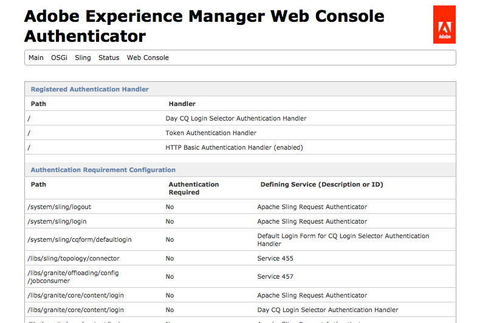

# Inicio de sesión único {#single-sign-on}

El inicio de sesión único (SSO) permite al usuario acceder a varios sistemas después de proporcionar credenciales de autenticación (como un nombre de usuario y una contraseña) una vez. Un sistema independiente (conocido como autenticador de confianza) realiza la autenticación y proporciona a Experience Manager las credenciales de usuario. Experience Manager comprueba y aplica los permisos de acceso para el usuario (es decir, determina a qué recursos se le permite acceder).

El servicio Controlador de autenticación SSO ( `com.adobe.granite.auth.sso.impl.SsoAuthenticationHandler`) procesa los resultados de autenticación que proporciona el autenticador de confianza. El controlador de autenticación SSO busca un ssid (identificador SSO) como el valor de un atributo especial en las siguientes ubicaciones en este orden:

1. Encabezados de solicitud
1. Cookies
1. Parámetros de solicitud

Cuando se encuentra un valor, la búsqueda finaliza y se utiliza este valor.

Configure los dos servicios siguientes para reconocer el nombre del atributo que almacena el sid:

* El módulo de inicio de sesión.
* El servicio de autenticación SSO.

Debe especificar el mismo nombre de atributo para ambos servicios. El atributo se incluye en el `SimpleCredentials` que se proporciona a `Repository.login`. El valor del atributo es irrelevante e ignorado, la mera presencia del atributo es importante y verificada.

## Configuración de SSO {#configuring-sso}

Para configurar SSO para una instancia de AEM, debe configurar el controlador de autenticación [SSO](/help/sites-deploying/osgi-configuration-settings.md#adobegranitessoauthenticationhandler):

1. When working with AEM there are several methods of managing the configuration settings for such services; see [Configuring OSGi](/help/sites-deploying/configuring-osgi.md) for more details and the recommended practices.

   Por ejemplo, para el conjunto NTLM:

   * **** Ruta: según sea necesario; por ejemplo, `/`
   * **Nombres** de encabezados: `LOGON_USER`
   * **Formato** de ID: `^<DOMAIN>\\(.+)$`

      Donde `<*DOMAIN*>` se reemplaza por su propio nombre de dominio.
   Para CoSign:

   * **** Ruta: según sea necesario; por ejemplo, `/`
   * **Nombres** de encabezados: remote_user
   * **** Formato de ID: AsIs
   Para SiteMinder:

   * **** Ruta: según sea necesario; por ejemplo, `/`
   * **** Nombres de encabezados: SM_USER
   * **Formato** de ID: AsIs


1. Confirme que el inicio de sesión único funciona según sea necesario; incluida la autorización.

>[!CAUTION]
>
>Asegúrese de que los usuarios no pueden acceder a AEM directamente si el SSO está configurado.
>
>Al exigir a los usuarios que pasen por un servidor web que ejecute el agente del sistema SSO, se garantiza que ningún usuario pueda enviar directamente un encabezado, cookie o parámetro que lleve al usuario a ser de confianza para AEM, ya que el agente filtrará dicha información si se envía desde fuera.
>
>Cualquier usuario que pueda acceder directamente a su instancia de AEM sin pasar por el servidor web podrá actuar como cualquier usuario enviando el encabezado, la cookie o el parámetro si se conocen los nombres.
>
>Además, asegúrese de que de los encabezados, las cookies y los nombres de parámetros de solicitud, sólo configure el que sea necesario para la configuración de SSO.


>[!NOTE]
>
>El inicio de sesión único se utiliza a menudo junto con [LDAP](/help/sites-administering/ldap-config.md).

>[!NOTE]
>
>Si también está utilizando [Dispatcher](https://helpx.adobe.com/experience-manager/dispatcher/using/dispatcher.html) con Microsoft Internet Information Server (IIS), se necesitará una configuración adicional en:
>
>* `disp_iis.ini`
>* IIS
>
>
En `disp_iis.ini` conjunto:
>(consulte [Instalación de Dispatcher con el servidor](https://helpx.adobe.com/experience-manager/dispatcher/using/dispatcher-install.html#microsoft-internet-information-server) de información de Internet de Microsoft para obtener más información)
>
>* `servervariables=1` (reenvía variables de servidor IIS como encabezados de solicitud a la instancia remota)
>* `replaceauthorization=1` (reemplaza cualquier encabezado denominado &quot;Autorización&quot; que no sea &quot;Básico&quot; por su equivalente &quot;Básico&quot;)
>
>
En IIS:
>
>* deshabilitar el acceso **anónimo**
   >
   >
* habilitar la autenticación **integrada de Windows**
>


Puede ver qué controlador de autenticación se está aplicando a cualquier sección del árbol de contenido mediante la opción **Autenticador** de la consola Félix; por ejemplo:

`http://localhost:4502/system/console/slingauth`

El controlador que mejor se adapte a la ruta se consulta primero. Por ejemplo, si configura handler-A para la ruta `/` y handler-B para la ruta `/content`, una solicitud para `/content/mypage.html` consultará primero el controlador-B.



### Ejemplo {#example}

Para una solicitud de cookie (mediante la dirección URL `http://localhost:4502/libs/wcm/content/siteadmin.html`):

```xml
GET /libs/cq/core/content/welcome.html HTTP/1.1
Host: localhost:4502
Cookie: TestCookie=admin
```

Con la siguiente configuración:

* **Ruta**: `/`

* **Nombres** de encabezados: `TestHeader`

* **Nombres** de cookies: `TestCookie`

* **Nombres** de parámetros: `TestParameter`

* **Formato** de ID: `AsIs`

La respuesta sería:

```xml
HTTP/1.1 200 OK
Connection: Keep-Alive
Server: Day-Servlet-Engine/4.1.24
Content-Type: text/html;charset=utf-8
Date: Thu, 23 Aug 2012 09:58:39 GMT
Transfer-Encoding: chunked

<!DOCTYPE HTML PUBLIC "-//W3C//DTD HTML 4.01//EN" "https://www.w3.org/TR/html4/strict.dtd">
<html>
<head>
    <meta http-equiv="content-type" content="text/html; charset=UTF-8">
    <title>Welcome to Adobe&reg; CQ5</title>
....
```

Esto también funciona si solicita:
`http://localhost:4502/libs/cq/core/content/welcome.html?TestParameter=admin`

O bien, puede utilizar el siguiente comando curl para enviar el `TestHeader` encabezado a `admin:``curl -D - -H "TestHeader: admin" http://localhost:4502/libs/cq/core/content/welcome.html`

>[!NOTE]
>
>Al utilizar el parámetro de solicitud en un navegador solo verá parte del HTML sin CSS. Esto se debe a que todas las solicitudes del HTML se realizan sin el parámetro de solicitud.

## Eliminación de vínculos de cierre de sesión de AEM {#removing-aem-sign-out-links}

Cuando se utiliza SSO, el inicio de sesión y el cierre de sesión se gestionan externamente, por lo que los vínculos de cierre de sesión propios de AEM ya no son aplicables y deben eliminarse.

El vínculo de cierre de sesión en la pantalla de bienvenida se puede eliminar siguiendo los pasos siguientes.

1. Superponer `/libs/cq/core/components/welcome/welcome.jsp` a `/apps/cq/core/components/welcome/welcome.jsp`
1. quite la siguiente parte del jsp.

   `<a href="#" onclick="signout('<%= request.getContextPath() %>');" class="signout"><%= i18n.get("sign out", "welcome screen") %>`

Para eliminar el vínculo de cierre de sesión disponible en el menú personal del usuario en la esquina superior derecha, siga estos pasos:

1. Superponer `/libs/cq/ui/widgets/source/widgets/UserInfo.js` a `/apps/cq/ui/widgets/source/widgets/UserInfo.js`

1. Elimine la siguiente parte del archivo:

   ```
   menu.addMenuItem({
       "text":CQ.I18n.getMessage("Sign out"),
       "cls": "cq-userinfo-logout",
       "handler": this.logout
   });
   menu.addSeparator();
   ```

