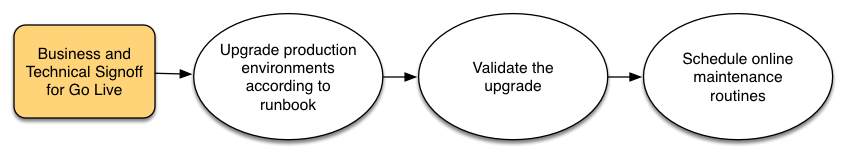

# Planificación de la actualización{#planning-your-upgrade}

## Información general del proyecto de AEM {#aem-project-overview}

AEM se utiliza a menudo en implementaciones de alto impacto que podrían servir a millones de usuarios. En la mayoría de los casos, hay aplicaciones personalizadas que se implementan en las instancias, lo que aumenta la complejidad. Cualquier esfuerzo por actualizar una implementación de este tipo debe manejarse metódicamente.

Esta guía le ayuda a establecer objetivos, fases y resultados claros al planificar la actualización. Se centra en la ejecución general del proyecto y en las directrices. Aunque proporciona una descripción general de los pasos reales de la actualización, se refiere a los recursos técnicos disponibles cuando corresponde. Debe utilizarse junto con los recursos técnicos disponibles a que se hace referencia en el documento.

El proceso de actualización de AEM necesita fases de planificación, análisis y ejecución cuidadosamente gestionadas, con entregables clave definidos para cada fase.

Tenga en cuenta que es posible actualizar directamente desde AEM versiones 6.0 y hasta 6.5. Los clientes que ejecutan 5.6.x y versiones posteriores deben actualizar primero a la versión 6.0 o superior, recomendando 6.0 (SP3). Además, el nuevo formato de Tar de segmentos OAK se utiliza ahora para el Almacenamiento de nodos de segmentos desde la versión 6.3, y la migración del repositorio a este nuevo formato es obligatoria incluso para las versiones 6.0, 6.1 y 6.2.

>[!CAUTION]
>
>Si está actualizando de AEM 6.2 a 6.3, debe actualizar desde versiones (**6.2-SP1-CFP1 - -6.2SP1-CFP12.1**) o **6.2SP1-CFP15** posteriores. De lo contrario, si está actualizando de **6.2SP1-CFP13/6.2SP1CFP14** a AEM 6.3, también debe actualizar a al menos la versión **6.3.2.2**. De lo contrario, AEM Sites fallaría después de la actualización.

## Alcance y requisitos de la actualización {#upgrade-scope-requirements}

A continuación encontrará una lista de las áreas que se ven afectadas en un proyecto típico de actualización de AEM:

<table>
 <tbody>
  <tr>
   <td><strong>Componente</strong></td>
   <td><strong>Impacto</strong></td>
   <td><strong>Descripción</strong></td>
  </tr>
  <tr>
   <td>Sistema operativo</td>
   <td>Efectos inciertos pero sutiles</td>
   <td>En el momento de la actualización de AEM, puede ser tiempo de actualizar el sistema operativo también y esto podría tener algún impacto.</td>
  </tr>
  <tr>
   <td>Java Runtime</td>
   <td>Impacto moderado</td>
   <td>AEM 6.3 requiere JRE 1.7.x (64 bits) o posterior. JRE 1.8 es la única versión compatible actualmente con Oracle.</td>
  </tr>
  <tr>
   <td>Hardware</td>
   <td>Impacto moderado</td>
   <td>La limpieza de revisión en línea requiere espacio libre  en disco igual al 25% del tamaño del repositorio y un 15% de espacio libre en pilas  para completarse correctamente. Es posible que tenga que actualizar su hardware a  para asegurarse de que los recursos suficientes para la limpieza de revisión en línea se ejecuten completamente . Además, si actualiza desde una versión anterior a AEM 6, puede haber   requisitos de almacenamiento adicionales.</td>
  </tr>
  <tr>
   <td>Repositorio de contenido (CRX u Oak)</td>
   <td>Impacto alto</td>
   <td>A partir de la versión 6.1, AEM no admite CRX2, por lo que se requiere una migración a  Oak (CRX3) si se actualiza desde una versión anterior. AEM 6.3 ha  implementado un nuevo almacén de nodos de segmento que también requiere una migración. La herramienta   crx2oak se utiliza para este fin.</td>
  </tr>
  <tr>
   <td>AEM componentes/contenido</td>
   <td>Impacto moderado</td>
   <td><code>/libs</code> y <code>/apps</code> se gestionan fácilmente mediante la actualización, pero <code>/etc</code> generalmente requiere una reaplicación manual de las personalizaciones.</td>
  </tr>
  <tr>
   <td>Servicios AEM</td>
   <td>Impacto bajo</td>
   <td>La mayoría de AEM servicios principales se prueban para actualizarse. Se trata de una zona de bajo impacto.</td>
  </tr>
  <tr>
   <td>Servicios de aplicaciones personalizados</td>
   <td>Impacto bajo a alto</td>
   <td>Dependiendo de la aplicación y personalización, puede haber dependencias  en JVM, versiones del sistema operativo y algunos cambios relacionados con la indexación , ya que los índices no se generan automáticamente en Oak.</td>
  </tr>
  <tr>
   <td>Contenido de aplicación personalizado</td>
   <td>Impacto bajo a alto</td>
   <td>El contenido que no se gestiona mediante la actualización se puede realizar una copia de seguridad  antes de que la actualización tenga lugar y luego se pueda volver a mover al repositorio.  La mayoría del contenido se puede administrar mediante la herramienta de migración.</td>
  </tr>
 </tbody>
</table>

Es importante asegurarse de que está ejecutando un sistema operativo compatible, Java runtime, httpd y Dispatcher version. Para obtener más información, consulte la [AEM página Requisitos técnicos de 6.5](/help/sites-deploying/technical-requirements.md). La actualización de estos componentes debe incluirse en el plan del proyecto y realizarse antes de actualizar el AEM.

## Fases del proyecto {#project-phases}

Mucho trabajo se dedica a la planificación y ejecución de una actualización AEM. A fin de aclarar los diferentes esfuerzos que se realizan en este proceso, hemos desglosado los ejercicios de planificación y ejecución en fases separadas. En las secciones siguientes, cada fase resulta en un envío que a menudo se aprovecha en una fase futura del proyecto.

### Planificación de la formación del autor {#planning-for-author-training}

Con cualquier nueva versión, pueden introducirse cambios en la interfaz de usuario y en los flujos de trabajo de los usuarios. Además, las nuevas versiones introducen nuevas funciones que pueden ser beneficiosas para el negocio. Recomendamos revisar los cambios funcionales que se han introducido y organizar un plan para entrenar a los usuarios en cómo aprovecharlos de forma eficaz.

Las nuevas funciones de AEM 6.5 se encuentran en [la sección AEM de adobe.com](/help/release-notes/release-notes.md). Asegúrese de tener en cuenta los cambios realizados en las IU o en las funciones de los productos que se utilizan con frecuencia en su organización. A medida que revise las nuevas funciones, también tome nota de cualquier que pueda ser de valor para su organización. Después de revisar lo que ha cambiado en AEM 6.5, desarrolle un plan de formación para sus autores. Esto podría implicar aprovechar los recursos disponibles libremente, como los vídeos de funciones de ayuda o la formación formal ofrecida a través de [Servicios de aprendizaje digital de Adobe](https://www.adobe.com/training.html).

### Creación de un plan de prueba {#creating-a-test-plan}

La implementación de AEM por parte de cada cliente es única y se ha personalizado para satisfacer sus necesidades comerciales. Como resultado, es importante determinar todas las personalizaciones que se han realizado en el sistema para que se puedan incluir en un plan de prueba. Este plan de prueba impulsará el proceso de control de calidad que realizamos en la instancia actualizada.

Es necesario duplicar el entorno de producción exacto y se deben realizar pruebas en él después de la actualización para asegurarse de que todas las aplicaciones y el código personalizado sigan ejecutándose según lo desee. Debe recuperar toda la personalización y ejecutar pruebas de rendimiento, carga y seguridad. Al organizar el plan de prueba, asegúrese de cubrir todas las personalizaciones que se han realizado en el sistema, además de las IU y los flujos de trabajo listos para usar que se aprovechan en sus operaciones diarias. Pueden incluir servicios y servlets OSGI personalizados, integraciones con Adobe Marketing Cloud, integraciones con terceros a través de conectores AEM, integraciones de terceros personalizadas, componentes y plantillas personalizados, superposiciones de IU personalizadas en AEM y flujos de trabajo personalizados. Para los clientes que migran desde una versión anterior a AEM 6, cualquier consulta personalizada debe analizarse, ya que puede que sea necesario indexarlas. Para los clientes que ya están en una versión AEM 6.x, estas consultas deben probarse para garantizar que sus índices sigan funcionando de forma eficaz después de la actualización.

### Determinación de los cambios necesarios en la arquitectura y la infraestructura {#determining-architectural-and-infrastructure-changes-needed}

Al actualizar, es posible que también necesite actualizar otros componentes de su pila técnica, como el sistema operativo o JVM. Además, es posible que debido a los cambios en la configuración del repositorio se necesite hardware adicional. Normalmente, esto solo aparece para los clientes que migran desde instancias anteriores a la 6.x, pero es importante tener en cuenta. Por último, es posible que se necesiten cambios en sus prácticas operacionales, incluidos procesos de monitoreo, mantenimiento y backup y recuperación ante desastres.

Revise los Requisitos técnicos de AEM 6.5 y asegúrese de que su hardware y software actuales sean suficientes. Para ver los posibles cambios en los procesos operativos, consulte los siguientes documentos:

**Monitorización y mantenimiento:**

[Tablero de operaciones](/help/sites-administering/operations-dashboard.md)

[Prácticas recomendadas de supervisión de Assets](/help/assets/assets-monitoring-best-practices.md)

[Monitorización de recursos del servidor utilizando la consola JMX](/help/sites-administering/jmx-console.md)

[Limpieza de revisión](/help/sites-deploying/revision-cleanup.md)

**Backup/Restore y Recuperación ante Desastres:**

[Copia de seguridad y restauración](/help/sites-administering/backup-and-restore.md)

[Rendimiento y escalabilidad](/help/sites-deploying/performance.md)

[Ejecución de AEM con el modo de espera pasiva TarMK](/help/sites-deploying/tarmk-cold-standby.md)

#### Consideraciones sobre la reestructuración de contenido {#content-restructuring-considerations}

AEM ha introducido cambios en la estructura del repositorio que ayudarán a realizar las actualizaciones de forma más fluida. Los cambios implican mover contenido de la carpeta /etc a carpetas, incluidas /libs, /apps y /content, en función de si el Adobe o un cliente posee el contenido, lo que limita las posibilidades de sobrescribir contenido durante las versiones. La reestructuración de repositorios se ha realizado de tal manera que no debería requerir cambios de código en el momento de la actualización a la versión 6.5, aunque se recomienda revisar los detalles en [Reestructuración de repositorios en AEM](/help/sites-deploying/repository-restructuring.md) mientras se planifica una actualización.

### Evaluación de la complejidad de la actualización {#assessing-upgrade-complexity}

Debido a la gran variedad en la cantidad y naturaleza de las personalizaciones que nuestros clientes aplican a sus entornos AEM, es importante pasar un tiempo por delante para determinar el nivel general de esfuerzo que debería esperarse en su actualización.

Existen dos métodos que puede utilizar para evaluar la complejidad de la actualización: una fase preliminar solo puede utilizar el detector de patrones recién introducido, que está disponible para ejecutarse en las instancias AEM 6.1, 6.2 y 6.3. El detector de patrones es la forma más sencilla de evaluar la complejidad general de la actualización que se espera utilizando los patrones notificados. El informe detector de patrones incluye patrones para identificar API no disponibles que están en uso en el código de base personalizado (esto se hizo usando comprobaciones de compatibilidad previas a la actualización en 6.3).

Después de la evaluación inicial, un paso siguiente más completo podría ser realizar una actualización en una instancia de prueba y realizar algunas pruebas de humo básicas. Adobe también proporciona algunos . Además, la lista de [Funciones obsoletas y eliminadas](/help/release-notes/deprecated-removed-features.md) debe revisarse no solo para la versión a la que esté actualizando, sino también para cualquier versión entre las versiones de origen y destino. Por ejemplo, si actualiza de AEM 6.2 a 6.5, es importante revisar las funciones obsoletas y eliminadas de AEM 6.3 además de las de AEM 6.5.

El detector de patrones introducido recientemente debería ofrecerle una estimación bastante precisa de lo que se puede esperar durante una actualización en la mayoría de los casos. Sin embargo, para personalizaciones e implementaciones más complejas en las que tenga cambios incompatibles, puede actualizar una instancia de desarrollo a AEM 6.5 según las instrucciones de [Realización de una actualización in situ](/help/sites-deploying/in-place-upgrade.md). Una vez finalizado, realice algunas pruebas de humo de alto nivel en este entorno. El objetivo de este ejercicio no es completar exhaustivamente el inventario de casos de prueba y elaborar un inventario formal de defectos, sino darnos una estimación aproximada de la cantidad de trabajo que se requerirá para actualizar el código para la compatibilidad con la versión 6.5. Cuando se combina con la [Detección de patrones](/help/sites-deploying/pattern-detector.md) y los cambios de arquitectura que se determinaron en la sección anterior, se puede proporcionar una estimación aproximada al equipo de administración del proyecto para planificar la actualización.

### Creación del Runbook de actualización y reversión {#building-the-upgrade-and-rollback-runbook}

Aunque Adobe ha documentado el proceso para actualizar una instancia de AEM, el diseño de red, la arquitectura de implementación y las personalizaciones de cada cliente requerirán un ajuste y una personalización precisos de este enfoque. Por este motivo, le recomendamos que revise toda la documentación que hemos proporcionado y la utilice para informar a un runbook específico del proyecto que describe los procedimientos específicos de actualización y reversión que seguirá en su entorno. Si actualiza desde CRX2, asegúrese de evaluar cuánto tiempo tardará la migración de contenido al pasar de CRX2 a Oak. Para repositorios grandes, podría ser sustancial.

Hemos proporcionado procedimientos de actualización y reversión en [Procedimiento de actualización](/help/sites-deploying/upgrade-procedure.md), así como instrucciones paso a paso para aplicar la actualización en Realización de una [actualización in situ](/help/sites-deploying/in-place-upgrade.md). Estas instrucciones deben revisarse y tenerse en cuenta con la arquitectura del sistema, las personalizaciones y la tolerancia al tiempo de inactividad para determinar los procedimientos de conmutación y reversión adecuados que se van a ejecutar durante la actualización. Cualquier cambio en la arquitectura o en el tamaño del servidor debe incluirse al redactar el runbook personalizado. Es importante señalar que esto debería tratarse como un primer proyecto. A medida que su equipo complete sus ciclos de control de calidad y desarrollo e implemente la actualización al entorno de ensayo, es probable que se necesite realizar algunos pasos adicionales. Idealmente, este documento debería contener suficiente información para que, si se entregara a un miembro de su personal de operaciones, pudiera completar la actualización completamente a partir de la información contenida en él.

### Desarrollo de un plan de proyecto {#developing-a-project-plan}

Podemos usar los resultados de ejercicios anteriores para construir un plan de proyecto que abarque los plazos esperados para nuestros esfuerzos de prueba o desarrollo, capacitación y ejecución real de la actualización.

Un plan general de proyectos debería incluir:

* Finalización de los planes de desarrollo y ensayo
* Actualización de entornos de desarrollo y control de calidad
* Actualización de la base de código personalizado para AEM 6.5
* Prueba de control de calidad y ciclo de corrección
* Actualización del entorno de ensayo
* Integración, rendimiento y pruebas de carga
* Certificación de entorno
* Go live

### Realización de Desarrollo y Control de Calidad {#performing-development-and-qa}

Hemos proporcionado procedimientos para que [Actualización de código y personalizaciones](/help/sites-deploying/upgrading-code-and-customizations.md) sean compatibles con AEM 6.5. A medida que se ejecuta este proceso iterativo, se deben realizar cambios en el runbook según sea necesario. Consulte también la [Compatibilidad con versiones anteriores en AEM 6.5](/help/sites-deploying/backward-compatibility.md) para obtener información sobre cómo las personalizaciones pueden permanecer compatibles con versiones anteriores en la mayoría de los casos sin necesidad de desarrollo inmediatamente después de la actualización.

El proceso de desarrollo y prueba suele ser iterativo. Debido a las personalizaciones, los cambios realizados durante la actualización podrían hacer que una sección entera del producto quede inutilizable. Una vez que los desarrolladores han abordado la causa principal del problema y el equipo de prueba tiene acceso para probar estas funciones, existe la posibilidad de que descubra problemas adicionales. A medida que se descubren problemas que requieren ajustes en el proceso de actualización, asegúrese de agregarlos a su runbook de actualización personalizado. Después de varias iteraciones de pruebas y correcciones, la base de código debe validarse completamente y estar lista para su implementación en el entorno de ensayo.

### Prueba final {#final-testing}

Recomendamos una ronda final de pruebas después de que el equipo de control de calidad de su organización haya certificado el código base. Esta ronda de pruebas implicará la validación del runbook en un entorno de ensayo, seguido de rondas de aceptación del usuario, rendimiento y pruebas de seguridad.

Este paso es vital, ya que es la única vez que puede validar los pasos del runbook con un entorno similar a una producción. Una vez actualizado el entorno, es importante permitir que los usuarios finales tengan tiempo de iniciar sesión y pasar por las actividades que realizan al utilizar el sistema en sus actividades diarias. No es inusual que los usuarios aprovechen una parte del sistema que no se había considerado anteriormente. Encontrar y corregir problemas en estas áreas antes de la entrada en funcionamiento puede ayudar a evitar costosas interrupciones en la producción. Como una nueva versión de AEM contiene cambios significativos en la plataforma subyacente, también es importante realizar pruebas de rendimiento, carga y seguridad en el sistema como si lo estuviéramos iniciando por primera vez.

### Realización de la actualización {#performing-the-upgrade}

Una vez que se ha recibido la aprobación final de todas las partes interesadas, es hora de ejecutar los procedimientos del runbook que se han definido. Hemos proporcionado los pasos para la actualización y la reversión en [Procedimiento de actualización](/help/sites-deploying/upgrade-procedure.md) y los pasos de instalación para realizar una [actualización in situ](/help/sites-deploying/in-place-upgrade.md) como punto de referencia.

Hemos proporcionado algunos pasos en las instrucciones de actualización para la validación del entorno. Estas incluyen comprobaciones básicas como el análisis de los registros de actualización y la verificación de que todos los paquetes OSGi se han iniciado correctamente, pero también recomendamos validar con sus propios casos de prueba en función de sus procesos empresariales. También recomendamos comprobar el programa de limpieza de revisión en línea de AEM y las rutinas relacionadas para garantizar que se produzcan durante un tiempo silencioso para su empresa. Estas rutinas son esenciales para el desempeño a largo plazo de AEM.
