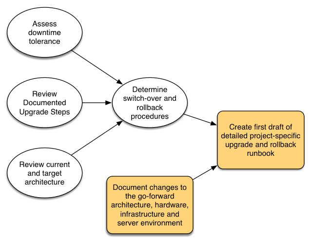

# Planificación de la actualización{#planning-your-upgrade}

## AEM Información general del proyecto {#aem-project-overview}

AEM La implementación de se utiliza a menudo en implementaciones de alto impacto que podrían llegar a millones de usuarios. Normalmente, hay aplicaciones personalizadas que se implementan en las instancias, lo que aumenta la complejidad. Cualquier esfuerzo por actualizar una implementación de este tipo debe gestionarse metódicamente.

Esta guía le ayudará a establecer objetivos, fases y entregables claros al planificar la actualización. Se centra en la ejecución general del proyecto y en las directrices. Aunque proporciona una descripción general de los pasos de actualización reales, hace referencia a los recursos técnicos disponibles cuando corresponde. Debe utilizarse con los recursos técnicos disponibles a los que se hace referencia en el documento.

AEM El proceso de actualización necesita fases de planificación, análisis y ejecución cuidadosamente gestionadas, con entregables clave definidos para cada fase.

AEM Es posible actualizar directamente desde las versiones 6.0 y hasta la versión 6.5 de la aplicación de forma directa. Los clientes que ejecutan 5.6.x o versiones posteriores deben actualizar primero a la versión 6.0 o superior, recomendándose 6.0 (SP3). Además, el nuevo formato Oak Segment Tar se utiliza ahora para el almacén de nodos de segmentos desde la versión 6.3, y la migración del repositorio a este nuevo formato es obligatoria incluso para la versión 6.0, 6.1 y 6.2.

>[!CAUTION]
>
>AEM Si está actualizando de la versión 6.2 a la versión 6.3, debería actualizar de las versiones de (**6.2-SP1-CFP1 - -6.2SP1-CFP12.1**) o **6.2SP1-CFP15** en adelante. De lo contrario, si actualiza desde **6.2SP1-CFP13/6.2SP1CFP14** AEM a la versión 6.3, también debe actualizar al menos a la versión 6.3 **6.3.2.2**. De lo contrario, AEM Sites fallaría después de la actualización.

## Ámbito y requisitos de la actualización {#upgrade-scope-requirements}

AEM A continuación, se muestra una lista de las áreas que se ven afectadas en un proyecto de actualización de la típico:

<table>
 <tbody>
  <tr>
   <td><strong>Componente</strong></td>
   <td><strong>Impacto</strong></td>
   <td><strong>Descripción</strong></td>
  </tr>
  <tr>
   <td>Sistema operativo</td>
   <td>Efectos inciertos, pero sutiles</td>
   <td>AEM En el momento de la actualización de la, puede que también sea el momento de actualizar el sistema operativo, lo que podría tener algún impacto.</td>
  </tr>
  <tr>
   <td>Java™ Runtime</td>
   <td>Moderar impacto</td>
   <td>AEM La versión 6.3 requiere JRE 1.7.x (64 bits) o posterior. JRE 1.8 es la única versión compatible actualmente con Oracle.</td>
  </tr>
  <tr>
   <td>Hardware</td>
   <td>Moderar impacto</td>
   <td>Limpieza de revisión en línea requiere asistencia gratuita  espacio en disco igual al 25% del tamaño del repositorio y al 15% de espacio libre en la pila  para completar correctamente. Es posible que deba actualizar el hardware a  Garantizar recursos suficientes para que Limpieza de revisión en línea  correr. AEM Además, si actualiza desde una versión anterior a la 6 de, debe  pueden ser requisitos de almacenamiento adicionales.</td>
  </tr>
  <tr>
   <td>Repositorio de contenido (CRX o Oak)</td>
   <td>Alto impacto</td>
   <td>AEM A partir de la versión 6.1 de, no es compatible con CRX2, por lo que la migración a no es compatible con la versión 6.1 de, que es  Oak (CRX3) es necesario si se actualiza desde una versión anterior. AEM,3 ha  se ha implementado un nuevo Almacén de nodos de segmentos que también requiere una migración. El  la herramienta crx2oak se usa para este propósito.</td>
  </tr>
  <tr>
   <td>AEM Componentes/contenido de la</td>
   <td>Moderar impacto</td>
   <td><code>/libs</code> y <code>/apps</code> se gestionan fácilmente mediante la actualización, pero <code>/etc</code> normalmente requiere volver a aplicar las personalizaciones de forma manual.</td>
  </tr>
  <tr>
   <td>AEM Servicios de</td>
   <td>Impacto bajo</td>
   <td>AEM La mayoría de los servicios principales se prueban para actualizarse. Se trata de un ámbito de bajo impacto.</td>
  </tr>
  <tr>
   <td>Servicios de aplicación personalizados</td>
   <td>De bajo a alto impacto</td>
   <td>Según la aplicación y la personalización, puede haber  dependencias en JVM, versiones del sistema operativo y algunas indexaciones relacionadas  cambia, ya que los índices no se generan automáticamente en Oak.</td>
  </tr>
  <tr>
   <td>Contenido de aplicación personalizado</td>
   <td>De bajo a alto impacto</td>
   <td>Se puede realizar una copia de seguridad del contenido que no se gestionará a través de la actualización  antes de que se realice la actualización y, a continuación, se vuelva a mover al repositorio.  La mayoría del contenido se puede gestionar mediante la herramienta de migración.</td>
  </tr>
 </tbody>
</table>

Es importante asegurarse de que está ejecutando un sistema operativo compatible, un tiempo de ejecución de Java™, un httpd y una versión de Dispatcher. Para obtener más información, consulte la [AEM Página de requisitos técnicos de.5](/help/sites-deploying/technical-requirements.md). AEM La actualización de estos componentes deberá tenerse en cuenta en el plan del proyecto y deberá realizarse antes de la actualización de los componentes de la versión de la aplicación de la.

## Fases del proyecto {#project-phases}

AEM Se está trabajando mucho en la planificación y ejecución de una actualización de la. Para aclarar los diferentes esfuerzos que se realizan en este proceso, el Adobe ha desglosado los ejercicios de planificación y ejecución en fases separadas. En las secciones que siguen, cada fase da como resultado un entregable que a menudo se utiliza en una fase futura del proyecto.

### Planificación de la formación de autores {#planning-for-author-training}

Con cualquier nueva versión, se pueden introducir cambios potenciales en la interfaz de usuario y en los flujos de trabajo de los usuarios. Además, las nuevas versiones introducen nuevas funciones que pueden ser beneficiosas para el uso empresarial. El Adobe recomienda revisar los cambios funcionales que se han introducido y organizar un plan para formar a los usuarios en el uso efectivo de ellos.

AEM Las nuevas funciones de 6.5 se encuentran en [AEM la sección de de adobe.com](/help/release-notes/release-notes.md). Asegúrese de tener en cuenta cualquier cambio en las IU o las funciones del producto que se utilizan comúnmente en su organización. A medida que revise las nuevas funciones, tome nota también de las que puedan ser de valor para su organización. AEM Después de revisar los cambios que se han producido en la versión 6.5, desarrolle un plan de formación para sus autores. Esto podría implicar el uso de recursos disponibles libremente como la función de ayuda, vídeos o formación formal ofrecida a través de [Adobe Digital Learning Services](https://learning.adobe.com/).

### Creación de un Plan de Pruebas {#creating-a-test-plan}

AEM La implementación de las funciones de cada cliente es única y se ha personalizado para satisfacer los requisitos de su negocio. Como resultado, es importante determinar todas las personalizaciones que se han realizado en el sistema para que se puedan incluir en un plan de prueba. Este plan de prueba potencia el proceso de control de calidad que realiza el Adobe en la instancia actualizada.

Es necesario duplicar el entorno de producción exacto y se deben realizar pruebas en él después de la actualización para asegurarse de que todas las aplicaciones y el código personalizado siguen ejecutándose como se desea. Regrese todas las personalizaciones y ejecute pruebas de rendimiento, carga y seguridad. Al organizar el plan de prueba, asegúrese de cubrir todas las personalizaciones que se han realizado en el sistema, además de las IU y los flujos de trabajo predeterminados que se utilizan en sus operaciones diarias. Pueden incluir servicios y servlets OSGI personalizados, integraciones en Adobe Experience Cloud AEM AEM, integraciones con terceros a través de conectores de, integraciones de terceros personalizadas, componentes y plantillas personalizados, superposiciones de IU personalizadas en los flujos de trabajo personalizados y en los flujos de trabajo personalizados. AEM Para los clientes que migran de una versión anterior a la 6 de, cualquier consulta personalizada debe analizarse, ya que puede que sea necesario indexarla. AEM Para los clientes que ya tienen una versión de 6.x de, se deben probar estas consultas para garantizar que sus índices sigan funcionando de forma eficaz después de la actualización.

### Determinación de los cambios arquitectónicos y de infraestructura necesarios {#determining-architectural-and-infrastructure-changes-needed}

Al realizar la actualización, es posible que también necesite actualizar otros componentes de su pila técnica, como el sistema operativo o JVM. Además, es posible que debido a los cambios en la composición del repositorio se requiera hardware adicional. Esto solo aparece para los clientes que migran de instancias anteriores a la 6.x, pero es importante tenerlo en cuenta. Por último, es posible que se necesiten cambios en las prácticas operativas, incluidos los procesos de supervisión, mantenimiento, backup y recuperación ante desastres.

AEM Revise los Requisitos técnicos de la versión 6.5 de la versión de y asegúrese de que el hardware y el software actuales sean suficientes. Para ver posibles cambios en los procesos operativos, consulte los siguientes documentos:

**Monitorización y mantenimiento:**

[Tablero de operaciones](/help/sites-administering/operations-dashboard.md)

[Prácticas recomendadas de supervisión de Assets](/help/assets/assets-monitoring-best-practices.md)

[Supervisión de recursos del servidor mediante la consola JMX](/help/sites-administering/jmx-console.md)

[Limpieza de revisión](/help/sites-deploying/revision-cleanup.md)

**Backup/restauración y recuperación ante desastres:**

[Copia de seguridad y restauración](/help/sites-administering/backup-and-restore.md)

[Rendimiento y escalabilidad](/help/sites-deploying/performance.md)

[AEM Cómo ejecutar el con TarMK Cold Standby](/help/sites-deploying/tarmk-cold-standby.md)

#### Consideraciones de reestructuración de contenido {#content-restructuring-considerations}

AEM ha introducido cambios en la estructura del repositorio que ayudarán a que las actualizaciones sean más fluidas. Los cambios implican mover contenido fuera de la carpeta /etc a carpetas como /libs, /apps y /content, en función de si el contenido es propiedad de Adobe o de un cliente, lo que limita las posibilidades de sobrescribir contenido durante las versiones. La reestructuración del repositorio se ha realizado de tal manera que no debería requerir cambios de código en el momento de la actualización a 6.5, aunque se recomienda revisar los detalles en [AEM Reestructuración de repositorios en el sector de la](/help/sites-deploying/repository-restructuring.md) mientras se planifica una actualización.

### Evaluación de la complejidad de actualización {#assessing-upgrade-complexity}

Debido a la amplia variedad en la cantidad y naturaleza de las personalizaciones que los clientes de Adobe AEM aplican a sus entornos de, es importante pasar algún tiempo por adelantado para determinar el nivel general de esfuerzo que se debe esperar en la actualización.

AEM Existen dos métodos para evaluar la complejidad de la actualización: una fase preliminar puede utilizar el Pattern Detector recién introducido, que está disponible para ejecutarse en las instancias de la versión 6.1, 6.2 y 6.3 de la. El detector de patrones es la forma más sencilla de evaluar la complejidad general de la actualización que cabe esperar utilizando los patrones notificados. El informe detector de patrones incluye patrones para identificar las API no disponibles que utiliza la base de código personalizada (esto se hizo mediante comprobaciones de compatibilidad previas a la actualización en la versión 6.3).

Después de la evaluación inicial, un paso siguiente más completo podría ser realizar una actualización en una instancia de prueba y realizar algunas pruebas básicas de humo. El Adobe también proporciona algunos . Además, la lista de [Funciones en desuso y eliminadas](/help/release-notes/deprecated-removed-features.md) debe revisarse no solo para la versión a la que está actualizando, sino también para cualquier versión entre las versiones de origen y destino. AEM AEM AEM Por ejemplo, si se actualiza de la versión 6.2 a la versión 6.5, es importante revisar las funciones obsoletas y eliminadas de la versión 6.3, además de las de la versión 6.5, que ya se han eliminado de la versión 6.3000000000000000000000000000000000000000000000000000000000000000000000000000000000000000000000000000

Pattern Detector, introducido recientemente, debería proporcionarle una estimación bastante precisa de lo que puede esperar durante una actualización en la mayoría de los casos. AEM Sin embargo, para personalizaciones e implementaciones más complejas en las que tenga cambios incompatibles, puede actualizar una instancia de desarrollo a la versión 6.5 según las instrucciones de la sección [Realización de una actualización in situ](/help/sites-deploying/in-place-upgrade.md). Una vez finalizado, realice algunas pruebas de humo de alto nivel en este entorno. El objetivo de este ejercicio no es completar exhaustivamente el inventario de casos de prueba y producir un inventario formal de defectos, sino darnos una estimación aproximada de la cantidad de trabajo que se requerirá para actualizar el código para la compatibilidad con 6.5. Cuando se combina con [Detección de patrones](/help/sites-deploying/pattern-detector.md) y los cambios arquitectónicos que se determinaron en la sección anterior, se puede proporcionar una estimación aproximada al equipo de administración del proyecto para que planifique la actualización.

### Creación del Runbook de actualización y reversión {#building-the-upgrade-and-rollback-runbook}

Aunque Adobe AEM ha documentado el proceso de actualización de una instancia de, el diseño de red, la arquitectura de implementación y las personalizaciones de cada cliente requieren un ajuste y una adaptación precisos de este enfoque. Por este motivo, Adobe le recomienda revisar toda la documentación proporcionada y utilizarla para informar a un runbook específico del proyecto que describa los procedimientos específicos de actualización y reversión que seguirá en su entorno. Si actualiza desde CRX2, asegúrese de evaluar cuánto tiempo tardará la migración de contenido al pasar de CRX2 a Oak. Para repositorios grandes, podría ser sustancial.

El Adobe de ha proporcionado procedimientos de actualización y reversión en [Procedimiento de actualización](/help/sites-deploying/upgrade-procedure.md) e instrucciones paso a paso para aplicar la actualización en Realización de una [Actualización in situ](/help/sites-deploying/in-place-upgrade.md). Estas instrucciones deben revisarse y tenerse en cuenta junto con la arquitectura del sistema, las personalizaciones y la tolerancia ante tiempos de inactividad para determinar los procedimientos de cambio y reversión adecuados que se van a ejecutar durante la actualización. Cualquier cambio en la arquitectura o el tamaño del servidor debe incluirse al redactar el runbook personalizado. Es importante señalar que esto debería tratarse como un primer borrador. A medida que su equipo completa sus ciclos de control de calidad y desarrollo e implementa la actualización en el entorno de ensayo, es probable que sea necesario realizar algunos pasos adicionales. Lo ideal es que este documento contenga información suficiente como para que, si se entregara a un miembro de su personal de operaciones, pueda completar la actualización completamente a partir de la información contenida en él.

### Desarrollo de un plan de proyecto {#developing-a-project-plan}

Los resultados de los ejercicios anteriores se pueden utilizar para crear un plan de proyecto que abarque los plazos previstos para los esfuerzos de prueba o desarrollo, la formación y la ejecución real de la actualización.

Un plan de proyecto integral debe incluir:

* Finalización de los planes de desarrollo y ensayo
* Actualización de entornos de desarrollo y control de calidad
* AEM Actualización del código personalizado de base para la versión 6.5 de
* Un ciclo de pruebas y correcciones de control de calidad
* Actualización del entorno de ensayo
* Integración, rendimiento y pruebas de carga
* Certificación del entorno
* Publicar el lanzamiento

### Desarrollo y control de calidad {#performing-development-and-qa}

El Adobe ha establecido procedimientos para [Actualizar código y personalizaciones](/help/sites-deploying/upgrading-code-and-customizations.md) AEM para ser compatible con la versión 6.5 de la. A medida que se ejecuta este proceso iterativo, se deben realizar cambios en el Runbook según sea necesario. Consulte también [AEM Compatibilidad con versiones anteriores en 6.5](/help/sites-deploying/backward-compatibility.md) no hay información sobre cómo las personalizaciones pueden permanecer compatibles con versiones anteriores, por lo general sin requerir desarrollo inmediatamente después de la actualización.

El proceso de desarrollo y prueba suele ser iterativo. Debido a las personalizaciones, los cambios realizados durante la actualización podrían inutilizar una sección entera del producto. Una vez que los desarrolladores han abordado la causa raíz del problema y el equipo de prueba tiene acceso para probar estas funciones, existe la posibilidad de descubrir problemas adicionales. A medida que se detecten problemas que requieran ajustes en el proceso de actualización, asegúrese de añadirlos a su runbook de actualización personalizado. Después de varias iteraciones de pruebas y correcciones, la base de código debe validarse completamente y estar lista para su implementación en el entorno de ensayo.

### Prueba final {#final-testing}

El Adobe recomienda una ronda final de pruebas después de que el equipo de control de calidad de su organización haya certificado la base de código. Esta ronda de pruebas incluirá la validación del runbook en un entorno de ensayo, seguido de rondas de aceptación del usuario, rendimiento y pruebas de seguridad.

Este paso es vital, ya que es la única vez que puede validar los pasos del Runbook con un entorno de producción. Una vez actualizado el entorno, es importante dar a los usuarios finales un poco de tiempo para iniciar sesión y realizar las actividades que realizan al utilizar el sistema en sus actividades diarias. No es inusual que los usuarios usen una parte del sistema que no se había considerado anteriormente. Encontrar y corregir problemas en estas áreas antes del lanzamiento puede ayudar a evitar costosos cortes en la producción. AEM Como una nueva versión de contiene cambios significativos en la plataforma subyacente, también es importante realizar pruebas de rendimiento, carga y seguridad en el sistema como si lo iniciara por primera vez.

### Realización de la actualización {#performing-the-upgrade}

Una vez recibida la firma final de todas las partes interesadas, es hora de ejecutar los procedimientos definidos del Runbook. El Adobe ha proporcionado los pasos para la actualización y la reversión en [Procedimiento de actualización](/help/sites-deploying/upgrade-procedure.md) pasos de instalación en Realización de una [Actualización in situ](/help/sites-deploying/in-place-upgrade.md) como referencia.

El Adobe de ha proporcionado algunos pasos en las instrucciones de actualización para la validación del entorno. Estas incluyen comprobaciones básicas como el análisis de los registros de actualización y la verificación de que todos los paquetes OSGi se han iniciado correctamente, pero Adobe recomienda también validar con sus propios casos de prueba en función de los procesos empresariales. El Adobe AEM también recomienda revisar el horario de Limpieza de revisiones en línea de la versión en línea de la versión y las rutinas relacionadas para asegurarse de que se produzcan durante un tiempo de silencio para su empresa. AEM Estas rutinas son esenciales para el rendimiento a largo plazo de la.
