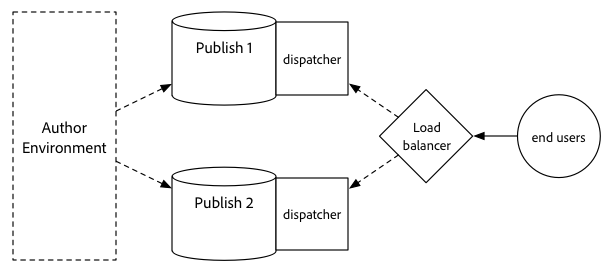

# Procedimiento de actualización {#upgrade-procedure}

>[!NOTE]
>
>La actualización requiere tiempo de inactividad para el nivel de Author, ya que la mayoría de las actualizaciones de Adobe Experience Manager AEM () se realizan in situ. Si sigue estas prácticas recomendadas, puede minimizar o eliminar el tiempo de inactividad del nivel de publicación.

AEM Al actualizar los entornos de creación, debe tener en cuenta las diferencias de enfoque entre la actualización de entornos de creación o de publicación para minimizar el tiempo de inactividad, tanto para los autores como para los usuarios finales. AEM AEM En esta página se describe el procedimiento de alto nivel para actualizar una topología en la que se está ejecutando actualmente en una versión de 6.x. Dado que el proceso difiere entre los niveles de creación y publicación y las implementaciones basadas en Mongo y TarMK, cada nivel y micronúcleo se han enumerado en una sección independiente. Al ejecutar la implementación, Adobe recomienda actualizar primero el entorno de creación, determinar el éxito y, a continuación, continuar con los entornos de publicación.

<!--
>[!IMPORTANT]
>
>The downtime during the upgrade can be significally reduced by indexing the repository before performing the upgrade. For more information, see [Using Offline Reindexing To Reduce Downtime During an Upgrade](/help/sites-deploying/upgrade-offline-reindexing.md)
-->

## Nivel de TarMK Author {#tarmk-author-tier}

### Iniciando topología {#starting-topology}

La topología supuesta para esta sección consiste en un servidor de creación que se ejecuta en TarMK con una espera fría. La replicación se produce desde el servidor de creación a la granja de servidores de publicación TarMK. Aunque no se ilustra aquí, este enfoque también se puede utilizar para implementaciones que utilizan descarga. Asegúrese de actualizar o volver a generar la instancia de descarga en la nueva versión después de deshabilitar los agentes de replicación en la instancia de autor y antes de volver a habilitarlos.

### Preparación de actualización {#upgrade-preparation}

1. Detener la creación de contenido.

1. Detenga la instancia de espera.

1. Deshabilite los agentes de replicación en el autor.

1. Ejecute el [tareas de mantenimiento previas a la actualización](/help/sites-deploying/pre-upgrade-maintenance-tasks.md).

### Ejecución de actualización {#upgrade-execution}

1. Ejecute el [actualización in situ](/help/sites-deploying/in-place-upgrade.md).
1. Actualizar el módulo de Dispatcher *si es necesario*.

1. QA valida la actualización.

1. Cierre la instancia de autor.

### Si se realiza correctamente {#if-successful}

1. Copie la instancia actualizada para crear una espera en frío.

1. Inicie la instancia de autor.

1. Inicie la instancia de espera.

### Si no lo consigue (reversión) {#if-unsuccessful-rollback}

1. Inicie la instancia de espera en frío como la nueva instancia principal.

1. Reconstruir el entorno de creación desde el modo de espera en frío.

## Clúster de autor de MongoMK {#mongomk-author-cluster}

### Iniciando topología {#starting-topology-1}

AEM La topología supuesta para esta sección consiste en un clúster de creación de MongoMK con al menos dos instancias de autor de, respaldadas por al menos dos bases de datos MongoMK. Todas las instancias de autor comparten un almacén de datos. Estos pasos deben aplicarse tanto a los almacenes de datos S3 como a los de archivos. La replicación se produce desde los servidores de creación a la granja de servidores de publicación TarMK.

### Preparación de actualización {#upgrade-preparation-1}

1. Detener la creación de contenido.
1. Clone el almacén de datos para la copia de seguridad.
1. AEM Detenga todas las instancias de autor excepto una, la instancia de autor principal.
1. Elimine todos los nodos MongoDB excepto uno del conjunto de réplicas, su instancia principal de Mongo.
1. Actualice el `DocumentNodeStoreService.cfg` en el Autor principal para reflejar el conjunto de réplicas de un solo miembro.
1. Reinicie el autor principal para asegurarse de que se reinicia correctamente.
1. Deshabilite los agentes de replicación en el autor principal.
1. Ejecutar [tareas de mantenimiento previas a la actualización](/help/sites-deploying/pre-upgrade-maintenance-tasks.md) en la instancia de autor principal.
1. Si es necesario, actualice MongoDB en la instancia principal de Mongo a la versión 3.2 con WiredTiger.

### Ejecución de actualización {#Upgrade-execution-1}

1. Ejecutar un [actualización in situ](/help/sites-deploying/in-place-upgrade.md) en el autor principal.
1. Actualizar Dispatcher o el módulo web *si es necesario*.
1. QA valida la actualización.

### Si se realiza correctamente {#if-successful-1}

1. Cree nuevas instancias de autor de la versión 6.5, conectadas a la instancia actualizada de Mongo.

1. Vuelva a generar los nodos MongoDB que se quitaron del clúster.

1. Actualice el `DocumentNodeStoreService.cfg` archivos para reflejar el conjunto de réplicas completo.

1. Reinicie las instancias de autor de a una por vez.

1. Elimine el almacén de datos clonado.

### Si no lo consigue (reversión)  {#if-unsuccessful-rollback-2}

1. Vuelva a configurar las instancias de autor secundarias para conectarse al almacén de datos clonado.

1. Cierre la instancia principal de Author actualizada.

1. Cierre la instancia principal de Mongo actualizada.

1. Inicie las instancias secundarias de Mongo con una de ellas como la nueva principal.

1. Configure las variables `DocumentNodeStoreService.cfg` archivos en las instancias secundarias de Author para que apunten al conjunto de réplicas de instancias Mongo aún no actualizadas.

1. Inicie las instancias de autor secundarias.

1. Limpie las instancias de autor actualizadas, el nodo Mongo y el almacén de datos.

## Granja de publicación TarMK {#tarmk-publish-farm}

### Granja de publicación TarMK {#tarmk-publish-farm-1}

La topología supuesta para esta sección consiste en dos instancias de publicación de TarMK, delante de Dispatcher y, a su vez, delante de un equilibrador de carga. La replicación se produce desde el servidor de creación a la granja de servidores de publicación TarMK.

### Ejecución de actualización {#upgrade-execution-2}

1. Detenga el tráfico a la instancia de Publish 2 en el equilibrador de carga.
1. Ejecutar [mantenimiento previo a la actualización](/help/sites-deploying/pre-upgrade-maintenance-tasks.md) en Publish 2.
1. Ejecutar un [actualización in situ](/help/sites-deploying/in-place-upgrade.md) en Publish 2.
1. Actualizar Dispatcher o el módulo web *si es necesario*.
1. Vaciar la caché de Dispatcher.
1. QA valida Publish 2 a través de Dispatcher, detrás del firewall.
1. Cerrar publicación 2.
1. Copie la instancia de Publish 2.
1. Iniciar publicación 2.

### Si se realiza correctamente {#if-successful-2}

1. Habilitar tráfico en Publish 2.
1. Detener el tráfico en Publish 1.
1. Detenga la instancia Publish 1.
1. Reemplace la instancia Publish 1 por una copia de Publish 2.
1. Actualizar Dispatcher o el módulo web *si es necesario*.
1. Vaciar la caché de Dispatcher para la Publicación 1.
1. Iniciar publicación 1.
1. QA valida Publish 1 a través de Dispatcher, detrás del cortafuegos.

### Si no lo consigue (reversión) {#if-unsuccessful-rollback-1}

1. Cree una copia de Publish 1.
1. Reemplace la instancia de Publish 2 por una copia de Publish 1.
1. Vaciar la caché de Dispatcher para la publicación 2.
1. Iniciar publicación 2.
1. QA valida Publish 2 a través de Dispatcher, detrás del firewall.
1. Habilitar tráfico en Publish 2.

## Pasos finales de la actualización {#final-upgrade-steps}

1. Habilitar el tráfico en Publicar 1.
1. QA realiza la validación final desde una dirección URL pública.
1. Habilite los agentes de replicación desde el entorno de creación.
1. Reanudar creación de contenido.
1. Realizar [comprobaciones posteriores a la actualización](/help/sites-deploying/post-upgrade-checks-and-troubleshooting.md).

