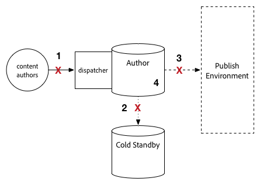

# Procedimiento de actualización {#upgrade-procedure}

>[!NOTE]
>
>La actualización requerirá tiempo de inactividad para el nivel Autor, ya que la mayoría de las actualizaciones AEM se realizan in situ. Al seguir estas optimizaciones, el tiempo de inactividad del nivel de publicación se puede minimizar o eliminar.

Al actualizar sus entornos de AEM, debe tener en cuenta las diferencias de enfoque entre la actualización de entornos de autor o entornos de publicación para minimizar el tiempo de inactividad tanto para los autores como para los usuarios finales. Esta página describe el procedimiento de alto nivel para actualizar una topología de AEM que se está ejecutando en una versión de AEM 6.x. Dado que el proceso difiere entre los niveles de autor y publicación, así como las implementaciones basadas en Mongo y TarMK, cada nivel y micronúcleo se ha incluido en una sección separada. Al ejecutar la implementación, se recomienda primero actualizar el entorno del autor, determinar el éxito y, a continuación, continuar con los entornos de publicación.

<!--
>[!IMPORTANT]
>
>The downtime during the upgrade can be significally reduced by indexing the repository before performing the upgrade. For more information, see [Using Offline Reindexing To Reduce Downtime During an Upgrade](/help/sites-deploying/upgrade-offline-reindexing.md)
-->

## Nivel de creación de TarMK {#tarmk-author-tier}

### Topología inicial {#starting-topology}

La topología asumida para esta sección consiste en un servidor Autor que se ejecuta en TarMK con un espera en frío. La replicación se produce desde el servidor de creación al conjunto de publicaciones TarMK. Aunque no se ilustra aquí, este enfoque también se puede aprovechar para implementaciones que utilizan descarga. Asegúrese de actualizar o reconstruir la instancia de descarga en la nueva versión después de deshabilitar los agentes de replicación en la instancia de Autor y antes de volver a habilitarlos.

### Preparación de la actualización {#upgrade-preparation}

1. Detener la creación de contenido

1. Detener la instancia de espera

1. Deshabilitar los agentes de replicación en el autor

1. Ejecute las [tareas de mantenimiento previas a la actualización](/help/sites-deploying/pre-upgrade-maintenance-tasks.md).

### Ejecución de la actualización {#upgrade-execution}

1. Ejecute la [actualización in-situ](/help/sites-deploying/in-place-upgrade.md)
1. Actualice el módulo del despachante *si es necesario*

1. El control de calidad valida la actualización

1. Cierre la instancia de creación.

### Si es correcto {#if-successful}

1. Copie la instancia actualizada para crear un nuevo Cold Standby

1. Inicio de la instancia de autor

1. Inicio la instancia de Standby.

### Si no tiene éxito (Rollback) {#if-unsuccessful-rollback}

1. Inicio de la instancia de Cold Standby como el nuevo primario

1. Vuelva a crear el entorno Autor a partir del modo de espera frío.

## MongoMK Author Cluster {#mongomk-author-cluster}

### Topología inicial {#starting-topology-1}

La topología asumida para esta sección consiste en un clúster de MongoMK Author con al menos dos instancias de AEM Author, respaldadas por al menos dos bases de datos MongoMK. Todas las instancias de Autor comparten un almacén de datos. Estos pasos deben aplicarse a los almacenes de datos S3 y File. La replicación se produce desde los servidores Author al conjunto de servidores TarMK Publish.

### Preparación de la actualización {#upgrade-preparation-1}

1. Detener la creación de contenido
1. Clonar el almacén de datos para backup
1. Detenga todas las instancias de AEM Author excepto una, su autor principal
1. Elimine todos los nodos MongoDB excepto uno del conjunto de réplicas, la instancia principal de Mongo
1. Actualice el archivo `DocumentNodeStoreService.cfg` en el autor principal para reflejar su conjunto de réplicas de un solo miembro
1. Reinicie el autor principal para asegurarse de que se reinicia correctamente
1. Deshabilitar los agentes de replicación en el autor principal
1. Ejecute [tareas de mantenimiento previas a la actualización](/help/sites-deploying/pre-upgrade-maintenance-tasks.md) en la instancia principal de Author
1. Si es necesario, actualice MongoDB en la instancia principal de Mongo a la versión 3.2 con WiredTiger

### Ejecución de la actualización {#Upgrade-execution-1}

1. Ejecute una [actualización en el lugar](/help/sites-deploying/in-place-upgrade.md) en el autor principal
1. Actualice Dispatcher o Módulo Web *si es necesario*
1. El control de calidad valida la actualización

### Si es correcto {#if-successful-1}

1. Crear nuevas instancias de Autor de 6.5, conectadas a la instancia de Mongo actualizada

1. Vuelva a generar los nodos MongoDB que se eliminaron del clúster

1. Actualice los archivos `DocumentNodeStoreService.cfg` para reflejar el conjunto completo de réplicas

1. Reinicie las instancias de Autor de una en una

1. Elimine el almacén de datos clonado.

### Si no tiene éxito (Rollback) {#if-unsuccessful-rollback-2}

1. Reconfiguración de las instancias de autor secundarias para conectarse al almacén de datos clonado

1. Apagar la instancia principal de Author actualizada

1. Cierre la instancia principal de Mongo actualizada.

1. Inicio de las instancias secundarias de Mongo con una de ellas como la nueva primaria

1. Configure los archivos `DocumentNodeStoreService.cfg` en las instancias secundarias de Autor para que señalen al conjunto de réplicas de instancias de Mongo que aún no se han actualizado

1. Inicio de las instancias secundarias de Autor

1. Limpie las instancias de creación actualizadas, el nodo Mongo y el almacén de datos.

## Granja de publicación TarMK {#tarmk-publish-farm}

### Granja de publicación TarMK {#tarmk-publish-farm-1}

La topología asumida para esta sección consiste en dos instancias de publicación TarMK, delante de los despachantes que, a su vez, están precedidas por un equilibrador de carga. La replicación se produce desde el servidor de creación al conjunto de servidores de publicación TarMK.

### Ejecución de la actualización {#upgrade-execution-2}

1. Detener el tráfico de la instancia de Publish 2 en el equilibrador de carga
1. Ejecute [mantenimiento previo a la actualización](/help/sites-deploying/pre-upgrade-maintenance-tasks.md) en la publicación 2
1. Ejecute una [actualización in-situ](/help/sites-deploying/in-place-upgrade.md) en Publish 2
1. Actualice Dispatcher o Módulo Web *si es necesario*
1. Vaciar la caché de Dispatcher
1. El control de calidad valida la publicación 2 a través del despachante, detrás del servidor de seguridad
1. Cerrar publicación 2
1. Copiar la instancia de Publish 2
1. Inicio Publish 2

### Si es correcto {#if-successful-2}

1. Habilitar el tráfico para la publicación 2
1. Detener el tráfico para publicar 1
1. Detener la instancia de Publish 1
1. Reemplazar la instancia de Publish 1 con una copia de Publish 2
1. Actualice Dispatcher o Módulo Web *si es necesario*
1. Vaciar la caché de Dispatcher para la publicación 1
1. Inicio Publish 1
1. El control de calidad valida la publicación 1 a través del despachante, detrás del servidor de seguridad

### Si no tiene éxito (Rollback) {#if-unsuccessful-rollback-1}

1. Crear una copia de Publish 1
1. Reemplazar la instancia de Publish 2 con una copia de Publish 1
1. Vaciar la caché de Dispatcher para la publicación 2
1. Inicio Publish 2
1. El control de calidad valida la publicación 2 a través del despachante, detrás del servidor de seguridad
1. Habilitar el tráfico para la publicación 2

## Pasos finales de actualización {#final-upgrade-steps}

1. Habilitar el tráfico para la publicación 1
1. El control de calidad realiza la validación final desde una dirección URL pública
1. Habilitar agentes de replicación desde el entorno de creación
1. Reanudar la creación de contenido
1. Realice [comprobaciones posteriores a la actualización](/help/sites-deploying/post-upgrade-checks-and-troubleshooting.md).

