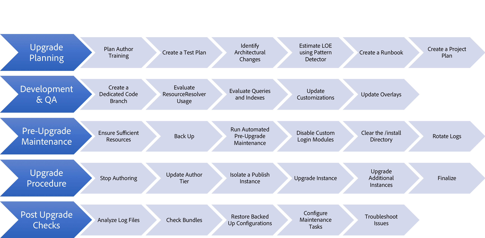

# Actualización a Adobe Experience Manager AEM () 6.5 {#upgrading-to-aem}

AEM AEM Esta sección trata sobre la actualización de una instalación de a la versión 6.5 de:

* [Planificación de la actualización](/help/sites-deploying/upgrade-planning.md)
* [Evaluación de la complejidad de la actualización con Pattern Detector](/help/sites-deploying/pattern-detector.md)
* [AEM Compatibilidad con versiones anteriores en 6.5](/help/sites-deploying/backward-compatibility.md)
  <!--* [Using Offline Reindexing To Reduce Downtime During an Upgrade](/help/sites-deploying/upgrade-offline-reindexing.md)-->
* [Procedimiento de actualización](/help/sites-deploying/upgrade-procedure.md)
* [Actualizar código y personalizaciones](/help/sites-deploying/upgrading-code-and-customizations.md)
* [Tareas de mantenimiento previas a la actualización](/help/sites-deploying/pre-upgrade-maintenance-tasks.md)
* [Realización de una actualización in situ](/help/sites-deploying/in-place-upgrade.md)
* [Comprobaciones posteriores a la actualización y solución de problemas](/help/sites-deploying/post-upgrade-checks-and-troubleshooting.md)
* [Actualizaciones sostenibles](/help/sites-deploying/sustainable-upgrades.md)
* [Migración de contenido diferido](/help/sites-deploying/lazy-content-migration.md)
* [AEM Reestructuración de repositorios en 6.5](/help/sites-deploying/repository-restructuring.md)

AEM Para facilitar la referencia a las instancias de involucradas en estos procedimientos, se utilizan los siguientes términos en todos estos artículos:

* El *origen* AEM La instancia de es la instancia de desde la que realiza la actualización.
* El *destino* es la instancia a la que está actualizando.

>[!NOTE]
>
>AEM Como parte de los esfuerzos por mejorar la fiabilidad de las actualizaciones, se ha realizado una reestructuración exhaustiva de los repositorios de datos de los que se dispone en el futuro, el. Para obtener más información sobre cómo alinearse con la nueva estructura, consulte [AEM Reestructuración de repositorios en el sector de la.](/help/sites-deploying/repository-restructuring.md)

## ¿Qué ha cambiado? {#what-has-changed}

AEM A continuación se indican algunos cambios importantes que se han producido en las últimas versiones de la aplicación de:

AEM.0 presentó el nuevo repositorio Jackrabbit Oak. Los administradores de persistencia se han sustituido por [Micro Kernels](/help/sites-deploying/platform.md#contentbody_title_4). A partir de la versión 6.1, CRX2 ya no es compatible. Se debe ejecutar una herramienta de migración llamada crx2oak para migrar repositorios CRX2 de instancias 5.6.1. Para obtener más información, consulte [Uso de la herramienta de migración CRX2OAK](/help/sites-deploying/using-crx2oak.md).

AEM Si se está utilizando Assets Insights y está actualizando desde una versión anterior a la 6.2, los recursos deben migrarse y deben tener ID generados a través de un bean JMX. Para las pruebas internas de Adobe, se migraron 125 000 recursos en un entorno TarMK en una hora, pero los resultados pueden variar.

6.3 introdujo un nuevo formato para `SegmentNodeStore`, que es la base de la implementación de TarMK. AEM Si está actualizando desde una versión anterior a la 6.3, requiere una migración del repositorio como parte de la actualización, lo que implica un tiempo de inactividad en el sistema.

Ingeniería de Adobe estima que esto es alrededor de 20 minutos. No es necesaria la reindexación. Además, se ha lanzado una nueva versión de la herramienta crx2oak para que funcione con el nuevo formato de repositorio.

**AEM AEM Esta migración no es necesaria si se actualiza de la versión 6.3 a la versión 6.5 de la de datos.**

Las tareas de mantenimiento previas a la actualización se han optimizado para admitir la automatización.

Las opciones de uso de la línea de comandos de la herramienta crx2oak se han cambiado para que sean fáciles de automatizar y admitan más rutas de actualización.

Las comprobaciones posteriores a la actualización también se han hecho fáciles de automatizar.

La recolección periódica de basura de revisiones y la recolección de basura del almacén de datos ahora son tareas de mantenimiento rutinarias que deben realizarse periódicamente. AEM Con la introducción de la versión 6.3 de la versión, Adobe admite y recomienda Limpieza de revisiones en línea. Consulte [Limpieza de revisión](/help/sites-deploying/revision-cleanup.md) para obtener información sobre cómo configurar estas tareas.

AEM Hace poco, presenta el [Detector de patrones](/help/sites-deploying/pattern-detector.md) para evaluar la complejidad de la actualización a medida que planifica su implementación. 6.5 también tiene un fuerte enfoque en [compatibilidad con versiones anteriores](/help/sites-deploying/backward-compatibility.md) de funciones. Por último, prácticas recomendadas para [actualizaciones sostenibles](/help/sites-deploying/sustainable-upgrades.md) también se añaden.

AEM Para obtener más información sobre qué más ha cambiado en las últimas versiones de la versión, consulte las notas de la versión completas:

* [Últimas notas de la versión de Adobe Experience Manager 6.5 Service Pack](/help/release-notes/release-notes.md)

## Información general de actualización {#upgrade-overview}

AEM La actualización de los recursos es un proceso de varios pasos, que a veces consta de varios meses. La siguiente descripción se proporciona como descripción general de lo que se incluye en un proyecto de actualización y del contenido que se ha incluido en esta documentación:

## Flujo de actualización {#upgrade-overview-1}

El diagrama siguiente muestra el flujo recomendado general y resalta el enfoque de actualización. Tenga en cuenta la referencia a las nuevas funciones que ha introducido el Adobe. La actualización debe comenzar con Pattern Detector (consulte [Evaluación de la complejidad de la actualización con Pattern Detector](/help/sites-deploying/pattern-detector.md)AEM ), lo que le permitirá decidir la ruta que desea seguir para mantener la compatibilidad con la versión 6.4 de la aplicación en función de los patrones que aparezcan en el informe generado.

En 6.5 se ha hecho un hincapié importante en mantener todas las nuevas funciones compatibles con versiones anteriores, pero en los casos en que siga viendo algunos problemas de compatibilidad con versiones anteriores, el modo de compatibilidad le permite retrasar temporalmente el desarrollo para mantener su código personalizado compatible con 6.5. Este método le ayuda a evitar los esfuerzos de desarrollo inmediatamente después de la actualización (consulte [AEM Compatibilidad con versiones anteriores en 6.5](/help/sites-deploying/backward-compatibility.md)).

Por último, en el ciclo de desarrollo de 6.5, las funciones introducidas en Actualizaciones sostenibles (consulte [Actualizaciones sostenibles](/help/sites-deploying/sustainable-upgrades.md)) le ayuda a seguir las prácticas recomendadas para que las futuras actualizaciones sean aún más eficientes y sin problemas.

