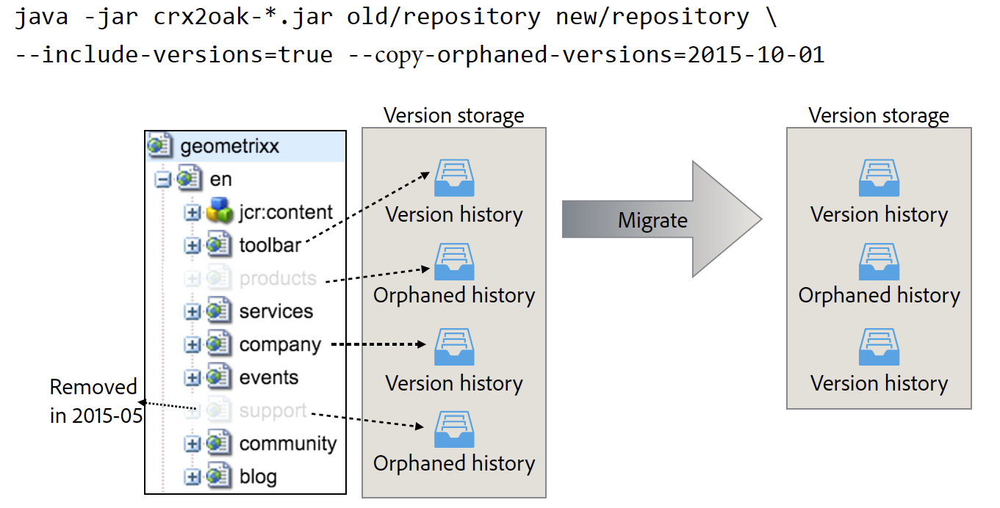

# Uso de la herramienta de migración CRX2Oak{#using-the-crx-oak-migration-tool}

## Introducción {#introduction}

CRX2Oak es una herramienta diseñada para migrar datos entre diferentes repositorios.

Puede utilizarse para migrar datos de versiones anteriores de CQ basadas en Apache Jackrabbit 2 a Oak, y también puede utilizarse para copiar datos entre repositorios de Oak.

Puede descargar la versión más reciente de crx2oak desde el repositorio público de Adobe en esta ubicación:
[https://repo.adobe.com/nexus/content/groups/public/com/adobe/granite/crx2oak/](https://repo.adobe.com/nexus/content/groups/public/com/adobe/granite/crx2oak/)

La lista de cambios y correcciones para la versión más reciente se encuentra en las Notas [de revisión de](https://docs.adobe.com/content/help/en/experience-manager-64/release-notes/crx2oak.html)CRX2Oak.

>[!NOTE]
>
>Para obtener más información sobre Apache Oak y los conceptos clave de la asistencia AEM, consulte [Introducción a la plataforma](/help/sites-deploying/platform.md)AEM.

## Casos de uso de la migración {#migration-use-cases}

La herramienta se puede utilizar para:

* Migración de versiones anteriores de CQ 5 a AEM 6
* Copia de datos entre varios repositorios Oak
* Conversión de datos entre diferentes implementaciones de Oak MicroKernel.

La compatibilidad con la migración de repositorios mediante Blob Stores externos (comúnmente conocidos como Almacenes de datos) se proporciona en diferentes combinaciones. Una posible ruta de migración es desde un repositorio CRX2 que utiliza un repositorio externo `FileDataStore` a un repositorio Oak mediante un `S3DataStore`.

El diagrama siguiente ilustra todas las combinaciones de migración posibles admitidas por CRX2Oak:


## Características {#features}

CRX2Oak se llama durante las actualizaciones de AEM de forma que el usuario pueda especificar un perfil de migración predefinido que automatice la reconfiguración de los modos de persistencia. Esto se denomina modo de inicio rápido.

También se puede ejecutar por separado en caso de que requiera más personalización. Sin embargo, tenga en cuenta que en este modo solo se realizan cambios en el repositorio y que cualquier reconfiguración adicional de AEM debe realizarse manualmente. Esto se denomina modo independiente.

Otra cosa a tener en cuenta es que con la configuración predeterminada en modo independiente, sólo se migrará el almacén de nodos y el nuevo repositorio reutilizará el antiguo almacenamiento binario.

### Modo de inicio rápido automatizado {#automated-quickstart-mode}

Desde AEM 6.3, CRX2Oak puede gestionar perfiles de migración definidos por el usuario que se pueden configurar con todas las opciones de migración ya disponibles. Esto permite una mayor flexibilidad y la capacidad de automatizar la configuración de AEM, funciones que no están disponibles si se utiliza la herramienta en modo independiente.

Para cambiar CRX2Oak al modo de inicio rápido, debe definir la ruta a la carpeta crx-quickstart en el directorio de instalación de AEM a través de esta variable ambiental del sistema operativo:

**Para sistemas basados en UNIX y macOS:**

```shell
export SLING_HOME="/path/to/crx-quickstart"
```

**Para Windows:**

```shell
SET "SLING_HOME=/path/to/crx-quickstart"
```

#### Reanudar asistencia {#resume-support}

La migración puede interrumpirse en cualquier momento, con la posibilidad de reanudarla posteriormente.

#### Lógica de actualización personalizable {#customizable-upgrade-logic}

La lógica personalizada de Java también se puede implementar mediante `CommitHooks`. Se pueden implementar `RepositoryInitializer` clases personalizadas para inicializar el repositorio con valores personalizados.

#### Compatibilidad con las operaciones asignadas a memoria {#support-for-memory-mapped-operations}

CRX2Oak también admite operaciones asignadas a memoria de forma predeterminada. La asignación de memoria mejora considerablemente el rendimiento y debe utilizarse siempre que sea posible.

>[!CAUTION]
>
>Sin embargo, tenga en cuenta que las operaciones asignadas a memoria no son compatibles con las plataformas Windows. Por lo tanto, se recomienda agregar el parámetro **—disable-mmap** al realizar la migración en Windows.

#### Migración selectiva de contenido {#selective-migration-of-content}

De forma predeterminada, la herramienta migra todo el repositorio bajo la `"/"` ruta. Sin embargo, tiene control absoluto sobre qué contenido se debe migrar.

Si hay alguna parte del contenido que no sea necesaria en la nueva instancia, puede utilizar el `--exclude-path` parámetro para excluir el contenido y optimizar el procedimiento de actualización.

#### Combinación de rutas {#path-merging}

Si es necesario copiar datos entre dos repositorios y tiene una ruta de contenido diferente en ambas instancias, puede definirlos en el `--merge-path` parámetro . Una vez que lo haga, CRX2Oak copiará sólo los nuevos nodos en el repositorio de destino y mantendrá los antiguos en su lugar.


#### Compatibilidad con versiones {#version-support}

De forma predeterminada, AEM creará una versión de cada nodo o página que se modifique y la almacenará en el repositorio. Las versiones se pueden utilizar para restaurar la página a un estado anterior.

Sin embargo, estas versiones nunca se purgan aunque se elimine la página original. Cuando se trata de repositorios que han estado en funcionamiento durante mucho tiempo, es posible que la migración necesite procesar muchos datos redundantes causados por versiones huérfanas.

Una característica útil para estos tipos de situaciones es la adición del `--copy-versions` parámetro. Se puede utilizar para omitir los nodos de versión durante la migración o la copia de un repositorio.

También puede elegir si desea copiar versiones huérfanas agregando `--copy-orphaned-versions=true`.

Ambos parámetros también admiten un formato de fecha, en caso de que desee copiar versiones a más tardar en una fecha específica. `YYYY-MM-DD`



#### Abrir versión de origen {#open-source-version}

Una versión de código abierto de CRX2Oak está disponible en forma de actualización de roak. Admite todas las funciones excepto:

* Compatibilidad con CRX2
* Compatibilidad con perfiles de migración
* Compatibilidad con la reconfiguración automatizada de AEM

See the [Apache Documentation](https://jackrabbit.apache.org/oak/docs/migration.html) for more information.

## Parámetros {#parameters}

### Opciones del almacén de nodos {#node-store-options}

* `--cache`:: Tamaño de caché en MB (el valor predeterminado es `256`)

* `--mmap`:: Habilitar el acceso a los archivos asignados a la memoria para el almacén de segmentos
* `--src-password:` Contraseña para la base de datos RDB de origen

* `--src-user:` Usuario para la RDB de origen

* `--user`:: Usuario para la RDB objetivo

* `--password`:: Contraseña para la RDB de destino.

### Opciones de migración {#migration-options}

* `--early-shutdown`:: Cierra el repositorio JCR2 de origen después de copiar los nodos y antes de aplicar los ganchos de confirmación
* `--fail-on-error`:: Fuerza un error en la migración si los nodos no se pueden leer desde el repositorio de origen.
* `--ldap`:: Migra usuarios LDAP de una instancia de CQ 5.x a una instancia basada en Oak. Para que esto funcione, el proveedor de identidad de la configuración Oak debe llamarse ldap. For more information, see the [LDAP documentation](/help/sites-administering/ldap-config.md).

* `--ldap-config:` Utilícelo junto con el `--ldap` parámetro para repositorios de CQ 5.x que utilizaron varios servidores LDAP para la autenticación. Puede utilizarla para apuntar a los archivos de configuración CQ 5.x `ldap_login.conf` o `jaas.conf` . El formato es `--ldapconfig=path/to/ldap_login.conf`.

### Opciones del almacén de versiones {#version-store-options}

* `--copy-orphaned-versions`:: Omite copiar versiones huérfanas. Los parámetros admitidos son: `true`, `false` y `yyyy-mm-dd`. El valor predeterminado es `true`.

* `--copy-versions:` Copia el almacenamiento de la versión. Parameters: `true`, `false`, `yyyy-mm-dd`. El valor predeterminado es `true`.

#### Opciones de ruta {#path-options}

* `--include-paths:` Lista separada por comas de las rutas que se incluirán durante la copia
* `--merge-paths`:: Lista de rutas separadas por comas para combinar durante la copia
* `--exclude-paths:` Lista separada por comas de las rutas que se van a excluir durante la copia.

### Opciones del almacén de blob de origen {#source-blob-store-options}

* `--src-datastore:` El directorio del almacén de datos que se utilizará como origen `FileDataStore`

* `--src-fileblobstore`:: El directorio del almacén de datos que se utilizará como origen `FileBlobStore`

* `--src-s3datastore`:: El directorio del almacén de datos que se usará para el origen `S3DataStore`

* `--src-s3config`:: El archivo de configuración del origen `S3DataStore`.

### Opciones de BlobStore de destino {#destination-blobstore-options}

* `--datastore:` El directorio del almacén de datos que se utilizará como destino `FileDataStore`

* `--fileblobstore:` El directorio del almacén de datos que se utilizará como destino `FileBlobStore`

* `--s3datastore`:: El directorio del almacén de datos que se usará para el destino `S3DataStore`

* `--s3config`:: El archivo de configuración del destino `S3DataStore`.

### Opciones de ayuda {#help-options}

* `-?, -h, --help:` Muestra información de ayuda.

## Depuración {#debugging}

También puede habilitar la información de depuración para el proceso de migración a fin de solucionar cualquier problema que pueda aparecer durante el proceso. Puede hacerlo de forma diferente en función del modo en el que desee ejecutar la herramienta:

<table>
 <tbody>
  <tr>
   <td><strong>Modo CRX2Oak</strong></td>
   <td><strong>Acción</strong></td>
  </tr>
  <tr>
   <td>Modo de inicio rápido</td>
   <td>Puede agregar las <strong>—nivel de registro TRACE</strong> o <strong>— </strong>opciones DEBUG a nivel de registro a la línea de comandos cuando ejecute CRX2Oak. En este modo, los registros se redirigen automáticamente al archivo <strong></strong>upgrade.log.</td>
  </tr>
  <tr>
   <td>Modo independiente</td>
   <td><p>Agregue las <strong>—opciones de seguimiento</strong> a la línea de comandos CRX2Oak para mostrar los eventos TRACE en la salida estándar (debe redirigir los registros usted mismo usando el carácter de redirección: '&gt;' o 'tee' para una inspección posterior).</p> </td>
  </tr>
 </tbody>
</table>

## Otras consideraciones {#other-considerations}

Al migrar a un conjunto de réplicas MongoDB, asegúrese de establecer el `WriteConcern` parámetro en `2` todas las conexiones a las bases de datos Mongo.

Para ello, agregue el `w=2` parámetro al final de la cadena de conexión, como se muestra a continuación:

```xml
java -Xmx4092m -XX:MaxPermSize=1024m -jar crx2oak.jar crx-quickstart/repository/ mongodb://localhost:27017/aem-author?replicaset=replica1&w=2
```

>[!NOTE]
>
>Para obtener más información, consulte la documentación de la cadena de conexión MongoDB sobre preocupaciones de [escritura](https://docs.mongodb.org/manual/reference/connection-string/#write-concern-options).

