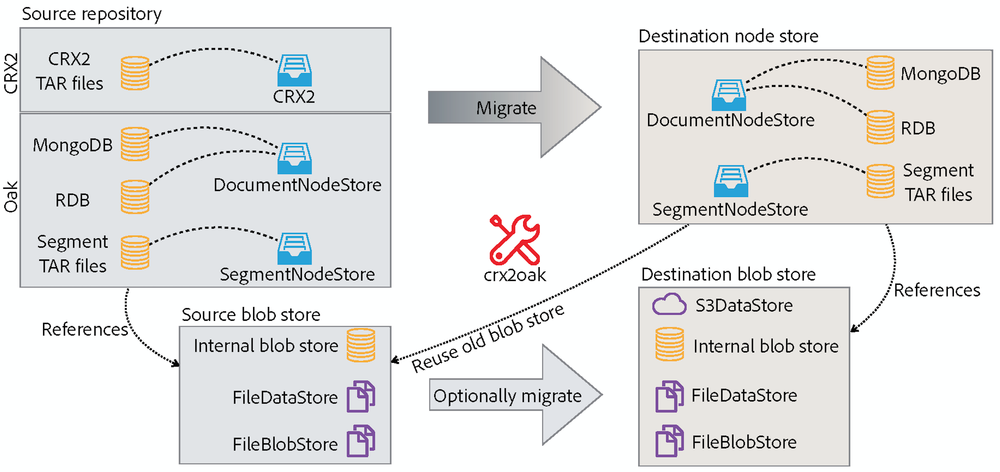
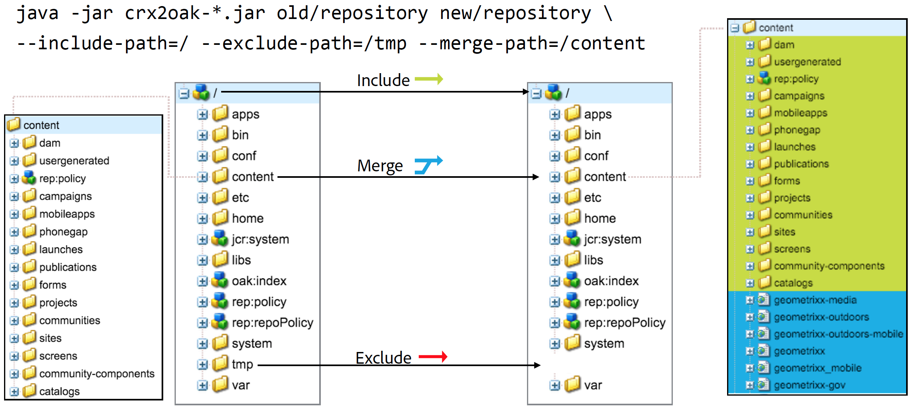
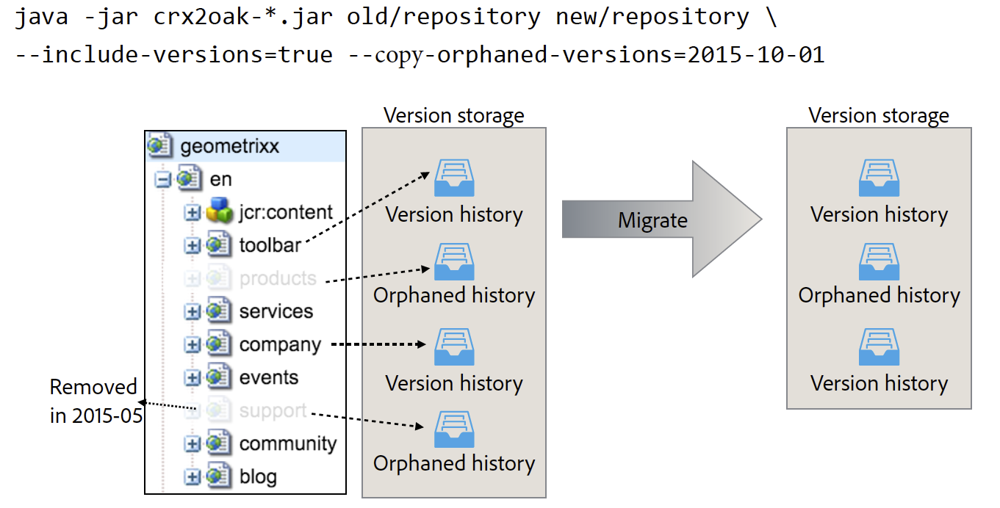

# Uso de la herramienta de migración de CRX2Oak{#using-the-crx-oak-migration-tool}

## Introducción {#introduction}

CRX2Oak es una herramienta diseñada para migrar datos entre diferentes repositorios.

Se puede utilizar para migrar datos de versiones de CQ anteriores basadas en Apache Jackrabbit 2 a Oak, y también se puede utilizar para copiar datos entre repositorios de Oak.

Puede descargar la versión más reciente de crx2oak del repositorio público de Adobe en esta ubicación:
[https://repo1.maven.org/maven2/com/adobe/granite/crx2oak/](https://repo1.maven.org/maven2/com/adobe/granite/crx2oak/)

>[!NOTE]
>
>Para obtener más información sobre Apache Oak y los conceptos clave de la persistencia de Adobe Experience Manager (AEM), consulte [Introducción a la plataforma de AEM](/help/sites-deploying/platform.md).

## Casos de uso de migración {#migration-use-cases}

La herramienta se puede utilizar para lo siguiente:

* Migración de versiones anteriores de CQ 5 a AEM 6
* Copia de datos entre varios repositorios de Oak
* Convertir datos entre diferentes implementaciones de MicroKernel de Oak.

La compatibilidad con la migración de repositorios mediante almacenes de blobs externos (conocidos comúnmente como almacenes de datos) se proporciona en diferentes combinaciones. Una posible ruta de migración es de un repositorio de CRX2 que usa un(a) `FileDataStore` externo a un repositorio de Oak que usa un(a) `S3DataStore`.

El diagrama siguiente ilustra todas las combinaciones de migración posibles que admite CRX2Oak:



## Características {#features}

Se llama a CRX2Oak durante las actualizaciones de AEM de forma que el usuario pueda especificar un perfil de migración predefinido que automatice la reconfiguración de los modos de persistencia. Este se denomina modo de inicio rápido.

También se puede ejecutar por separado en caso de que requiera más personalización. Sin embargo, en este modo los cambios se realizan solamente en el repositorio y cualquier reconfiguración adicional de AEM debe realizarse manualmente. Esto se denomina modo independiente.

Otra cosa que hay que tener en cuenta es que con la configuración predeterminada en modo independiente, solo se migra el almacén de nodos y el nuevo repositorio reutiliza el antiguo almacenamiento binario.

### Modo de inicio rápido automatizado {#automated-quickstart-mode}

Desde AEM 6.3, CRX2Oak puede gestionar perfiles de migración definidos por el usuario que se pueden configurar con todas las opciones de migración ya disponibles. Esto permite una mayor flexibilidad y la capacidad de automatizar la configuración de AEM, funciones que no están disponibles si utiliza la herramienta en modo independiente.

Para cambiar CRX2Oak al modo de inicio rápido, defina la ruta a la carpeta crx-quickstart en el directorio de instalación de AEM mediante esta variable ambiental del sistema operativo:

**Para sistemas basados en UNIX y macOS:**

```shell
export SLING_HOME="/path/to/crx-quickstart"
```

**Para Windows:**

```shell
SET "SLING_HOME=/path/to/crx-quickstart"
```

#### Reanudar compatibilidad {#resume-support}

La migración se puede interrumpir en cualquier momento, con la posibilidad de reanudarla posteriormente.

#### Lógica de actualización personalizable {#customizable-upgrade-logic}

La lógica personalizada de Java™ se puede implementar usando `CommitHooks`. Se pueden implementar clases personalizadas `RepositoryInitializer` para inicializar el repositorio con valores personalizados.

#### Compatibilidad con operaciones con asignación de memoria {#support-for-memory-mapped-operations}

CRX2Oak también admite operaciones asignadas a memoria de forma predeterminada. La asignación de memoria mejora considerablemente el rendimiento y debe utilizarse siempre que sea posible.

>[!CAUTION]
>
>Sin embargo, tenga en cuenta que las operaciones asignadas a memoria no son compatibles con las plataformas Windows. Por lo tanto, se recomienda agregar el parámetro **—disable-map** al realizar la migración en Windows.

#### Migración selectiva de contenido {#selective-migration-of-content}

De forma predeterminada, la herramienta migra todo el repositorio en la ruta de acceso `"/"`. Sin embargo, tiene el control completo sobre qué contenido debe migrarse.

Si hay alguna parte del contenido que no sea necesaria en la nueva instancia, puede utilizar el parámetro `--exclude-path` para excluir el contenido y optimizar el procedimiento de actualización.

#### Combinación de rutas {#path-merging}

Si los datos deben copiarse entre dos repositorios y tiene una ruta de contenido diferente en ambas instancias, puede definirlos en el parámetro `--merge-path`. Cuando lo haga, CRX2Oak copiará solo los nodos nuevos en el repositorio de destino y mantendrá los antiguos en su lugar.



#### Compatibilidad con versiones {#version-support}

De forma predeterminada, AEM crea una versión de cada nodo o página que se modifica y la almacena en el repositorio. Las versiones se pueden utilizar para restaurar la página a un estado anterior.

Sin embargo, estas versiones nunca se purgan, aunque se elimine la página original. Cuando se trata de repositorios que han estado en funcionamiento durante mucho tiempo, la migración puede volver a procesar los datos redundantes causados por versiones huérfanas.

Una característica útil para estos tipos de situaciones es la adición del parámetro `--copy-versions`. Se puede utilizar para omitir los nodos de versión durante la migración o la copia de un repositorio.

También puede copiar versiones huérfanas agregando `--copy-orphaned-versions=true`.

Ambos parámetros también admiten un formato de fecha `YYYY-MM-DD`, en caso de que desee copiar versiones a más tardar en una fecha específica.



#### Abrir la versión de Source {#open-source-version}

Una versión de código abierto de CRX2Oak está disponible en forma de oak-upgrade. Admite todas las funciones excepto:

* Compatibilidad con CRX2
* Compatibilidad con perfiles de migración
* Compatibilidad con la reconfiguración automatizada de AEM

Consulte la [Documentación de Apache](https://jackrabbit.apache.org/oak/docs/migration.html) para obtener más información.

## Parámetros {#parameters}

### Opciones del almacén de nodos {#node-store-options}

* `--cache`: tamaño de la caché en MB (el valor predeterminado es `256`)

* `--mmap`: habilitar el acceso a archivos asignados en memoria para el almacén de segmentos
* Contraseña `--src-password:` para la base de datos RDB de origen

* `--src-user:` usuario para la RDB de origen

* `--user`: usuario para la RDB de destino

* `--password`: contraseña para la RDB de destino.

### Opciones de migración {#migration-options}

* `--early-shutdown`: cierra el repositorio JCR2 de origen después de copiar los nodos y antes de aplicar los enlaces de compromiso
* `--fail-on-error`: fuerza un error de migración si los nodos no se pueden leer desde el repositorio de origen.
* `--ldap`: migra usuarios LDAP de una instancia CQ 5.x a una instancia basada en Oak. Para que esto funcione, el proveedor de identidad en la configuración de Oak debe llamarse ldap. Para obtener más información, consulte la [documentación de LDAP](/help/sites-administering/ldap-config.md).

* `--ldap-config:` Use esto con el parámetro `--ldap` para repositorios CQ 5.x que usaron varios servidores LDAP para la autenticación. Puede utilizarlo para señalar a los archivos de configuración CQ 5.x `ldap_login.conf` o `jaas.conf`. El formato es `--ldapconfig=path/to/ldap_login.conf`.

### Opciones del almacén de versiones {#version-store-options}

* `--copy-orphaned-versions`: omite la copia de versiones huérfanas. Los parámetros admitidos son: `true`, `false` y `yyyy-mm-dd`. El valor predeterminado es `true`.

* `--copy-versions:` copia el almacenamiento de versiones. Parámetros: `true`, `false`, `yyyy-mm-dd`. El valor predeterminado es `true`.

#### Opciones de ruta {#path-options}

* `--include-paths:` Lista de rutas separadas por comas que se incluirán durante la copia
* `--merge-paths`: lista de rutas de acceso separadas por comas que se combinarán durante la copia
* `--exclude-paths:` Lista de rutas separadas por comas que se excluirán durante la copia.

### Opciones de tienda de Source Blob {#source-blob-store-options}

* `--src-datastore:` El directorio de almacén de datos que se va a usar como origen `FileDataStore`

* `--src-fileblobstore`: el directorio de almacén de datos que se va a usar como origen `FileBlobStore`

* `--src-s3datastore`: directorio de almacén de datos que se va a usar para el origen `S3DataStore`

* `--src-s3config`: archivo de configuración para el origen `S3DataStore`.

### Opciones de BlobStore de destino {#destination-blobstore-options}

* `--datastore:` El directorio de almacén de datos que se va a usar como destino `FileDataStore`

* `--fileblobstore:` El directorio de almacén de datos que se va a usar como destino `FileBlobStore`

* `--s3datastore`: directorio de almacén de datos que se va a usar para el destino `S3DataStore`

* `--s3config`: archivo de configuración para el destino `S3DataStore`.

### Opciones de ayuda {#help-options}

* `-?, -h, --help:` Muestra información de ayuda.

## Depuración {#debugging}

También puede habilitar la información de depuración para el proceso de migración con el fin de solucionar los problemas que puedan aparecer durante el proceso. Puede hacerlo de forma diferente en función del modo en el que desee ejecutar la herramienta:

<table>
 <tbody>
  <tr>
   <td><strong>Modo CRX2Oak</strong></td>
   <td><strong>Acción</strong></td>
  </tr>
  <tr>
   <td>Modo de inicio rápido</td>
   <td>Puede agregar las opciones <strong> (TRACE</strong> de nivel de registro o <strong>) de DEPURACIÓN de nivel de registro </strong>a la línea de comandos al ejecutar CRX2Oak. En este modo, los registros se redirigen automáticamente al <strong>archivo upgrade.log</strong>.</td>
  </tr>
  <tr>
   <td>Modo independiente</td>
   <td><p>Agregue las opciones <strong>—trace</strong> a la línea de comandos de CRX2Oak para que pueda mostrar eventos de TRACE en la salida estándar (debe redirigir los registros usando el carácter de redirección: '&gt;' o el comando 'tee' para una inspección posterior).</p> </td>
  </tr>
 </tbody>
</table>

## Otras consideraciones {#other-considerations}

Al migrar a un conjunto de réplicas MongoDB, asegúrese de establecer el parámetro `WriteConcern` en `2` en todas las conexiones a las bases de datos Mongo.

Puede hacerlo agregando el parámetro `w=2` al final de la cadena de conexión, de esta manera:

```xml
java -Xmx4092m -jar crx2oak.jar crx-quickstart/repository/ mongodb://localhost:27017/aem-author?replicaset=replica1&w=2
```

>[!NOTE]
>
>Para obtener más información, consulte la documentación de la cadena de conexión MongoDB en [Escribir preocupaciones](https://docs.mongodb.org/manual/reference/connection-string/#write-concern-options).
