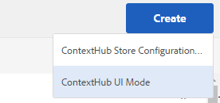

# Configuración de ContextHub {#configuring-contexthub}

ContextHub es un marco para almacenar, manipular y presentar datos de contexto. Para obtener más información sobre ContextHub, consulte la [documentación para desarrolladores](/help/sites-developing/contexthub.md). ContextHub reemplaza [Client Context](/help/sites-administering/client-context.md) en la IU táctil.

Configure la barra de herramientas [ContextHub](/help/sites-developing/contexthub.md) para controlar si aparece en modo de Previsualización, para crear almacenes de ContextHub y agregar módulos de interfaz de usuario mediante la IU táctil.

## Desactivación de ContextHub {#disabling-contexthub}

De forma predeterminada, ContextHub está habilitado en una instalación AEM. ContextHub se puede deshabilitar para evitar que cargue js/css e inicialice. Existen dos opciones para deshabilitar ContextHub:

* Edite la configuración de ContextHub y marque la opción **Deshabilitar ContextHub**

   1. En el carril, toque o haga clic en **Herramientas > Sitios > ContextHub**
   1. Toque o haga clic en el **Contenedor de configuración predeterminado**
   1. Seleccione la **Configuración de ContextHub** y toque o haga clic en **Editar elemento seleccionado**
   1. Toque o haga clic en **Deshabilitar ContextHub** y toque o haga clic en **Guardar**

o

* Use CRXDE Lite para establecer la propiedad `disabled` en **true** en `/libs/settings/cloudsettings`

>[!NOTE]
>
>[Debido a la reestructuración del repositorio en AEM 6.4, ](/help/sites-deploying/repository-restructuring.md) la ubicación de las configuraciones de ContextHub cambió de  `/etc/cloudsettings` a:
>
> * `/libs/settings/cloudsettings`
> * `/conf/global/settings/cloudsettings`
> * `/conf/<tenant>/settings/cloudsettings`


## Mostrar y ocultar la interfaz de usuario de ContextHub {#showing-and-hiding-the-contexthub-ui}

Configure el servicio OSGi de ContextHub de Adobe Granite para mostrar u ocultar la [IU de ContextHub](/help/sites-authoring/ch-previewing.md) en sus páginas. El PID de este servicio es `com.adobe.granite.contexthub.impl.ContextHubImpl.`

Para configurar el servicio, puede utilizar la [Consola Web](/help/sites-deploying/configuring-osgi.md#osgi-configuration-with-the-web-console) o un nodo [JCR en el repositorio](/help/sites-deploying/configuring-osgi.md#osgi-configuration-in-the-repository):

* **Consola web:** para mostrar la interfaz de usuario, seleccione la propiedad Mostrar interfaz de usuario. Para ocultar la interfaz de usuario, desactive la propiedad Ocultar IU.
* **Nodo JCR:** para mostrar la interfaz de usuario, establezca la  `com.adobe.granite.contexthub.show_ui` propiedad booleana en  `true`. Para ocultar la interfaz de usuario, establezca la propiedad en `false`.

Al mostrar la interfaz de usuario de ContextHub, solo aparece en las páginas de AEM instancias de autor. La interfaz de usuario no aparece en las páginas de instancias de publicación.

## Añadir los modos y módulos de interfaz de usuario de ContextHub {#adding-contexthub-ui-modes-and-modules}

Configure los modos y módulos de interfaz de usuario que aparecen en la barra de herramientas de ContextHub en modo de Previsualización:

* Modos de IU: Grupos de módulos relacionados
* Módulos: Widgets que exponen datos de contexto de una tienda y permiten a los autores manipular el contexto

Los modos de IU aparecen como una serie de iconos en la parte izquierda de la barra de herramientas. Cuando se selecciona, los módulos de un modo de IU aparecen a la derecha.


Los iconos son referencias de la [biblioteca de iconos de la interfaz de usuario de Coral](https://helpx.adobe.com/experience-manager/6-4/sites/developing/using/reference-materials/coral-ui/coralui3/Coral.Icon.html#availableIcons).

### Añadir un modo de IU {#adding-a-ui-mode}

Añada un modo de IU para agrupar los módulos de ContextHub relacionados. Al crear el modo de IU, se proporciona el título y el icono que aparecen en la barra de herramientas de ContextHub.

1. En el carril del Experience Manager, toque o haga clic en Herramientas > Sitios > Context Hub.
1. Toque o haga clic en el Contenedor de configuración predeterminado.
1. Toque o haga clic en la Configuración de Context Hub.
1. Toque o haga clic en el botón Crear y, a continuación, toque o haga clic en el modo de IU de Context Hub.

   

1. Proporcione valores para las siguientes propiedades:

   * Título del modo de IU: Título que identifica el modo de IU
   * Icono de modo: El selector del icono [IU de Coral](https://helpx.adobe.com/experience-manager/6-4/sites/developing/using/reference-materials/coral-ui/coralui3/Coral.Icon.html#availableIcons) que se va a usar, por ejemplo `coral-Icon--user`
   * Habilitado: Seleccione esta opción para mostrar el modo de IU en la barra de herramientas de ContextHub

1. Haga clic o pulse Guardar.

### Añadir un módulo de interfaz de usuario {#adding-a-ui-module}

Añada un módulo de interfaz de usuario de ContextHub en un modo de interfaz de usuario para que aparezca en la barra de herramientas de ContextHub para obtener una vista previa del contenido de la página. Cuando agrega un módulo de interfaz de usuario, está creando una instancia de un tipo de módulo registrado con ContextHub. Para agregar un módulo de interfaz de usuario, debe conocer el nombre del tipo de módulo asociado.

AEM proporciona un tipo de módulo de interfaz de usuario base, así como varios tipos de módulo de interfaz de usuario de ejemplo en los que puede basar un módulo de interfaz de usuario. La siguiente tabla proporciona una breve descripción de cada una. Para obtener información sobre el desarrollo de un módulo de interfaz de usuario personalizado, consulte [Creación de módulos de interfaz de usuario de ContextHub](/help/sites-developing/ch-extend.md#creating-contexthub-ui-module-types).

Las propiedades del módulo UI incluyen una configuración detallada en la que puede proporcionar valores para propiedades específicas del módulo. La configuración detallada se proporciona en formato JSON. La columna Tipo de módulo de la tabla proporciona vínculos a información sobre el código JSON necesario para cada tipo de módulo de interfaz de usuario.

| Tipo de módulo | Descripción | Almacenar |
|---|---|---|
| [contexthub.base](/help/sites-developing/ch-samplemodules.md#contexthub-base-ui-module-type) | Un tipo de módulo de interfaz de usuario genérico | Configurado en las propiedades del módulo de interfaz de usuario |
| [contexthub.browserinfo](/help/sites-developing/ch-samplemodules.md#contexthub-browserinfo-ui-module-type) | Muestra información sobre el explorador | surferinfo |
| [contexthub.datetime](/help/sites-developing/ch-samplemodules.md#contexthub-datetime-ui-module-type) | Muestra información de fecha y hora | datetime |
| [contexthub.device](/help/sites-developing/ch-samplemodules.md#contexthub-device-ui-module-type) | Mostrar el dispositivo cliente | emuladores |
| [contexthub.location](/help/sites-developing/ch-samplemodules.md#contexthub-location-ui-module-type) | Muestra la latitud y la longitud del cliente, así como la ubicación en un mapa. Permite cambiar la ubicación. | geolocalización |
| [contexthub.screen-orientation](/help/sites-developing/ch-samplemodules.md#contexthub-screen-orientation-ui-module-type) | Muestra la orientación de la pantalla del dispositivo (horizontal o vertical) | emuladores |
| [contexthub.tagcloud](/help/sites-developing/ch-samplemodules.md#contexthub-tagcloud-ui-module-type) | Muestra estadísticas sobre las etiquetas de página | tagcloud |
| [granite.perfil](/help/sites-developing/ch-samplemodules.md#granite-profile-ui-module-type) | Muestra la información de perfil del usuario actual, incluso autorizableID, displayName y familyName. Puede cambiar el valor de displayName y familyName. | El perfil. |

1. En el carril del Experience Manager, toque o haga clic en Herramientas > Sitios > ContextHub.
1. Toque o haga clic en el Contenedor de configuración al que desee agregar un módulo de interfaz de usuario.
1. Haga clic o escriba la Configuración de ContextHub a la que desea agregar el módulo de interfaz de usuario.
1. Toque o haga clic en el modo de IU al que está agregando el módulo de IU.
1. Toque o haga clic en el botón Crear y, a continuación, toque o haga clic en ContextHub UI Module (genérico).

   

1. Proporcione valores para las siguientes propiedades:

   * Título del módulo UI: Título que identifica el módulo de interfaz de usuario
   * Tipo de módulo: El tipo de módulo
   * Habilitado: Seleccione esta opción para mostrar el módulo de interfaz de usuario en la barra de herramientas de ContextHub

1. (Opcional) Para anular la configuración de almacenamiento predeterminada, introduzca un objeto JSON para configurar el módulo de interfaz de usuario.
1. Haga clic o pulse Guardar.

## Creación de una tienda de ContextHub {#creating-a-contexthub-store}

Cree un almacén de Context Hub para conservar los datos de usuario y acceder a ellos según sea necesario. Las tiendas de ContextHub se basan en los candidatos de las tiendas registradas. Cuando crea la tienda, necesita el valor de storeType con el que se registró el candidato de la tienda. (Consulte [Creación de candidatos de tienda personalizados](/help/sites-developing/ch-extend.md#creating-custom-store-candidates)).

### Configuración detallada del almacén {#detailed-store-configuration}

Al configurar una tienda, la propiedad Configuración de detalles permite proporcionar valores para propiedades específicas de la tienda. El valor se basa en el parámetro `config` de la función `init` del almacén. Por lo tanto, si necesita proporcionar este valor, y el formato del valor, depende de la tienda.

El valor de la propiedad Configuración de detalles es un objeto `config` en formato JSON.

### Candidatos de tienda de muestra {#sample-store-candidates}

AEM proporciona los siguientes candidatos de almacén de muestra en los que puede basar una tienda.

| Tipo de tienda | Descripción |
|---|---|
| [aem.segmentation](/help/sites-developing/ch-samplestores.md#aem-segmentation-sample-store-candidate) | Almacenar para segmentos de ContextHub resueltos y sin resolver. Recupera automáticamente segmentos desde el Administrador de segmentos de ContextHub |
| [aem.resolvedsegments](/help/sites-developing/ch-samplestores.md#aem-resolvedsegments-sample-store-candidate) | Almacena los segmentos resueltos actualmente. Escucha el servicio ContextHub SegmentManager para actualizar automáticamente la tienda |
| [contexthub.geolocation](/help/sites-developing/ch-samplestores.md#contexthub-geolocation-sample-store-candidate) | Almacena la latitud y la longitud de la ubicación del explorador. |
| [contexthub.datetime](/help/sites-developing/ch-samplestores.md#contexthub-datetime-sample-store-candidate) | Almacena la fecha, hora y temporada actuales para la ubicación del explorador |
| [granite.emulators](/help/sites-developing/ch-samplestores.md#granite-emulators-sample-store-candidate) | Define las propiedades y capacidades de varios dispositivos y detecta el dispositivo cliente actual |
| [contexthub.generic-jsonp](/help/sites-developing/ch-samplestores.md#contexthub-generic-jsonp-sample-store-candidate) | Recupera y almacena datos de un servicio JSONP |
| [granite.perfil](/help/sites-developing/ch-samplestores.md#granite-profile-sample-store-candidate) | Almacena datos de perfil para el usuario actual |
| [contexthub.surferinfo](/help/sites-developing/ch-samplestores.md#contexthub-surferinfo-sample-store-candidate) | Almacena información sobre el cliente, como la información del dispositivo, el tipo de navegador y la orientación de la ventana |
| [contexthub.tagcloud](/help/sites-developing/ch-samplestores.md#contexthub-tagcloud-sample-data-store) | Almacena etiquetas de página y recuentos de etiquetas |

1. En el carril del Experience Manager, toque o haga clic en Herramientas > Sitios > ContextHub.
1. Toque o haga clic en el contenedor de configuración predeterminado.
1. Haga clic o toque Configuración de Contexthub
1. Para agregar una tienda, toque o haga clic en el icono Crear y, a continuación, toque o haga clic en Configuración de la tienda ContexHub.

   

1. Proporcione valores para las propiedades de configuración básicas y toque o haga clic en Siguiente:

   * **Título de configuración:** el título que identifica el almacén
   * **Tipo de almacén:** el valor de la propiedad storeType del candidato de almacén en el que se basa el almacén
   * **Requerido:** Seleccionar
   * **Habilitado:** seleccione esta opción para habilitar la tienda

1. (Opcional) Para anular la configuración predeterminada del almacén, introduzca un objeto JSON en el cuadro Configuración de detalles (JSON).
1. Haga clic o pulse Guardar.

## Ejemplo: Uso de un servicio JSONP {#example-using-a-jsonp-service}

Este ejemplo ilustra cómo configurar una tienda y mostrar los datos en un módulo de interfaz de usuario. En este ejemplo, el servicio MD5 del sitio jsontest.com se utiliza como fuente de datos para una tienda. El servicio devuelve el código hash MD5 de una cadena determinada, en formato JSON.

Se ha configurado un almacén contexthub.generic-jsonp para que almacene datos para la llamada de servicio `https://md5.jsontest.com/?text=%22text%20to%20md5%22`. El servicio devuelve los siguientes datos que se muestran en un módulo de interfaz de usuario:

```xml
{
   "md5": "919a56ab62b6d5e1219fe1d95248a2c5",
   "original": "\"text to md5\""
}
```

### Creación de una tienda contexthub.generic-jsonp {#creating-a-contexthub-generic-jsonp-store}

El candidato de almacén de muestras contexthub.generic-jsonp le permite recuperar datos de un servicio JSONP o un servicio Web que devuelve datos JSON. Para este candidato a tienda, utilice la configuración de la tienda para proporcionar detalles sobre el servicio JSONP que se va a utilizar.

La función [init](/help/sites-developing/contexthub-api.md#init-name-config) de la clase `ContextHub.Store.JSONPStore` Javascript define un objeto `config` que inicializa este candidato de almacén. El objeto `config` contiene un objeto `service` que incluye detalles sobre el servicio JSONP. Para configurar el almacén, debe proporcionar el objeto `service` en formato JSON como valor de la propiedad Configuración de detalles.

Para guardar datos del servicio MD5 del sitio jsontest.com, utilice el procedimiento de [Creación de una tienda ContextHub](/help/sites-developing/ch-configuring.md#creating-a-contexthub-store) con las siguientes propiedades:

* **Título de configuración:** md5
* **Tipo de tienda:** contexthub.generic-jsonp
* **Requerido:** Seleccionar
* **Habilitado:** Seleccionar
* **Configuración detallada (JSON):**

   ```xml
   {
    "service": {
    "jsonp": false,
    "timeout": 1000,
    "ttl": 1800000,
    "secure": false,
    "host": "md5.jsontest.com",
    "port": 80,
    "params":{
    "text":"text to md5"
        }
      }
    }
   ```

### Añadir un módulo de interfaz de usuario para los datos de md5 {#adding-a-ui-module-for-the-md-data}

Añada un módulo de interfaz de usuario a la barra de herramientas de ContextHub para mostrar los datos almacenados en la tienda md5 de ejemplo. En este ejemplo, el módulo contexthub.base se utiliza para producir el siguiente módulo de interfaz de usuario:


Utilice el procedimiento de [Añadir un módulo de interfaz de usuario](#adding-a-ui-module) para agregar el módulo de interfaz de usuario a un modo de interfaz de usuario existente, como el modo de interfaz de usuario Perona de ejemplo. Para el módulo de interfaz de usuario, utilice los siguientes valores de propiedad:

* **Título del módulo de interfaz de usuario:** MD5
* **Tipo de módulo:** contexthub.base
* **Configuración detallada (JSON):**

   ```xml
   {
    "icon": "coral-Icon--data",
    "title": "MD5 Converstion",
    "storeMapping": { "md5": "md5" },
    "template": "<p> {{md5.original}}</p>;
                 <p>{{md5.md5}}</p>"
   }
   ```

## Depuración de ContextHub {#debugging-contexthub}

Se puede habilitar un modo de depuración para ContextHub para permitir la resolución de problemas. El modo de depuración se puede habilitar mediante la configuración de ContextHub o mediante CRXDE.

### Mediante la Configuración {#via-the-configuration}

Edite la configuración de ContextHub y marque la opción **Depurar**

1. En el carril, toque o haga clic en **Herramientas > Sitios > ContextHub**
1. Toque o haga clic en el **Contenedor de configuración predeterminado**
1. Seleccione la **Configuración de ContextHub** y toque o haga clic en **Editar elemento seleccionado**
1. Haga clic o toque **Depurar** y toque o haga clic en **Guardar**

### Mediante CRXDE {#via-crxde}

Use CRXDE Lite para establecer la propiedad `debug` en **true** en:

* `/conf/global/settings/cloudsettings` o
* `/conf/<tenant>/settings/cloudsettings`

>[!NOTE]
>
>Para las configuraciones de ContextHub que aún se encuentran bajo sus rutas heredadas, la ubicación para establecer `debug property` es `/libs/settings/cloudsettings/legacy/contexthub`.

### Modo silencioso {#silent-mode}

El modo silencioso suprime toda la información de depuración. A diferencia de la opción de depuración normal, que se puede establecer de forma independiente para cada configuración de ContextHub, el modo silencioso es una configuración global que tiene prioridad sobre cualquier configuración de depuración en el nivel de configuración de ContextHub.

Esto resulta útil para la instancia de publicación, donde no desea ninguna información de depuración. Dado que es una configuración global, se habilita mediante OSGi.

1. Abra la **Configuración de la consola web de Adobe Experience Manager** en `http://<host>:<port>/system/console/configMgr`
1. Buscar **ContextHub de granito de Adobe**
1. Haga clic en la configuración **ContextHub de granito de Adobe** para editar sus propiedades
1. Marque la opción **Modo silencioso** y haga clic en **Guardar**

## Recuperación de las configuraciones de ContextHub tras la actualización {#recovering-contexthub-configurations-after-upgrading}

Cuando se realiza una [actualización a AEM](/help/sites-deploying/upgrade.md), se realiza una copia de seguridad de las configuraciones de ContextHub y se almacenan en una ubicación segura. Durante la actualización, se instalan las configuraciones predeterminadas de ContextHub, reemplazando las configuraciones existentes. La copia de seguridad es necesaria para conservar los cambios o adiciones que haya realizado.

Las configuraciones de ContextHub se almacenan en una carpeta denominada `contexthub` en los nodos siguientes:

* `/conf/global/settings/cloudsettings`
* `/conf/<tenant>/settings/cloudsettings`

Después de una actualización, la copia de seguridad se almacena en una carpeta denominada `contexthub` bajo un nodo denominado:

`/conf/global/settings/cloudsettings/default-pre-upgrade_yyyymmdd_xxxxxxx` o
`/conf/<tenant>/settings/cloudsettings/default-pre-upgrade_yyyymmdd_xxxxxxx`

La porción `yyyymmdd` del nombre del nodo es la fecha en que se realizó la actualización.

Para recuperar las configuraciones de ContextHub, utilice CRXDE Lite para copiar los nodos que representan sus tiendas, modos de interfaz de usuario y módulos de interfaz de usuario desde debajo del nodo `default-pre-upgrade_yyyymmdd_xxxxxx` a continuación:

* `/conf/global/settings/cloudsettings` o
* `/conf/<tenant>/settings/cloudsettings`
