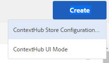

# Configuración de ContextHub {#configuring-contexthub}

ContextHub es un marco de trabajo para almacenar, manipular y presentar datos de contexto. Para obtener más información sobre ContextHub, consulte la [documentación para desarrolladores](/help/sites-developing/contexthub.md). ContextHub reemplaza a [Client Context](/help/sites-administering/client-context.md) en la IU táctil.

Configure las variables [ContextHub](/help/sites-developing/contexthub.md) para controlar si aparece en el modo de vista previa, crear tiendas de ContextHub y añadir módulos de interfaz de usuario mediante la interfaz de usuario táctil optimizada.

## Desactivación de ContextHub {#disabling-contexthub}

AEM De forma predeterminada, ContextHub está habilitado en una instalación de. ContextHub se puede deshabilitar para evitar que se cargue js/css y se inicialice. Existen dos opciones para deshabilitar ContextHub:

* Edite la configuración de ContextHub y marque la opción **Desactivar ContextHub**

   1. En el carril, toque o haga clic en **Herramientas > Sitios > ContextHub**
   1. Toque o haga clic en el valor predeterminado **Contenedor de configuración**
   1. Seleccione el **Configuración de ContextHub** y toque o haga clic en **Editar elemento seleccionado**
   1. Haga clic o toque **Desactivar ContextHub** y toque o haga clic en **Guardar**

o

* Utilice el CRXDE Lite para establecer la propiedad `disabled` hasta **true** bajo `/libs/settings/cloudsettings`

>[!NOTE]
>
>[AEM Debido a la reestructuración de repositorios en la versión 6.4, el](/help/sites-deploying/repository-restructuring.md) la ubicación de las configuraciones de ContextHub ha cambiado de `/etc/cloudsettings` hasta:
>
>* `/libs/settings/cloudsettings`
>* `/conf/global/settings/cloudsettings`
>* `/conf/<tenant>/settings/cloudsettings`


## Mostrar y ocultar la interfaz de usuario de ContextHub {#showing-and-hiding-the-contexthub-ui}

Configure el servicio OSGi de Adobe Granite ContextHub para mostrar u ocultar el [IU de ContextHub](/help/sites-authoring/ch-previewing.md) en sus páginas. El PID de este servicio es `com.adobe.granite.contexthub.impl.ContextHubImpl.`

Para configurar el servicio, puede usar el complemento [Consola web](/help/sites-deploying/configuring-osgi.md#osgi-configuration-with-the-web-console) o use un [Nodo JCR en el repositorio](/help/sites-deploying/configuring-osgi.md#osgi-configuration-in-the-repository):

* **Consola web:** Para mostrar la interfaz de usuario, seleccione la propiedad Mostrar IU. Para ocultar la interfaz de usuario, borre la propiedad Ocultar interfaz de usuario.
* **Nodo JCR:** Para mostrar la interfaz de usuario, establezca el valor booleano `com.adobe.granite.contexthub.show_ui` propiedad a `true`. Para ocultar la interfaz de usuario, establezca la propiedad en `false`.

AEM Al mostrar la interfaz de usuario de ContextHub, solo aparece en las páginas de instancias de autor de la. La interfaz de usuario no aparece en las páginas de instancias de publicación.

## Adición de modos y módulos de IU de ContextHub {#adding-contexthub-ui-modes-and-modules}

Configure los modos y módulos de interfaz de usuario que aparecen en la barra de herramientas de ContextHub en el modo de vista previa:

* Modos de IU: grupos de módulos relacionados
* Módulos: widgets que exponen datos de contexto de un almacén y permiten a los autores manipular el contexto

Los modos de interfaz de usuario aparecen como una serie de iconos en la parte izquierda de la barra de herramientas. Cuando se seleccionan, los módulos de un modo de interfaz de usuario aparecen a la derecha.


Los iconos son referencias de [Biblioteca de iconos de Coral UI](https://helpx.adobe.com/experience-manager/6-4/sites/developing/using/reference-materials/coral-ui/coralui3/Coral.Icon.html#availableIcons).

### Adición de un modo de IU {#adding-a-ui-mode}

Añada un modo de interfaz de usuario para agrupar módulos de ContextHub relacionados. Al crear el modo de IU, se indica el título y el icono que aparecen en la barra de herramientas de ContextHub.

1. En el carril del Experience Manager, toque o haga clic en Herramientas > Sitios > Context Hub.
1. Toque o haga clic en el contenedor de configuración predeterminado.
1. Toque o haga clic en Configuración de ContextHub.
1. Toque o haga clic en el botón Crear y, a continuación, toque o haga clic en el modo de IU de Context Hub.

   

1. Proporcione valores para las siguientes propiedades:

   * Título del modo de IU: título que identifica el modo de IU
   * Icono de modo: el selector para [Icono de Coral UI](https://helpx.adobe.com/experience-manager/6-4/sites/developing/using/reference-materials/coral-ui/coralui3/Coral.Icon.html#availableIcons) para utilizar, por ejemplo `coral-Icon--user`
   * Habilitado: seleccione esta opción para mostrar el modo de IU en la barra de herramientas de ContextHub

1. Haga clic o pulse Guardar.

### Adición de un módulo de IU {#adding-a-ui-module}

Agregue un módulo de IU de ContextHub a un modo de IU para que aparezca en la barra de herramientas de ContextHub para obtener una vista previa del contenido de la página. Al agregar un módulo de IU, se crea una instancia de un tipo de módulo registrado con ContextHub. Para agregar un módulo de interfaz de usuario, debe conocer el nombre del tipo de módulo asociado.

AEM proporciona un tipo de módulo de interfaz de usuario base, así como varios tipos de módulos de interfaz de usuario de ejemplo en los que puede basar un módulo de interfaz de usuario. En la tabla siguiente se proporciona una breve descripción de cada uno. Para obtener información sobre el desarrollo de un módulo de IU personalizado, consulte [Creación de módulos de IU de ContextHub](/help/sites-developing/ch-extend.md#creating-contexthub-ui-module-types).

Las propiedades del módulo de interfaz de usuario incluyen una configuración detallada en la que puede proporcionar valores para propiedades específicas del módulo. Proporcione la configuración detallada en formato JSON. La columna Tipo de módulo de la tabla proporciona vínculos a información sobre el código JSON necesario para cada tipo de módulo de interfaz de usuario.

| Tipo de módulo | Descripción | Almacenar |
|---|---|---|
| [contexthub.base](/help/sites-developing/ch-samplemodules.md#contexthub-base-ui-module-type) | Un tipo de módulo de IU genérico | Configurado en las propiedades del módulo de IU |
| [contexthub.browserinfo](/help/sites-developing/ch-samplemodules.md#contexthub-browserinfo-ui-module-type) | Muestra información sobre el explorador | surferinfo |
| [contexthub.datetime](/help/sites-developing/ch-samplemodules.md#contexthub-datetime-ui-module-type) | Muestra información de fecha y hora | datetime |
| [contexthub.device](/help/sites-developing/ch-samplemodules.md#contexthub-device-ui-module-type) | Mostrar el dispositivo cliente | emuladores |
| [contexthub.location](/help/sites-developing/ch-samplemodules.md#contexthub-location-ui-module-type) | Muestra la latitud y longitud del cliente, así como la ubicación en un mapa. Permite cambiar la ubicación. | geolocation |
| [contexthub.screen-orientation](/help/sites-developing/ch-samplemodules.md#contexthub-screen-orientation-ui-module-type) | Muestra la orientación de pantalla del dispositivo (horizontal o vertical) | emuladores |
| [contexthub.tagcloud](/help/sites-developing/ch-samplemodules.md#contexthub-tagcloud-ui-module-type) | Muestra estadísticas sobre etiquetas de página | nube de etiquetas |
| [granite.profile](/help/sites-developing/ch-samplemodules.md#granite-profile-ui-module-type) | Muestra la información de perfil del usuario actual, incluidos authorizedID, displayName y familyName. Se puede cambiar el valor de displayName y familyName. | perfil |

1. En el carril del Experience Manager, pulse o haga clic en Herramientas > Sitios > ContextHub.
1. Toque o haga clic en el contenedor de configuración al que desea agregar un módulo de interfaz de usuario.
1. Haga clic o escriba la Configuración de ContextHub a la que desea agregar el módulo de interfaz de usuario.
1. Toque o haga clic en el modo de IU al que está agregando el módulo de IU.
1. Pulse o haga clic en el botón Crear y, a continuación, pulse o haga clic en Módulo de IU de ContextHub (genérico).

   

1. Proporcione valores para las siguientes propiedades:

   * Título del módulo de IU: un título que identifica el módulo de IU
   * Tipo de módulo: el tipo de módulo
   * Habilitado: seleccione esta opción para mostrar el módulo de IU en la barra de herramientas de ContextHub

1. (Opcional) Para anular la configuración de almacén predeterminada, introduzca un objeto JSON para configurar el módulo de interfaz de usuario.
1. Haga clic o pulse Guardar.

## Creación de una tienda de ContextHub {#creating-a-contexthub-store}

Cree un almacén de ContextHub para conservar los datos de usuario y acceder a ellos según sea necesario. Las tiendas de ContextHub se basan en candidatos de tiendas registradas. Cuando cree el almacén, necesitará el valor del storeType con el que se registró el candidato del almacén. (Consulte [Crear candidatos de tienda personalizados](/help/sites-developing/ch-extend.md#creating-custom-store-candidates).)

### Configuración detallada de la tienda {#detailed-store-configuration}

Al configurar un almacén, la propiedad Configuración detallada permite proporcionar valores para las propiedades específicas del almacén. El valor se basa en `config` parámetro del almacén `init` función. Por lo tanto, si debe proporcionar este valor y el formato del valor dependen del almacén.

El valor de la propiedad Detail Configuration es un `config` en formato JSON.

### Candidatos de tienda de muestra {#sample-store-candidates}

AEM proporciona los siguientes candidatos de tienda de muestra en los que puede basar una tienda.

| Tipo de tienda | Descripción |
|---|---|
| [aem.segmentation](/help/sites-developing/ch-samplestores.md#aem-segmentation-sample-store-candidate) | Almacenar para segmentos de ContextHub resueltos y no resueltos. Recupera automáticamente segmentos del Administrador de segmentos de ContextHub |
| [aem.resolvedsegments](/help/sites-developing/ch-samplestores.md#aem-resolvedsegments-sample-store-candidate) | Almacena los segmentos resueltos actualmente. Escucha el servicio SegmentManager de ContextHub para actualizar automáticamente el almacén |
| [contexthub.geolocation](/help/sites-developing/ch-samplestores.md#contexthub-geolocation-sample-store-candidate) | Almacena la latitud y longitud de la ubicación del explorador. |
| [contexthub.datetime](/help/sites-developing/ch-samplestores.md#contexthub-datetime-sample-store-candidate) | Almacena la fecha, hora y temporada actuales de la ubicación del explorador |
| [granite.emulators](/help/sites-developing/ch-samplestores.md#granite-emulators-sample-store-candidate) | Define las propiedades y capacidades de una serie de dispositivos y detecta el dispositivo cliente actual |
| [contexthub.generic-jsonp](/help/sites-developing/ch-samplestores.md#contexthub-generic-jsonp-sample-store-candidate) | Recupera y almacena datos de un servicio JSONP |
| [granite.profile](/help/sites-developing/ch-samplestores.md#granite-profile-sample-store-candidate) | Almacena datos de perfil del usuario actual |
| [contexthub.surferinfo](/help/sites-developing/ch-samplestores.md#contexthub-surferinfo-sample-store-candidate) | Almacena información sobre el cliente, como información del dispositivo, tipo de explorador y orientación de la ventana |
| [contexthub.tagcloud](/help/sites-developing/ch-samplestores.md#contexthub-tagcloud-sample-data-store) | Almacena etiquetas de página y recuentos de etiquetas |

1. En el carril del Experience Manager, pulse o haga clic en Herramientas > Sitios > ContextHub.
1. Toque o haga clic en el contenedor de configuración predeterminado.
1. Toque o haga clic en Configuración de Contexthub
1. Para agregar una tienda, toque o haga clic en el icono Crear y luego toque o haga clic en Configuración de tienda de ContextHub.

   

1. Proporcione valores para las propiedades de configuración básicas y toque o haga clic en Siguiente:

   * **Título de configuración:** El título que identifica la tienda
   * **Tipo de tienda:** Valor de la propiedad storeType del candidato de almacén en el que se va a basar el almacén
   * **Requerido:** Seleccionar
   * **Habilitado:** Seleccione para activar la tienda

1. (Opcional) Para anular la configuración de almacén predeterminada, introduzca un objeto JSON en el cuadro Configuración detallada (JSON).
1. Haga clic o pulse Guardar.

## Ejemplo: Uso de un servicio JSONP  {#example-using-a-jsonp-service}

Este ejemplo ilustra cómo configurar un almacén y mostrar los datos en un módulo de interfaz de usuario. En este ejemplo, el servicio MD5 del sitio jsontest.com se utiliza como fuente de datos para una tienda. El servicio devuelve el código hash MD5 de una cadena determinada, en formato JSON.

Se configura un almacén contexthub.generic-jsonp para que almacene datos para la llamada de servicio `https://md5.jsontest.com/?text=%22text%20to%20md5%22`. El servicio devuelve los siguientes datos, que se muestran en un módulo de interfaz de usuario:

```xml
{
   "md5": "919a56ab62b6d5e1219fe1d95248a2c5",
   "original": "\"text to md5\""
}
```

### Crear un almacén de contexthub.generic-jsonp {#creating-a-contexthub-generic-jsonp-store}

El candidato del almacén de muestra contexthub.generic-jsonp permite recuperar datos de un servicio JSONP o un servicio web que devuelve datos JSON. Para este candidato a tienda, utilice la configuración de tienda para proporcionar detalles acerca del servicio JSONP que se va a utilizar.

El [init](/help/sites-developing/contexthub-api.md#init-name-config) función del `ContextHub.Store.JSONPStore` La clase JavaScript define una `config` objeto que inicializa este candidato de almacén. El `config` el objeto contiene un `service` que incluye detalles sobre el servicio JSONP. Para configurar el almacén, proporcione el `service` en formato JSON como valor de la propiedad Detail Configuration.

Para guardar datos del servicio MD5 del sitio jsontest.com, utilice el procedimiento de [Creación de una tienda de ContextHub](/help/sites-developing/ch-configuring.md#creating-a-contexthub-store) mediante las siguientes propiedades:

* **Título de configuración:** md5
* **Tipo de tienda:** contexthub.generic-jsonp
* **Requerido:** Seleccionar
* **Habilitado:** Seleccionar
* **Configuración detallada (JSON):**

   ```xml
   {
    "service": {
    "jsonp": false,
    "timeout": 1000,
    "ttl": 1800000,
    "secure": false,
    "host": "md5.jsontest.com",
    "port": 80,
    "params":{
    "text":"text to md5"
        }
      }
    }
   ```

### Adición de un módulo de IU para los datos md5 {#adding-a-ui-module-for-the-md-data}

Agregue un módulo de interfaz de usuario a la barra de herramientas de ContextHub para mostrar los datos almacenados en el almacén md5 de ejemplo. En este ejemplo, el módulo contexthub.base se utiliza para producir el siguiente módulo de interfaz de usuario:


Utilice el procedimiento de [Adición de un módulo de IU](#adding-a-ui-module) para agregar el módulo de IU a un modo de IU existente, como el modo de IU de Perona de ejemplo. Para el módulo de interfaz de usuario, utilice los siguientes valores de propiedad:

* **Título de módulo de IU:** MD5
* **Tipo de módulo:** contexthub.base
* **Configuración detallada (JSON):**

   ```xml
   {
    "icon": "coral-Icon--data",
    "title": "MD5 Converstion",
    "storeMapping": { "md5": "md5" },
    "template": "<p> {{md5.original}}</p>;
                 <p>{{md5.md5}}</p>"
   }
   ```

## Depuración de ContextHub {#debugging-contexthub}

Se puede habilitar un modo de depuración para ContextHub para permitir la resolución de problemas. El modo de depuración se puede habilitar mediante la configuración de ContextHub o mediante CRXDE.

### Mediante la configuración {#via-the-configuration}

Edite la configuración de ContextHub y marque la opción **Depurar**

1. En el carril, toque o haga clic en **Herramientas > Sitios > ContextHub**
1. Toque o haga clic en el valor predeterminado **Contenedor de configuración**
1. Seleccione el **Configuración de ContextHub** y toque o haga clic en **Editar elemento seleccionado**
1. Haga clic o toque **Depurar** y toque o haga clic en **Guardar**

### Mediante CRXDE {#via-crxde}

Utilice el CRXDE Lite para establecer la propiedad `debug` hasta **true** en:

* `/conf/global/settings/cloudsettings` o
* `/conf/<tenant>/settings/cloudsettings`

>[!NOTE]
>
>Para las configuraciones de ContextHub que aún se encuentran en sus rutas heredadas, la ubicación para establecer la variable `debug property` es es `/libs/settings/cloudsettings/legacy/contexthub`.

### Modo silencioso {#silent-mode}

El modo silencioso suprime toda la información de depuración. A diferencia de la opción de depuración normal, que se puede establecer de forma independiente para cada configuración de ContextHub, el modo silencioso es una configuración global que tiene prioridad sobre cualquier configuración de depuración en el nivel de configuración de ContextHub.

Esto resulta útil en la instancia de publicación, donde no desea ninguna información de depuración. Como es una configuración global, se habilita mediante OSGi.

1. Abra el **Configuración de la consola web Adobe Experience Manager** en `http://<host>:<port>/system/console/configMgr`
1. Buscar por **Adobe Granite ContextHub**
1. Haga clic en la configuración **Adobe Granite ContextHub** para editar sus propiedades
1. Marque la opción **Modo silencioso** y haga clic en **Guardar**

## Recuperación de las configuraciones de ContextHub después de actualizar {#recovering-contexthub-configurations-after-upgrading}

Cuando un [AEM actualizar a la](/help/sites-deploying/upgrade.md) Cuando se realiza, se realiza una copia de seguridad de las configuraciones de ContextHub y se almacenan en una ubicación segura. Durante la actualización, se instalan las configuraciones predeterminadas de ContextHub, sustituyendo las configuraciones existentes. La copia de seguridad es necesaria para conservar los cambios o adiciones realizados.

Las configuraciones de ContextHub se almacenan en una carpeta denominada `contexthub` en los siguientes nodos:

* `/conf/global/settings/cloudsettings`
* `/conf/<tenant>/settings/cloudsettings`

Después de una actualización, la copia de seguridad se almacena en una carpeta denominada `contexthub` debajo de un nodo denominado:

`/conf/global/settings/cloudsettings/default-pre-upgrade_yyyymmdd_xxxxxxx` o
`/conf/<tenant>/settings/cloudsettings/default-pre-upgrade_yyyymmdd_xxxxxxx`

El `yyyymmdd` parte del nombre del nodo es la fecha en la que se realizó la actualización.

Para recuperar las configuraciones de ContextHub, utilice CRXDE Lite para copiar los nodos que representan sus tiendas, modos de interfaz de usuario y módulos de interfaz de usuario desde debajo de `default-pre-upgrade_yyyymmdd_xxxxxx` nodo a continuación:

* `/conf/global/settings/cloudsettings` o
* `/conf/<tenant>/settings/cloudsettings`
