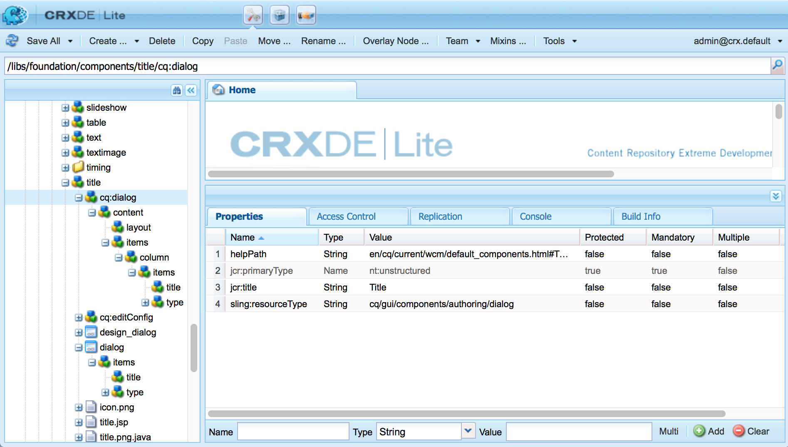

# Componentes AEM: conceptos básicos{#aem-components-the-basics}

Cuando comience a desarrollar nuevos componentes, debe comprender los conceptos básicos de su estructura y configuración.

Este proceso implica leer la teoría y observar la amplia gama de implementaciones de componentes en una instancia de AEM estándar. Este último enfoque se complica ligeramente por el hecho de que, aunque AEM ha cambiado a una nueva interfaz de usuario estándar, moderna y con capacidad táctil, sigue siendo compatible con la IU clásica.

## Información general {#overview}

Esta sección trata los conceptos y problemas clave como una introducción a los detalles necesarios para desarrollar sus propios componentes.

### Planificación {#planning}

Antes de empezar a configurar o codificar realmente su componente, debe preguntar:

* ¿Qué necesita exactamente el nuevo componente para hacer?
   * Una especificación clara ayuda en todas las etapas de desarrollo, pruebas y entrega. Los detalles pueden cambiar con el tiempo, pero la especificación se puede actualizar (aunque también se deben documentar los cambios).
* ¿Necesita crear el componente desde cero o puede heredar los conceptos básicos de un componente existente?
   * No hay necesidad de reinventar la rueda.
   * AEM proporciona varios mecanismos que le permiten heredar y ampliar detalles de otra definición de componente, entre los que se incluyen la anulación, superposición y la [fusión de recursos de Sling](/help/sites-developing/sling-resource-merger.md).
* ¿Necesitará lógica el componente para seleccionar o manipular el contenido?
   * La lógica debe mantenerse separada de la capa de la interfaz de usuario. HTL está diseñado para ayudar a garantizar que esto suceda.
* ¿Necesitará su componente el formato CSS?
   * El formato CSS debe mantenerse separado de las definiciones de componentes. Defina convenciones para asignar nombres a los elementos HTML de modo que pueda modificarlos a través de archivos CSS externos.
* ¿Qué aspectos de seguridad debo tener en cuenta?
   * Consulte [Lista de comprobación de seguridad: prácticas recomendadas de desarrollo](/help/sites-administering/security-checklist.md#development-best-practices) para obtener más información.

### IU táctil frente a IU clásica {#touch-enabled-vs-classic-ui}

Antes de comenzar una conversación seria sobre el desarrollo de componentes, debe saber qué IU utilizarán sus autores:

* **IU táctil**
   [La ](/help/sites-developing/touch-ui-concepts.md) interfaz de usuario estándar se basa en la experiencia de usuario unificada de Adobe Marketing Cloud, que utiliza las tecnologías subyacentes de la IU de  [Coral ](/help/sites-developing/touch-ui-concepts.md#coral-ui) y la IU de  [Granite](/help/sites-developing/touch-ui-concepts.md#granite-ui).
* **Interfaz**
UIUser clásica basada en la tecnología ExtJS obsoleta con AEM 6.4.

Consulte [Interfaz de interfaz de usuario de Recommendations para clientes](/help/sites-deploying/ui-recommendations.md) para obtener más información.

Se pueden implementar componentes para admitir la IU táctil, la IU clásica o ambas. Al consultar una instancia estándar, también verá los componentes integrados que se diseñaron originalmente para la IU clásica, la IU táctil o ambas.

Por este motivo, en esta página trataremos los aspectos básicos de ambos y cómo reconocerlos.

>[!NOTE]
>
>Adobe recomienda aprovechar la IU táctil para beneficiarse de la última tecnología. [AEM ](modernization-tools.md) Herramientas de modernización facilitan la migración.

### Lógica de contenido y marcado de renderización {#content-logic-and-rendering-markup}

Se recomienda mantener el código responsable del marcado y el procesamiento separado del código que controla la lógica utilizada para seleccionar el contenido del componente.

Esta filosofía es compatible con [HTL](https://docs.adobe.com/content/help/es-ES/experience-manager-htl/using/overview.html), un lenguaje de plantilla limitado a propósito para garantizar que se utilice un lenguaje de programación real para definir la lógica empresarial subyacente. Esta lógica (opcional) se invoca desde HTL con un comando específico. Este mecanismo resalta el código que se llama para una vista determinada y, si es necesario, permite una lógica específica para diferentes vistas del mismo componente.

### HTL frente a JSP {#htl-vs-jsp}

HTL es un lenguaje de plantilla HTML introducido con AEM 6.0.

La discusión sobre si usar [HTL](https://docs.adobe.com/content/help/en/experience-manager-htl/using/overview.html) o JSP (páginas de servidor Java) al desarrollar sus propios componentes debería ser sencilla, ya que HTL es ahora el lenguaje de secuencias de comandos recomendado para AEM.

Tanto HTL como JSP pueden utilizarse para desarrollar componentes tanto para la IU clásica como para la táctil. Aunque puede haber una tendencia a suponer que HTL solo es para la IU táctil y JSP para la IU clásica, se trata de una idea errónea y más debido al tiempo. La IU táctil y HTL se incorporaron a AEM durante aproximadamente el mismo periodo. Dado que HTL es ahora el idioma recomendado, se utiliza para componentes nuevos, que tienden a ser para la IU táctil.

>[!NOTE]
>
>Las excepciones son campos de formulario de base de Granite UI (como se utiliza en los cuadros de diálogo). Estos todavía requieren el uso de JSP.

### Desarrollo de sus propios componentes {#developing-your-own-components}

Para crear sus propios componentes para la IU adecuada, consulte (después de leer esta página):

* [Componentes AEM para la IU táctil](/help/sites-developing/developing-components.md)
* [Componentes AEM para la IU clásica](/help/sites-developing/developing-components-classic.md)

Una forma rápida de empezar es copiar un componente existente y luego realizar los cambios que desee. Para aprender a crear sus propios componentes y añadirlos al sistema de párrafos, consulte:

* [Desarrollo de componentes](/help/sites-developing/developing-components-samples.md)  (centrado en la IU táctil)

### Mover componentes a la instancia de publicación {#moving-components-to-the-publish-instance}

Los componentes que representan el contenido deben implementarse en la misma instancia de AEM que el contenido. Por lo tanto, todos los componentes que se utilizan para crear y procesar páginas en la instancia de autor deben implementarse en la instancia de publicación. Cuando se implementan, los componentes están disponibles para procesar páginas activadas.

Utilice las siguientes herramientas para mover los componentes a la instancia de publicación:

* [Utilice Package ](/help/sites-administering/package-manager.md) Manager para añadir los componentes a un paquete y moverlos a otra instancia de AEM.
* [Utilice la ](/help/sites-authoring/publishing-pages.md#manage-publication) herramienta Activar replicación de árbol para replicar los componentes.

>[!NOTE]
>
>Estos mecanismos también se pueden utilizar para transferir el componente entre otras instancias, por ejemplo, del desarrollo a la instancia de prueba.

### Componentes que se deben tener en cuenta desde el inicio {#components-to-be-aware-of-from-the-start}

* Página:

   * AEM tiene el componente *page* ( `cq:Page`).
   * Es un tipo específico de recurso que es importante para la administración de contenido.
      * Una página corresponde a una página web que contiene contenido para su sitio web.

* Sistemas de párrafos:

   * El sistema de párrafos es una parte fundamental de un sitio web, ya que gestiona una lista de párrafos. Se utiliza para contener y estructurar los componentes individuales que contienen el contenido real.
   * Puede crear, mover, copiar y eliminar párrafos en el sistema de párrafos.
   * También puede seleccionar los componentes que estarán disponibles para su uso en un sistema de párrafos específico.
   * Hay varios sistemas de párrafos disponibles en una instancia estándar (por ejemplo `parsys`, ` [responsivegrid](/help/sites-authoring/responsive-layout.md)`).

## Estructura {#structure}

La estructura de un componente AEM es potente y flexible, y las principales consideraciones son:

* Tipo de medio
* Definición de componentes
* Propiedades y nodos secundarios de un componente
* Cuadros de diálogo
* Cuadros de diálogo de diseño
* Disponibilidad de componentes
* Componentes y el contenido que crean

### Tipo de medio {#resource-type}

Un elemento clave de la estructura es el tipo de recurso.

* La estructura de contenido declara sus intenciones.
* El tipo de recurso los implementa.

Esta es una abstracción que ayuda a garantizar que, incluso cuando la apariencia cambie con el tiempo, la intención se mantenga en el tiempo.

### Definición de componente {#component-definition}

#### Conceptos básicos de componentes {#component-basics}

La definición de un componente se puede desglosar de la siguiente manera:

* AEM componentes se basan en [Sling](https://sling.apache.org/documentation.html).
* AEM componentes se encuentran (normalmente) en:

   * HTL: `/libs/wcm/foundation/components`
   * JSP: `/libs/foundation/components`

* Los componentes específicos del proyecto/sitio se encuentran (generalmente) en:

   * `/apps/<myApp>/components`

* AEM componentes estándar se definen como `cq:Component` y tienen los elementos clave:

   * propiedades de jcr:

      Una lista de las propiedades de jcr; son variables y algunas pueden ser opcionales a través de la estructura básica de un nodo de componente, sus propiedades y subnodos están definidos por la definición `cq:Component`

   * Medios:

      Definen los elementos estáticos utilizados por el componente.

   * Secuencias de comandos:

   Se utilizan para implementar el comportamiento de la instancia resultante del componente.

* **Nodo raíz**:

   * `<mycomponent> (cq:Component)` - Nodo de jerarquía del componente.

* **Propiedades** vitales:

   * `jcr:title` - Título del componente; por ejemplo, se utiliza como etiqueta cuando el componente se enumera en el navegador de componentes o en la barra de tareas.
   * `jcr:description` - Descripción del componente; se puede utilizar como indicio de pase de ratón en el navegador de componentes o la barra de tareas.
   * IU clásica:

      * `icon.png` - Icono para este componente.
      * `thumbnail.png` - Imagen mostrada si este componente aparece en la lista dentro del sistema de párrafos.
   * IU táctil

      * Consulte la sección [Icono de componente en la interfaz de usuario táctil](/help/sites-developing/components-basics.md#component-icon-in-touch-ui) para obtener más información.


* **Nodos** secundarios vitales:

   * `cq:editConfig (cq:EditConfig)` : Define las propiedades de edición del componente y permite que el componente aparezca en el navegador de componentes o en la barra de tareas.

      Nota: si el componente tiene un cuadro de diálogo, aparecerá automáticamente en el explorador de componentes o en la barra de tareas, aunque cq:editConfig no exista.

   * `cq:childEditConfig (cq:EditConfig)` - Controla los aspectos de la interfaz de usuario del autor para los componentes secundarios que no definen los suyos propios  `cq:editConfig`.
   * IU táctil:

      * `cq:dialog` (  `nt:unstructured`) - Cuadro de diálogo para este componente. Define la interfaz que permite al usuario configurar el componente o editar contenido.
      * `cq:design_dialog` (  `nt:unstructured`) - Edición de diseño para este componente
   * IU clásica:

      * `dialog` (  `cq:Dialog`) - Cuadro de diálogo para este componente. Define la interfaz que permite al usuario configurar el componente o editar contenido.
      * `design_dialog` (  `cq:Dialog`) - Edición de diseño para este componente.


#### Icono de componente en la interfaz de usuario táctil {#component-icon-in-touch-ui}

El icono o la abreviatura del componente se definen mediante las propiedades JCR del componente cuando el desarrollador crea el componente. Estas propiedades se evalúan en el siguiente orden y se utiliza la primera propiedad válida encontrada.

1. `cq:icon` : propiedad de cadena que señala a un icono estándar en la  [biblioteca de Coral UI ](https://helpx.adobe.com/experience-manager/6-5/sites/developing/using/reference-materials/coral-ui/coralui3/Coral.Icon.html) para mostrarlo en el navegador de componentes
   * Utilice el valor del atributo HTML del icono Coral.
1. `abbreviation` - Propiedad de cadena para personalizar la abreviatura del nombre del componente en el navegador de componentes
   * La abreviatura debe limitarse a dos caracteres.
   * Si se proporciona una cadena vacía, la abreviatura se genera a partir de los dos primeros caracteres de la propiedad `jcr:title`.
      * Por ejemplo, &quot;Im&quot; para &quot;Image&quot;
      * El título localizado se utilizará para crear la abreviatura.
   * La abreviación solo se traduce si el componente tiene una propiedad `abbreviation_commentI18n`, que luego se utiliza como indicio de traducción.
1. `cq:icon.png` o  `cq:icon.svg`  - Icono para este componente, que se muestra en el navegador de componentes
   * 20 x 20 píxeles es el tamaño de los iconos de los componentes estándar.
      * Los iconos más grandes se reducirán de tamaño (lado del cliente).
   * El color recomendado es rgb(112, 112, 112) > #707070
   * El fondo de los iconos de componente estándar es transparente.
   * Solo se admiten archivos `.png` y `.svg`.
   * Si se importa desde el sistema de archivos a través del complemento Eclipse, los nombres de archivo deben omitirse como `_cq_icon.png` o `_cq_icon.svg`, por ejemplo.
   * `.png` toma precedente  `.svg` si ambos están presentes

Si no se encuentra ninguna de las propiedades anteriores ( `cq:icon`, `abbreviation`, `cq:icon.png` o `cq:icon.svg`) en el componente:

* El sistema buscará las mismas propiedades en los supercomponentes que siguen a la propiedad `sling:resourceSuperType`.
* Si no se encuentra nada o una abreviatura vacía en el nivel de supercomponente, el sistema creará la abreviatura a partir de las primeras letras de la propiedad `jcr:title` del componente actual.

Para cancelar la herencia de los iconos de los supercomponentes, si se configura una propiedad vacía `abbreviation` en el componente, se volverá al comportamiento predeterminado.

La [Consola de componentes](/help/sites-authoring/default-components-console.md#component-details) muestra cómo se define el icono de un componente en particular.

#### Ejemplo de icono SVG {#svg-icon-example}

```xml
<?xml version="1.0" encoding="utf-8"?>
<!DOCTYPE svg PUBLIC "-//W3C//DTD SVG 1.1//EN" "https://www.w3.org/Graphics/SVG/1.1/DTD/svg11.dtd">
<svg version="1.1" id="Layer_1" xmlns="https://www.w3.org/2000/svg" xmlns:xlink="https://www.w3.org/1999/xlink" x="0px" y="0px"
     width="20px" height="20px" viewBox="0 0 20 20" enable-background="new 0 0 20 20" xml:space="preserve">
    <ellipse cx="5" cy="5" rx="3" ry="3" fill="#707070"/>
    <ellipse cx="15" cy="5" rx="4" ry="4" fill="#707070"/>
    <ellipse cx="5" cy="15" rx="5" ry="5" fill="#707070"/>
    <ellipse cx="15" cy="15" rx="4" ry="4" fill="#707070"/>
</svg>
```

### Propiedades y nodos secundarios de un componente {#properties-and-child-nodes-of-a-component}

Muchos de los nodos o propiedades necesarios para definir un componente son comunes a ambas IU, con diferencias que permanecen independientes para que el componente pueda funcionar en ambos entornos.

Un componente es un nodo de tipo `cq:Component` y tiene las siguientes propiedades y nodos secundarios:

<table>
 <tbody>
  <tr>
   <td><strong>Nombre <br /> </strong></td>
   <td><strong>Tipo <br /> </strong></td>
   <td><strong>Descripción <br /> </strong></td>
  </tr>
  <tr>
   <td>.<br /> </td>
   <td><code>cq:Component</code></td>
   <td>Componente actual. Un componente es del tipo de nodo <code>cq:Component</code>.<br /> </td>
  </tr>
  <tr>
   <td><code>componentGroup</code></td>
   <td><code>String</code></td>
   <td>Grupo en el que se puede seleccionar el componente en el navegador de componentes (IU táctil) o en la barra de tareas (IU clásica).<br /> Un valor de  <code>.hidden</code> se utiliza para los componentes que no están disponibles para su selección en la interfaz de usuario, como los sistemas de párrafos reales.</td>
  </tr>
  <tr>
   <td><code>cq:isContainer</code></td>
   <td><code>Boolean</code></td>
   <td>Indica si el componente es un componente contenedor y, por lo tanto, puede contener otros componentes, como un sistema de párrafos.</td>
  </tr>
  <tr>
   <td> </td>
   <td> </td>
   <td> </td>
  </tr>
  <tr>
   <td><code>cq:dialog</code></td>
   <td><code>nt:unstructured</code> </td>
   <td>Definición del cuadro de diálogo de edición para la IU táctil.</td>
  </tr>
  <tr>
   <td><code>dialog</code></td>
   <td><code>cq:Dialog</code></td>
   <td>Definición del cuadro de diálogo de edición para la IU clásica.</td>
  </tr>
  <tr>
   <td><code>cq:design_dialog</code></td>
   <td><code>nt:unstructured</code></td>
   <td>Definición del cuadro de diálogo de diseño para la IU táctil.</td>
  </tr>
  <tr>
   <td><code>design_dialog</code></td>
   <td><code>cq:Dialog </code></td>
   <td>Definición del cuadro de diálogo de diseño para la IU clásica.<br /> </td>
  </tr>
  <tr>
   <td><code>dialogPath</code></td>
   <td><code>String</code></td>
   <td>Ruta a un cuadro de diálogo para cubrir el caso cuando el componente no tiene un nodo de diálogo.<br /> </td>
  </tr>
  <tr>
   <td> </td>
   <td> </td>
   <td> </td>
  </tr>
  <tr>
   <td><code>cq:cellName</code></td>
   <td><code>String</code></td>
   <td>Si se establece, esta propiedad se toma como ID de celda. Para obtener más información, consulte el artículo de la Base de conocimiento <a href="https://helpx.adobe.com/experience-manager/kb/DesigneCellId.html">Cómo se crean los ID de célula de diseño</a>.<br /> </td>
  </tr>
  <tr>
   <td><code>cq:childEditConfig</code></td>
   <td><code>cq:EditConfig</code></td>
   <td>Cuando el componente es un contenedor, como por ejemplo un sistema de párrafos, esto impulsa la configuración de edición de los nodos secundarios.<br /> </td>
  </tr>
  <tr>
   <td><code>cq:editConfig</code></td>
   <td><code>cq:EditConfig</code></td>
   <td><a href="#edit-behavior">Edite la configuración del componente</a>.<br /> </td>
  </tr>
  <tr>
   <td><code>cq:htmlTag</code></td>
   <td><code>nt:unstructured </code></td>
   <td>Devuelve atributos de etiqueta adicionales que se agregan a la etiqueta html que los rodea. Habilita la adición de atributos a los divs generados automáticamente.</td>
  </tr>
  <tr>
   <td><code>cq:noDecoration</code></td>
   <td><code>Boolean</code></td>
   <td>Si es true, el componente no se procesa con clases div y css generadas automáticamente.<br /> </td>
  </tr>
  <tr>
   <td><code>cq:template</code></td>
   <td><code>nt:unstructured</code></td>
   <td>Si se encuentra, este nodo se utilizará como plantilla de contenido cuando el componente se añada desde el explorador de componentes o la barra de tareas.</td>
  </tr>
  <tr>
   <td><code>cq:templatePath</code></td>
   <td><code>String</code></td>
   <td>Ruta a un nodo para utilizarlo como plantilla de contenido cuando el componente se añada desde el explorador de componentes o la barra de tareas. Debe ser una ruta absoluta, no relativa al nodo del componente.<br /> A menos que desee reutilizar contenido ya disponible en otra parte, esto no es necesario y  <code>cq:template</code> es suficiente (consulte a continuación).</td>
  </tr>
  <tr>
   <td><code>jcr:created</code></td>
   <td><code>Date</code></td>
   <td>Fecha de creación del componente.<br /> </td>
  </tr>
  <tr>
   <td><code>jcr:description</code></td>
   <td><code>String</code></td>
   <td>Descripción del componente.<br /> </td>
  </tr>
  <tr>
   <td><code>jcr:title</code></td>
   <td><code>String</code></td>
   <td>Título del componente.<br /> </td>
  </tr>
  <tr>
   <td><code>sling:resourceSuperType</code></td>
   <td><code>String</code></td>
   <td>Cuando se configura, el componente hereda de este componente.<br /> </td>
  </tr>
  <tr>
   <td><code>virtual</code></td>
   <td><code>sling:Folder</code></td>
   <td>Permite la creación de componentes virtuales. Para ver un ejemplo, consulte el componente de contacto en:<br /> <code>/libs/foundation/components/profile/form/contact</code></td>
  </tr>
  <tr>
   <td><code>&lt;breadcrumb.jsp&gt;</code></td>
   <td><code>nt:file</code> </td>
   <td>Archivo de script.<br /> </td>
  </tr>
  <tr>
   <td><code>icon.png</code></td>
   <td><code>nt:file</code></td>
   <td>El icono del componente aparece junto al Título en la barra de tareas.<br /> </td>
  </tr>
  <tr>
   <td><code>thumbnail.png</code></td>
   <td><code>nt:file</code></td>
   <td>Miniatura opcional que se muestra mientras se arrastra el componente a su sitio desde la barra de tareas.<br /> </td>
  </tr>
 </tbody>
</table>

Si miramos el componente **Texto** (cualquiera de las versiones), podemos ver estos elementos:

* HTL ( `/libs/wcm/foundation/components/text`)

   

* JSP ( `/libs/foundation/components/text`)

   

Entre las propiedades de particular interés se incluyen:

* `jcr:title` - título del componente; esto se puede utilizar para identificar el componente; por ejemplo, aparece en la lista de componentes dentro del navegador de componentes o la barra de tareas
* `jcr:description` - descripción del componente; se puede utilizar como sugerencia de pase de ratón en la lista de componentes de la barra de tareas
* `sling:resourceSuperType`: esto indica la ruta de herencia al ampliar un componente (anulando una definición)

Los nodos secundarios de interés particular incluyen:

* `cq:editConfig` (  `cq:EditConfig`) - controla los aspectos visuales; por ejemplo, puede definir el aspecto de una barra o un widget, o agregar controles personalizados
* `cq:childEditConfig` (  `cq:EditConfig`) : controla los aspectos visuales de los componentes secundarios que no tienen sus propias definiciones
* IU táctil:
   * `cq:dialog` (  `nt:unstructured`): define el cuadro de diálogo para editar el contenido de este componente
   * `cq:design_dialog` (  `nt:unstructured`): especifica las opciones de edición de diseño de este componente
* IU clásica:
   * `dialog` (  `cq:Dialog`): define el cuadro de diálogo para editar el contenido de este componente (específico de la IU clásica)
   * `design_dialog` (  `cq:Dialog`): especifica las opciones de edición de diseño de este componente
   * `icon.png` - archivo gráfico que se utilizará como icono para el componente en la barra de tareas
   * `thumbnail.png` - archivo gráfico que se utilizará como miniatura del componente mientras lo arrastra desde la barra de tareas

### Cuadros de diálogo {#dialogs}

Los cuadros de diálogo son un elemento clave de su componente, ya que proporcionan una interfaz para que los autores configuren y proporcionen entradas para ese componente.

Dependiendo de la complejidad del componente, su cuadro de diálogo puede necesitar una o más fichas - para mantener el cuadro de diálogo corto y ordenar los campos de entrada.

Las definiciones de cuadro de diálogo son específicas de la IU:

>[!NOTE]
>
>* Por motivos de compatibilidad, la IU táctil puede utilizar la definición de un cuadro de diálogo de IU clásica cuando no se ha definido ningún cuadro de diálogo para la IU táctil.
>* Las [AEM Herramientas de modernización](/help/sites-developing/modernization-tools.md) también se proporcionan para ayudarle a ampliar o convertir componentes que solo tienen cuadros de diálogo definidos para la IU clásica.

>


* IU táctil
   * `cq:dialog` ( `nt:unstructured`) nodes:
      * definir el cuadro de diálogo para editar el contenido de este componente
      * específico de la IU táctil
      * se definen mediante los componentes de la interfaz de usuario de Granite
      * tienen una propiedad `sling:resourceType` como estructura de contenido estándar de Sling
      * puede tener una propiedad `helpPath` para definir el recurso de ayuda contextual (ruta absoluta o relativa) al que se accede cuando se muestra el icono Ayuda (el icono ? ).
         * Para los componentes listos para usar , a menudo hace referencia a una página de la documentación.
         * Si no se especifica `helpPath`, se muestra la dirección URL predeterminada (página de información general de la documentación).

   

   Dentro del cuadro de diálogo, se definen los campos individuales:

   

* IU clásica
   * `dialog` ( `cq:Dialog`) nodes
      * definir el cuadro de diálogo para editar el contenido de este componente
      * específico para la IU clásica
      * se definen con las utilidades de ExtJS
      * tienen una propiedad `xtype`, que hace referencia a ExtJS
      * puede tener una propiedad `helpPath` para definir el recurso de ayuda contextual (ruta absoluta o relativa) al que se accede cuando se selecciona el botón **Ayuda**.
         * Para los componentes listos para usar , a menudo hace referencia a una página de la documentación.
         * Si no se especifica `helpPath`, se muestra la dirección URL predeterminada (página de información general de la documentación).

   

   Dentro del cuadro de diálogo, se definen los campos individuales:

   

   Dentro de un cuadro de diálogo clásico:

   * puede crear el cuadro de diálogo como `cq:Dialog`, que proporcionará una sola pestaña, como en el componente de texto, o si necesita varias pestañas, como con el componente de textimage, el cuadro de diálogo se puede definir como `cq:TabPanel`.
   * se utiliza un `cq:WidgetCollection` ( `items`) para proporcionar una base para los campos de entrada ( `cq:Widget`) o para otras pestañas ( `cq:Widget`). Esta jerarquía se puede ampliar.


### Diálogo de diseño {#design-dialogs}

Los cuadros de diálogo de diseño son muy similares a los cuadros de diálogo utilizados para editar y configurar contenido, pero proporcionan la interfaz para que los autores configuren y proporcionen detalles de diseño para ese componente.

[Los cuadros de diálogo de diseño están disponibles en el modo](/help/sites-authoring/default-components-designmode.md) de diseño, aunque no son necesarios para todos los componentes, por ejemplo,  **** Título e  **** Imágenes, ambos tienen cuadros de diálogo de diseño, mientras que el texto no lo  **** hace.

El cuadro de diálogo de diseño para el sistema de párrafos (por ejemplo, parsys) es un caso especial, ya que permite al usuario seleccionar otros componentes específicos (desde el navegador de componentes o la barra de tareas) en la página.

### Adición del componente al sistema de párrafos {#adding-your-component-to-the-paragraph-system}

Una vez definido un componente, debe estar disponible para su uso. Para que un componente esté disponible para su uso en un sistema de párrafos, puede:

1. Abra [Design Mode](/help/sites-authoring/default-components-designmode.md) para una página y habilite el componente requerido.
1. Agregue los componentes necesarios a la propiedad `components` de la definición de la plantilla en:

   `/etc/designs/<*yourProject*>/jcr:content/<*yourTemplate*>/par`

   Por ejemplo, consulte:

   `/etc/designs/geometrixx/jcr:content/contentpage/par`

   

### Componentes y el contenido que crean {#components-and-the-content-they-create}

Si creamos y configuramos una instancia del componente **Title** en la página: `<content-path>/Prototype.html`

* IU táctil

   

* IU clásica

   

A continuación, podemos ver la estructura del contenido creado dentro del repositorio:


En particular, si observa el texto real de un **Título**:

* la definición (para ambas IU) tiene la propiedad `name`= `./jcr:title`

   * `/libs/foundation/components/title/cq:dialog/content/items/column/items/title`
   * `/libs/foundation/components/title/dialog/items/title`

* dentro del contenido, esto genera la propiedad `jcr:title` que contiene el contenido del autor.

Las propiedades definidas dependen de las definiciones individuales. Aunque pueden ser más complejos que arriba, siguen los mismos principios básicos.

## Jerarquía y herencia de componentes {#component-hierarchy-and-inheritance}

Los componentes dentro de AEM están sujetos a tres jerarquías diferentes:

* **Jerarquía de tipo de recurso**

   Se utiliza para ampliar componentes con la propiedad `sling:resourceSuperType`. Esto permite que el componente herede. Por ejemplo, un componente de texto heredará varios atributos del componente estándar.

   * scripts (resueltos por Sling)
   * cuadros de diálogo
   * descripciones (incluidas imágenes en miniatura, iconos, etc.)

* **Jerarquía de contenedores**

   Se utiliza para rellenar los ajustes de configuración en el componente secundario y se utiliza más comúnmente en un escenario de parsys.

   Por ejemplo, los ajustes de configuración de los botones de la barra de edición, el diseño del conjunto de controles (barras de edición, desplazamiento) y el diseño del cuadro de diálogo (en línea, flotante) se pueden definir en el componente principal y propagarse a los componentes secundarios.

   Los ajustes de configuración (relacionados con la funcionalidad de edición) en `cq:editConfig` y `cq:childEditConfig` se propagan.

* **Incluir jerarquía**

   Esto se impone en tiempo de ejecución por la secuencia de inclusiones.

   Esta jerarquía la utiliza el Diseñador, que a su vez actúa como base para varios aspectos de diseño de la renderización; incluyendo información de diseño, información css, los componentes disponibles en un parsys, entre otros.

## Editar comportamiento {#edit-behavior}

En esta sección se explica cómo configurar el comportamiento de edición de un componente. Esto incluye atributos como acciones disponibles para el componente, características del editor in situ y oyentes relacionados con eventos en el componente.

La configuración es común a la IU táctil y a la clásica, aunque con ciertas diferencias específicas.

El comportamiento de edición de un componente se configura añadiendo un nodo `cq:editConfig` de tipo `cq:EditConfig` debajo del nodo del componente (de tipo `cq:Component`) y añadiendo propiedades específicas y nodos secundarios. Están disponibles las siguientes propiedades y nodos secundarios:

* [ `cq:editConfig` propiedades](#configuring-with-cq-editconfig-properties) de nodo:

   * `cq:actions` (  `String array`): define las acciones que se pueden realizar en el componente.
   * `cq:layout` (  `String`): : define cómo se edita el componente en la IU clásica.
   * `cq:dialogMode` (  `String`): define cómo se abre el cuadro de diálogo del componente en la IU clásica

      * En la IU táctil, los cuadros de diálogo siempre flotan en modo de escritorio y se abren automáticamente como pantalla completa en dispositivos móviles.
   * `cq:emptyText` (  `String`): define el texto que se muestra cuando no hay contenido visual presente.
   * `cq:inherit` (  `Boolean`): define si los valores que faltan se heredan del componente del que se hereda.
   * `dialogLayout` (Cadena): define cómo se debe abrir el cuadro de diálogo.


* [ `cq:editConfig` nodos](#configuring-with-cq-editconfig-child-nodes) secundarios:

   * `cq:dropTargets` (tipo de nodo  `nt:unstructured`): define una lista de destinos de colocación que pueden aceptar una colocación de un recurso del buscador de contenido

      * Los objetivos de colocación múltiple solo están disponibles en la IU clásica.
      * En la IU táctil se permite un solo destino de colocación.
   * `cq:actionConfigs` (tipo de nodo  `nt:unstructured`): define una lista de nuevas acciones que se anexan a la lista cq:actions.
   * `cq:formParameters` (tipo de nodo  `nt:unstructured`): define parámetros adicionales que se agregan al formulario de diálogo.
   * `cq:inplaceEditing` (tipo de nodo  `cq:InplaceEditingConfig`): define una configuración de edición in situ para el componente.
   * `cq:listeners` (tipo de nodo  `cq:EditListenersConfig`): define lo que sucede antes o después de que se produzca una acción en el componente.


>[!NOTE]
>
>En esta página, un nodo (propiedades y nodos secundarios) se representa como XML, como se muestra en el siguiente ejemplo.

```
<jcr:root xmlns:cq="https://www.day.com/jcr/cq/1.0" xmlns:jcr="https://www.jcp.org/jcr/1.0"
    cq:actions="[edit]"
    cq:dialogMode="floating"
    cq:layout="editbar"
    jcr:primaryType="cq:EditConfig">
    <cq:listeners
        jcr:primaryType="cq:EditListenersConfig"
        afteredit="REFRESH_PAGE"/>
</jcr:root>
```

Hay muchas configuraciones existentes en el repositorio. Puede buscar fácilmente propiedades específicas o nodos secundarios:

* Para buscar una propiedad del nodo `cq:editConfig`, p. ej. `cq:actions`, puede utilizar la herramienta Consulta en **CRXDE Lite** y buscar con la siguiente cadena de consulta XPath:

   `//element(cq:editConfig, cq:EditConfig)[@cq:actions]`

* Para buscar un nodo secundario de `cq:editConfig`, por ejemplo, puede buscar `cq:dropTargets`, que es de tipo `cq:DropTargetConfig`; puede utilizar la herramienta Consulta en** CRXDE Lite** y buscar con la siguiente cadena de consulta XPath:

   `//element(cq:dropTargets, cq:DropTargetConfig)`

### Marcadores de posición de componente {#component-placeholders}

Los componentes siempre deben representar algún HTML que sea visible para el autor, incluso cuando el componente no tenga contenido. De lo contrario, podría desaparecer visualmente de la interfaz del editor, haciendo que esté técnicamente presente pero invisible en la página y en el editor. En tal caso, los autores no podrán seleccionar ni interactuar con el componente vacío.

Por este motivo, los componentes deben representar un marcador de posición siempre que no muestren ningún resultado visible cuando la página se procese en el editor de páginas (cuando el modo WCM sea `edit` o `preview`).
El marcado HTML típico de un marcador de posición es el siguiente:

```HTML
<div class="cq-placeholder" data-emptytext="Component Name"></div>
```

El script HTL típico que procesa el marcador de posición HTML anterior es el siguiente:

```HTML
<div class="cq-placeholder" data-emptytext="${component.properties.jcr:title}"
     data-sly-test="${(wcmmode.edit || wcmmode.preview) && isEmpty}"></div>
```

En el ejemplo anterior, `isEmpty` es una variable que solo es verdadera cuando el componente no tiene contenido y es invisible para el autor.

Para evitar la repetición, Adobe recomienda que los implementadores de componentes utilicen una plantilla HTL para estos marcadores de posición, [como la proporcionada por los componentes principales.](https://github.com/adobe/aem-core-wcm-components/blob/master/content/src/content/jcr_root/apps/core/wcm/components/commons/v1/templates.html)

El uso de la plantilla en el vínculo anterior se realiza con la siguiente línea de HTL:

```HTML
<sly data-sly-use.template="core/wcm/components/commons/v1/templates.html"
     data-sly-call="${template.placeholder @ isEmpty=!model.text}"></sly>
```

En el ejemplo anterior, `model.text` es la variable que solo tiene el valor &quot;True&quot; cuando el contenido tiene contenido y es visible.

Se puede ver un ejemplo de uso de esta plantilla en los componentes principales, [como en el componente Título.](https://github.com/adobe/aem-core-wcm-components/blob/master/content/src/content/jcr_root/apps/core/wcm/components/title/v2/title/title.html#L27)

### Configuración con propiedades cq:EditConfig {#configuring-with-cq-editconfig-properties}

### cq:actions {#cq-actions}

La propiedad `cq:actions` ( `String array`) define una o varias acciones que se pueden realizar en el componente. Los siguientes valores están disponibles para su configuración:

<table>
 <tbody>
  <tr>
   <td><strong>Valor de propiedad</strong></td>
   <td><strong>Descripción</strong></td>
  </tr>
  <tr>
   <td><code>text:&lt;some text&gt;</code></td>
   <td>Muestra el valor de texto estático &lt;some text&gt;<br /> Solo visible en la IU clásica. La IU táctil no muestra acciones en un menú contextual, por lo que no es aplicable.</td>
  </tr>
  <tr>
   <td>-</td>
   <td>Agrega un separador.<br /> Solo visible en la IU clásica. La IU táctil no muestra acciones en un menú contextual, por lo que no es aplicable.</td>
  </tr>
  <tr>
   <td><code>edit</code></td>
   <td>Agrega un botón para editar el componente.</td>
  </tr>
      <tr>
    <td><code>editannotate</code></td>
    <td>Agrega un botón para editar el componente y permitir <a href="/help/sites-authoring/annotations.md">anotaciones</a>.</td>
   </tr>
  <tr>
   <td><code>delete</code></td>
   <td>Añade un botón para eliminar el componente</td>
  </tr>
  <tr>
   <td><code>insert</code></td>
   <td>Agrega un botón para insertar un componente nuevo antes del componente actual</td>
  </tr>
  <tr>
   <td><code>copymove</code></td>
   <td>Agrega un botón para copiar y cortar el componente.</td>
  </tr>
 </tbody>
</table>

La configuración siguiente añade un botón de edición, un separador, una eliminación y un botón de inserción a la barra de edición de componentes:

```
<jcr:root xmlns:cq="https://www.day.com/jcr/cq/1.0" xmlns:jcr="https://www.jcp.org/jcr/1.0"
    cq:actions="[edit,-,delete,insert]"
    cq:layout="editbar"
    jcr:primaryType="cq:EditConfig"/>
```

La siguiente configuración agrega el texto &quot;Configuraciones heredadas de la estructura base&quot; a la barra de edición de componentes:

```
<jcr:root xmlns:cq="https://www.day.com/jcr/cq/1.0" xmlns:jcr="https://www.jcp.org/jcr/1.0"
    cq:actions="[text:Inherited Configurations from Base Framework]"
    cq:layout="editbar"
    jcr:primaryType="cq:EditConfig"/>
```

### cq:layout (solo IU clásica) {#cq-layout-classic-ui-only}

La propiedad `cq:layout` ( `String`) define cómo se puede editar el componente en la IU clásica. Los valores disponibles son los siguientes:

<table>
 <tbody>
  <tr>
   <td><strong>Valor de propiedad</strong></td>
   <td><strong>Descripción</strong></td>
  </tr>
  <tr>
   <td><code>rollover</code></td>
   <td>Valor predeterminado. Se puede acceder a la edición de componentes "al pasar el ratón" mediante clics o el menú contextual.<br /> Para un uso avanzado, tenga en cuenta que el objeto cliente correspondiente es:  <code>CQ.wcm.EditRollover</code>.</td>
  </tr>
  <tr>
   <td><code>editbar</code></td>
   <td>Se puede acceder a la edición de componentes a través de una barra de herramientas.<br /> Para un uso avanzado, tenga en cuenta que el objeto cliente correspondiente es:  <code>CQ.wcm.EditBar</code>.</td>
  </tr>
  <tr>
   <td><code>auto</code></td>
   <td>La opción se deja en el código del lado del cliente.</td>
  </tr>
 </tbody>
</table>

>[!NOTE]
>
>Los conceptos de sustitución y barra de edición no se aplican en la IU táctil.

La configuración siguiente añade un botón de edición a la barra de edición de componentes:

```
<jcr:root xmlns:cq="https://www.day.com/jcr/cq/1.0" xmlns:jcr="https://www.jcp.org/jcr/1.0"
    cq:actions="[edit]"
    cq:layout="editbar"
    jcr:primaryType="cq:EditConfig">
</jcr:root>
```

### cq:dialogMode (solo IU clásica) {#cq-dialogmode-classic-ui-only}

El componente se puede vincular a un cuadro de diálogo de edición. La propiedad `cq:dialogMode` ( `String`) define cómo se abrirá el cuadro de diálogo del componente en la IU clásica. Los valores disponibles son los siguientes:

<table>
 <tbody>
  <tr>
   <td><strong>Valor de propiedad</strong></td>
   <td><strong>Descripción</strong></td>
  </tr>
  <tr>
   <td><code>floating</code></td>
   <td>El cuadro de diálogo está flotando.<br /> </td>
  </tr>
  <tr>
   <td><code>inline</code></td>
   <td>(valor predeterminado). El cuadro de diálogo está anclado sobre el componente.<br /> </td>
  </tr>
  <tr>
   <td><code>auto</code></td>
   <td>Si el ancho del componente es menor que el valor <code>CQ.themes.wcm.EditBase.INLINE_MINIMUM_WIDTH</code> del lado del cliente, el cuadro de diálogo está flotando; de lo contrario, está en línea.</td>
  </tr>
 </tbody>
</table>

>[!NOTE]
>
>En la IU táctil, los cuadros de diálogo siempre flotan en modo de escritorio y se abren automáticamente como pantalla completa en dispositivos móviles.

La configuración siguiente define una barra de edición con un botón de edición y un cuadro de diálogo flotante:

```
<jcr:root xmlns:cq="https://www.day.com/jcr/cq/1.0" xmlns:jcr="https://www.jcp.org/jcr/1.0"
    cq:actions="[edit]"
    cq:dialogMode="floating"
    cq:layout="editbar"
    jcr:primaryType="cq:EditConfig">
</jcr:root>
```

### cq:emptyText {#cq-emptytext}

La propiedad `cq:emptyText` ( `String`) define el texto que se muestra cuando no hay contenido visual presente. El valor predeterminado es: `Drag components or assets here`.

### cq:inherit {#cq-inherit}

La propiedad `cq:inherit` ( `boolean`) define si los valores que faltan se heredan del componente del que se hereda. Su valor predeterminado es `false`.

### dialogLayout {#dialoglayout}

La propiedad `dialogLayout` define cómo se debe abrir un cuadro de diálogo de forma predeterminada.

* Un valor de `fullscreen` abre el cuadro de diálogo en pantalla completa.
* Un valor vacío o ausencia de la propiedad toman el valor predeterminado de abrir el cuadro de diálogo normalmente.
* Tenga en cuenta que el usuario siempre puede alternar el modo de pantalla completa dentro del cuadro de diálogo.
* No se aplica a la IU clásica.

### Configuración con nodos secundarios cq:EditConfig {#configuring-with-cq-editconfig-child-nodes}

### cq:dropTargets {#cq-droptargets}

El nodo `cq:dropTargets` (tipo de nodo `nt:unstructured`) define una lista de destinos de colocación que pueden aceptar una colocación de un recurso arrastrado desde el buscador de contenido. Sirve como una colección de nodos de tipo `cq:DropTargetConfig`.

>[!NOTE]
>
>Los objetivos de colocación múltiple solo están disponibles en la IU clásica.
>
>En la IU táctil solo se utilizará el primer destino.

Cada nodo secundario de tipo `cq:DropTargetConfig` define un destino de colocación en el componente. El nombre del nodo es importante porque debe usarse en el JSP, como se indica a continuación, para generar el nombre de clase CSS asignado al elemento DOM que es el destino de colocación efectivo:

```
<drop target css class> = <drag and drop prefix> +
 <node name of the drop target in the edit configuration>
```

La `<drag and drop prefix>` está definida por la propiedad Java:

`com.day.cq.wcm.api.components.DropTarget.CSS_CLASS_PREFIX`.

Por ejemplo, el nombre de clase se define de la siguiente manera en el JSP del componente de descarga
( `/libs/foundation/components/download/download.jsp`), donde `file` es el nombre del nodo del destino de colocación en la configuración de edición del componente Descargar:

`String ddClassName = DropTarget.CSS_CLASS_PREFIX + "file";`

El nodo de tipo `cq:DropTargetConfig` debe tener las siguientes propiedades:

<table>
 <tbody>
  <tr>
   <td><strong>Nombre de propiedad</strong></td>
   <td><strong>Valor de propiedad<br /> </strong></td>
  </tr>
  <tr>
   <td><code>accept</code></td>
   <td>Regex aplicado al tipo de MIME del recurso para validar si se permite la colocación.</td>
  </tr>
  <tr>
   <td><code>groups</code></td>
   <td>Matriz de grupos de destino de colocación. Cada grupo debe coincidir con el tipo de grupo definido en la extensión del buscador de contenido y que está adjunto a los recursos.</td>
  </tr>
  <tr>
   <td><code>propertyName</code></td>
   <td>Nombre de la propiedad que se actualizará después de una colocación válida.</td>
  </tr>
 </tbody>
</table>

La siguiente configuración se toma del componente Descargar. Permite que cualquier recurso (el tipo mime puede ser cualquier cadena) del grupo `media` se coloque desde el buscador de contenido en el componente. Tras la colocación, se actualiza la propiedad `fileReference` del componente:

```
    <cq:dropTargets jcr:primaryType="nt:unstructured">
        <file
            jcr:primaryType="cq:DropTargetConfig"
            accept="[.*]"
            groups="[media]"
            propertyName="./fileReference"/>
    </cq:dropTargets>
```

### cq:actionConfigs (solo IU clásica) {#cq-actionconfigs-classic-ui-only}

El nodo `cq:actionConfigs` (tipo de nodo `nt:unstructured`) define una lista de nuevas acciones que se adjuntan a la lista definida por la propiedad `cq:actions`. Cada nodo secundario de `cq:actionConfigs` define una nueva acción definiendo un widget.

La siguiente configuración de ejemplo define un nuevo botón (con un separador para la IU clásica):

* un separador, definido por xtype `tbseparator`;

   * Solo lo utiliza la IU clásica.
   * La IU táctil ignora esta definición, ya que se ignoran los xtype (y los separadores no son necesarios, ya que la barra de herramientas de acciones se construye de forma diferente en la IU táctil).

* un botón llamado **Administrar comentarios** que ejecuta la función de controlador `CQ_collab_forum_openCollabAdmin()`.

```
<jcr:root xmlns:cq="https://www.day.com/jcr/cq/1.0" xmlns:jcr="https://www.jcp.org/jcr/1.0" xmlns:nt="https://www.jcp.org/jcr/nt/1.0"
    cq:actions="[EDIT,COPYMOVE,DELETE,INSERT]"
    jcr:primaryType="cq:EditConfig">
    <cq:actionConfigs jcr:primaryType="nt:unstructured">
        <separator0
            jcr:primaryType="nt:unstructured"
            xtype="tbseparator"/>
        <manage
            jcr:primaryType="nt:unstructured"
            handler="function(){CQ_collab_forum_openCollabAdmin();}"
            text="Manage comments"/>
    </cq:actionConfigs>
</jcr:root>
```

>[!NOTE]
>
>Consulte [Agregar nueva acción a una barra de herramientas de componentes](/help/sites-developing/customizing-page-authoring-touch.md#add-new-action-to-a-component-toolbar) como ejemplo para la IU táctil.

### cq:formParameters {#cq-formparameters}

El nodo `cq:formParameters` (tipo de nodo `nt:unstructured`) define parámetros adicionales que se agregan al formulario de diálogo. Cada propiedad está asignada a un parámetro de formulario.

La siguiente configuración agrega un parámetro llamado `name`, configurado con el valor `photos/primary` al formulario de diálogo:

```
    <cq:formParameters
        jcr:primaryType="nt:unstructured"
        name="photos/primary"/>
```

### cq:inplaceEditing {#cq-inplaceediting}

El nodo `cq:inplaceEditing` (tipo de nodo `cq:InplaceEditingConfig`) define una configuración de edición in situ para el componente. Puede tener las siguientes propiedades:

<table>
 <tbody>
  <tr>
   <td><strong>Nombre de propiedad</strong></td>
   <td><strong>Valor de propiedad<br /> </strong></td>
  </tr>
  <tr>
   <td><code>active</code></td>
   <td>(<code>boolean</code>) True para habilitar la edición in situ del componente.</td>
  </tr>
  <tr>
   <td><code>configPath</code></td>
   <td>(<code>String</code>) Ruta de la configuración del editor. La configuración se puede especificar mediante un nodo de configuración.</td>
  </tr>
  <tr>
   <td><code>editorType</code></td>
   <td><p>(<code>String</code>) Tipo de editor. Los tipos disponibles son:</p>
    <ul>
     <li>texto sin formato: para usar con contenido que no sea HTML.<br /> </li>
     <li>title: es un editor de texto sin formato mejorado que convierte títulos gráficos en texto sin formato antes de comenzar la edición. Utilizado por el componente de título de Geometrixx.<br /> </li>
     <li>texto: para usar con contenido HTML (usa el Editor de texto enriquecido).<br /> </li>
    </ul> </td>
  </tr>
 </tbody>
</table>

La siguiente configuración habilita la edición in situ del componente y define `plaintext` como el tipo de editor:

```
    <cq:inplaceEditing
        jcr:primaryType="cq:InplaceEditingConfig"
        active="{Boolean}true"
        editorType="plaintext"/>
```

### cq:listeners {#cq-listeners}

El nodo `cq:listeners` (tipo de nodo `cq:EditListenersConfig`) define lo que sucede antes o después de una acción en el componente. La tabla siguiente define sus posibles propiedades.

<table>
 <tbody>
  <tr>
   <td><strong>Nombre de propiedad</strong></td>
   <td><strong>Valor de propiedad<br /> </strong></td>
   <td><p><strong>Valor predeterminado</strong></p> <p>(Solo IU clásica)</p> </td>
  </tr>
  <tr>
   <td><code>beforedelete</code></td>
   <td>El controlador se activa antes de que se elimine el componente.<br /> </td>
   <td> </td>
  </tr>
  <tr>
   <td><code>beforeedit</code></td>
   <td>El controlador se activa antes de editar el componente.</td>
   <td> </td>
  </tr>
  <tr>
   <td><code>beforecopy</code></td>
   <td>El controlador se activa antes de que se copie el componente.</td>
   <td> </td>
  </tr>
  <tr>
   <td><code>beforemove</code></td>
   <td>El controlador se activa antes de mover el componente.</td>
   <td> </td>
  </tr>
  <tr>
   <td><code>beforeinsert</code></td>
   <td>El controlador se activa antes de que se inserte el componente.<br /> Solo es operativo para la IU táctil.</td>
   <td> </td>
  </tr>
  <tr>
   <td><code>beforechildinsert</code></td>
   <td>El controlador se activa antes de que el componente se inserte dentro de otro componente (solo contenedores).</td>
   <td> </td>
  </tr>
  <tr>
   <td><code>afterdelete</code></td>
   <td>El controlador se activa después de eliminar el componente.</td>
   <td><code>REFRESH_SELF</code></td>
  </tr>
  <tr>
   <td><code>afteredit</code></td>
   <td>El controlador se activa después de editar el componente.</td>
   <td><code>REFRESH_SELF</code></td>
  </tr>
  <tr>
   <td><code>aftercopy</code></td>
   <td>El controlador se activa después de copiar el componente.</td>
   <td><code>REFRESH_SELF</code></td>
  </tr>
  <tr>
   <td><code>afterinsert</code></td>
   <td>El controlador se activa después de insertar el componente.</td>
   <td><code>REFRESH_INSERTED</code></td>
  </tr>
  <tr>
   <td><code>aftermove</code></td>
   <td>El controlador se activa después de mover el componente.</td>
   <td><code>REFRESH_SELFMOVED</code></td>
  </tr>
  <tr>
   <td><code>afterchildinsert</code></td>
   <td>El controlador se activa después de que el componente se inserte dentro de otro componente (solo contenedores).</td>
   <td> </td>
  </tr>
 </tbody>
</table>

>[!NOTE]
>
>Los controladores `REFRESH_INSERTED` y `REFRESH_SELFMOVED` solo están disponibles en la IU clásica.

>[!NOTE]
>
>Los valores predeterminados para los oyentes solo se establecen en la IU clásica.

>[!NOTE]
>
>En el caso de los componentes anidados, existen ciertas restricciones en las acciones definidas como propiedades en el nodo `cq:listeners`:
>
>* Para los componentes anidados, los valores de las siguientes propiedades *deben* ser `REFRESH_PAGE`: >
>  * `aftermove`
>  * `aftercopy`


El controlador de eventos se puede implementar con una implementación personalizada. Por ejemplo (donde `project.customerAction` es un método estático):

`afteredit = "project.customerAction"`

El siguiente ejemplo equivale a la configuración `REFRESH_INSERTED`:

`afterinsert="function(path, definition) { this.refreshCreated(path, definition); }"`

>[!NOTE]
>
>Para la IU clásica, para ver qué parámetros se pueden utilizar en los controladores, consulte la sección de eventos `before<action>` y `after<action>` de la documentación del widget [ `CQ.wcm.EditBar`](https://helpx.adobe.com/experience-manager/6-5/sites/developing/using/reference-materials/widgets-api/index.html?class=CQ.wcm.EditBar) y [ `CQ.wcm.EditRollover`](https://helpx.adobe.com/experience-manager/6-5/sites/developing/using/reference-materials/widgets-api/index.html?class=CQ.wcm.EditRollover).

Con la siguiente configuración, la página se actualiza después de que el componente se haya eliminado, editado, insertado o movido:

```
    <cq:listeners
        jcr:primaryType="cq:EditListenersConfig"
        afterdelete="REFRESH_PAGE"
        afteredit="REFRESH_PAGE"
        afterinsert="REFRESH_PAGE"
        afterMove="REFRESH_PAGE"/>
```
