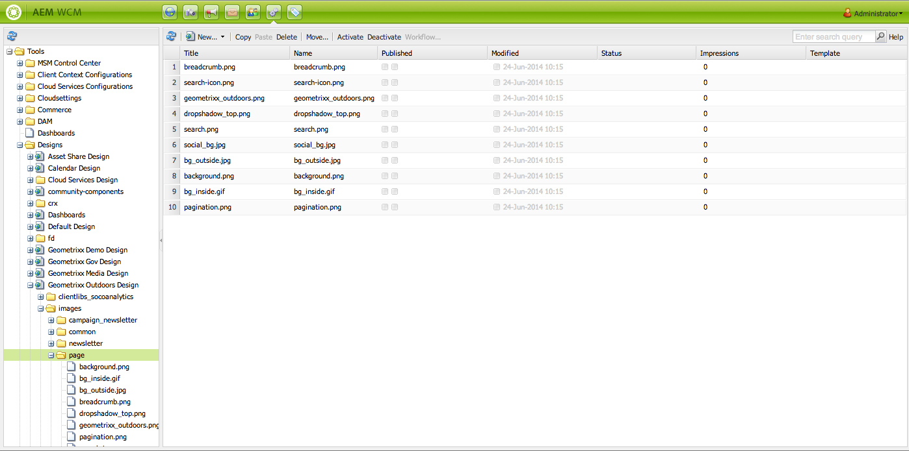

# Diseños y el Diseñador{#designs-and-the-designer}

>[!CAUTION]
>
>Este artículo describe cómo crear un sitio web basado en la IU clásica. Adobe recomienda aprovechar las últimas tecnologías de AEM para sus sitios web como se describe en detalle en el artículo [Introducción al desarrollo de AEM Sites](/help/sites-developing/getting-started.md).

El Diseñador se utiliza para crear un diseño para el sitio web mediante la [IU clásica](/help/release-notes/touch-ui-features-status.md) en AEM.

>[!NOTE]
>
>Para obtener más información sobre la accesibilidad web, consulte [AEM y las Directrices de accesibilidad web](/help/managing/web-accessibility.md).

## Uso de Designer {#using-the-designer}

El diseño se puede definir en la sección **designs** de la pestaña **Tools**:



Aquí puede crear la estructura necesaria para almacenar el diseño y, a continuación, cargar las hojas de estilo en cascada y las imágenes necesarias.

Los diseños se almacenan en `/apps/<your-project>`. La ruta al diseño que se utilizará para un sitio web se especifica mediante la propiedad `cq:designPath` del nodo `jcr:content`.


>[!NOTE]
>
>Todos los cambios realizados en una página en modo de diseño se mantienen debajo del nodo de diseño del sitio y se aplican automáticamente a todas las páginas que tienen el mismo diseño.

## Lo que necesitará {#what-you-will-need}

Para realizar su diseño necesitará:

**CSS** : las hojas de estilo en cascada definen los formatos de áreas específicas de las páginas.
**Imágenes** : cualquier imagen que utilice para funciones como fondos, botones.

### Consideraciones al diseñar el sitio web {#considerations-when-designing-your-website}

Al desarrollar un sitio web, se recomienda encarecidamente almacenar imágenes y archivos CSS en `/apps/<your-project>` para que pueda hacer referencia a sus recursos en función del diseño actual, tal como se describe en el siguiente fragmento de código.

```xml
<%= currentDesign.getPath() + "/static/img/icon.gif %>
```

El ejemplo anterior ofrece varias ventajas:

* Los componentes pueden tener una apariencia diferente en función de cada sitio mediante una ruta de diseño diferente.
* El rediseño del sitio web se puede hacer simplemente señalando la ruta de diseño a un nodo diferente en la raíz del sitio de `design/v1` a `design/v2.`

* `/etc/designs` y  `/content` son las únicas direcciones URL externas que el navegador ve protegiéndole de un usuario externo que se vuelve curioso sobre lo que está debajo de su  `/apps` árbol. Los beneficios de la URL anterior también ayudan al administrador del sistema a configurar una mejor seguridad, ya que limita la exposición de los recursos a unas pocas ubicaciones diferentes.
