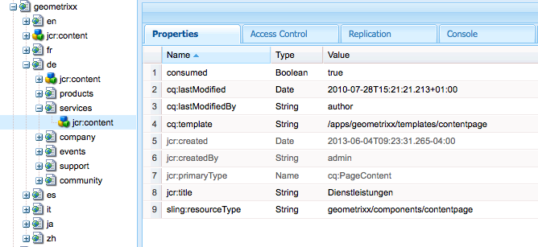

# Creación y consumo de trabajos para la descarga{#creating-and-consuming-jobs-for-offloading}

La función Apache Sling Discovery proporciona una API de Java que le permite crear trabajos de JobManager y servicios de JobConsumer que los consuman.

Para obtener información sobre cómo crear topologías de descarga y configurar el consumo de temas, consulte [Trabajos de descarga](/help/sites-deploying/offloading.md).

## Gestión de cargas de trabajo {#handling-job-payloads}

El marco de trabajo de descarga define dos propiedades de trabajo que se utilizan para identificar la carga útil del trabajo. Los agentes de replicación de descarga utilizan estas propiedades para identificar los recursos que se van a replicar en las instancias de la topología:

* `offloading.job.input.payload`: lista de rutas de contenido separadas por coma. El contenido se replica en la instancia que ejecuta el trabajo.
* `offloading.job.output.payload`: lista de rutas de contenido separadas por coma. Cuando se completa la ejecución del trabajo, la carga útil del trabajo se replica en estas rutas en la instancia que creó el trabajo.

Utilice la enumeración `OffloadingJobProperties` para hacer referencia a los nombres de propiedad:

* `OffloadingJobProperties.INPUT_PAYLOAD.propertyName()`
* `OffloadingJobProperties.OUTPUT_PAYLOAD.propetyName()`

Los trabajos no requieren cargas útiles. Sin embargo, la carga útil es necesaria si el trabajo requiere la manipulación de un recurso y el trabajo se descarga en un equipo que no creó el trabajo.

## Creación de trabajos para descargar {#creating-jobs-for-offloading}

Cree un cliente que llame al método JobManager.addJob para crear un trabajo que ejecute automáticamente un JobConsumer seleccionado. Proporcione la siguiente información para crear el trabajo:

* Tema: el tema del trabajo.
* Nombre: (Opcional)
* Mapa de propiedades: objeto `Map<String, Object>` que contiene cualquier número de propiedades, como las rutas de carga útil de entrada y las rutas de carga útil de salida. Este objeto Map está disponible para el objeto JobConsumer que ejecuta el trabajo.

El siguiente servicio de ejemplo crea un trabajo para un tema determinado y una ruta de carga útil de entrada.

```java
package com.adobe.example.offloading;

import org.apache.felix.scr.annotations.Component;
import org.apache.felix.scr.annotations.Service;
import org.apache.felix.scr.annotations.Reference;

import java.util.HashMap;

import org.apache.sling.event.jobs.Job;
import org.apache.sling.event.jobs.JobManager;

import org.apache.sling.api.resource.ResourceResolverFactory;
import org.apache.sling.api.resource.ResourceResolver;

import com.adobe.granite.offloading.api.OffloadingJobProperties;

@Component
@Service
public class JobGeneratorImpl implements JobGenerator  {

 @Reference
 private JobManager jobManager;
 @Reference ResourceResolverFactory resolverFactory;

 public String createJob(String topic, String payload) throws Exception {
  Job offloadingJob;

  ResourceResolver resolver = resolverFactory.getResourceResolver(null);
  if(resolver.getResource(payload)!=null){

   HashMap<String, Object> jobprops = new HashMap<String, Object>();
   jobprops.put(OffloadingJobProperties.INPUT_PAYLOAD.propertyName(), payload);

   offloadingJob = jobManager.addJob(topic, null, jobprops);
  } else {
   throw new Exception("Payload for job cannot be found");
  }
  if (offloadingJob == null){
   throw new Exception ("Offloading job could not be created");
  }
  return offloadingJob.getId();
 }
}
```

El registro contiene el siguiente mensaje cuando se llama a JobGeneratorImpl.createJob para el tema `com/adobe/example/offloading` y la carga `/content/geometrixx/de/services`:

```shell
10.06.2013 15:43:33.868 *INFO* [JobHandler: /etc/workflow/instances/2013-06-10/model_1554418768647484:/content/geometrixx/en/company] com.adobe.example.offloading.JobGeneratorImpl Received request to make job for topic com/adobe/example/offloading and payload /content/geometrixx/de/services
```

## Desarrollo de un Consumidor de Trabajo {#developing-a-job-consumer}

Para consumir trabajos, desarrolle un servicio OSGi que implemente la interfaz `org.apache.sling.event.jobs.consumer.JobConsumer`. Identifíquese con el tema que desea consumir mediante la propiedad `JobConsumer.PROPERTY_TOPICS`.

En el siguiente ejemplo, la implementación de JobConsumer se registra con el tema `com/adobe/example/offloading`. El consumidor simplemente establece la propiedad Consumed del nodo de contenido de carga útil en true.

```java
package com.adobe.example.offloading;

import org.apache.felix.scr.annotations.Component;
import org.apache.felix.scr.annotations.Property;
import org.apache.felix.scr.annotations.Reference;
import org.apache.felix.scr.annotations.Service;
import org.apache.sling.api.resource.ResourceResolver;
import org.apache.sling.api.resource.ResourceResolverFactory;
import org.apache.sling.event.jobs.Job;
import org.apache.sling.event.jobs.JobManager;
import org.apache.sling.event.jobs.consumer.JobConsumer;
import org.slf4j.Logger;
import org.slf4j.LoggerFactory;

import javax.jcr.Session;
import javax.jcr.Node;

import com.adobe.granite.offloading.api.OffloadingJobProperties;

@Component
@Service
public class MyJobConsumer implements JobConsumer {

 public static final String TOPIC = "com/adobe/example/offloading";

 @Property(value = TOPIC)
 static final String myTopic = JobConsumer.PROPERTY_TOPICS;

 @Reference
 private ResourceResolverFactory resolverFactory;

 @Reference
 private JobManager jobManager;

 private final Logger log = LoggerFactory.getLogger(getClass());

 public JobResult process(Job job) {
  JobResult result = JobResult.FAILED;
  String topic = job.getTopic();
  log.info("Consuming job of topic: {}", topic);
  String payloadIn =  (String) job.getProperty(OffloadingJobProperties.INPUT_PAYLOAD.propertyName());
  String payloadOut =  (String) job.getProperty(OffloadingJobProperties.OUTPUT_PAYLOAD.propertyName());

  log.info("Job has Input Payload {} and Output Payload {}",payloadIn, payloadOut);

  ResourceResolver resolver = null;
  try {
   resolver = resolverFactory.getAdministrativeResourceResolver(null);
   Session session = resolver.adaptTo(Session.class);
   Node inNode = session.getNode(payloadIn);
   inNode.getNode(Node.JCR_CONTENT).setProperty("consumed",true);
   result = JobResult.OK;
  }catch (Exception e){
   log.info("ERROR -- JOB RESULT IS FAILURE " + e.getMessage());
   result = JobResult.FAILED;
  }
  log.info("Job OK for payload {}",payloadIn);
  return result;
 }
}
```

La clase MyJobConsumer genera los siguientes mensajes de registro para una carga útil de entrada de /content/geometrixx/de/services:

```shell
10.06.2013 16:02:40.803 *INFO* [pool-7-thread-17-<main queue>(com/adobe/example/offloading)] com.adobe.example.offloading.MyJobConsumer Consuming job of topic: com/adobe/example/offloading
10.06.2013 16:02:40.803 *INFO* [pool-7-thread-17-<main queue>(com/adobe/example/offloading)] com.adobe.example.offloading.MyJobConsumer Job has Input Payload /content/geometrixx/de/services and Output Payload /content/geometrixx/de/services
10.06.2013 16:02:40.884 *INFO* [pool-7-thread-17-<main queue>(com/adobe/example/offloading)] com.adobe.example.offloading.MyJobConsumer Job OK for payload /content/geometrixx/de/services
```

La propiedad Consumed se puede observar mediante el CRXDE Lite:



## Dependencias de Maven {#maven-dependencies}

Agregue las siguientes definiciones de dependencia al archivo pom.xml para que Maven pueda resolver las clases relacionadas con la descarga.

```xml
<dependency>
   <groupId>org.apache.sling</groupId>
   <artifactId>org.apache.sling.event</artifactId>
   <version>3.1.5-R1485539</version>
   <scope>provided</scope>
</dependency>
<dependency>
   <groupId>com.adobe.granite</groupId>
   <artifactId>com.adobe.granite.offloading.core</artifactId>
   <version>1.0.4</version>
   <scope>provided</scope>
</dependency>
```

Los ejemplos anteriores también requerían las siguientes definiciones de dependencias:

```xml
<dependency>
   <groupId>org.apache.sling</groupId>
   <artifactId>org.apache.sling.api</artifactId>
   <version>2.4.3-R1488084</version>
   <scope>provided</scope>
</dependency>

<dependency>
   <groupId>org.apache.sling</groupId>
   <artifactId>org.apache.sling.jcr.jcr-wrapper</artifactId>
   <version>2.0.0</version>
   <scope>provided</scope>
</dependency>
```
