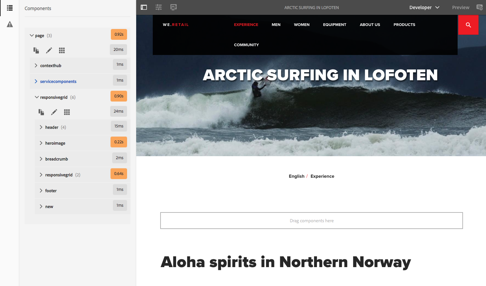

# Modo de desarrollador{#developer-mode}

Al editar páginas en AEM, varias [modos](/help/sites-authoring/author-environment-tools.md#modestouchoptimizedui) están disponibles, incluido el modo de desarrollador. Se abre un panel lateral con varias fichas que proporcionan a los desarrolladores información sobre la página actual. Las tres pestañas son:

* **[Componentes](#components)** para ver la información de estructura y rendimiento.
* **[Pruebas](#tests)** para ejecutar pruebas y analizar los resultados.
* **[Errores](#errors)** para ver si se producen problemas.

Ayudan a los desarrolladores a:

* Discover: de qué páginas se componen.
* Depuración: lo que está sucediendo donde y cuándo, lo que a su vez ayuda a resolver los problemas.
* Prueba: ¿se comporta la aplicación según lo esperado?

>[!CAUTION]
>
>Modo de desarrollador:
>
>* Solo está disponible en la IU táctil (al editar páginas).
>* No está disponible en dispositivos móviles o ventanas pequeñas en equipos de escritorio (debido a restricciones de espacio).
   >
   >   * Esto ocurre cuando la anchura es inferior a 1024 píxeles.
>* Solo está disponible para los usuarios que son miembros de la `administrators` grupo.

>[!CAUTION]
>
>El modo de desarrollador solo está disponible en una instancia de autor estándar que no utilice el modo de ejecución nosamplecontent.
>
>Si es necesario, se puede configurar para su uso:
>
>* en una instancia de autor que utiliza nosamplecontent run mode
>* una instancia de publicación
>
>Debe volver a deshabilitarse después de su uso.

>[!NOTE]
>
>Consulte:
>
>* Artículo de la Base de conocimiento, [Solución de problemas AEM la interfaz de usuario táctil](https://helpx.adobe.com/experience-manager/kb/troubleshooting-aem-touchui-issues.html), para obtener más sugerencias y herramientas.
>* AEM sesión de Gems acerca de [Modo de desarrollador de AEM 6.0](https://experienceleague.adobe.com/docs/experience-manager-gems-events/gems/gems2014/aem-developer-mode.html?lang=en).
>

## Apertura del modo de desarrollador {#opening-developer-mode}

El modo de desarrollador se implementa como panel lateral en el editor de páginas. Para abrir el panel, seleccione **Desarrollador** desde el selector de modo en la barra de herramientas del editor de páginas:

El panel se divide en dos pestañas:

* **[Componentes](/help/sites-developing/developer-mode.md#components)** : Muestra un árbol de componentes similar a la variable [árbol de contenido](/help/sites-authoring/author-environment-tools.md#content-tree) para autores

* **[Errores](/help/sites-developing/developer-mode.md#errors)** - Cuando se producen problemas, se muestran detalles de cada componente.

### Componentes {#components}

Muestra un árbol de componentes que:

* Describe la cadena de componentes y plantillas procesadas en la página (SLY, JSP, etc.). El árbol se puede expandir para mostrar el contexto dentro de la jerarquía.
* Muestra el tiempo de cálculo del lado del servidor necesario para procesar el componente.
* Permite expandir el árbol y seleccionar componentes específicos dentro del árbol. La selección proporciona acceso a los detalles del componente; como:

   * Ruta del repositorio
   * Vínculos a secuencias de comandos (se accede en el CRXDE Lite)

* Los componentes seleccionados (en el flujo de contenido, indicados con un borde azul) se resaltarán en el árbol de contenido (y viceversa).

Esto puede ayudar a:

* Determine y compare el tiempo de procesamiento por componente.
* Consulte y comprenda la jerarquía.
* Comprenda y, a continuación, mejore el tiempo de carga de la página buscando componentes lentos.

Cada entrada de componente puede mostrar (por ejemplo):

* **Ver detalles**: un vínculo a una lista que muestre:

   * todos los scripts de componente utilizados para procesar el componente.
   * la ruta de contenido del repositorio para este componente específico.

   

* **Editar secuencia de comandos**: un vínculo que:

   * abre el script de componente en CRXDE Lite.

* La expansión de una entrada de componente (cabeza de flecha) también puede mostrar:

   * La jerarquía dentro del componente seleccionado.
   * Tiempos de renderización del componente seleccionado de forma aislada, cualquier componente individual anidado dentro de él y el total combinado.

   

>[!CAUTION]
>
>Algunos vínculos dirigen a scripts en `/libs`. Sin embargo, solo son para referencia, usted **no debe** editar cualquier elemento de `/libs`, ya que cualquier cambio que realice puede perderse. Esto se debe a que esta rama puede sufrir cambios cada vez que actualice o aplique una corrección o paquete de características. Los cambios que necesite deben realizarse en `/apps`, consulte [Superposiciones y anulaciones](/help/sites-developing/overlays.md).

### Errores {#errors}

Con suerte, el **Errores** siempre estará vacía (como se ha indicado anteriormente), pero cuando se produzcan problemas, se mostrarán los siguientes detalles para cada componente:

* Una advertencia si el componente escribe una entrada en el registro de errores, junto con detalles del error y vínculos directos al código apropiado dentro del CRXDE Lite.
* Una advertencia si el componente abre una sesión de administrador.

Por ejemplo, en una situación en la que se llama a un método indefinido, el error resultante se muestra en la variable **Errores** pestaña:

La entrada de componente en el árbol de la ficha Componentes también se marcará con un indicador cuando se produzca un error.

### Pruebas {#tests}

>[!CAUTION]
>
>En AEM 6.2, las funciones de prueba del modo de desarrollador se volvieron a implementar como una aplicación de herramientas independiente.
>
>Para obtener más información, consulte [Prueba de la interfaz de usuario](/help/sites-developing/hobbes.md).
