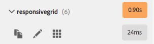

# Modo de desarrollador{#developer-mode}

Al editar páginas en AEM, hay disponibles varios [modos](/help/sites-authoring/author-environment-tools.md#modestouchoptimizedui) , incluido el modo de desarrollador. Esto abre un panel lateral con varias fichas que proporcionan a un desarrollador información sobre la página actual. Las tres fichas son:

* **[Componentes](#components)**para ver la estructura y la información de rendimiento.
* **[Pruebas](#tests)**para ejecutar pruebas y analizar los resultados.
* **[Errores](#errors)**para ver cualquier problema que se produzca.

Esto ayuda a los desarrolladores a:

* Discover: de qué páginas se componen.
* Depurar: lo que está sucediendo, dónde y cuándo, lo que a su vez ayuda a resolver los problemas.
* Prueba: ¿Se comporta la aplicación como se espera?

>[!CAUTION]
>
>Modo de desarrollador:
>
>* Solo está disponible en la IU táctil (al editar páginas).
>* No está disponible en dispositivos móviles o ventanas pequeñas en el escritorio (debido a restricciones de espacio).
   >
   >    
   * Esto ocurre cuando la anchura es inferior a 1024 píxeles.
>
* Requiere los permisos/privilegios adecuados:

   * El acceso al modo de desarrollador se otorga a los usuarios que tienen acceso de escritura en `/apps`.

>[!CAUTION]
>
>El modo de desarrollador solo está disponible en una instancia de autor estándar que no utilice el modo de ejecución nosamplecontent.
>
>Si es necesario, puede configurarse para su uso:
>
>* en una instancia de autor mediante nosamplecontent run-mode
>* una instancia de publicación
>
>
Debe deshabilitarse de nuevo después de su uso.

>[!NOTE]
>
>Consulte:
>
>* Artículo de la Base de conocimiento, [Resolución de problemas](https://helpx.adobe.com/experience-manager/kb/troubleshooting-aem-touchui-issues.html)de la IU táctil de AEM, para obtener más sugerencias y herramientas.
>* Sesión de AEM Gems sobre el modo [de desarrollador de](https://docs.adobe.com/content/ddc/en/gems/aem-6-0-developer-mode.html)AEM 6.0.
>

## Abrir modo de desarrollador {#opening-developer-mode}

El modo de desarrollador se implementa como un panel lateral en el editor de páginas. Para abrir el panel, seleccione **Desarrollador** en el selector de modo de la barra de herramientas del editor de páginas:

El panel se divide en dos fichas:

* **[Componentes](/help/sites-developing/developer-mode.md#components)**: Muestra un árbol de componentes, similar al árbol[de](/help/sites-authoring/author-environment-tools.md#content-tree)contenido para autores

* **[Errores](/help/sites-developing/developer-mode.md#errors)**: cuando se producen problemas, se muestran detalles para cada componente.

### Componentes {#components}

Muestra un árbol de componentes que:

* Describe la cadena de componentes y plantillas procesadas en la página (SLY, JSP, etc.). El árbol se puede expandir para mostrar el contexto dentro de la jerarquía.
* Muestra el tiempo de cálculo del lado del servidor necesario para procesar el componente.
* Permite expandir el árbol y seleccionar componentes específicos dentro del árbol. La selección proporciona acceso a los detalles del componente; como:

   * Ruta del repositorio
   * Vínculos a scripts (a los que se accede en CRXDE Lite)

* Los componentes seleccionados (en el flujo de contenido, indicados con un borde azul) se resaltarán en el árbol de contenido (y viceversa).

Esto puede ayudar a:

* Determinar y comparar el tiempo de procesamiento por componente.
* Ver y comprender la jerarquía.
* Comprenda y mejore el tiempo de carga de la página buscando componentes lentos.

Cada entrada de componente puede mostrar (por ejemplo):

* **Ver detalles**: vínculo a una lista que muestra:

   * todas las secuencias de comandos de componentes utilizadas para procesar el componente.
   * la ruta de contenido del repositorio para este componente específico.
   

* **Editar secuencia de comandos**: un vínculo que:

   * abre la secuencia de comandos de componente en CRXDE Lite.

* La expansión de una entrada de componente (punta de flecha) también puede mostrar:

   * La jerarquía dentro del componente seleccionado.
   * Tiempos de procesamiento para el componente seleccionado de forma aislada, componentes individuales anidados en él y el total combinado.
   

>[!CAUTION]
>
>Algunos vínculos apuntan a secuencias de comandos debajo de `/libs`. Sin embargo, son solo para referencia, no **debe** editar nada en `/libs`, ya que los cambios que realice pueden perderse. Esto se debe al hecho de que esta rama puede cambiar cada vez que actualice o aplique un paquete de revisión o función. Los cambios que necesite se deben realizar en `/apps`, consulte [Superposiciones y anulaciones](/help/sites-developing/overlays.md).

### Errores {#errors}

Es de esperar que la ficha **Errores** siempre esté vacía (como se muestra arriba), pero cuando se produzcan problemas se muestran los siguientes detalles para cada componente:

* Una advertencia si el componente escribe una entrada en el registro de errores, junto con detalles del error y vínculos directos al código apropiado dentro de CRXDE Lite.
* Una advertencia si el componente abre una sesión de administración.

Por ejemplo, en una situación en la que se llama a un método no definido, el error resultante se mostrará en la ficha **Errores** :

La entrada de componente en el árbol de la ficha Componentes también se marcará con un indicador cuando se produzca un error.

### Pruebas {#tests}

>[!CAUTION]
>
>En AEM 6.2, las funciones de prueba del modo de desarrollador se volvieron a implementar como una aplicación de herramientas independiente.
>
>Para obtener más información, consulte [Prueba de la interfaz de usuario](/help/sites-developing/hobbes.md).

