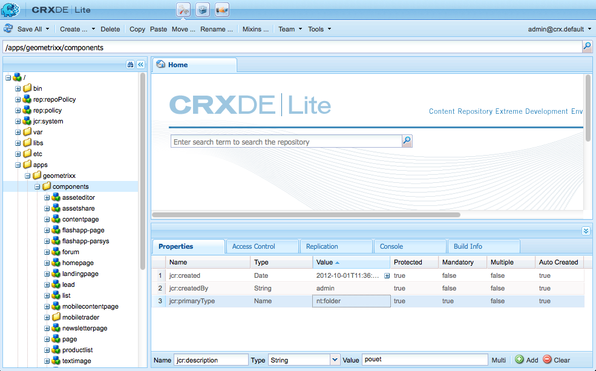

# Desarrollo de componentes de AEM (IU clásica){#developing-aem-components-classic-ui}

La IU clásica utiliza ExtJS para crear utilidades que proporcionan la apariencia de los componentes. Debido a la naturaleza de estos widgets, hay algunas diferencias entre la forma en que los componentes interactúan con la IU clásica y la IU [](/help/sites-developing/developing-components.md)táctil.

>[!NOTE]
>
>Muchos aspectos del desarrollo de componentes son comunes a la IU clásica y a la táctil, por lo que **debe leer Componentes de[AEM: Conceptos básicos](/help/sites-developing/components-basics.md)antes** de utilizar esta página, que trata los detalles específicos de la IU clásica.

>[!NOTE]
>
>Aunque tanto el lenguaje de plantilla HTML (HTL) como JSP pueden utilizarse para desarrollar componentes para la IU clásica, esta página ilustra el desarrollo con JSP. Esto se debe únicamente al historial de uso de JSP en la IU clásica.
>
>HTL es ahora el lenguaje de secuencias de comandos recomendado para AEM. Consulte [HTL](https://docs.adobe.com/content/help/en/experience-manager-htl/using/overview.html) y [Desarrollo de componentes](/help/sites-developing/developing-components.md) de AEM para comparar métodos.

## Estructura {#structure}

La estructura básica de un componente se describe en la página Componentes de [AEM: Conceptos básicos](/help/sites-developing/components-basics.md#structure), que aplica tanto la IU clásica como la táctil. Incluso si no necesita utilizar la configuración de la IU táctil en el nuevo componente, puede ser útil que la conozca al heredar de componentes existentes.

## Secuencias de comandos JSP {#jsp-scripts}

Los scripts o servlets de JSP se pueden utilizar para procesar componentes. Según las reglas de procesamiento de solicitudes de Sling, el nombre de la secuencia de comandos predeterminada es:

`<*componentname*>.jsp`

## global.jsp {#global-jsp}

El archivo de secuencias de comandos JSP `global.jsp` se utiliza para proporcionar acceso rápido a objetos específicos (es decir, para acceder al contenido) a cualquier archivo de secuencias de comandos JSP utilizado para procesar un componente.

Por lo tanto, `global.jsp` debe incluirse en todos los componentes que procesan secuencias de comandos JSP donde se utilizan uno o varios de los objetos proporcionados en `global.jsp` .

La ubicación predeterminada `global.jsp` es:

`/libs/foundation/global.jsp`

>[!NOTE]
>
>La ruta `/libs/wcm/global.jsp`, utilizada por las versiones CQ 5.3 y anteriores, ya está obsoleta.

### Función global.jsp, API usadas y Taglibs {#function-of-global-jsp-used-apis-and-taglibs}

A continuación se enumeran los objetos más importantes proporcionados de forma predeterminada `global.jsp`:

Resumen:

* `<cq:defineObjects />`

   * `slingRequest` - El objeto Request ajustado ( `SlingHttpServletRequest`).
   * `slingResponse` - El objeto de respuesta ajustado ( `SlingHttpServletResponse`).
   * `resource` - El Objeto Sling Resource ( `slingRequest.getResource();`).
   * `resourceResolver` - El Objeto Sling Resource Resolver ( `slingRequest.getResoucreResolver();`).
   * `currentNode` - El nodo JCR resuelto para la solicitud.
   * `log` - El registrador predeterminado ().
   * `sling` - El asistente de script Sling.
   * `properties` - Las propiedades del recurso dirigido ( `resource.adaptTo(ValueMap.class);`).
   * `pageProperties` - Las propiedades de la página del recurso dirigido.
   * `pageManager` - Administrador de páginas para acceder a las páginas de contenido de AEM ( `resourceResolver.adaptTo(PageManager.class);`).
   * `component` - El objeto de componente del componente AEM actual.
   * `designer` - El objeto de diseñador para recuperar la información de diseño ( `resourceResolver.adaptTo(Designer.class);`).
   * `currentDesign` - El diseño del recurso dirigido.
   * `currentStyle` - Estilo del recurso dirigido.

### Acceso al contenido {#accessing-content}

Existen tres métodos para acceder al contenido en AEM WCM:

* Mediante el objeto properties introducido en `global.jsp`:

   El objeto properties es una instancia de ValueMap (consulte [Sling API](https://sling.apache.org/apidocs/sling5/org/apache/sling/api/resource/ValueMap.html)) y contiene todas las propiedades del recurso actual.

   Ejemplo: `String pageTitle = properties.get("jcr:title", "no title");` se utiliza en la secuencia de comandos de representación de un componente de página.

   Ejemplo: `String paragraphTitle = properties.get("jcr:title", "no title");` se utiliza en la secuencia de comandos de representación de un componente de párrafo estándar.

* A través del `currentPage` objeto introducido en `global.jsp`:

   El `currentPage` objeto es una instancia de una página (consulte API [de](https://helpx.adobe.com/experience-manager/6-5/sites/developing/using/reference-materials/javadoc/com/day/cq/wcm/api/Page.mhtml)AEM). La clase page proporciona algunos métodos para acceder al contenido.

   Ejemplo: `String pageTitle = currentPage.getTitle();`

* Mediante `currentNode` objeto introducido en `global.jsp`:

   El `currentNode` objeto es una instancia de un nodo (consulte API [](https://jackrabbit.apache.org/api/2.16/org/apache/jackrabbit/standalone/cli/core/CurrentNode.html)JCR). El `getProperty()` método puede acceder a las propiedades de un nodo.

   Ejemplo: `String pageTitle = currentNode.getProperty("jcr:title");`

## Bibliotecas de etiquetas JSP {#jsp-tag-libraries}

Las bibliotecas de etiquetas CQ y Sling le proporcionan acceso a funciones específicas para utilizarlas en la secuencia de comandos JSP de sus plantillas y componentes.

Para obtener más información, consulte el documento Bibliotecas [de etiquetas](/help/sites-developing/taglib.md).

## Uso de bibliotecas HTML del lado del cliente {#using-client-side-html-libraries}

Los sitios web modernos dependen en gran medida del procesamiento del lado del cliente impulsado por código CSS y JavaScript complejo. Organizar y optimizar el servicio de este código puede ser un problema complicado.

Para ayudar a solucionar este problema, AEM proporciona carpetas **de biblioteca del lado del** cliente, que le permiten almacenar el código del lado del cliente en el repositorio, organizarlo en categorías y definir cuándo y cómo se debe proporcionar cada categoría de código al cliente. El sistema de biblioteca del cliente se encarga de producir los vínculos correctos en la página web final para cargar el código correcto.

Consulte el documento [Uso de bibliotecas](/help/sites-developing/clientlibs.md) HTML del lado del cliente para obtener más información.

## Cuadro de diálogo {#dialog}

El componente necesitará un cuadro de diálogo para que los autores agreguen y configuren el contenido.

Consulte Componentes [AEM: conceptos básicos](/help/sites-developing/components-basics.md#dialogs) para obtener más información.

## Configuración del comportamiento de edición {#configuring-the-edit-behavior}

Puede configurar el comportamiento de edición de un componente. Esto incluye atributos como acciones disponibles para el componente, características del editor in-situ y los oyentes relacionados con eventos en el componente. La configuración es común tanto para las IU táctiles como para las clásicas, aunque con ciertas diferencias específicas.

El comportamiento de [edición de un componente se configura](/help/sites-developing/components-basics.md#edit-behavior) agregando un `cq:editConfig` nodo de tipo `cq:EditConfig` debajo del nodo del componente (de tipo `cq:Component`) y agregando propiedades y nodos secundarios específicos.

## Uso y ampliación de utilidades de ExtJS {#using-and-extending-extjs-widgets}

Consulte [Uso y ampliación de utilidades](/help/sites-developing/widgets.md) de ExtJS para obtener más información.

## Uso de xtypes para utilidades ExtJS {#using-xtypes-for-extjs-widgets}

Consulte [Uso de xtypes](/help/sites-developing/xtypes.md) para obtener más información.

## Desarrollo de nuevos componentes {#developing-new-components}

En esta sección se describe cómo crear sus propios componentes y agregarlos al sistema de párrafos.

Una forma rápida de empezar es copiar un componente existente y luego realizar los cambios que desee.

Un ejemplo de cómo desarrollar un componente se describe en detalle en [Ampliación del componente de texto e imagen: un ejemplo.](#extending-the-text-and-image-component-an-example)

### Desarrollar un nuevo componente (adaptar componente existente) {#develop-a-new-component-adapt-existing-component}

Para desarrollar nuevos componentes para AEM basados en componentes existentes, puede copiar el componente, crear un archivo javascript para el nuevo componente y almacenarlo en una ubicación accesible para AEM (consulte también [Personalización de componentes y otros elementos](/help/sites-developing/dev-guidelines-bestpractices.md#customizing-components-and-other-elements)):

1. Con CRXDE Lite, cree una nueva carpeta de componentes en:

   / `apps/<myProject>/components/<myComponent>`

   Vuelva a crear la estructura de nodos como en bibliotecas y copie la definición de un componente existente, como el componente Texto. Por ejemplo, para personalizar la copia del componente Texto:

   * from `/libs/foundation/components/text`
   * hasta `/apps/myProject/components/text`

1. Modifique el `jcr:title` para que refleje su nuevo nombre.
1. Abra la nueva carpeta de componentes y realice los cambios que necesite. Además, elimine cualquier información superflua de la carpeta.

   Puede realizar cambios como:

   * adición de un nuevo campo en el cuadro de diálogo

      * `cq:dialog` - cuadro de diálogo para la IU táctil
      * `dialog` - cuadro de diálogo para la IU clásica
   * reemplazar el `.jsp` archivo (ponerle el nombre del nuevo componente)
   * o volver a trabajar completamente todo el componente si lo desea
   Por ejemplo, si toma una copia del componente Texto estándar, puede agregar un campo adicional al cuadro de diálogo y, a continuación, actualizar el `.jsp` para procesar la entrada que se realiza allí.

   >[!NOTE]
   >
   >Un componente para:
   >
   >* La IU táctil utiliza componentes de [granito](https://helpx.adobe.com/experience-manager/6-5/sites/developing/using/reference-materials/granite-ui/api/jcr_root/libs/granite/ui/index.html)
   >* La IU clásica utiliza utilidades [ExtJS](https://helpx.adobe.com/experience-manager/6-5/sites/developing/using/reference-materials/widgets-api/index.html)


   >[!NOTE]
   >
   >Un cuadro de diálogo definido para la IU clásica funcionará en la IU táctil.
   >
   >Un cuadro de diálogo definido para la IU táctil no funcionará dentro de la IU clásica.
   >
   >Según la instancia y el entorno de creación, es posible que desee definir ambos tipos de cuadro de diálogo para el componente.

1. Debe estar presente uno de los nodos siguientes e inicializado correctamente para que aparezca el nuevo componente:

   * `cq:dialog` - cuadro de diálogo para la IU táctil
   * `dialog` - cuadro de diálogo para la IU clásica
   * `cq:editConfig` - comportamiento de los componentes en el entorno de edición (por ejemplo, arrastrar y soltar)
   * `design_dialog` - cuadro de diálogo para el modo de diseño (solo IU clásica)

1. Active el nuevo componente en el sistema de párrafos mediante:

   * uso de CRXDE Lite para agregar el valor `<path-to-component>` (por ejemplo, `/apps/geometrixx/components/myComponent`) a los componentes de propiedad del nodo `/etc/designs/geometrixx/jcr:content/contentpage/par`
   * siguiendo las instrucciones de [Adición de nuevos componentes a sistemas de párrafos](#adding-a-new-component-to-the-paragraph-system-design-mode)

1. En AEM WCM, abra una página de su sitio web e inserte un nuevo párrafo del tipo que acaba de crear para asegurarse de que el componente funciona correctamente.

>[!NOTE]
>
>Para ver las estadísticas de temporización de carga de página, puede utilizar Ctrl-Mayús-U con `?debugClientLibs=true` la dirección URL definida.

### Adición de un nuevo componente al sistema de párrafos (modo de diseño) {#adding-a-new-component-to-the-paragraph-system-design-mode}

Una vez desarrollado el componente, debe agregarlo al sistema de párrafos, que permite a los autores seleccionar y utilizar el componente al editar una página.

1. Acceda a una página del entorno de creación que utilice el sistema de párrafos, por ejemplo `<contentPath>/Test.html`.
1. Cambie al modo Diseño mediante:

   * agregar `?wcmmode=design` al final de la dirección URL y volver a acceder, por ejemplo:

      `<contextPath>/ Test.html?wcmmode=design`

   * hacer clic en Diseño en la barra de tareas
   Ahora está en modo de diseño y puede editar el sistema de párrafos.

1. Haga clic en Editar.

   Se muestra una lista de los componentes pertenecientes al sistema de párrafos. También se muestra el nuevo componente.

   Los componentes pueden activarse (o desactivarse) para determinar cuáles se ofrecen al autor al editar una página.

1. Active el componente y, a continuación, vuelva al modo de edición normal para confirmar que está disponible para su uso.

### Ampliación del componente de texto e imagen: un ejemplo {#extending-the-text-and-image-component-an-example}

Esta sección proporciona un ejemplo de cómo ampliar el componente estándar de texto e imagen ampliamente utilizado con una función de colocación de imagen configurable.

La extensión del componente de texto e imagen permite a los editores utilizar toda la funcionalidad existente del componente, además de tener una opción adicional para especificar la colocación de la imagen:

* En el lado izquierdo del texto (comportamiento actual y el nuevo valor predeterminado)
* Así como en el lado derecho

Después de ampliar este componente, puede configurar la colocación de la imagen a través del cuadro de diálogo del componente.

En este ejercicio se describen las siguientes técnicas:

* Copia del nodo de componente existente y modificación de sus metadatos
* Modificación del cuadro de diálogo del componente, incluida la herencia de utilidades de los cuadros de diálogo principales
* Modificación de la secuencia de comandos del componente para implementar la nueva funcionalidad

>[!NOTE]
>
>Este ejemplo está dirigido a la IU clásica.

>[!NOTE]
>
>Este ejemplo se basa en el contenido de muestra de Geometrixx, que ya no se envía con AEM, tras haber sido sustituido por We.Retail. Consulte el documento Implementación [de referencia de](/help/sites-developing/we-retail.md#we-retail-geometrixx) We.Retail para ver cómo descargar e instalar Geometrixx.

#### Ampliación del componente textimage existente {#extending-the-existing-textimage-component}

Para crear el nuevo componente, utilizamos el componente textimage estándar como base y lo modificamos. Almacenamos el nuevo componente en la aplicación de ejemplo WCM de Geometrixx AEM.

1. Copie el componente textimage estándar de `/libs/foundation/components/textimage` en la carpeta de componentes de Geometrixx, `/apps/geometrixx/components`utilizando textimage como nombre de nodo de destino. (Copie el componente navegando hasta el componente, haciendo clic con el botón derecho y seleccionando Copiar y navegando hasta el directorio de destino).

   

1. Para que este ejemplo sea sencillo, desplácese hasta el componente que ha copiado y elimine todos los subnodos del nuevo nodo textimage, excepto los siguientes:

   * definición de cuadro de diálogo: `textimage/dialog`
   * script de componente: `textimage/textimage.jsp`
   * editar nodo de configuración (permitiendo arrastrar y soltar recursos): `textimage/cq:editConfig`
   >[!NOTE]
   >
   >La definición del cuadro de diálogo depende de la IU:
   >
   >* Touch-enabled UI: `textimage/cq:dialog`
   >* IU clásica: `textimage/dialog`


1. Edite los metadatos del componente:

   * Nombre del componente

      * Establecer `jcr:description` en `Text Image Component (Extended)`
      * Establecer `jcr:title` en `Text Image (Extended)`
   * Grupo, donde el componente aparece en la barra de tareas (salir tal cual)

      * Dejar `componentGroup` establecido en `General`
   * Componente principal para el nuevo componente (el componente de textura estándar)

      * Establecer `sling:resourceSuperType` en `foundation/components/textimage`
   Después de este paso, el nodo del componente tiene este aspecto:

   

1. Cambie la propiedad `sling:resourceType` del nodo de configuración de edición de la imagen (propiedad: `textimage/cq:editConfig/cq:dropTargets/image/parameters/sling:resourceType`) a `geometrixx/components/textimage.`

   De este modo, cuando se coloca una imagen en el componente de la página, la `sling:resourceType` propiedad del componente de textura extendida se establece en: `geometrixx/components/textimage.`

1. Modifique el cuadro de diálogo del componente para incluir la nueva opción. El nuevo componente hereda las partes del cuadro de diálogo que son iguales a las del original. La única adición que hacemos es ampliar la ficha **Avanzado** , agregando una lista desplegable Posición **** de imagen, con opciones **Izquierda** y **Derecha**:

   * No modifique `textimage/dialog`las propiedades.
   Tenga en cuenta cómo `textimage/dialog/items` tiene cuatro subnodos, tab1 a tab4, que representan las cuatro fichas del cuadro de diálogo de textura.

   * Para las dos primeras fichas (ficha1 y ficha2):

      * Cambie xtype a cqinclude (para heredar del componente estándar).
      * Agregue una propiedad path con valores `/libs/foundation/components/textimage/dialog/items/tab1.infinity.json`y `/libs/foundation/components/textimage/dialog/items/tab2.infinity.json`, respectivamente.
      * Quite todas las demás propiedades o subnodos.
   * Para tab3:

      * Deje las propiedades y los subnodos sin cambios
      * Agregar una nueva definición de campo a `tab3/items`, posición de nodo del tipo `cq:Widget`
      * Establezca las siguientes propiedades (de tipo String) para el nuevo `tab3/items/position`nodo:

         * `name`: `./imagePosition`
         * `xtype`: `selection`
         * `fieldLabel`: `Image Position`
         * `type`: `select`
      * Agregue un subnodo `position/options` de tipo `cq:WidgetCollection` para representar las dos opciones de colocación de imagen y, en él, cree dos nodos, o1 y o2 de tipo `nt:unstructured`.
      * Para el nodo `position/options/o1` establezca las propiedades: `text` a `Left` y `value` a `left.`
      * Para el nodo `position/options/o2` establezca las propiedades: `text` a `Right` y `value` a `right`.
   * Eliminar ficha4.
   La posición de la imagen persiste en el contenido como la `imagePosition`propiedad del nodo que representa el `textimage` párrafo. Después de estos pasos, el cuadro de diálogo del componente tiene este aspecto:

   

1. Amplíe la secuencia de comandos de componente `textimage.jsp`, con un manejo adicional del nuevo parámetro:

   ```xml
   Image image = new Image(resource, "image");
   
   if (image.hasContent() || WCMMode.fromRequest(request) == WCMMode.EDIT) {
        image.loadStyleData(currentStyle);
   ```

   Vamos a reemplazar el fragmento de código resaltado *%>&lt;div class=&quot;image&quot;>&lt;%* por un nuevo código que genere un estilo personalizado para esta etiqueta.

   ```xml
   // todo: add new CSS class for the 'right image' instead of using
   // the style attribute
   String style="";
        if (properties.get("imagePosition", "left").equals("right")) {
             style = "style=\"float:right\"";
        }
        %><div <%= style %> class="image"><%
   ```

1. Guarde el componente en el repositorio. El componente está listo para la prueba.

#### Comprobación del nuevo componente {#checking-the-new-component}

Una vez desarrollado el componente, puede agregarlo al sistema de párrafos, que permite a los autores seleccionar y utilizar el componente al editar una página. Estos pasos le permiten probar el componente.

1. Abra una página en Geometrixx como, por ejemplo, Inglés/Empresa.
1. Cambie al modo de diseño haciendo clic en Diseño en la barra de tareas.
1. Para editar el diseño del sistema de párrafos, haga clic en Editar en el sistema de párrafos en el centro de la página. Se muestra una lista de componentes, que se pueden colocar en el sistema de párrafos, y debe incluir el componente recién desarrollado Imagen de texto (ampliada) . Para activarlo para el sistema de párrafos, selecciónelo y haga clic en Aceptar.
1. Vuelva al modo de edición.
1. Agregue el párrafo Imagen de texto (extendido) al sistema de párrafos, inicialice el texto y la imagen con contenido de muestra. Guarde los cambios.
1. Abra el cuadro de diálogo del texto y del párrafo de imagen, cambie la posición de la imagen en la ficha Avanzado a la derecha y haga clic en Aceptar para guardar los cambios.
1. El párrafo se representa con la imagen a la derecha.
1. El componente ya está listo para usarse.

El componente almacena su contenido en un párrafo en la página Empresa.

### Deshabilitar la capacidad de carga del componente de imagen {#disable-upload-capability-of-the-image-component}

Para desactivar esta capacidad, utilizamos el componente de imagen estándar como base y lo modificamos. Almacenamos el nuevo componente en la aplicación de ejemplo Geometrixx.

1. Copie el componente de imagen estándar de `/libs/foundation/components/image` la carpeta de componentes de Geometrixx, `/apps/geometrixx/components`utilizando image como nombre de nodo de destino.

   

1. Edite los metadatos del componente:

   * Definir **jcr:title** como `Image (Extended)`

1. Ir a `/apps/geometrixx/components/image/dialog/items/image`.
1. Añadir una nueva propiedad:

   * **Nombre**: `allowUpload`
   * **Tipo**: `String`
   * **Valor**: `false`
   

1. Haga clic en **Guardar todo**. El componente está listo para la prueba.
1. Abra una página en Geometrixx como, por ejemplo, Inglés/Empresa.
1. Cambie al modo de diseño y active Imagen (ampliada).
1. Vuelva al modo de edición y agréguelo al sistema de párrafos. En las siguientes imágenes, puede ver las diferencias entre el componente de imagen original y el que acaba de crear.

   Componente de imagen original:

   

   El nuevo componente de imagen:

   

1. El componente ya está listo para usarse.

