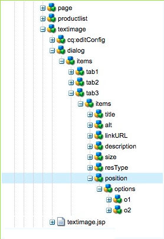

# AEM Desarrollo de componentes de la (IU clásica){#developing-aem-components-classic-ui}

La IU clásica utiliza ExtJS para crear widgets que proporcionen el aspecto de los componentes. Debido a la naturaleza de estos widgets, existen algunas diferencias entre la forma en que los componentes interactúan con la IU clásica y la interfaz de usuario de [IU táctil](/help/sites-developing/developing-components.md).

>[!NOTE]
>
>Muchos aspectos del desarrollo de componentes son comunes tanto a la IU clásica como a la IU táctil, por lo que **debe leer [AEM Componentes de: conceptos básicos](/help/sites-developing/components-basics.md) antes** el uso de esta página, que trata los aspectos específicos de la IU clásica.

>[!NOTE]
>
>Aunque el lenguaje de plantilla de HTML (HTL) y JSP se pueden utilizar para desarrollar componentes para la IU clásica, esta página ilustra el desarrollo con JSP. Esto se debe únicamente al historial de uso de JSP en la IU clásica.
>
>AEM Ahora, HTL es el lenguaje de script recomendado para la ejecución de scripts en el entorno de trabajo de. Consulte [HTL](https://experienceleague.adobe.com/docs/experience-manager-htl/content/overview.html?lang=es) y [AEM Desarrollo de componentes](/help/sites-developing/developing-components.md) para comparar métodos.

## Estructura {#structure}

La estructura básica de un componente se trata en la página [AEM Componentes de: conceptos básicos](/help/sites-developing/components-basics.md#structure), que aplica tanto las IU táctiles como las clásicas. Aunque no necesite utilizar la configuración de la IU táctil en el nuevo componente, puede resultar útil tenerla en cuenta al heredar de los componentes existentes.

## Scripts JSP {#jsp-scripts}

Los scripts JSP o los servlets se pueden utilizar para procesar componentes. Según las reglas de procesamiento de solicitudes de Sling, el nombre del script predeterminado es:

`<*componentname*>.jsp`

## global.jsp {#global-jsp}

El archivo de script JSP `global.jsp` se utiliza para proporcionar acceso rápido a objetos específicos (es decir, para acceder al contenido) a cualquier archivo de script JSP utilizado para procesar un componente.

Por lo tanto `global.jsp` debe incluirse en cada componente que procese scripts JSP donde uno o más de los objetos se proporcionen en `global.jsp` se utilizan.

La ubicación del valor predeterminado `global.jsp` es:

`/libs/foundation/global.jsp`

>[!NOTE]
>
>La ruta `/libs/wcm/global.jsp`, que se utilizaba en las versiones CQ 5.3 y anteriores, ya está obsoleto.

### Función de global.jsp, API utilizadas y Taglibs {#function-of-global-jsp-used-apis-and-taglibs}

A continuación se enumeran los objetos más importantes proporcionados a partir del valor predeterminado `global.jsp`:

Resumen:

* `<cq:defineObjects />`

   * `slingRequest` - El objeto de solicitud ajustado ( `SlingHttpServletRequest`).
   * `slingResponse` - El objeto de respuesta ajustado ( `SlingHttpServletResponse`).
   * `resource` - El objeto de recurso de Sling ( `slingRequest.getResource();`).
   * `resourceResolver` - El objeto Resource Resolver de Sling ( `slingRequest.getResoucreResolver();`).
   * `currentNode` : el nodo JCR resuelto para la solicitud.
   * `log` - El registrador predeterminado ().
   * `sling` - El asistente de scripts de Sling.
   * `properties` - Las propiedades del recurso al que se dirige ( `resource.adaptTo(ValueMap.class);`).
   * `pageProperties` : las propiedades de la página del recurso al que se dirige.
   * `pageManager` AEM - El administrador de páginas para acceder a las páginas de contenido de la ( `resourceResolver.adaptTo(PageManager.class);`).
   * `component` AEM - El objeto de componente del componente de actual.
   * `designer` - El objeto de diseñador para recuperar información de diseño ( `resourceResolver.adaptTo(Designer.class);`).
   * `currentDesign` - El diseño del recurso al que se dirige.
   * `currentStyle` - El estilo del recurso al que se dirige.

### Acceso al contenido {#accessing-content}

AEM Existen tres métodos para acceder al contenido en el WCM de la:

* Mediante el objeto de propiedades introducido en `global.jsp`:

  El objeto properties es una instancia de ValueMap (consulte [API de Sling](https://sling.apache.org/apidocs/sling5/org/apache/sling/api/resource/ValueMap.html)) y contiene todas las propiedades del recurso actual.

  Ejemplo: `String pageTitle = properties.get("jcr:title", "no title");` se utiliza en el script de procesamiento de un componente de página.

  Ejemplo: `String paragraphTitle = properties.get("jcr:title", "no title");` se utiliza en el script de procesamiento de un componente de párrafo estándar.

* Mediante el `currentPage` objeto introducido en `global.jsp`:

  El `currentPage` es una instancia de una página (consulte [AEM API de](https://helpx.adobe.com/es/experience-manager/6-5/sites/developing/using/reference-materials/javadoc/com/day/cq/wcm/api/Page.html)). La clase de página proporciona algunos métodos para tener acceso al contenido.

  Ejemplo: `String pageTitle = currentPage.getTitle();`

* Mediante `currentNode` objeto introducido en `global.jsp`:

  El `currentNode` es una instancia de un nodo (consulte [API JCR](https://jackrabbit.apache.org/api/2.16/org/apache/jackrabbit/standalone/cli/core/CurrentNode.html)). Se puede acceder a las propiedades de un nodo a través de `getProperty()` método.

  Ejemplo: `String pageTitle = currentNode.getProperty("jcr:title");`

## Bibliotecas de etiquetas JSP {#jsp-tag-libraries}

Las bibliotecas de etiquetas CQ y Sling le proporcionan acceso a funciones específicas para utilizarlas en el script JSP de sus plantillas y componentes.

Para obtener más información, consulte el documento [Bibliotecas de etiquetas](/help/sites-developing/taglib.md).

## Uso de bibliotecas de HTML del lado del cliente {#using-client-side-html-libraries}

Los sitios web modernos dependen en gran medida del procesamiento del lado del cliente impulsado por código complejo CSS y JavaScript. Organizar y optimizar el servicio de este código puede ser un problema complicado.

AEM Para ayudar a resolver este problema, proporciona lo siguiente: **Carpetas de biblioteca del cliente**, que le permiten almacenar el código del lado del cliente en el repositorio, organizarlo en categorías y definir cuándo y cómo se debe servir cada categoría de código al cliente. A continuación, el sistema de biblioteca del lado del cliente se encarga de producir los vínculos correctos en la página web final para cargar el código correcto.

Ver el documento [Uso de bibliotecas de HTML del lado del cliente](/help/sites-developing/clientlibs.md) para obtener más información.

## Cuadro de diálogo {#dialog}

El componente necesitará un cuadro de diálogo para que los autores añadan y configuren el contenido.

Consulte [AEM Componentes de: conceptos básicos](/help/sites-developing/components-basics.md#dialogs) para obtener más información.

## Configuración del comportamiento de edición {#configuring-the-edit-behavior}

Puede configurar el comportamiento de edición de un componente. Esto incluye atributos como las acciones disponibles para el componente, las características del editor local y los oyentes relacionados con los eventos del componente. La configuración es común a las IU táctiles y a las clásicas, aunque con ciertas diferencias específicas.

El [se ha configurado el comportamiento de edición de un componente](/help/sites-developing/components-basics.md#edit-behavior) añadiendo una etiqueta `cq:editConfig` nodo de tipo `cq:EditConfig` debajo del nodo de componente (de tipo `cq:Component`) y agregando propiedades específicas y nodos secundarios.

## Uso y ampliación de widgets de ExtJS {#using-and-extending-extjs-widgets}

Consulte [Uso y ampliación de widgets de ExtJS](/help/sites-developing/widgets.md) para obtener más información.

## Uso de xtype para widgets de ExtJS {#using-xtypes-for-extjs-widgets}

Consulte [Uso de xtypes](/help/sites-developing/xtypes.md) para obtener más información.

## Desarrollo de componentes nuevos {#developing-new-components}

En esta sección se describe cómo crear sus propios componentes y añadirlos al sistema de párrafos.

Una forma rápida de empezar es copiar un componente existente y luego realizar los cambios que desee.

Un ejemplo de cómo desarrollar un componente se describe en detalle en [Ampliación del componente Texto e imagen: un ejemplo.](#extending-the-text-and-image-component-an-example)

### Desarrollar un componente nuevo (adaptar componente existente) {#develop-a-new-component-adapt-existing-component}

AEM AEM Para desarrollar nuevos componentes para la creación de informes basados en componentes existentes, puede copiar el componente, crear un archivo javascript para el nuevo componente y almacenarlo en una ubicación accesible para los usuarios de la aplicación (consulte también la sección ). [Personalizar componentes y otros elementos](/help/sites-developing/dev-guidelines-bestpractices.md#customizing-components-and-other-elements)):

1. Con CRXDE Lite, cree una nueva carpeta de componentes en:

   / `apps/<myProject>/components/<myComponent>`

   Vuelva a crear la estructura del nodo como en las bibliotecas y, a continuación, copie la definición de un componente existente, como el componente Texto. Por ejemplo, para personalizar la copia del componente Texto:

   * de `/libs/foundation/components/text`
   * hasta `/apps/myProject/components/text`

1. Modifique la `jcr:title` para reflejar su nuevo nombre.
1. Abra la nueva carpeta de componentes y realice los cambios necesarios. Elimine también la información superflua de la carpeta.

   Puede realizar cambios como los siguientes:

   * adición de un nuevo campo en el cuadro de diálogo

      * `cq:dialog` - cuadro de diálogo para la IU táctil
      * `dialog` - Cuadro de diálogo para la IU clásica

   * se reemplazará el `.jsp` archivo (asígnele el nombre después del nuevo componente)
   * o reprocesamiento completo de todo el componente si lo desea

   Por ejemplo, si toma una copia del componente Texto estándar, puede agregar un campo adicional al cuadro de diálogo y, a continuación, actualizar el `.jsp` para procesar la entrada realizada allí.

   >[!NOTE]
   >
   >Un componente para:
   >
   >* Usuarios de IU táctil [Granite](https://helpx.adobe.com/experience-manager/6-5/sites/developing/using/reference-materials/granite-ui/api/jcr_root/libs/granite/ui/index.html) componentes
   >* La IU clásica utiliza [Widgets de ExtJS](https://helpx.adobe.com/experience-manager/6-5/sites/developing/using/reference-materials/widgets-api/index.html)

   >[!NOTE]
   >
   >Un cuadro de diálogo definido para la IU clásica funcionará dentro de la IU táctil.
   >
   >Un cuadro de diálogo definido para la IU táctil no funcionará dentro de la IU clásica.
   >
   >Según la instancia y el entorno de creación, es posible que desee definir ambos tipos de cuadro de diálogo para el componente.

1. Uno de los siguientes nodos debe estar presente e inicializarse correctamente para que aparezca el nuevo componente:

   * `cq:dialog` - cuadro de diálogo para la IU táctil
   * `dialog` - Cuadro de diálogo para la IU clásica
   * `cq:editConfig` - cómo se comportan los componentes en el entorno de edición (por ejemplo, arrastrar y soltar)
   * `design_dialog` - cuadro de diálogo para el modo de diseño (solo IU clásica)

1. Active el nuevo componente en el sistema de párrafos mediante:

   * uso del CRXDE Lite para añadir el valor `<path-to-component>` (por ejemplo, `/apps/geometrixx/components/myComponent`) a los componentes de propiedad del nodo `/etc/designs/geometrixx/jcr:content/contentpage/par`
   * siga las instrucciones de [Adición de nuevos componentes a los sistemas de párrafos](#adding-a-new-component-to-the-paragraph-system-design-mode)

1. AEM En WCM, abra una página en el sitio web e inserte un nuevo párrafo del tipo que acaba de crear para asegurarse de que el componente funciona correctamente.

>[!NOTE]
>
>Para ver las estadísticas de tiempo de carga de la página, puede utilizar Ctrl-Mayús-U - con `?debugClientLibs=true` se establece en la dirección URL.

### Adición de un nuevo componente al sistema de párrafos (modo de diseño) {#adding-a-new-component-to-the-paragraph-system-design-mode}

Una vez desarrollado el componente, se añade al sistema de párrafos, que permite a los autores seleccionar y utilizar el componente al editar una página.

1. Acceda a una página del entorno de creación que utilice el sistema de párrafos, por ejemplo `<contentPath>/Test.html`.
1. Cambie al modo Diseño mediante una de las siguientes opciones:

   * adición `?wcmmode=design` al final de la dirección URL y volviendo a acceder a, por ejemplo:

     `<contextPath>/ Test.html?wcmmode=design`

   * haciendo clic en Diseño en Sidekick

   Ahora se encuentra en modo de diseño y puede editar el sistema de párrafos.

1. Haga clic en Editar.

   Se mostrará una lista de los componentes que pertenecen al sistema de párrafos. El nuevo componente también aparece en la lista.

   Los componentes se pueden activar (o desactivar) para determinar qué se ofrecen al autor al editar una página.

1. Active el componente y vuelva al modo de edición normal para confirmar que está disponible para su uso.

### Ampliación del componente Texto e imagen: un ejemplo {#extending-the-text-and-image-component-an-example}

Esta sección proporciona un ejemplo sobre cómo ampliar el ampliamente utilizado componente estándar de texto e imagen con una función de colocación de imágenes configurable.

La extensión del componente de texto e imagen permite a los editores utilizar todas las funcionalidades existentes del componente, además de tener una opción adicional para especificar la ubicación de la imagen:

* En el lado izquierdo del texto (comportamiento actual y el nuevo valor predeterminado)
* Así como en el lado derecho

Después de ampliar este componente, puede configurar la ubicación de la imagen a través del cuadro de diálogo del componente.

En este ejercicio se describen las siguientes técnicas:

* Copiar el nodo de componente existente y modificar sus metadatos
* Modificar el cuadro de diálogo del componente, incluida la herencia de widgets de cuadros de diálogo principales
* Modificación del script del componente para implementar la nueva funcionalidad

>[!NOTE]
>
>Este ejemplo está dirigido a la IU clásica.

>[!NOTE]
>
>Este ejemplo se basa en el contenido de la muestra de Geometrixx AEM, que ya no se envía con la opción de distribución, tras haber sido reemplazado por We.Retail. Ver el documento [Implementación de referencia de We.Retail](/help/sites-developing/we-retail.md#we-retail-geometrixx) para obtener información sobre cómo descargar e instalar Geometrixx.

#### Ampliación del componente textimage existente {#extending-the-existing-textimage-component}

Para crear el nuevo componente, se utiliza el componente textimage estándar como base y se modifica. Almacenamos el nuevo componente en la aplicación de ejemplo Geometrixx AEM WCM.

1. Copie el componente textimage estándar de `/libs/foundation/components/textimage` en la carpeta de componentes de Geometrixx, `/apps/geometrixx/components`, usando textimage como nombre del nodo de destino. (Copie el componente navegando hasta el componente, haciendo clic con el botón derecho y seleccionando Copiar y explorando el directorio de destino).

   

1. Para que este ejemplo sea sencillo, vaya al componente que ha copiado y elimine todos los subnodos del nuevo nodo textimage, excepto los siguientes:

   * definición del cuadro de diálogo: `textimage/dialog`
   * script de componente: `textimage/textimage.jsp`
   * editar nodo de configuración (que permite arrastrar y soltar recursos): `textimage/cq:editConfig`

   >[!NOTE]
   >
   >La definición del cuadro de diálogo depende de la interfaz de usuario:
   >
   >* IU táctil: `textimage/cq:dialog`
   >* IU clásica: `textimage/dialog`

1. Edite los metadatos del componente:

   * Nombre del componente

      * Establecer `jcr:description` hasta `Text Image Component (Extended)`
      * Establecer `jcr:title` hasta `Text Image (Extended)`

   * Grupo, donde el componente aparece en la barra de tareas (dejar tal cual)

      * Salir `componentGroup` establezca en `General`

   * Componente principal para el nuevo componente (el componente estándar textimage)

      * Establecer `sling:resourceSuperType` hasta `foundation/components/textimage`

   Después de este paso, el nodo de componente tiene este aspecto:

   

1. Cambie el `sling:resourceType` propiedad del nodo editar configuración de la imagen (propiedad: `textimage/cq:editConfig/cq:dropTargets/image/parameters/sling:resourceType`) a `geometrixx/components/textimage.`

   De este modo, cuando se suelta una imagen en el componente de la página, la variable `sling:resourceType` la propiedad del componente textimage extendido se establece en: `geometrixx/components/textimage.`

1. Modifique el cuadro de diálogo del componente para incluir la nueva opción. El nuevo componente hereda las partes del cuadro de diálogo que son las mismas que en el original. La única adición que hacemos es ampliar el **Avanzadas** pestaña, añadir un **Posición de imagen** lista desplegable, con opciones **Izquierda** y **Derecha**:

   * Deje el `textimage/dialog`propiedades sin cambiar.

   Observe cómo `textimage/dialog/items` tiene cuatro subnodos, tab1 a tab4, que representan las cuatro pestañas del cuadro de diálogo textimage.

   * Para las dos primeras pestañas (tab1 y tab2):

      * Cambie xtype a cqinclude (para heredar del componente estándar).
      * Añadir una propiedad de ruta con valores `/libs/foundation/components/textimage/dialog/items/tab1.infinity.json`y `/libs/foundation/components/textimage/dialog/items/tab2.infinity.json`, respectivamente.
      * Elimine todas las demás propiedades o subnodos.

   * Para la pestaña 3:

      * Deje las propiedades y los subnodos sin cambios
      * Agregar una nueva definición de campo a `tab3/items`, posición del nodo de tipo `cq:Widget`
      * Establezca las siguientes propiedades (de tipo cadena) para el nuevo `tab3/items/position`nodo:

         * `name`: `./imagePosition`
         * `xtype`: `selection`
         * `fieldLabel`: `Image Position`
         * `type`: `select`

      * Añadir subnodo `position/options` de tipo `cq:WidgetCollection` para representar las dos opciones de colocación de la imagen y, debajo de ella, crear dos nodos, o1 y o2 de tipo `nt:unstructured`.
      * Para el nodo `position/options/o1` establezca las propiedades: `text` hasta `Left` y `value` hasta `left.`
      * Para el nodo `position/options/o2` establezca las propiedades: `text` hasta `Right` y `value` hasta `right`.

   * Eliminar ficha4.

   La posición de la imagen se mantiene en el contenido como `imagePosition`propiedad del nodo que representa `textimage` párrafo. Después de estos pasos, el cuadro de diálogo del componente tiene este aspecto:

   

1. Ampliar el script del componente. `textimage.jsp`, con un control adicional del nuevo parámetro:

   ```xml
   Image image = new Image(resource, "image");
   
   if (image.hasContent() || WCMMode.fromRequest(request) == WCMMode.EDIT) {
        image.loadStyleData(currentStyle);
   ```

   Vamos a reemplazar el fragmento de código enfatizado *%>&lt;div class=&quot;image&quot;>&lt;%* con el nuevo código que genera un estilo personalizado para esta etiqueta.

   ```xml
   // todo: add new CSS class for the 'right image' instead of using
   // the style attribute
   String style="";
        if (properties.get("imagePosition", "left").equals("right")) {
             style = "style=\"float:right\"";
        }
        %><div <%= style %> class="image"><%
   ```

1. Guarde el componente en el repositorio. El componente está listo para probarse.

#### Comprobación del nuevo componente {#checking-the-new-component}

Una vez desarrollado el componente, puede agregarlo al sistema de párrafos, que permite a los autores seleccionar y utilizar el componente al editar una página. Estos pasos le permiten probar el componente.

1. Abra una página en Geometrixx como Inglés/Compañía.
1. Cambie al modo de diseño haciendo clic en Diseño en la barra de tareas.
1. Edite el diseño del sistema de párrafos haciendo clic en Editar en el sistema de párrafos situado en medio de la página. Se muestra una lista de componentes que se pueden colocar en el sistema de párrafos y que deben incluir el componente recién desarrollado, Imagen de texto (ampliada) . Actívelo para el sistema de párrafos seleccionándolo y haciendo clic en Aceptar
1. Vuelva al modo de edición.
1. Agregue el párrafo Imagen de texto (ampliado) al sistema de párrafos e inicialice el texto y la imagen con contenido de ejemplo. Guarde los cambios.
1. Abra el cuadro de diálogo del texto y del párrafo de imagen, cambie la Posición de la imagen en la pestaña Avanzado a Derecha y haga clic en Aceptar para guardar los cambios.
1. El párrafo se procesa con la imagen a la derecha.
1. El componente ya está listo para usarse.

El componente almacena su contenido en un párrafo de la página Compañía.

### Deshabilitar la capacidad de carga del componente de imagen {#disable-upload-capability-of-the-image-component}

Para deshabilitar esta capacidad, utilizamos el componente de imagen estándar como base y lo modificamos. Almacenamos el nuevo componente en la aplicación de ejemplo de Geometrixx.

1. Copie el componente de imagen estándar de `/libs/foundation/components/image` en la carpeta de componentes de Geometrixx, `/apps/geometrixx/components`, usando image como nombre del nodo de destino.

   

1. Edite los metadatos del componente:

   * Establecer **jcr:título** hasta `Image (Extended)`

1. Navegue hasta `/apps/geometrixx/components/image/dialog/items/image`.
1. Añadir una nueva propiedad:

   * **Nombre**: `allowUpload`
   * **Tipo**: `String`
   * **Valor**: `false`

   

1. Haga clic en **Guardar todo**. El componente está listo para probarse.
1. Abra una página en Geometrixx como Inglés/Compañía.
1. Cambie al modo de diseño y active Imagen (ampliada).
1. Vuelva al modo de edición y agréguelo al sistema de párrafos. En las siguientes imágenes, puede ver las diferencias entre el componente de imagen original y el que acaba de crear.

   Componente de imagen original:

   

   El nuevo componente de imagen:

   

1. El componente ya está listo para usarse.
