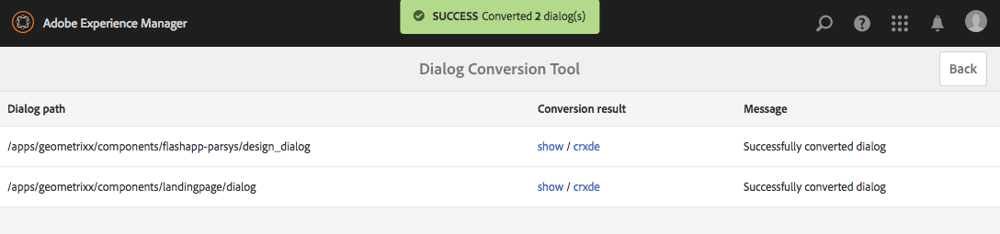

# Herramienta de conversión de cuadro de diálogo{#dialog-conversion-tool}

La herramienta de conversión de cuadro de diálogo se proporciona para ayudar a ampliar los componentes existentes que solo tienen un cuadro de diálogo definido para la IU clásica (basada en ExtJS) o basado en la IU de Granite y Coral 2. La herramienta utiliza el cuadro de diálogo original para crear un cuadro de diálogo de duplicado diseñado para la interfaz de usuario estándar, basado en la interfaz de usuario de Granite y Coral 3.

El objetivo de esta herramienta es automatizar la actualización en la medida de lo posible, aumentar la eficiencia y reducir los errores. Sin embargo, como la herramienta no puede abarcar todos los escenarios, el proceso no puede automatizarse completamente y el usuario debe revisar los diálogos convertidos y posiblemente realizar ajustes adicionales. La herramienta está pensada como una ayuda para ayudarle a realizar el inicio del proceso de conversión, pero no para tomar el control total de la conversión.

La herramienta creará el nuevo cuadro de diálogo utilizando la IU granita estándar y la IU basada en Coral 3, pero omitirá lo que no puede convertir. Por lo tanto, el cuadro de diálogo resultante puede contener nodos del cuadro de diálogo original copiados tal cual, si ninguna regla coincide con ese componente específico. Además, un componente convertido puede tener algunas propiedades sin convertir, ya que no había ninguna regla apropiada para convertirlas.

>[!CAUTION]
>
>La herramienta no puede abarcar todos los escenarios, ya que sus reglas de conversión no son exhaustivas y funcionan con el mejor esfuerzo. Convierte los elementos y propiedades utilizados con más frecuencia, pero la conversión estará incompleta cuando se trate de personalizaciones o de diálogos altamente especializados. **Los diálogos convertidos pueden requerir ajustes adicionales y todas las conversiones deben revisarse.**

>[!NOTE]
>
>Dado que la IU clásica ya no se está desarrollando ni mejorando, Adobe recomienda que los clientes actualicen a la interfaz de usuario de Granite predeterminada para beneficiarse de la tecnología más reciente.
>
>Aunque en general es una buena práctica migrar a la plataforma más reciente, no es muy importante migrar de Coral 2 a Coral 3. Sin embargo, cualquier nuevo proyecto debe iniciarse en base a Coral 3.

## Descargar e instalar la herramienta de conversión de cuadro de diálogo {#download-and-install-the-dialog-conversion-tool}

La herramienta de conversión de cuadro de diálogo se ha hecho de código abierto y se puede acceder a ella a través de GitHub.

CÓDIGO DE GITHUB

Puede encontrar el código de esta página en GitHub

* [Abrir un proyecto de conversión de diálogo aem en GitHub](https://github.com/Adobe-Marketing-Cloud/aem-dialog-conversion)
* Descargue el proyecto como [un archivo ZIP](https://github.com/Adobe-Marketing-Cloud/aem-dialog-conversion/archive/master.zip)

>[!NOTE]
>
>AEM se envía con la herramienta de conversión de cuadro de diálogo. Debe descargarlo e instalarlo para utilizarlo.

Siga estos pasos para instalar la herramienta de conversión de cuadro de diálogo.

1. Descargue el paquete del proyecto [Dialog Conversion Tool GitHub](https://github.com/Adobe-Marketing-Cloud/aem-dialog-conversion/releases).
1. Instale el paquete en su instancia. Para obtener más información sobre la administración de paquetes, consulte [Cómo trabajar con paquetes](/help/sites-administering/package-manager.md).

## Conversión de un cuadro de diálogo {#converting-a-dialog}

La herramienta convierte los cuadros de diálogo mediante la creación de una interfaz de usuario de Granite/Coral 3 correspondiente en la misma ubicación que el cuadro de diálogo original en el árbol de contenido. En el caso de los cuadros de diálogo Interfaz de usuario de Granite / Coral 2, se copian en una ubicación de copia de seguridad (se agrega un sufijo `.coral2` al nombre del nodo de cuadro de diálogo) para que no se sobrescriban. La herramienta puede convertir diálogos de diseño y editar diálogos.

Siga estos pasos para convertir uno o varios cuadros de diálogo:

1. Abra la consola **Conversión de cuadro de diálogo**, a la que se puede acceder desde **Navegación global** -> **Herramientas** -> **Operaciones**:

   `https://<hostname>:<port>/libs/cq/dialogconversion/content/console.html`

   

1. Escriba la ruta de acceso requerida como `/apps/geometrixx/components`. También puede introducir una ruta directa a un único cuadro de diálogo como `/apps/geometrixx/components/lead`.

   

1. Seleccione **Mostrar cuadros de diálogo** para mostrar todos los cuadros de diálogo debajo de esa ubicación.

   

   La tabla lista todos los cuadros de diálogo heredados existentes debajo de la ruta introducida. Cada cuadro de diálogo tiene su tipo en la lista. Los tipos incluyen:

   * **Classic:** nodos de tipo  `cq:Dialog` que tienen nombre de nodo  `dialog` o  `design_dialog`
   * **Coral 2:** Nodos con nombre  `cq:dialog` o  `cq:design_dialog` que tienen una interfaz de usuario de Granite / tipo de recurso Coral 2 en el nodo de contenido secundario

   Cada fila contiene un vínculo para la vista del cuadro de diálogo y un vínculo al CRXDE Lite para la vista de su estructura de nodos.

   >[!NOTE]
   >
   >Los componentes que no tienen un cuadro de diálogo para la IU clásica o Coral 2 en absoluto (es decir, diseñados con la IU de Granite / Coral 3) no aparecen en la lista.

1. Seleccione uno o varios cuadros de diálogo para la conversión y toque o haga clic **Convertir cuadros de diálogo X** para inicio del proceso de conversión.

   

1. Los cuadros de diálogo seleccionados se muestran con los resultados de sus conversiones. Si la conversión se ha realizado correctamente, la fila contiene vínculos para la vista del cuadro de diálogo convertido o para abrirlo en CRXDE Lite.

   Toque o haga clic en **Atrás** para volver a la herramienta de conversión de cuadro de diálogo.

   

1. De nuevo en la herramienta de conversión de cuadro de diálogo, los cuadros de diálogo convertidos ya no se muestran en la lista. Sin embargo, tenga en cuenta que el número total de diálogos encontrados sigue enumerándose, incluidos los ya convertidos, es decir, el número de filas de la tabla no coincide necesariamente con el número encontrado.

   

1. Marque la opción **Mostrar cuadros de diálogo convertidos** para mostrar los cuadros de diálogo ubicados en la ruta especificada que ya se han convertido.

   

   Si el cuadro de diálogo ya se ha convertido, también se proporcionan vínculos al cuadro de diálogo convertido. Un cuadro de diálogo se considera convertido si ya hay disponible una interfaz de usuario de Granite/Coral 3 del mismo nivel.

## Reglas de reescritura de cuadro de diálogo {#dialog-rewrite-rules}

La herramienta de conversión de cuadro de diálogo se basa en el concepto de **reescritura de gráficos**, que consiste en transformar un gráfico de temas mediante la aplicación de reglas de reescritura. Una regla de reescritura es el emparejamiento de un patrón con un gráfico de reemplazo. La regla coincide con las incidencias de un determinado subgráfico en el gráfico de temas y posteriormente los reemplaza. Consulte también [https://en.wikipedia.org/wiki/Graph_rewriting](https://en.wikipedia.org/wiki/Graph_rewriting) para obtener más información sobre la reescritura de gráficos.

La herramienta de conversión de cuadro de diálogo utiliza este método para reescribir un árbol de diálogo heredado (IU clásica o granita / Coral 2) en su contraparte de Granite UI / Coral 3. Esto tiene la ventaja de que la conversión es muy flexible y puede tener en cuenta incluso componentes complejos, ya que la coincidencia se realiza en subárboles reales y no solo en nodos o propiedades únicos.

### Algoritmo {#algorithm}

El algoritmo de reescritura toma como parámetro el árbol que se va a reescribir y un conjunto de reglas de reescritura. Pasa por el árbol en orden previo y, para cada nodo, comprueba si se aplica una regla para el subárbol que se origina en ese nodo. La primera regla que coincide se aplica a ese subárbol para reescribirla. A continuación, el recorrido se reinicia desde la raíz. El algoritmo se detiene tan pronto como se ha atravesado todo el árbol y ninguna regla ha coincidido con ningún subárbol. Como medida de optimización, el algoritmo rastrea un conjunto de nodos que son finales y, por lo tanto, no es necesario volver a comprobar las coincidencias en los posteriores pasos. Depende de las reglas de reescritura definir qué nodos del árbol reescrito son finales y cuáles deben ser revisados por futuras pasadas del algoritmo.

El punto de entrada para la conversión es `DialogConversionServlet`, que se registra en las solicitudes de POST a `/libs/cq/dialogconversion/content/convert.json`. Acepta un parámetro de solicitud de ruta, que es una matriz que contiene las rutas a los cuadros de diálogo que se deben convertir. Para cada cuadro de diálogo, el servlet vuelve a escribir el árbol de diálogo correspondiente aplicando todas las reglas de reescritura de cuadro de diálogo definidas.

### Reescribir tipos de reglas {#rewrite-rule-types}

Las reglas de reescritura se pueden definir de dos formas diferentes:

* Estructuras de nodos JCR: [Reglas de reescritura basadas en nodos](/help/sites-developing/dialog-conversion.md#node-based-rewrite-rules)

* Clases de Java que implementan una interfaz específica: [Reglas de reescritura basadas en Java](/help/sites-developing/dialog-conversion.md#java-based-rewrite-rules)

Algunos [se proporcionan listos para usar](#provided-rewrite-rules), pero también puede definir sus propias reglas personalizadas. [También están disponibles ](/help/sites-developing/dialog-conversion.md#sample-rewrite-rules) reglas de reescritura de muestra.

Normalmente, una sola regla de reescritura de cuadro de diálogo es responsable de reescribir un solo elemento de cuadro de diálogo, por ejemplo, el campo de entrada del navegador de rutas de acceso.

>[!CAUTION]
>
>El algoritmo no detecta los bucles de reescritura, por lo tanto **las reglas de reescritura no deben reescribir los árboles de forma circular**.

### Reglas de reescritura basadas en nodos {#node-based-rewrite-rules}

Se puede definir una regla de reescritura de cuadro de diálogo en términos de nodos y propiedades.

```xml
rule
  - jcr:primaryType = nt:unstructured
  - cq:rewriteRanking = 4
  + patterns
    - jcr:primaryType = nt:unstructured
    + foo
      - ...
      + ...
    + foo1
      - ...
      + ...
  + replacement
    + bar
      - ...
      + ...
```

En este ejemplo se define una regla que contiene dos **patrones** (los árboles con raíces en `foo` y `foo1`) y un **reemplazo** (el árbol con raíces en `bar`). El patrón y los árboles de reemplazo son árboles arbitrarios que contienen nodos y propiedades. La regla coincide con un subárbol si alguno de los patrones definidos coincide. Para que un patrón coincida, el árbol del sujeto debe contener los mismos nodos que el patrón (nombres coincidentes) y todas las propiedades definidas en el patrón deben coincidir con las propiedades del árbol.

En el caso de una coincidencia, el subárbol coincidente (denominado el árbol original) será sustituido por el reemplazo. El árbol de reemplazo puede definir propiedades asignadas que heredarán el valor de una propiedad en el árbol original. Deben ser de tipo `String` y tener el siguiente formato:

`${<path>}`

Si la propiedad a la que se hace referencia no existe en el árbol original, se omite la propiedad. Como alternativa, se puede especificar un valor predeterminado para ese caso (solo es posible para propiedades de cadena):

`${<path>:<default>}`

Las propiedades que contienen caracteres &#39; `:`&#39; pueden estar entre comillas simples para evitar conflictos al proporcionar un valor predeterminado. Las propiedades booleanas se anulan si la expresión lleva el prefijo &#39; `!`&#39;. Las propiedades asignadas se pueden multivalor, en cuyo caso se les asignará el valor de la primera propiedad que exista en el árbol coincidente.

Por ejemplo, a la siguiente propiedad `one` se le asignará el valor de la propiedad `./two/three` del árbol original coincidente.

```xml
...
  + replacement
    + bar
      - one = ${./two/three}
      - negated = !${./some/boolean/prop}
      - default = ${./some/prop:default}
      - multi = [${./prop1}, ${./prop2}]
```

Las reglas también admiten las siguientes propiedades opcionales.

* `cq:rewriteOptional` (boolean)

   Establezca esta propiedad en un nodo de patrón para indicar que el nodo no tiene que estar presente para que el patrón coincida

* `cq:rewriteRanking` (integer)

   Establezca esta propiedad en el nodo de regla para que afecte al orden en que se aplican las reglas. Esto puede resultar útil para garantizar que las reglas que gestionan estructuras más específicas no se sobrescriban con otras más generales. Las reglas con una clasificación más baja tienen prioridad sobre las que tienen una clasificación más alta. De forma predeterminada, todas las reglas reciben `Integer.MAX_VALUE` como su clasificación.

El árbol de reemplazo también admite las siguientes propiedades especiales (cuyo nombre comienza por `cq:rewrite`):

* `cq:rewriteMapChildren` (cadena)

   El nodo que contiene esta propiedad recibirá una copia de los elementos secundarios del nodo en el árbol original al que hace referencia el valor de propiedad (p. ej. `cq:rewriteMapChildren=./items`).

* `cq:rewriteFinal` (booleano)

   Se trata de una medida de optimización que indica al algoritmo que el nodo que contiene esta propiedad es final y no es necesario volver a comprobar si hay reglas de reescritura coincidentes. Cuando se coloca en el propio nodo de reemplazo, todo el árbol de reemplazo se considera final.
* `cq:rewriteCommonAttrs` (booleano)

   Establezca esta propiedad en el nodo de reemplazo ( `rule`/ `replacement`) para asignar las propiedades relevantes del nodo raíz original a los equivalentes de atributos comunes Granite en la raíz de copia. Administrará los atributos de datos copiando/creando el subnodo `granite:data` en el destinatario y escribiendo las propiedades `data-*` allí.
* `cq:rewriteRenderCondition` (booleano)

   Establezca esta propiedad en el nodo de reemplazo ( `rule`/ `replacement`) para copiar cualquier condición de procesamiento de Granite ( `rendercondition` o `granite:rendercondition`) nodo secundario del nodo raíz original en un `granite:rendercondition` nodo secundario de la raíz de copia.

Además, se puede agregar un nodo `cq:rewriteProperties` a un nodo de reemplazo para definir las reescrituras de cadenas para las propiedades asignadas en el resultado. El nodo se elimina del reemplazo. Las propiedades del nodo `cq:rewriteProperties` deben tener el mismo nombre que las que están reescribiendo y aceptar una matriz de cadenas con dos parámetros:

* `pattern`:: Regex para comparar, p. ej.  `"(?:coral-Icon-)(.+)"`

* `replacement`:: Proporcionado a la  `replaceAll` función de coincidencia, por ejemplo:  `"$1"`

A continuación se muestra un ejemplo de reescritura de las propiedades del icono Coral 2 en los equivalentes de Coral 3:

```xml
...
  + replacement
    + bar
      - icon = ${./icon}
      + cq:rewriteProperties
       - icon = [(?:coral-Icon--)(.+), $1]
```

#### Definición de sus propias reglas de reescritura basadas en nodos {#defining-your-own-node-based-rewrite-rules}

Las reglas de reescritura proporcionadas se definen en:

`/libs/cq/dialogconversion/rules`

Las reglas se dividen en carpetas para las reglas de reescritura clásicas y las reglas de reescritura de Coral 2:

`/libs/cq/dialogconversion/rules/classic`

`/libs/cq/dialogconversion/rules/coral2`

Estas reglas se pueden sobrescribir proporcionando un conjunto de reglas en:

`/apps/cq/dialogconversion/rules`

Puede copiar `/libs/cq/dialogconversion/rules` en `/apps` y luego modificar las reglas existentes y/o agregar nuevas reglas a esta nueva instancia &quot;.

### Reglas de reescritura basadas en Java {#java-based-rewrite-rules}

Las reglas de reescritura más complejas se pueden definir como clases Java que exponen un servicio OSGi de la interfaz `com.adobe.cq.dialogconversion.DialogRewriteRule`.

Dicha clase debe implementar los siguientes métodos:

```java
boolean matches(Node root) throws RepositoryException;
Node applyTo(Node root, Set<Node> finalNodes) throws DialogRewriteException, RepositoryException;
int getRanking();
```

El método `matches` debe devolver `true` si la regla coincide con el subárbol raíz del nodo raíz proporcionado. Si la regla coincide, el algoritmo de reescritura de árbol llamará posteriormente al método `applyTo`, que debe reescribir el subárbol que se origina en el nodo raíz especificado. Normalmente, este método cambiará temporalmente el nombre del árbol original, generará el nuevo árbol como un nuevo elemento secundario del nodo principal del árbol original (con sus nodos y propiedades) y, finalmente, eliminará el árbol original. Encontrará información más detallada en el Javadoc de la interfaz `com.adobe.cq.dialogconversion.DialogRewriteRule`.

#### Más información: Javadocs {#further-information-javadocs}

Para obtener más información, consulte Javadocs para [`com.adobe.cq.dialogconversion`](https://adobe-marketing-cloud.github.io/aem-touchui-dialogconversion-samples/javadoc/).

#### Definición de sus propias reglas de reescritura basadas en Java {#defining-your-own-java-based-rewrite-rules}

La siguiente clase muestra un ejemplo de una regla de reescritura personalizada que implementa la interfaz `com.adobe.cq.dialogconversion.DialogRewriteRule`.

```java
@Component
@Service
public class CustomDialogRewriteRule implements DialogRewriteRule {

    public boolean matches(Node root) throws RepositoryException {
        // ...
    }

    public Node applyTo(Node root, Set<Node> finalNodes) throws DialogRewriteException, RepositoryException {
        // ...
    }

    int getRanking() {
        // ...
    }

}
```

Como alternativa, puede extender `com.adobe.cq.dialogconversion.AbstractDialogRewriteRule` como se muestra a continuación. La clase abstracta implementa el método `getRanking` y utiliza la propiedad OSGi `service.ranking` del servicio para determinar la clasificación de la regla.

```java
@Component
@Service
@Properties({
        @Property(name="service.ranking", intValue = 10)
})
public class CustomDialogRewriteRule extends AbstractDialogRewriteRule {

    public boolean matches(Node root) throws RepositoryException {
        // ...
    }

    public Node applyTo(Node root, Set<Node> finalNodes) throws RewriteException, RepositoryException {
        // ...
    }

}
```

### Reglas de reescritura proporcionadas {#provided-rewrite-rules}

El paquete `cq-dialog-conversion-content` contiene varias reglas de reescritura predefinidas. Para obtener más información sobre las utilidades clásicas de la interfaz de usuario, consulte [Uso de xtypes](/help/sites-developing/xtypes.md).

<table>
 <tbody>
  <tr>
   <td><strong>Regla</strong></td>
   <td><strong>Componente heredado</strong></td>
   <td><strong>Sustitución de la interfaz de usuario de granito/Coral 3</strong></td>
  </tr>
  <tr>
   <td><code>com.adobe.cq.dialogconversion.rules.CqDialogRewriteRule</code></td>
   <td>El nodo de tipo <code>cq:Dialog</code> gestiona diferentes subestructuras</td>
   <td><p>Un <code>granite/ui/components/foundation/container</code> con una presentación <code>fixedcolumns</code> o <code>tabs</code></p> <p>Los componentes reales del cuadro de diálogo se copian y se vuelven a escribir en las pasadas posteriores del algoritmo.</p> </td>
  </tr>
  <tr>
   <td><code>com.adobe.cq.dialogconversion.rules.IncludeRule</code></td>
   <td>xtype = <code>cqinclude</code></td>
   <td>El nodo al que se hace referencia se copia en el cuadro de diálogo Interfaz de usuario de Granite / Coral 3 y (posiblemente) se vuelve a escribir posteriormente en el algoritmo.</td>
  </tr>
  <tr>
   <td><code>com.adobe.cq.dialogconversion.rules.MultifieldRewriteRule</code></td>
   <td>xtype = <code>multifield</code></td>
   <td><p>A <code>granite/ui/components/coral/foundation/form/multifield</code></p> <p>El nodo secundario <code>fieldConfig</code> (si lo hay) se reescribe por separado, por lo que no se limitan los componentes admitidos.</p> </td>
  </tr>
  <tr>
   <td><code>/libs/cq/dialogconversion/rules/classic</code></td>
   <td><code class="code">button
      checkbox
      colorfield
      combobox
      componentselector
      datetime
      fieldset
      fileupload
      hidden
      numberfield
      panel
      password
      pathfield
      radio
      radiogroup
      select
      sizefield
      tabpanel
      tags
      textarea
      textfield</code></td>
   <td> </td>
  </tr>
  <tr>
   <td><code>/libs/cq/dialogconversion/rules/coral2</code></td>
   <td><code class="code">actionfield
      autocomplete
      button
      checkbox
      collapsible
      colorpicker
      container
      datepicker
      fieldset
      fileupload
      fixedcolumns
      heading
      hidden
      hyperlink
      include
      multifield
      nestedcheckboxlist
      nestedcheckboxlist-checkbox
      numberfield
      password
      pathbrowser
      radio
      radiogroup
      reset
      select
      submit
      switch
      tabs
      tags
      text
      textarea
      textfield
      userpicker
      well</code></td>
   <td> </td>
  </tr>
 </tbody>
</table>

### Reglas de reescritura de muestra {#sample-rewrite-rules}

CÓDIGO DE GITHUB

Puede encontrar el código de esta página en GitHub

* [Abrir el proyecto aem-touchui-dialogconversion-samples en GitHub](https://github.com/Adobe-Marketing-Cloud/aem-touchui-dialogconversion-samples)
* Descargue el proyecto como [un archivo ZIP](https://github.com/Adobe-Marketing-Cloud/aem-touchui-dialogconversion-samples/archive/master.zip)

