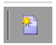

# Creación de extensiones personalizadas{#creating-custom-extensions}

AEM Por lo general, al implementar un proyecto, se tiene código personalizado tanto en la aplicación como en la aplicación de Adobe Campaign. Con el uso de la API existente, puede llamar a su código personalizado en Adobe Campaign AEM AEM desde o desde el a Adobe Campaign. Este documento describe cómo hacerlo.

## Requisitos previos {#prerequisites}

Debe tener instalado lo siguiente:

* Adobe Experience Manager
* Adobe Campaign 6.1

Consulte [AEM Integración de con Adobe Campaign 6.1](/help/sites-administering/campaignonpremise.md) para obtener más información.

## AEM Ejemplo 1: a Adobe Campaign {#example-aem-to-adobe-campaign}

AEM La integración estándar entre y Campaign se basa en JSON y JSSP (JavaScript Server Page). Estos archivos JSSP se pueden encontrar en la consola de Campaign y todos empiezan por **amc** (Adobe Marketing Cloud).


>[!NOTE]
>
>[Para ver este ejemplo, consulte la Geometrixx](/help/sites-developing/we-retail.md), que está disponible en Uso compartido de paquetes.

AEM En este ejemplo, creamos un nuevo archivo JSSP personalizado y lo llamamos desde el lado del para recuperar el resultado. Esto se puede utilizar, por ejemplo, para recuperar datos de Adobe Campaign o para guardarlos en Adobe Campaign.

1. En Adobe Campaign, para crear un nuevo archivo JSSP, haga clic en **Nuevo** icono.

   

1. Escriba el nombre de este archivo JSSP. En este ejemplo, utilizamos **cus:custom.jssp** (lo que significa que estará en el **cus** namespace).

   

1. Inserte el siguiente código en el archivo jssp:

   ```
   <%
   var origin = request.getParameter("origin");
   document.write("Hello from Adobe Campaign, origin : " + origin);
   %>
   ```

1. Guarde el trabajo. AEM El trabajo restante se encuentra en el estado de.
1. AEM Cree un servlet simple en el lado del para llamar a este JSSP. En este ejemplo, suponemos lo siguiente:

   * AEM Tiene la conexión funcionando entre y Campaign
   * Campaign Cloud Service está configurado en **/content/geometrixx-outdoors**

   El objeto más importante de este ejemplo es el **GenericCampaignConnector**, que le permite llamar (obtener y publicar) archivos jssp en Adobe Campaign.

   Este es un pequeño fragmento de código:

   ```
   @Reference
   private GenericCampaignConnector campaignConnector;
   ...
   Map<String, String> params = new HashMap<String, String>();
   params.put("origin", "AEM");
   CallResults results = campaignConnector.callGeneric("/jssp/cus/custom.jssp", params, credentials);
   return results.bodyAsString();
   ```

1. Como puede ver en este ejemplo, debe pasar las credenciales a la llamada de. Se puede obtener mediante el método getCredentials() donde se pasa una página que tiene configurado el servicio en la nube de Campaign.

   ```xml
   // page containing the cloudservice for Adobe Campaign
   Configuration config = campaignConnector.getWebserviceConfig(page.getContentResource().getParent());
   CampaignCredentials credentials = campaignConnector.retrieveCredentials(config);
   ```

El código completo es el siguiente:

```java
import java.io.IOException;
import java.io.PrintWriter;
import java.util.HashMap;
import java.util.Map;

import javax.servlet.ServletException;

import org.apache.felix.scr.annotations.Reference;
import org.apache.felix.scr.annotations.sling.SlingServlet;
import org.apache.sling.api.SlingHttpServletRequest;
import org.apache.sling.api.SlingHttpServletResponse;
import org.apache.sling.api.servlets.SlingSafeMethodsServlet;
import org.slf4j.Logger;
import org.slf4j.LoggerFactory;

import com.day.cq.mcm.campaign.CallResults;
import com.day.cq.mcm.campaign.CampaignCredentials;
import com.day.cq.mcm.campaign.GenericCampaignConnector;
import com.day.cq.wcm.api.Page;
import com.day.cq.wcm.api.PageManager;
import com.day.cq.wcm.api.PageManagerFactory;
import com.day.cq.wcm.webservicesupport.Configuration;

@SlingServlet(paths="/bin/campaign", methods="GET")
public class CustomServlet extends SlingSafeMethodsServlet {

 private final Logger log = LoggerFactory.getLogger(this.getClass());

 @Reference
 private GenericCampaignConnector campaignConnector;

 @Reference
 private PageManagerFactory pageManagerFactory;

 @Override
 protected void doGet(SlingHttpServletRequest request,
   SlingHttpServletResponse response) throws ServletException,
   IOException {

  PageManager pm = pageManagerFactory.getPageManager(request.getResourceResolver());

  Page page = pm.getPage("/content/geometrixx-outdoors");

  String result = null;
  if ( page != null) {
   result = callCustomFunction(page);
  }
  if ( result != null ) {
   PrintWriter pw = response.getWriter();
   pw.print(result);
  }
 }

 private String callCustomFunction(Page page ) {
  try {
   Configuration config = campaignConnector.getWebserviceConfig(page.getContentResource().getParent());
   CampaignCredentials credentials = campaignConnector.retrieveCredentials(config);

   Map<String, String> params = new HashMap<String, String>();
   params.put("origin", "AEM");
   CallResults results = campaignConnector.callGeneric("/jssp/cus/custom.jssp", params, credentials);
   return results.bodyAsString();
  } catch (Exception e ) {
   log.error("Something went wrong during the connection", e);
  }
  return null;

 }

}
```

## Ejemplo 2: Adobe Campaign AEM a la {#example-adobe-campaign-to-aem}

AEM ofrece las API listas para usar para recuperar los objetos disponibles en cualquier parte de la vista del explorador de siteadmin.


>[!NOTE]
>
>[Para ver este ejemplo, consulte la Geometrixx](/help/sites-developing/we-retail.md), que está disponible en Uso compartido de paquetes.

Para cada nodo del explorador hay una API vinculada a él. Por ejemplo, para el nodo:

* [http://localhost:4502/siteadmin#/content/campaigns/geometrixx/scott-recommends](http://localhost:4502/siteadmin#/content/campaigns/geometrixx/scott-recommends)

la API es:

* [http://localhost:4502/content/campaigns/geometrixx/scott-recommends.1.json](http://localhost:4502/content/campaigns/geometrixx/scott-recommends.2.json)

Final de la dirección URL **.1.json** se puede reemplazar por **.2.json**, **.3.json**, según el número de subniveles que le interese conseguir. Para obtener todos ellos la palabra clave **infinito** se puede utilizar:

* [http://localhost:4502/content/campaigns/geometrixx/scott-recommends.infinity.json](http://localhost:4502/content/campaigns/geometrixx/scott-recommends.2.json)

AEM Ahora, para consumir la API, debemos saber que, de forma predeterminada, utiliza la autenticación básica.

Una biblioteca JS con el nombre **amcIntegration.js** está disponible en 6.1.1 (versión 8624 y superior) que implementa esa lógica entre otras.

### AEM Llamada de API de {#aem-api-call}

```java
loadLibrary("nms:amcIntegration.js");

var cmsAccountId = sqlGetInt("select iExtAccountId from NmsExtAccount where sName=$(sz)","aemInstance")
var cmsAccount = nms.extAccount.load(String(cmsAccountId));
var cmsServer = cmsAccount.server;

var request = new HttpClientRequest(cmsServer+"/content/campaigns/geometrixx.infinity.json")
aemAddBasicAuthentication(cmsAccount, request);
request.method = "GET"
request.header["Content-Type"] = "application/json; charset=UTF-8";
request.execute();
var response = request.response;
```
