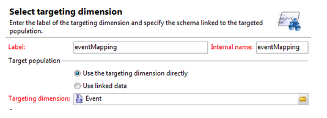

# Creación de asignaciones de formularios personalizados{#creating-custom-form-mappings}

Al crear una tabla personalizada en Adobe Campaign, es posible que desee crear un formulario en AEM que se asigne a esa tabla personalizada.

Este documento describe cómo crear asignaciones de formularios personalizadas. Cuando complete los pasos de este documento, proporcionará a los usuarios una página de evento en la que podrán registrarse para un evento futuro. A continuación, realice un seguimiento de estos usuarios a través de Adobe Campaign.

## Requisitos previos {#prerequisites}

Debe tener instalado lo siguiente:

* Adobe Experience Manager
* Adobe Campaign Classic

See [Integrating AEM with Adobe Campaign Classic](/help/sites-administering/campaignonpremise.md) for more information.

## Creación de asignaciones de formularios personalizados {#creating-custom-form-mappings-2}

Para crear asignaciones de formularios personalizadas, debe seguir estos pasos de alto nivel, que se describen en detalle en las siguientes secciones:

1. Cree una tabla personalizada.
1. Extender la tabla **de raíz** .
1. Cree una asignación personalizada.
1. Cree una entrega según la asignación personalizada.
1. Cree el formulario en AEM, que utilizará la entrega creada.
1. Envíe el formulario para probarlo.

### Creación de una tabla personalizada en Adobe Campaign {#creating-the-custom-table-in-adobe-campaign}

Comience creando una tabla personalizada en Adobe Campaign. En este ejemplo, utilizamos la siguiente definición para crear una tabla de eventos:

```xml
<element autopk="true" label="Event" labelSingular="Event" name="event">
 <attribute label="Event Date" name="eventdate" type="date"/>
 <attribute label="Event Name" name="eventname" type="string"/>
 <attribute label="Email" name="email" type="string"/>
 <attribute label="Number of Seats" name="seats" type="long"/>
</element>
```

Después de crear la tabla de eventos, ejecute el asistente **** Actualizar estructura de base de datos para crear la tabla.

### Ampliación de la tabla de raíz {#extending-the-seed-table}

En Adobe Campaign, toque o haga clic en **Agregar** para crear una nueva extensión de la tabla **Direcciones de raíz (nms)** .


A continuación, utilice los campos de la tabla de **eventos** para ampliar la tabla **raíz** :

```xml
<element label="Event" name="custom_cus_event">
 <attribute name="eventname" template="cus:event:event/@eventname"/>
 <attribute name="eventdate" template="cus:event:event/@eventdate"/>
 <attribute name="email" template="cus:event:event/@email"/>
 <attribute name="seats" template="cus:event:event/@seats"/>
 </element>
```

Después de esto, ejecute **el asistente** Actualizar base de datos para aplicar los cambios.

### Creación de asignaciones de objetivo personalizadas {#creating-custom-target-mapping}

En **Administración/** Administración de campañas, vaya a Asignaciones **de objetivos** y agregue una nueva asignación de **objetivos.**

>[!NOTE]
>
>Asegúrese de utilizar un nombre significativo para el nombre **interno**.



### Creación de una plantilla de envío personalizada {#creating-a-custom-delivery-template}

En este paso, está agregando una plantilla de entrega que utiliza la asignación **** de Target creada.

En **Recursos/Plantillas**, vaya a la plantilla de envío y duplique el envío de AEM existente. Al hacer clic en **Para**, seleccione la opción para crear la asignación **de** objetivos de evento.


### Creación del formulario en AEM {#building-the-form-in-aem}

En AEM, asegúrese de haber configurado un servicio de nube en Propiedades **de** página.

A continuación, en la ficha **Adobe Campaign** , seleccione la entrega que se creó en [Creación de una plantilla](#creating-a-custom-delivery-template)de envío personalizada.


Al configurar los campos, asegúrese de especificar nombres de elementos únicos para los campos de formulario.

Una vez configurados los campos, debe cambiar manualmente la asignación.

En CRXDE-lite, vaya al nodo **jcr:content** (de la página) y cambie el valor de **acMapping** por el nombre interno de la asignación **de** Target.


En la configuración del formulario, asegúrese de marcar la casilla de verificación para crear si no existe


### Envío del formulario {#submitting-the-form}

Ahora puede enviar el formulario y validar en el lado de Adobe Campaign si se guardan los valores.


## Solución de problemas {#troubleshooting}

**&quot;Tipo no válido para el valor &#39;02/02/2015&#39; del elemento &#39;@eventdate&#39; (documento de tipo &#39;Evento ([adb:event])&#39;)&quot;**

Al enviar el formulario, este error se registra en **error.log** en AEM.

Esto se debe a que el formato del campo de fecha no es válido. La solución consiste en proporcionar **aaaa-mm-dd** como valor.

