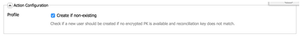

# Creación de asignaciones de formularios personalizados{#creating-custom-form-mappings}

Cuando cree una tabla personalizada en Adobe Campaign, puede que desee crear un formulario en AEM que se asigne a esa tabla personalizada.

Este documento describe cómo crear asignaciones de formulario personalizadas. Cuando complete los pasos de este documento, proporcionará a los usuarios una página de evento en la que podrán registrarse para un evento próximo. A continuación, realice un seguimiento de estos usuarios a través de Adobe Campaign.

## Requisitos previos {#prerequisites}

Debe tener instalado lo siguiente:

* Adobe Experience Manager
* Adobe Campaign Classic

Consulte [Integración de AEM con Adobe Campaign Classic](/help/sites-administering/campaignonpremise.md) para obtener más información.

## Creación de asignaciones de formularios personalizados {#creating-custom-form-mappings-2}

Para crear asignaciones de formulario personalizadas, debe seguir estos pasos de alto nivel, que se describen detalladamente en las siguientes secciones:

1. Cree una tabla personalizada.
1. Amplíe el **seed** tabla.
1. Cree una asignación personalizada.
1. Cree un envío basado en la asignación personalizada.
1. Cree el formulario en AEM, que utilizará la entrega creada.
1. Envíe el formulario para probarlo.

### Creación de la tabla personalizada en Adobe Campaign {#creating-the-custom-table-in-adobe-campaign}

Comience creando una tabla personalizada en Adobe Campaign. En este ejemplo, se utiliza la siguiente definición para crear una tabla de eventos:

```xml
<element autopk="true" label="Event" labelSingular="Event" name="event">
 <attribute label="Event Date" name="eventdate" type="date"/>
 <attribute label="Event Name" name="eventname" type="string"/>
 <attribute label="Email" name="email" type="string"/>
 <attribute label="Number of Seats" name="seats" type="long"/>
</element>
```

Después de crear la tabla de eventos, ejecute el **Actualizar asistente de estructura de base de datos** para crear la tabla.

### Ampliación de la tabla semilla {#extending-the-seed-table}

En Adobe Campaign, toque o haga clic en **Agregar** para crear una nueva extensión de **Direcciones semilla (nms)** tabla.


Ahora, utilice los campos de la **evento** para ampliar el **seed** tabla:

```xml
<element label="Event" name="custom_cus_event">
 <attribute name="eventname" template="cus:event:event/@eventname"/>
 <attribute name="eventdate" template="cus:event:event/@eventdate"/>
 <attribute name="email" template="cus:event:event/@email"/>
 <attribute name="seats" template="cus:event:event/@seats"/>
 </element>
```

Después de esto, ejecute **Actualizar asistente de base de datos** para aplicar los cambios.

### Creación de una asignación de destino personalizada {#creating-custom-target-mapping}

En **Administración/Administración de campañas** t, vaya a **Asignaciones de Target** y añada una nueva T **Asignación de objetivos.**

>[!NOTE]
>
>Asegúrese de utilizar un nombre significativo para **Nombre interno**.


### Creación de una plantilla de envíos personalizada {#creating-a-custom-delivery-template}

En este paso, está agregando una plantilla de envío que utiliza el **Asignación de destino**.

En **Recursos/Plantillas**, vaya a la plantilla Entrega y duplique la entrega de AEM existente. Al hacer clic en **Hasta**, seleccione el evento crear **Asignación de destino**.


### Creación del formulario en AEM {#building-the-form-in-aem}

En AEM, asegúrese de haber configurado un Cloud Service en **Propiedades de página**.

A continuación, en la variable **Adobe Campaign** , seleccione la entrega creada en [Creación de una plantilla de envíos personalizada](#creating-a-custom-delivery-template).


Al configurar los campos, asegúrese de especificar nombres de elemento únicos para los campos de formulario.

Una vez configurados los campos, debe cambiar manualmente la asignación.

En CRXDE-lite, vaya a la **jcr:content** (de la página) y cambie el **acMapping** al nombre interno del **Asignación de destino**.


En la configuración del formulario, asegúrese de marcar la casilla de verificación para crear si no existe



### Envío del formulario {#submitting-the-form}

Ahora puede enviar el formulario y validar en Adobe Campaign si los valores se guardan.


## Solución de problemas {#troubleshooting}

**&quot;Tipo no válido para el valor &#39;02/02/2015&#39; del elemento &#39;@eventdate&#39; (documento de tipo &#39;Event ([adb:event])&#39;)&quot;**

Al enviar el formulario, este error se registra en la **error.log** en AEM.

Esto se debe a que el formato del campo de fecha no es válido. La solución es suministrar **aaaa-mm-dd** como valor.
