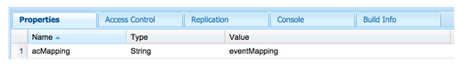
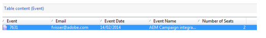

# Creación de asignaciones de formularios personalizados{#creating-custom-form-mappings}

Al crear una tabla personalizada en Adobe Campaign, es posible que desee crear un formulario en AEM que se asigne a esa tabla personalizada.

En este documento se describe cómo crear asignaciones de formulario personalizadas. Cuando complete los pasos de este documento, proporcionará a los usuarios una página de evento en la que podrán registrarse para un próximo evento. A continuación, realice el seguimiento con estos usuarios a través de Adobe Campaign.

## Requisitos previos {#prerequisites}

Debe tener instalado lo siguiente:

* Adobe Experience Manager
* Adobe Campaign Classic

Consulte [Integración de AEM con Adobe Campaign Classic](/help/sites-administering/campaignonpremise.md) para obtener más información.

## Creación de asignaciones de formularios personalizados {#creating-custom-form-mappings-2}

Para crear asignaciones de formularios personalizadas, debe seguir estos pasos de alto nivel, que se describen en detalle en las siguientes secciones:

1. Cree una tabla personalizada.
1. Extienda la tabla **semilla**.
1. Cree una asignación personalizada.
1. Cree un envío basado en la asignación personalizada.
1. Cree el formulario en AEM, que utilizará el envío creado.
1. Envíe el formulario para probarlo.

### Creación de la tabla personalizada en Adobe Campaign {#creating-the-custom-table-in-adobe-campaign}

Inicio creando una tabla personalizada en Adobe Campaign. En este ejemplo, utilizamos la siguiente definición para crear una tabla de evento:

```xml
<element autopk="true" label="Event" labelSingular="Event" name="event">
 <attribute label="Event Date" name="eventdate" type="date"/>
 <attribute label="Event Name" name="eventname" type="string"/>
 <attribute label="Email" name="email" type="string"/>
 <attribute label="Number of Seats" name="seats" type="long"/>
</element>
```

Después de crear la tabla de evento, ejecute el **Asistente para actualizar la estructura de la base de datos** para crear la tabla.

### Ampliación de la tabla de raíz {#extending-the-seed-table}

En Adobe Campaign, toque o haga clic **Añadir** para crear una nueva extensión de la tabla **Direcciones semilla (nms)**.


Ahora, utilice los campos de la tabla **evento** para extender la tabla **raíz**:

```xml
<element label="Event" name="custom_cus_event">
 <attribute name="eventname" template="cus:event:event/@eventname"/>
 <attribute name="eventdate" template="cus:event:event/@eventdate"/>
 <attribute name="email" template="cus:event:event/@email"/>
 <attribute name="seats" template="cus:event:event/@seats"/>
 </element>
```

Después de esto, ejecute **Actualizar asistente de base de datos** para aplicar los cambios.

### Creación de Asignación de destino personalizada {#creating-custom-target-mapping}

En **Administración/Administración de Campañas** t, vaya a **Asignaciones de destino** y agregue una nueva asignación de objetivos T **.**

>[!NOTE]
>
>Asegúrese de utilizar un nombre significativo para **Nombre interno**.


### Creación de una Plantilla de envíos personalizada {#creating-a-custom-delivery-template}

En este paso, está agregando una Plantilla de envíos que utiliza la **Asignación de destino** creada.

En **Resources/Templates**, vaya a la Plantilla de envíos y duplicado del envío de AEM existente. Al hacer clic en **Para**, seleccione el evento de creación **Asignación de destino**.


### Generación del formulario en AEM {#building-the-form-in-aem}

En AEM, asegúrese de haber configurado un Cloud Service en **Propiedades de página**.

A continuación, en la ficha **Adobe Campaign**, seleccione el envío que se creó en [Creación de una Plantilla de envíos personalizada](#creating-a-custom-delivery-template).


Al configurar los campos, asegúrese de especificar nombres de elementos únicos para los campos de formulario.

Una vez configurados los campos, debe cambiar manualmente la asignación.

En CRXDE-lite, vaya el nodo **jcr:content** (de la página) y cambie el valor **acMapping** por el nombre interno de la **Asignación de destino**.



En la configuración del formulario, asegúrese de marcar la casilla de verificación para crear si no existe


### Envío del formulario {#submitting-the-form}

Ahora puede enviar el formulario y validar en el lado de Adobe Campaign si se guardan los valores.



## Solución de problemas {#troubleshooting}

**&quot;Tipo no válido para el valor &#39;02/02/2015&#39; del elemento &#39;@eventdate&#39; (documento de tipo &#39;Evento ([adb:evento])&#39;)&quot;**

Al enviar el formulario, este error se registra en el archivo **error.log** de AEM.

Esto se debe a que el formato del campo de fecha no es válido. La solución consiste en proporcionar **aaaa-mm-dd** como valor.

