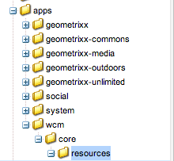

# Ampliación del Administrador de varios sitios{#extending-the-multi-site-manager}

Esta página le ayuda a ampliar las funcionalidades del Administrador de múltiples sitios:

* Obtenga información sobre los principales miembros de la API Java de MSM.
* Cree una nueva acción de sincronización que pueda utilizarse en una configuración de implementación.
* Modifique el idioma y los códigos de país predeterminados.

<!-- * Remove the "Chapters" step in the Create Site wizard. -->

>[!NOTE]
>
>Esta página debe leerse junto con [Reutilización del contenido: Administrador de múltiples sitios](/help/sites-administering/msm.md).
>
>Las siguientes secciones de la reestructuración del repositorio de sitios de la AEM 6.4 también pueden ser de interés:
>* [Configuraciones del modelo del administrador de varios sitios](https://docs.adobe.com/content/help/en/experience-manager-64/deploying/restructuring/sites-repository-restructuring-in-aem-6-4.html#multi-site-manager-blueprint-configurations)
>* [Configuraciones de implementación de múltiples sitios del Administrador](https://docs.adobe.com/content/help/en/experience-manager-64/deploying/restructuring/sites-repository-restructuring-in-aem-6-4.html#multi-site-manager-rollout-configurations)


>[!CAUTION]
>
>El Administrador de varios sitios y su API se utilizan al crear un sitio web, por lo que solo están pensados para utilizarse en un entorno de creación.

## Visión general de la API de Java {#overview-of-the-java-api}

La Administración de varios sitios consiste en los siguientes paquetes:

* [com.day.cq.wcm.msm.api](https://helpx.adobe.com/experience-manager/6-5/sites/developing/using/reference-materials/javadoc/com/day/cq/wcm/msm/api/package-frame.html)
* [com.day.cq.wcm.msm.commons](https://helpx.adobe.com/experience-manager/6-5/sites/developing/using/reference-materials/javadoc/com/day/cq/wcm/msm/commons/package-frame.html)

Los objetos principales de la API de MSM interactúan de la siguiente manera (consulte también [Términos utilizados](/help/sites-administering/msm.md#terms-used)):


* **`Blueprint`**

   Un `Blueprint` (como en [configuración de modelo](/help/sites-administering/msm.md#source-blueprints-and-blueprint-configurations)) especifica las páginas desde las cuales una Live Copy puede heredar contenido.

   

   * El uso de una configuración de modelo ( `Blueprint`) es opcional, pero:

      * Permite que el autor utilice la opción **Desplegar** en el origen (para insertar (explícitamente) modificaciones en las Live Copies que heredan de este origen).
      * Permite al autor utilizar **Crear sitio**; esto permite al usuario seleccionar idiomas fácilmente y configurar la estructura de la Live Copy.
      * Define la configuración de implementación predeterminada para cualquier copia en vivo resultante.

* **`LiveRelationship`** El  `LiveRelationship` especifica la conexión (relación) entre un recurso de la rama Live Copy y su recurso de origen/modelo equivalente.

   * Las relaciones se utilizan al realizar la herencia y la implementación.
   * `LiveRelationship` los objetos proporcionan acceso (referencias) a las configuraciones de despliegue (  `RolloutConfig`)  `LiveCopy` y a  `LiveStatus` los objetos relacionados con la relación.

   * Por ejemplo, se crea una Live Copy en `/content/copy/us` desde el origen/modelo en `/content/we-retail/language-masters`. Los recursos `/content/we.retail/language-masters/en/jcr:content` y `/content/copy/us/en/jcr:content` forman una relación.

* **`LiveCopy`** `LiveCopy` contiene los detalles de configuración de las relaciones (  `LiveRelationship`) entre los recursos de Live Copy y sus recursos de origen/modelo.

   * Utilice la clase `LiveCopy` para acceder a la ruta de la página, la ruta de la página de origen/modelo, las configuraciones de implementación y si las páginas secundarias también se incluyen en `LiveCopy`.

   * Se crea un nodo `LiveCopy` cada vez que se utiliza **Crear sitio** o **Crear Live Copy**.

* **`LiveStatus`**

   `LiveStatus` los objetos proporcionan acceso al estado de tiempo de ejecución de un  `LiveRelationship`. Se utiliza para consulta del estado de sincronización de una Live Copy.

* **`LiveAction`**

   Una `LiveAction` es una acción que se ejecuta en cada recurso que participa en la implementación.

   * LiveActions solo son generadas por RolloutConfigs.

* **`LiveActionFactory`**

   Crea `LiveAction` objetos a los que se les ha dado una configuración `LiveAction`. Las configuraciones se almacenan como recursos en el repositorio.

* **`RolloutConfig`** El  `RolloutConfig` contiene una lista de  `LiveActions`, que se utilizará cuando se active. El `LiveCopy` hereda el `RolloutConfig` y el resultado está presente en el `LiveRelationship`.

   * La configuración de una Live Copy por primera vez también utiliza un RolloutConfig (que déclencheur LiveActions).

## Creación de una nueva acción de sincronización {#creating-a-new-synchronization-action}

Cree acciones de sincronización personalizadas para utilizarlas con las configuraciones de despliegue. Cree una acción de sincronización cuando las [acciones instaladas](/help/sites-administering/msm-sync.md#installed-synchronization-actions) no cumplan los requisitos específicos de la aplicación. Para ello, cree dos clases:

* Implementación de la interfaz [ `com.day.cq.wcm.msm.api.LiveAction`](https://helpx.adobe.com/experience-manager/6-5/sites/developing/using/reference-materials/javadoc/com/day/cq/wcm/msm/api/LiveAction.html) que realiza la acción.
* Un componente OSGI que implementa la interfaz [ `com.day.cq.wcm.msm.api.LiveActionFactory`](https://helpx.adobe.com/experience-manager/6-5/sites/developing/using/reference-materials/javadoc/com/day/cq/wcm/msm/api/LiveActionFactory.html) y crea instancias de la clase `LiveAction`.

El `LiveActionFactory` crea instancias de la clase `LiveAction` para una configuración determinada:

* `LiveAction` las clases incluyen los siguientes métodos:

   * `getName`:: Devuelve el nombre de la acción. El nombre se utiliza para hacer referencia a la acción, por ejemplo, en las configuraciones de despliegue.
   * `execute`:: Realiza las tareas de la acción.

* `LiveActionFactory` las clases incluyen los siguientes miembros:

   * `LIVE_ACTION_NAME`:: Campo que contiene el nombre del  `LiveAction`. Este nombre debe coincidir con el valor devuelto por el método `getName` de la clase `LiveAction`.

   * `createAction`:: Crea una instancia del  `LiveAction`. El parámetro opcional `Resource` puede utilizarse para proporcionar información de configuración.

   * `createsAction`:: Devuelve el nombre del  `LiveAction`.

### Acceso al nodo de configuración de LiveAction {#accessing-the-liveaction-configuration-node}

Utilice el nodo de configuración `LiveAction` del repositorio para almacenar información que afecta al comportamiento de tiempo de ejecución de la instancia `LiveAction`. El nodo del repositorio que almacena la configuración `LiveAction` está disponible para el objeto `LiveActionFactory` durante la ejecución. Por lo tanto, puede agregar propiedades al nodo de configuración y usarlas en la implementación `LiveActionFactory` según sea necesario.

Por ejemplo, un `LiveAction` debe almacenar el nombre del autor del modelo. Una propiedad del nodo de configuración incluye el nombre de propiedad de la página de modelo que almacena la información. En tiempo de ejecución, `LiveAction` recupera el nombre de la propiedad de la configuración y, a continuación, obtiene el valor de la propiedad.

El parámetro del método ` [LiveActionFactory](https://helpx.adobe.com/experience-manager/6-5/sites/developing/using/reference-materials/javadoc/com/day/cq/wcm/msm/api/LiveActionFactory.html).createAction` es un objeto `Resource`. Este objeto `Resource` representa el nodo `cq:LiveSyncAction` para esta acción activa en la configuración de despliegue; consulte [Creación de una configuración de despliegue](/help/sites-administering/msm-sync.md#creating-a-rollout-configuration). Como de costumbre, al utilizar un nodo de configuración, debe adaptarlo a un objeto `ValueMap`:

```java
public LiveAction createAction(Resource resource) throws WCMException {
        ValueMap config;
        if (resource == null || resource.adaptTo(ValueMap.class) == null) {
            config = new ValueMapDecorator(Collections.<String, Object>emptyMap());
        } else {
            config = resource.adaptTo(ValueMap.class);
        }
        return new MyLiveAction(config, this);
}
```

### Acceso a nodos de Destinatario, nodos de origen y LiveRelationship {#accessing-target-nodes-source-nodes-and-the-liverelationship}

Los siguientes objetos se proporcionan como parámetros del método `execute` del objeto `LiveAction`:

* Un objeto [ `Resource`](https://helpx.adobe.com/experience-manager/6-5/sites/developing/using/reference-materials/javadoc/org/apache/sling/api/resource/Resource.html) que representa el origen de Live Copy.
* Un objeto `Resource` que representa el destinatario de Live Copy.
* El objeto [ `LiveRelationship`](https://helpx.adobe.com/experience-manager/6-5/sites/developing/using/reference-materials/javadoc/com/day/cq/wcm/msm/api/LiveRelationship.html) para la Live Copy.
* El valor `autoSave` indica si su `LiveAction` debe guardar los cambios realizados en el repositorio.

* El valor reset indica el modo de restablecimiento de la implementación.

Desde estos objetos puede obtener toda la información sobre `LiveCopy`. También puede utilizar los objetos `Resource` para obtener objetos `ResourceResolver`, `Session` y `Node`. Estos objetos son útiles para manipular el contenido del repositorio:

En la primera línea del código siguiente, el origen es el objeto `Resource` de la página de origen:

```java
ResourceResolver resolver = source.getResourceResolver();
Session session = resolver.adaptTo(javax.jcr.Session.class);
Node sourcenode = source.adaptTo(javax.jcr.Node.class);
```

>[!NOTE]
>
>Los argumentos `Resource` pueden ser objetos `null` o `Resources` que no se adaptan a objetos `Node`, como objetos [ `NonExistingResource`](https://helpx.adobe.com/experience-manager/6-5/sites/developing/using/reference-materials/javadoc/org/apache/sling/api/resource/NonExistingResource.html).

## Creación de una nueva configuración de despliegue {#creating-a-new-rollout-configuration}

Cree una configuración de implementación cuando las configuraciones de implementación instaladas no cumplan los requisitos de la aplicación:

* [Cree la configuración de lanzamiento](#create-the-rollout-configuration).
* [Agregue acciones de sincronización a la configuración de lanzamiento](#add-synchronization-actions-to-the-rollout-configuration).

La nueva configuración de lanzamiento estará disponible al establecer las opciones de la misma en una página de Live Copy o modelo.

>[!NOTE]
>
>Consulte también las [optimizaciones para personalizar las implementaciones](/help/sites-administering/msm-best-practices.md#customizing-rollouts).

### Crear la configuración de despliegue {#create-the-rollout-configuration}

Para crear una nueva configuración de implementación:

1. CRXDE Lite abierto; por ejemplo:
   [http://localhost:4502/crx/de](http://localhost:4502/crx/de)

1. Ir a :
   `/apps/msm/<your-project>/rolloutconfigs`

   >[!NOTE]
   >Esta es la versión personalizada de su proyecto de:
   >`/libs/msm/wcm/rolloutconfigs`
   >Debe crearse si esta es la primera configuración.

   >[!NOTE]
   >
   >No debe cambiar nada en la ruta /libs.
   >Esto se debe a que el contenido de /libs se sobrescribe la próxima vez que actualice la instancia (y es posible que se sobrescriba al aplicar una revisión o un paquete de funciones).
   >El método recomendado para la configuración y otros cambios es:
   >* Volver a crear el elemento requerido (es decir, tal como existe en /libs) en /apps
   >* Realizar cambios en /apps


1. Bajo este **Crear** nodo con las siguientes propiedades:

   * **Nombre**: El nombre del nodo de la configuración de despliegue. md#installing-sync-actions), por ejemplo `contentCopy` o `workflow`.
   * **Tipo**: `cq:RolloutConfig`

1. Añada las siguientes propiedades a este nodo:
   * **Nombre**: `jcr:title`

      **Tipo**: `String`
      **Valor**: Un título de identificación que aparecerá en la interfaz de usuario.
   * **Nombre**: `jcr:description`

      **Tipo**: `String`
      **Valor**: Una descripción opcional.
   * **Nombre**: `cq:trigger`

      **Tipo**: `String`
      **Valor**: Se utilizará el  [activador de ](/help/sites-administering/msm-sync.md#rollout-triggers) despliegue. Seleccionar de:
      * `rollout`
      * `modification`
      * `publish`
      * `deactivate`

1. Haga clic en **Guardar todo**.

### Añadir acciones de sincronización en la configuración de despliegue {#add-synchronization-actions-to-the-rollout-configuration}

Las configuraciones de despliegue se almacenan debajo del [nodo de configuración de implementación](#create-the-rollout-configuration) que ha creado en el nodo `/apps/msm/<your-project>/rolloutconfigs`.

Añada nodos secundarios de tipo `cq:LiveSyncAction` para agregar acciones de sincronización a la configuración de implementación. El orden de los nodos de acción de sincronización determina el orden en que se producen las acciones.

1. Todavía en CRXDE Lite, seleccione su nodo [Configuración de despliegue](#create-the-rollout-configuration).

   Por ejemplo:
   `/apps/msm/myproject/rolloutconfigs/myrolloutconfig`

1. **** Cree un nodo con las siguientes propiedades de nodo:

   * **Nombre**: El nombre del nodo de la acción de sincronización.
El nombre debe ser el mismo que **Nombre de la acción** en la tabla en [Acciones de sincronización](/help/sites-administering/msm-sync.md#installed-synchronization-actions), por ejemplo `contentCopy` o `workflow`.
   * **Tipo**: `cq:LiveSyncAction`

1. Añada y configure tantos nodos de acción de sincronización como necesite. Reorganice los nodos de acción para que su orden coincida con el orden en que desea que se produzcan. El nodo de acción superior se produce primero.

## Creación y uso de una clase LiveActionFactory simple {#creating-and-using-a-simple-liveactionfactory-class}

Siga los procedimientos de esta sección para desarrollar un `LiveActionFactory` y utilizarlo en una configuración de implementación. Los procedimientos utilizan Maven y Eclipse para desarrollar e implementar el `LiveActionFactory`:

1. [Cree el ](#create-the-maven-project) proyecto aleatorio e impórtelo en Eclipse.
1. [Añada ](#add-dependencies-to-the-pom-file) las dependencias en el archivo POM.
1. [Implemente la  `LiveActionFactory` ](#implement-liveactionfactory) interfaz e implemente el paquete OSGi.
1. [Cree la configuración de lanzamiento](#create-the-example-rollout-configuration).
1. [Cree la Live Copy](#create-the-live-copy).

El proyecto Maven y el código fuente de la clase Java están disponibles en el repositorio Git público.

CÓDIGO DE GITHUB

Puede encontrar el código de esta página en GitHub

* [Abrir el proyecto ExperienceManager-java-msmrollout en GitHub](https://github.com/Adobe-Marketing-Cloud/experiencemanager-java-msmrollout)
* Descargue el proyecto como [un archivo ZIP](https://github.com/Adobe-Marketing-Cloud/experiencemanager-java-msmrollout/archive/master.zip)

### Crear el proyecto Maven {#create-the-maven-project}

El siguiente procedimiento requiere que haya agregado el perfil adobe-public al archivo de configuración Maven.

* Para obtener información sobre el perfil adobe-public, consulte [Obtención del complemento Maven del paquete de contenido](/help/sites-developing/vlt-mavenplugin.md#obtaining-the-content-package-maven-plugin)
* Para obtener más información sobre el archivo de configuración Maven, consulte Maven [Settings Reference](https://maven.apache.org/settings.html).

1. Abra una sesión de terminal o de línea de comandos y cambie el directorio para que señale la ubicación de dónde desea crear el proyecto.
1. Introduzca el siguiente comando:

   ```xml
   mvn archetype:generate -DarchetypeGroupId=com.day.jcr.vault -DarchetypeArtifactId=multimodule-content-package-archetype -DarchetypeVersion=1.0.0 -DarchetypeRepository=adobe-public-releases
   ```

1. Especifique los siguientes valores en el mensaje interactivo:

   * `groupId`: `com.adobe.example.msm`
   * `artifactId`::  `MyLiveActionFactory`
   * `version`::  `1.0-SNAPSHOT`
   * `package`::  `MyPackage`
   * `appsFolderName`::  `myapp`
   * `artifactName`::  `MyLiveActionFactory package`
   * `packageGroup`::  `myPackages`

1. Eclipse de inicio e [importe el proyecto Maven](/help/sites-developing/howto-projects-eclipse.md#import-the-maven-project-into-eclipse).

### Añadir dependencias al archivo POM {#add-dependencies-to-the-pom-file}

Añada dependencias para que el compilador Eclipse pueda hacer referencia a las clases que se utilizan en el código `LiveActionFactory`.

1. En el Explorador de proyectos de Eclipse, abra el archivo:

   `MyLiveActionFactory/pom.xml`

1. En el editor, haga clic en la ficha `pom.xml` y busque la sección `project/dependencyManagement/dependencies`.
1. Añada el siguiente XML dentro del elemento `dependencyManagement` y guarde el archivo.

   ```xml
    <dependency>
     <groupId>com.day.cq.wcm</groupId>
     <artifactId>cq-msm-api</artifactId>
     <version>5.6.2</version>
     <scope>provided</scope>
    </dependency>
    <dependency>
     <groupId>org.apache.sling</groupId>
     <artifactId>org.apache.sling.api</artifactId>
     <version>2.4.3-R1488084</version>
     <scope>provided</scope>
    </dependency>
    <dependency>
     <groupId>com.day.cq.wcm</groupId>
     <artifactId>cq-wcm-api</artifactId>
     <version>5.6.6</version>
     <scope>provided</scope>
    </dependency>
    <dependency>
     <groupId>org.apache.sling</groupId>
     <artifactId>org.apache.sling.commons.json</artifactId>
     <version>2.0.6</version>
     <scope>provided</scope>
    </dependency>
    <dependency>
     <groupId>com.day.cq</groupId>
     <artifactId>cq-commons</artifactId>
     <version>5.6.4</version>
     <scope>provided</scope>
    </dependency>
    <dependency>
     <groupId>org.apache.sling</groupId>
     <artifactId>org.apache.sling.jcr.jcr-wrapper</artifactId>
     <version>2.0.0</version>
     <scope>provided</scope>
    </dependency>
    <dependency>
     <groupId>com.day.cq</groupId>
     <artifactId>cq-commons</artifactId>
     <version>5.6.4</version>
     <scope>provided</scope>
    </dependency>
   ```

1. Abra el archivo POM para el paquete desde **Explorador de proyectos** en `MyLiveActionFactory-bundle/pom.xml`.
1. En el editor, haga clic en la ficha `pom.xml` y localice la sección proyecto/dependencias. Añada el siguiente XML dentro del elemento dependencias y, a continuación, guarde el archivo:

   ```xml
    <dependency>
     <groupId>com.day.cq.wcm</groupId>
     <artifactId>cq-msm-api</artifactId>
    </dependency>
    <dependency>
     <groupId>org.apache.sling</groupId>
     <artifactId>org.apache.sling.api</artifactId>
    </dependency>
    <dependency>
     <groupId>com.day.cq.wcm</groupId>
     <artifactId>cq-wcm-api</artifactId>
    </dependency>
    <dependency>
     <groupId>org.apache.sling</groupId>
     <artifactId>org.apache.sling.commons.json</artifactId>
    </dependency>
    <dependency>
     <groupId>com.day.cq</groupId>
     <artifactId>cq-commons</artifactId>
    </dependency>
    <dependency>
     <groupId>org.apache.sling</groupId>
     <artifactId>org.apache.sling.jcr.jcr-wrapper</artifactId>
    </dependency>
    <dependency>
     <groupId>com.day.cq</groupId>
     <artifactId>cq-commons</artifactId>
    </dependency>
   ```

### Implementar LiveActionFactory {#implement-liveactionfactory}

La siguiente clase `LiveActionFactory` implementa un `LiveAction` que registra mensajes sobre las páginas de origen y destinatario y copia la propiedad `cq:lastModifiedBy` desde el nodo de origen al nodo de destinatario. El nombre de la acción activa es `exampleLiveAction`.

1. En el Explorador de proyectos de Eclipse, haga clic con el botón derecho en el paquete `MyLiveActionFactory-bundle/src/main/java/com.adobe.example.msm` y haga clic en **Nuevo** > **Clase**. Para el **Nombre**, introduzca `ExampleLiveActionFactory` y haga clic en **Finalizar**.
1. Abra el archivo `ExampleLiveActionFactory.java`, reemplace el contenido por el siguiente código y guarde el archivo.

   ```java
   package com.adobe.example.msm;
   
   import java.util.Collections;
   
   import org.apache.felix.scr.annotations.Component;
   import org.apache.felix.scr.annotations.Property;
   import org.apache.felix.scr.annotations.Service;
   import org.apache.sling.api.resource.Resource;
   import org.apache.sling.api.resource.ResourceResolver;
   import org.apache.sling.api.resource.ValueMap;
   import org.apache.sling.api.wrappers.ValueMapDecorator;
   import org.apache.sling.commons.json.io.JSONWriter;
   import org.apache.sling.commons.json.JSONException;
   
   import org.slf4j.Logger;
   import org.slf4j.LoggerFactory;
   
   import javax.jcr.Node;
   import javax.jcr.RepositoryException;
   import javax.jcr.Session;
   
   import com.day.cq.wcm.msm.api.ActionConfig;
   import com.day.cq.wcm.msm.api.LiveAction;
   import com.day.cq.wcm.msm.api.LiveActionFactory;
   import com.day.cq.wcm.msm.api.LiveRelationship;
   import com.day.cq.wcm.api.WCMException;
   
   @Component(metatype = false)
   @Service
   public class ExampleLiveActionFactory implements LiveActionFactory<LiveAction> {
    @Property(value="exampleLiveAction")
    static final String actionname = LiveActionFactory.LIVE_ACTION_NAME;
   
    public LiveAction createAction(Resource config) {
     ValueMap configs;
     /* Adapt the config resource to a ValueMap */
           if (config == null || config.adaptTo(ValueMap.class) == null) {
               configs = new ValueMapDecorator(Collections.<String, Object>emptyMap());
           } else {
               configs = config.adaptTo(ValueMap.class);
           }
   
     return new ExampleLiveAction(actionname, configs);
    }
    public String createsAction() {
     return actionname;
    }
    /************* LiveAction ****************/
    private static class ExampleLiveAction implements LiveAction {
     private String name;
     private ValueMap configs;
     private static final Logger log = LoggerFactory.getLogger(ExampleLiveAction.class);
   
     public ExampleLiveAction(String nm, ValueMap config){
      name = nm;
      configs = config;
     }
   
     public void execute(Resource source, Resource target,
       LiveRelationship liverel, boolean autoSave, boolean isResetRollout)
         throws WCMException {
   
      String lastMod = null;
   
      log.info(" *** Executing ExampleLiveAction *** ");
   
      /* Determine if the LiveAction is configured to copy the cq:lastModifiedBy property */
      if ((Boolean) configs.get("repLastModBy")){
   
       /* get the source's cq:lastModifiedBy property */
       if (source != null && source.adaptTo(Node.class) !=  null){
        ValueMap sourcevm = source.adaptTo(ValueMap.class);
        lastMod = sourcevm.get(com.day.cq.wcm.msm.api.MSMNameConstants.PN_PAGE_LAST_MOD_BY, String.class);
       }
   
       /* set the target node's la-lastModifiedBy property */
       Session session = null;
       if (target != null && target.adaptTo(Node.class) !=  null){
        ResourceResolver resolver = target.getResourceResolver();
        session = resolver.adaptTo(javax.jcr.Session.class);
        Node targetNode;
        try{
         targetNode=target.adaptTo(javax.jcr.Node.class);
         targetNode.setProperty("la-lastModifiedBy", lastMod);
         log.info(" *** Target node lastModifiedBy property updated: {} ***",lastMod);
        }catch(Exception e){
         log.error(e.getMessage());
        }
       }
       if(autoSave){
        try {
         session.save();
        } catch (Exception e) {
         try {
          session.refresh(true);
         } catch (RepositoryException e1) {
          e1.printStackTrace();
         }
         e.printStackTrace();
        }
       }
      }
     }
     public String getName() {
      return name;
     }
   
     /************* Deprecated *************/
     @Deprecated
     public void execute(ResourceResolver arg0, LiveRelationship arg1,
       ActionConfig arg2, boolean arg3) throws WCMException {
     }
     @Deprecated
     public void execute(ResourceResolver arg0, LiveRelationship arg1,
       ActionConfig arg2, boolean arg3, boolean arg4)
         throws WCMException {
     }
     @Deprecated
     public String getParameterName() {
      return null;
     }
     @Deprecated
     public String[] getPropertiesNames() {
      return null;
     }
     @Deprecated
     public int getRank() {
      return 0;
     }
     @Deprecated
     public String getTitle() {
      return null;
     }
     @Deprecated
     public void write(JSONWriter arg0) throws JSONException {
     }
    }
   }
   ```

1. Mediante la sesión de terminal o comando, cambie el directorio al directorio `MyLiveActionFactory` (el directorio del proyecto Maven). A continuación, introduzca el siguiente comando:

   ```shell
   mvn -PautoInstallPackage clean install
   ```

   El archivo AEM `error.log` debe indicar que se ha iniciado el paquete.

   Por ejemplo, [https://localhost:4502/system/console/status-slinglogs](https://localhost:4502/system/console/status-slinglogs).

   ```xml
   13.08.2013 14:34:55.450 *INFO* [OsgiInstallerImpl] com.adobe.example.msm.MyLiveActionFactory-bundle BundleEvent RESOLVED
   13.08.2013 14:34:55.451 *INFO* [OsgiInstallerImpl] com.adobe.example.msm.MyLiveActionFactory-bundle BundleEvent STARTING
   13.08.2013 14:34:55.451 *INFO* [OsgiInstallerImpl] com.adobe.example.msm.MyLiveActionFactory-bundle BundleEvent STARTED
   13.08.2013 14:34:55.453 *INFO* [OsgiInstallerImpl] com.adobe.example.msm.MyLiveActionFactory-bundle Service [com.adobe.example.msm.ExampleLiveActionFactory,2188] ServiceEvent REGISTERED
   13.08.2013 14:34:55.454 *INFO* [OsgiInstallerImpl] org.apache.sling.audit.osgi.installer Started bundle com.adobe.example.msm.MyLiveActionFactory-bundle [316]
   ```

### Crear la configuración de despliegue de ejemplo {#create-the-example-rollout-configuration}

Cree la configuración de implementación MSM que utiliza el `LiveActionFactory` que ha creado:

1. Cree y configure una [Configuración de despliegue con el procedimiento estándar](/help/sites-administering/msm-sync.md#creating-a-rollout-configuration) y con las propiedades:

   * **Título**: Ejemplo de configuración de despliegue
   * **Nombre**: examplerolloutconfig
   * **cq:déclencheur**:  `publish`

### Añadir la acción en directo a la configuración de despliegue de ejemplo {#add-the-live-action-to-the-example-rollout-configuration}

Configure la configuración de implementación que creó en el procedimiento anterior para que utilice la clase `ExampleLiveActionFactory`.

1. CRXDE Lite abierto; por ejemplo, [https://localhost:4502/crx/de](https://localhost:4502/crx/de).
1. Cree el nodo siguiente en `/apps/msm/rolloutconfigs/examplerolloutconfig/jcr:content`:

   * **Nombre**: `exampleLiveAction`
   * **Tipo**: `cq:LiveSyncAction`

1. Haga clic en **Guardar todo**.
1. Seleccione el nodo `exampleLiveAction` y agregue la siguiente propiedad:

   * **Nombre**: `repLastModBy`
   * **Tipo**: `Boolean`
   * **Valor**:  `true`

   Esta propiedad indica a la clase `ExampleLiveAction` que la propiedad `cq:LastModifiedBy` debe replicarse del origen al nodo destinatario.

1. Haga clic en **Guardar todo**.

### Crear Live Copy {#create-the-live-copy}

[Cree una ](/help/sites-administering/msm-livecopy.md#creating-a-live-copy-of-a-page) copia en directo de la rama de inglés/productos del sitio de referencia de We.Retail con la configuración de implementación:

* **Fuente**:  `/content/we-retail/language-masters/en/products`

* **Configuración** de despliegue: Ejemplo de configuración de despliegue

Active la página **Productos** (en inglés) de la rama de origen y observe los mensajes de registro que genera la clase `LiveAction`:

```xml
16.08.2013 10:53:33.055 *INFO* [Thread-444535] com.adobe.example.msm.ExampleLiveActionFactory$ExampleLiveAction  ***ExampleLiveAction has been executed.***
16.08.2013 10:53:33.055 *INFO* [Thread-444535] com.adobe.example.msm.ExampleLiveActionFactory$ExampleLiveAction  ***Target node lastModifiedBy property updated: admin ***
```

<!--
## Removing the Chapters Step in the Create Site Wizard {#removing-the-chapters-step-in-the-create-site-wizard}

In some cases, the **Chapters** selection is not required in the create site wizard (only the **Languages** selection is required). To remove this step in the default We.Retail English blueprint:

1. In CRX Explorer, remove the node:
   `/etc/blueprints/weretail-english/jcr:content/dialog/items/tabs/items/tab_chap`.

1. Navigate to `/libs/wcm/msm/templates/blueprint/defaults/livecopy_tab/items` and create a new node:

    1. **Name** = `chapters`; **Type** = `cq:Widget`.

1. Add following properties to the new node:

    1. **Name** = `name`; **Type** = `String`; **Value** = `msm:chapterPages`

    1. **Name** = `value`; **Type** = `String`; **Value** = `all`

    1. **Name** = `xtype`; **Type** = `String`; **Value** = `hidden`
-->

## Cambio de los nombres de idioma y los países predeterminados {#changing-language-names-and-default-countries}

AEM utiliza un conjunto predeterminado de códigos de idioma y de país.

* El código de idioma predeterminado es el código de dos letras en minúscula definido por ISO-639-1.
* El código de país predeterminado es el código de dos letras en minúsculas o en mayúsculas, tal como se define en la norma ISO 3166.

MSM utiliza una lista almacenada de códigos de idioma y de país para determinar el nombre del país asociado al nombre de la versión de idioma de la página. Si es necesario, puede cambiar los siguientes aspectos de la lista:

* Títulos de idioma
* Nombres de países
* Países predeterminados para idiomas (para códigos como `en`, `de`, entre otros)

La lista de idioma se almacena debajo del nodo `/libs/wcm/core/resources/languages`. Cada nodo secundario representa un idioma o un país de idioma:

* El nombre del nodo es el código de idioma (como `en` o `de`) o el código de idioma_país (como `en_us` o `de_ch`).

* La propiedad `language` del nodo almacena el nombre completo del idioma para el código.
* La propiedad `country` del nodo almacena el nombre completo del país para el código.
* Cuando el nombre del nodo sólo consta de un código de idioma (como `en`), la propiedad country es `*` y una propiedad `defaultCountry` adicional almacena el código del país de idioma para indicar el país que se va a utilizar.


Para modificar los idiomas:

1. Abra el CRXDE Lite en el navegador web; por ejemplo, [https://localhost:4502/crx/de](https://localhost:4502/crx/de)
1. Seleccione la carpeta `/apps` y haga clic en **Crear**, luego en **Crear carpeta.**

   Asigne un nombre a la nueva carpeta `wcm`.

1. Repita el paso anterior para crear el árbol de carpetas `/apps/wcm/core`. Cree un nodo de tipo `sling:Folder` en `core` llamado `resources`. <!--  -->

1. Haga clic con el botón derecho en el nodo `/libs/wcm/core/resources/languages` y haga clic en **Copiar**.
1. Haga clic con el botón secundario en la carpeta `/apps/wcm/core/resources` y haga clic en **Pegar**. Modifique los nodos secundarios según sea necesario.
1. Haga clic en **Guardar todo**.
1. Haga clic en **Herramientas**, **Operaciones** y luego en **Consola Web**. Desde esta consola, haga clic en **OSGi** y luego **Configuración**.
1. Busque y haga clic en **Day CQ WCM Language Manager**, cambie el valor de **Lista de idioma** a `/apps/wcm/core/resources/languages` y, a continuación, haga clic en **Guardar**.

   

## Configuración de los bloqueos de MSM en las propiedades de página (IU táctil) {#configuring-msm-locks-on-page-properties-touch-enabled-ui}

Al crear una propiedad de página personalizada, es posible que tenga que considerar si la nueva propiedad debe ser elegible para la implementación en cualquier copia en vivo.

Por ejemplo, si se agregan dos propiedades de página nuevas:

* Correo electrónico de contacto:

   * No es necesario que esta propiedad se implemente, ya que será diferente en cada país (o marca, etc).

* Estilo visual clave:

   * El requisito del proyecto es que esta propiedad se implemente como es (normalmente) común a todos los países (o marcas, etc).

Luego debe asegurarse de que:

* Correo electrónico de contacto:

   * Se excluye de las propiedades desplegadas; consulte [Exclusión de propiedades y tipos de nodos de la sincronización](/help/sites-administering/msm-sync.md#excluding-properties-and-node-types-from-synchronization).

* Estilo visual clave:

   * Asegúrese de que no tiene permiso para editar esta propiedad en la IU táctil a menos que se cancele la herencia, y de que también puede restablecer la herencia; esto se controla haciendo clic en los vínculos de cadena/cadena rota que alternan para indicar el estado de la conexión.

La propiedad dialog controla si una propiedad de página está sujeta a implementación y, por lo tanto, sujeta a cancelación o restablecimiento de herencia al editar:

* `cq-msm-lockable`

   * se aplica a los elementos de un cuadro de diálogo de IU táctil
   * creará el símbolo de vínculo de cadena en el cuadro de diálogo
   * solo permite la edición si se cancela la herencia (el vínculo de cadena está dañado)
   * solo se aplica al primer nivel secundario del recurso
   * **Tipo**: `String`

   * **Valor**: tiene el nombre del bien objeto de examen (y es comparable al valor del bien  `name`; por ejemplo, consulte
      `/libs/foundation/components/page/cq:dialog/content/items/tabs/items/basic/items/column/items/title/items/title`

Cuando se define `cq-msm-lockable`, romper/cerrar la cadena interactuará con MSM de la siguiente manera:

* si el valor de `cq-msm-lockable` es:

   * **Relativo** (por ejemplo,  `myProperty` o  `./myProperty`)

      * agregará y quitará la propiedad de `cq:propertyInheritanceCancelled`.
   * **Absoluto** (p. ej.  `/image`)

      * romper la cadena cancelará la herencia agregando la mezcla `cq:LiveSyncCancelled` a `./image` y estableciendo `cq:isCancelledForChildren` en `true`.

      * si se cierra la cadena, se revertirá la herencia.


>[!NOTE]
>
>`cq-msm-lockable` se aplica al primer nivel secundario del recurso que se va a editar y no funciona en ningún antecesor de nivel más profundo, independientemente de si el valor se define como absoluto o relativo.

>[!NOTE]
>
>Al volver a habilitar la herencia, la propiedad de la página de Live Copy no se sincroniza automáticamente con la propiedad source. Puede solicitar manualmente una sincronización si es necesario.
