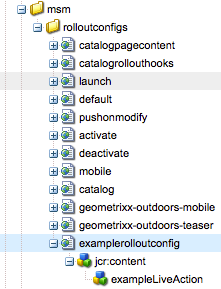

# Ampliación del Administrador de varios sitios{#extending-the-multi-site-manager}

Esta página le ayuda a ampliar las funcionalidades del Administrador de múltiples sitios:

* Obtenga información sobre los principales miembros de la API Java de MSM.
* Cree una nueva acción de sincronización que pueda utilizarse en una configuración de implementación.
* Elimine el paso &quot;Capítulos&quot; del asistente Crear sitio.
* Modifique el idioma y los códigos de país predeterminados.

>[!NOTE]
>
>Esta página debe leerse junto con [Reutilización del contenido: Administrador](/help/sites-administering/msm.md)de varios sitios.

>[!CAUTION]
>
>El Administrador de varios sitios y su API se utilizan al crear un sitio web, por lo que solo están pensados para utilizarse en un entorno de creación.

## Información general sobre la API de Java {#overview-of-the-java-api}

La Administración de varios sitios consiste en los siguientes paquetes:

* [com.day.cq.wcm.msm.api](https://helpx.adobe.com/experience-manager/6-5/sites/developing/using/reference-materials/javadoc/com/day/cq/wcm/msm/api/package-frame.html)
* [com.day.cq.wcm.msm.commons](https://helpx.adobe.com/experience-manager/6-5/sites/developing/using/reference-materials/javadoc/com/day/cq/wcm/msm/commons/package-frame.html)

Los objetos principales de la API de MSM interactúan de la siguiente manera (consulte también [Términos utilizados](/help/sites-administering/msm.md#terms-used)):


* **`Blueprint`**

   Un `Blueprint` (como en la configuración [de](/help/sites-administering/msm.md#source-blueprints-and-blueprint-configurations)modelo) especifica las páginas desde las que una Live Copy puede heredar contenido.

   

   * El uso de una configuración de modelo ( `Blueprint`) es opcional, pero:

      * Permite al autor utilizar la opción **Desplegar** en el origen (para insertar (explícitamente) modificaciones en las copias en vivo que heredan de este origen).
      * Permite al autor utilizar **Crear sitio**; esto permite al usuario seleccionar idiomas fácilmente y configurar la estructura de la Live Copy.
      * Define la configuración de implementación predeterminada para cualquier copia en vivo resultante.

* **`LiveRelationship`** El `LiveRelationship` especifica la conexión (relación) entre un recurso de la rama Live Copy y su recurso de origen/modelo equivalente.

   * Las relaciones se utilizan al realizar la herencia y la implementación.
   * `LiveRelationship` los objetos proporcionan acceso (referencias) a las configuraciones de despliegue ( `RolloutConfig`) `LiveCopy`y a los objetos `LiveStatus` relacionados con la relación.

   * Por ejemplo, se crea una Live Copy en `/content/copy/us` desde el origen/modelo en `/content/we-retail/language-masters`. Los recursos `/content/we.retail/language-masters/en/jcr:content` y `/content/copy/us/en/jcr:content` forman una relación.

* **`LiveCopy`** `LiveCopy` contiene los detalles de configuración de las relaciones ( `LiveRelationship`) entre los recursos de Live Copy y sus recursos de origen/modelo.

   * Utilice la `LiveCopy` clase para acceder a la ruta de la página, a la ruta de la página de origen/modelo, a las configuraciones de implementación y a si las páginas secundarias también se incluyen en la `LiveCopy`.

   * Se crea un `LiveCopy` nodo cada vez que se utiliza **Crear sitio** o **Crear Live Copy** .

* **`LiveStatus`**

   `LiveStatus` los objetos proporcionan acceso al estado de tiempo de ejecución de un `LiveRelationship`. Se utiliza para consultar el estado de sincronización de una Live Copy.

* **`LiveAction`**

   Una `LiveAction` es una acción que se ejecuta en cada recurso que participa en la implementación.

   * LiveActions solo son generadas por RolloutConfigs.

* **`LiveActionFactory`**

   Crea `LiveAction` objetos con una `LiveAction` configuración. Las configuraciones se almacenan como recursos en el repositorio.

* **`RolloutConfig`** El `RolloutConfig` contiene una lista de `LiveActions`, que se utilizará cuando se active. El `LiveCopy` hereda el `RolloutConfig` y el resultado está presente en el `LiveRelationship`.

   * La configuración de una Live Copy por primera vez también utiliza un RolloutConfig (que activa LiveActions).

### Creación de una nueva acción de sincronización {#creating-a-new-synchronization-action}

Cree acciones de sincronización personalizadas para utilizarlas con las configuraciones de despliegue. Cree una acción de sincronización cuando las acciones [](/help/sites-administering/msm-sync.md#installed-synchronization-actions) instaladas no cumplan los requisitos específicos de la aplicación. Para ello, cree dos clases:

* Implementación de la [ `com.day.cq.wcm.msm.api.LiveAction`](https://helpx.adobe.com/experience-manager/6-5/sites/developing/using/reference-materials/javadoc/com/day/cq/wcm/msm/api/LiveAction.html) interfaz que realiza la acción.
* Componente OSGI que implementa la [ interfaz `com.day.cq.wcm.msm.api.LiveActionFactory`](https://helpx.adobe.com/experience-manager/6-5/sites/developing/using/reference-materials/javadoc/com/day/cq/wcm/msm/api/LiveActionFactory.html) y crea instancias de la `LiveAction` clase.

El `LiveActionFactory` crea instancias de la `LiveAction` clase para una configuración determinada:

* `LiveAction` las clases incluyen los siguientes métodos:

   * `getName`:: Devuelve el nombre de la acción. El nombre se utiliza para hacer referencia a la acción, por ejemplo, en las configuraciones de despliegue.
   * `execute`:: Realiza las tareas de la acción.

* `LiveActionFactory` las clases incluyen los siguientes miembros:

   * `LIVE_ACTION_NAME`:: Campo que contiene el nombre del `LiveAction`. Este nombre debe coincidir con el valor devuelto por el `getName` método de la `LiveAction` clase.

   * `createAction`:: Crea una instancia del `LiveAction`. Se puede utilizar el `Resource` parámetro opcional para proporcionar información de configuración.

   * `createsAction`:: Devuelve el nombre del `LiveAction`.

### Acceso al nodo de configuración de LiveAction {#accessing-the-liveaction-configuration-node}

Utilice el nodo de configuración del repositorio `LiveAction` para almacenar información que afecte al comportamiento de tiempo de ejecución de la `LiveAction` instancia. El nodo del repositorio que almacena la `LiveAction` configuración está disponible para el `LiveActionFactory` objeto en tiempo de ejecución. Por lo tanto, puede agregar propiedades al nodo de configuración y usarlas en la implementación según `LiveActionFactory` lo necesite.

Por ejemplo, un `LiveAction` usuario debe almacenar el nombre del autor del modelo. Una propiedad del nodo de configuración incluye el nombre de propiedad de la página de modelo que almacena la información. En tiempo de ejecución, el `LiveAction` recupera el nombre de la propiedad de la configuración y, a continuación, obtiene el valor de la propiedad.

El parámetro del ` [LiveActionFactory](https://helpx.adobe.com/experience-manager/6-5/sites/developing/using/reference-materials/javadoc/com/day/cq/wcm/msm/api/LiveActionFactory.html).createAction` método es un `Resource` objeto. Este `Resource` objeto representa el `cq:LiveSyncAction` nodo de esta acción activa en la configuración de despliegue; consulte [Creación de una configuración](/help/sites-administering/msm-sync.md#creating-a-rollout-configuration)de despliegue. Como de costumbre, al utilizar un nodo de configuración, debe adaptarlo a un `ValueMap` objeto:

```java
public LiveAction createAction(Resource resource) throws WCMException {
        ValueMap config;
        if (resource == null || resource.adaptTo(ValueMap.class) == null) {
            config = new ValueMapDecorator(Collections.<String, Object>emptyMap());
        } else {
            config = resource.adaptTo(ValueMap.class);
        }
        return new MyLiveAction(config, this);
}
```

### Acceso a nodos de destino, nodos de origen y LiveRelationship {#accessing-target-nodes-source-nodes-and-the-liverelationship}

Los siguientes objetos se proporcionan como parámetros del `execute` método del `LiveAction` objeto:

* Un [ `Resource`](https://helpx.adobe.com/experience-manager/6-5/sites/developing/using/reference-materials/javadoc/org/apache/sling/api/resource/Resource.html) objeto que representa el origen de Live Copy.
* Un `Resource` objeto que representa el destino de Live Copy.
* El [ objeto `LiveRelationship`](https://helpx.adobe.com/experience-manager/6-5/sites/developing/using/reference-materials/javadoc/com/day/cq/wcm/msm/api/LiveRelationship.html) de la Live Copy.
* El `autoSave` valor indica si `LiveAction` debe guardar los cambios realizados en el repositorio.

* El valor reset indica el modo de restablecimiento de la implementación.

Desde estos objetos puede obtener toda la información sobre el `LiveCopy`. También puede utilizar los `Resource` objetos para obtener `ResourceResolver``Session`y `Node` objetos. Estos objetos son útiles para manipular el contenido del repositorio:

En la primera línea del código siguiente, source es el `Resource` objeto de la página de origen:

```java
ResourceResolver resolver = source.getResourceResolver();
Session session = resolver.adaptTo(javax.jcr.Session.class);
Node sourcenode = source.adaptTo(javax.jcr.Node.class);
```

>[!NOTE]
>
>Los `Resource` argumentos pueden ser `null` u `Resources` objetos que no se adaptan a `Node` objetos, como [ objetos `NonExistingResource`](https://helpx.adobe.com/experience-manager/6-5/sites/developing/using/reference-materials/javadoc/org/apache/sling/api/resource/NonExistingResource.html) .

### Creating a New Rollout Configuration {#creating-a-new-rollout-configuration}

Cree una configuración de implementación cuando las configuraciones de implementación instaladas no cumplan los requisitos de la aplicación:

* [Cree la configuración de lanzamiento](#create-the-rollout-configuration).
* [Agregue acciones de sincronización a la configuración de lanzamiento](#add-synchronization-actions-to-the-rollout-configuration).

La nueva configuración de lanzamiento estará disponible al establecer las opciones de la misma en una página de Live Copy o modelo.

>[!NOTE]
>
>Consulte también las [optimizaciones para personalizar las implementaciones](/help/sites-administering/msm-best-practices.md#customizing-rollouts).

#### Create the Rollout Configuration {#create-the-rollout-configuration}

1. Abra la consola **Herramientas** en la IU clásica; por ejemplo, [https://localhost:4502/miscadmin#/etc](https://localhost:4502/miscadmin#/etc)

   >[!NOTE]
   >
   >En la interfaz de usuario estándar con capacidad táctil puede desplazarse a la consola clásica Herramientas de interfaz de usuario con las entradas de carril **Herramientas**, **Operaciones** y, a continuación, **Configuración**.

1. En el árbol de carpetas, seleccione la carpeta **Herramientas**, **MSM**, Configuraciones de **despliegue** .
1. Haga clic en **Nuevo** y, a continuación, en **Nueva página** para definir las propiedades de configuración de despliegue:

   * **Título**: Título de la configuración de despliegue, como Mi configuración de despliegue
   * **Nombre**: El nombre del nodo que almacena los valores de propiedad, como myrolloutconfig
   * Seleccione Plantilla **RolloutConfig**.

1. Haga clic en **Crear**.
1. Haga doble clic en la configuración de despliegue que ha creado para abrirla y configurarla posteriormente.
1. Haga clic en **Editar**.
1. En el cuadro de diálogo Configuración **de** despliegue, seleccione el activador **[de](/help/sites-administering/msm-sync.md#rollout-triggers)**sincronización para definir la acción que provoca que se produzca la implementación.
1. Haga clic en **Aceptar** para guardar los cambios.

#### Add Synchronization Actions to the Rollout Configuration {#add-synchronization-actions-to-the-rollout-configuration}

Las configuraciones de despliegue se almacenan debajo del `/etc/msm/rolloutconfigs` nodo. Agregue nodos secundarios de tipo `cq:LiveSyncAction` para agregar acciones de sincronización a la configuración de implementación. El orden de los nodos de acción de sincronización determina el orden en que se producen las acciones.

1. Abra CRXDE Lite; por ejemplo [https://localhost:4502/crx/de](https://localhost:4502/crx/de)
1. Seleccione el `jcr:content` nodo debajo del nodo de configuración de despliegue.

   Por ejemplo, para la configuración de despliegue con la propiedad **Name** de `myrolloutconfig`, seleccione el nodo:

   `/etc/msm/rolloutconfigs/myrolloutconfig/jcr:content`

1. Haga clic en **Crear** y luego en **Crear nodo**. A continuación, configure las siguientes propiedades de nodo y haga clic en **Aceptar**:

   * **Nombre**: El nombre del nodo de la acción de sincronización. El nombre debe ser el mismo que el Nombre **de la** acción en la tabla de Acciones [de](/help/sites-administering/msm-sync.md#installed-synchronization-actions)sincronización, por ejemplo `contentCopy` o `workflow`.

   * **Tipo**: `cq:LiveSyncAction`

1. Seleccione el nodo de acción recién creado y agregue la siguiente propiedad al nodo:

   * **Nombre**: El nombre de propiedad de la acción. El nombre debe ser el mismo que el nombre **de la** propiedad en la tabla de Acciones [de](/help/sites-administering/msm-sync.md#installed-synchronization-actions)sincronización, por ejemplo `enabled`.

   * **Tipo**: Cadena

   * **Valor**: el valor de propiedad de la acción. Para valores válidos, consulte la columna **Propiedades** en Acciones [de](/help/sites-administering/msm-sync.md#installed-synchronization-actions)sincronización, por ejemplo `true`.

1. Agregue y configure tantos nodos de acción de sincronización como necesite. Reorganice los nodos de acción para que su orden coincida con el orden en que desea que se produzcan. El nodo de acción superior se produce primero.
1. Haga clic en **Guardar todo**.

### Creación y uso de una clase LiveActionFactory simple {#creating-and-using-a-simple-liveactionfactory-class}

Siga los procedimientos de esta sección para desarrollar un `LiveActionFactory` y utilizarlo en una configuración de implementación. Los procedimientos utilizan Maven y Eclipse para desarrollar e implementar el `LiveActionFactory`:

1. [Cree el proyecto](#create-the-maven-project) original e impórtelo en Eclipse.
1. [Agregue dependencias](#add-dependencies-to-the-pom-file) al archivo POM.
1. [Implemente la `LiveActionFactory` interfaz](#implement-liveactionfactory) e implemente el paquete OSGi.
1. [Cree la configuración de lanzamiento](#create-the-example-rollout-configuration).
1. [Cree la Live Copy](#create-the-live-copy).

El proyecto Maven y el código fuente de la clase Java están disponibles en el repositorio Git público.

CÓDIGO DE GITHUB

Puede encontrar el código de esta página en GitHub

* [Abrir el proyecto ExperienceManager-java-msmrollout en GitHub](https://github.com/Adobe-Marketing-Cloud/experiencemanager-java-msmrollout)
* Descargar el proyecto como [archivo ZIP](https://github.com/Adobe-Marketing-Cloud/experiencemanager-java-msmrollout/archive/master.zip)

#### Creación del proyecto Maven {#create-the-maven-project}

El siguiente procedimiento requiere que haya agregado el perfil adobe-public al archivo de configuración Maven.

* Para obtener información sobre el perfil adobe-public, consulte [Obtención del complemento Content Package Maven](/help/sites-developing/vlt-mavenplugin.md#obtaining-the-content-package-maven-plugin)
* Para obtener información sobre el archivo de configuración de Maven, consulte la Referencia [de](https://maven.apache.org/settings.html)configuración de Maven.

1. Abra una sesión de terminal o de línea de comandos y cambie el directorio para que señale la ubicación de dónde desea crear el proyecto.
1. Introduzca el siguiente comando:

   ```xml
   mvn archetype:generate -DarchetypeGroupId=com.day.jcr.vault -DarchetypeArtifactId=multimodule-content-package-archetype -DarchetypeVersion=1.0.0 -DarchetypeRepository=adobe-public-releases
   ```

1. Especifique los siguientes valores en el mensaje interactivo:

   * `groupId`: `com.adobe.example.msm`
   * `artifactId`: `MyLiveActionFactory`
   * `version`: `1.0-SNAPSHOT`
   * `package`: `MyPackage`
   * `appsFolderName`: `myapp`
   * `artifactName`: `MyLiveActionFactory package`
   * `packageGroup`: `myPackages`

1. Inicie Eclipse e [importe el proyecto](/help/sites-developing/howto-projects-eclipse.md#import-the-maven-project-into-eclipse)Maven.

#### Agregar dependencias al archivo POM {#add-dependencies-to-the-pom-file}

Agregue dependencias para que el compilador Eclipse pueda hacer referencia a las clases que se utilizan en el `LiveActionFactory` código.

1. En el Explorador de proyectos de Eclipse, abra el archivo:

   `MyLiveActionFactory/pom.xml`

1. En el editor, haga clic en la `pom.xml` ficha y busque la `project/dependencyManagement/dependencies` sección.
1. Agregue el siguiente XML dentro del `dependencyManagement` elemento y, a continuación, guarde el archivo.

   ```xml
    <dependency>
     <groupId>com.day.cq.wcm</groupId>
     <artifactId>cq-msm-api</artifactId>
     <version>5.6.2</version>
     <scope>provided</scope>
    </dependency>
    <dependency>
     <groupId>org.apache.sling</groupId>
     <artifactId>org.apache.sling.api</artifactId>
     <version>2.4.3-R1488084</version>
     <scope>provided</scope>
    </dependency>
    <dependency>
     <groupId>com.day.cq.wcm</groupId>
     <artifactId>cq-wcm-api</artifactId>
     <version>5.6.6</version>
     <scope>provided</scope>
    </dependency>
    <dependency>
     <groupId>org.apache.sling</groupId>
     <artifactId>org.apache.sling.commons.json</artifactId>
     <version>2.0.6</version>
     <scope>provided</scope>
    </dependency>
    <dependency>
     <groupId>com.day.cq</groupId>
     <artifactId>cq-commons</artifactId>
     <version>5.6.4</version>
     <scope>provided</scope>
    </dependency>
    <dependency>
     <groupId>org.apache.sling</groupId>
     <artifactId>org.apache.sling.jcr.jcr-wrapper</artifactId>
     <version>2.0.0</version>
     <scope>provided</scope>
    </dependency>
    <dependency>
     <groupId>com.day.cq</groupId>
     <artifactId>cq-commons</artifactId>
     <version>5.6.4</version>
     <scope>provided</scope>
    </dependency>
   ```

1. Abra el archivo POM del paquete desde **Project Explorer** en `MyLiveActionFactory-bundle/pom.xml`.
1. En el editor, haga clic en la ficha `pom.xml` y busque la sección de proyectos/dependencias. Agregue el siguiente XML dentro del elemento dependencias y, a continuación, guarde el archivo:

   ```xml
    <dependency>
     <groupId>com.day.cq.wcm</groupId>
     <artifactId>cq-msm-api</artifactId>
    </dependency>
    <dependency>
     <groupId>org.apache.sling</groupId>
     <artifactId>org.apache.sling.api</artifactId>
    </dependency>
    <dependency>
     <groupId>com.day.cq.wcm</groupId>
     <artifactId>cq-wcm-api</artifactId>
    </dependency>
    <dependency>
     <groupId>org.apache.sling</groupId>
     <artifactId>org.apache.sling.commons.json</artifactId>
    </dependency>
    <dependency>
     <groupId>com.day.cq</groupId>
     <artifactId>cq-commons</artifactId>
    </dependency>
    <dependency>
     <groupId>org.apache.sling</groupId>
     <artifactId>org.apache.sling.jcr.jcr-wrapper</artifactId>
    </dependency>
    <dependency>
     <groupId>com.day.cq</groupId>
     <artifactId>cq-commons</artifactId>
    </dependency>
   ```

#### Implementación de LiveActionFactory {#implement-liveactionfactory}

La siguiente `LiveActionFactory` clase implementa un `LiveAction` que registra mensajes sobre las páginas de origen y destino, y copia la `cq:lastModifiedBy` propiedad desde el nodo de origen al nodo de destino. El nombre de la acción activa es `exampleLiveAction`.

1. En el Explorador de proyectos de Eclipse, haga clic con el botón secundario en el `MyLiveActionFactory-bundle/src/main/java/com.adobe.example.msm` paquete y, a continuación, haga clic en **Nuevo** > **Clase**. Para el **Nombre**, introduzca `ExampleLiveActionFactory` y, a continuación, haga clic en **Finalizar**.
1. Abra el `ExampleLiveActionFactory.java` archivo, reemplace el contenido por el siguiente código y guarde el archivo.

   ```java
   package com.adobe.example.msm;
   
   import java.util.Collections;
   
   import org.apache.felix.scr.annotations.Component;
   import org.apache.felix.scr.annotations.Property;
   import org.apache.felix.scr.annotations.Service;
   import org.apache.sling.api.resource.Resource;
   import org.apache.sling.api.resource.ResourceResolver;
   import org.apache.sling.api.resource.ValueMap;
   import org.apache.sling.api.wrappers.ValueMapDecorator;
   import org.apache.sling.commons.json.io.JSONWriter;
   import org.apache.sling.commons.json.JSONException;
   
   import org.slf4j.Logger;
   import org.slf4j.LoggerFactory;
   
   import javax.jcr.Node;
   import javax.jcr.RepositoryException;
   import javax.jcr.Session;
   
   import com.day.cq.wcm.msm.api.ActionConfig;
   import com.day.cq.wcm.msm.api.LiveAction;
   import com.day.cq.wcm.msm.api.LiveActionFactory;
   import com.day.cq.wcm.msm.api.LiveRelationship;
   import com.day.cq.wcm.api.WCMException;
   
   @Component(metatype = false)
   @Service
   public class ExampleLiveActionFactory implements LiveActionFactory<LiveAction> {
    @Property(value="exampleLiveAction")
    static final String actionname = LiveActionFactory.LIVE_ACTION_NAME;
   
    public LiveAction createAction(Resource config) {
     ValueMap configs;
     /* Adapt the config resource to a ValueMap */
           if (config == null || config.adaptTo(ValueMap.class) == null) {
               configs = new ValueMapDecorator(Collections.<String, Object>emptyMap());
           } else {
               configs = config.adaptTo(ValueMap.class);
           }
   
     return new ExampleLiveAction(actionname, configs);
    }
    public String createsAction() {
     return actionname;
    }
    /************* LiveAction ****************/
    private static class ExampleLiveAction implements LiveAction {
     private String name;
     private ValueMap configs;
     private static final Logger log = LoggerFactory.getLogger(ExampleLiveAction.class);
   
     public ExampleLiveAction(String nm, ValueMap config){
      name = nm;
      configs = config;
     }
   
     public void execute(Resource source, Resource target,
       LiveRelationship liverel, boolean autoSave, boolean isResetRollout)
         throws WCMException {
   
      String lastMod = null;
   
      log.info(" *** Executing ExampleLiveAction *** ");
   
      /* Determine if the LiveAction is configured to copy the cq:lastModifiedBy property */
      if ((Boolean) configs.get("repLastModBy")){
   
       /* get the source's cq:lastModifiedBy property */
       if (source != null && source.adaptTo(Node.class) !=  null){
        ValueMap sourcevm = source.adaptTo(ValueMap.class);
        lastMod = sourcevm.get(com.day.cq.wcm.api.NameConstants.PN_PAGE_LAST_MOD_BY, String.class);
       }
   
       /* set the target node's la-lastModifiedBy property */
       Session session = null;
       if (target != null && target.adaptTo(Node.class) !=  null){
        ResourceResolver resolver = target.getResourceResolver();
        session = resolver.adaptTo(javax.jcr.Session.class);
        Node targetNode;
        try{
         targetNode=target.adaptTo(javax.jcr.Node.class);
         targetNode.setProperty("la-lastModifiedBy", lastMod);
         log.info(" *** Target node lastModifiedBy property updated: {} ***",lastMod);
        }catch(Exception e){
         log.error(e.getMessage());
        }
       }
       if(autoSave){
        try {
         session.save();
        } catch (Exception e) {
         try {
          session.refresh(true);
         } catch (RepositoryException e1) {
          e1.printStackTrace();
         }
         e.printStackTrace();
        }
       }
      }
     }
     public String getName() {
      return name;
     }
   
     /************* Deprecated *************/
     @Deprecated
     public void execute(ResourceResolver arg0, LiveRelationship arg1,
       ActionConfig arg2, boolean arg3) throws WCMException {
     }
     @Deprecated
     public void execute(ResourceResolver arg0, LiveRelationship arg1,
       ActionConfig arg2, boolean arg3, boolean arg4)
         throws WCMException {
     }
     @Deprecated
     public String getParameterName() {
      return null;
     }
     @Deprecated
     public String[] getPropertiesNames() {
      return null;
     }
     @Deprecated
     public int getRank() {
      return 0;
     }
     @Deprecated
     public String getTitle() {
      return null;
     }
     @Deprecated
     public void write(JSONWriter arg0) throws JSONException {
     }
    }
   }
   ```

1. Mediante la sesión de terminal o comando, cambie el directorio al `MyLiveActionFactory` directorio (el directorio del proyecto Maven). A continuación, introduzca el siguiente comando:

   ```shell
   mvn -PautoInstallPackage clean install
   ```

   El archivo `error.log` AEM debe indicar que se ha iniciado el paquete.

   Por ejemplo, [https://localhost:4502/system/console/status-slinglogs](https://localhost:4502/system/console/status-slinglogs).

   ```xml
   13.08.2013 14:34:55.450 *INFO* [OsgiInstallerImpl] com.adobe.example.msm.MyLiveActionFactory-bundle BundleEvent RESOLVED
   13.08.2013 14:34:55.451 *INFO* [OsgiInstallerImpl] com.adobe.example.msm.MyLiveActionFactory-bundle BundleEvent STARTING
   13.08.2013 14:34:55.451 *INFO* [OsgiInstallerImpl] com.adobe.example.msm.MyLiveActionFactory-bundle BundleEvent STARTED
   13.08.2013 14:34:55.453 *INFO* [OsgiInstallerImpl] com.adobe.example.msm.MyLiveActionFactory-bundle Service [com.adobe.example.msm.ExampleLiveActionFactory,2188] ServiceEvent REGISTERED
   13.08.2013 14:34:55.454 *INFO* [OsgiInstallerImpl] org.apache.sling.audit.osgi.installer Started bundle com.adobe.example.msm.MyLiveActionFactory-bundle [316]
   ```

#### Create the Example Rollout Configuration {#create-the-example-rollout-configuration}

Cree la configuración de implementación de MSM que utiliza la `LiveActionFactory` que ha creado:

1. Cree y configure una configuración de [despliegue con el procedimiento](/help/sites-administering/msm-sync.md#creating-a-rollout-configuration) estándar y con las propiedades siguientes:

   1. Crear:

      1. **Título**: Ejemplo de configuración de despliegue
      1. **Nombre**: examplerolloutconfig
      1. Uso de la plantilla **RolloutConfig**.
   1. Editar:

      1. **Activador** de sincronización: Al activar


#### Agregar la acción en directo a la configuración de despliegue de ejemplo {#add-the-live-action-to-the-example-rollout-configuration}

Configure la configuración de implementación que creó en el procedimiento anterior para que utilice la `ExampleLiveActionFactory` clase.

1. Abra CRXDE Lite; por ejemplo, [https://localhost:4502/crx/de](https://localhost:4502/crx/de).
1. Cree el nodo siguiente en `/etc/msm/rolloutconfigs/examplerolloutconfig/jcr:content`:

   * **Nombre**: `exampleLiveAction`
   * **Tipo**: `cq:LiveSyncAction`
   

1. Haga clic en **Guardar todo**.
1. Seleccione el `exampleLiveAction` nodo y agregue la siguiente propiedad:

   * **Nombre**: `repLastModBy`
   * **Tipo**: `Boolean`
   * **Valor**: `true`
   Esta propiedad indica a la `ExampleLiveAction` clase que la `cq:LastModifiedBy` propiedad debe replicarse desde el origen al nodo de destino.

1. Haga clic en **Guardar todo**.

#### Creación de Live Copy {#create-the-live-copy}

[Cree una Live Copy](/help/sites-administering/msm-livecopy.md#creating-a-live-copy-of-a-page) de la rama Inglés/Productos del sitio de referencia We.Retail con la configuración de implementación:

* **Fuente**: `/content/we-retail/language-masters/en/products`

* **Configuración** de despliegue: Ejemplo de configuración de despliegue

Active la página **Productos** (inglés) de la rama de origen y observe los mensajes de registro que la `LiveAction` clase genera:

```xml
16.08.2013 10:53:33.055 *INFO* [Thread-444535] com.adobe.example.msm.ExampleLiveActionFactory$ExampleLiveAction  ***ExampleLiveAction has been executed.***
16.08.2013 10:53:33.055 *INFO* [Thread-444535] com.adobe.example.msm.ExampleLiveActionFactory$ExampleLiveAction  ***Target node lastModifiedBy property updated: admin ***
```

### Eliminación del paso de capítulos en el Asistente para crear sitio {#removing-the-chapters-step-in-the-create-site-wizard}

En algunos casos, la selección de **Capítulos** no es obligatoria en el asistente para crear un sitio (solo se requiere la selección de **Idiomas** ). Para eliminar este paso en el modelo predeterminado de We.Retail English:

1. En el Explorador de CRX, elimine el nodo:
   `/etc/blueprints/weretail-english/jcr:content/dialog/items/tabs/items/tab_chap`.

1. Vaya a `/libs/wcm/msm/templates/blueprint/defaults/livecopy_tab/items` y cree un nuevo nodo:

   1. **Nombre** = `chapters`; **Tipo** = `cq:Widget`.

1. Agregue las siguientes propiedades al nuevo nodo:

   1. **Nombre** = `name`; **Tipo** = `String`; **Valor** = `msm:chapterPages`

   1. **Nombre** = `value`; **Tipo** = `String`; **Valor** = `all`

   1. **Nombre** = `xtype`; **Tipo** = `String`; **Valor** = `hidden`

### Cambio de los nombres de idiomas y los países predeterminados {#changing-language-names-and-default-countries}

AEM utiliza un conjunto predeterminado de códigos de idioma y de país.

* El código de idioma predeterminado es el código de dos letras en minúscula definido por ISO-639-1.
* El código de país predeterminado es el código de dos letras en minúsculas o en mayúsculas, tal como se define en la norma ISO 3166.

MSM utiliza una lista almacenada de códigos de idioma y de país para determinar el nombre del país asociado con el nombre de la versión de idioma de la página. Si es necesario, puede cambiar los siguientes aspectos de la lista:

* Títulos de idioma
* Nombres de países
* Países predeterminados para idiomas (para códigos como `en`, `de`entre otros)

La lista de idiomas se almacena debajo del `/libs/wcm/core/resources/languages` nodo. Cada nodo secundario representa un idioma o un país de idioma:

* El nombre del nodo es el código de idioma (como `en` o `de`) o el código de idioma_país (como `en_us` o `de_ch`).

* La `language` propiedad del nodo almacena el nombre completo del idioma para el código.
* La `country` propiedad del nodo almacena el nombre completo del país para el código.
* Cuando el nombre del nodo sólo consta de un código de idioma (por ejemplo, `en`), la propiedad country es `*`, y una `defaultCountry` propiedad adicional almacena el código del país de idioma para indicar el país que se va a utilizar.


Para modificar los idiomas:

1. Abra CRXDE Lite en el navegador web; por ejemplo, [https://localhost:4502/crx/de](https://localhost:4502/crx/de)
1. Seleccione la `/apps` carpeta, haga clic en **Crear** y, a continuación, en **Crear carpeta.**

   Asigne un nombre a la nueva carpeta `wcm`.

1. Repita el paso anterior para crear el árbol de `/apps/wcm/core` carpetas. Cree un nodo de tipo `sling:Folder` en `core` llamado `resources`.

   

1. Haga clic con el botón secundario en el `/libs/wcm/core/resources/languages` nodo y haga clic en **Copiar**.
1. Haga clic con el botón secundario en la `/apps/wcm/core/resources` carpeta y haga clic en **Pegar**. Modifique los nodos secundarios según sea necesario.
1. Haga clic en **Guardar todo**.
1. Haga clic en **Herramientas**, **Operaciones** y, a continuación, en Consola **** Web. Desde esta consola, haga clic en **OSGi** y, a continuación, en **Configuración**.
1. Busque y haga clic en **Day CQ WCM Language Manager**, cambie el valor de **Language List** a `/apps/wcm/core/resources/languages`y, a continuación, haga clic en **Guardar**.

   

### Configuración de los bloqueos de MSM en las propiedades de la página (IU táctil) {#configuring-msm-locks-on-page-properties-touch-enabled-ui}

Al crear una propiedad de página personalizada, es posible que tenga que considerar si la nueva propiedad debe ser elegible para la implementación en cualquier copia en vivo.

Por ejemplo, si se agregan dos propiedades de página nuevas:

* Correo electrónico de contacto:

   * No es necesario que esta propiedad se implemente, ya que será diferente en cada país (o marca, etc).

* Estilo visual clave:

   * El requisito del proyecto es que esta propiedad se implemente como es (normalmente) común a todos los países (o marcas, etc).

Luego debe asegurarse de que:

* Correo electrónico de contacto:

   * Se excluye de las propiedades desplegadas; consulte [Exclusión de propiedades y tipos de nodos de la sincronización](/help/sites-administering/msm-sync.md#excluding-properties-and-node-types-from-synchronization).

* Estilo visual clave:

   * Asegúrese de que no tiene permiso para editar esta propiedad en la IU táctil a menos que se cancele la herencia, y de que también puede restablecer la herencia; esto se controla haciendo clic en los vínculos de cadena/cadena rota que alternan para indicar el estado de la conexión.

La propiedad dialog controla si una propiedad de página está sujeta a implementación y, por lo tanto, sujeta a cancelación o restablecimiento de herencia al editar:

* `cq-msm-lockable`

   * se aplica a los elementos de un cuadro de diálogo de IU táctil
   * creará el símbolo de vínculo de cadena en el cuadro de diálogo
   * solo permite la edición si se cancela la herencia (el vínculo de cadena está dañado)
   * solo se aplica al primer nivel secundario del recurso
   * **Tipo**: `String`

   * **Valor**: tiene el nombre del bien objeto de examen (y es comparable al valor del bien `name`; por ejemplo, consulte
      `/libs/foundation/components/page/cq:dialog/content/items/tabs/items/basic/items/column/items/title/items/title`

Cuando `cq-msm-lockable` se haya definido, romper/cerrar la cadena interactuará con MSM de la siguiente manera:

* if the value of `cq-msm-lockable` is:

   * **Relativo** (por ejemplo `myProperty` o `./myProperty`)

      * agregará y quitará la propiedad de `cq:propertyInheritanceCancelled`.
   * **Absoluto** (p. ej. `/image`)

      * romper la cadena cancelará la herencia agregando la `cq:LiveSyncCancelled` mezcla a `./image` y configurando `cq:isCancelledForChildren` a `true`.

      * si se cierra la cadena, se revertirá la herencia.


>[!NOTE]
>
>`cq-msm-lockable` se aplica al primer nivel secundario del recurso que se va a editar y no funciona en ningún antecesor de nivel más profundo, independientemente de si el valor se define como absoluto o relativo.

>[!NOTE]
>
>Al volver a habilitar la herencia, la propiedad de la página de Live Copy no se sincroniza automáticamente con la propiedad source. Puede solicitar manualmente una sincronización si es necesario.
