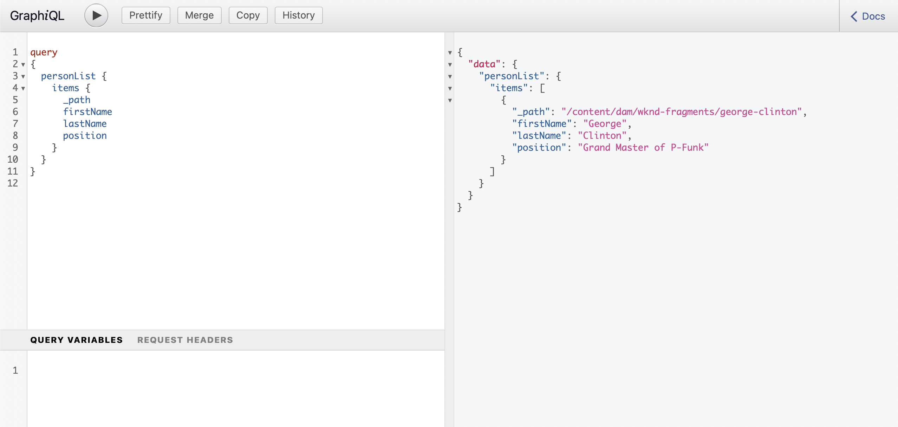

# Acceso y entrega de fragmentos de contenido Guía de inicio rápido sin encabezado {#accessing-delivering-content-fragments}

AEM Aprenda a utilizar la API de REST de Recursos de la aplicación para administrar fragmentos de contenido y la API de GraphQL para la entrega sin encabezado de contenido de fragmentos de contenido.

## ¿Qué son las API de REST de GraphQL y Assets? {#what-are-the-apis}

[Ahora que ha creado algunos fragmentos de contenido,](create-content-fragment.md) puede utilizar las API de AEM para entregarlas sin problemas.

* [La API de GraphQL](/help/assets/content-fragments/graphql-api-content-fragments.md) permite crear solicitudes para acceder a fragmentos de contenido y enviarlos.
   * Para usar esto, [los puntos de conexión deben definirse y habilitarse en AEM](/help/assets/content-fragments/graphql-api-content-fragments.md#enabling-graphql-endpoint) y, si es necesario, la [interfaz de GraphiQL debe instalarse](/help/assets/content-fragments/graphql-api-content-fragments.md#installing-graphiql-interface).
* La [API de REST de Assets](/help/assets/assets-api-content-fragments.md) permite crear y modificar fragmentos de contenido (y otros recursos).

El resto de esta guía se centrará en el acceso a GraphQL y la entrega de fragmentos de contenido.

## Cómo entregar un fragmento de contenido mediante GraphQL {#how-to-deliver-a-content-fragment}

Los arquitectos de la información deberán diseñar consultas para sus puntos de conexión de canal para poder entregar contenido. Por lo general, estas consultas solo tendrán que considerarse una vez por punto de conexión y modelo. Para los fines de esta guía de introducción solo tendremos que crear una.

1. AEM Inicie sesión en la aplicación y acceda a la [Interfaz de GraphiQL](/help/assets/content-fragments/graphiql-ide.md):
   * Por ejemplo: `http://<host>:<port>/aem/graphiql.html`.

1. El de GraphiQL es un editor de consultas en el explorador para GraphQL. Puede utilizarlo para crear consultas, recuperar fragmentos de contenido y entregarlos sin encabezado como JSON.
   * El panel izquierdo le permite crear la consulta.
   * El panel derecho muestra los resultados.
   * El editor de consultas incluye la finalización del código y teclas de función para ejecutar fácilmente la consulta.
      

1. Suponiendo que el modelo que hemos creado se llamara `person` con campos `firstName`, `lastName` y `position`, podemos generar una consulta sencilla para recuperar el contenido de nuestro fragmento de contenido.

   ```text
   query 
   {
     personList {
       items {
         _path
         firstName
         lastName
         position
       }
     }
   }
   ```

1. Introduzca la consulta en el panel izquierdo.

<!--
   
-->

1. Haga clic en **Ejecutar consulta** (flecha derecha) o utilice el icono `Ctrl-Enter` y los resultados se muestran como JSON en el panel derecho.
   

1. Hacer clic:
   * **Documentos** en la parte superior derecha de la página para mostrar la documentación en contexto que le ayudará a crear sus consultas, que se adaptan a sus propios modelos.
   * **Historial** en la barra de herramientas superior para mostrar las consultas anteriores.
   * **Guardar como** y **Guardar** para guardar las consultas, tras lo cual puede enumerarlas y recuperarlas desde el **Consultas persistentes** panel y **Publish**.
      

GraphQL permite consultas estructuradas que pueden dirigirse no solo a conjuntos de datos específicos u objetos de datos individuales, sino que también pueden proporcionar elementos específicos de los objetos, resultados anidados, compatibilidad con variables de consulta y mucho más.

GraphQL puede evitar las solicitudes de API iterativas, así como el exceso de entrega, y en su lugar permite realizar entregas masivas de exactamente lo que se necesita para procesar como respuesta a una única consulta de API. El JSON resultante se puede utilizar para entregar datos en otros sitios o aplicaciones.

## Siguientes pasos {#next-steps}

¡Eso es todo! Ahora tiene una comprensión básica de la administración de contenido sin encabezado en AEM. Por supuesto, hay muchos más recursos en los que puede profundizar para comprender las funciones disponibles.

* **[Explorador de configuración](create-configuration.md)** AEM : Para obtener más información sobre el explorador de configuración de la
* **[Fragmentos de contenido](/help/assets/content-fragments/content-fragments.md)**: para obtener más información acerca de la creación y administración de fragmentos de contenido
* **[IDE de GraphiQL](/help/assets/content-fragments/graphiql-ide.md)** para obtener más información sobre el uso del IDE de GraphiQL
* **[Consultas persistentes](/help/assets/content-fragments/persisted-queries.md)** para obtener más información sobre las consultas persistentes
* **[Compatibilidad con fragmentos de contenido en la API HTTP de AEM Assets](/help/assets/assets-api-content-fragments.md)**: para obtener más información sobre el acceso al contenido de AEM directamente a través de la API HTTP, mediante las operaciones CRUD (Crear, Leer, Actualizar, Eliminar)
* **[API de GraphQL](/help/assets/content-fragments/graphql-api-content-fragments.md)**: para obtener más información sobre cómo enviar fragmentos de contenido sin encabezado
