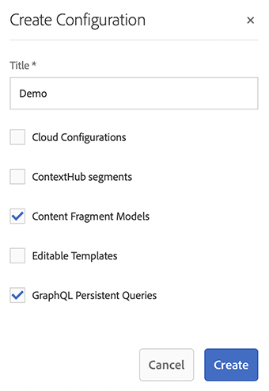

# Creación de una Guía de inicio rápido de configuración sin encabezado {#creating-configuration}

AEM Como primer paso para empezar a utilizar sin encabezado en la versión 6.5 de, debe crear una configuración de.

## ¿Qué es una configuración? {#what-is-a-configuration}

El explorador de configuración proporciona una API de configuración genérica, una estructura de contenido y un mecanismo de resolución para las configuraciones en AEM.

En el contexto de la administración de contenido sin encabezado en AEM, piense en una configuración como lugar de trabajo dentro de AEM donde puede crear los modelos de contenido, que definen la estructura de su contenido futuro y los fragmentos de contenido. Puede tener varias configuraciones para separar estos modelos.

>[!NOTE]
>
>Si está familiarizado con las [plantillas de página en una implementación de AEM e de pila completa](/help/sites-authoring/templates.md), el uso de configuraciones para la administración de modelos de contenido es similar.

## Cómo crear una configuración {#how-to-create-a-configuration}

Un administrador solo tendría que crear una configuración una vez, o poco a poco cuando se necesite un nuevo espacio de trabajo para organizar los modelos de contenido. Para los fines de esta guía de introducción, solo necesitamos crear una configuración.

1. AEM Inicie sesión en el menú principal y, a continuación, seleccione: **Herramientas > General > Explorador de configuración**.
1. Proporcione un **Título** para su configuración.
   * Se generará automáticamente un nombre basado en el título y se ajustará según lo siguiente [AEM Convenciones de nomenclatura de.](/help/sites-developing/naming-conventions.md). Se convertirá en el nombre de nodo en el repositorio.
1. Compruebe las siguientes opciones:
   * **Modelos de fragmentos de contenido**
   * **Consultas persistentes de GraphQL**

   

1. Haga clic en **Crear**

Si es necesario, puede crear varias configuraciones. Las configuraciones también se pueden anidar.

>[!NOTE]
>
>Pueden ser necesarias opciones de configuración además de los **Modelos de fragmentos de contenido** y **Consultas persistentes de GraphQL** en función de los requisitos de implementación.

## Siguientes pasos {#next-steps}

Con esta configuración, ahora puede pasar a la segunda parte de la guía de introducción y [crear modelos de fragmentos de contenido.](create-content-model.md)

<!--
>[!TIP]
>
>For complete details about the Configuration Browser, [see the Configuration Browser documentation.](/help/sites-developing/configurations.md)
-->
