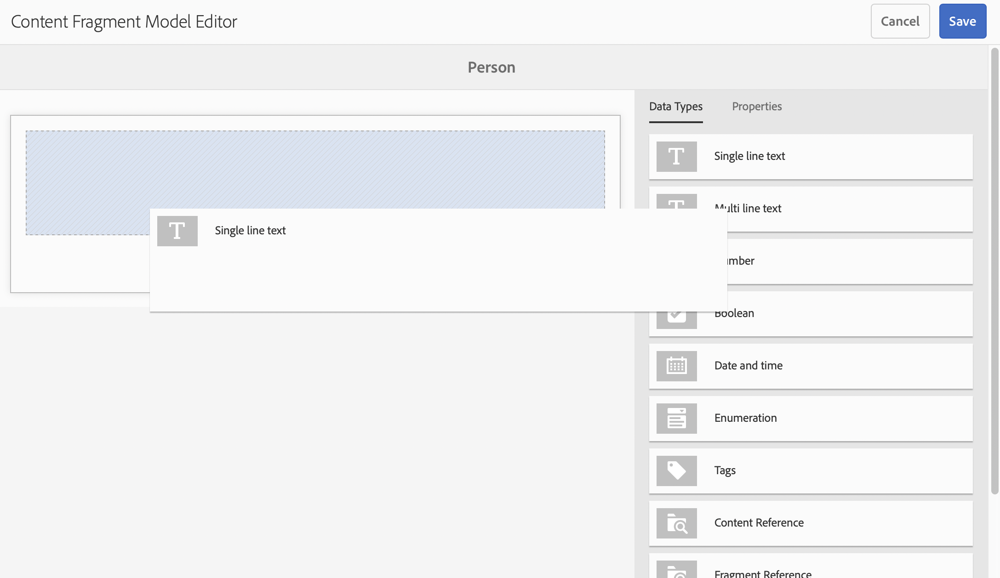

# Guía de inicio rápido Creación de modelos de fragmentos de contenido sin encabezado {#creating-content-fragment-models}

Defina la estructura del contenido que crea y sirve con las capacidades sin encabezado de Adobe Experience Manager AEM () mediante modelos de fragmentos de contenido.

## ¿Qué son los modelos de fragmentos de contenido? {#what-are-content-fragment-models}

[Ahora que ha creado una configuración,](create-configuration.md) puede utilizarla para generar modelos de fragmentos de contenido.

Los Modelos de fragmento de contenido definen la estructura de los datos y el contenido que creará y gestionará en AEM. Sirven como una especie de andamiaje para el contenido. Al elegir crear contenido, los autores elegirán entre los modelos de fragmento de contenido que defina, que los guiarán en la creación de contenido.

## Cómo crear un modelo de fragmento de contenido {#how-to-create-a-content-fragment-model}

Un arquitecto de la información realizaría estas tareas solo de forma esporádica, a medida que se necesiten nuevos modelos. Para los fines de esta guía de introducción, solo está creando un modelo.

1. AEM Inicie sesión en el menú principal y, a continuación, seleccione: **Herramientas > Recursos > Modelos de fragmentos de contenido**.
1. Haga clic en la carpeta que se creó al crear la configuración.

   
1. Haga clic en **Crear**.
1. Proporcione un **Título de modelo**, **Etiquetas**, y **Descripción**. También puede seleccionar o anular la selección de **Habilitar modelo** para controlar si el modelo se activa inmediatamente tras la creación.

   
1. En la ventana de confirmación, haga clic en **Abrir** para configurar el modelo.

   
1. Con el **Editor del modelo de fragmento de contenido**, cree su modelo de fragmento de contenido arrastrando y soltando campos de la columna **Tipos de datos**.

   

1. Una vez colocado un campo, se deben configurar sus propiedades. El editor cambia automáticamente a **Propiedades** para el campo añadido, donde puede proporcionar los campos obligatorios.

   
1. Cuando haya terminado de crear el modelo, haga clic en **Guardar**.

1. El tipo del modelo recién creado depende de si ha seleccionado **Activar modelo** al crearlo:
   * seleccionado: el nuevo modelo ya está **Habilitado**
   * No seleccionado: el nuevo modelo se crea en modo **Borrador**

1. Si aún no lo está, el modelo debe estar **Habilitado** para utilizarlo.
   1. Seleccione el modelo que ha creado y haga clic en **Activar**.

      
   1. Confirme la activación del modelo tocando o haciendo clic en **Habilitar** en el cuadro de diálogo de confirmación.

      
1. El modelo está ahora habilitado y listo para usarse.

   

El **Editor del modelo de fragmentos de contenido** admite muchos tipos de datos diferentes, como campos de texto simples, referencias de recursos, referencias a otros modelos y datos JSON.

Puede crear varios modelos. Los modelos pueden hacer referencia a otros fragmentos de contenido. Use [configuraciones](create-configuration.md) para organizar los modelos.

## Siguientes pasos {#next-steps}

Ahora que ha definido las estructuras de los fragmentos de contenido creando modelos, puede pasar a la tercera parte de la guía de introducción y [cree carpetas donde almacene los fragmentos.](create-assets-folder.md)

>[!TIP]
>
>Para obtener información detallada acerca de los modelos de fragmentos de contenido, consulte [Documentación de modelos de fragmentos de contenido](/help/assets/content-fragments/content-fragments-models.md)
