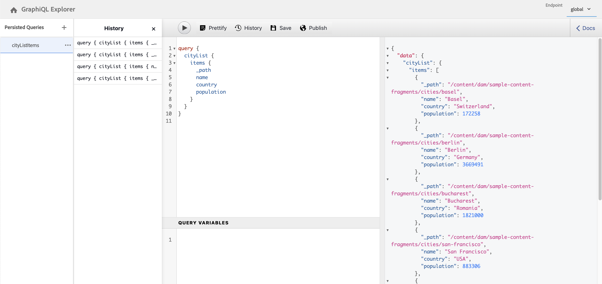

# Uso del IDE de GraphiQL {#graphiql-ide}

Hay una implementación del IDE de [GraphiQL](https://graphql.org/learn/serving-over-http/#graphiql) disponible para su uso con la API de GraphQL de Adobe Experience Manager (AEM).

>[!NOTE]
>
>GraphiQL se incluye en todos los entornos de AEM (pero solo será accesible/visible al configurar los extremos).
>
>En versiones anteriores, se necesitaba un paquete para instalar el IDE de GraphiQL. Si tiene esto instalado, ahora lo puede quitar.

>[!NOTE]
>Debe tener [configurados los puntos de conexión](/help/sites-developing/headless/graphql-api/graphql-endpoint.md) en el [explorador de configuración](/help/assets/content-fragments/content-fragments-configuration-browser.md) antes de utilizar el IDE de GraphiQL.

La herramienta **GraphiQL** permite probar y depurar las consultas de GraphQL permitiéndole lo siguiente:

* seleccionar el **punto de conexión** adecuado para la configuración de sitios que desee utilizar en sus consultas
* introducir directamente nuevas consultas
* crear y acceder a **[consultas persistentes](/help/sites-developing/headless/graphql-api/persisted-queries.md)**
* ejecutar las consultas para ver inmediatamente los resultados
* administrar **variables de consulta**
* guardar y administrar **consultas persistentes**
* publicar o cancelar la publicación de **consultas persistentes** (por ejemplo, a/de `dev-publish`)
* consultar el **historial** de las consultas anteriores
* usar el **Explorador de documentación** para acceder a la documentación; le ayuda a conocer y comprender qué métodos están disponibles.

Puede acceder al editor de consultas desde:

* **Herramientas** -> **General** -> **Editor de consultas de GraphQL**
* directamente; por ejemplo, `http://localhost:4502/aem/graphiql.html`

Puede utilizar GraphiQL en el sistema para que la aplicación cliente pueda solicitar consultas mediante peticiones GET y consultas de publicación. Para el uso en producción, debe [mover las consultas al entorno de producción](/help/sites-developing/headless/graphql-api/persisted-queries.md#transfer-persisted-query-production). Inicialmente, al creador de producción para validar contenido recién creado con las consultas y, después, para publicar la producción para consumo activo.

## Selección del punto de conexión {#selecting-endpoint}

Como primer paso, debe seleccionar el **[Punto de conexión](/help/sites-developing/headless/graphql-api/graphql-endpoint.md)** que desea utilizar para las consultas. El punto de conexión es apropiado para la configuración de sitios que desea usar para sus consultas.

Esta opción está disponible en la lista desplegable de la parte superior derecha.

## Creación y persistencia de una nueva consulta {#creating-new-query}

Puede introducir la nueva consulta en el editor, que se encuentra en el panel central izquierdo, directamente debajo del logotipo de GraphiQL.

>[!NOTE]
>
>Si ya ha seleccionado una consulta persistente y se muestra en el panel del editor, seleccione `+` (junto a **Consultas persistentes**) para vaciar el editor listo para la nueva consulta.

Empiece a escribir, el editor también hace lo siguiente:

* cuando pasa el ratón, muestra información adicional acerca de los elementos
* proporciona funciones como resaltado de sintaxis, autocompletado o autosugerencia

>[!NOTE]
>
>Las consultas de GraphQL suelen comenzar con un carácter `{`.
>
>Las líneas que comienzan con `#` se ignoran.

Use **Guardar como** para que persista la nueva consulta.

## Actualización de consultas persistentes {#updating-persisted-query}

Seleccione la consulta que desee actualizar en la lista del panel **[Consultas persistentes](/help/sites-developing/headless/graphql-api/persisted-queries.md)** (extremo izquierdo).

La consulta se mostrará en el panel del editor. Realice los cambios que necesite y, a continuación, utilice **Guardar** para confirmar las actualizaciones en la consulta persistente.

## Ejecución de consultas {#running-queries}

Puede ejecutar una nueva consulta inmediatamente, o bien puede cargar y ejecutar una consulta persistente. Para cargar una consulta persistente, selecciónela en la lista; se mostrará en el panel Editor.

En cualquier caso, la consulta que se muestra en el panel Editor es la que se ejecutará cuando:

* toque o haga clic en el icono **Ejecutar consulta**
* use la combinación de teclas `Control-Enter`

## Variables de consulta {#query-variables}

<!-- more details needed here? -->

El IDE de GraphiQL también le permite administrar sus [variables de consulta](/help/sites-developing/headless/graphql-api/graphql-api-content-fragments.md#graphql-variables).

Por ejemplo:

<!--
## Managing cache for your persisted queries {#managing-cache}

[Persisted queries](/help/headless/graphql-api/persisted-queries.md) are recommended as they can be cached at the dispatcher and CDN layers, ultimately improving the performance of the requesting client application. By default AEM will invalidate the Content Delivery Network (CDN) cache based on a default Time To Live (TTL).

>[!NOTE]
>
>Custom rewrite rules on the Dispatcher might override defaults from AEM publish. 
>
>In the case that you are sending TTL-based cache-control headers from the dispatcher, based on a location match pattern, then, if necessary, you might want to exclude `/graphql/execute.json/*` from the matches.

Using GraphQL you can configure the HTTP Cache Headers  to control these parameters for your individual persisted query.

1. The **Headers** option is accessible via the three vertical dots to the right of the persisted query name (far left panel):

   

1. Selecting this will open the **Cache Configuration** dialog:

   

1. Select the appropriate parameter, then adjust the value as required:

   * **cache-control** - **max-age**
     Caches can store this content for specified number of seconds. Typically this is the browser TTL (Time To Live).
   * **surrogate-control** - **s-maxage**
     Same as max-age but applies specifically to proxy caches.
   * **surrogate-control** - **stale-while-revalidate**
     Caches may continue to serve a cached response after it becomes stale, for up to the specified number of seconds.
   * **surrogate-control** - **stale-if-error**
     Caches may continue to serve a cached response in case of or origin error, for up to the specified number of seconds.

1. Select **Save** to persist the changes.
-->

## Publicación de consultas persistentes {#publishing-persisted-queries}

Una vez que haya seleccionado su [consulta persistente](/help/sites-developing/headless/graphql-api/persisted-queries.md) en la lista (panel izquierdo), puede utilizar el **Publish** y **Cancelar publicación** acciones. Esto las activará en el entorno de publicación (por ejemplo, `dev-publish`) para facilitar el acceso a las aplicaciones a la hora de realizar pruebas.

>[!NOTE]
>
>La definición de la caché de la consulta persistente `Time To Live` {&quot;cache-control&quot;:&quot;parameter&quot;:value} tiene un valor predeterminado de dos horas (7200 segundos).

## Copia de una URL para acceder directamente a la consulta {#copy-url}

La opción **Copiar URL** permite simular una consulta copiando la URL utilizada para acceder directamente a la consulta persistente y ver los resultados. Esto se puede utilizar para hacer pruebas; por ejemplo, accediendo en un explorador:

<!--
  >[!NOTE]
  >
  >The URL will need [encoding before using programmatically](/help/headless/graphql-api/persisted-queries.md#encoding-query-url).
  >
  >The target environment might need adjusting, depending on your requirements.
-->

Por ejemplo:

`http://localhost:4502/graphql/execute.json/global/article-list-01`

Con esta dirección URL en un explorador, puede confirmar los resultados:

La opción **Copiar URL** es accesible a través de los tres puntos verticales a la derecha del nombre de la consulta persistente (panel de la izquierda):

## Eliminación de consultas persistentes {#deleting-persisted-queries}

La opción **Eliminar** también es accesible a través de los tres puntos verticales a la derecha del nombre de la consulta persistente (panel de la izquierda).

<!-- what happens if you try to delete something that is still published? -->

## Instalación de la consulta persistente en producción {#installing-persisted-query-production}

Después de desarrollar y probar la consulta persistente con GraphiQL, el objetivo final es [transferirlo a su entorno de producción](/help/sites-developing/headless/graphql-api/persisted-queries.md#transfer-persisted-query-production) para que lo usen sus aplicaciones.

## Métodos abreviados de teclado {#keyboard-shortcuts}

Hay una selección de métodos abreviados de teclado que proporcionan acceso directo a los iconos de acción en el IDE:

* Adornar consulta: `Shift-Control-P`
* Combinar consulta: `Shift-Control-M`
* Ejecutar consulta: `Control-Enter`
* Autocompletar: `Control-Space`

>[!NOTE]
>
>En algunos teclados, la tecla `Control` está etiquetada como `Ctrl`.
