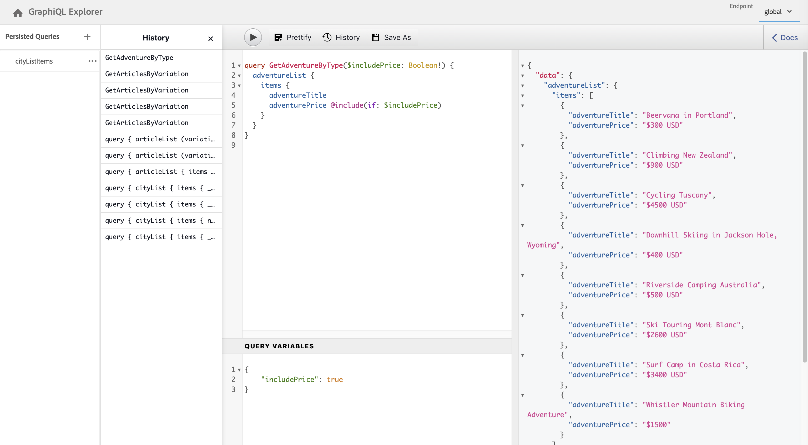

# API de GraphQL de AEM para su uso con fragmentos de contenido {#graphql-api-for-use-with-content-fragments}

Aprenda a utilizar los fragmentos de contenido en Adobe Experience Manager AEM AEM () con la API de GraphQL de la para la entrega de contenido sin encabezado.

AEM La API de GraphQL utilizada con fragmentos de contenido se basa principalmente en la API de GraphQL estándar de código abierto.

El uso de la API de GraphQL en AEM permite la entrega eficiente de fragmentos de contenido a clientes JavaScript en implementaciones de CMS sin encabezado:

* Evita solicitudes de API iterativas como con REST,
* Garantiza que la entrega se limite a los requisitos específicos,
* Permite la entrega masiva de exactamente lo que se necesita para procesar como respuesta a una sola consulta de API.

>[!NOTE]
>
>GraphQL se utiliza en dos escenarios (independientes) en Adobe Experience Manager AEM ():
>
>* [AEM Commerce consume datos de una plataforma de Commerce a través de GraphQL](/help/commerce/cif/integrating/magento.md).
>* Los fragmentos de contenido de AEM trabajan junto con la API de GraphQL de AEM (una implementación personalizada, basada en GraphQL estándar) para ofrecer contenido estructurado para su uso en aplicaciones.

## Requisitos previos {#prerequisites}

Los clientes que utilizan GraphQL AEM deben instalar el fragmento de contenido de la aplicación con el paquete de índice 1.0.5 de GraphQL. Consulte la [Notas de versión](/help/release-notes/release-notes.md#install-aem-graphql-index-add-on-package) para obtener más información.

## La API de GraphQL {#graphql-api}

GraphQL es:

* “*...un idioma de consulta para API y un tiempo de ejecución para cumplir esas consultas con los datos existentes. GraphQL proporciona una descripción completa y comprensible de los datos de su API. Ofrece a los clientes la posibilidad de preguntar exactamente lo que necesitan y nada más, facilita la evolución de las API con el paso del tiempo y habilita potentes herramientas para desarrolladores.*&quot;.

  Consulte [GraphQL.org](https://graphql.org)

* “*...una especificación abierta para una capa de API flexible. Coloque GraphQL sobre los backends existentes para poder crear productos más rápido que nunca....*&quot;.

  Consulte [Exploración de GraphQL](https://graphql.com/).

* *&quot;...una especificación y lenguaje de consulta de datos desarrollado internamente por Facebook en 2012, antes de pasar a ser de código abierto público en 2015. Proporciona una alternativa a las arquitecturas basadas en REST con el propósito de aumentar la productividad del desarrollador y minimizar las cantidades de datos transferidos. Cientos de organizaciones de todos los tamaños utilizan GraphQL en producción...”*

  Consulte [Fundamentos de GraphQL](https://graphql.org/foundation).

<!--
"*Explore GraphQL is maintained by the Apollo team. Our goal is to give developers and technical leaders around the world all the tools they need to understand and adopt GraphQL.*". 
-->

Para obtener más información sobre la API de GraphQL, consulte las siguientes secciones (entre muchos otros recursos):

* En [graphql.org](https://graphql.org):

   * [Introducción a GraphQL](https://graphql.org/learn)

   * [Especificación de GraphQL](https://spec.graphql.org/)

* En [graphql.com](https://graphql.com):

   * [Tutoriales](https://graphql.com/tutorials/)


La implementación de GraphQL AEM para la ™ se basa en la biblioteca Java estándar de GraphQL. Consulte:

* [graphQL.org: Java](https://graphql.org/code/#java)

* [GraphQL Java™ en GitHub](https://github.com/graphql-java)

### Terminología de GraphQL {#graphql-terminology}

GraphQL utiliza lo siguiente:

* **[Consultas](https://graphql.org/learn/queries/)**

* **[Esquemas y tipos](https://graphql.org/learn/schema/)**:

   * AEM genera los esquemas basándose en los modelos de fragmentos de contenido.
   * Con sus esquemas, GraphQL presenta los tipos y operaciones permitidos para la implementación de GraphQL para AEM.

* **[Campos](https://graphql.org/learn/queries/#fields)**

* **[Punto de conexión de GraphQL](/help/sites-developing/headless/graphql-api/graphql-endpoint.md#graphql-aem-endpoint)**
   * La ruta en AEM que responde a las consultas de GraphQL y proporciona acceso a los esquemas de GraphQL.

   * Consulte [Activación del punto de conexión de GraphQL](/help/sites-developing/headless/graphql-api/graphql-endpoint.md#enabling-graphql-endpoint) para obtener más información.

Consulte la [Introducción a GraphQL (GraphQL.org)](https://graphql.org/learn/) para obtener información detallada, incluidas las [Prácticas recomendadas](https://graphql.org/learn/best-practices/).

### Tipos de consulta de GraphQL {#graphql-query-types}

Con GraphQL puede realizar consultas para devolver lo siguiente:

* Una **entrada única**

* Una **[lista de entradas](https://graphql.org/learn/schema/#lists-and-non-null)**

AEM proporciona capacidades para convertir consultas (ambos tipos) a [Consultas persistentes](/help/sites-developing/headless/graphql-api/persisted-queries.md) que Dispatcher y la CDN almacenan en caché.

### Prácticas recomendadas para consultas de GraphQL (Dispatcher y CDN) {#graphql-query-best-practices}

[Consultas persistentes](/help/sites-developing/headless/graphql-api/persisted-queries.md) son el método recomendado para utilizar en instancias de publicación como:

* Se almacenan en caché.
* AEM se gestionan centralmente mediante el sistema de gestión de la

<!-- is this fully accurate? -->
>[!NOTE]
>
>Normalmente, no hay ninguna instancia de Dispatcher/CDN en el autor, por lo que no hay ninguna mejora de rendimiento en el uso de consultas persistentes allí; aparte de probarlas.

No se recomiendan las consultas GraphQL que utilizan peticiones POST, ya que no se almacenan en caché, por lo que en una instancia predeterminada, Dispatcher está configurado para bloquear dichas consultas.

Aunque GraphQL también admite solicitudes de GET, estas solicitudes pueden alcanzar límites (por ejemplo, la longitud de la dirección URL) que se pueden evitar utilizando consultas persistentes.

Consulte [Habilitar el almacenamiento en caché de consultas persistentes](#enable-caching-persisted-queries) para obtener más información.

>[!NOTE]
>
>La capacidad de realizar consultas directas puede quedar obsoleta en algún momento futuro.

## Interfaz de GraphiQL {#graphiql-interface}

Una implementación de la norma [GraphiQL](https://graphql.org/learn/serving-over-http/#graphiql) AEM La interfaz de está disponible para su uso con GraphQL de.

>[!NOTE]
>
>AEM GraphiQL se incluye en todos los entornos de (pero solo es accesible/visible al configurar los extremos).
>
>En versiones anteriores, necesitaba un paquete para instalar el IDE de GraphiQL. Si tiene este paquete instalado, ahora se puede eliminar.

Esta interfaz le permite introducir y probar consultas directamente.

Por ejemplo:

* `http://localhost:4502/content/graphiql.html`

Proporciona funciones como resaltado de sintaxis, autocompletado o autosugerencia, junto con un historial y documentación en línea:


>[!NOTE]
>
>Consulte [Uso del IDE de GraphiQL](/help/sites-developing/headless/graphql-api/graphiql-ide.md).

## Casos de uso para entornos de creación y publicación {#use-cases-author-publish-environments}

AEM Los casos de uso pueden depender del tipo de entorno de:

* Entorno de publicación; se usa para:
   * Datos de consulta para la aplicación JS (caso de uso estándar)

* Entorno de creación; se usa para:
   * Datos de consulta para “fines de administración de contenido”:
      * GraphQL AEM en la es una API de solo lectura.
      * La API de REST se puede utilizar para operaciones CR(u)D.

## Permisos {#permission}

Los permisos son necesarios para acceder a Assets.

Las consultas de GraphQL AEM se ejecutan con el permiso del usuario de la solicitud subyacente que se ha creado en la página de la aplicación. Si el usuario no tiene acceso de lectura a algunos fragmentos (almacenados como Recursos), no forman parte del conjunto de resultados.

Además, el usuario debe tener acceso a un extremo de GraphQL para poder ejecutar consultas de GraphQL.

## Generación de esquemas {#schema-generation}

GraphQL es una API con tipo, lo que significa que los datos deben estar claramente estructurados y organizados por tipo.

La especificación de GraphQL proporciona una serie de directrices sobre cómo crear una API robusta para buscar datos en una instancia determinada. Para completar estas directrices, un cliente debe recuperar la variable [Esquema](#schema-generation), que contiene todos los tipos necesarios para una consulta.

Para los fragmentos de contenido, los esquemas (estructura y tipos) de GraphQL se basan en [Modelos de fragmentos de contenido](/help/assets/content-fragments/content-fragments-models.md) **habilitados** y sus tipos de datos.

>[!CAUTION]
>
>Todos los esquemas de GraphQL (derivados de los modelos de fragmentos de contenido que se han **habilitado**) se pueden leer a través del punto de conexión de GraphQL.
>
>Esta capacidad significa que debe asegurarse de que no hay datos confidenciales disponibles, ya que podrían filtrarse de esta manera. Por ejemplo, incluye información que podría estar presente como nombres de campo en la definición del modelo.

Por ejemplo, si un usuario crea un modelo de fragmento de contenido denominado `Article`, luego AEM genera un tipo de GraphQL `ArticleModel`. Los campos dentro de este tipo corresponden a los campos y tipos de datos definidos en el modelo. Además, crea algunos puntos de entrada para las consultas que funcionan en este tipo, como `articleByPath` o `articleList`.

1. Un modelo de fragmento de contenido:

   

1. El esquema correspondiente de GraphQL (salida de la documentación automática de GraphiQL):
   

   Esta imagen muestra que el tipo generado `ArticleModel` contiene varios [campos](#fields).

   * Tres de ellos han sido controlados por el usuario: `author`, `main`, y `referencearticle`.

   * AEM Los demás campos se añadieron automáticamente mediante la creación de segmentos y representan métodos útiles para proporcionar información acerca de un determinado fragmento de contenido. En este ejemplo, (la variable [campos de ayuda](#helper-fields)) `_path`, `_metadata`, `_variations`.

1. Después de que un usuario cree un fragmento de contenido basado en el modelo de artículo, se puede buscar a través de GraphQL. Para ver ejemplos, consulte las [Consultas de muestra](/help/sites-developing/headless/graphql-api/content-fragments-graphql-samples.md#graphql-sample-queries) (basadas en una [estructura de fragmentos de contenido de muestra para usar con GraphQL](/help/sites-developing/headless/graphql-api/content-fragments-graphql-samples.md#content-fragment-structure-graphql)).

En GraphQL para AEM, el esquema es flexible. Esta flexibilidad significa que se genera automáticamente cada vez que se crea, actualiza o elimina un modelo de fragmento de contenido. Las cachés del esquema de datos también se refrescan al actualizar el modelo de fragmento de contenido.

El servicio Sites de GraphQL escucha (en segundo plano) cualquier modificación realizada en un modelo de fragmento de contenido. Cuando se detectan actualizaciones, solo se regenera esa parte del esquema. Esta optimización ahorra tiempo y proporciona estabilidad.

Por ejemplo, si:

1. Instala un paquete que contenga `Content-Fragment-Model-1` y `Content-Fragment-Model-2`:

   1. Se generan tipos de GraphQL para `Model-1` y `Model-2`.

1. A continuación, modifique `Content-Fragment-Model-2`:

   1. Solo el `Model-2` El tipo de GraphQL se actualiza.

   1. Considerando `Model-1` permanece igual.

>[!NOTE]
>
>Este detalle es importante tenerlo en cuenta solo en caso de que desee realizar actualizaciones masivas en los modelos de fragmentos de contenido a través de la API de REST o de otro modo.

El esquema se sirve a través del mismo punto de conexión que las consultas de GraphQL, y el cliente gestiona el hecho de que se llama al esquema con la extensión `GQLschema`. Por ejemplo, realizar una `GET` solicitud de `/content/cq:graphql/global/endpoint.GQLschema` da como resultado la salida del esquema con el tipo de contenido: `text/x-graphql-schema;charset=iso-8859-1`.

### Generación de esquemas: modelos no publicados {#schema-generation-unpublished-models}

Cuando los fragmentos de contenido están anidados, puede ocurrir que se publique un modelo de fragmento de contenido principal, pero no un modelo al que se hace referencia.

>[!NOTE]
>
>AEM La interfaz de usuario de evita que esto ocurra, pero si la publicación se realiza mediante programación o con paquetes de contenido, puede ocurrir.

AEM Cuando esto sucede, el usuario genera un error de tipo de *incompleto* Esquema del modelo de fragmento de contenido principal. Significa que la referencia de fragmento, que depende del modelo no publicado, se elimina del esquema.

## Campos {#fields}

Dentro del esquema, hay campos individuales, de dos categorías básicas:

* Campos que genera usted.

  Una selección de [Tipos de datos](#data-types) se utiliza para crear campos en función de cómo configure el modelo de fragmentos de contenido. Los nombres de campo se toman del campo **Nombre de propiedad** del **Tipo de datos**.

   * También está el **Procesar como** configuración que se debe tener en cuenta, ya que los usuarios pueden configurar ciertos tipos de datos. Por ejemplo, un campo de texto de una sola línea se puede configurar para que contenga varios textos de una sola línea eligiendo `multifield` en el menú desplegable.

* GraphQL AEM para la creación de informes también genera varios [campos de ayuda](#helper-fields).

  Estos campos se utilizan para identificar un fragmento de contenido o para obtener más información sobre uno.

### Tipos de datos {#data-types}

GraphQL para AEM admite una lista de tipos. Se representan todos los tipos de datos del modelo de fragmento de contenido compatibles y los tipos de GraphQL correspondientes:

| Modelo de fragmento de contenido: tipo de datos | Tipo de GraphQL | Descripción |
|--- |--- |--- |
| Texto de una sola línea | `String`, `[String]` |  Se utiliza para cadenas simples como nombres de autor y nombres de ubicación. |
| Texto multilínea | `String` |  Se utiliza para generar texto como el cuerpo de un artículo |
| Número |  `Float`, `[Float]` | Se utiliza para mostrar números de coma flotante y números regulares |
| Booleano |  `Boolean` |  Se utiliza para mostrar casillas de verificación → instrucciones simples verdaderas/falsas |
| Fecha y hora | `Calendar` |  Se utiliza para mostrar la fecha y la hora en formato ISO 8086. Según el tipo seleccionado, hay tres variantes disponibles para usar en AEM GraphQL: `onlyDate`, `onlyTime`, `dateTime` |
| Lista desglosada |  `String` |  Se utiliza para mostrar una opción de una lista de opciones definidas en la creación del modelo |
|  Etiquetas |  `[String]` |  Se utiliza para mostrar una lista de cadenas que representan las etiquetas utilizadas en AEM |
| Referencia de contenido |  `String` |  Se utiliza para mostrar la ruta hacia otro recurso en AEM |
| Referencia al fragmento |  *Un tipo de modelo* <br><br>Campo único: `Model` - Tipo de modelo, referenciado directamente <br><br>Multicampo, con un tipo referenciado: `[Model]` - Matriz de tipo `Model`, referenciado directamente desde la matriz <br><br>Multicampo, con varios tipos referenciados: `[AllFragmentModels]` : matriz de todos los tipos de modelo, a la que se hace referencia desde matriz con tipo de unión |  Se utiliza para hacer referencia a uno o más fragmentos de contenido de ciertos tipos de modelo, definidos cuando se creó el modelo |

{style="table-layout:auto"}

### Campos de ayuda {#helper-fields}

Además de los tipos de datos de los campos generados por el usuario, GraphQL AEM para la también genera varios *ayudante* campos para ayudar a identificar un fragmento de contenido o para proporcionar información adicional acerca de un fragmento de contenido.

Estos [campos de ayuda](#helper-fields) se marcan con un `_` que los precede para distinguir entre lo que ha definido el usuario y lo que se ha generado automáticamente.

#### Ruta {#path}

El campo de ruta se utiliza como identificador en AEM GraphQL. Representa la ruta del recurso de fragmento de contenido dentro del repositorio de AEM. Esta ruta se elige como identificador de un fragmento de contenido, porque:

* es único dentro de AEM,
* se puede recuperar fácilmente.

El siguiente código muestra las rutas de todos los fragmentos de contenido creados en función del modelo de fragmento de contenido `Person`.

```graphql
{
  personList {
    items {
      _path
    }
  }
}
```

Para recuperar un solo fragmento de contenido de un tipo específico, también debe determinar primero su ruta. Por ejemplo:

```graphql
{
  authorByPath(_path: "/content/dam/path/to/fragment/john-doe") {
    item {
      _path
      firstName
      name
    }
  }
}
```

Consulte [Consulta de muestra: un solo fragmento de ciudad específico](/help/sites-developing/headless/graphql-api/content-fragments-graphql-samples.md#sample-single-specific-city-fragment).

#### Metadatos {#metadata}

A través de GraphQL, AEM también expone los metadatos de un fragmento de contenido. Los metadatos son la información que describe un fragmento de contenido, como, por ejemplo, lo siguiente:

* el título de un fragmento de contenido
* la ruta de miniaturas
* la descripción de un fragmento de contenido
* y la fecha de creación, entre otras.

Dado que los metadatos se generan mediante el Editor de esquemas y, como tales, no tienen una estructura específica, el tipo de GraphQL `TypedMetaData` se ha implementado para exponer los metadatos de un fragmento de contenido. El `TypedMetaData` expone la información agrupada por los siguientes tipos escalares:

| Campo |
|--- |
| `stringMetadata:[StringMetadata]!` |
| `stringArrayMetadata:[StringArrayMetadata]!` |
| `intMetadata:[IntMetadata]!` |
| `intArrayMetadata:[IntArrayMetadata]!` |
| `floatMetadata:[FloatMetadata]!` |
| `floatArrayMetadata:[FloatArrayMetadata]!` |
| `booleanMetadata:[BooleanMetadata]!` |
| `booleanArrayMetadata:[booleanArrayMetadata]!`  |
| `calendarMetadata:[CalendarMetadata]!` |
| `calendarArrayMetadata:[CalendarArrayMetadata]!` |

Cada tipo escalar representa un único par nombre-valor o una matriz de pares nombre-valor, donde el valor de ese par es del tipo en el que se agrupó.

Por ejemplo, si desea recuperar el título de un fragmento de contenido, esta propiedad es de cadena, por lo que consultaría todos los metadatos de cadena:

Para consultar metadatos:

```graphql
{
  personByPath(_path: "/content/dam/path/to/fragment/john-doe") {
    item {
      _path
      _metadata {
        stringMetadata {
          name
          value
        }
      }
    }
  }
}
```

Puede ver todos los tipos de metadatos de GraphQL si ve el esquema de GraphQL generado. Todos los tipos de modelo tienen el mismo `TypedMetaData`.

>[!NOTE]
>
>**Diferencia entre metadatos normales y de matriz**
>Tenga en cuenta que `StringMetadata` y `StringArrayMetadata` hacen referencia a lo que se almacena en el repositorio, no a cómo se recuperan.
>
>Por ejemplo, llamando a `stringMetadata` , recibirá una matriz de todos los metadatos almacenados en el repositorio como `String`. Y si llamas `stringArrayMetadata`, recibirá una matriz de todos los metadatos almacenados en el repositorio como `String[]`.

Consulte [Consulta de muestra para metadatos: enumera los metadatos de los premios titulados GB](/help/sites-developing/headless/graphql-api/content-fragments-graphql-samples.md#sample-metadata-awards-gb).

#### Variaciones {#variations}

El campo `_variations` se ha implementado para simplificar la consulta de las variaciones que tiene un fragmento de contenido. Por ejemplo:

```graphql
{
  personByPath(_path: "/content/dam/path/to/fragment/john-doe") {
    item {
      _variations
    }
  }
}
```

>[!NOTE]
>
>El `_variations` el campo no contiene un `master` variación, como técnicamente los datos originales (referenciados como *Principal* en la interfaz de usuario) no se considera una variación explícita.

Consulte [Consulta de muestra: todas las ciudades con una variación con nombre](/help/sites-developing/headless/graphql-api/content-fragments-graphql-samples.md#sample-cities-named-variation).

>[!NOTE]
>
>Si la variación dada no existe para un Fragmento de contenido, los datos originales (también conocidos como la variación principal) se devuelven como una predeterminada (alternativa).

<!--
## Security Considerations {#security-considerations}
-->

## Variables de GraphQL {#graphql-variables}

GraphQL permite colocar variables en la consulta. Para obtener más información, consulte [Documentación de GraphQL para variables](https://graphql.org/learn/queries/#variables).

Por ejemplo, para obtener todos los fragmentos de contenido del tipo `Article` que tienen una variación específica, puede especificar la variable `variation` en GraphiQL.


```graphql
### query
query GetArticlesByVariation($variation: String!) {
    articleList(variation: $variation) {
        items {
            _path
            author
            _variations
        }
    }
}
 
### in query variables
{
    "variation": "uk"
}
```

## Directivas de GraphQL {#graphql-directives}

En GraphQL, existe la posibilidad de cambiar la consulta en función de variables, denominadas Directivas de GraphQL.

Por ejemplo, puede incluir el campo `adventurePrice` en una consulta para todos los `AdventureModels`, en función de una variable `includePrice`.



```graphql
### query
query GetAdventureByType($includePrice: Boolean!) {
  adventureList {
    items {
      adventureTitle
      adventurePrice @include(if: $includePrice)
    }
  }
}
 
### in query variables
{
    "includePrice": true
}
```

## Filtrado {#filtering}

También puede utilizar el filtrado en las consultas de GraphQL para devolver datos específicos.

El filtrado utiliza una sintaxis basada en operadores lógicos y expresiones.

La parte más atómica es una sola expresión que se puede aplicar al contenido de un campo determinado. Compara el contenido del campo con un valor constante determinado.

Por ejemplo, la siguiente expresión compararía el contenido del campo con el valor `some text`, y tendrá éxito si el contenido es igual al valor. De lo contrario, la expresión falla.:

```graphql
{
  value: "some text"
  _op: EQUALS
}
```

Los siguientes operadores pueden utilizarse para comparar campos con un determinado valor:

| Operador | Tipos | La expresión es correcta si... |
|--- |--- |--- |
| `EQUALS` | `String`, `ID`, `Boolean` | ... el valor es el mismo que el contenido del campo |
| `EQUALS_NOT` | `String`, `ID` | ... el valor *no* es igual que el contenido del campo |
| `CONTAINS` | `String` | ... el contenido del campo contiene el valor (`{ value: "mas", _op: CONTAINS }` matches `Christmas`, `Xmas`, `master`, ...) |
| `CONTAINS_NOT` | `String` | ... el contenido del campo *no* contiene el valor |
| `STARTS_WITH` | `ID` | ... el ID comienza con un determinado valor (`{ value: "/content/dam/", _op: STARTS_WITH` matches `/content/dam/path/to/fragment`, pero no `/namespace/content/dam/something` |
| `EQUAL` | `Int`, `Float` | ... el valor es el mismo que el contenido del campo |
| `UNEQUAL` | `Int`, `Float` | ... el valor *no* es igual que el contenido del campo |
| `GREATER` | `Int`, `Float` | ... el contenido del campo es mayor que el valor |
| `GREATER_EQUAL` | `Int`, `Float` | ... el contenido del campo es mayor o igual al valor |
| `LOWER` | `Int`, `Float` | ... el contenido del campo es menor que el valor |
| `LOWER_EQUAL` | `Int`, `Float` | ... el contenido del campo es menor o igual que el valor |
| `AT` | `Calendar`, `Date`, `Time` | ... el contenido del campo es el mismo que el valor (incluida la configuración de la zona horaria) |
| `NOT_AT` | `Calendar`, `Date`, `Time` | ... el contenido del campo *no* es igual que el valor |
| `BEFORE` | `Calendar`, `Date`, `Time` | ... el punto en el tiempo indicado por el valor es anterior al indicado por el contenido del campo |
| `AT_OR_BEFORE` | `Calendar`, `Date`, `Time` | ... el punto en el tiempo indicado por el valor es anterior o igual al indicado por el contenido del campo |
| `AFTER` | `Calendar`, `Date`, `Time` | ... el punto en el tiempo indicado por el valor es posterior al indicado por el contenido del campo |
| `AT_OR_AFTER` | `Calendar`, `Date`, `Time` | ... el punto en el tiempo indicado por el valor es posterior o igual al indicado por el contenido del campo |

Algunos tipos también permiten especificar opciones adicionales que modifican cómo se evalúa una expresión:

| Opción | Tipos | Descripción |
|--- |--- |--- |
| `_ignoreCase` | `String` | Omite las mayúsculas y minúsculas de una cadena como, por ejemplo, un valor de `time` matches `TIME`, `time`, `tImE`, ... |
| `_sensitiveness` | `Float` | Permite un cierto margen para que los valores `float` se consideren iguales (para sortear las limitaciones técnicas debidas a la representación interna de los valores `float`; debe evitarse, ya que esta opción podría repercutir negativamente en el rendimiento |

Las expresiones se pueden combinar en un conjunto con la ayuda de un operador lógico (`_logOp`):

* `OR` - el conjunto de expresiones se ejecuta correctamente si al menos una expresión se ejecuta correctamente
* `AND` : el conjunto de expresiones se ejecuta correctamente si todas las expresiones se realizan correctamente (valor predeterminado)

Cada campo se puede filtrar por su propio conjunto de expresiones. Los conjuntos de expresiones de todos los campos mencionados en el argumento de filtro se combinan finalmente con su propio operador lógico.

Una definición de filtro (que se transfiere como el argumento `filter` a una consulta) contiene lo siguiente:

* Una subdefinición para cada campo (se puede acceder al campo a través de su nombre, por ejemplo, hay un `lastName` en el filtro para el `lastName` campo en el Tipo de datos (campo)
* Cada subdefinición contiene la variable `_expressions` , proporcionando el conjunto de expresiones y `_logOp` campo que define el operador lógico con el que se deben combinar las expresiones
* Cada expresión está definida por el valor (campo `value`) y el operador (campo `_operator`), el contenido de un campo debe compararse con

Puede omitir `_logOp` si desea combinar elementos con `AND` y `_operator` si desea comprobar la igualdad, ya que estos valores son predeterminados.

El siguiente ejemplo muestra una consulta completa que filtra todas las personas que tienen un `lastName` de `Provo` o con `sjö`, independientemente del caso:

```graphql
{
  authorList(filter: {
    lastname: {
      _logOp: OR
      _expressions: [
        {
          value: "sjö",
          _operator: CONTAINS,
          _ignoreCase: true
        },
        {
          value: "Provo"
        }
      ]
    }
  }) {
    items {
      lastName
      firstName
    }
  }
}
```

Al ejecutar una consulta de GraphQL con variables opcionales, si un valor específico es **no** Cuando se proporcione para la variable opcional, la variable se omitirá en la evaluación del filtro. Esto significa que los resultados de la consulta contendrán todos los valores, ambos `null` y no `null`, para la propiedad relacionada con la variable de filtro.

>[!NOTE]
>
>Si un `null` el valor es *explícitamente* especificado para dicha variable, el filtro solo coincidirá con `null` valores de la propiedad correspondiente.

Por ejemplo, en la consulta siguiente, donde no se especifica ningún valor para la propiedad `lastName`:

```graphql
query getAuthorsFilteredByLastName($authorLastName: String) {
  authorList(filter:
    {
      lastName: {_expressions: {value: $authorLastName}
      }}) {
    items {
      lastName
    }
  }
}
```

Se devolverán todos los autores:

```graphql
{
  "data": {
    "authorList": {
      "items": [
        {
          "lastName": "Hammer"
        },
        {
          "lastName": "Provo"
        },
        {
          "lastName": "Wester"
        },
        {
          "lastName": null
        },
         ...
      ]
    }
  }
}
```

Aunque también puede filtrar por campos anidados, no se recomienda, ya que puede provocar problemas de rendimiento.

Para ver más ejemplos, consulte lo siguiente:

* detalles de [GraphQL para extensiones de AEM](#graphql-extensions)

* [Ejemplos de consultas que utilizan este contenido y estructura de muestra](/help/sites-developing/headless/graphql-api/content-fragments-graphql-samples.md#graphql-sample-queries-sample-content-fragment-structure)

   * Y el [Contenido y estructura de muestra](/help/sites-developing/headless/graphql-api/content-fragments-graphql-samples.md#content-fragment-structure-graphql) preparados para su uso en consultas de muestra

* [Consultas de muestra basadas en el proyecto WKND](/help/sites-developing/headless/graphql-api/content-fragments-graphql-samples.md#sample-queries-using-wknd-project)

## Ordenación {#sorting}

>[!NOTE]
>
>Para obtener el mejor rendimiento, tenga en cuenta [Actualización de los fragmentos de contenido para paginación y ordenación en el filtrado de GraphQL](/help/sites-developing/headless/graphql-api/graphql-optimized-filtering-content-update.md).

Esta función permite ordenar los resultados de la consulta según un campo especificado.

Los criterios de clasificación son los siguientes:

* es una lista de valores separados por comas que representan la ruta del campo
   * el primer campo de la lista define el orden de clasificación principal
      * el segundo campo se utiliza si dos valores del criterio de ordenación principal son iguales
      * el tercer campo se utiliza si los dos primeros criterios son iguales, etc.
   * notación de puntos, es decir, `field1.subfield.subfield`, etc.
* una dirección de orden opcional
   * ASC (de subida) o DESC (de bajada); ASC se aplica como predeterminado
   * la dirección se puede especificar por campo; esta capacidad significa que puede ordenar un campo en orden ascendente, otro en orden descendente (name, firstName DESC)

Por ejemplo:

```graphql
query {
  authorList(sort: "lastName, firstName") {
    items {
      firstName
      lastName
    }
  }
}
```

Y también:

```graphql
{
  authorList(sort: "lastName DESC, firstName DESC") {
    items {
        lastName
        firstName
    }
  }
}
```

También puede ordenar un campo dentro de un fragmento anidado, utilizando el formato de `nestedFragmentname.fieldname`.

>[!NOTE]
>
>Este formato puede tener un impacto negativo en el rendimiento.

Por ejemplo:

```graphql
query {
  articleList(sort: "authorFragment.lastName")  {
    items {
      title
      authorFragment {
        firstName
        lastName
        birthDay
      }
      slug
    }
  }
}
```

## Paginación {#paging}

>[!NOTE]
>
>Para obtener el mejor rendimiento, tenga en cuenta [Actualización de los fragmentos de contenido para paginación y ordenación en el filtrado de GraphQL](/help/sites-developing/headless/graphql-api/graphql-optimized-filtering-content-update.md).

Esta función permite realizar paginación en los tipos de consulta que devuelven una lista. Se proporcionan dos métodos:

* `offset` y `limit` en una consulta `List`
* `first` y `after` en una consulta `Paginated`

### Consulta de lista: desplazamiento y límite {#list-offset-limit}

En una consulta `...List` puede utilizar `offset` y `limit` para devolver un subconjunto específico de resultados:

* `offset`: especifica el primer conjunto de datos que se va a devolver
* `limit`: especifica el número máximo de conjuntos de datos que se van a devolver

Por ejemplo, para generar la página de resultados que contiene hasta cinco artículos, a partir del quinto artículo de la lista de resultados *completa*:

```graphql
query {
   articleList(offset: 5, limit: 5) {
    items {
      authorFragment {
        lastName
        firstName
      }
    }
  }
}
```

<!-- When available link to BP and replace "JCR query level" with a more neutral term. -->

<!-- When available link to BP and replace "JCR query result set" with a more neutral term. -->

>[!NOTE]
>
>* La paginación requiere un orden de clasificación estable para funcionar correctamente en varias consultas que soliciten diferentes páginas del mismo conjunto de resultados. De forma predeterminada, utiliza la ruta del repositorio de cada elemento del conjunto de resultados para asegurarse de que el orden sea siempre el mismo. Si se utiliza un criterio de ordenación diferente y esa ordenación no se puede realizar en el nivel de consulta JCR, el rendimiento se verá afectado negativamente. El motivo es que todo el conjunto de resultados debe cargarse en memoria antes de determinar las páginas.
>
>* Cuanto mayor sea el desplazamiento, más tiempo se tarda en omitir los elementos del conjunto de resultados de la consulta JCR completo. Una solución alternativa para grandes conjuntos de resultados es utilizar la consulta paginada con el método `first` y `after`.

### Consulta paginada: primero y después {#paginated-first-after}

El tipo de consulta `...Paginated` reutiliza la mayoría de las funciones de tipo de consulta `...List` (filtrado, clasificación), pero en lugar de usar argumentos `offset`/`limit`, emplea los argumentos `first`/`after` definidos por [la especificación de las conexiones del cursor de GraphQL](https://relay.dev/graphql/connections.htm). Puede encontrar una introducción menos formal en la [Introducción a GraphQL](https://graphql.org/learn/pagination/#pagination-and-edges).

* `first`: los primeros `n` artículos que se van a devolver.
El valor predeterminado es `50`.
El número máximo es `100`.
* `after`: el cursor que determina el principio de la página solicitada. El elemento representado por el cursor no se incluye en el conjunto de resultados. El cursor de un elemento está determinado por la variable `cursor` del campo `edges` estructura.

Por ejemplo, mostrar la página de resultados que contiene hasta cinco aventuras, empezando por el elemento de cursor dado en la lista de resultados *completa*:

```graphql
query {
    adventurePaginated(first: 5, after: "ODg1MmMyMmEtZTAzMy00MTNjLThiMzMtZGQyMzY5ZTNjN2M1") {
        edges {
          cursor
          node {
            title
          }
        }
        pageInfo {
          endCursor
          hasNextPage
        }
    }
}
```

<!-- When available link to BP -->
<!-- Due to internal technical constraints, performance will degrade if sorting and filtering is applied on nested fields. Therefore it is recommended to use filter/sort fields stored at root level. For more information, see the [Best Practices document](link). -->

>[!NOTE]
>
>* De forma predeterminada, la paginación utiliza el UUID del nodo del repositorio que representa el fragmento para ordenar, a fin de garantizar que el orden de los resultados siempre sea el mismo. Cuando se utiliza `sort`, el UUID se utiliza implícitamente para garantizar una clasificación única; incluso para dos elementos con claves de clasificación idénticas.
>
>* Debido a restricciones técnicas internas, el rendimiento se degrada si se aplican la ordenación y el filtrado en los campos anidados. Por lo tanto, utilice los campos de filtro/ordenación almacenados en el nivel raíz. Esta técnica también es la recomendada si desea consultar conjuntos de resultados paginados grandes.

## Consultas persistentes de GraphQL: habilitar el almacenamiento en caché en Dispatcher {#graphql-persisted-queries-enabling-caching-dispatcher}

>[!CAUTION]
>
>Si el almacenamiento en caché en Dispatcher está habilitado, la variable [Filtro CORS](#cors-filter) no es necesario y, por lo tanto, esa sección se puede ignorar.

El almacenamiento en caché de consultas persistentes no está habilitado de forma predeterminada en Dispatcher. La activación predeterminada no es posible, ya que los clientes que utilizan CORS (Intercambio de recursos de origen cruzado) con varios orígenes deben revisar y posiblemente actualizar su configuración de Dispatcher.

>[!NOTE]
>
>Dispatcher no almacena en caché el `Vary` encabezado.
>
>El almacenamiento en caché de otros encabezados relacionados con CORS se puede habilitar en Dispatcher, pero puede ser insuficiente cuando hay varios orígenes CORS.

### Habilitar el almacenamiento en caché de consultas persistentes {#enable-caching-persisted-queries}

Para habilitar el almacenamiento en caché de consultas persistentes, se requieren las siguientes actualizaciones de los archivos de configuración de Dispatcher:

* `<conf.d/rewrites/base_rewrite.rules>`

  ```xml
  # Allow the dispatcher to be able to cache persisted queries - they need an extension for the cache file
  RewriteCond %{REQUEST_URI} ^/graphql/execute.json
  RewriteRule ^/(.*)$ /$1;.json [PT] 
  ```

  >[!NOTE]
  >
  >Dispatcher agrega el sufijo `.json` a todas las direcciones URL de consulta persistentes, de modo que el resultado se pueda almacenar en caché.
  >
  >Esto sirve para garantizar que la consulta se ajuste a los requisitos de Dispatcher para los documentos que se pueden almacenar en caché. Para obtener más información, consulte [¿Cómo devuelve documentos Dispatcher?](https://experienceleague.adobe.com/docs/experience-manager-dispatcher/using/troubleshooting/dispatcher-faq.html#how-does-the-dispatcher-return-documents%3F)

* `<conf.dispatcher.d/filters/ams_publish_filters.any>`

  ```xml
  # Allow GraphQL Persisted Queries & preflight requests
  /0110 { /type "allow" /method '(GET|POST|OPTIONS)' /url "/graphql/execute.json*" }
  ```

### Configuración de CORS en Dispatcher {#cors-configuration-in-dispatcher}

Es posible que los clientes que utilizan solicitudes CORS tengan que revisar y actualizar su configuración CORS en Dispatcher.

* El `Origin` AEM no se debe pasar a la publicación mediante la interfaz de usuario de Dispatcher para que la publique:
   * Compruebe la `clientheaders.any` archivo.
* En su lugar, las solicitudes CORS deben evaluarse para detectar orígenes permitidos en el nivel de Dispatcher. Este enfoque también garantiza que los encabezados relacionados con CORS se establezcan correctamente, en un solo lugar, en todos los casos.
   * Esta configuración debe agregarse al `vhost` archivo. A continuación se muestra un ejemplo de configuración; para simplificar, solo se ha proporcionado la parte relacionada con CORS. Puede adaptarlo para sus casos de uso específicos.

  ```xml
  <VirtualHost *:80>
     ServerName "publish"
  
     # ...
  
     <IfModule mod_headers.c>
         Header add X-Vhost "publish"
  
          ################## Start of the CORS specific configuration ##################
  
          SetEnvIfExpr "req_novary('Origin') == ''"  CORSType=none CORSProcessing=false
          SetEnvIfExpr "req_novary('Origin') != ''"  CORSType=cors CORSProcessing=true CORSTrusted=false
  
          SetEnvIfExpr "req_novary('Access-Control-Request-Method') == '' && %{REQUEST_METHOD} == 'OPTIONS' && req_novary('Origin') != ''  " CORSType=invalidpreflight CORSProcessing=false
          SetEnvIfExpr "req_novary('Access-Control-Request-Method') != '' && %{REQUEST_METHOD} == 'OPTIONS' && req_novary('Origin') != ''  " CORSType=preflight CORSProcessing=true CORSTrusted=false
          SetEnvIfExpr "req_novary('Origin') -strcmatch 'https://%{HTTP_HOST}*'"  CORSType=samedomain CORSProcessing=false
  
          # For requests that require CORS processing, check if the Origin can be trusted
          SetEnvIfExpr "%{HTTP_HOST} =~ /(.*)/ " ParsedHost=$1
  
          ################## Adapt the regex to match CORS origin for your environment
          SetEnvIfExpr "env('CORSProcessing') == 'true' && req_novary('Origin') =~ m#(https://.*.your-domain.tld(:\d+)?$)#" CORSTrusted=true
  
          # Extract the Origin header 
          SetEnvIfNoCase ^Origin$ ^https://(.*)$ CORSTrustedOrigin=https://$1
  
          # Flush If already set
          Header unset Access-Control-Allow-Origin
          Header unset Access-Control-Allow-Credentials
  
          # Trusted
          Header always set Access-Control-Allow-Credentials "true" "expr=reqenv('CORSTrusted') == 'true'"
          Header always set Access-Control-Allow-Origin "%{CORSTrustedOrigin}e" "expr=reqenv('CORSTrusted') == 'true'"
          Header always set Access-Control-Allow-Methods "GET" "expr=reqenv('CORSTrusted') == 'true'"
          Header always set Access-Control-Max-Age 1800 "expr=reqenv('CORSTrusted') == 'true'"
          Header always set Access-Control-Allow-Headers "Origin, Accept, X-Requested-With, Content-Type, Access-Control-Request-Method, Access-Control-Request-Headers" "expr=reqenv('CORSTrusted') == 'true'"
  
          # Non-CORS or Not Trusted
          Header unset Access-Control-Allow-Credentials "expr=reqenv('CORSProcessing') == 'false' || reqenv('CORSTrusted') == 'false'"
          Header unset Access-Control-Allow-Origin "expr=reqenv('CORSProcessing') == 'false' || reqenv('CORSTrusted') == 'false'"
          Header unset Access-Control-Allow-Methods "expr=reqenv('CORSProcessing') == 'false' || reqenv('CORSTrusted') == 'false'"
          Header unset Access-Control-Max-Age "expr=reqenv('CORSProcessing') == 'false' || reqenv('CORSTrusted') == 'false'"
  
          # Always vary on origin, even if its not there.
          Header merge Vary Origin
  
          # CORS - send 204 for CORS requests which are not trusted
          RewriteCond expr "reqenv('CORSProcessing') == 'true' && reqenv('CORSTrusted') == 'false'"
          RewriteRule "^(.*)" - [R=204,L]
  
          ################## End of the CORS specific configuration ##################
  
     </IfModule>
  
     <Directory />
  
         # ...
  
     </Directory>
  
     # ...
  
  </VirtualHost>
  ```

## GraphQL para AEM: resumen de extensiones {#graphql-extensions}

El funcionamiento básico de las consultas con GraphQL para AEM se adhiere a la especificación estándar de GraphQL. Para las consultas de GraphQL AEM con, hay algunas extensiones

* Si necesita un solo resultado:
   * use el nombre del modelo; por ejemplo, ciudad

* Si espera una lista de resultados:
   * añada `List` al nombre del modelo; por ejemplo, `cityList`
   * Consulte [Consulta de muestra: toda la información acerca de todas las ciudades](/help/sites-developing/headless/graphql-api/content-fragments-graphql-samples.md#sample-all-information-all-cities)

  Podrá hacer lo siguiente:

   * [Clasificación de los resultados](#sorting)

      * `ASC`: ascendente
      * `DESC`: descendente

   * Devuelva una página de resultados utilizando lo siguiente:

      * [Una consulta de lista con desplazamiento y límite](/help/sites-developing/headless/graphql-api/content-fragments-graphql-samples.md#list-offset-limit)
      * [Una consulta paginada con primero y después](/help/sites-developing/headless/graphql-api/content-fragments-graphql-samples.md#paginated-first-after)
   * Consulte [Consulta de muestra: toda la información acerca de todas las ciudades](/help/sites-developing/headless/graphql-api/content-fragments-graphql-samples.md#sample-all-information-all-cities)

* El filtro `includeVariations` está incluido en el `List` tipo de consulta. Para recuperar las variaciones de fragmentos de contenido en los resultados de la consulta, la variable `includeVariations` el filtro debe establecerse en `true`.

  >[!CAUTION]
  >El filtro `includeVariations` no se puede usar junto con el campo generado por el sistema `_variation`.

* Si desea utilizar un OR lógico:
   * use ` _logOp: OR`
   * Consulte [Consulta de muestra: todas las personas que tienen el apellido “Jobs” o “Smith”](/help/sites-developing/headless/graphql-api/content-fragments-graphql-samples.md#sample-all-persons-jobs-smith)

* El AND lógico también existe, pero (a menudo) está implícito

* Puede consultar los nombres de campo que se correspondan con los campos del modelo de fragmento de contenido
   * Consulte [Consulta de muestra: detalles completos del CEO y los empleados de una compañía](/help/sites-developing/headless/graphql-api/content-fragments-graphql-samples.md#sample-full-details-company-ceos-employees)

* Además de los campos del modelo, hay algunos campos generados por el sistema (precedidos de guiones bajos):

   * Para el contenido:

      * `_locale`: para revelar el idioma; basado en el Administrador de idiomas
         * Consulte [Consulta de muestra para varios fragmentos de contenido de una configuración regional determinada](/help/sites-developing/headless/graphql-api/content-fragments-graphql-samples.md#sample-wknd-multiple-fragments-given-locale)

      * `_metadata`: para mostrar los metadatos del fragmento
         * Consulte [Consulta de muestra para metadatos: enumera los metadatos de los premios titulados GB](/help/sites-developing/headless/graphql-api/content-fragments-graphql-samples.md#sample-metadata-awards-gb)

      * `_model`: permitir la consulta de un modelo de fragmento de contenido (ruta y título)
         * Consulte [Consulta de muestra para un modelo de fragmento de contenido de un modelo](/help/sites-developing/headless/graphql-api/content-fragments-graphql-samples.md#sample-wknd-content-fragment-model-from-model)

      * `_path`: la ruta al fragmento de contenido dentro del repositorio
         * Consulte [Consulta de muestra: un solo fragmento de ciudad específico](/help/sites-developing/headless/graphql-api/content-fragments-graphql-samples.md#sample-single-specific-city-fragment)

      * `_reference`: para revelar referencias, incluyendo referencias en línea en el Editor de texto enriquecido
         * Consulte [Consulta de muestra para varios fragmentos de contenido con referencias recuperadas previamente](/help/sites-developing/headless/graphql-api/content-fragments-graphql-samples.md#sample-wknd-multiple-fragments-prefetched-references)

      * `_variation`: para mostrar variaciones específicas dentro del fragmento de contenido

        >[!NOTE]
        >
        >Si la variación dada no existe para un Fragmento de contenido, la variación principal se devuelve como una predeterminada (alternativa).

        >[!CAUTION]
        >El campo generado por el sistema `_variation` no se puede usar junto con el filtro `includeVariations`.

         * Consulte [Consulta de muestra: todas las ciudades con una variación con nombre](/help/sites-developing/headless/graphql-api/content-fragments-graphql-samples.md#sample-cities-named-variation)

      * `_tags` : para revelar los ID de los fragmentos de contenido o las variaciones que contienen etiquetas; esta lista es una matriz de `cq:tags` identificadores.

         * Consulte [Consulta de muestra: nombres de todas las ciudades etiquetadas como escapadas](/help/sites-developing/headless/graphql-api/content-fragments-graphql-samples.md#sample-names-all-cities-tagged-city-breaks)
         * Consulte [Consulta de muestra para variaciones de fragmentos de contenido de un modelo determinado que tienen una etiqueta específica adjunta](/help/sites-developing/headless/graphql-api/content-fragments-graphql-samples.md#sample-wknd-fragment-variations-given-model-specific-tag)

        >[!NOTE]
        >
        >Las etiquetas también se pueden consultar enumerando los metadatos de un fragmento de contenido.

   * Y operaciones:

      * `_operator`: aplicar operadores específicos; `EQUALS`, `EQUALS_NOT`, `GREATER_EQUAL`, `LOWER`, `CONTAINS`, `STARTS_WITH`
         * Consulte [Consulta de muestra: todas las personas que no tienen el apellido “Jobs”](/help/sites-developing/headless/graphql-api/content-fragments-graphql-samples.md#sample-all-persons-not-jobs)
         * Consulte [Consulta de muestra: todas las aventuras en las que la `_path` comienza con un prefijo específico](/help/sites-developing/headless/graphql-api/content-fragments-graphql-samples.md#sample-wknd-all-adventures-cycling-path-filter)

      * `_apply`: para aplicar condiciones específicas; por ejemplo, `AT_LEAST_ONCE`
         * Consulte [Consulta de muestra: filtre en una matriz con un elemento que deba producirse al menos una vez](/help/sites-developing/headless/graphql-api/content-fragments-graphql-samples.md#sample-array-item-occur-at-least-once)

      * `_ignoreCase`: para ignorar el caso al consultar
         * Consulte [Consulta de muestra: todas las ciudades con SAN en el nombre, sin importar las mayúsculas](/help/sites-developing/headless/graphql-api/content-fragments-graphql-samples.md#sample-all-cities-san-ignore-case)

* Se admiten los tipos de unión de GraphQL:

   * use `... on`
      * Consulte [Consulta de muestra para un fragmento de contenido de un modelo específico con una referencia de contenido](/help/sites-developing/headless/graphql-api/content-fragments-graphql-samples.md#sample-wknd-fragment-specific-model-content-reference)

* Alternativa cuando se consultan fragmentos anidados:

   * Si la variación solicitada no existe en un fragmento anidado, la variable **Principal** se devuelve la variación.

### Filtro CORS {#cors-filter}

>[!CAUTION]
>
>If [se ha habilitado el almacenamiento en caché en Dispatcher](#graphql-persisted-queries-enabling-caching-dispatcher) Por lo tanto, el filtro CORS no es necesario y, por lo tanto, esta sección se puede ignorar.

>[!NOTE]
>
>AEM Para obtener una descripción detallada de la política de uso compartido de recursos CORS en el sector de la, consulte [Comprender el Intercambio de Recursos de Origen Cruzado (CORS)](https://experienceleague.adobe.com/docs/experience-manager-learn/foundation/security/understand-cross-origin-resource-sharing.html?lang=es#understand-cross-origin-resource-sharing-(cors)).

Para acceder al extremo de GraphQL, configure una política CORS en el repositorio Git del cliente. Esta configuración se realiza agregando un archivo de configuración OSGi CORS apropiado para uno o más extremos deseados.

Esta configuración debe especificar un origen de sitio web de confianza `alloworigin` o `alloworiginregexp` para los que se debe conceder acceso.

Por ejemplo, para conceder acceso al extremo de GraphQL y al extremo de consultas persistentes para `https://my.domain` puede utilizar:

```xml
{
  "supportscredentials":true,
  "supportedmethods":[
    "GET",
    "HEAD",
    "POST"
  ],
  "exposedheaders":[
    ""
  ],
  "alloworigin":[
    "https://my.domain"
  ],
  "maxage:Integer":1800,
  "alloworiginregexp":[
    ""
  ],
  "supportedheaders":[
    "Origin",
    "Accept",
    "X-Requested-With",
    "Content-Type",
    "Access-Control-Request-Method",
    "Access-Control-Request-Headers"
  ],
  "allowedpaths":[
    "/content/_cq_graphql/global/endpoint.json",
    "/graphql/execute.json/.*"
  ]
}
```

Si ha configurado una ruta de vanidad para el punto de conexión, también puede utilizarla en `allowedpaths`.

### Filtro de referente {#referrer-filter}

Además de la configuración de CORS, debe configurarse un filtro de referente para permitir el acceso desde hosts de terceros.

Este filtro se realiza añadiendo un archivo de configuración del filtro de referente OSGi adecuado que:

* especifique un nombre de host de sitio web de confianza; o `allow.hosts` o `allow.hosts.regexp`,
* conceda acceso a este nombre de host.

Por ejemplo, para conceder acceso a solicitudes con el referente `my.domain` puede:

```xml
{
    "allow.empty":false,
    "allow.hosts":[
      "my.domain"
    ],
    "allow.hosts.regexp":[
      ""
    ],
    "filter.methods":[
      "POST",
      "PUT",
      "DELETE",
      "COPY",
      "MOVE"
    ],
    "exclude.agents.regexp":[
      ""
    ]
}
```

>[!CAUTION]
>
>Sigue siendo responsabilidad del cliente:
>
>* solo conceder acceso a dominios de confianza
>* asegúrese de que no se expone ninguna información confidencial
>* no utilizar un comodín [*] sintaxis; esta funcionalidad deshabilita el acceso autenticado al extremo de GraphQL y también lo expone a todo el mundo.

>[!CAUTION]
>
>Todos los [esquemas](#schema-generation) GraphQL (derivados de los modelos de fragmento de contenido que se han **habilitado**) se pueden leer a través del punto de conexión de GraphQL.
>
>Esta funcionalidad significa que debe asegurarse de que no hay datos confidenciales disponibles, ya que podrían filtrarse de esta manera. Por ejemplo, incluye información que podría estar presente como nombres de campo en la definición del modelo.

## Autenticación {#authentication}

Consulte [Autenticación para consultas de GraphQL de AEM remotas en fragmentos de contenido](/help/sites-developing/headless/graphql-api/graphql-authentication-content-fragments.md).

## Preguntas frecuentes {#faqs}

Preguntas que han surgido:

1. **P**: “*¿En qué se diferencia la API de GraphQL para AEM de la API Generador de consultas?*”

   * **R**: “*La API de GraphQL de AEM ofrece control total sobre la salida JSON y es un estándar en la industria para consultar contenido.
AEM AEM En el futuro, el tiene previsto invertir en la API de GraphQL de la.*&quot;

## Tutorial: Introducción a AEM Headless y GraphQL {#tutorial}

¿Busca un tutorial práctico? Consulte el tutorial completo [Introducción a AEM Headless y GraphQL](https://experienceleague.adobe.com/docs/experience-manager-learn/getting-started-with-aem-headless/graphql/overview.html?lang=es), que ilustra cómo crear y exponer contenido mediante las API de GraphQL de AEM y consumido por una aplicación externa, en un escenario de CMS sin encabezado.
